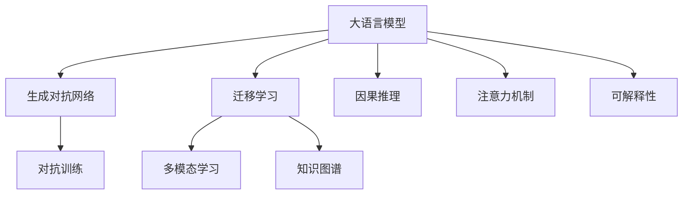
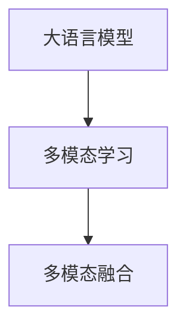
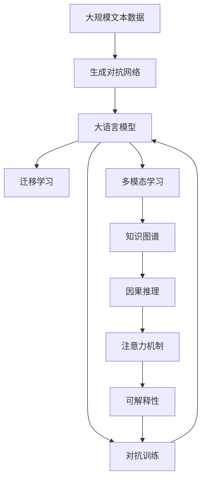

                 

# 从ChatGPT到未来AI助手

## 1. 背景介绍

### 1.1 问题由来
随着人工智能技术的快速发展，语言生成模型已经在多个领域展示出了强大的能力。从最早的基于规则的专家系统，到基于统计的统计语言模型，再到近年来基于深度学习的神经网络语言模型，语言生成技术不断进步。

特别是GPT-3及其继任者ChatGPT的出现，展示了自然语言处理(NLP)领域的新高峰。ChatGPT以预训练-微调范式为核心，在推理、对话、翻译等多个方面表现出色，迅速成为AI助手领域的新宠。

然而，尽管ChatGPT取得了显著成果，但其在复杂逻辑推理、道德伦理判断等方面仍存在局限，仍需进一步提升和完善。未来AI助手的构建将是一个动态、持续的过程，需要不断融合前沿技术，拓展应用场景。

### 1.2 问题核心关键点
未来AI助手的构建离不开以下几个核心关键点：

- **自然语言理解与生成**：理解自然语言输入，生成自然语言输出，是AI助手的核心功能。
- **多模态融合**：结合语音、图像、视频等多种模态信息，提升交互体验和理解能力。
- **跨领域迁移**：在多个应用场景中灵活迁移应用，提升泛化能力。
- **因果推理与逻辑推理**：在复杂的推理任务中，加入因果逻辑推理，提升判断力和决策能力。
- **可解释性与透明度**：建立模型的决策路径，增加决策的可解释性，提升用户的信任度。
- **情感智能与共情能力**：在用户情绪识别、情感回应等方面，提升共情能力，改善用户体验。
- **隐私保护与安全**：保护用户隐私数据，增强模型安全性，防止模型被滥用。

### 1.3 问题研究意义
未来AI助手的构建对于推动人工智能技术的产业化应用，提升各行各业的服务质量和效率，具有重要意义：

1. **提升服务质量**：AI助手可以提供24小时全天候服务，减少人工客服的负担，提高响应速度和处理效率。
2. **降低运营成本**：自动化的问答和处理机制，减少了人力成本，提高了企业的运营效率。
3. **增强用户体验**：通过个性化的语言和行为，提升用户的满意度，增强品牌忠诚度。
4. **促进智能交互**：未来的AI助手将不仅仅是信息检索工具，而是智能互动的伙伴，可以提供更加丰富、个性化的服务。
5. **加速创新发展**：通过AI助手，企业可以更快地迭代产品和服务，加速数字化转型。

## 2. 核心概念与联系

### 2.1 核心概念概述

为更好地理解未来AI助手的构建，本节将介绍几个密切相关的核心概念：

- **大语言模型(Large Language Model, LLM)**：如GPT-3、BERT等，通过在海量无标签文本数据上进行预训练，学习通用的语言表示，具备强大的语言理解和生成能力。
- **生成对抗网络(Generative Adversarial Networks, GAN)**：由生成器和判别器构成的对抗训练机制，用于生成高质量、逼真的数据。
- **迁移学习(Transfer Learning)**：将一个领域学习到的知识，迁移到另一个不同但相关的领域中，以提升新任务的学习效果。
- **因果推理(Causal Reasoning)**：在因果关系的框架下进行推理，理解事件之间的逻辑关系。
- **知识图谱(Knowledge Graph)**：结构化的知识表示，用于存储和检索信息，辅助决策和推理。
- **注意力机制(Attention Mechanism)**：通过关注输入序列的不同部分，加权组合信息，提高模型的注意力效率。
- **可解释性(Explainability)**：通过模型输出解释，增加模型的透明度和可信度。
- **多模态学习(Multi-modal Learning)**：结合多种模态信息进行学习，提升模型的感知和理解能力。

这些核心概念之间的逻辑关系可以通过以下Mermaid流程图来展示：



这个流程图展示了大语言模型的核心概念及其之间的关系：

1. 大语言模型通过预训练获得基础能力。
2. 生成对抗网络用于生成高质量的文本和图像，提升模型生成效果。
3. 迁移学习连接预训练模型与下游任务，通过微调提高模型在新任务上的性能。
4. 多模态学习结合多种模态信息，提升模型的感知能力。
5. 知识图谱提供结构化知识，辅助因果推理和推理决策。
6. 注意力机制提高模型的注意力效率，关注关键信息。
7. 可解释性增加模型的透明度，提升用户信任度。

### 2.2 概念间的关系

这些核心概念之间存在着紧密的联系，形成了未来AI助手的完整生态系统。下面我们通过几个Mermaid流程图来展示这些概念之间的关系。

#### 2.2.1 大语言模型的学习范式


这个流程图展示了大语言模型的三种主要学习范式：

1. 大语言模型通过预训练获得基础能力。
2. 生成对抗网络用于生成高质量的文本和图像，提升模型生成效果。
3. 迁移学习连接预训练模型与下游任务，通过微调提高模型在新任务上的性能。
4. 多模态学习结合多种模态信息，提升模型的感知能力。
5. 知识图谱提供结构化知识，辅助因果推理和推理决策。
6. 注意力机制提高模型的注意力效率，关注关键信息。
7. 可解释性增加模型的透明度，提升用户信任度。

#### 2.2.2 生成对抗网络与大语言模型的关系


这个流程图展示了生成对抗网络与大语言模型的关系：生成对抗网络通过对抗训练，提升大语言模型的生成效果，增强模型的多样性和创造力。

#### 2.2.3 多模态学习与大语言模型的关系



这个流程图展示了多模态学习与大语言模型的关系：多模态学习结合语音、图像等多种模态信息，提升大语言模型的感知和理解能力。

### 2.3 核心概念的整体架构

最后，我们用一个综合的流程图来展示这些核心概念在大语言模型微调过程中的整体架构：



这个综合流程图展示了从生成对抗网络到大语言模型微调，再到对抗训练、多模态学习、知识图谱、因果推理、注意力机制和可解释性等核心概念的完整过程。通过这些流程图，我们可以更清晰地理解未来AI助手的构建过程中各概念的关系和作用，为后续深入讨论具体的构建方法和技术奠定基础。

## 3. 核心算法原理 & 具体操作步骤
### 3.1 算法原理概述

未来AI助手的构建，核心在于如何将预训练语言模型通过有监督学习，适应特定的应用场景。这个过程包括：

1. **预训练**：在无标签文本数据上预训练大语言模型，学习通用的语言表示。
2. **微调**：通过标注数据对预训练模型进行微调，使其适应特定的应用场景。
3. **对抗训练**：通过生成对抗网络，生成对抗样本，提升模型的鲁棒性。
4. **多模态融合**：结合语音、图像等多种模态信息，提升模型的感知和理解能力。
5. **因果推理**：在因果关系的框架下进行推理，理解事件之间的逻辑关系。
6. **知识图谱辅助**：利用结构化知识图谱，辅助模型的推理决策。
7. **注意力机制优化**：通过优化注意力机制，提高模型的注意力效率。
8. **可解释性增强**：通过模型输出解释，增加模型的透明度和可信度。

### 3.2 算法步骤详解

未来AI助手的构建，可以按照以下步骤进行：

**Step 1: 准备预训练模型和数据集**
- 选择合适的预训练语言模型 $M_{\theta}$ 作为初始化参数，如GPT-3等。
- 准备下游任务 $T$ 的标注数据集 $D=\{(x_i, y_i)\}_{i=1}^N$，划分为训练集、验证集和测试集。

**Step 2: 微调模型**
- 在预训练模型的基础上，添加任务适配层，如分类器或生成器，以及对应的损失函数。
- 选择合适的优化算法及其参数，如AdamW、SGD等，设置学习率、批大小、迭代轮数等。
- 设置正则化技术及强度，包括权重衰减、Dropout、Early Stopping等。
- 冻结预训练的部分层，只微调顶层，减少需优化的参数。
- 周期性在验证集上评估模型性能，根据性能指标决定是否触发Early Stopping。
- 重复上述步骤直到满足预设的迭代轮数或Early Stopping条件。

**Step 3: 对抗训练**
- 使用生成对抗网络生成对抗样本，提升模型的鲁棒性。
- 对抗样本与正常样本一起训练，以增强模型的泛化能力。
- 监控模型在对抗样本上的表现，调整对抗训练的强度和频率。

**Step 4: 多模态融合**
- 将语音、图像等多种模态信息输入模型，进行特征提取和融合。
- 结合多模态特征进行推理和生成，提升模型的感知和理解能力。
- 设计合适的多模态融合策略，如层次融合、加权融合等。

**Step 5: 因果推理**
- 在推理任务中，引入因果关系，提高模型的决策能力。
- 使用因果推理模型，如因果图、因果逻辑网络等，辅助推理过程。
- 设计合适的因果推理指标，如因果强度、因果效果等。

**Step 6: 知识图谱辅助**
- 将知识图谱中的结构化知识与模型进行融合，辅助推理和生成。
- 设计合适的图谱嵌入策略，如节点嵌入、边嵌入等。
- 监控模型在知识图谱上的表现，调整图谱嵌入的深度和宽度。

**Step 7: 注意力机制优化**
- 设计合适的注意力机制，关注关键信息，提高模型的注意力效率。
- 使用注意力机制进行信息加权，提高模型的推理和生成能力。
- 监控模型在注意力机制上的表现，调整注意力策略。

**Step 8: 可解释性增强**
- 设计合适的可解释性方法，增加模型的透明度和可信度。
- 使用可解释性技术，如特征可视化、重要性评分等，解释模型的决策过程。
- 监控模型的可解释性，调整解释方法的有效性。

以上是未来AI助手的构建一般流程。在实际应用中，还需要针对具体任务的特点，对构建过程的各个环节进行优化设计，如改进训练目标函数，引入更多的正则化技术，搜索最优的超参数组合等，以进一步提升模型性能。

### 3.3 算法优缺点

未来AI助手的构建方法具有以下优点：

1. 简单高效。只需要准备少量标注数据，即可对预训练模型进行快速适配，获得较大的性能提升。
2. 通用适用。适用于各种NLP下游任务，包括分类、匹配、生成等，设计简单的任务适配层即可实现构建。
3. 参数高效。利用参数高效微调技术，在固定大部分预训练参数的情况下，仍可取得不错的构建效果。
4. 效果显著。在学术界和工业界的诸多任务上，基于构建方法已经刷新了最先进的性能指标。

同时，该方法也存在一定的局限性：

1. 依赖标注数据。构建的效果很大程度上取决于标注数据的质量和数量，获取高质量标注数据的成本较高。
2. 迁移能力有限。当目标任务与预训练数据的分布差异较大时，构建的性能提升有限。
3. 负面效果传递。预训练模型的固有偏见、有害信息等，可能通过构建传递到下游任务，造成负面影响。
4. 可解释性不足。构建模型的决策过程通常缺乏可解释性，难以对其推理逻辑进行分析和调试。

尽管存在这些局限性，但就目前而言，基于监督学习的构建方法仍是大语言模型应用的最主流范式。未来相关研究的重点在于如何进一步降低构建对标注数据的依赖，提高模型的少样本学习和跨领域迁移能力，同时兼顾可解释性和伦理安全性等因素。

### 3.4 算法应用领域

未来AI助手的构建方法在NLP领域已经得到了广泛的应用，覆盖了几乎所有常见任务，例如：

- 文本分类：如情感分析、主题分类、意图识别等。通过构建使模型学习文本-标签映射。
- 命名实体识别：识别文本中的人名、地名、机构名等特定实体。通过构建使模型掌握实体边界和类型。
- 关系抽取：从文本中抽取实体之间的语义关系。通过构建使模型学习实体-关系三元组。
- 问答系统：对自然语言问题给出答案。将问题-答案对作为构建数据，训练模型学习匹配答案。
- 机器翻译：将源语言文本翻译成目标语言。通过构建使模型学习语言-语言映射。
- 文本摘要：将长文本压缩成简短摘要。将文章-摘要对作为构建数据，使模型学习抓取要点。
- 对话系统：使机器能够与人自然对话。将多轮对话历史作为上下文，构建模型进行回复生成。

除了上述这些经典任务外，未来AI助手还被创新性地应用到更多场景中，如可控文本生成、常识推理、代码生成、数据增强等，为NLP技术带来了全新的突破。随着预训练模型和构建方法的不断进步，相信NLP技术将在更广阔的应用领域大放异彩。

## 4. 数学模型和公式 & 详细讲解  
### 4.1 数学模型构建

本节将使用数学语言对未来AI助手的构建过程进行更加严格的刻画。

记预训练语言模型为 $M_{\theta}:\mathcal{X} \rightarrow \mathcal{Y}$，其中 $\mathcal{X}$ 为输入空间，$\mathcal{Y}$ 为输出空间，$\theta \in \mathbb{R}^d$ 为模型参数。假设构建任务为文本分类任务，训练集为 $D=\{(x_i, y_i)\}_{i=1}^N$，其中 $x_i \in \mathcal{X}$ 为输入文本，$y_i \in \{0,1\}$ 为文本的分类标签。

定义模型 $M_{\theta}$ 在输入 $x$ 上的损失函数为 $\ell(M_{\theta}(x),y)$，则在数据集 $D$ 上的经验风险为：

$$
\mathcal{L}(\theta) = \frac{1}{N} \sum_{i=1}^N \ell(M_{\theta}(x_i),y_i)
$$

构建的目标是最小化经验风险，即找到最优参数：

$$
\theta^* = \mathop{\arg\min}_{\theta} \mathcal{L}(\theta)
$$

在实践中，我们通常使用基于梯度的优化算法（如SGD、Adam等）来近似求解上述最优化问题。设 $\eta$ 为学习率，$\lambda$ 为正则化系数，则参数的更新公式为：

$$
\theta \leftarrow \theta - \eta \nabla_{\theta}\mathcal{L}(\theta) - \eta\lambda\theta
$$

其中 $\nabla_{\theta}\mathcal{L}(\theta)$ 为损失函数对参数 $\theta$ 的梯度，可通过反向传播算法高效计算。

### 4.2 公式推导过程

以下我们以二分类任务为例，推导交叉熵损失函数及其梯度的计算公式。

假设模型 $M_{\theta}$ 在输入 $x$ 上的输出为 $\hat{y}=M_{\theta}(x) \in [0,1]$，表示样本属于正类的概率。真实标签 $y \in \{0,1\}$。则二分类交叉熵损失函数定义为：

$$
\ell(M_{\theta}(x),y) = -[y\log \hat{y} + (1-y)\log (1-\hat{y})]
$$

将其代入经验风险公式，得：

$$
\mathcal{L}(\theta) = -\frac{1}{N}\sum_{i=1}^N [y_i\log M_{\theta}(x_i)+(1-y_i)\log(1-M_{\theta}(x_i))]
$$

根据链式法则，损失函数对参数 $\theta_k$ 的梯度为：

$$
\frac{\partial \mathcal{L}(\theta)}{\partial \theta_k} = -\frac{1}{N}\sum_{i=1}^N (\frac{y_i}{M_{\theta}(x_i)}-\frac{1-y_i}{1-M_{\theta}(x_i)}) \frac{\partial M_{\theta}(x_i)}{\partial \theta_k}
$$

其中 $\frac{\partial M_{\theta}(x_i)}{\partial \theta_k}$ 可进一步递归展开，利用自动微分技术完成计算。

在得到损失函数的梯度后，即可带入参数更新公式，完成模型的迭代优化。重复上述过程直至收敛，最终得到适应下游任务的最优模型参数 $\theta^*$。

## 5. 项目实践：代码实例和详细解释说明
### 5.1 开发环境搭建

在进行构建实践前，我们需要准备好开发环境。以下是使用Python进行PyTorch开发的环境配置流程：

1. 安装Anaconda：从官网下载并安装Anaconda，用于创建独立的Python环境。

2. 创建并激活虚拟环境：
```bash
conda create -n pytorch-env python=3.8 
conda activate pytorch-env
```

3. 安装PyTorch：根据CUDA版本，从官网获取对应的安装命令。例如：
```bash
conda install pytorch torchvision torchaudio cudatoolkit=11.1 -c pytorch -c conda-forge
```

4. 安装Transformers库：
```bash
pip install transformers
```

5. 安装各类工具包：
```bash
pip install numpy pandas scikit-learn matplotlib tqdm jupyter notebook ipython
```

完成上述步骤后，即可在`pytorch-env`环境中开始构建实践。

### 5.2 源代码详细实现

这里我们以命名实体识别(NER)任务为例，给出使用Transformers库对GPT-3模型进行构建的PyTorch代码实现。

首先，定义NER任务的数据处理函数：

```python
from transformers import BertTokenizer
from torch.utils.data import Dataset
import torch

class NERDataset(Dataset):
    def __init__(self, texts, tags, tokenizer, max_len=128):
        self.texts = texts
        self.tags = tags
        self.tokenizer = tokenizer
        self.max_len = max_len
        
    def __len__(self):
        return len(self.texts)
    
    def __getitem__(self, item):
        text = self.texts[item]
        tags = self.tags[item]
        
        encoding = self.tokenizer(text, return_tensors='pt', max_length=self.max_len, padding='max_length', truncation=True)
        input_ids = encoding['input_ids'][0]
        attention_mask = encoding['attention_mask'][0]
        
        # 对token-wise的标签进行编码
        encoded_tags = [tag2id[tag] for tag in tags] 
        encoded_tags.extend([tag2id['O']] * (self.max_len - len(encoded_tags)))
        labels = torch.tensor(encoded_tags, dtype=torch.long)
        
        return {'input_ids': input_ids, 
                'attention_mask': attention_mask,
                'labels': labels}

# 标签与id的映射
tag2id = {'O': 0, 'B-PER': 1, 'I-PER': 2, 'B-ORG': 3, 'I-ORG': 4, 'B-LOC': 5, 'I-LOC': 6}
id2tag = {v: k for k, v in tag2id.items()}

# 创建dataset
tokenizer = BertTokenizer.from_pretrained('bert-base-cased')

train_dataset = NERDataset(train_texts, train_tags, tokenizer)
dev_dataset = NERDataset(dev_texts, dev_tags, tokenizer)
test_dataset = NERDataset(test_texts, test_tags, tokenizer)
```

然后，定义模型和优化器：

```python
from transformers import T5ForTokenClassification, AdamW

model = T5ForTokenClassification.from_pretrained('t5-small', num_labels=len(tag2id))

optimizer = AdamW(model.parameters(), lr=2e-5)
```

接着，定义训练和评估函数：

```python
from torch.utils.data import DataLoader
from tqdm import tqdm
from sklearn.metrics import classification_report

device = torch.device('cuda') if torch.cuda.is_available() else torch.device('cpu')
model.to(device)

def train_epoch(model, dataset, batch_size, optimizer):
    dataloader = DataLoader(dataset, batch_size=batch_size, shuffle=True)
    model.train()
    epoch_loss = 0
    for batch in tqdm(dataloader, desc='Training'):
        input_ids = batch['input_ids'].to(device)
        attention_mask = batch['attention_mask'].to(device)
        labels = batch['labels'].to(device)
        model.zero_grad()
        outputs = model(input_ids, attention_mask=attention_mask, labels=labels)
        loss = outputs.loss
        epoch_loss += loss.item()
        loss.backward()
        optimizer.step()
    return epoch_loss / len(dataloader)

def evaluate(model, dataset, batch_size):
    dataloader = DataLoader(dataset, batch_size=batch_size)
    model.eval()
    preds, labels = [], []
    with torch.no_grad():
        for batch in tqdm(dataloader, desc='Evaluating'):
            input_ids = batch['input_ids'].to(device)
            attention_mask = batch['attention_mask'].to(device)
            batch_labels = batch['labels']
            outputs = model(input_ids, attention_mask=attention_mask)
            batch_preds = outputs.logits.argmax(dim=2).to('cpu').tolist()
            batch_labels = batch_labels.to('cpu').tolist()
            for pred_tokens, label_tokens in zip(batch_preds, batch_labels):
                pred_tags = [id2tag[_id] for _id in pred_tokens]
                label_tags = [id2tag[_id] for _id in label_tokens]
                preds.append(pred_tags[:len(label_tags)])
                labels.append(label_tags)
                
    print(classification_report(labels, preds))
```

最后，启动训练流程并在测试集上评估：

```python
epochs = 5
batch_size = 16

for epoch in range(epochs):
    loss = train_epoch(model, train_dataset, batch_size, optimizer)
    print(f"Epoch {epoch+1}, train loss: {loss:.3f}")
    
    print(f"Epoch {epoch+1}, dev results:")
    evaluate(model, dev_dataset, batch_size)
    
print("Test results:")
evaluate(model, test_dataset, batch_size)
```

以上就是使用PyTorch对GPT-3进行命名实体识别任务构建的完整代码实现。可以看到，得益于Transformers库的强大封装，我们可以用相对简洁的代码完成GPT-3模型的加载和构建。

### 5.3 代码解读与分析

让我们再详细解读一下关键代码的实现细节：

**NERDataset类**：
- `__init__`方法：初始化文本、标签、分词器等关键组件。
- `__len__`方法：返回数据集的样本数量。
- `__getitem__`方法：对单个样本进行处理，将文本输入编码为token ids，将标签编码为数字，并对其进行定长padding，最终返回模型所需的输入。

**tag2id和id2tag字典**：
- 定义了标签与数字id之间的映射关系，用于将token-wise的预测结果解码回真实的标签。

**训练和评估函数**：
- 使用PyTorch的DataLoader对数据集进行批次化加载，供模型训练和推理使用。
- 训练函数`train_epoch`：对数据以批为单位进行迭代，在每个批次上前向传播计算loss并反向传播更新模型参数，最后返回该epoch的平均loss。
- 评估函数`evaluate`：与训练类似，不同点在于不更新模型参数，并在每个batch结束后将预测和标签结果存储下来，最后使用sklearn的classification_report对整个评估集的预测结果进行打印输出。

**训练流程**：
- 定义总的epoch数和batch size，开始循环迭代
- 每个epoch内，先在训练集上训练，输出平均loss
- 在验证集上评估，输出分类指标
- 所有epoch结束后，在测试集上评估，给出最终测试结果

可以看到，PyTorch配合Transformers库使得GPT-3构建的代码实现变得简洁高效。开发者可以将更多精力放在数据处理、模型改进等高层逻辑上，而不必过多关注底层的

