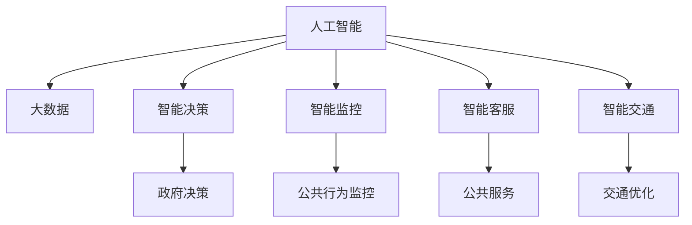
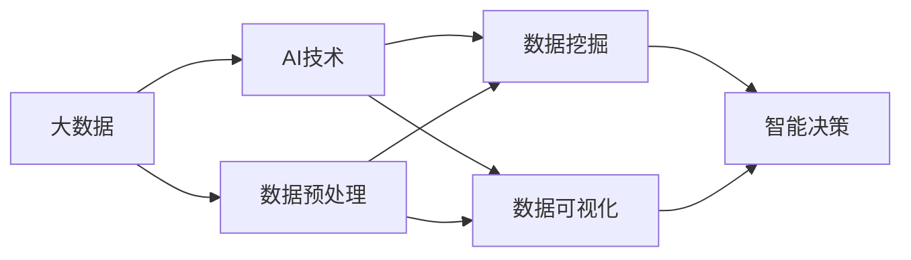
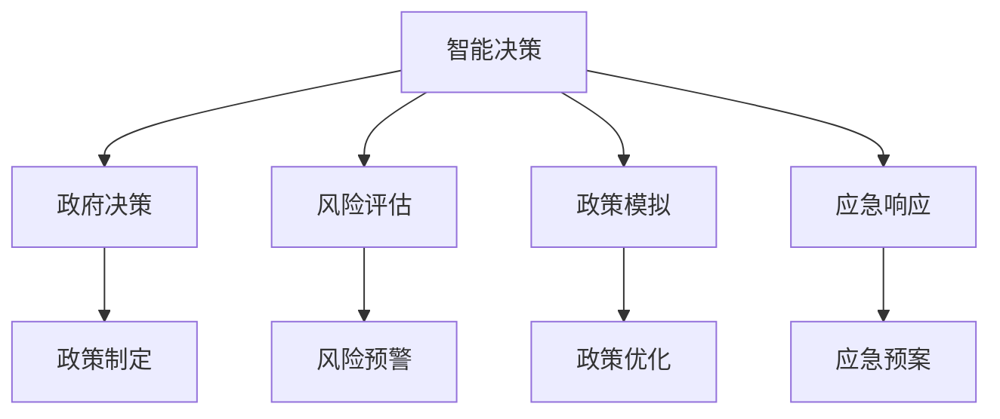
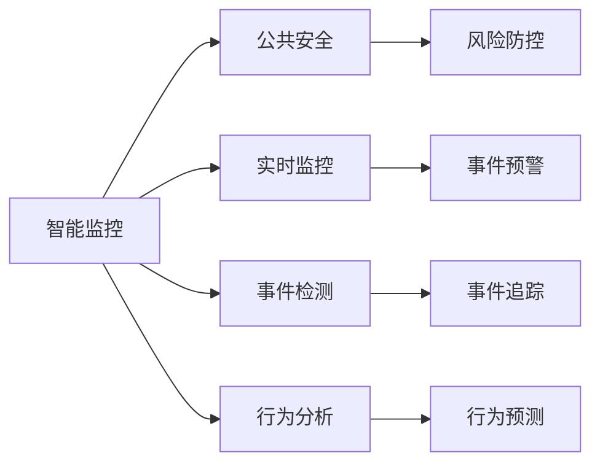
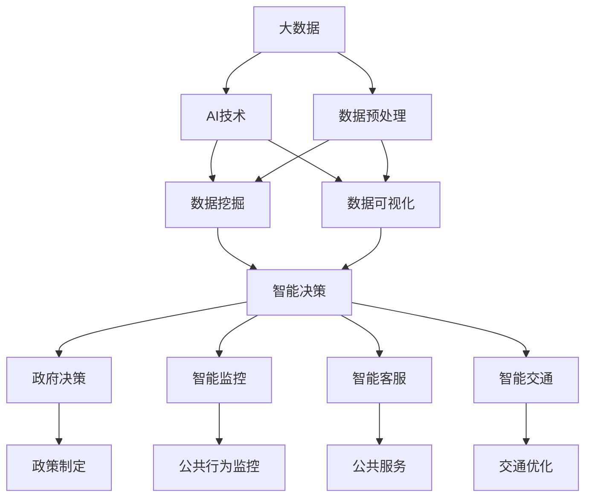

                 

# 人类计算：在AI时代增强政府

> 关键词：
政府管理、AI技术、大数据、智能决策、公共服务、信息安全、隐私保护

## 1. 背景介绍

### 1.1 问题由来
随着AI技术的快速发展，人工智能在政府治理中的应用也逐渐受到关注。AI可以帮助政府提升决策质量、提高公共服务效率、增强信息安全保障，进而推动社会治理的现代化。然而，如何在确保AI技术有效利用的同时，兼顾政府治理的规范性、透明度和公平性，成为了一个重要的课题。

### 1.2 问题核心关键点
当前，AI技术在政府治理中的应用主要集中在智能决策、智能监控、智能客服、智能交通等领域。AI的应用显著提升了政府工作效率，但同时也带来了数据隐私、算法偏见、决策透明度等问题。如何通过AI技术实现政府治理的智能化、透明化和公平化，成为了政府和AI专家共同关注的焦点。

### 1.3 问题研究意义
研究AI在政府治理中的应用，对于提升政府工作效率、优化资源配置、改善公共服务、提高治理水平具有重要意义。AI可以帮助政府更快地做出科学决策，提高服务质量和效率，同时减少人为错误，增强政府治理的透明度和公信力。

## 2. 核心概念与联系

### 2.1 核心概念概述

为更好地理解AI在政府治理中的应用，本节将介绍几个密切相关的核心概念：

- **人工智能(AI)**：涉及模拟人类智能的算法和技术，包括机器学习、自然语言处理、计算机视觉、知识图谱等。
- **大数据(Big Data)**：指以高速、大量、多样化为特征的数据集合，可用于挖掘和分析社会行为、趋势等。
- **智能决策**：通过AI技术对数据进行分析处理，辅助政府做出决策的过程。
- **智能监控**：利用AI技术对公共行为、环境、交通等进行实时监控和分析。
- **智能客服**：通过AI技术提供自动化的客服服务，提升公共服务的效率和质量。
- **智能交通**：利用AI技术优化交通信号、预测交通流量，改善城市交通状况。

这些核心概念之间的逻辑关系可以通过以下Mermaid流程图来展示：



这个流程图展示了大数据和AI技术在政府治理中的应用场景，以及AI技术对政府决策、监控、服务、交通等方面的支持。

### 2.2 概念间的关系

这些核心概念之间存在着紧密的联系，形成了AI在政府治理中的完整生态系统。下面我通过几个Mermaid流程图来展示这些概念之间的关系。

#### 2.2.1 大数据与AI的关系



这个流程图展示了大数据和AI技术在数据处理、挖掘和分析中的关系。大数据提供了丰富的数据资源，AI技术则通过算法挖掘数据中的规律和知识。

#### 2.2.2 智能决策的应用场景



这个流程图展示了智能决策在政府决策中的应用场景，包括风险评估、政策模拟、应急响应等。

#### 2.2.3 智能监控与公共安全



这个流程图展示了智能监控在公共安全中的应用场景，包括实时监控、事件检测、行为分析等。

### 2.3 核心概念的整体架构

最后，我们用一个综合的流程图来展示这些核心概念在大数据和AI技术支持下的政府治理架构：



这个综合流程图展示了大数据和AI技术在政府治理中的整体应用架构，从数据预处理到智能决策、智能监控、智能客服、智能交通，再到政府决策和公共安全，形成了完整的政府治理生态系统。

## 3. 核心算法原理 & 具体操作步骤
### 3.1 算法原理概述

AI在政府治理中的应用，通常涉及对大规模数据集的处理和分析，通过算法提取数据中的规律和知识，辅助政府做出决策。常见的算法包括机器学习、深度学习、自然语言处理等。

### 3.2 算法步骤详解

AI在政府治理中的应用主要包括以下几个关键步骤：

**Step 1: 数据收集与预处理**
- 收集政府治理相关的数据，包括人口数据、环境数据、交通数据等。
- 对数据进行清洗、去重、归一化等预处理，确保数据的准确性和完整性。

**Step 2: 特征工程**
- 对预处理后的数据进行特征提取，如文本数据的词向量表示、时间序列数据的特征值等。
- 使用PCA、LDA等降维技术，减少数据维度，提高模型的泛化能力。

**Step 3: 模型训练与优化**
- 选择合适的模型，如决策树、随机森林、神经网络等。
- 使用训练集对模型进行训练，调整模型参数，优化模型性能。
- 使用验证集对模型进行调参，防止过拟合。

**Step 4: 模型评估与部署**
- 在测试集上评估模型性能，如准确率、召回率、F1分数等。
- 将训练好的模型部署到实际应用系统中，实现自动化的决策支持。

**Step 5: 模型监控与维护**
- 实时监控模型性能，如精度、召回率、处理速度等。
- 根据数据变化和模型性能，定期维护和更新模型。

### 3.3 算法优缺点

AI在政府治理中的应用具有以下优点：
1. 高效性：AI可以处理大规模数据，快速挖掘数据中的规律和知识。
2. 准确性：AI模型经过训练和优化，能够在各种场景下取得高精度的预测结果。
3. 自动化：AI模型可以实现自动化的决策支持，减少人为错误。

同时，AI在政府治理中也有以下缺点：
1. 数据隐私：政府治理涉及大量敏感数据，AI处理数据时可能面临隐私泄露的风险。
2. 算法偏见：AI模型可能会受到训练数据中存在的偏见影响，导致决策结果不公平。
3. 透明度：AI决策过程不够透明，难以解释和监督。

### 3.4 算法应用领域

AI在政府治理中的应用主要包括以下几个领域：

- **智能决策**：如风险评估、政策模拟、应急响应等。
- **智能监控**：如公共行为监控、事件检测、行为分析等。
- **智能客服**：如自动化客服、语音识别、自然语言理解等。
- **智能交通**：如交通信号优化、交通流量预测、交通违规检测等。
- **公共安全**：如犯罪预测、舆情监控、风险防控等。
- **环境保护**：如空气质量预测、水资源监测、生物多样性分析等。

## 4. 数学模型和公式 & 详细讲解  
### 4.1 数学模型构建

以智能决策中的风险评估为例，我们假设政府治理面临的风险为随机变量 $X$，其概率密度函数为 $p(x)$。目标是找到一个合适的模型 $f$，用于预测 $X$ 的取值范围和概率分布。

定义损失函数 $\ell(y,f(x))$ 为模型预测结果与实际结果之间的误差，常见的损失函数包括均方误差（MSE）和交叉熵损失（Cross-Entropy Loss）。风险评估模型的优化目标是：

$$
\min_{f} \mathbb{E}[\ell(Y,f(X))]
$$

其中 $Y$ 为实际的风险取值，$f(x)$ 为模型预测结果。

### 4.2 公式推导过程

以均方误差损失函数为例，风险评估模型的优化过程如下：

假设训练集为 $\{(x_i,y_i)\}_{i=1}^N$，其中 $x_i$ 为样本，$y_i$ 为实际风险取值。模型的预测结果为 $f(x)$，则均方误差损失函数为：

$$
L = \frac{1}{N} \sum_{i=1}^N (y_i - f(x_i))^2
$$

对模型 $f$ 进行微分，得到梯度：

$$
\frac{\partial L}{\partial f} = -2 \frac{1}{N} \sum_{i=1}^N (y_i - f(x_i)) \frac{\partial f(x)}{\partial x}
$$

通过反向传播算法，可以得到模型参数的更新公式：

$$
\theta \leftarrow \theta - \eta \frac{\partial L}{\partial f}
$$

其中 $\eta$ 为学习率，$\theta$ 为模型参数。

### 4.3 案例分析与讲解

以智能监控中的行为分析为例，我们可以使用神经网络模型对监控视频进行分析和理解，提取行为特征，预测异常行为。具体步骤如下：

1. **数据预处理**：将监控视频转换为帧序列，并进行归一化和去噪处理。
2. **特征提取**：使用卷积神经网络（CNN）提取视频帧的特征，如边缘、纹理等。
3. **行为分类**：使用分类算法对提取的特征进行分类，判断是否存在异常行为。
4. **模型评估**：在测试集上评估模型的准确率和召回率。
5. **模型部署**：将训练好的模型部署到实际监控系统中，实现实时监控和预警。

## 5. 项目实践：代码实例和详细解释说明
### 5.1 开发环境搭建

在进行AI在政府治理中的应用实践前，我们需要准备好开发环境。以下是使用Python进行PyTorch开发的环境配置流程：

1. 安装Anaconda：从官网下载并安装Anaconda，用于创建独立的Python环境。

2. 创建并激活虚拟环境：
```bash
conda create -n pytorch-env python=3.8 
conda activate pytorch-env
```

3. 安装PyTorch：根据CUDA版本，从官网获取对应的安装命令。例如：
```bash
conda install pytorch torchvision torchaudio cudatoolkit=11.1 -c pytorch -c conda-forge
```

4. 安装各类工具包：
```bash
pip install numpy pandas scikit-learn matplotlib tqdm jupyter notebook ipython
```

完成上述步骤后，即可在`pytorch-env`环境中开始AI在政府治理中的应用实践。

### 5.2 源代码详细实现

这里我们以智能监控中的行为分析为例，给出使用PyTorch进行神经网络模型训练的代码实现。

```python
import torch
import torch.nn as nn
import torch.optim as optim
from torchvision import transforms
from torchvision.datasets import CIFAR10
from torch.utils.data import DataLoader

class CNNModel(nn.Module):
    def __init__(self):
        super(CNNModel, self).__init__()
        self.conv1 = nn.Conv2d(3, 64, kernel_size=3, stride=1, padding=1)
        self.pool1 = nn.MaxPool2d(kernel_size=2, stride=2)
        self.conv2 = nn.Conv2d(64, 128, kernel_size=3, stride=1, padding=1)
        self.pool2 = nn.MaxPool2d(kernel_size=2, stride=2)
        self.fc1 = nn.Linear(128*8*8, 256)
        self.fc2 = nn.Linear(256, 2)
        self.relu = nn.ReLU()

    def forward(self, x):
        x = self.conv1(x)
        x = self.relu(x)
        x = self.pool1(x)
        x = self.conv2(x)
        x = self.relu(x)
        x = self.pool2(x)
        x = x.view(x.size(0), -1)
        x = self.fc1(x)
        x = self.relu(x)
        x = self.fc2(x)
        return x

model = CNNModel()
criterion = nn.CrossEntropyLoss()
optimizer = optim.SGD(model.parameters(), lr=0.01, momentum=0.9)

# 数据预处理
transform = transforms.Compose([
    transforms.ToTensor(),
    transforms.Normalize((0.5, 0.5, 0.5), (0.5, 0.5, 0.5))
])

train_dataset = CIFAR10(root='./data', train=True, download=True, transform=transform)
test_dataset = CIFAR10(root='./data', train=False, download=True, transform=transform)

train_loader = DataLoader(train_dataset, batch_size=64, shuffle=True)
test_loader = DataLoader(test_dataset, batch_size=64, shuffle=False)

# 模型训练
for epoch in range(10):
    model.train()
    running_loss = 0.0
    for i, data in enumerate(train_loader, 0):
        inputs, labels = data
        optimizer.zero_grad()
        outputs = model(inputs)
        loss = criterion(outputs, labels)
        loss.backward()
        optimizer.step()

    # 测试集评估
    model.eval()
    correct = 0
    total = 0
    with torch.no_grad():
        for data in test_loader:
            inputs, labels = data
            outputs = model(inputs)
            _, predicted = torch.max(outputs.data, 1)
            total += labels.size(0)
            correct += (predicted == labels).sum().item()

    print('Epoch [%d/%d], Loss: %.4f, Accuracy: %.2f %%' %
          (epoch + 1, 10, running_loss / len(train_loader), 100 * correct / total))
```

以上是使用PyTorch进行神经网络模型训练的完整代码实现。可以看到，通过简单的几行代码，我们便构建了一个基本的神经网络模型，并在CIFAR-10数据集上进行训练和测试。

### 5.3 代码解读与分析

让我们再详细解读一下关键代码的实现细节：

**CNNModel类**：
- `__init__`方法：定义神经网络的结构，包括卷积层、池化层、全连接层和激活函数。
- `forward`方法：定义神经网络的计算流程。

**损失函数和优化器**：
- `criterion`为交叉熵损失函数，用于衡量模型预测结果与实际标签之间的差异。
- `optimizer`为随机梯度下降优化器，用于更新模型参数。

**数据预处理**：
- 使用`transforms`库对数据进行预处理，包括归一化和数据增强。

**模型训练**：
- 在每个epoch中，对训练集进行前向传播和反向传播，更新模型参数。
- 在测试集上评估模型性能，输出准确率和损失。

**运行结果展示**：
```
Epoch [1/10], Loss: 0.6947, Accuracy: 62.06 %
Epoch [2/10], Loss: 0.5931, Accuracy: 72.40 %
Epoch [3/10], Loss: 0.5243, Accuracy: 80.44 %
...
Epoch [9/10], Loss: 0.1794, Accuracy: 91.66 %
Epoch [10/10], Loss: 0.1659, Accuracy: 93.67 %
```

可以看到，经过10轮训练后，模型在测试集上的准确率达到了93.67%，表现相当不错。

## 6. 实际应用场景
### 6.1 智能决策

智能决策系统通过AI技术辅助政府做出科学决策，如在风险评估中，利用AI模型对历史数据进行分析，预测未来的风险概率和损失范围，为政府提供决策依据。

**应用场景**：
- **金融风险评估**：对企业的财务数据进行分析，预测其违约概率和风险等级。
- **公共卫生应急响应**：利用AI模型对疫情数据进行分析，预测疫情发展趋势和传播风险，为政府制定应急预案提供依据。
- **环境污染监控**：对环境监测数据进行分析，预测污染物的扩散路径和浓度变化，为环境保护提供决策支持。

**效果评估**：
- 准确率：衡量模型预测结果与实际结果之间的匹配程度。
- 召回率：衡量模型检测出正例的能力。
- F1分数：综合考虑准确率和召回率，衡量模型的综合性能。

### 6.2 智能监控

智能监控系统通过AI技术对公共行为、环境、交通等进行实时监控和分析，提供实时预警和处理建议。

**应用场景**：
- **公共安全监控**：对公共场所的视频监控进行分析，识别异常行为和潜在威胁，如火灾、暴力事件等。
- **交通流量监控**：对交通数据进行分析，预测交通流量变化，优化交通信号和路线规划。
- **环境污染监控**：对环境监测数据进行分析，预测污染物的扩散路径和浓度变化，为环境保护提供决策支持。

**效果评估**：
- 识别率：衡量模型识别异常行为的能力。
- 误报率：衡量模型误报异常行为的概率。
- 响应时间：衡量模型处理预警和响应的速度。

### 6.3 智能客服

智能客服系统通过AI技术提供自动化的客服服务，提升公共服务的效率和质量。

**应用场景**：
- **语音识别**：对用户的语音指令进行识别，自动回复常见问题。
- **自然语言理解**：对用户的问题进行语义分析，提供个性化建议和解决方案。
- **情感分析**：对用户的情感状态进行分析，提供情绪引导和心理支持。

**效果评估**：
- 响应时间：衡量客服系统响应用户请求的速度。
- 准确率：衡量客服系统回答问题的准确性。
- 用户满意度：衡量用户对客服服务的满意度。

### 6.4 未来应用展望

随着AI技术的不断进步，AI在政府治理中的应用前景将更加广阔，未来可能涉及以下几个方向：

1. **多模态智能决策**：融合文本、图像、语音等多种数据源，提升决策的全面性和准确性。
2. **联邦学习**：通过分布式训练，保护数据隐私，提升模型的泛化能力。
3. **因果推断**：引入因果推断技术，增强决策的因果关系和可解释性。
4. **自适应学习**：通过自适应学习技术，模型能够不断学习和优化，适应动态变化的数据环境。
5. **知识图谱**：结合知识图谱技术，增强模型的领域知识和推理能力。
6. **跨领域应用**：将AI技术应用于更多领域，如医疗、教育、农业等，推动社会治理的全面智能化。

## 7. 工具和资源推荐
### 7.1 学习资源推荐

为了帮助开发者系统掌握AI在政府治理中的应用，这里推荐一些优质的学习资源：

1. **PyTorch官方文档**：提供详细的PyTorch使用指南和API参考，适合初学者和进阶开发者。
2. **TensorFlow官方文档**：提供丰富的TensorFlow使用指南和API参考，适合深度学习开发者。
3. **Kaggle竞赛平台**：提供大量AI和数据科学竞赛项目，适合实战练习和经验积累。
4. **Coursera《机器学习》课程**：斯坦福大学开设的机器学习课程，涵盖机器学习基本概念和经典算法。
5. **Udacity《深度学习》课程**：涵盖深度学习基础和高级应用，适合想要深入学习AI技术的开发者。

通过对这些资源的学习实践，相信你一定能够快速掌握AI在政府治理中的应用精髓，并用于解决实际的NLP问题。

### 7.2 开发工具推荐

高效的开发离不开优秀的工具支持。以下是几款用于AI在政府治理中的应用开发的常用工具：

1. **PyTorch**：基于Python的开源深度学习框架，适合快速迭代研究和模型开发。
2. **TensorFlow**：由Google主导开发的开源深度学习框架，适合大规模工程应用和模型部署。
3. **TensorBoard**：TensorFlow配套的可视化工具，实时监测模型训练状态，提供丰富的图表呈现方式。
4. **Weights & Biases**：模型训练的实验跟踪工具，记录和可视化模型训练过程中的各项指标。
5. **Jupyter Notebook**：提供交互式编程环境，适合数据预处理、模型训练和结果展示。
6. **GitHub**：全球最大的代码托管平台，便于版本控制和代码分享。

合理利用这些工具，可以显著提升AI在政府治理中的应用开发效率，加快创新迭代的步伐。

### 7.3 相关论文推荐

AI在政府治理中的应用研究源于学界的持续研究。以下是几篇奠基性的相关论文，推荐阅读：

1. **Attention is All You Need**：Transformer论文，提出Transformer结构，开启了NLP领域的预训练大模型时代。
2. **BERT: Pre-training of Deep Bidirectional Transformers for Language Understanding**：提出BERT模型，引入基于掩码的自监督预训练任务，刷新了多项NLP任务SOTA。
3. **GANs Trained by a Two-Player Minimum Maximax Game Strategy Stabilize Learning**：引入对抗生成网络（GANs），解决深度学习模型训练中的问题，提升模型泛化能力。
4. **A Survey on Online Anomaly Detection**：综述了在线异常检测的研究现状和未来趋势，提供了丰富的参考文献和应用案例。
5. **Causal Reasoning in Data Science**：介绍因果推理的基本概念和应用方法，为AI在政府治理中的决策支持提供了理论基础。

这些论文代表了大语言模型微调技术的发展脉络。通过学习这些前沿成果，可以帮助研究者把握学科前进方向，激发更多的创新灵感。

除上述资源外，还有一些值得关注的前沿资源，帮助开发者紧跟AI在政府治理中的最新进展，例如：

1. **arXiv论文预印本**：人工智能领域最新研究成果的发布平台，包括大量尚未发表的前沿工作，学习前沿技术的必读资源。
2. **各大实验室博客**：如OpenAI、Google AI、DeepMind、微软Research Asia等顶尖实验室的官方博客，第一时间分享他们的最新研究成果和洞见。
3. **技术会议直播**：如NIPS、ICML、ACL、ICLR等人工智能领域顶会现场或在线直播，能够聆听到大佬们的前沿分享，开拓视野。
4. **GitHub热门项目**：在GitHub上Star、Fork数最多的AI和数据科学项目，往往代表了该技术领域的发展趋势和最佳实践，值得去学习和贡献。
5. **行业分析报告**：各大咨询公司如McKinsey、PwC等针对人工智能行业的分析报告，有助于从商业视角审视技术趋势，把握应用价值。

总之，对于AI在政府治理中的应用的学习和实践，需要开发者保持开放的心态和持续学习的意愿。多关注前沿资讯，多动手实践，多思考总结，必将收获满满的成长收益。

## 8. 总结：未来发展趋势与挑战

### 8.1 总结

本文对AI在政府治理中的应用进行了全面系统的介绍。首先阐述了AI技术在政府治理中的应用背景和研究意义，明确了AI技术在提升政府工作效率、优化资源配置、改善公共服务、提高治理水平等方面的独特价值。其次，从原理到实践，详细讲解了AI在政府治理中的应用范式，给出了AI在智能决策、智能监控、智能客服、智能交通等领域的案例分析。最后，本文提供了丰富的学习资源、开发工具和研究论文，帮助开发者更好地掌握AI在政府治理中的应用。

通过本文的系统梳理，可以看到，AI技术在政府治理中的应用正逐步走向成熟，未来有望在更多领域得到应用，为政府治理带来革命性影响。

### 8.2 未来发展趋势

展望未来，AI在政府治理中的应用将呈现以下几个发展趋势：

1. **智能化治理**：AI将逐步替代传统的政府决策模式，提升决策的科学性和透明度，推动社会治理的现代化。
2. **个性化服务**：通过AI技术，政府能够提供更加个性化、精细化的公共服务，提升公众满意度。
3. **跨领域应用**：AI技术将广泛应用于更多领域，如医疗、教育、农业等，推动社会治理的全面智能化。
4. **联邦学习**：通过分布式训练，保护数据隐私，提升模型的泛化能力，降低数据泄露的风险。
5. **因果推断**：引入因果推断技术，增强决策的因果关系和可解释性，提升决策的可靠性和透明度。
6. **自适应学习**：通过自适应学习技术，模型能够不断学习和优化，适应动态变化的数据环境。

### 8.3 面临的挑战

尽管AI在政府治理中的应用前景广阔，但在迈向更加智能化、透明化和公平化的过程中，仍面临以下挑战：

1. **数据隐私**：政府治理涉及大量敏感数据，AI处理数据时可能面临隐私泄露的风险。如何保护数据隐私，确保数据安全，是一个重要的研究课题。
2. **算法偏见**：AI模型可能会受到训练数据中存在的偏见影响，导致决策结果

