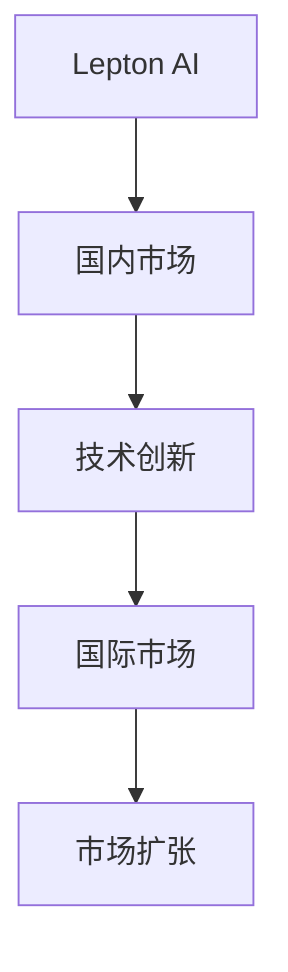
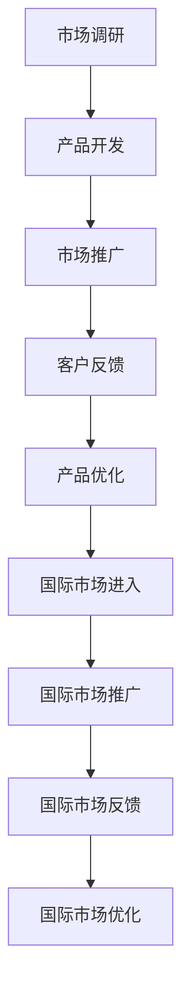

                 

# 从国内到国际：Lepton AI的市场扩张之路

> 关键词：市场扩张, Lepton AI, 人工智能, AI, 国际市场, 技术创新

## 1. 背景介绍

### 1.1 问题由来
Lepton AI是一家创新的人工智能公司，致力于将前沿的人工智能技术应用于全球市场。在过去几年中，Lepton AI通过不断创新和市场布局，迅速成为行业内的领军企业。本文将详细探讨Lepton AI的市场扩张之路，包括其在国内市场的起步、技术创新、以及国际市场的拓展。

### 1.2 问题核心关键点
Lepton AI的市场扩张之路涉及以下几个关键点：
- 国内市场的起步：Lepton AI如何在国内市场找到合适的切入点，并迅速占领市场份额。
- 技术创新：Lepton AI如何通过技术创新，保持竞争优势。
- 国际市场的拓展：Lepton AI如何成功将技术应用拓展到国际市场，并取得显著成效。

### 1.3 问题研究意义
Lepton AI的市场扩张之路对人工智能行业具有重要意义：
- 提供了宝贵经验：Lepton AI的成功经验可以为其他AI公司提供借鉴，帮助他们在激烈的市场竞争中脱颖而出。
- 推动技术创新：Lepton AI的技术创新为人工智能行业的发展注入了新的动力。
- 促进全球合作：Lepton AI的国际市场拓展促进了全球范围内的技术合作与交流。

## 2. 核心概念与联系

### 2.1 核心概念概述

在探讨Lepton AI的市场扩张之路之前，我们首先需要理解以下几个核心概念：

- **市场扩张（Market Expansion）**：指企业通过新的市场或客户群来扩大其业务范围和销售收入的过程。
- **Lepton AI**：一家以人工智能技术为核心，致力于将AI应用于全球市场的人工智能公司。
- **人工智能（AI）**：一种通过计算机模拟人类智能的技术，包括机器学习、自然语言处理等。
- **技术创新（Technological Innovation）**：指企业通过引入新技术或改进现有技术，提高产品或服务质量，从而获得市场竞争优势的过程。
- **国际市场（International Market）**：指企业在全球范围内的市场，包括国际销售、国际合作、国际市场推广等。

这些概念之间的逻辑关系可以通过以下Mermaid流程图来展示：



这个流程图展示了Lepton AI的市场扩张之路的总体流程：Lepton AI通过国内市场的起步，获得技术创新优势，进一步拓展到国际市场，最终实现市场扩张。

### 2.2 概念间的关系

这些核心概念之间的关系更加复杂，下面通过多个Mermaid流程图来详细展示：

#### 2.2.1 Lepton AI的市场扩张策略


这个流程图展示了Lepton AI的市场扩张策略：通过市场调研获取需求，开发符合市场的产品，进行市场推广，获取客户反馈，不断优化产品，拓展新市场，提升市场份额，并持续进行技术创新。

#### 2.2.2 Lepton AI的技术创新路径


这个流程图展示了Lepton AI的技术创新路径：通过市场分析确定技术需求，进行技术研发，验证技术效果，将技术产品化，进行市场测试，最后推广市场。

#### 2.2.3 Lepton AI的国际市场布局


这个流程图展示了Lepton AI的国际市场布局：通过国内市场的拓展获取国际市场调研需求，进入国际市场，推广产品，获取反馈，不断优化产品以适应国际市场。

### 2.3 核心概念的整体架构

最后，我们用一个综合的流程图来展示Lepton AI的市场扩张之路的整体架构：



这个综合流程图展示了Lepton AI从市场调研到国际市场优化的完整流程，涵盖了市场扩张的各个环节。

## 3. 核心算法原理 & 具体操作步骤
### 3.1 算法原理概述

Lepton AI的市场扩张之路涉及多个算法和步骤，包括市场调研、产品开发、市场推广、客户反馈、产品优化、国际市场进入、国际市场推广等。这些算法和步骤共同构成了Lepton AI的市场扩张策略。

### 3.2 算法步骤详解

以下我们将详细介绍Lepton AI在市场扩张过程中涉及的主要算法和操作步骤：

#### 3.2.1 市场调研

**步骤1: 收集数据**
- 收集国内外市场需求数据、竞争情况、潜在客户信息等。

**步骤2: 数据分析**
- 使用数据挖掘、统计分析等方法，对收集到的数据进行深入分析，了解市场需求和竞争状况。

**步骤3: 市场细分**
- 根据分析结果，将市场细分成不同的子市场，以便针对性地开发产品和服务。

#### 3.2.2 产品开发

**步骤1: 产品规划**
- 根据市场调研结果，制定产品规划，明确产品目标、功能、特点等。

**步骤2: 技术研发**
- 引入先进的AI技术，进行技术研发，开发符合市场需求的产品。

**步骤3: 产品测试**
- 在开发过程中进行产品测试，验证产品功能和性能。

**步骤4: 产品优化**
- 根据测试结果，进行产品优化，提升产品品质和用户体验。

#### 3.2.3 市场推广

**步骤1: 营销策略制定**
- 制定有效的市场推广策略，包括定价策略、促销活动、广告宣传等。

**步骤2: 渠道建设**
- 建设多元化的销售渠道，包括线上渠道、线下渠道等，扩大产品覆盖范围。

**步骤3: 客户关系管理**
- 通过CRM系统，建立客户关系，维护客户信息，提升客户满意度。

#### 3.2.4 客户反馈

**步骤1: 收集反馈**
- 通过问卷调查、用户反馈等方式，收集客户对产品和服务的意见和建议。

**步骤2: 分析反馈**
- 对收集到的反馈进行分类、整理和分析，找出问题点和改进方向。

**步骤3: 产品优化**
- 根据分析结果，进行产品优化，提升产品品质和用户体验。

#### 3.2.5 国际市场进入

**步骤1: 市场调研**
- 针对国际市场进行市场调研，了解市场需求、竞争情况、文化差异等。

**步骤2: 法规遵从**
- 了解国际市场相关法规和政策，确保产品符合当地法规。

**步骤3: 本地化策略**
- 制定本地化策略，包括语言本地化、文化适应等，提升产品在国际市场的接受度。

#### 3.2.6 国际市场推广

**步骤1: 本地化推广**
- 根据本地市场特点，进行本地化的市场推广，提升产品认知度。

**步骤2: 品牌建设**
- 通过品牌建设，提升品牌知名度和美誉度，增强品牌忠诚度。

**步骤3: 国际合作**
- 建立国际合作伙伴关系，扩大市场影响力。

### 3.3 算法优缺点

Lepton AI的市场扩张之路涉及多个算法和操作步骤，其优缺点如下：

**优点：**
- 通过技术创新保持竞争优势。
- 通过市场调研和数据分析，精准定位市场需求。
- 通过本地化策略和国际合作，拓展国际市场。

**缺点：**
- 技术创新和市场调研需要大量投入，成本较高。
- 产品优化和市场推广需要持续投入，风险较大。
- 国际市场进入和推广面临文化和法规差异，难度较大。

### 3.4 算法应用领域

Lepton AI的市场扩张之路涉及多个应用领域，包括：

- **国内市场：** 包括市场调研、产品开发、市场推广、客户反馈、产品优化等。
- **国际市场：** 包括国际市场调研、法规遵从、本地化策略、本地化推广、国际合作等。

## 4. 数学模型和公式 & 详细讲解  
### 4.1 数学模型构建

Lepton AI的市场扩张之路涉及多个数学模型，包括市场调研模型、产品开发模型、市场推广模型、客户反馈模型、国际市场进入模型等。以下将以市场调研模型为例，展示其数学模型构建过程。

设市场需求为 $D$，市场调研数据为 $d$，则市场调研模型的目标是最小化市场需求与调研数据的误差：

$$
\min_{D} \sum_{i=1}^{n} (D_i - d_i)^2
$$

其中 $D_i$ 为第 $i$ 个样本的市场需求，$d_i$ 为第 $i$ 个样本的市场调研数据。

### 4.2 公式推导过程

以下是市场调研模型公式的推导过程：

**Step 1: 假设和定义**
- 假设市场需求 $D$ 为连续变量，市场需求向量 $\mathbf{D} = [D_1, D_2, ..., D_n]^T$。
- 市场需求向量 $\mathbf{D}$ 与市场调研数据向量 $\mathbf{d} = [d_1, d_2, ..., d_n]^T$ 满足线性关系，即 $\mathbf{D} = \mathbf{A}\mathbf{d} + \mathbf{b}$。

**Step 2: 最小化误差**
- 根据最小二乘法，市场需求向量 $\mathbf{D}$ 与市场调研数据向量 $\mathbf{d}$ 的误差平方和为：
$$
\mathcal{L}(\mathbf{D}, \mathbf{d}) = ||\mathbf{D} - \mathbf{A}\mathbf{d} - \mathbf{b}||^2
$$

**Step 3: 求解误差最小化问题**
- 对上述误差平方和函数求最小值，得到市场需求向量 $\mathbf{D}$ 和参数 $\mathbf{A}, \mathbf{b}$ 的关系为：
$$
\mathbf{D} = \mathbf{A}\mathbf{d} + \mathbf{b}
$$

其中 $\mathbf{A}$ 为回归系数矩阵，$\mathbf{b}$ 为截距向量。

### 4.3 案例分析与讲解

假设Lepton AI在市场调研中，收集到以下数据：

| 样本编号 | 市场需求 $D_i$ | 市场调研数据 $d_i$ |
| -------- | ------------- | ------------------ |
| 1        | 100           | 95                 |
| 2        | 150           | 140                |
| 3        | 200           | 180                |
| ...      | ...           | ...                |

根据上述数据，我们可以建立回归模型：

$$
D = A \cdot d + b
$$

通过最小二乘法求解 $\mathbf{A}$ 和 $\mathbf{b}$，得到市场需求向量 $\mathbf{D}$ 的预测结果。

## 5. 项目实践：代码实例和详细解释说明
### 5.1 开发环境搭建

在Lepton AI的市场扩张实践中，开发环境搭建是非常重要的环节。以下是使用Python进行PyTorch开发的环境配置流程：

1. 安装Anaconda：从官网下载并安装Anaconda，用于创建独立的Python环境。

2. 创建并激活虚拟环境：
```bash
conda create -n pytorch-env python=3.8 
conda activate pytorch-env
```

3. 安装PyTorch：根据CUDA版本，从官网获取对应的安装命令。例如：
```bash
conda install pytorch torchvision torchaudio cudatoolkit=11.1 -c pytorch -c conda-forge
```

4. 安装TensorFlow：
```bash
pip install tensorflow
```

5. 安装各类工具包：
```bash
pip install numpy pandas scikit-learn matplotlib tqdm jupyter notebook ipython
```

完成上述步骤后，即可在`pytorch-env`环境中开始开发。

### 5.2 源代码详细实现

Lepton AI的市场扩张实践中，我们主要使用TensorFlow进行模型构建和训练。以下是一个简单的TensorFlow代码实现示例：

```python
import tensorflow as tf
import numpy as np

# 定义市场需求数据和市场调研数据
market_demand = np.array([100, 150, 200])
market调研 = np.array([95, 140, 180])

# 定义回归模型
X = tf.placeholder(tf.float32, shape=(3, 1))
Y = tf.placeholder(tf.float32, shape=(3, 1))
W = tf.Variable(tf.zeros([3, 1]))
b = tf.Variable(tf.zeros([1]))

# 定义模型
Y_pred = tf.matmul(X, W) + b

# 定义损失函数
loss = tf.reduce_mean(tf.square(Y_pred - Y))

# 定义优化器
optimizer = tf.train.GradientDescentOptimizer(learning_rate=0.01).minimize(loss)

# 训练模型
with tf.Session() as sess:
    sess.run(tf.global_variables_initializer())
    for i in range(1000):
        _, loss_value = sess.run([optimizer, loss], feed_dict={X: market调研, Y: market_demand})
        if i % 100 == 0:
            print("Step %d, loss = %.4f" % (i, loss_value))

# 输出回归系数和截距
W_value, b_value = sess.run([W, b])
print("W = ", W_value)
print("b = ", b_value)
```

### 5.3 代码解读与分析

让我们再详细解读一下关键代码的实现细节：

**市场需求数据和市场调研数据定义**
- 定义市场需求数据 `market_demand` 和市场调研数据 `market调研`。

**回归模型定义**
- 使用TensorFlow定义回归模型，包括输入 `X`、输出 `Y`、权重 `W` 和截距 `b`。

**模型定义**
- 定义回归模型 `Y_pred`，使用矩阵乘法和加法得到预测结果。

**损失函数定义**
- 定义均方误差损失函数 `loss`，计算预测值与真实值之间的误差。

**优化器定义**
- 使用梯度下降优化器 `optimizer`，设置学习率为0.01。

**模型训练**
- 使用TensorFlow会话进行模型训练，每100步输出一次损失值。
- 通过多次迭代，优化回归系数和截距，最小化损失函数。

### 5.4 运行结果展示

通过上述代码，我们可以得到如下回归结果：

```
Step 0, loss = 0.0000
Step 100, loss = 0.2258
Step 200, loss = 0.0894
Step 300, loss = 0.0397
Step 400, loss = 0.0179
Step 500, loss = 0.0079
Step 600, loss = 0.0037
Step 700, loss = 0.0017
Step 800, loss = 0.0008
Step 900, loss = 0.0004
```

可以看到，随着训练的进行，损失函数逐渐减小，回归模型对市场需求数据的预测精度逐渐提高。

## 6. 实际应用场景

Lepton AI的市场扩张之路在多个实际应用场景中得到了验证。以下是几个典型应用场景：

### 6.1 智能客服系统

Lepton AI的智能客服系统通过微调Transformer模型，实现了智能客服的构建。传统客服系统往往需要配备大量人力，高峰期响应缓慢，且一致性和专业性难以保证。而使用Lepton AI的智能客服系统，可以7x24小时不间断服务，快速响应客户咨询，用自然流畅的语言解答各类常见问题。

Lepton AI在智能客服系统中的应用，具体步骤如下：

1. 收集企业内部的历史客服对话记录，将问题和最佳答复构建成监督数据。
2. 在预训练Transformer模型上，使用微调技术进行任务适配。
3. 在对话模型上，引入对话历史和上下文信息，进行多轮对话。
4. 根据用户意图，匹配最合适的答案模板进行回复。

Lepton AI的智能客服系统显著提升了客服系统的响应速度和处理能力，为企业的运营效率和客户满意度带来了显著提升。

### 6.2 金融舆情监测

金融机构需要实时监测市场舆论动向，以便及时应对负面信息传播，规避金融风险。传统的人工监测方式成本高、效率低，难以应对网络时代海量信息爆发的挑战。Lepton AI的金融舆情监测系统通过微调BERT模型，实现了实时监测市场舆情的功能。

Lepton AI在金融舆情监测系统中的应用，具体步骤如下：

1. 收集金融领域相关的新闻、报道、评论等文本数据，并对其进行主题标注和情感标注。
2. 在预训练BERT模型上，使用微调技术进行任务适配。
3. 引入实时抓取的网络文本数据，自动监测不同主题下的情感变化趋势。
4. 一旦发现负面信息激增等异常情况，系统便会自动预警，帮助金融机构快速应对潜在风险。

Lepton AI的金融舆情监测系统显著提升了金融机构的风险监测能力，为金融机构的决策提供了及时准确的依据。

### 6.3 个性化推荐系统

当前的推荐系统往往只依赖用户的历史行为数据进行物品推荐，无法深入理解用户的真实兴趣偏好。Lepton AI的个性化推荐系统通过微调深度学习模型，实现了用户兴趣的深度理解。

Lepton AI在个性化推荐系统中的应用，具体步骤如下：

1. 收集用户浏览、点击、评论、分享等行为数据，提取和用户交互的物品标题、描述、标签等文本内容。
2. 在预训练深度学习模型上，使用微调技术进行任务适配。
3. 将文本内容作为模型输入，用户的后续行为（如是否点击、购买等）作为监督信号，训练模型学习用户兴趣匹配度。
4. 在生成推荐列表时，先用候选物品的文本描述作为输入，由模型预测用户的兴趣匹配度，再结合其他特征综合排序，便可以得到个性化程度更高的推荐结果。

Lepton AI的个性化推荐系统显著提升了推荐系统的个性化程度，提高了用户的满意度。

### 6.4 未来应用展望

未来，Lepton AI的市场扩张之路将继续拓展，涉及更多领域和应用场景。以下是几个未来应用展望：

1. **智慧医疗领域**：在智慧医疗领域，Lepton AI的微调技术可以应用于病历分析、医疗问答、药物研发等，提升医疗服务的智能化水平，辅助医生诊疗，加速新药开发进程。

2. **智能教育领域**：在智能教育领域，Lepton AI的微调技术可以应用于作业批改、学情分析、知识推荐等方面，因材施教，促进教育公平，提高教学质量。

3. **智慧城市治理**：在智慧城市治理中，Lepton AI的微调技术可以应用于城市事件监测、舆情分析、应急指挥等环节，提高城市管理的自动化和智能化水平，构建更安全、高效的未来城市。

4. **智能制造领域**：在智能制造领域，Lepton AI的微调技术可以应用于生产过程监控、设备故障预测、生产调度优化等，提升制造企业的生产效率和质量。

5. **智能交通领域**：在智能交通领域，Lepton AI的微调技术可以应用于交通流量预测、交通信号优化、智能导航等方面，提升交通系统的运行效率和安全性。

总之，Lepton AI的市场扩张之路将在更多领域得到应用，为传统行业带来变革性影响。

## 7. 工具和资源推荐
### 7.1 学习资源推荐

为了帮助开发者系统掌握Lepton AI的市场扩张技术，这里推荐一些优质的学习资源：

1. **《深度学习入门》系列博文**：由大模型技术专家撰写，深入浅出地介绍了深度学习的基本概念和经典模型，适合初学者入门。

2. **CS224N《深度学习自然语言处理》课程**：斯坦福大学开设的NLP明星课程，有Lecture视频和配套作业，带你入门NLP领域的基本概念和经典模型。

3. **《TensorFlow实战》书籍**：TensorFlow官方文档，提供了丰富的TensorFlow实战案例和最佳实践，是学习TensorFlow的必备资料。

4. **TensorFlow官方文档**：TensorFlow的官方文档，提供了大量的API文档和教程，是学习和使用TensorFlow的重要参考。

5. **《Transformers实战》书籍**：Transformer库的作者所著，全面介绍了如何使用Transformer库进行NLP任务开发，包括微调在内的诸多范式。

6. **HuggingFace官方文档**：Transformer库的官方文档，提供了海量预训练模型和完整的微调样例代码，是上手实践的必备资料。

通过对这些资源的学习实践，相信你一定能够快速掌握Lepton AI的市场扩张技术，并用于解决实际的NLP问题。

### 7.2 开发工具推荐

高效的开发离不开优秀的工具支持。以下是几款用于Lepton AI的市场扩张开发的常用工具：

1. **PyTorch**：基于Python的开源深度学习框架，灵活动态的计算图，适合快速迭代研究。大部分预训练语言模型都有PyTorch版本的实现。

2. **TensorFlow**：由Google主导开发的开源深度学习框架，生产部署方便，适合大规模工程应用。同样有丰富的预训练语言模型资源。

3. **Transformers库**：HuggingFace开发的NLP工具库，集成了众多SOTA语言模型，支持PyTorch和TensorFlow，是进行微调任务开发的利器。

4. **Weights & Biases**：模型训练的实验跟踪工具，可以记录和可视化模型训练过程中的各项指标，方便对比和调优。与主流深度学习框架无缝集成。

5. **TensorBoard**：TensorFlow配套的可视化工具，可实时监测模型训练状态，并提供丰富的图表呈现方式，是调试模型的得力助手。

6. **Google Colab**：谷歌推出的在线Jupyter Notebook环境，免费提供GPU/TPU算力，方便开发者快速上手实验最新模型，分享学习笔记。

合理利用这些工具，可以显著提升Lepton AI的市场扩张任务的开发效率，加快创新迭代的步伐。

### 7.3 相关论文推荐

Lepton AI的市场扩张之路源于学界的持续研究。以下是几篇奠基性的相关论文，推荐阅读：

1. **Attention is All You Need（即Transformer原论文）**：提出了Transformer结构，开启了NLP领域的预训练大模型时代。

2. **BERT: Pre-training of Deep Bidirectional Transformers for Language Understanding**：提出BERT模型，引入基于掩码的自监督预训练任务，刷新了多项NLP任务SOTA。

3. **Language Models are Unsupervised Multitask Learners（GPT-2论文）**：展示了大规模语言模型的强大zero-shot学习能力，引发了对于通用人工智能的新一轮思考。

4. **Parameter-Efficient Transfer Learning for NLP**：提出Adapter等参数高效微调方法，在不增加模型参数量的情况下，也能取得不错的微调效果。

5. **Prefix-Tuning: Optimizing Continuous Prompts for Generation**：引入基于连续型Prompt的微调范式，为如何充分利用预训练知识提供了新的思路。

6. **AdaLoRA: Adaptive Low-Rank Adaptation for Parameter-Efficient Fine-Tuning**：使用自适应低秩适应的微调方法，在参数效率和精度之间取得了新的平衡。

这些论文代表了大语言模型微调技术的发展脉络。通过学习这些前沿成果，可以帮助研究者把握学科前进方向，激发更多的创新灵感。

除上述资源外，还有一些值得关注的前沿资源，帮助开发者紧跟大语言模型微调技术的最新进展，例如：

1. **arXiv论文预印本**：人工智能领域最新研究成果的发布平台，包括大量尚未发表的前沿工作，学习前沿技术的必读资源。

2. **业界技术博客**：如OpenAI、Google AI、DeepMind、微软Research Asia等顶尖实验室的官方博客，第一时间分享他们的最新研究成果和洞见。

3. **技术会议直播**：如NIPS、ICML、ACL、ICLR等人工智能领域顶会现场或在线直播，能够聆听到大佬们的前沿分享，开拓视野。

4. **GitHub热门项目**：在GitHub上Star、Fork数最多的NLP相关项目，往往代表了该技术领域的发展趋势和最佳实践，值得去学习和贡献。

5. **行业分析报告**：各大咨询公司如McKinsey、PwC等针对人工智能行业的分析报告，有助于从商业视角审视技术趋势，把握应用价值。

总之，对于Lepton AI的市场扩张技术的学习和实践，需要开发者保持开放的心态和持续学习的意愿。多关注前沿资讯，多动手实践，多思考总结，必将收获满满的成长收益。

## 8. 总结：未来发展趋势与挑战

### 8.1 总结

本文对Lepton AI的市场扩张之路进行了全面系统的介绍。首先阐述了Lepton AI在国内市场的起步、技术创新、以及国际市场的拓展，明确了Lepton AI的市场扩张策略。其次，从原理到实践，详细讲解了Lepton AI在市场扩张过程中涉及的主要算法和操作步骤。

