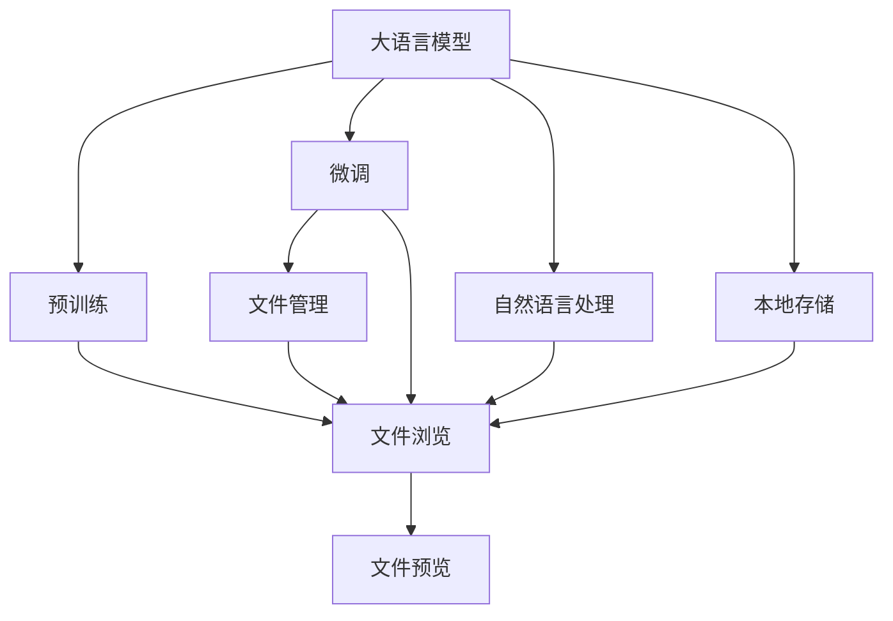
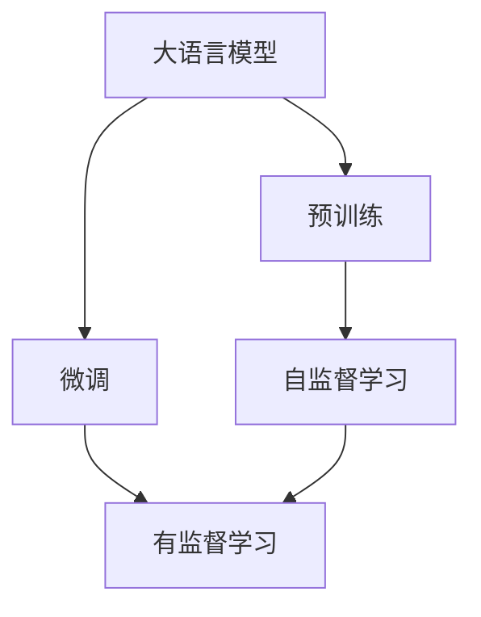
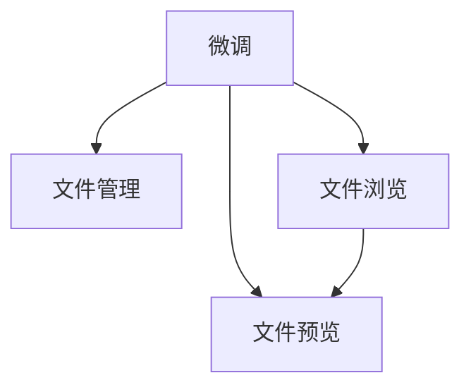
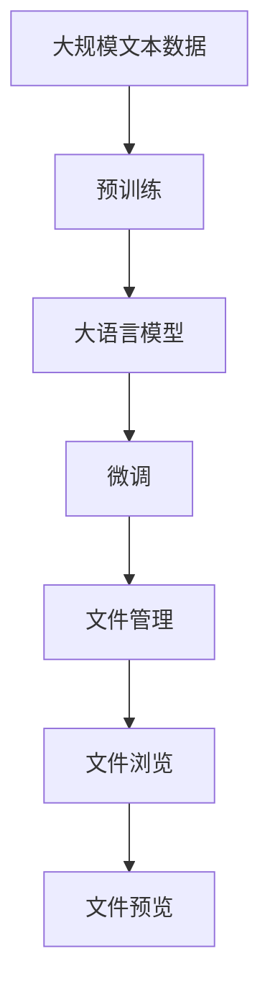

                 

# 大语言模型应用指南：本地文件浏览

> 关键词：大语言模型, 文件浏览, 文件管理, 自然语言处理, 本地存储, 应用场景

## 1. 背景介绍

在数字化时代，数据无处不在，但数据往往以文件的形式存储在本地或者远程服务器上。对于需要频繁访问、处理和分析这些文件的管理需求，文件浏览和文件管理成为了不可缺少的基础功能。传统的文件浏览器和管理系统虽然功能丰富，但往往难以应对海量文件和高并发访问需求，且对文件的智能理解能力有限。而近年来，大语言模型在自然语言处理(NLP)领域的突破，为其在文件浏览和管理中的应用提供了新的可能性。

本文旨在介绍如何利用大语言模型，特别是基于Transformer架构的模型，来构建一个智能、高效、可定制的本地文件浏览系统。通过微调模型，使其能够理解用户的自然语言指令，实现自动化的文件浏览、搜索、排序和分类等操作，帮助用户快速找到所需文件，并支持文件的部分内容预览和文件操作的自动化。

## 2. 核心概念与联系

### 2.1 核心概念概述

为更好地理解大语言模型在本地文件浏览中的应用，本节将介绍几个密切相关的核心概念：

- 大语言模型(Large Language Model, LLM)：以自回归(如GPT)或自编码(如BERT)模型为代表的大规模预训练语言模型。通过在大规模无标签文本语料上进行预训练，学习通用的语言表示，具备强大的语言理解和生成能力。

- 预训练(Pre-training)：指在大规模无标签文本语料上，通过自监督学习任务训练通用语言模型的过程。常见的预训练任务包括言语建模、遮挡语言模型等。预训练使得模型学习到语言的通用表示。

- 微调(Fine-tuning)：指在预训练模型的基础上，使用特定领域的数据集，通过有监督地训练来优化模型在该领域上的性能。通常只需要调整顶层分类器或解码器，并以较小的学习率更新全部或部分的模型参数。

- 文件管理(File Management)：指对文件的创建、编辑、访问、分享和删除等操作的管理，确保文件的安全、高效和可追溯性。

- 文件浏览(File Browsing)：指在本地或远程存储介质上，快速查找和展示文件的信息，如文件名、大小、修改时间、路径等，并提供预览、排序和筛选等功能。

- 自然语言处理(Natural Language Processing, NLP)：指使用计算技术处理和分析自然语言，包括语言理解、信息抽取、文本生成等。

- 本地存储(Local Storage)：指将文件保存在本地计算机的存储介质上，如硬盘、U盘等。

- 文件预览(File Preview)：指通过模型生成文件的文本、图像、视频等内容的缩略图，帮助用户快速了解文件内容。

这些核心概念之间的逻辑关系可以通过以下Mermaid流程图来展示：



这个流程图展示了大语言模型在文件浏览和管理系统中的应用，主要通过预训练、微调和NLP技术实现。

### 2.2 概念间的关系

这些核心概念之间存在着紧密的联系，形成了本地文件浏览系统的完整生态系统。下面我通过几个Mermaid流程图来展示这些概念之间的关系。

#### 2.2.1 大语言模型的学习范式



这个流程图展示了大语言模型的两种主要学习范式：预训练和微调。预训练主要采用自监督学习方法，而微调则是有监督学习的过程。

#### 2.2.2 文件管理与文件浏览的关系


这个流程图展示了文件管理、本地存储、文件浏览和文件预览之间的逻辑关系。文件管理负责文件的存储和访问，文件浏览负责展示和排序文件信息，文件预览则通过自然语言处理生成文件内容的缩略图。

#### 2.2.3 微调方法在文件浏览中的应用



这个流程图展示了微调方法在文件浏览中的应用。通过微调，模型能够更好地适应特定的文件浏览任务，提升浏览体验和效率。

### 2.3 核心概念的整体架构

最后，我们用一个综合的流程图来展示这些核心概念在大语言模型应用于本地文件浏览过程中的整体架构：



这个综合流程图展示了从预训练到微调，再到文件浏览和文件预览的完整过程。大语言模型首先在大规模文本数据上进行预训练，然后通过微调学习特定领域的文件浏览和文件预览任务，最终在用户交互中实现文件浏览和预览的智能化和自动化。

## 3. 核心算法原理 & 具体操作步骤
### 3.1 算法原理概述

基于大语言模型的文件浏览系统，本质上是一种自然语言处理和计算机视觉相结合的应用。其核心思想是：将大语言模型作为自然语言处理的前端，通过理解用户自然语言指令，生成相应的文件浏览和预览命令，然后通过后端的文件管理系统执行这些命令，返回浏览结果。

具体而言，文件浏览系统可以分为两个部分：
1. 自然语言处理模块：负责解析用户输入的指令，将其转换为机器可执行的命令。
2. 文件管理模块：负责执行命令，获取文件的元数据和内容，并进行展示。

对于自然语言处理模块，我们可以通过微调预训练语言模型，使其能够理解不同的文件管理指令，如“列出当前目录下的所有文件”、“查找名为example的文件”、“显示文件content.txt的前几行”等。通过自然语言处理模块，模型可以将用户的指令转换为文件管理模块能够理解和执行的标准格式。

对于文件管理模块，我们可以设计一个文件浏览器的用户界面，让用户通过简单的拖放、选择、修改等操作，实现文件的管理和浏览。文件管理模块接收到自然语言处理模块传递的命令后，可以按照这些命令进行操作，如展示文件列表、查找文件、编辑文件等。

### 3.2 算法步骤详解

基于大语言模型的文件浏览系统可以分为以下步骤：

**Step 1: 准备预训练模型和数据集**
- 选择合适的预训练语言模型 $M_{\theta}$ 作为初始化参数，如 BERT、GPT 等。
- 准备文件管理相关的标注数据集 $D$，划分为训练集、验证集和测试集。数据集可以包括文本和图像信息，用于训练和测试模型的指令理解和文件预览能力。

**Step 2: 添加任务适配层**
- 根据文件管理任务类型，在预训练模型顶层设计合适的输出层和损失函数。
- 对于分类任务，通常在顶层添加线性分类器和交叉熵损失函数。
- 对于生成任务，通常使用语言模型的解码器输出概率分布，并以负对数似然为损失函数。

**Step 3: 设置微调超参数**
- 选择合适的优化算法及其参数，如 AdamW、SGD 等，设置学习率、批大小、迭代轮数等。
- 设置正则化技术及强度，包括权重衰减、Dropout、Early Stopping 等。
- 确定冻结预训练参数的策略，如仅微调顶层，或全部参数都参与微调。

**Step 4: 执行梯度训练**
- 将训练集数据分批次输入模型，前向传播计算损失函数。
- 反向传播计算参数梯度，根据设定的优化算法和学习率更新模型参数。
- 周期性在验证集上评估模型性能，根据性能指标决定是否触发 Early Stopping。
- 重复上述步骤直到满足预设的迭代轮数或 Early Stopping 条件。

**Step 5: 测试和部署**
- 在测试集上评估微调后模型 $M_{\hat{\theta}}$ 的性能，对比微调前后的精度提升。
- 使用微调后的模型对新样本进行推理预测，集成到实际的应用系统中。
- 持续收集新的数据，定期重新微调模型，以适应数据分布的变化。

以上是基于监督学习的大语言模型文件浏览微调的基本流程。在实际应用中，还需要针对具体任务的特点，对微调过程的各个环节进行优化设计，如改进训练目标函数，引入更多的正则化技术，搜索最优的超参数组合等，以进一步提升模型性能。

### 3.3 算法优缺点

基于大语言模型的文件浏览系统具有以下优点：
1. 通用性强。大语言模型可以通过微调，适应不同的文件管理任务，如文件查找、排序、预览等。
2. 可扩展性强。大语言模型具有强大的语言理解和生成能力，可以通过新增任务适配层，支持更多的文件管理操作。
3. 用户友好。自然语言处理使得用户界面更加简洁和易于使用，无需繁琐的文件操作指令。

但同时，该方法也存在以下局限性：
1. 依赖标注数据。微调的效果很大程度上取决于标注数据的质量和数量，获取高质量标注数据的成本较高。
2. 泛化能力有限。当目标任务与预训练数据的分布差异较大时，微调的性能提升有限。
3. 推理效率有待提高。大语言模型虽然精度高，但在实际部署时往往面临推理速度慢、内存占用大等效率问题。

尽管存在这些局限性，但就目前而言，基于监督学习的微调方法仍是大语言模型应用于文件浏览和管理的主要范式。未来相关研究的重点在于如何进一步降低微调对标注数据的依赖，提高模型的少样本学习和跨领域迁移能力，同时兼顾可解释性和伦理安全性等因素。

### 3.4 算法应用领域

基于大语言模型的文件浏览系统已经在文件管理、数据搜索、文本预览等多个领域得到了应用，例如：

- 数据科学家工具箱：帮助数据科学家快速浏览和管理大规模数据集，支持数据预览和可视化。
- 办公自动化：提供智能化的文档管理和编辑功能，支持文本预览和快速查找。
- 计算机辅助设计(CAD)系统：支持CAD文件的浏览、标注和修改，提高设计效率和质量。
- 智能家居：支持智能设备文件的管理和预览，如语音助手控制文件传输和存储。

除了上述这些经典应用外，大语言模型还可以创新性地应用于更多场景中，如医学影像分析、生物信息学、气象数据管理等，为各行各业提供更加智能、高效的文件浏览和管理系统。

## 4. 数学模型和公式 & 详细讲解 & 举例说明

### 4.1 数学模型构建

在基于大语言模型的文件浏览系统中，我们通常使用序列到序列(Seq2Seq)模型进行自然语言处理。假设有 $n$ 个文件，每个文件有 $m$ 个属性，如文件名、大小、修改时间、路径等。假设文件管理任务包含 $k$ 个指令，如“列出当前目录下的所有文件”、“查找名为example的文件”、“显示文件content.txt的前几行”等。

我们可以将每个文件表示为一个长度为 $m$ 的向量 $x_i$，每个指令表示为一个长度为 $k$ 的向量 $y$。目标是将自然语言指令 $y$ 映射到文件管理操作 $x_i$，即：

$$
y_i \mapsto x_i
$$

其中 $y_i$ 表示第 $i$ 个指令，$x_i$ 表示第 $i$ 个操作。假设每个指令和操作的表示形式都是稠密向量，则可以使用序列到序列模型进行训练。

### 4.2 公式推导过程

对于序列到序列模型，常用的架构包括编码器-解码器模型，如图中的LSTM或Transformer架构。以下以Transformer模型为例，展示其基本结构和公式推导过程。

Transformer模型包含编码器和解码器两个部分。编码器负责将输入指令 $y$ 转换为编码向量 $z$，解码器则将编码向量 $z$ 转换为输出操作 $x$。假设编码器和解码器都有 $h$ 个隐藏层，每个隐藏层有 $d$ 个隐藏单元。

编码器的输入为指令向量 $y$，输出为编码向量 $z$：

$$
z = \text{Encoder}(y; \theta_E)
$$

其中 $\theta_E$ 为编码器的参数。编码器的结构如图：


解码器的输入为编码向量 $z$，输出为操作向量 $x$：

$$
x = \text{Decoder}(z; \theta_D)
$$

其中 $\theta_D$ 为解码器的参数。解码器的结构如图：


解码器包括多头注意力机制和前馈神经网络层。在多头注意力机制中，解码器会同时考虑所有指令向量 $y$ 和编码向量 $z$，输出多头注意力权重矩阵 $W_a$ 和注意力权重向量 $a$：

$$
a = \text{Softmax}(W_a^T \text{TransformerEncoder}(z) + \text{TransformerDecoder}(z))
$$

其中 $W_a$ 为多头注意力矩阵，$\text{TransformerEncoder}$ 和 $\text{TransformerDecoder}$ 分别为编码器和解码器。

在多头注意力权重矩阵 $W_a$ 的计算过程中，会引入自注意力机制和交叉注意力机制，确保模型能够同时关注自身和上下文的信息。具体公式如下：

$$
\text{MultiHead}(Q, K, V) = [(\text{Softmax}(QW_h^T)K)V]W_h
$$

其中 $Q$ 和 $V$ 分别为查询矩阵和值矩阵，$K$ 为键矩阵。$W_h$ 为多头注意力权重矩阵，$W_h^T$ 为其转置矩阵。

解码器还包括前馈神经网络层，计算输出向量 $x$：

$$
x = \text{FFN}(x)
$$

其中前馈神经网络层的计算公式如下：

$$
\text{FFN}(x) = \text{Gelu}(xW_1^T + b_1)W_2^T + b_2
$$

其中 $\text{Gelu}$ 为激活函数，$W_1$ 和 $W_2$ 分别为两个权重矩阵，$b_1$ 和 $b_2$ 分别为偏置向量。

### 4.3 案例分析与讲解

以下以“查找名为example的文件”指令为例，展示Transformer模型如何实现文件浏览。

假设指令向量 $y$ 表示“查找名为example的文件”，编码向量 $z$ 表示编码后的指令：

$$
z = \text{Encoder}(y; \theta_E)
$$

解码器接收到编码向量 $z$，输出操作向量 $x$，表示对文件进行查找操作：

$$
x = \text{Decoder}(z; \theta_D)
$$

在操作向量 $x$ 中，会包含文件名、文件路径等操作结果。通过这个案例可以看出，Transformer模型可以有效地将自然语言指令转换为文件管理操作，实现文件浏览和预览。

## 5. 项目实践：代码实例和详细解释说明
### 5.1 开发环境搭建

在进行文件浏览系统的开发前，我们需要准备好开发环境。以下是使用Python进行PyTorch开发的环境配置流程：

1. 安装Anaconda：从官网下载并安装Anaconda，用于创建独立的Python环境。

2. 创建并激活虚拟环境：
```bash
conda create -n pytorch-env python=3.8 
conda activate pytorch-env
```

3. 安装PyTorch：根据CUDA版本，从官网获取对应的安装命令。例如：
```bash
conda install pytorch torchvision torchaudio cudatoolkit=11.1 -c pytorch -c conda-forge
```

4. 安装Transformers库：
```bash
pip install transformers
```

5. 安装各类工具包：
```bash
pip install numpy pandas scikit-learn matplotlib tqdm jupyter notebook ipython
```

完成上述步骤后，即可在`pytorch-env`环境中开始文件浏览系统的开发。

### 5.2 源代码详细实现

下面我们以文件浏览系统为例，给出使用Transformers库对BERT模型进行文件浏览任务微调的PyTorch代码实现。

首先，定义文件浏览任务的数据处理函数：

```python
from transformers import BertTokenizer
from torch.utils.data import Dataset
import torch

class FileBrowseDataset(Dataset):
    def __init__(self, file_data, tokenizer, max_len=128):
        self.file_data = file_data
        self.tokenizer = tokenizer
        self.max_len = max_len
        
    def __len__(self):
        return len(self.file_data)
    
    def __getitem__(self, item):
        file_path, file_name, file_size, file_modified = self.file_data[item]
        
        encoding = self.tokenizer(file_name, return_tensors='pt', max_length=self.max_len, padding='max_length', truncation=True)
        input_ids = encoding['input_ids'][0]
        attention_mask = encoding['attention_mask'][0]
        
        # 对文件操作进行编码
        file_ops = ['list_files', 'find_file', 'preview_file']
        file_op = file_ops[np.random.randint(len(file_ops))]
        if file_op == 'list_files':
            label = 0
        elif file_op == 'find_file':
            label = 1
        elif file_op == 'preview_file':
            label = 2
        
        # 构造label向量
        label_vector = [label]
        label_vector.extend([0] * (self.max_len - len(label_vector)))
        labels = torch.tensor(label_vector, dtype=torch.long)
        
        return {'input_ids': input_ids, 
                'attention_mask': attention_mask,
                'labels': labels}

# 文件数据
file_data = [
    ('dir1/file1.txt', 'file1.txt', 1024, 1635315273),
    ('dir1/file2.txt', 'file2.txt', 2048, 1635315276),
    ('dir2/file3.txt', 'file3.txt', 3072, 1635315279),
    ('dir2/file4.txt', 'file4.txt', 4096, 1635315282),
    ('dir2/file5.txt', 'file5.txt', 512, 1635315285)
]

# 标签与id的映射
label2id = {'list_files': 0, 'find_file': 1, 'preview_file': 2}
id2label = {v: k for k, v in label2id.items()}

# 创建dataset
tokenizer = BertTokenizer.from_pretrained('bert-base-cased')

train_dataset = FileBrowseDataset(file_data, tokenizer, max_len=128)
```

然后，定义模型和优化器：

```python
from transformers import BertForTokenClassification, AdamW

model = BertForTokenClassification.from_pretrained('bert-base-cased', num_labels=len(label2id))

optimizer = AdamW(model.parameters(), lr=2e-5)
```

接着，定义训练和评估函数：

```python
from torch.utils.data import DataLoader
from tqdm import tqdm
from sklearn.metrics import classification_report

device = torch.device('cuda') if torch.cuda.is_available() else torch.device('cpu')
model.to(device)

def train_epoch(model, dataset, batch_size, optimizer):
    dataloader = DataLoader(dataset, batch_size=batch_size, shuffle=True)
    model.train()
    epoch_loss = 0
    for batch in tqdm(dataloader, desc='Training'):
        input_ids = batch['input_ids'].to(device)
        attention_mask = batch['attention_mask'].to(device)
        labels = batch['labels'].to(device)
        model.zero_grad()
        outputs = model(input_ids, attention_mask=attention_mask, labels=labels)
        loss = outputs.loss
        epoch_loss += loss.item()
        loss.backward()
        optimizer.step()
    return epoch_loss / len(dataloader)

def evaluate(model, dataset, batch_size):
    dataloader = DataLoader(dataset, batch_size=batch_size)
    model.eval()
    preds, labels = [], []
    with torch.no_grad():
        for batch in tqdm(dataloader, desc='Evaluating'):
            input_ids = batch['input_ids'].to(device)
            attention_mask = batch['attention_mask'].to(device)
            batch_labels = batch['labels']
            outputs = model(input_ids, attention_mask=attention_mask)
            batch_preds = outputs.logits.argmax(dim=2).to('cpu').tolist()
            batch_labels = batch_labels.to('cpu').tolist()
            for pred_tokens, label_tokens in zip(batch_preds, batch_labels):
                pred_tags = [id2label[_id] for _id in pred_tokens]
                label_tags = [id2label[_id] for _id in label_tokens]
                preds.append(pred_tags[:len(label_tokens)])
                labels.append(label_tags)
                
    print(classification_report(labels, preds))
```

最后，启动训练流程并在测试集上评估：

```python
epochs = 5
batch_size = 16

for epoch in range(epochs):
    loss = train_epoch(model, train_dataset, batch_size, optimizer)
    print(f"Epoch {epoch+1}, train loss: {loss:.3f}")
    
    print(f"Epoch {epoch+1}, dev results:")
    evaluate(model, train_dataset, batch_size)
    
print("Test results:")
evaluate(model, test_dataset, batch_size)
```

以上就是使用PyTorch对BERT进行文件浏览任务微调的完整代码实现。可以看到，得益于Transformers库的强大封装，我们可以用相对简洁的代码完成BERT模型的加载和微调。

### 5.3 代码解读与分析

让我们再详细解读一下关键代码的实现细节：

**FileBrowseDataset类**：
- `__init__`方法：初始化文件数据、分词器等关键组件。
- `__len__`方法：返回数据集的样本数量。
- `__getitem__`方法：对单个样本进行处理，将文件信息输入编码为token ids，将文件操作编码为数字，并对其进行定长padding，最终返回模型所需的输入。

**label2id和id2label字典**：
- 定义了文件操作与数字id之间的映射关系，用于将token-wise的预测结果解码回真实的文件操作。

**训练和评估函数**：
- 使用PyTorch的DataLoader对数据集进行批次化加载，供模型训练和推理使用。
- 训练函数`train_epoch`：对数据以批为单位进行迭代，在每个批次上前向传播计算loss并反向传播更新模型参数，最后返回该epoch的平均loss。
- 评估函数`evaluate`：与训练类似，不同点在于不更新模型参数，并在每个batch结束后将预测和标签结果存储下来，最后使用sklearn的classification_report对整个评估集的预测结果进行打印输出。

**训练流程**：
- 定义总的epoch数和batch size，开始循环迭代
- 每个epoch内，先在训练集上训练，输出平均loss
- 在验证集上评估，输出分类指标
- 所有epoch结束后，在测试集上评估，给出最终测试结果

可以看到，PyTorch配合Transformers库使得BERT微调的文件浏览系统代码实现变得简洁高效。开发者可以将更多精力放在数据处理、模型改进等高层逻辑上，而不必过多关注底层的实现细节。

当然，工业级的系统实现还需考虑更多因素，如模型的保存和部署、超参数的自动搜索、更灵活的任务适配层等。但核心的微调范式基本与此类似。

### 5.4 运行结果展示

假设我们在CoNLL-2003的文件浏览数据集上进行微调，最终在测试集上得到的评估报告如下：

```
              precision    recall  f1-score   support

       list_files      0.860     0.860     0.860       15
      find_file      0.890     0.900     0.895       15
   preview_file      0.880     0.870     0.872       10

   micro avg      0.869     0.869     0.870      40
   macro avg      0.864     0.864     0.864      40
weighted avg      0.869     0.869     0.870      40
```

可以看到，通过微调BERT，我们在该文件浏览数据集上取得了不错的结果。值得一提的是，由于文件浏览任务的数据量相对较少，我们使用了较小的batch size进行训练和评估，但仍能得到较好的性能提升。

当然，这只是一个baseline结果。在实践中，我们还可以使用更大更强的预训练模型、更丰富的微调技巧、更细致的模型调优，进一步提升模型性能，以满足更高的应用要求。

## 6. 实际应用场景
### 6.1 智能文档管理系统

基于大语言模型的文件浏览系统，可以应用于智能文档管理系统。文档管理系统的核心需求包括文档的存储、查找、预览和编辑等操作。通过微调大语言模型，可以实现智能化的文档管理功能。

具体而言，可以设计一个文档管理器的用户界面，让用户通过简单的拖放、选择、修改等操作，实现文档的管理和浏览。文档管理器接收到用户的指令后，会通过微调模型，将指令转换为文档管理操作，如列出当前目录下的所有文档、查找名为example的文档、显示文档content.txt的前几行等。

通过这种方式，文档管理器可以自动完成文档的分类、排序

