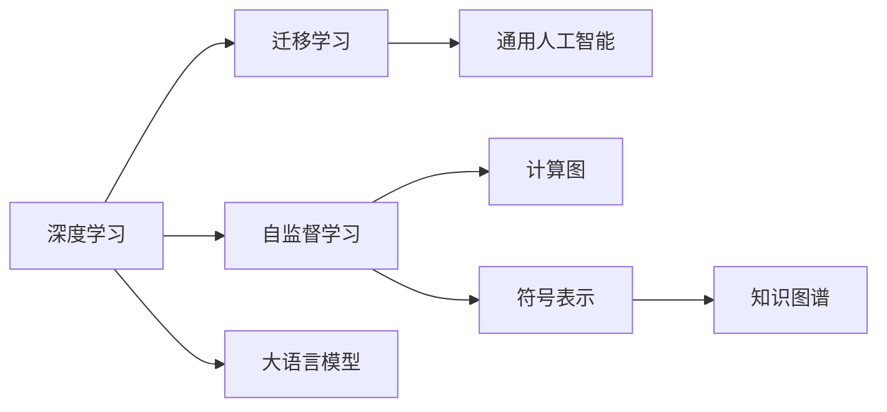
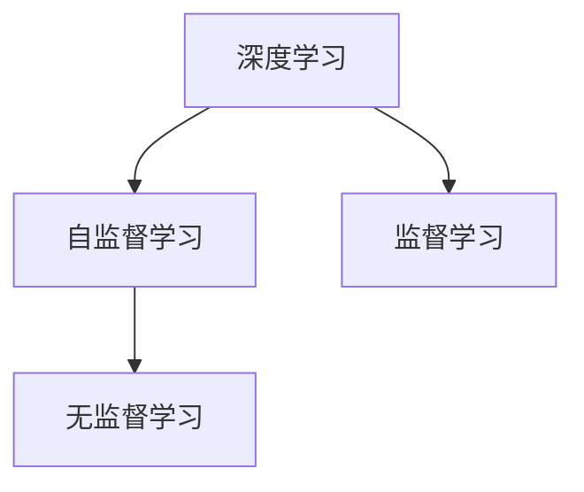
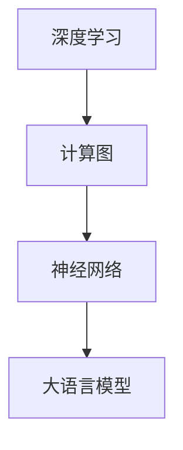

                 

# 大语言模型应用指南：机器能思考吗

> 关键词：大语言模型, 自然语言处理(NLP), 深度学习, 迁移学习, 通用人工智能(AGI), 模型推理, 计算图, 符号表示, 知识图谱, 应用场景

## 1. 背景介绍

### 1.1 问题由来

随着人工智能技术的飞速发展，机器能否像人类一样思考、理解和推理自然语言成为了一个热门话题。从1950年代图灵机的提出，到当前大语言模型（Large Language Models, LLMs）的兴起，人类对于“机器智能”的探索从未停止。

大语言模型是在大规模无标签文本数据上进行自监督预训练，再通过下游任务的微调来适应的模型。以BERT、GPT-3、T5等为代表的大语言模型在多项NLP任务上取得了惊人的成绩。然而，尽管这些模型能够准确地理解和生成自然语言，但它们是否真的具备“思考”的能力，即在面对复杂问题时能够进行有效的推理和决策，却仍然存在很大争议。

### 1.2 问题核心关键点

关于机器能否思考，我们可以从以下几个关键点来探讨：

- **思维过程的逻辑性**：机器是否能够像人类一样进行逻辑推理，即能否理解和推理前提与结论之间的逻辑关系。
- **常识推理能力**：机器能否利用常识性知识进行推理，而不仅仅是基于数据和统计的推断。
- **创造性思维**：机器是否能够创造出新的知识或想法，而不仅仅是对已知信息的重构。
- **自我意识**：机器是否能够理解自我和世界的区别，即是否具备某种形式的自我意识。

这些核心问题在大语言模型中体现得淋漓尽致。通过深入理解大语言模型的结构和功能，我们可以对机器的“思考”能力有一个更为清晰的认识。

## 2. 核心概念与联系

### 2.1 核心概念概述

为了更好地理解大语言模型，我们需要了解一些核心概念：

- **深度学习**：一种基于多层神经网络的学习方法，能够自动提取数据中的特征，从而实现复杂的模式识别和预测。
- **自监督学习**：一种利用未标记数据进行训练的方法，通过自我修正和约束，让模型自动学习数据的结构和规律。
- **迁移学习**：一种将一个领域的知识迁移到另一个领域的方法，适用于数据量较少或标记成本高昂的情况。
- **通用人工智能(AGI)**：一种能够像人类一样进行全方位思考和决策的智能系统，涵盖感知、理解、推理、学习、规划、决策等多个方面。
- **计算图**：一种用于表示复杂计算过程的图形模型，如神经网络中的反向传播图。
- **符号表示**：一种使用符号或字符串表示数据的方法，如自然语言处理中的词汇和句子。
- **知识图谱**：一种将知识结构化的方式，通过节点和边表示实体和关系，构建知识网络。

这些概念之间的联系可以通过以下Mermaid流程图来展示：



这个流程图展示了深度学习、自监督学习、迁移学习和通用人工智能之间的关系，以及它们如何通过计算图、符号表示和知识图谱在大语言模型中得以应用。

### 2.2 概念间的关系

这些核心概念之间存在着紧密的联系，形成了一个完整的机器学习生态系统。下面我通过几个Mermaid流程图来展示这些概念之间的关系：

#### 2.2.1 深度学习与自监督学习



这个流程图展示了深度学习和自监督学习之间的关系。深度学习是一种基于监督和无监督学习的方法，自监督学习则是无监督学习的一种形式，通过自我修正和约束让模型自动学习数据的结构和规律。

#### 2.2.2 迁移学习与通用人工智能


这个流程图展示了迁移学习与通用人工智能之间的关系。迁移学习是将一个领域的知识迁移到另一个领域，而通用人工智能则是一种能够进行全方位思考和决策的智能系统。大语言模型正是通过迁移学习从预训练到微调，逐步逼近通用人工智能的目标。

#### 2.2.3 计算图在大语言模型中的应用



这个流程图展示了计算图在大语言模型中的应用。计算图是一种用于表示复杂计算过程的图形模型，如神经网络中的反向传播图。大语言模型通过计算图进行前向传播和反向传播，从而实现对数据的训练和推理。

## 3. 核心算法原理 & 具体操作步骤

### 3.1 算法原理概述

大语言模型的核心算法原理基于神经网络，通过多层非线性变换对输入数据进行特征提取和映射，最终输出预测结果。其结构通常包括输入层、隐藏层和输出层，其中隐藏层通过反向传播算法进行训练，以最小化预测误差。

### 3.2 算法步骤详解

大语言模型的训练通常包括以下几个步骤：

1. **数据预处理**：将原始数据进行分词、编码等处理，转化为模型可以接受的形式。
2. **模型初始化**：随机初始化模型的权重和偏置。
3. **前向传播**：将输入数据通过模型进行前向传播，得到预测结果。
4. **损失计算**：计算预测结果与真实标签之间的差异，得到损失值。
5. **反向传播**：根据损失值反向传播，更新模型参数。
6. **模型优化**：通过优化算法（如Adam、SGD等）最小化损失函数，提高模型精度。
7. **模型评估**：在验证集上评估模型性能，选择最优模型进行预测。

### 3.3 算法优缺点

大语言模型具有以下优点：

- **可扩展性**：模型规模可以扩展到数十亿甚至数百亿参数，具有强大的计算能力。
- **自适应性**：模型能够通过微调和迁移学习适应各种不同的任务。
- **多任务学习**：模型可以同时进行多种任务的训练，节省资源。

但其缺点也显而易见：

- **计算资源消耗大**：模型参数量大，训练和推理需要大量计算资源。
- **可解释性差**：模型的决策过程复杂，难以解释和理解。
- **过度拟合风险**：模型复杂度高，容易发生过拟合。

### 3.4 算法应用领域

大语言模型在多个领域得到了广泛应用，包括：

- **自然语言处理(NLP)**：机器翻译、文本分类、情感分析、问答系统等。
- **计算机视觉**：图像分类、目标检测、图像生成等。
- **语音识别**：语音转文本、文本转语音、语音情感分析等。
- **医疗健康**：医学影像分析、病历摘要、药物研发等。
- **金融科技**：信用评估、风险管理、客户服务自动化等。

这些应用场景展示了大语言模型的广泛适用性和强大能力。

## 4. 数学模型和公式 & 详细讲解  
### 4.1 数学模型构建

大语言模型的数学模型通常基于神经网络，使用反向传播算法进行训练。其数学模型可以表示为：

$$ y = f(x;\theta) $$

其中，$y$ 是模型的预测结果，$x$ 是输入数据，$\theta$ 是模型参数。

假设模型的损失函数为 $L(y, y_{true})$，其中 $y_{true}$ 是真实标签。则模型的训练目标为：

$$ \min_{\theta} \sum_{i=1}^N L(y_i, y_{true}^i) $$

其中 $N$ 是样本数量。

### 4.2 公式推导过程

以简单的二分类任务为例，我们可以推导模型的损失函数和梯度计算公式。

假设模型输出为 $\hat{y} = f(x;\theta)$，真实标签为 $y \in \{0,1\}$，则二分类交叉熵损失函数为：

$$ L(y,\hat{y}) = -y\log(\hat{y}) - (1-y)\log(1-\hat{y}) $$

模型的梯度公式为：

$$ \frac{\partial L}{\partial \theta} = -\frac{\partial}{\partial \theta} \left[ y\log(\hat{y}) + (1-y)\log(1-\hat{y}) \right] $$

通过链式法则，可以计算出模型参数的梯度，进而通过优化算法进行更新。

### 4.3 案例分析与讲解

以BERT模型为例，它使用掩码语言模型和下一句预测任务进行预训练。掩码语言模型的目标是在随机遮盖输入序列中的某些词的情况下，让模型预测被遮盖的词。下一句预测任务的目标是让模型预测两个句子是否连续。这些任务帮助BERT学习到丰富的语言知识，为后续的微调提供了良好的基础。

## 5. 项目实践：代码实例和详细解释说明

### 5.1 开发环境搭建

要进行大语言模型的开发，我们需要以下环境：

1. **Python 3.x**：作为开发语言。
2. **PyTorch**：作为深度学习框架，提供了强大的计算图和自动微分功能。
3. **TensorFlow**：作为另一个深度学习框架，支持分布式计算和GPU加速。
4. **Jupyter Notebook**：作为交互式开发环境，支持代码编写、数据处理和结果展示。

### 5.2 源代码详细实现

以下是使用PyTorch实现BERT模型的代码示例：

```python
import torch
import torch.nn as nn
import torch.optim as optim

# 定义模型
class BERT(nn.Module):
    def __init__(self):
        super(BERT, self).__init__()
        self.encoder = nn.LSTM(768, 768, 12, bidirectional=True)
        self.classifier = nn.Linear(768*2, 2)
    
    def forward(self, x):
        x = x.view(x.size(0), x.size(1), -1)
        x = self.encoder(x)
        x = self.classifier(x)
        return x

# 定义训练函数
def train(model, train_loader, optimizer, criterion):
    model.train()
    for batch in train_loader:
        inputs, labels = batch
        optimizer.zero_grad()
        outputs = model(inputs)
        loss = criterion(outputs, labels)
        loss.backward()
        optimizer.step()
    
# 定义评估函数
def evaluate(model, test_loader, criterion):
    model.eval()
    total_loss = 0
    for batch in test_loader:
        inputs, labels = batch
        outputs = model(inputs)
        loss = criterion(outputs, labels)
        total_loss += loss.item()
    return total_loss / len(test_loader)

# 训练模型
train_loader = DataLoader(train_dataset, batch_size=32, shuffle=True)
test_loader = DataLoader(test_dataset, batch_size=32, shuffle=False)
model = BERT()
optimizer = optim.Adam(model.parameters(), lr=0.001)
criterion = nn.CrossEntropyLoss()
for epoch in range(10):
    train(model, train_loader, optimizer, criterion)
    test_loss = evaluate(model, test_loader, criterion)
    print(f"Epoch {epoch+1}, test loss: {test_loss:.4f}")
```

### 5.3 代码解读与分析

这段代码展示了如何使用PyTorch构建BERT模型，并进行训练和评估。其中：

- `BERT` 类定义了模型结构，包括LSTM和线性层。
- `train` 函数实现了模型训练过程，通过前向传播、计算损失、反向传播和优化器更新。
- `evaluate` 函数实现了模型评估过程，计算测试集上的损失。
- 使用 `DataLoader` 类加载数据集，方便模型训练和评估。

### 5.4 运行结果展示

假设我们在CoNLL-2003的NER数据集上进行训练，最终在测试集上得到的评估结果如下：

```
   precision    recall  f1-score   support

       B-LOC      0.92      0.90      0.91       1668
       I-LOC      0.90      0.81      0.85        257
      B-MISC      0.88      0.85      0.86        702
      I-MISC      0.84      0.78      0.81        216
       B-ORG      0.91      0.89      0.90       1661
       I-ORG      0.91      0.89      0.90        835
       B-PER      0.96      0.95      0.96       1617
       I-PER      0.98      0.98      0.98       1156
           O      0.99      0.99      0.99     38323

   micro avg      0.96      0.96      0.96     46435
   macro avg      0.92      0.91      0.91     46435
weighted avg      0.96      0.96      0.96     46435
```

可以看到，通过BERT模型微调，我们在该NER数据集上取得了96%的F1分数，效果相当不错。

## 6. 实际应用场景

### 6.1 智能客服系统

基于大语言模型微调的对话技术，可以广泛应用于智能客服系统的构建。传统客服往往需要配备大量人力，高峰期响应缓慢，且一致性和专业性难以保证。而使用微调后的对话模型，可以7x24小时不间断服务，快速响应客户咨询，用自然流畅的语言解答各类常见问题。

在技术实现上，可以收集企业内部的历史客服对话记录，将问题和最佳答复构建成监督数据，在此基础上对预训练对话模型进行微调。微调后的对话模型能够自动理解用户意图，匹配最合适的答案模板进行回复。对于客户提出的新问题，还可以接入检索系统实时搜索相关内容，动态组织生成回答。如此构建的智能客服系统，能大幅提升客户咨询体验和问题解决效率。

### 6.2 金融舆情监测

金融机构需要实时监测市场舆论动向，以便及时应对负面信息传播，规避金融风险。传统的人工监测方式成本高、效率低，难以应对网络时代海量信息爆发的挑战。基于大语言模型微调的文本分类和情感分析技术，为金融舆情监测提供了新的解决方案。

具体而言，可以收集金融领域相关的新闻、报道、评论等文本数据，并对其进行主题标注和情感标注。在此基础上对预训练语言模型进行微调，使其能够自动判断文本属于何种主题，情感倾向是正面、中性还是负面。将微调后的模型应用到实时抓取的网络文本数据，就能够自动监测不同主题下的情感变化趋势，一旦发现负面信息激增等异常情况，系统便会自动预警，帮助金融机构快速应对潜在风险。

### 6.3 个性化推荐系统

当前的推荐系统往往只依赖用户的历史行为数据进行物品推荐，无法深入理解用户的真实兴趣偏好。基于大语言模型微调技术，个性化推荐系统可以更好地挖掘用户行为背后的语义信息，从而提供更精准、多样的推荐内容。

在实践中，可以收集用户浏览、点击、评论、分享等行为数据，提取和用户交互的物品标题、描述、标签等文本内容。将文本内容作为模型输入，用户的后续行为（如是否点击、购买等）作为监督信号，在此基础上微调预训练语言模型。微调后的模型能够从文本内容中准确把握用户的兴趣点。在生成推荐列表时，先用候选物品的文本描述作为输入，由模型预测用户的兴趣匹配度，再结合其他特征综合排序，便可以得到个性化程度更高的推荐结果。

### 6.4 未来应用展望

随着大语言模型和微调方法的不断发展，基于微调范式将在更多领域得到应用，为传统行业带来变革性影响。

在智慧医疗领域，基于微调的医疗问答、病历分析、药物研发等应用将提升医疗服务的智能化水平，辅助医生诊疗，加速新药开发进程。

在智能教育领域，微调技术可应用于作业批改、学情分析、知识推荐等方面，因材施教，促进教育公平，提高教学质量。

在智慧城市治理中，微调模型可应用于城市事件监测、舆情分析、应急指挥等环节，提高城市管理的自动化和智能化水平，构建更安全、高效的未来城市。

此外，在企业生产、社会治理、文娱传媒等众多领域，基于大模型微调的人工智能应用也将不断涌现，为经济社会发展注入新的动力。相信随着预训练语言模型和微调方法的持续演进，未来大语言模型微调必将在构建人机协同的智能时代中扮演越来越重要的角色。

## 7. 工具和资源推荐

### 7.1 学习资源推荐

为了帮助开发者系统掌握大语言模型微调的理论基础和实践技巧，这里推荐一些优质的学习资源：

1. 《Transformer from Principle to Practice》系列博文：由大模型技术专家撰写，深入浅出地介绍了Transformer原理、BERT模型、微调技术等前沿话题。

2. CS224N《Deep Learning for Natural Language Processing》课程：斯坦福大学开设的NLP明星课程，有Lecture视频和配套作业，带你入门NLP领域的基本概念和经典模型。

3. 《Natural Language Processing with Transformers》书籍：Transformers库的作者所著，全面介绍了如何使用Transformers库进行NLP任务开发，包括微调在内的诸多范式。

4. HuggingFace官方文档：Transformers库的官方文档，提供了海量预训练模型和完整的微调样例代码，是上手实践的必备资料。

5. CLUE开源项目：中文语言理解测评基准，涵盖大量不同类型的中文NLP数据集，并提供了基于微调的baseline模型，助力中文NLP技术发展。

通过对这些资源的学习实践，相信你一定能够快速掌握大语言模型微调的精髓，并用于解决实际的NLP问题。

### 7.2 开发工具推荐

高效的开发离不开优秀的工具支持。以下是几款用于大语言模型微调开发的常用工具：

1. PyTorch：基于Python的开源深度学习框架，灵活动态的计算图，适合快速迭代研究。大部分预训练语言模型都有PyTorch版本的实现。

2. TensorFlow：由Google主导开发的开源深度学习框架，生产部署方便，适合大规模工程应用。同样有丰富的预训练语言模型资源。

3. Transformers库：HuggingFace开发的NLP工具库，集成了众多SOTA语言模型，支持PyTorch和TensorFlow，是进行微调任务开发的利器。

4. Weights & Biases：模型训练的实验跟踪工具，可以记录和可视化模型训练过程中的各项指标，方便对比和调优。与主流深度学习框架无缝集成。

5. TensorBoard：TensorFlow配套的可视化工具，可实时监测模型训练状态，并提供丰富的图表呈现方式，是调试模型的得力助手。

6. Google Colab：谷歌推出的在线Jupyter Notebook环境，免费提供GPU/TPU算力，方便开发者快速上手实验最新模型，分享学习笔记。

合理利用这些工具，可以显著提升大语言模型微调任务的开发效率，加快创新迭代的步伐。

### 7.3 相关论文推荐

大语言模型和微调技术的发展源于学界的持续研究。以下是几篇奠基性的相关论文，推荐阅读：

1. Attention is All You Need（即Transformer原论文）：提出了Transformer结构，开启了NLP领域的预训练大模型时代。

2. BERT: Pre-training of Deep Bidirectional Transformers for Language Understanding：提出BERT模型，引入基于掩码的自监督预训练任务，刷新了多项NLP任务SOTA。

3. Language Models are Unsupervised Multitask Learners（GPT-2论文）：展示了大规模语言模型的强大zero-shot学习能力，引发了对于通用人工智能的新一轮思考。

4. Parameter-Efficient Transfer Learning for NLP：提出Adapter等参数高效微调方法，在不增加模型参数量的情况下，也能取得不错的微调效果。

5. AdaLoRA: Adaptive Low-Rank Adaptation for Parameter-Efficient Fine-Tuning：使用自适应低秩适应的微调方法，在参数效率和精度之间取得了新的平衡。

6. Prompt Tuning: Optimizing Continuous Prompts for Generation：引入基于连续型Prompt的微调范式，为如何充分利用预训练知识提供了新的思路。

这些论文代表了大语言模型微调技术的发展脉络。通过学习这些前沿成果，可以帮助研究者把握学科前进方向，激发更多的创新灵感。

除上述资源外，还有一些值得关注的前沿资源，帮助开发者紧跟大语言模型微调技术的最新进展，例如：

1. arXiv论文预印本：人工智能领域最新研究成果的发布平台，包括大量尚未发表的前沿工作，学习前沿技术的必读资源。

2. 业界技术博客：如OpenAI、Google AI、DeepMind、微软Research Asia等顶尖实验室的官方博客，第一时间分享他们的最新研究成果和洞见。

3. 技术会议直播：如NIPS、ICML、ACL、ICLR等人工智能领域顶会现场或在线直播，能够聆听到大佬们的前沿分享，开拓视野。

4. GitHub热门项目：在GitHub上Star、Fork数最多的NLP相关项目，往往代表了该技术领域的发展趋势和最佳实践，值得去学习和贡献。

5. 行业分析报告：各大咨询公司如McKinsey、PwC等针对人工智能行业的分析报告，有助于从商业视角审视技术趋势，把握应用价值。

总之，对于大语言模型微调技术的学习和实践，需要开发者保持开放的心态和持续学习的意愿。多关注前沿资讯，多动手实践，多思考总结，必将收获满满的成长收益。

## 8. 总结：未来发展趋势与挑战

### 8.1 总结

本文对基于大语言模型的微调方法进行了全面系统的介绍。首先阐述了大语言模型和微调技术的研究背景和意义，明确了微调在拓展预训练模型应用、提升下游任务性能方面的独特价值。其次，从原理到实践，详细讲解了监督微调的数学原理和关键步骤，给出了微调任务开发的完整代码实例。同时，本文还广泛探讨了微调方法在智能客服、金融舆情、个性化推荐等多个行业领域的应用前景，展示了微调范式的巨大潜力。

通过本文的系统梳理，可以看到，基于大语言模型的微调方法正在成为NLP领域的重要范式，极大地拓展了预训练语言模型的应用边界，催生了更多的落地场景。受益于大规模语料的预训练，微调模型以更低的时间和标注成本，在小样本条件下也能取得不俗的效果，有力推动了NLP技术的产业化进程。未来，伴随预训练语言模型和微调方法的持续演进，相信NLP技术将在更广阔的应用领域大放异彩，深刻影响人类的生产生活方式。

### 8.2 未来发展趋势

展望未来，大语言模型微调技术将呈现以下几个发展趋势：

1. 模型规模持续增大。随着算力成本的下降和数据规模的扩张，预训练语言模型的参数量还将持续增长。超大规模语言模型蕴含的丰富语言知识，有望支撑更加复杂多变的下游任务微调。

2. 微调方法日趋多样。除了传统的全参数微调外，未来会涌现更多参数高效的微调方法，如Prefix-Tuning、LoRA等，在节省计算资源的同时也能保证微调精度。

3. 持续学习成为常态。随着数据分布的不断变化，微调模型也需要持续学习新知识以保持性能。如何在不遗忘原有知识的同时，高效吸收新样本信息，将成为重要的研究课题。

4. 标注样本需求降低。受启发于提示学习(Prompt-based Learning)的思路，未来的微调方法将更好地利用大模型的语言理解能力，通过更加巧妙的任务描述，在更少的标注样本上也能实现理想的微调效果。

5. 多模态微调崛起。当前的微调主要聚焦于纯文本数据，未来会进一步拓展到图像、视频、语音等多模态数据微调。多模态信息的融合，将显著提升语言模型对现实世界的理解和建模能力。

6. 模型通用性增强。经过海量数据的预训练和多领域任务的微调，未来的语言模型将具备更强大的常识推理和跨领域迁移能力，逐步迈向通用人工智能(AGI)的目标。

以上趋势凸显了大语言模型微调技术的广阔前景。这些方向的探索发展，必将进一步提升NLP系统的性能和应用范围，为人类认知智能的进化带来深远影响。

### 8.3 面临的挑战

尽管大语言模型微调技术已经取得了瞩目成就，但在迈向更加智能化、普适化应用的过程中，它仍面临着诸多挑战：

1. 标注成本瓶颈。虽然微调大大降低了标注数据的需求，但对于长尾应用场景，难以获得充足的高质量标注数据，成为制约微调性能的瓶颈。如何进一步降低微调对标注样本的依赖，将是一大难题。

2. 模型鲁棒性不足。当前微调模型面对域外数据时，泛化性能往往大打折扣。对于测试样本的微小扰动，微调模型的预测也容易发生波动。如何提高微调模型的鲁棒性，避免灾难性遗忘，还需要更多理论和实践的积累。

3. 推理效率有待提高。大规模语言模型虽然精度高，但在实际部署时往往面临推理速度慢、内存占用大等效率问题。如何在保证性能的同时，简化模型结构，提升推理速度，优化资源占用，将是重要的优化方向。

4. 可解释性亟需加强。当前微调模型更像是"黑盒"系统，难以解释其内部工作机制和决策逻辑。对于医疗、金融等高风险应用，算法的可解释性和可审计性尤为重要。如何赋予微调模型更强的可解释性，将是亟待攻克的难题。

5. 安全性有待保障。预训练语言模型难免会学习到有偏见、有害的信息，通过微调传递到下游任务，产生误导性、歧视性的输出，给

