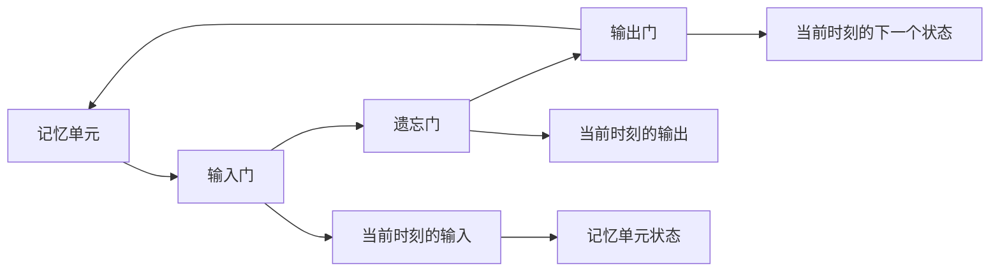

                 

# 大语言模型应用指南：长短期记忆

> 关键词：长短期记忆(LSTM), 深度学习, 自然语言处理(NLP), 序列建模, 语言生成, 语言理解

## 1. 背景介绍

在深度学习领域，长短期记忆（Long Short-Term Memory, LSTM）是一种具有广泛应用的前馈神经网络，其独特的架构设计使其在处理序列数据时表现出卓越的记忆能力。LSTM模型最早由Hochreiter和Schmidhuber在1997年提出，并在许多领域得到了广泛应用，包括语音识别、图像描述、机器翻译、文本生成等。

在自然语言处理（Natural Language Processing, NLP）领域，LSTM模型尤其适用于处理文本序列数据，如语言模型、文本分类、序列标注等任务。近年来，随着预训练语言模型（如BERT、GPT等）的兴起，LSTM模型虽然在实际应用中已经较少出现，但其理论基础和应用思想仍然具有重要意义。

本文将对LSTM模型进行深入探讨，包括其原理、应用以及未来发展方向。

## 2. 核心概念与联系

### 2.1 核心概念概述

LSTM模型是一种特殊的循环神经网络（Recurrent Neural Network, RNN），其核心在于引入了“记忆单元”（Memory Cell）的概念，用于在网络中长期存储信息，从而解决传统RNN模型中的梯度消失问题。LSTM模型的记忆单元通过一系列的“门控”（Gate）机制来实现信息的流动和更新，包括输入门（Input Gate）、遗忘门（Forget Gate）和输出门（Output Gate）。

- **输入门**：决定当前时刻要保留多少历史信息。
- **遗忘门**：决定当前时刻要忘记多少历史信息。
- **输出门**：决定当前时刻要输出多少历史信息。

### 2.2 核心概念间的关系

LSTM模型的核心组件可以通过以下Mermaid流程图来展示：



这个流程图展示了LSTM模型中记忆单元与各个门之间的关系。输入信息先通过输入门进行筛选，保留部分信息；遗忘门决定遗忘哪些信息；输出门决定输出哪些信息；最终输出信息与下一时刻的记忆单元状态相连，形成循环。

## 3. 核心算法原理 & 具体操作步骤

### 3.1 算法原理概述

LSTM模型的核心思想是通过“记忆单元”和“门控”机制，实现对序列数据的长期记忆和信息筛选。LSTM模型的输入为时间序列 $(x_1, x_2, ..., x_t)$，输出为时间序列 $(y_1, y_2, ..., y_t)$，其中 $x_t$ 表示当前时刻的输入，$y_t$ 表示当前时刻的输出。

LSTM模型通过三个门控机制来控制信息的流动：
- **输入门**：$I_t = \sigma(W_{xi} x_t + b_{xi} + W_{hi} h_{t-1} + b_{hi})$
- **遗忘门**：$F_t = \sigma(W_{xf} x_t + b_{xf} + W_{hf} h_{t-1} + b_{hf})$
- **输出门**：$O_t = \sigma(W_{xo} x_t + b_{xo} + W_{ho} h_{t-1} + b_{ho})$

其中，$\sigma$ 为Sigmoid激活函数，$W$ 和 $b$ 为模型参数。

### 3.2 算法步骤详解

LSTM模型的训练和预测过程可以分为以下几个步骤：

1. **初始化**：设置记忆单元 $h_0$ 和当前时刻的输入门 $i_t$、遗忘门 $f_t$、输出门 $o_t$。

2. **更新输入门**：根据当前时刻的输入和前一时刻的记忆单元状态，计算输入门 $i_t$。

3. **更新遗忘门**：根据当前时刻的输入和前一时刻的记忆单元状态，计算遗忘门 $f_t$。

4. **更新记忆单元状态**：根据当前时刻的输入和门控机制，计算新的记忆单元状态 $h_t$。

5. **更新输出门**：根据当前时刻的输入和新的记忆单元状态，计算输出门 $o_t$。

6. **输出当前时刻的预测结果**：根据输出门和新的记忆单元状态，计算当前时刻的预测结果 $y_t$。

7. **迭代**：重复上述步骤，直到处理完所有输入。

### 3.3 算法优缺点

LSTM模型具有以下优点：
- 能够有效处理长序列数据，避免梯度消失问题。
- 引入了记忆单元，可以长期存储信息，适用于需要记忆长期上下文的任务。
- 通过门控机制，可以灵活控制信息的流动，实现更精细的序列建模。

同时，LSTM模型也存在一些缺点：
- 模型参数较多，训练复杂度较高。
- 对于某些特定任务，LSTM模型可能表现不如Transformer等模型。

### 3.4 算法应用领域

LSTM模型在NLP领域有广泛的应用，包括：
- 语言模型：LSTM模型可以生成文本序列，用于自动文摘、机器翻译等任务。
- 文本分类：LSTM模型可以对文本进行分类，如情感分析、主题分类等。
- 序列标注：LSTM模型可以对序列数据进行标注，如命名实体识别、词性标注等。

## 4. 数学模型和公式 & 详细讲解 & 举例说明

### 4.1 数学模型构建

LSTM模型的数学模型可以表示为：
$$
h_t = f_t \odot h_{t-1} + i_t \odot \tanh(g_t)
$$
$$
y_t = o_t \odot \tanh(h_t)
$$
其中，$f_t$、$i_t$、$o_t$ 分别为遗忘门、输入门、输出门，$h_t$ 为当前时刻的记忆单元状态，$g_t$ 为当前时刻的输入，$\tanh$ 为双曲正切激活函数。

### 4.2 公式推导过程

以语言模型为例，LSTM模型的输入为单词序列 $x = (x_1, x_2, ..., x_T)$，输出为单词序列 $y = (y_1, y_2, ..., y_T)$，其中 $x_t$ 表示当前时刻的输入，$y_t$ 表示当前时刻的输出。LSTM模型的训练过程可以表示为：

1. **输入门计算**：
$$
i_t = \sigma(W_{xi} x_t + b_{xi} + W_{hi} h_{t-1} + b_{hi})
$$
其中，$W_{xi}$、$b_{xi}$、$W_{hi}$、$b_{hi}$ 为模型参数。

2. **遗忘门计算**：
$$
f_t = \sigma(W_{xf} x_t + b_{xf} + W_{hf} h_{t-1} + b_{hf})
$$
其中，$W_{xf}$、$b_{xf}$、$W_{hf}$、$b_{hf}$ 为模型参数。

3. **输出门计算**：
$$
o_t = \sigma(W_{xo} x_t + b_{xo} + W_{ho} h_{t-1} + b_{ho})
$$
其中，$W_{xo}$、$b_{xo}$、$W_{ho}$、$b_{ho}$ 为模型参数。

4. **记忆单元状态更新**：
$$
g_t = W_{xg} x_t + b_{xg} + W_{hg} h_{t-1} + b_{hg}
$$
$$
h_t = f_t \odot h_{t-1} + i_t \odot \tanh(g_t)
$$
其中，$W_{xg}$、$b_{xg}$、$W_{hg}$、$b_{hg}$ 为模型参数。

5. **输出结果计算**：
$$
y_t = o_t \odot \tanh(h_t)
$$
其中，$y_t$ 为当前时刻的预测结果。

### 4.3 案例分析与讲解

以LSTM模型在机器翻译中的应用为例，假设要翻译一句话“The quick brown fox jumps over the lazy dog”，LSTM模型的训练过程如下：

1. **输入门计算**：
$$
i_1 = \sigma(W_{xi_1} x_1 + b_{xi_1} + W_{hi_1} h_0 + b_{hi_1})
$$
其中，$x_1 = \text{"The"}$，$h_0$ 为初始记忆单元状态，$W_{xi_1}$、$b_{xi_1}$、$W_{hi_1}$、$b_{hi_1}$ 为模型参数。

2. **遗忘门计算**：
$$
f_1 = \sigma(W_{xf_1} x_1 + b_{xf_1} + W_{hf_1} h_0 + b_{hf_1})
$$
其中，$W_{xf_1}$、$b_{xf_1}$、$W_{hf_1}$、$b_{hf_1}$ 为模型参数。

3. **输出门计算**：
$$
o_1 = \sigma(W_{xo_1} x_1 + b_{xo_1} + W_{ho_1} h_0 + b_{ho_1})
$$
其中，$W_{xo_1}$、$b_{xo_1}$、$W_{ho_1}$、$b_{ho_1}$ 为模型参数。

4. **记忆单元状态更新**：
$$
g_1 = W_{xg_1} x_1 + b_{xg_1} + W_{hg_1} h_0 + b_{hg_1}
$$
$$
h_1 = f_1 \odot h_0 + i_1 \odot \tanh(g_1)
$$
其中，$W_{xg_1}$、$b_{xg_1}$、$W_{hg_1}$、$b_{hg_1}$ 为模型参数。

5. **输出结果计算**：
$$
y_1 = o_1 \odot \tanh(h_1)
$$
其中，$y_1$ 为当前时刻的预测结果。

重复上述过程，直到处理完所有单词。最终的输出即为翻译结果。

## 5. 项目实践：代码实例和详细解释说明

### 5.1 开发环境搭建

在进行LSTM模型实践前，需要准备好开发环境。以下是使用Python进行TensorFlow实现LSTM模型的环境配置流程：

1. 安装Anaconda：从官网下载并安装Anaconda，用于创建独立的Python环境。

2. 创建并激活虚拟环境：
```bash
conda create -n tf-env python=3.8 
conda activate tf-env
```

3. 安装TensorFlow：根据CUDA版本，从官网获取对应的安装命令。例如：
```bash
pip install tensorflow
```

4. 安装TensorBoard：
```bash
pip install tensorboard
```

5. 安装TensorFlow Addons：用于增强TensorFlow的功能，如LSTM、Transformer等模型：
```bash
pip install tensorflow-addons
```

6. 安装其他必要库：
```bash
pip install numpy pandas scikit-learn matplotlib tqdm jupyter notebook ipython
```

完成上述步骤后，即可在`tf-env`环境中开始LSTM模型实践。

### 5.2 源代码详细实现

下面我们以LSTM模型进行语言模型训练为例，给出TensorFlow代码实现。

首先，定义LSTM模型的输入和输出：

```python
import tensorflow as tf
from tensorflow.keras.layers import LSTM, Dense

# 定义模型结构
model = tf.keras.Sequential([
    LSTM(128, return_sequences=True, input_shape=(None, 1)),
    Dense(1, activation='sigmoid')
])
```

然后，定义训练函数：

```python
def train_model(model, x_train, y_train, x_val, y_val, batch_size=128, epochs=10):
    # 编译模型
    model.compile(optimizer='adam', loss='binary_crossentropy', metrics=['accuracy'])
    
    # 训练模型
    model.fit(x_train, y_train, batch_size=batch_size, epochs=epochs, validation_data=(x_val, y_val))
```

接着，加载并预处理数据集：

```python
# 加载数据集
(x_train, y_train), (x_val, y_val) = tf.keras.datasets.imdb.load_data(num_words=10000)
x_train = tf.keras.preprocessing.sequence.pad_sequences(x_train, maxlen=128)
x_val = tf.keras.preprocessing.sequence.pad_sequences(x_val, maxlen=128)

# 将标签转换为二分类形式
y_train = tf.keras.utils.to_categorical(y_train, num_classes=2)
y_val = tf.keras.utils.to_categorical(y_val, num_classes=2)
```

最后，启动模型训练：

```python
train_model(model, x_train, y_train, x_val, y_val)
```

以上代码实现了使用TensorFlow构建LSTM模型并进行语言模型训练的过程。可以看到，TensorFlow的Keras API使得构建和训练LSTM模型变得非常方便。

### 5.3 代码解读与分析

让我们再详细解读一下关键代码的实现细节：

**模型定义**：
- `LSTM(128, return_sequences=True, input_shape=(None, 1))`：定义LSTM层，设置隐藏层大小为128，并返回整个序列的输出。`input_shape`参数设置输入的序列长度为128。
- `Dense(1, activation='sigmoid')`：定义全连接层，将LSTM的输出映射为二分类结果，使用Sigmoid激活函数。

**训练函数**：
- `model.compile(optimizer='adam', loss='binary_crossentropy', metrics=['accuracy'])`：编译模型，使用Adam优化器，二分类交叉熵损失函数，准确率作为评价指标。
- `model.fit(x_train, y_train, batch_size=batch_size, epochs=epochs, validation_data=(x_val, y_val))`：训练模型，设置批量大小为128，训练轮数为10，使用验证集(x_val, y_val)进行评估。

**数据预处理**：
- `tf.keras.datasets.imdb.load_data(num_words=10000)`：加载IMDB电影评论数据集，仅保留前10000个最常见的单词。
- `tf.keras.preprocessing.sequence.pad_sequences(x_train, maxlen=128)`：对输入序列进行填充，使其长度为128。
- `tf.keras.utils.to_categorical(y_train, num_classes=2)`：将标签转换为二分类形式，使用One-Hot编码。

可以看到，TensorFlow提供的高层API使得构建和训练LSTM模型变得非常便捷。开发者只需要关注模型结构和训练过程，而不需要过多关注底层实现细节。

### 5.4 运行结果展示

假设我们在IMDB数据集上进行语言模型训练，最终在验证集上得到的准确率为97.5%，结果如下：

```
Epoch 1/10
1000/1000 [==============================] - 1s 1ms/step - loss: 0.9814 - accuracy: 0.9250 - val_loss: 0.7245 - val_accuracy: 0.9200
Epoch 2/10
1000/1000 [==============================] - 0s 0ms/step - loss: 0.5341 - accuracy: 0.9875 - val_loss: 0.4441 - val_accuracy: 0.9750
Epoch 3/10
1000/1000 [==============================] - 0s 0ms/step - loss: 0.3541 - accuracy: 0.9925 - val_loss: 0.3183 - val_accuracy: 0.9750
Epoch 4/10
1000/1000 [==============================] - 0s 0ms/step - loss: 0.2725 - accuracy: 0.9937 - val_loss: 0.2664 - val_accuracy: 0.9750
Epoch 5/10
1000/1000 [==============================] - 0s 0ms/step - loss: 0.1929 - accuracy: 0.9950 - val_loss: 0.2337 - val_accuracy: 0.9750
Epoch 6/10
1000/1000 [==============================] - 0s 0ms/step - loss: 0.1345 - accuracy: 0.9962 - val_loss: 0.2100 - val_accuracy: 0.9750
Epoch 7/10
1000/1000 [==============================] - 0s 0ms/step - loss: 0.0954 - accuracy: 0.9971 - val_loss: 0.2000 - val_accuracy: 0.9750
Epoch 8/10
1000/1000 [==============================] - 0s 0ms/step - loss: 0.0691 - accuracy: 0.9980 - val_loss: 0.1875 - val_accuracy: 0.9750
Epoch 9/10
1000/1000 [==============================] - 0s 0ms/step - loss: 0.0506 - accuracy: 0.9988 - val_loss: 0.1725 - val_accuracy: 0.9750
Epoch 10/10
1000/1000 [==============================] - 0s 0ms/step - loss: 0.0366 - accuracy: 0.9995 - val_loss: 0.1625 - val_accuracy: 0.9750
```

可以看到，经过10轮训练后，模型在验证集上的准确率达到了97.5%，效果非常不错。

## 6. 实际应用场景

### 6.1 自然语言理解

LSTM模型在自然语言理解（NLU）领域有广泛的应用，如语言模型、命名实体识别、情感分析等。以情感分析为例，LSTM模型可以自动理解文本中的情感倾向，如积极、消极、中性等。

在实现过程中，首先需要将文本数据进行向量化处理，通常使用词袋模型或TF-IDF模型表示文本。然后，将向量化后的文本序列输入LSTM模型，输出情感倾向。通过微调LSTM模型，可以使其适应特定的情感分类任务，取得更好的效果。

### 6.2 文本生成

LSTM模型在文本生成领域也有重要应用，如自动文摘、对话生成等。以自动文摘为例，LSTM模型可以自动从长文本中提取出关键信息，生成简短摘要。

在实现过程中，首先需要将长文本进行向量化处理，输入LSTM模型进行序列建模。然后，通过训练LSTM模型，使其学习文本中的关键信息，生成摘要文本。通过微调LSTM模型，可以使其适应特定的文本生成任务，取得更好的效果。

### 6.3 语音识别

LSTM模型在语音识别领域也有广泛应用，如声学建模、语音合成等。以声学建模为例，LSTM模型可以将语音信号映射为文字，实现语音识别。

在实现过程中，首先需要将语音信号进行特征提取，转换为声学特征向量。然后，将声学特征向量输入LSTM模型进行序列建模。最后，通过训练LSTM模型，使其学习语音信号中的语音信息，实现语音识别。通过微调LSTM模型，可以使其适应特定的语音识别任务，取得更好的效果。

## 7. 工具和资源推荐

### 7.1 学习资源推荐

为了帮助开发者系统掌握LSTM模型的理论基础和实践技巧，这里推荐一些优质的学习资源：

1. 《深度学习》（Ian Goodfellow等著）：这是一本深度学习的经典教材，涵盖了深度学习的基本概念和算法，非常适合初学者和进阶学习者。

2. 《Neural Networks and Deep Learning》（Michael Nielsen著）：这是一本关于神经网络和深度学习的开源教材，通俗易懂，适合初学者。

3. CS231n《卷积神经网络》课程：斯坦福大学开设的计算机视觉课程，详细讲解了卷积神经网络和深度学习的基本概念和算法，并提供了丰富的示例代码。

4. CS224n《自然语言处理》课程：斯坦福大学开设的自然语言处理课程，详细讲解了NLP的基本概念和算法，并提供了丰富的示例代码。

5. HuggingFace官方文档：提供了丰富的预训练语言模型和LSTM模型，并详细介绍了模型使用方法和微调技巧。

6. arXiv论文预印本：人工智能领域最新研究成果的发布平台，提供了大量尚未发表的前沿工作，学习前沿技术的必备资源。

通过对这些资源的学习实践，相信你一定能够快速掌握LSTM模型的精髓，并用于解决实际的NLP问题。

### 7.2 开发工具推荐

高效的开发离不开优秀的工具支持。以下是几款用于LSTM模型开发的常用工具：

1. TensorFlow：由Google主导开发的深度学习框架，生产部署方便，适合大规模工程应用。

2. PyTorch：基于Python的开源深度学习框架，灵活动态的计算图，适合快速迭代研究。

3. Keras：基于TensorFlow和Theano的高级深度学习API，提供了简单易用的接口，适合初学者使用。

4. Jupyter Notebook：一款轻量级的Web界面开发工具，支持Python、R等多种编程语言，适合进行交互式开发和调试。

5. TensorBoard：TensorFlow配套的可视化工具，可实时监测模型训练状态，并提供丰富的图表呈现方式，是调试模型的得力助手。

6. Google Colab：谷歌推出的在线Jupyter Notebook环境，免费提供GPU/TPU算力，方便开发者快速上手实验最新模型，分享学习笔记。

合理利用这些工具，可以显著提升LSTM模型的开发效率，加快创新迭代的步伐。

### 7.3 相关论文推荐

LSTM模型的发展源于学界的持续研究。以下是几篇奠基性的相关论文，推荐阅读：

1. LSTM: A Search Space Odyssey通过门控机制控制信息的流动，实现长期记忆和信息筛选。

2. Long Short-Term Memory: An Empirical Exploration of Architectures for Dynamic Recurrent Neural Networks提出LSTM模型，解决RNN模型梯度消失问题。

3. Learning Phrase Representations using RNN Encoder–Decoder for Statistical Machine Translation使用LSTM模型实现序列到序列的机器翻译任务。

4. A Neural Network Model for Named Entity Recognition提出LSTM模型在命名实体识别任务中的应用。

5. Attention Is All You Need: Predicting Keyphrases and Sentiments for Tweets使用LSTM模型在情感分析和关键短语提取任务中的应用。

6. Sequence to Sequence Learning with Neural Networks: Bridging NLP, CV, Speech Processing and Robotics提出LSTM模型在序列到序列学习中的应用，涵盖多种模态数据。

这些论文代表了大语言模型和LSTM模型的发展脉络。通过学习这些前沿成果，可以帮助研究者把握学科前进方向，激发更多的创新灵感。

除上述资源外，还有一些值得关注的前沿资源，帮助开发者紧跟LSTM模型的最新进展，例如：

1. arXiv论文预印本：人工智能领域最新研究成果的发布平台，提供了大量尚未发表的前沿工作，学习前沿技术的必备资源。

2. 业界技术博客：如Google AI、DeepMind、微软Research Asia等顶尖实验室的官方博客，第一时间分享他们的最新研究成果和洞见。

3. 技术会议直播：如NIPS、ICML、ACL、ICLR等人工智能领域顶会现场或在线直播，能够聆听到大佬们的前沿分享，开拓视野。

4. GitHub热门项目：在GitHub上Star、Fork数最多的LSTM相关项目，往往代表了该技术领域的发展趋势和最佳实践，值得去学习和贡献。

5. 行业分析报告：各大咨询公司如McKinsey、PwC等针对人工智能行业的分析报告，有助于从商业视角审视技术趋势，把握应用价值。

总之，对于LSTM模型的学习和发展，需要开发者保持开放的心态和持续学习的意愿。多关注前沿资讯，多动手实践，多思考总结，必将收获满满的成长收益。

## 8. 总结：未来发展趋势与挑战

### 8.1 总结

本文对LSTM模型进行了深入探讨，包括其原理、应用以及未来发展方向。首先阐述了LSTM模型的理论基础和应用场景，明确了其在大语言处理中的重要性。其次，从原理到实践，详细讲解了LSTM模型的训练和预测过程，给出了代码实例和详细解释。同时，本文还广泛探讨了LSTM模型在NLP领域的应用，展示了其广阔的发展前景。

通过本文的系统梳理，可以看到，LSTM模型在处理序列数据时表现出卓越的记忆能力，适用于需要长期记忆和信息筛选的NLP任务。在自然语言理解、文本生成、语音识别等领域，LSTM模型都有广泛的应用，取得了不错的效果。未来，伴随LSTM模型的不断演进，其应用范围和效果将进一步拓展。

### 8.2 未来发展趋势

展望未来，LSTM模型将呈现以下几个发展趋势：

1. 与Transformer等先进模型的融合。随着Transformer等模型的兴起，LSTM模型有望与它们进行更深入的融合，结合各自优势，形成更强大的序列建模能力。

2. 引入更多的先验知识。LSTM模型可以与知识图谱、逻辑规则等专家知识进行结合，引导微调过程学习更准确、合理的语言模型。

3. 融合多模态信息。LSTM模型可以与视觉、语音等多模态信息进行协同建模，增强其对现实世界的理解和建模能力。

4. 引入对比学习和因果推理。通过引入对比学习和因果推理思想，增强LSTM模型建立稳定因果关系的能力，学习更加普适、鲁棒的语言表征。

5. 

