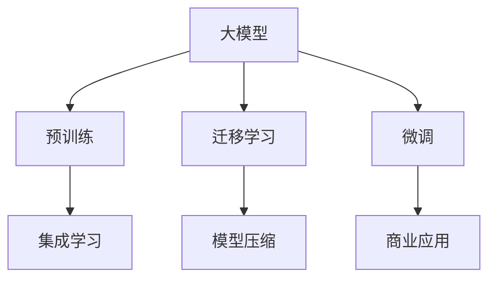

                 

# 大模型的市场推广与应用

## 1. 背景介绍

### 1.1 问题由来

近年来，随着深度学习技术的快速发展，大模型在各行各业的应用已经取得了显著的进展。然而，尽管大模型在学术界和工业界都获得了广泛认可，其在市场推广和实际应用中的普及程度仍然不足。主要原因包括：

1. **技术壁垒**：大模型通常需要强大的计算资源和丰富的数据支持，普通企业和开发者难以负担。
2. **缺乏共识**：市场对大模型的认识和需求存在较大差异，缺乏统一的标准和定义。
3. **商业应用挑战**：大模型在实际应用中可能面临隐私、安全、伦理等多方面的挑战。

### 1.2 问题核心关键点

为解决这些问题，本文将探讨如何有效推广和应用大模型，包括：

- **技术普及**：如何降低大模型的技术壁垒，使其更加易用和普及。
- **市场推广**：如何通过商业策略和社区建设，提升大模型的知名度和接受度。
- **应用落地**：如何结合实际需求，推动大模型在各行各业中的应用，解决具体问题。

## 2. 核心概念与联系

### 2.1 核心概念概述

为了更好地理解大模型的市场推广与应用，本节将介绍几个密切相关的核心概念：

- **大模型**：指在特定领域或任务上经过大规模训练的深度学习模型，具备强大的学习能力和泛化能力。
- **迁移学习**：指将模型从一种任务迁移到另一种相关任务上，以减少训练时间和提高性能。
- **微调(Fine-tuning)**：指在预训练模型的基础上，使用特定任务的数据对其进行进一步优化。
- **预训练**：指在大规模无标签数据上对模型进行训练，使其具备广泛的知识和能力。
- **集成学习**：指将多个模型的预测结果进行加权平均或投票，以提高模型的整体性能。
- **模型压缩**：指通过量化、剪枝、蒸馏等技术，减小模型的参数量，提高计算效率。

### 2.2 概念间的关系

这些核心概念之间的逻辑关系可以通过以下Mermaid流程图来展示：



这个流程图展示了从预训练到商业应用的大模型推广与应用过程。大模型首先在大规模无标签数据上进行预训练，然后通过迁移学习和微调适应特定任务，最后通过集成学习和模型压缩等技术优化模型性能，推广应用到实际业务中。

## 3. 核心算法原理 & 具体操作步骤

### 3.1 算法原理概述

大模型的市场推广与应用，本质上是一个多领域、多层次的复杂过程，涉及技术、商业、社区等多个方面的协同作用。其核心算法原理主要包括：

- **预训练技术**：通过大规模无标签数据，使模型具备广泛的知识和能力。
- **迁移学习**：将模型从一种任务迁移到另一种相关任务上，提高模型的泛化能力。
- **微调**：在特定任务上对模型进行进一步优化，使其适应实际需求。
- **集成学习**：通过加权平均或投票等方法，提高模型的整体性能。
- **模型压缩**：通过量化、剪枝、蒸馏等技术，减小模型参数量，提高计算效率。

### 3.2 算法步骤详解

大模型的市场推广与应用，一般包括以下几个关键步骤：

1. **技术研发**：在特定领域或任务上进行大规模无标签数据预训练，使模型具备广泛的知识和能力。
2. **商业策略**：通过市场调研和用户反馈，制定合理的商业策略，包括定价、销售渠道等。
3. **应用落地**：结合实际需求，推动大模型在各行各业中的应用，解决具体问题。
4. **社区建设**：通过开源社区和技术交流，提升大模型的知名度和接受度。
5. **迭代优化**：根据用户反馈和市场变化，不断优化模型和应用方案，提高市场竞争力。

### 3.3 算法优缺点

大模型的市场推广与应用，具有以下优点：

1. **性能优越**：大模型具备强大的学习能力和泛化能力，能够在复杂任务上取得优异的性能。
2. **成本效益**：通过迁移学习和微调等技术，可以显著减少训练时间和成本。
3. **市场竞争力**：大模型具有较高的技术壁垒和市场认知度，容易获得较高的利润。

同时，该方法也存在一些局限性：

1. **技术复杂**：大模型通常需要强大的计算资源和丰富的数据支持，普通企业和开发者难以负担。
2. **应用挑战**：大模型在实际应用中可能面临隐私、安全、伦理等多方面的挑战。
3. **市场认知不足**：市场对大模型的认识和需求存在较大差异，缺乏统一的标准和定义。

### 3.4 算法应用领域

大模型的市场推广与应用，已经在多个领域取得了显著的进展，包括但不限于：

- **自然语言处理(NLP)**：如文本分类、机器翻译、情感分析等。
- **计算机视觉(CV)**：如图像识别、目标检测、图像生成等。
- **语音识别与生成**：如语音识别、语音合成等。
- **医疗健康**：如医学影像分析、基因组分析等。
- **金融科技**：如风险评估、信用评分等。

## 4. 数学模型和公式 & 详细讲解  
### 4.1 数学模型构建

大模型的市场推广与应用，涉及多方面的数学模型和算法，以下以自然语言处理(NLP)领域为例，介绍核心模型和算法的构建。

记大模型为 $M_{\theta}$，其中 $\theta$ 为模型的参数。假设在特定任务上，使用标注数据集 $D=\{(x_i,y_i)\}_{i=1}^N$ 进行微调，其中 $x_i$ 为输入，$y_i$ 为标签。

定义模型在输入 $x_i$ 上的输出为 $y_i = M_{\theta}(x_i)$，则模型的损失函数为：

$$
\mathcal{L}(\theta) = \frac{1}{N}\sum_{i=1}^N \ell(y_i, M_{\theta}(x_i))
$$

其中 $\ell(y_i, M_{\theta}(x_i))$ 为损失函数，可以是交叉熵损失、均方误差损失等。

### 4.2 公式推导过程

以二分类任务为例，假设模型 $M_{\theta}$ 在输入 $x_i$ 上的输出为 $y_i = M_{\theta}(x_i) \in [0,1]$，表示样本属于正类的概率。真实标签 $y_i \in \{0,1\}$。则二分类交叉熵损失函数定义为：

$$
\ell(y_i, M_{\theta}(x_i)) = -[y_i\log M_{\theta}(x_i) + (1-y_i)\log(1-M_{\theta}(x_i))]
$$

将其代入损失函数公式，得：

$$
\mathcal{L}(\theta) = -\frac{1}{N}\sum_{i=1}^N [y_i\log M_{\theta}(x_i)+(1-y_i)\log(1-M_{\theta}(x_i))]
$$

根据链式法则，损失函数对参数 $\theta_k$ 的梯度为：

$$
\frac{\partial \mathcal{L}(\theta)}{\partial \theta_k} = -\frac{1}{N}\sum_{i=1}^N \frac{y_i}{M_{\theta}(x_i)} - \frac{1-y_i}{1-M_{\theta}(x_i)}
$$

在得到损失函数的梯度后，即可带入参数更新公式，完成模型的迭代优化。重复上述过程直至收敛，最终得到适应下游任务的最优模型参数 $\theta^*$。

## 5. 项目实践：代码实例和详细解释说明

### 5.1 开发环境搭建

在进行市场推广与应用前，我们需要准备好开发环境。以下是使用Python进行PyTorch开发的环境配置流程：

1. 安装Anaconda：从官网下载并安装Anaconda，用于创建独立的Python环境。

2. 创建并激活虚拟环境：
```bash
conda create -n pytorch-env python=3.8 
conda activate pytorch-env
```

3. 安装PyTorch：根据CUDA版本，从官网获取对应的安装命令。例如：
```bash
conda install pytorch torchvision torchaudio cudatoolkit=11.1 -c pytorch -c conda-forge
```

4. 安装各类工具包：
```bash
pip install numpy pandas scikit-learn matplotlib tqdm jupyter notebook ipython
```

完成上述步骤后，即可在`pytorch-env`环境中开始市场推广与应用实践。

### 5.2 源代码详细实现

下面我们以命名实体识别(NER)任务为例，给出使用Transformers库对BERT模型进行微调的PyTorch代码实现。

首先，定义NER任务的数据处理函数：

```python
from transformers import BertTokenizer
from torch.utils.data import Dataset
import torch

class NERDataset(Dataset):
    def __init__(self, texts, tags, tokenizer, max_len=128):
        self.texts = texts
        self.tags = tags
        self.tokenizer = tokenizer
        self.max_len = max_len
        
    def __len__(self):
        return len(self.texts)
    
    def __getitem__(self, item):
        text = self.texts[item]
        tags = self.tags[item]
        
        encoding = self.tokenizer(text, return_tensors='pt', max_length=self.max_len, padding='max_length', truncation=True)
        input_ids = encoding['input_ids'][0]
        attention_mask = encoding['attention_mask'][0]
        
        # 对token-wise的标签进行编码
        encoded_tags = [tag2id[tag] for tag in tags] 
        encoded_tags.extend([tag2id['O']] * (self.max_len - len(encoded_tags)))
        labels = torch.tensor(encoded_tags, dtype=torch.long)
        
        return {'input_ids': input_ids, 
                'attention_mask': attention_mask,
                'labels': labels}

# 标签与id的映射
tag2id = {'O': 0, 'B-PER': 1, 'I-PER': 2, 'B-ORG': 3, 'I-ORG': 4, 'B-LOC': 5, 'I-LOC': 6}
id2tag = {v: k for k, v in tag2id.items()}

# 创建dataset
tokenizer = BertTokenizer.from_pretrained('bert-base-cased')

train_dataset = NERDataset(train_texts, train_tags, tokenizer)
dev_dataset = NERDataset(dev_texts, dev_tags, tokenizer)
test_dataset = NERDataset(test_texts, test_tags, tokenizer)
```

然后，定义模型和优化器：

```python
from transformers import BertForTokenClassification, AdamW

model = BertForTokenClassification.from_pretrained('bert-base-cased', num_labels=len(tag2id))

optimizer = AdamW(model.parameters(), lr=2e-5)
```

接着，定义训练和评估函数：

```python
from torch.utils.data import DataLoader
from tqdm import tqdm
from sklearn.metrics import classification_report

device = torch.device('cuda') if torch.cuda.is_available() else torch.device('cpu')
model.to(device)

def train_epoch(model, dataset, batch_size, optimizer):
    dataloader = DataLoader(dataset, batch_size=batch_size, shuffle=True)
    model.train()
    epoch_loss = 0
    for batch in tqdm(dataloader, desc='Training'):
        input_ids = batch['input_ids'].to(device)
        attention_mask = batch['attention_mask'].to(device)
        labels = batch['labels'].to(device)
        model.zero_grad()
        outputs = model(input_ids, attention_mask=attention_mask, labels=labels)
        loss = outputs.loss
        epoch_loss += loss.item()
        loss.backward()
        optimizer.step()
    return epoch_loss / len(dataloader)

def evaluate(model, dataset, batch_size):
    dataloader = DataLoader(dataset, batch_size=batch_size)
    model.eval()
    preds, labels = [], []
    with torch.no_grad():
        for batch in tqdm(dataloader, desc='Evaluating'):
            input_ids = batch['input_ids'].to(device)
            attention_mask = batch['attention_mask'].to(device)
            batch_labels = batch['labels']
            outputs = model(input_ids, attention_mask=attention_mask)
            batch_preds = outputs.logits.argmax(dim=2).to('cpu').tolist()
            batch_labels = batch_labels.to('cpu').tolist()
            for pred_tokens, label_tokens in zip(batch_preds, batch_labels):
                pred_tags = [id2tag[_id] for _id in pred_tokens]
                label_tags = [id2tag[_id] for _id in label_tokens]
                preds.append(pred_tags[:len(label_tags)])
                labels.append(label_tags)
                
    print(classification_report(labels, preds))
```

最后，启动训练流程并在测试集上评估：

```python
epochs = 5
batch_size = 16

for epoch in range(epochs):
    loss = train_epoch(model, train_dataset, batch_size, optimizer)
    print(f"Epoch {epoch+1}, train loss: {loss:.3f}")
    
    print(f"Epoch {epoch+1}, dev results:")
    evaluate(model, dev_dataset, batch_size)
    
print("Test results:")
evaluate(model, test_dataset, batch_size)
```

以上就是使用PyTorch对BERT进行命名实体识别任务微调的完整代码实现。可以看到，得益于Transformers库的强大封装，我们可以用相对简洁的代码完成BERT模型的加载和微调。

### 5.3 代码解读与分析

让我们再详细解读一下关键代码的实现细节：

**NERDataset类**：
- `__init__`方法：初始化文本、标签、分词器等关键组件。
- `__len__`方法：返回数据集的样本数量。
- `__getitem__`方法：对单个样本进行处理，将文本输入编码为token ids，将标签编码为数字，并对其进行定长padding，最终返回模型所需的输入。

**tag2id和id2tag字典**：
- 定义了标签与数字id之间的映射关系，用于将token-wise的预测结果解码回真实的标签。

**训练和评估函数**：
- 使用PyTorch的DataLoader对数据集进行批次化加载，供模型训练和推理使用。
- 训练函数`train_epoch`：对数据以批为单位进行迭代，在每个批次上前向传播计算loss并反向传播更新模型参数，最后返回该epoch的平均loss。
- 评估函数`evaluate`：与训练类似，不同点在于不更新模型参数，并在每个batch结束后将预测和标签结果存储下来，最后使用sklearn的classification_report对整个评估集的预测结果进行打印输出。

**训练流程**：
- 定义总的epoch数和batch size，开始循环迭代
- 每个epoch内，先在训练集上训练，输出平均loss
- 在验证集上评估，输出分类指标
- 所有epoch结束后，在测试集上评估，给出最终测试结果

可以看到，PyTorch配合Transformers库使得BERT微调的代码实现变得简洁高效。开发者可以将更多精力放在数据处理、模型改进等高层逻辑上，而不必过多关注底层的实现细节。

当然，工业级的系统实现还需考虑更多因素，如模型的保存和部署、超参数的自动搜索、更灵活的任务适配层等。但核心的市场推广与应用过程基本与此类似。

## 6. 实际应用场景

### 6.1 智能客服系统

基于大模型的微调技术，可以广泛应用于智能客服系统的构建。传统客服往往需要配备大量人力，高峰期响应缓慢，且一致性和专业性难以保证。而使用微调后的对话模型，可以7x24小时不间断服务，快速响应客户咨询，用自然流畅的语言解答各类常见问题。

在技术实现上，可以收集企业内部的历史客服对话记录，将问题和最佳答复构建成监督数据，在此基础上对预训练对话模型进行微调。微调后的对话模型能够自动理解用户意图，匹配最合适的答案模板进行回复。对于客户提出的新问题，还可以接入检索系统实时搜索相关内容，动态组织生成回答。如此构建的智能客服系统，能大幅提升客户咨询体验和问题解决效率。

### 6.2 金融舆情监测

金融机构需要实时监测市场舆论动向，以便及时应对负面信息传播，规避金融风险。传统的人工监测方式成本高、效率低，难以应对网络时代海量信息爆发的挑战。基于大模型的文本分类和情感分析技术，为金融舆情监测提供了新的解决方案。

具体而言，可以收集金融领域相关的新闻、报道、评论等文本数据，并对其进行主题标注和情感标注。在此基础上对预训练语言模型进行微调，使其能够自动判断文本属于何种主题，情感倾向是正面、中性还是负面。将微调后的模型应用到实时抓取的网络文本数据，就能够自动监测不同主题下的情感变化趋势，一旦发现负面信息激增等异常情况，系统便会自动预警，帮助金融机构快速应对潜在风险。

### 6.3 个性化推荐系统

当前的推荐系统往往只依赖用户的历史行为数据进行物品推荐，无法深入理解用户的真实兴趣偏好。基于大模型微调技术，个性化推荐系统可以更好地挖掘用户行为背后的语义信息，从而提供更精准、多样的推荐内容。

在实践中，可以收集用户浏览、点击、评论、分享等行为数据，提取和用户交互的物品标题、描述、标签等文本内容。将文本内容作为模型输入，用户的后续行为（如是否点击、购买等）作为监督信号，在此基础上微调预训练语言模型。微调后的模型能够从文本内容中准确把握用户的兴趣点。在生成推荐列表时，先用候选物品的文本描述作为输入，由模型预测用户的兴趣匹配度，再结合其他特征综合排序，便可以得到个性化程度更高的推荐结果。

## 7. 工具和资源推荐

### 7.1 学习资源推荐

为了帮助开发者系统掌握大模型市场推广与应用的理论基础和实践技巧，这里推荐一些优质的学习资源：

1. 《Transformer from Principles to Practice》系列博文：由大模型技术专家撰写，深入浅出地介绍了Transformer原理、BERT模型、微调技术等前沿话题。

2. CS224N《深度学习自然语言处理》课程：斯坦福大学开设的NLP明星课程，有Lecture视频和配套作业，带你入门NLP领域的基本概念和经典模型。

3. 《Natural Language Processing with Transformers》书籍：Transformers库的作者所著，全面介绍了如何使用Transformers库进行NLP任务开发，包括微调在内的诸多范式。

4. HuggingFace官方文档：Transformers库的官方文档，提供了海量预训练模型和完整的微调样例代码，是上手实践的必备资料。

5. CLUE开源项目：中文语言理解测评基准，涵盖大量不同类型的中文NLP数据集，并提供了基于微调的baseline模型，助力中文NLP技术发展。

通过对这些资源的学习实践，相信你一定能够快速掌握大模型市场推广与应用的核心知识，并用于解决实际的NLP问题。

### 7.2 开发工具推荐

高效的开发离不开优秀的工具支持。以下是几款用于大模型市场推广与应用开发的常用工具：

1. PyTorch：基于Python的开源深度学习框架，灵活动态的计算图，适合快速迭代研究。大部分预训练语言模型都有PyTorch版本的实现。

2. TensorFlow：由Google主导开发的开源深度学习框架，生产部署方便，适合大规模工程应用。同样有丰富的预训练语言模型资源。

3. Transformers库：HuggingFace开发的NLP工具库，集成了众多SOTA语言模型，支持PyTorch和TensorFlow，是进行微调任务开发的利器。

4. Weights & Biases：模型训练的实验跟踪工具，可以记录和可视化模型训练过程中的各项指标，方便对比和调优。与主流深度学习框架无缝集成。

5. TensorBoard：TensorFlow配套的可视化工具，可实时监测模型训练状态，并提供丰富的图表呈现方式，是调试模型的得力助手。

6. Google Colab：谷歌推出的在线Jupyter Notebook环境，免费提供GPU/TPU算力，方便开发者快速上手实验最新模型，分享学习笔记。

合理利用这些工具，可以显著提升大模型市场推广与应用任务的开发效率，加快创新迭代的步伐。

### 7.3 相关论文推荐

大模型市场推广与应用的研究源于学界的持续研究。以下是几篇奠基性的相关论文，推荐阅读：

1. Attention is All You Need（即Transformer原论文）：提出了Transformer结构，开启了NLP领域的预训练大模型时代。

2. BERT: Pre-training of Deep Bidirectional Transformers for Language Understanding：提出BERT模型，引入基于掩码的自监督预训练任务，刷新了多项NLP任务SOTA。

3. Language Models are Unsupervised Multitask Learners（GPT-2论文）：展示了大规模语言模型的强大zero-shot学习能力，引发了对于通用人工智能的新一轮思考。

4. Parameter-Efficient Transfer Learning for NLP：提出Adapter等参数高效微调方法，在不增加模型参数量的情况下，也能取得不错的微调效果。

5. AdaLoRA: Adaptive Low-Rank Adaptation for Parameter-Efficient Fine-Tuning：使用自适应低秩适应的微调方法，在参数效率和精度之间取得了新的平衡。

这些论文代表了大模型市场推广与应用的发展脉络。通过学习这些前沿成果，可以帮助研究者把握学科前进方向，激发更多的创新灵感。

除上述资源外，还有一些值得关注的前沿资源，帮助开发者紧跟大模型市场推广与应用技术的最新进展，例如：

1. arXiv论文预印本：人工智能领域最新研究成果的发布平台，包括大量尚未发表的前沿工作，学习前沿技术的必读资源。

2. 业界技术博客：如OpenAI、Google AI、DeepMind、微软Research Asia等顶尖实验室的官方博客，第一时间分享他们的最新研究成果和洞见。

3. 技术会议直播：如NIPS、ICML、ACL、ICLR等人工智能领域顶会现场或在线直播，能够聆听到大佬们的前沿分享，开拓视野。

4. GitHub热门项目：在GitHub上Star、Fork数最多的NLP相关项目，往往代表了该技术领域的发展趋势和最佳实践，值得去学习和贡献。

5. 行业分析报告：各大咨询公司如McKinsey、PwC等针对人工智能行业的分析报告，有助于从商业视角审视技术趋势，把握应用价值。

总之，对于大模型市场推广与应用技术的学习和实践，需要开发者保持开放的心态和持续学习的意愿。多关注前沿资讯，多动手实践，多思考总结，必将收获满满的成长收益。

## 8. 总结：未来发展趋势与挑战

### 8.1 总结

本文对大模型的市场推广与应用方法进行了全面系统的介绍。首先阐述了大模型的市场推广与应用的研究背景和意义，明确了市场推广与应用在拓展预训练模型应用、提升业务价值方面的独特价值。其次，从原理到实践，详细讲解了市场推广与应用的核心步骤和关键技术，给出了市场推广与应用任务开发的完整代码实例。同时，本文还广泛探讨了市场推广与应用在多个行业领域的应用前景，展示了市场推广与应用范式的巨大潜力。此外，本文精选了市场推广与应用技术的各类学习资源，力求为读者提供全方位的技术指引。

通过本文的系统梳理，可以看到，大模型的市场推广与应用技术正在成为NLP领域的重要范式，极大地拓展了预训练语言模型的应用边界，催生了更多的落地场景。受益于大规模语料的预训练，市场推广与应用模型以更低的时间和标注成本，在小样本条件下也能取得优异的性能，有力推动了NLP技术的产业化进程。未来，伴随预训练语言模型和市场推广与应用方法的不断进步，相信NLP技术将在更广阔的应用领域大放异彩，深刻影响人类的生产生活方式。

### 8.2 未来发展趋势

展望未来，大模型的市场推广与应用技术将呈现以下几个发展趋势：

1. **市场认知提升**：随着技术的不断发展，市场对大模型的认知和接受度将逐步提升，推动其在更多行业和场景中的应用。
2. **商业化加速**：大模型的市场推广与应用将逐步走向商业化，形成规模化的产业生态。
3. **应用场景多样化**：大模型将在更多垂直领域，如医疗、金融、教育等，找到新的应用场景，提升业务价值。
4. **技术壁垒降低**：通过简化模型结构、优化算法，使大模型的使用更加便捷，降低技术壁垒。
5. **多模态融合**：大模型将结合视觉、语音等多模态信息，提升其在复杂场景中的表现能力。
6. **隐私保护强化**：随着隐私保护意识的增强，市场推广与应用技术将更加注重数据隐私和安全。

### 8.3 面临的挑战

尽管大模型的市场推广与应用技术已经取得了一定的进展，但在迈向更加智能化、普适化应用的过程中，它仍面临着诸多挑战：

1. **技术复杂度高**：大模型通常需要强大的计算资源和丰富的数据支持，普通企业和开发者难以负担。
2. **应用场景限制**：大模型在特定领域的应用可能受到数据分布、任务需求的限制。
3. **伦理道德问题**：大模型在实际应用中可能面临隐私、安全、伦理等多方面的挑战。
4. **技术生态不完善**：缺乏统一的标准和工具，影响大模型的推广和应用。

### 8.4 研究展望

面对大模型市场推广与应用技术面临的挑战，未来的研究需要在以下几个方面寻求新的突破：

1. **简化模型结构**：通过量化、剪枝、蒸馏等技术，减小模型参数量，降低技术壁垒。
2. **优化训练算法**：开发更加高效的训练算法，提升模型的训练效率和泛化能力。
3. **融合多模态信息**：结合视觉、语音等多模态信息，提升模型在复杂场景中的表现能力。
4. **强化隐私保护**：开发隐私保护技术，确保数据隐私和安全。
5. **构建统一标准**：制定统一的技术

