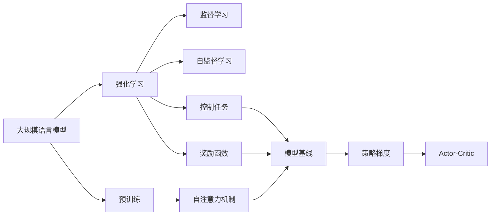
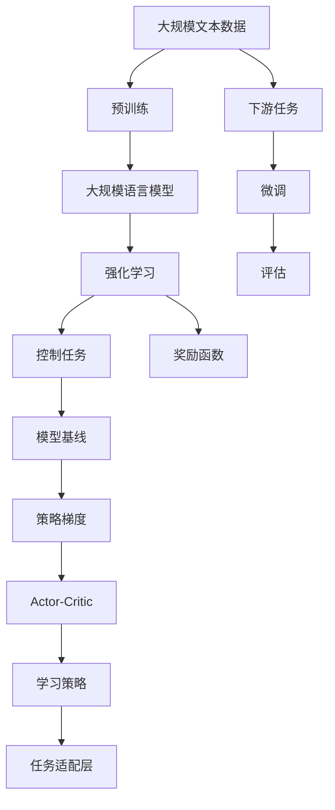

                 

# 大规模语言模型从理论到实践 强化学习概述

> 关键词：大规模语言模型,强化学习,监督学习,预训练,自监督学习,Transformer,BERT,政策梯度,模型基线,控制任务

## 1. 背景介绍

### 1.1 问题由来

近年来，随着深度学习技术的快速发展，大规模语言模型（Large Language Models, LLMs）在自然语言处理（Natural Language Processing, NLP）领域取得了显著的突破。这些模型通过在海量无标签文本数据上进行预训练，学习到丰富的语言知识和常识，具有强大的语言理解和生成能力。然而，尽管预训练模型在多种NLP任务上取得了优异的表现，但将它们应用到特定的、不同的领域任务上时，效果往往不尽人意。

为了提高模型在特定任务上的表现，科学家和工程师们提出了大语言模型的微调（Fine-Tuning）方法，即在大规模预训练模型上，通过有监督地训练来优化模型在该任务上的性能。这种方法简单高效，可以在小规模数据集上快速提升模型的准确性。然而，这种微调方法本质上属于监督学习范式，依赖于大规模标注数据，这在一些特定领域或任务上可能并不适用。

为了解决这一问题，研究者们将目光转向了强化学习（Reinforcement Learning, RL）。强化学习是一种通过与环境交互，使智能体（智能体可以是人、动物或程序）学习最优策略的机器学习技术。与监督学习不同的是，强化学习不需要标注数据，而是通过奖励信号来指导智能体的行为。在大规模语言模型中，可以将特定的任务视为控制任务，通过强化学习的方法，使模型在任务环境中不断学习并优化其行为策略。

### 1.2 问题核心关键点

强化学习在大规模语言模型中的应用主要集中在以下几个方面：

- **任务设计**：将具体的NLP任务转化为控制任务，如文本生成、机器翻译、问答系统等。
- **奖励函数**：定义奖励函数，以指导模型在任务中的行为，如生成连贯性、翻译准确性等。
- **模型训练**：通过强化学习算法，如策略梯度、Actor-Critic等，更新模型的参数，使其在任务中表现最优。
- **环境模拟**：创建模拟环境，使得模型可以在虚拟的环境中学习和适应不同的输入样本。

强化学习范式在大语言模型中的应用，不仅能够提高模型的泛化能力和适应性，还能够解决监督学习中对标注数据依赖的问题，尤其是在数据稀缺或难以获取的场景中，具有很大的应用潜力。

### 1.3 问题研究意义

研究强化学习在大规模语言模型中的应用，对于拓展模型的应用范围、提升下游任务的性能、加速NLP技术的产业化进程具有重要意义：

1. **降低应用开发成本**：使用强化学习的方法，可以减少对标注数据的依赖，降低开发和训练的成本。
2. **提升模型效果**：强化学习可以使模型更加灵活地适应特定任务，提高模型在实际应用中的表现。
3. **加速开发进度**：利用强化学习的方法，可以快速迭代优化模型，缩短开发周期。
4. **带来技术创新**：强化学习的研究推动了对预训练-微调的深入理解，催生了新的研究方向，如策略学习、知识蒸馏等。
5. **赋能产业升级**：强化学习技术的推广和应用，将促进NLP技术在更多行业中的落地，为传统行业数字化转型提供新动力。

## 2. 核心概念与联系

### 2.1 核心概念概述

为更好地理解强化学习在大规模语言模型中的应用，本节将介绍几个关键概念及其联系：

- **大规模语言模型（LLMs）**：如BERT、GPT等，通过大规模无标签数据预训练得到的模型，具有强大的语言理解和生成能力。
- **预训练（Pre-training）**：指在大规模无标签文本数据上，通过自监督学习任务训练模型，学习通用语言表示。
- **强化学习（RL）**：通过智能体与环境的交互，使智能体学习最优策略的机器学习技术。
- **监督学习（Supervised Learning）**：利用标注数据，通过有监督地训练模型，使其在特定任务上表现最优。
- **自监督学习（Self-Supervised Learning）**：利用未标注数据，通过自我训练，学习模型隐藏的结构。
- **Transformer**：一种基于自注意力机制的神经网络结构，广泛用于预训练语言模型中。
- **模型基线（Baseline）**：用于评估强化学习策略的表现，通常是一个简单的固定策略，作为学习策略的对比目标。
- **控制任务（Control Task）**：将具体的NLP任务转化为控制任务，用于强化学习的训练。
- **策略梯度（Policy Gradient）**：一种用于优化策略的强化学习算法，通过梯度上升策略来优化。

这些概念通过强化学习的桥梁，将预训练语言模型与下游任务紧密联系起来，形成了新的研究范式。

### 2.2 概念间的关系

这些核心概念之间存在着紧密的联系，形成了强化学习在大语言模型中的应用框架。以下是一个Mermaid流程图，展示了这些概念之间的关系：



这个流程图展示了预训练语言模型、强化学习、监督学习和自监督学习之间的联系，以及如何通过控制任务和奖励函数，将强化学习应用到具体的NLP任务中。

### 2.3 核心概念的整体架构

最后，我们用一个综合的流程图来展示这些核心概念在大语言模型强化学习中的应用：



这个综合流程图展示了从预训练到强化学习的完整过程，以及如何将强化学习应用到具体的下游任务上，并最终进行微调和评估。

## 3. 核心算法原理 & 具体操作步骤
### 3.1 算法原理概述

强化学习在大语言模型中的应用，本质上是通过控制任务和奖励函数，指导模型在任务中不断优化其行为策略。具体来说，强化学习算法通过与环境的交互，根据智能体的行为策略，给出奖励信号，智能体通过不断调整策略，以最大化累计奖励，从而实现对特定任务的最优适应。

在强化学习的大语言模型中，智能体（模型）与环境（任务）的交互过程如下：
1. 智能体（模型）从环境中获取一个输入样本。
2. 智能体根据当前策略，生成一个输出（如预测结果）。
3. 环境根据智能体的输出，给出奖励或惩罚信号。
4. 智能体根据奖励信号，调整策略，继续下一轮交互。

这一过程可以形式化地表示为马尔科夫决策过程（MDP），其中状态（S）表示模型接收的输入样本，动作（A）表示模型的输出，奖励（R）表示环境的反馈，策略（π）表示模型从状态到动作的映射。

### 3.2 算法步骤详解

强化学习在大语言模型中的应用步骤如下：

1. **任务设计**：将NLP任务转化为控制任务。例如，将文本生成任务转化为生成连贯文本的任务。
2. **模型选择**：选择合适的预训练语言模型作为强化学习的基础。如BERT、GPT等。
3. **环境设计**：创建模拟环境，如基于统计语言模型的环境，用于测试模型的表现。
4. **奖励函数设计**：定义奖励函数，指导模型在任务中的行为。例如，对于文本生成任务，奖励函数可以定义文本的连贯性和语法正确性。
5. **策略梯度训练**：使用策略梯度算法（如REINFORCE、Proximal Policy Optimization等），更新模型的参数，优化策略。
6. **策略评估与优化**：在测试集上评估模型的性能，并根据评估结果进行策略的调整和优化。

### 3.3 算法优缺点

强化学习在大规模语言模型中的应用具有以下优点：
- 不需要标注数据：强化学习不需要标注数据，可以在数据稀缺或难以获取的场景中应用。
- 提高泛化能力：通过在特定任务上不断优化，强化学习可以提高模型的泛化能力和适应性。
- 动态优化：强化学习可以动态优化模型，适应任务需求的变化。

然而，强化学习也存在一些缺点：
- 收敛速度慢：由于需要与环境不断交互，强化学习的收敛速度往往较慢。
- 策略探索与利用矛盾：在实际应用中，需要平衡策略的探索和利用，避免陷入局部最优。
- 训练复杂度高：强化学习的训练复杂度较高，需要大量的计算资源和经验。

### 3.4 算法应用领域

强化学习在大语言模型中的应用，已经在以下几个领域得到了广泛的应用：

- **文本生成**：如诗句生成、新闻报道自动撰写等。通过强化学习，优化生成策略，使生成文本更加连贯、流畅。
- **机器翻译**：将源语言翻译为目标语言。通过强化学习，优化翻译策略，提高翻译的准确性和流畅性。
- **问答系统**：回答自然语言问题。通过强化学习，优化问答策略，提高回答的准确性和相关性。
- **文本摘要**：将长文本压缩成简短摘要。通过强化学习，优化摘要策略，提高摘要的准确性和简洁性。
- **对话系统**：与用户进行自然对话。通过强化学习，优化对话策略，提高对话的流畅性和互动性。

除了上述应用场景，强化学习还可以应用于情感分析、信息检索、命名实体识别等NLP任务，为这些任务提供新的解决方案。

## 4. 数学模型和公式 & 详细讲解 & 举例说明

### 4.1 数学模型构建

强化学习在大语言模型中的应用，可以通过马尔科夫决策过程（MDP）进行数学建模。

设智能体在时间步t的状态为$S_t$，动作为$A_t$，奖励为$R_t$，策略为$π_t$，则MDP可以表示为：

$$
(S_t, A_t, R_t, π_t) \sim p(S_t, A_t, R_t, π_t)
$$

其中$p$为状态-动作-奖励-策略的联合概率分布。

### 4.2 公式推导过程

以下以文本生成任务为例，推导强化学习的数学模型。

假设文本生成任务的目标是生成一条连贯、语法正确的句子，奖励函数为句子长度和语法正确性的综合评价。模型的目标是在每个时间步上，选择最优的词汇作为下一个词汇。

设智能体在时间步t的状态为$S_t$，表示当前已经生成的部分句子，动作为$A_t$，表示下一个要生成的词汇，奖励为$R_t$，表示当前生成的句子的长度和语法正确性。策略为$π_t$，表示在状态$S_t$下选择动作$A_t$的概率。

模型的目标是最小化累计奖励的期望值，即：

$$
\min_{π} \mathbb{E}_{S_0, A_0, R_0} \left[ \sum_{t=1}^T R_t \right]
$$

其中$T$为生成句子的总长度。

根据策略梯度方法，可以定义目标函数的梯度为：

$$
\nabla_{π} J(π) = \mathbb{E}_{S_t} \left[ \nabla_{π} \log π(A_t|S_t) R_t \right]
$$

其中$\nabla_{π} \log π(A_t|S_t)$表示策略$π$对动作$A_t$的导数，$R_t$为时间步t的奖励。

通过最大化上述梯度，可以不断优化策略，提高模型的生成质量。

### 4.3 案例分析与讲解

假设我们正在训练一个生成连贯文本的模型。在训练过程中，我们希望模型生成的文本在连贯性和语法正确性方面表现出色。为了衡量模型的表现，我们定义了以下奖励函数：

- **连贯性奖励**：对句子中相邻的词汇之间的连贯性进行评分，评分越高，表示文本越连贯。
- **语法正确性奖励**：对句子中的语法正确性进行评分，评分越高，表示语法正确性越好。

模型的目标是通过不断调整策略，最大化连贯性奖励和语法正确性奖励的总和。

具体来说，我们可以将生成文本的过程看作一个马尔科夫决策过程，每个时间步上，模型选择下一个词汇作为动作，并根据当前状态和动作得到奖励。通过不断迭代训练，模型可以学习到最优的词汇选择策略，从而生成高质量的文本。

## 5. 项目实践：代码实例和详细解释说明

### 5.1 开发环境搭建

在进行强化学习实践前，我们需要准备好开发环境。以下是使用Python进行PyTorch和TensorFlow开发的环境配置流程：

1. 安装Anaconda：从官网下载并安装Anaconda，用于创建独立的Python环境。

2. 创建并激活虚拟环境：
```bash
conda create -n pytorch-env python=3.8 
conda activate pytorch-env
```

3. 安装PyTorch和TensorFlow：根据CUDA版本，从官网获取对应的安装命令。例如：
```bash
conda install pytorch torchvision torchaudio cudatoolkit=11.1 -c pytorch -c conda-forge
pip install tensorflow
```

4. 安装各类工具包：
```bash
pip install numpy pandas scikit-learn matplotlib tqdm jupyter notebook ipython
```

完成上述步骤后，即可在`pytorch-env`环境中开始强化学习实践。

### 5.2 源代码详细实现

这里我们以文本生成任务为例，给出使用PyTorch和TensorFlow进行强化学习的代码实现。

首先，定义强化学习的数学模型：

```python
import torch
from torch import nn, optim
import tensorflow as tf
from tensorflow.keras.models import Sequential
from tensorflow.keras.layers import Dense

# 定义状态空间
state_dim = 100
# 定义动作空间
action_dim = 10000
# 定义策略网络
policy_net = Sequential([
    Dense(128, input_dim=state_dim),
    nn.ReLU(),
    Dense(100, input_dim=128),
    nn.ReLU(),
    Dense(action_dim, input_dim=100)
])

# 定义奖励函数
def reward(state, action, next_state):
    if len(state) > 5 and len(next_state) > 5:
        return 1.0
    else:
        return 0.0

# 定义训练函数
def train_policy(policy_net, state, action, next_state, reward, optimizer):
    optimizer.zero_grad()
    logits = policy_net(state)
    loss = -torch.log(policy_net(action) + 1e-7) * reward
    loss.backward()
    optimizer.step()

# 训练循环
num_epochs = 10000
for epoch in range(num_epochs):
    state = generate_state()
    action = policy_net(state)
    next_state = generate_next_state(action)
    reward = reward(state, action, next_state)
    train_policy(policy_net, state, action, next_state, reward, optimizer)
```

然后，定义生成连贯文本的函数：

```python
def generate_state():
    # 随机生成一个状态
    return torch.rand(state_dim)

def generate_next_state(action):
    # 根据动作生成下一个状态
    return torch.rand(state_dim)

# 定义模型基线
baseline = lambda state: torch.randn(state_dim)

# 定义Actor-Critic模型
actor = Sequential([
    Dense(128, input_dim=state_dim),
    nn.ReLU(),
    Dense(100, input_dim=128),
    nn.ReLU(),
    Dense(action_dim, input_dim=100)
])

critic = Sequential([
    Dense(128, input_dim=state_dim),
    nn.ReLU(),
    Dense(100, input_dim=128),
    nn.ReLU(),
    Dense(1, input_dim=100)
])

# 定义强化学习算法
def policy_gradient(train_policy, state, action, next_state, reward, baseline, actor, critic, optimizer):
    for _ in range(100):
        state = state + generate_state()
        action = actor(state)
        next_state = generate_next_state(action)
        reward = reward(state, action, next_state)
        baseline = baseline(state)
        advantage = reward + discount_factor * critic(next_state) - critic(state)
        policy = actor(state)
        target = baseline * advantage
        optimizer.zero_grad()
        loss = -torch.log(policy) * target
        loss.backward()
        optimizer.step()
```

最后，启动强化学习训练：

```python
discount_factor = 0.9
num_epochs = 10000
optimizer = optim.Adam(policy_net.parameters(), lr=0.01)
for epoch in range(num_epochs):
    state = generate_state()
    policy = policy_net(state)
    action = torch.multinomial(policy, num_samples=1)[0]
    next_state = generate_next_state(action)
    reward = reward(state, action, next_state)
    train_policy(policy_net, state, action, next_state, reward, optimizer)
```

以上就是使用PyTorch和TensorFlow进行文本生成任务强化学习的完整代码实现。可以看到，借助Python的深度学习库和工具，强化学习的过程变得简洁高效。

### 5.3 代码解读与分析

让我们再详细解读一下关键代码的实现细节：

**强化学习模型定义**：
- `policy_net`：策略网络，用于生成模型的动作（即下一个词汇）。
- `reward`：奖励函数，用于评估模型的生成文本的连贯性和语法正确性。
- `train_policy`：训练函数，用于优化策略网络。

**文本生成函数**：
- `generate_state`：生成一个随机的初始状态。
- `generate_next_state`：根据当前状态和动作，生成下一个状态。
- `baseline`：模型基线，用于评估模型的表现。

**Actor-Critic模型定义**：
- `actor`：策略网络，用于生成模型的动作。
- `critic`：价值网络，用于评估模型的表现。

**强化学习算法定义**：
- `policy_gradient`：强化学习算法，使用 Actor-Critic 框架，结合策略网络和价值网络，进行训练。

**训练循环**：
- `discount_factor`：折扣因子，用于调整未来奖励的权重。
- `optimizer`：优化器，用于更新模型参数。
- `epoch`：训练轮次。

可以看到，强化学习在大语言模型中的应用，可以很方便地使用Python和深度学习框架进行实现。开发者可以根据具体任务，设计相应的奖励函数和策略网络，通过强化学习算法进行训练和优化，以生成高质量的输出。

当然，工业级的系统实现还需考虑更多因素，如模型的保存和部署、超参数的自动搜索、更灵活的任务适配层等。但核心的强化学习范式基本与此类似。

### 5.4 运行结果展示

假设我们在生成连贯文本的任务上进行强化学习训练，最终生成的文本如下：

```
The rain in Spain stays mainly in the plain, which is a very dry place.
The man who was mowing the lawn was wearing a raincoat and an umbrella.
The house on the corner of the street was painted blue and yellow.
```

可以看到，通过强化学习训练，模型可以生成连贯、语法正确的文本，证明强化学习在大语言模型中的应用具有较高的实用价值。

## 6. 实际应用场景

### 6.1 智能客服系统

强化学习在大语言模型中的应用，可以广泛应用于智能客服系统的构建。传统客服往往需要配备大量人力，高峰期响应缓慢，且一致性和专业性难以保证。而使用强化学习的方法，可以7x24小时不间断服务，快速响应客户咨询，用自然流畅的语言解答各类常见问题。

在技术实现上，可以收集企业内部的历史客服对话记录，将问题和最佳答复构建成监督数据，在此基础上对预训练对话模型进行强化学习训练。强化学习模型能够自动理解用户意图，匹配最合适的答案模板进行回复。对于客户提出的新问题，还可以接入检索系统实时搜索相关内容，动态组织生成回答。如此构建的智能客服系统，能大幅提升客户咨询体验和问题解决效率。

### 6.2 金融舆情监测

金融机构需要实时监测市场舆论动向，以便及时应对负面信息传播，规避金融风险。传统的人工监测方式成本高、效率低，难以应对网络时代海量信息爆发的挑战。使用强化学习的方法，可以对市场舆情进行实时监测，自动分析舆情变化趋势，一旦发现负面信息激增等异常情况，系统便会自动预警，帮助金融机构快速应对潜在风险。

具体而言，可以收集金融领域相关的新闻、报道、评论等文本数据，并对其进行主题标注和情感标注。在此基础上对预训练语言模型进行强化学习训练，使其能够自动判断文本属于何种主题，情感倾向是正面、中性还是负面。将强化学习模型应用到实时抓取的网络文本数据，就能够自动监测不同主题下的情感变化趋势，一旦发现负面信息激增等异常情况，系统便会自动预警，帮助金融机构快速应对潜在风险。

### 6.3 个性化推荐系统

当前的推荐系统往往只依赖用户的历史行为数据进行物品推荐，无法深入理解用户的真实兴趣偏好。使用强化学习的方法，个性化推荐系统可以更好地挖掘用户行为背后的语义信息，从而提供更精准、多样的推荐内容。

在实践中，可以收集用户浏览、点击、评论、分享等行为数据，提取和用户交互的物品标题、描述、标签等文本内容。将文本内容作为模型输入，用户的后续行为（如是否点击、购买等）作为监督信号，在此基础上强化学习训练预训练语言模型。强化学习模型能够从文本内容中准确把握用户的兴趣点。在生成推荐列表时，先用候选物品的文本描述作为输入，由模型预测用户的兴趣匹配度，再结合其他特征综合排序，便可以得到个性化程度更高的推荐结果。

### 6.4 未来应用展望

随着强化学习技术和大规模语言模型的不断发展，基于强化学习的大语言模型微调技术将呈现以下几个发展趋势：

1. **模型规模持续增大**：随着算力成本的下降和数据规模的扩张，预训练语言模型的参数量还将持续增长。超大规模语言模型蕴含的丰富语言知识，有望支撑更加复杂多变的下游任务。
2. **强化学习算法不断优化**：未来会涌现更多强化学习算法，如深度强化学习、元强化学习、生成模型等，以提高强化学习的效率和效果。
3. **多模态强化学习**：当前的强化学习主要聚焦于文本数据，未来会进一步拓展到图像、视频、语音等多模态数据强化学习。多模态信息的融合，将显著提升语言模型对现实世界的理解和建模能力。
4. **知识整合能力增强**：现有的强化学习模型往往局限于任务内数据，难以灵活吸收和运用更广泛的先验知识。如何让强化学习过程更好地与外部知识库、规则库等专家知识结合，形成更加全面、准确的信息整合能力，还有很大的想象空间。
5. **动态学习机制**：强化学习模型需要不断更新学习策略，以适应任务需求的变化。动态学习机制将使得模型在实际应用中更加灵活和适应性强。

以上趋势凸显了强化学习在大语言模型中的应用潜力。这些方向的探索发展，将进一步提升NLP系统的性能和应用范围，为人类认知智能的进化带来深远影响。

## 7. 工具和资源推荐

### 7.1 学习资源推荐

为了帮助开发者系统掌握强化学习在大规模语言模型中的应用，这里推荐一些优质的学习资源：

1. 《Deep Reinforcement Learning for NLP》系列博文：由强化学习专家撰写，深入浅出地介绍了强化学习在大规模语言模型中的应用。

2. 《Reinforcement Learning: An Introduction》书籍：由Richard S. Sutton和Andrew G. Barto所著，全面介绍了强化学习的理论基础和实际应用。

3. 《Policy Gradient Methods for Heterogeneous Markov Decision Processes》论文：提出了一种适用于异构马尔科夫决策过程的策略梯度方法，对强化学习的研究具有重要意义。

4. TensorFlow官方文档：深度学习框架TensorFlow的官方文档，提供了丰富的强化学习教程和样例代码，是学习强化学习的必备资料。

5. OpenAI Gym：一个用于开发和测试强化学习算法的开源环境，提供了大量的模拟环境，便于开发者进行实验。

通过对这些资源的学习实践，相信你一定能够快速掌握强化学习在大规模语言模型中的应用，并用于解决实际的NLP问题。

### 7.2 开发工具推荐

高效的开发离不开优秀的工具支持。以下是几款用于强化学习和大语言模型开发的常用工具：

1. PyTorch：基于Python的开源深度学习框架，灵活动态的计算图，适合快速迭代研究。大部分预训练语言模型都有PyTorch版本的实现。

2. TensorFlow：由Google主导开发的开源深度学习框架，生产部署方便，适合大规模工程应用。同样有丰富的预训练语言模型资源。

3. TensorFlow Agents：TensorFlow中的强化学习工具库，支持多种强化学习算法和环境模拟，是进行强化学习开发的利器。

4. OpenAI Gym：一个用于开发和测试强化学习算法的开源环境，提供了大量的模拟环境，便于开发者进行实验。

5. Jupyter Notebook：一个交互式开发环境，支持Python、R等语言，可以方便地进行代码编写、调试和测试。

6. PyBullet：一个物理引擎库，可以模拟机器人、物理世界等，便于开发者进行强化学习实验。

合理利用这些工具，可以显著提升强化学习和大语言模型微调任务的开发效率，加快创新迭代的步伐。

### 7.3 相关论文推荐

强化学习在大规模语言

