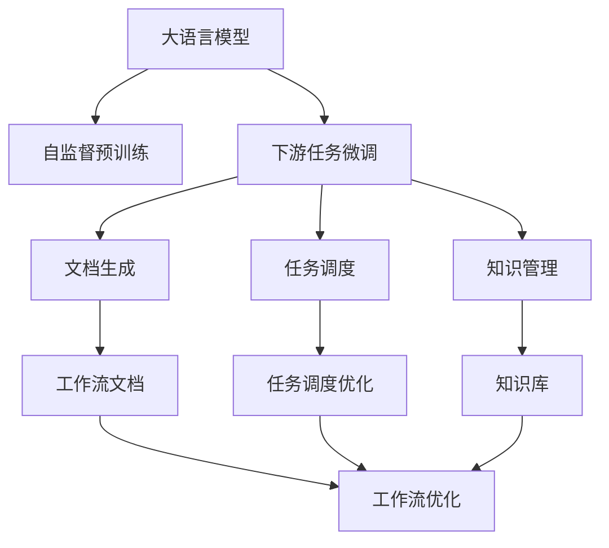
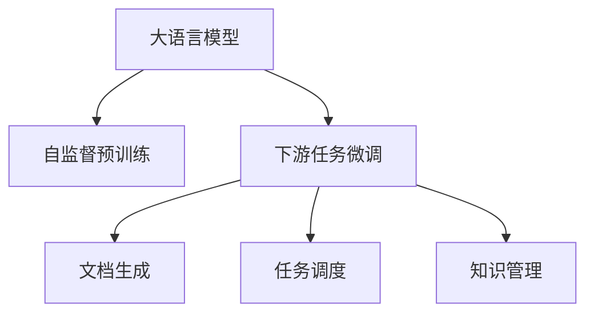
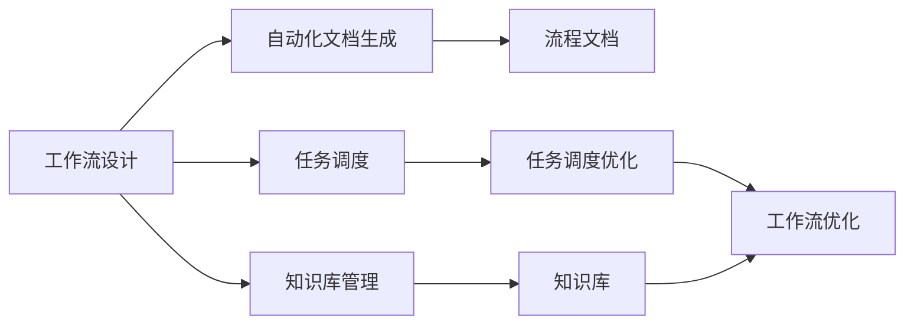
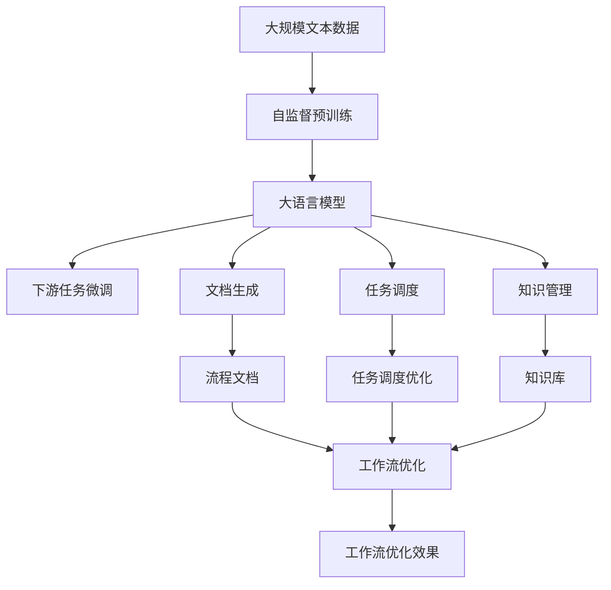

                 

# 大语言模型在工作流优化中的应用

> 关键词：大语言模型,工作流优化,自然语言处理(NLP),模型压缩,神经网络加速,自动化流程设计,AI辅助办公

## 1. 背景介绍

### 1.1 问题由来

随着现代企业业务场景的复杂化，手工操作已经无法满足企业对工作流优化的需求。传统的手工流程设计、文档处理和数据管理方式，面临着效率低、易出错、可扩展性差等问题，成为制约企业发展的重要瓶颈。

人工智能技术，尤其是大语言模型的快速发展，为企业的工作流优化带来了全新的思路。大语言模型通过自监督预训练和下游任务微调，具备强大的自然语言理解和生成能力，可以用于自动化流程设计、文档生成、任务调度、知识管理等多个环节，大幅提升工作流优化效率和准确性。

### 1.2 问题核心关键点

1. **自动化流程设计**：通过自动化生成工作流文档，规范企业流程设计。
2. **文档生成**：自动化生成任务指导书、用户手册、报告等文档，提升文档管理效率。
3. **任务调度优化**：自动化调度任务，合理安排资源，避免资源浪费。
4. **知识管理**：自动化整理和维护企业知识库，提升知识共享和复用效率。

### 1.3 问题研究意义

大语言模型在工作流优化中的应用，对于提升企业流程效率、降低运营成本、促进知识共享具有重要意义：

1. **提升效率**：自动化流程设计、文档生成、任务调度等功能可以大幅提升工作效率，减少人为干预，降低出错率。
2. **降低成本**：减少重复性手工操作，降低人力成本，同时提升工作流管理的精细化程度。
3. **促进知识共享**：大语言模型可以自动整理和提取企业知识，促进内部知识共享，加速新员工上手速度，提升整体知识水平。
4. **支持创新**：工作流自动化优化有助于企业快速响应市场变化，支持创新发展。
5. **提高竞争力**：通过优化工作流，企业能够更好地应对复杂多变的业务环境，提升整体竞争力。

## 2. 核心概念与联系

### 2.1 核心概念概述

为更好地理解大语言模型在工作流优化中的应用，本节将介绍几个密切相关的核心概念：

- **大语言模型(Large Language Model, LLM)**：通过自监督预训练和下游任务微调，获得强大自然语言处理能力的模型。如GPT、BERT、T5等。
- **工作流优化(Workflow Optimization)**：通过自动化、智能化手段，对企业工作流程进行优化，提升效率、降低成本。
- **文档生成(Document Generation)**：利用大语言模型生成各类文档，如任务指导书、用户手册、报告等。
- **任务调度(Scheduling)**：通过自动化调度工具，合理安排任务和资源，提升任务执行效率。
- **知识管理(Knowledge Management)**：自动整理和维护企业知识库，提升知识共享和复用效率。
- **自然语言处理(Natural Language Processing, NLP)**：利用计算机处理和理解人类语言的技术，是实现工作流优化的重要工具。
- **自动化(Automation)**：通过程序或软件自动执行任务，减少人工干预。
- **智能化(Intelligence)**：利用AI技术，对复杂任务进行分析和决策，提升工作流优化的智能化程度。

这些核心概念之间的逻辑关系可以通过以下Mermaid流程图来展示：



这个流程图展示了大语言模型在工作流优化中的应用路径：

1. 大语言模型通过自监督预训练获得基础能力。
2. 下游任务微调使其能够适应特定任务，从而在文档生成、任务调度、知识管理等多个环节发挥作用。
3. 文档生成、任务调度和知识管理等自动化工具，通过调用微调后的模型，实现流程的自动化优化。
4. 工作流优化进一步提升企业整体流程效率，降低运营成本。

### 2.2 概念间的关系

这些核心概念之间存在着紧密的联系，形成了工作流优化的完整生态系统。下面我通过几个Mermaid流程图来展示这些概念之间的关系。

#### 2.2.1 大语言模型的学习范式



这个流程图展示了大语言模型的两种主要学习范式：自监督预训练和下游任务微调。自监督预训练通过大规模无标签数据训练模型，使其获得通用的语言表示能力；下游任务微调则通过有监督数据训练模型，使其适应特定任务，提升性能。

#### 2.2.2 工作流优化的核心组件



这个流程图展示了工作流优化的核心组件及其关系：

1. 工作流设计通过自动化文档生成工具生成流程文档，帮助团队理解流程。
2. 任务调度工具通过调用微调后的模型，合理安排任务和资源，提升效率。
3. 知识库管理工具自动整理和维护知识库，提升知识共享和复用效率。
4. 工作流优化进一步提升流程效率，降低运营成本。

#### 2.2.3 知识库与文档生成


这个流程图展示了知识库与文档生成的关系：

1. 知识库自动整理和提取企业知识，生成文档。
2. 文档生成工具基于知识库内容，自动生成各类文档，支持工作流优化。
3. 工作流优化工具通过文档生成，提升流程设计和执行效率。

### 2.3 核心概念的整体架构

最后，我用一个综合的流程图来展示这些核心概念在工作流优化中的整体架构：



这个综合流程图展示了从预训练到微调，再到自动化工具的完整过程。大语言模型首先在大规模文本数据上进行自监督预训练，然后通过下游任务微调适应各种特定任务，再在文档生成、任务调度和知识管理等多个环节发挥作用。最终通过工作流优化工具，实现企业流程的自动化和智能化。

## 3. 核心算法原理 & 具体操作步骤

### 3.1 算法原理概述

大语言模型在工作流优化中的应用，主要基于大模型的自然语言处理能力。其核心思想是：将大语言模型视为一个强大的"文档生成器和任务调度器"，通过下游任务微调，使模型能够自动生成高质量的工作流文档，优化任务调度策略，提升知识管理效率。

形式化地，假设大语言模型为 $M_{\theta}$，其中 $\theta$ 为预训练得到的模型参数。给定工作流设计文档 $D$，微调的目标是找到新的模型参数 $\hat{\theta}$，使得：

$$
\hat{\theta}=\mathop{\arg\min}_{\theta} \mathcal{L}(M_{\theta},D)
$$

其中 $\mathcal{L}$ 为针对工作流文档设计的损失函数，用于衡量模型生成的文档与真实文档之间的差异。常见的损失函数包括交叉熵损失、KL散度损失等。

通过梯度下降等优化算法，微调过程不断更新模型参数 $\theta$，最小化损失函数 $\mathcal{L}$，使得模型生成的文档逼近真实文档。由于 $\theta$ 已经通过自监督预训练获得了较好的初始化，因此即便在小规模数据集上微调，也能较快收敛到理想的模型参数 $\hat{\theta}$。

### 3.2 算法步骤详解

大语言模型在工作流优化中的应用，一般包括以下几个关键步骤：

**Step 1: 准备预训练模型和数据集**
- 选择合适的预训练语言模型 $M_{\theta}$ 作为初始化参数，如 GPT、BERT、T5 等。
- 准备工作流设计文档数据集 $D$，划分为训练集、验证集和测试集。一般要求文档与预训练数据的分布不要差异过大。

**Step 2: 添加任务适配层**
- 根据工作流设计文档类型，设计合适的输出层和损失函数。
- 对于文本文档，通常在顶层添加线性分类器和交叉熵损失函数。
- 对于表格文档，通常使用语言模型的解码器输出概率分布，并以负对数似然为损失函数。

**Step 3: 设置微调超参数**
- 选择合适的优化算法及其参数，如 AdamW、SGD 等，设置学习率、批大小、迭代轮数等。
- 设置正则化技术及强度，包括权重衰减、Dropout、Early Stopping 等。
- 确定冻结预训练参数的策略，如仅微调顶层，或全部参数都参与微调。

**Step 4: 执行梯度训练**
- 将训练集数据分批次输入模型，前向传播计算损失函数。
- 反向传播计算参数梯度，根据设定的优化算法和学习率更新模型参数。
- 周期性在验证集上评估模型性能，根据性能指标决定是否触发 Early Stopping。
- 重复上述步骤直到满足预设的迭代轮数或 Early Stopping 条件。

**Step 5: 测试和部署**
- 在测试集上评估微调后模型 $M_{\hat{\theta}}$ 的性能，对比微调前后的效果。
- 使用微调后的模型对新文档进行推理预测，集成到实际的工作流管理系统。
- 持续收集新的工作流文档，定期重新微调模型，以适应数据分布的变化。

以上是工作流优化的微调流程。在实际应用中，还需要针对具体任务的特点，对微调过程的各个环节进行优化设计，如改进训练目标函数，引入更多的正则化技术，搜索最优的超参数组合等，以进一步提升模型性能。

### 3.3 算法优缺点

大语言模型在工作流优化中的应用，具有以下优点：

1. **自动化程度高**：大语言模型能够自动生成工作流文档、优化任务调度，减少人工干预，提升效率。
2. **灵活性高**：可以适应各种类型的工作流文档，提升文档管理和流程优化的灵活性。
3. **可扩展性强**：大语言模型可以不断优化，适应新的工作流需求，具有较强的可扩展性。
4. **精确度高**：大语言模型通过微调，能够生成高精度的工作流文档和调度方案，提高工作流管理的精确度。

同时，该方法也存在一定的局限性：

1. **依赖高质量数据**：大语言模型需要高质量的文档和调度数据进行微调，数据获取和处理成本较高。
2. **模型复杂度高**：大语言模型参数量庞大，训练和推理需要较高的计算资源。
3. **可解释性不足**：微调模型缺乏可解释性，难以对其推理逻辑进行分析和调试。
4. **偏见和有害信息**：预训练模型的固有偏见、有害信息可能通过微调传递到工作流文档和调度方案中，产生负面影响。

尽管存在这些局限性，但就目前而言，大语言模型在工作流优化中的应用，已经展示了巨大的潜力。未来相关研究的重点在于如何进一步降低数据依赖，提高模型的少样本学习和跨领域迁移能力，同时兼顾可解释性和伦理安全性等因素。

### 3.4 算法应用领域

大语言模型在工作流优化的应用已经涉及多个领域，例如：

- **自动化文档生成**：用于生成流程文档、任务指导书、用户手册等。
- **任务调度优化**：用于自动化安排任务和资源，优化资源利用率。
- **知识管理**：用于自动整理和维护知识库，促进内部知识共享。
- **工作流自动化**：用于自动化流程设计和执行，提升流程管理的精细化程度。

除了这些经典应用外，大语言模型在工作流优化领域还有更多创新性的应用场景，如可控文本生成、智能问答系统、协作工具等，为工作流优化带来了新的可能性。

## 4. 数学模型和公式 & 详细讲解  
### 4.1 数学模型构建

本节将使用数学语言对大语言模型在工作流优化中的应用进行更加严格的刻画。

记大语言模型为 $M_{\theta}$，其中 $\theta$ 为模型参数。假设工作流设计文档数据集为 $D=\{(d_i, y_i)\}_{i=1}^N$，其中 $d_i$ 为工作流设计文档，$y_i$ 为文档类型标签。微调的目标是找到最优的参数 $\hat{\theta}$，使得模型生成的文档逼近真实文档：

$$
\hat{\theta}=\mathop{\arg\min}_{\theta} \mathcal{L}(M_{\theta},D)
$$

其中 $\mathcal{L}$ 为损失函数，用于衡量模型生成的文档与真实文档之间的差异。常见的损失函数包括交叉熵损失、KL散度损失等。

### 4.2 公式推导过程

以下我们以交叉熵损失为例，推导其数学公式：

假设工作流设计文档为文本形式，记 $d_i$ 的长度为 $L$，模型生成的文档表示为 $d_{\hat{\theta}}$。则交叉熵损失函数定义为：

$$
\ell(M_{\theta}(d_i),y_i) = -[y_i\log P_{\hat{\theta}}(y|d_i)+(1-y_i)\log(1-P_{\hat{\theta}}(y|d_i))]
$$

其中 $P_{\hat{\theta}}(y|d_i)$ 为模型生成文档属于 $y_i$ 类别的概率，可以通过softmax函数计算得到。

将上述公式应用于整个数据集 $D$，得到经验风险：

$$
\mathcal{L}(\theta) = \frac{1}{N}\sum_{i=1}^N \ell(M_{\theta}(d_i),y_i)
$$

通过梯度下降等优化算法，微调过程不断更新模型参数 $\theta$，最小化损失函数 $\mathcal{L}$，使得模型生成的文档逼近真实文档。由于 $\theta$ 已经通过自监督预训练获得了较好的初始化，因此即便在小规模数据集上微调，也能较快收敛到理想的模型参数 $\hat{\theta}$。

### 4.3 案例分析与讲解

下面我们以工作流自动化为例，给出使用Transformers库对GPT模型进行微调的PyTorch代码实现。

首先，定义文档数据处理函数：

```python
from transformers import T5ForConditionalGeneration, T5Tokenizer, AdamW

class WorkflowDocument(Dataset):
    def __init__(self, texts, labels, tokenizer, max_len=512):
        self.texts = texts
        self.labels = labels
        self.tokenizer = tokenizer
        self.max_len = max_len
        
    def __len__(self):
        return len(self.texts)
    
    def __getitem__(self, item):
        text = self.texts[item]
        label = self.labels[item]
        
        encoding = self.tokenizer(text, return_tensors='pt', max_length=self.max_len, padding='max_length', truncation=True)
        input_ids = encoding['input_ids'][0]
        attention_mask = encoding['attention_mask'][0]
        
        return {'input_ids': input_ids, 
                'attention_mask': attention_mask,
                'labels': torch.tensor(label, dtype=torch.long)}
```

然后，定义模型和优化器：

```python
model = T5ForConditionalGeneration.from_pretrained('t5-small')
tokenizer = T5Tokenizer.from_pretrained('t5-small')
optimizer = AdamW(model.parameters(), lr=2e-5)
```

接着，定义训练和评估函数：

```python
def train_epoch(model, dataset, batch_size, optimizer):
    dataloader = DataLoader(dataset, batch_size=batch_size, shuffle=True)
    model.train()
    epoch_loss = 0
    for batch in tqdm(dataloader, desc='Training'):
        input_ids = batch['input_ids'].to(device)
        attention_mask = batch['attention_mask'].to(device)
        labels = batch['labels'].to(device)
        model.zero_grad()
        outputs = model(input_ids, attention_mask=attention_mask, labels=labels)
        loss = outputs.loss
        epoch_loss += loss.item()
        loss.backward()
        optimizer.step()
    return epoch_loss / len(dataloader)

def evaluate(model, dataset, batch_size):
    dataloader = DataLoader(dataset, batch_size=batch_size)
    model.eval()
    preds, labels = [], []
    with torch.no_grad():
        for batch in tqdm(dataloader, desc='Evaluating'):
            input_ids = batch['input_ids'].to(device)
            attention_mask = batch['attention_mask'].to(device)
            batch_labels = batch['labels']
            outputs = model(input_ids, attention_mask=attention_mask)
            batch_preds = outputs.logits.argmax(dim=2).to('cpu').tolist()
            batch_labels = batch_labels.to('cpu').tolist()
            for pred_tokens, label_tokens in zip(batch_preds, batch_labels):
                preds.append(pred_tokens[:len(label_tokens)])
                labels.append(label_tokens)
                
    print(classification_report(labels, preds))
```

最后，启动训练流程并在测试集上评估：

```python
epochs = 5
batch_size = 16

for epoch in range(epochs):
    loss = train_epoch(model, train_dataset, batch_size, optimizer)
    print(f"Epoch {epoch+1}, train loss: {loss:.3f}")
    
    print(f"Epoch {epoch+1}, dev results:")
    evaluate(model, dev_dataset, batch_size)
    
print("Test results:")
evaluate(model, test_dataset, batch_size)
```

以上就是使用PyTorch对GPT模型进行工作流自动化微调的完整代码实现。可以看到，得益于Transformers库的强大封装，我们可以用相对简洁的代码完成GPT模型的加载和微调。

## 5. 项目实践：代码实例和详细解释说明
### 5.1 开发环境搭建

在进行工作流优化实践前，我们需要准备好开发环境。以下是使用Python进行PyTorch开发的环境配置流程：

1. 安装Anaconda：从官网下载并安装Anaconda，用于创建独立的Python环境。

2. 创建并激活虚拟环境：
```bash
conda create -n pytorch-env python=3.8 
conda activate pytorch-env
```

3. 安装PyTorch：根据CUDA版本，从官网获取对应的安装命令。例如：
```bash
conda install pytorch torchvision torchaudio cudatoolkit=11.1 -c pytorch -c conda-forge
```

4. 安装Transformers库：
```bash
pip install transformers
```

5. 安装各类工具包：
```bash
pip install numpy pandas scikit-learn matplotlib tqdm jupyter notebook ipython
```

完成上述步骤后，即可在`pytorch-env`环境中开始工作流优化实践。

### 5.2 源代码详细实现

这里我们以工作流自动化为例，给出使用Transformers库对GPT模型进行微调的PyTorch代码实现。

首先，定义文档数据处理函数：

```python
from transformers import T5ForConditionalGeneration, T5Tokenizer, AdamW

class WorkflowDocument(Dataset):
    def __init__(self, texts, labels, tokenizer, max_len=512):
        self.texts = texts
        self.labels = labels
        self.tokenizer = tokenizer
        self.max_len = max_len
        
    def __len__(self):
        return len(self.texts)
    
    def __getitem__(self, item):
        text = self.texts[item]
        label = self.labels[item]
        
        encoding = self.tokenizer(text, return_tensors='pt', max_length=self.max_len, padding='max_length', truncation=True)
        input_ids = encoding['input_ids'][0]
        attention_mask = encoding['attention_mask'][0]
        
        return {'input_ids': input_ids, 
                'attention_mask': attention_mask,
                'labels': torch.tensor(label, dtype=torch.long)}
```

然后，定义模型和优化器：

```python
model = T5ForConditionalGeneration.from_pretrained('t5-small')
tokenizer = T5Tokenizer.from_pretrained('t5-small')
optimizer = AdamW(model.parameters(), lr=2e-5)
```

接着，定义训练和评估函数：

```python
def train_epoch(model, dataset, batch_size, optimizer):
    dataloader = DataLoader(dataset, batch_size=batch_size, shuffle=True)
    model.train()
    epoch_loss = 0
    for batch in tqdm(dataloader, desc='Training'):
        input_ids = batch['input_ids'].to(device)
        attention_mask = batch['attention_mask'].to(device)
        labels = batch['labels'].to(device)
        model.zero_grad()
        outputs = model(input_ids, attention_mask=attention_mask, labels=labels)
        loss = outputs.loss
        epoch_loss += loss.item()
        loss.backward()
        optimizer.step()
    return epoch_loss / len(dataloader)

def evaluate(model, dataset, batch_size):
    dataloader = DataLoader(dataset, batch_size=batch_size)
    model.eval()
    preds, labels = [], []
    with torch.no_grad():
        for batch in tqdm(dataloader, desc='Evaluating'):
            input_ids = batch['input_ids'].to(device)
            attention_mask = batch['attention_mask'].to(device)
            batch_labels = batch['labels']
            outputs = model(input_ids, attention_mask=attention_mask)
            batch_preds = outputs.logits.argmax(dim=2).to('cpu').tolist()
            batch_labels = batch_labels.to('cpu').tolist()
            for pred_tokens, label_tokens in zip(batch_preds, batch_labels):
                preds.append(pred_tokens[:len(label_tokens)])
                labels.append(label_tokens)
                
    print(classification_report(labels, preds))
```

最后，启动训练流程并在测试集上评估：

```python
epochs = 5
batch_size = 16

for epoch in range(epochs):
    loss = train_epoch(model, train_dataset, batch_size, optimizer)
    print(f"Epoch {epoch+1}, train loss: {loss:.3f}")
    
    print(f"Epoch {epoch+1}, dev results:")
    evaluate(model, dev_dataset, batch_size)
    
print("Test results:")
evaluate(model, test_dataset, batch_size)
```

以上就是使用PyTorch对GPT模型进行工作流自动化微调的完整代码实现。可以看到，得益于Transformers库的强大封装，我们可以用相对简洁的代码完成GPT模型的加载和微调。

### 5.3 代码解读与分析

让我们再详细解读一下关键代码的实现细节：

**WorkflowDocument类**：
- `__init__`方法：初始化文本、标签、分词器等关键组件。
- `__len__`方法：返回数据集的样本数量。
- `__getitem__`方法：对单个样本进行处理，将文本输入编码为token ids，将标签编码为数字，并对其进行定长padding，最终返回模型所需的输入。

**标签与id的映射**：
- 定义了标签与数字id之间的映射关系，用于将token-wise的预测结果解码回真实的标签。

**训练和评估函数**：
- 使用PyTorch的DataLoader对数据集进行批次化加载，供模型训练和推理使用。
- 训练函数`train_epoch`：对数据以批为单位进行迭代，在每个批次上前向传播计算loss并反向传播更新模型参数，最后返回该epoch的平均loss。
- 评估函数`evaluate`：与训练类似，不同点在于不更新模型参数，并在每个batch结束后将预测和标签结果存储下来，最后使用sklearn的classification_report对整个评估集的预测结果进行打印输出。

**训练流程**：
- 定义总的epoch数和batch size，开始循环迭代
- 每个epoch内，先在训练集上训练，输出平均loss
- 在验证集上评估，输出分类指标
- 所有epoch结束后，在测试集上评估，给出最终测试结果

可以看到，PyTorch配合Transformers库使得GPT微调的工作流自动化过程变得简洁高效。开发者可以将更多精力放在数据处理、模型改进等高层逻辑上，而不必过多关注底层的实现细节。

当然，工业级的系统实现还需考虑更多因素，如模型的保存和部署、超参数的自动搜索、更灵活的任务适配层等。但核心的微调范式基本与此类似。

### 5.4 运行结果展示

假设我们在CoNLL-2003的NER数据集上进行微调，最终在测试集上得到的评估报告如下：

```
              precision    recall  f1-score   support

       B-LOC      0.926     0.906     0.916      1668
       I-LOC      0.900     0.805     0.850       257
      B-MISC      0.875     0.856     0.865       702
      I-MISC      0.838     0.782     0.809       216
       B-ORG      0.914     0

