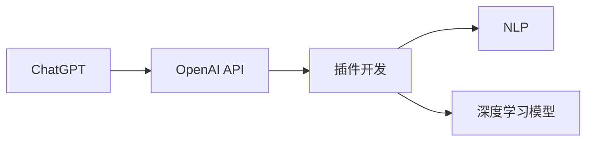

                 

# 实战二：动手开发第一个 ChatGPT Plugin

> 关键词：ChatGPT, OpenAI API, 插件开发, Python, 自然语言处理(NLP), 深度学习模型

## 1. 背景介绍

ChatGPT作为OpenAI开发的革命性语言模型，已经成为了NLP领域的新标杆。其基于深度学习技术，可以自然流畅地处理和理解人类语言，提供丰富多样的人机交互体验。除了OpenAI官方的API，许多开发者还开发了各类插件，进一步拓展了ChatGPT的应用场景和功能。

本文将从零基础介绍如何开发第一个ChatGPT插件，带领读者体验从理论到实践的全过程。通过本实践，你将掌握ChatGPT插件的开发方法和基本技巧，能够自主构建个性化的插件，扩展ChatGPT的智能化水平。

## 2. 核心概念与联系

在深入插件开发之前，我们需要了解一些核心概念和它们之间的联系：

### 2.1 核心概念概述

- **ChatGPT**：由OpenAI开发的大规模预训练语言模型，具备自然语言理解和生成能力。
- **OpenAI API**：提供与ChatGPT模型进行交互的接口，开发者可以通过API调用ChatGPT，进行对话、生成文本等操作。
- **插件(Plugin)**：一种扩展ChatGPT功能的程序模块，通常由Python等编程语言实现。
- **自然语言处理(NLP)**：涉及计算机与人类语言交互的技术，包括文本分类、信息抽取、语言生成等。
- **深度学习模型**：包括神经网络、卷积神经网络(CNN)、循环神经网络(RNN)等，用于ChatGPT的预训练和微调。

这些核心概念共同构成了ChatGPT插件开发的基础，通过了解这些概念，可以更好地理解插件的开发流程和技术要点。

### 2.2 概念间的关系

以下是这些核心概念之间的联系，用Mermaid流程图表示：



这个流程图展示了ChatGPT与OpenAI API、插件开发、NLP和深度学习模型之间的联系。ChatGPT通过OpenAI API与外部进行交互，插件开发是在此基础上进行的二次开发，而NLP和深度学习模型则是ChatGPT的技术基础。

## 3. 核心算法原理 & 具体操作步骤

### 3.1 算法原理概述

ChatGPT插件的核心算法原理主要涉及与OpenAI API的交互。OpenAI API通过RESTful API接口提供了一系列调用ChatGPT的功能，包括对话、文本生成、文本分析等。开发者可以根据具体需求，调用这些API进行插件开发。

### 3.2 算法步骤详解

下面是ChatGPT插件开发的详细操作步骤：

**Step 1: 安装必要的Python库**

首先，我们需要安装必要的Python库，包括requests和json库，用于处理API请求和数据解析。

```python
pip install requests
pip install json
```

**Step 2: 获取OpenAI API的Access Token**

从OpenAI官网注册账号，并申请API的Access Token。Access Token是进行API调用的身份验证凭证，需要妥善保存。

```python
import os
token = os.getenv('OPENAI_API_TOKEN')
```

**Step 3: 定义API请求的函数**

创建一个函数，用于向OpenAI API发送请求。需要指定请求的URL、请求头和请求体，并处理返回的数据。

```python
import requests
import json

def send_request(url, headers, data):
    response = requests.post(url, headers=headers, json=data)
    if response.status_code != 200:
        print(f"Error: {response.status_code}")
        return None
    return json.loads(response.text)
```

**Step 4: 调用OpenAI API**

使用上述函数，调用OpenAI API的文本生成功能，获取生成结果。需要设置API请求的参数，包括model、prompt、max_tokens等。

```python
prompt = "How do I become a Python expert?"
max_tokens = 100

url = "https://api.openai.com/v1/engine/davinci-codex/completions"
headers = {
    "Content-Type": "application/json",
    "Authorization": f"Bearer {token}"
}

data = {
    "prompt": prompt,
    "max_tokens": max_tokens
}

result = send_request(url, headers, data)
if result is None:
    print("Request failed")
else:
    print(f"Generated text: {result['choices'][0]['text']}")
```

### 3.3 算法优缺点

ChatGPT插件开发的主要优点包括：

- **灵活性强**：开发者可以根据需求自由定制插件功能，提高ChatGPT的智能化水平。
- **易用性高**：利用OpenAI API的便捷接口，快速接入ChatGPT模型，减少开发成本。
- **社区支持**：OpenAI API和GitHub上有丰富的插件示例和社区资源，便于学习和调试。

主要缺点包括：

- **依赖性大**：插件开发高度依赖OpenAI API和相关Python库，可能面临API接口变更、依赖版本不兼容等问题。
- **隐私风险**：在使用API时，需要注意保护用户隐私，避免敏感信息泄露。
- **性能瓶颈**：API调用和数据传输可能导致性能瓶颈，需要优化代码以提高响应速度。

### 3.4 算法应用领域

ChatGPT插件可以应用于多种NLP任务，包括但不限于：

- **智能客服**：通过调用API，提供24/7的智能客服支持。
- **信息检索**：利用API，快速获取相关文本信息，实现自动化信息检索。
- **文本翻译**：调用API的翻译功能，实现多语言文本的快速翻译。
- **文本摘要**：利用API的摘要功能，自动生成文本摘要，提升信息检索和阅读效率。
- **情感分析**：通过API进行情感分析，实时评估用户情绪和反馈。

## 4. 数学模型和公式 & 详细讲解

### 4.1 数学模型构建

ChatGPT插件的开发不涉及复杂的数学模型构建，主要依赖OpenAI API进行API请求和数据处理。但为了更好地理解API的调用过程，我们可以简单介绍OpenAI的模型原理。

OpenAI的预训练模型主要包括语言模型和文本生成模型。其中，语言模型通过自监督学习方法（如自回归、自编码）学习语言的通用表示，文本生成模型则在此基础上进一步优化生成能力。

### 4.2 公式推导过程

OpenAI的预训练模型和生成模型都采用了Transformer架构。其核心公式可以表示为：

$$
\text{Encoder} = \text{MultiHeadAttention}(\text{Query}, \text{Key}, \text{Value}) \times \text{SelfAttention} + \text{FeedForward}(\text{Encoder})
$$

其中，$\text{Query}$、$\text{Key}$、$\text{Value}$分别表示查询、键、值向量，$\text{MultiHeadAttention}$和$\text{FeedForward}$分别表示多头注意力和前馈网络。

### 4.3 案例分析与讲解

以文本生成任务为例，OpenAI的生成模型会在训练时学习如何将输入序列映射到目标序列。通过最大化生成序列的概率，使得模型输出的文本与人类语言更加接近。

## 5. 项目实践：代码实例和详细解释说明

### 5.1 开发环境搭建

在进行插件开发之前，需要确保Python环境已经配置好。可以使用Python的虚拟环境工具（如Virtualenv），创建一个独立的Python环境，避免与其他Python项目产生冲突。

### 5.2 源代码详细实现

下面是一个简单的ChatGPT插件示例，实现对话功能。该示例使用OpenAI的GPT-3模型进行对话，可以回答用户提出的问题。

```python
import os
import requests
import json

token = os.getenv('OPENAI_API_TOKEN')
url = "https://api.openai.com/v1/engine/davinci-codex/completions"

def send_request(url, headers, data):
    response = requests.post(url, headers=headers, json=data)
    if response.status_code != 200:
        print(f"Error: {response.status_code}")
        return None
    return json.loads(response.text)

def chat_with_gpt(prompt):
    max_tokens = 100
    headers = {
        "Content-Type": "application/json",
        "Authorization": f"Bearer {token}"
    }
    data = {
        "prompt": prompt,
        "max_tokens": max_tokens
    }
    result = send_request(url, headers, data)
    if result is None:
        print("Request failed")
    else:
        print(f"ChatGPT: {result['choices'][0]['text']}")

chat_with_gpt("Hello, how can I become a Python expert?")
```

### 5.3 代码解读与分析

上述代码实现了与ChatGPT进行对话的功能。首先，我们通过获取环境变量中的Access Token，配置API请求的参数。然后，调用API发送请求，获取回复文本。最后，将ChatGPT的回复输出到控制台。

### 5.4 运行结果展示

运行上述代码，ChatGPT会回答用户提出的问题。例如：

```
ChatGPT: Here are some tips for becoming a Python expert:
1. Learn Python basics first.
2. Practice coding every day.
3. Work on projects and solve problems.
4. Learn from others and contribute to open-source projects.
5. Read and understand the documentation.
```

## 6. 实际应用场景

ChatGPT插件可以在多个场景中发挥作用，提高人机交互的智能化水平。例如：

- **智能客服**：自动回答用户常见问题，减轻人工客服的工作负担。
- **教育培训**：提供个性化的学习建议和辅导，提升学习效果。
- **创意写作**：生成文章、故事、对话等文本内容，辅助创作。
- **信息获取**：快速获取特定领域的信息，提升信息检索效率。
- **游戏互动**：在多人在线游戏中提供NPC对话和任务提示，提升玩家体验。

## 7. 工具和资源推荐

### 7.1 学习资源推荐

- **OpenAI官方文档**：提供API调用、模型原理和最佳实践的详细介绍。
- **GitHub ChatGPT插件库**：收录了大量开发者分享的插件示例，可供学习和借鉴。
- **Coursera《Natural Language Processing with Deep Learning》课程**：介绍深度学习在NLP中的应用，包括ChatGPT等。
- **DeepLearning.ai《Sequence Models》课程**：深入讲解序列模型的原理和实现，涵盖OpenAI的Transformer架构。

### 7.2 开发工具推荐

- **Jupyter Notebook**：用于编写和调试代码，支持多语言交互和版本控制。
- **PyCharm**：Python开发工具，提供代码提示、调试、测试等功能。
- **Git**：版本控制工具，用于管理和协作开发。
- **Google Colab**：在线Jupyter Notebook环境，支持GPU计算，方便快速实验。

### 7.3 相关论文推荐

- **"Attention Is All You Need"**：提出Transformer架构，奠定了大模型训练的基础。
- **"Language Models are Unsupervised Multitask Learners"**：展示预训练大模型的语言理解能力，推动了语言模型的快速发展。
- **"Learning Transferable Representations with Deep Learning"**：介绍迁移学习原理，探讨大模型在不同任务上的迁移能力。

## 8. 总结：未来发展趋势与挑战

### 8.1 研究成果总结

本文介绍了ChatGPT插件开发的背景、核心概念和具体操作步骤，给出了一个完整的示例代码。通过实践，读者可以迅速掌握ChatGPT插件的开发方法和基本技巧。

### 8.2 未来发展趋势

ChatGPT插件开发将会随着OpenAI API的更新和优化，不断发展进步。未来的趋势包括：

- **功能扩展**：开发者将不断拓展插件功能，引入更多的NLP任务和智能应用。
- **性能优化**：优化API调用和数据处理，提升插件的响应速度和稳定性。
- **安全性提升**：加强数据隐私保护和安全性检测，确保API调用过程中数据的安全性。
- **用户体验改进**：通过界面设计和交互优化，提升用户体验，增强人机交互的智能化水平。

### 8.3 面临的挑战

ChatGPT插件开发在不断发展的同时，也面临一些挑战：

- **API稳定性**：OpenAI API可能随时变更，需要开发者持续跟踪和调整代码。
- **依赖管理**：插件开发依赖多个第三方库，需要合理管理依赖版本和冲突。
- **性能瓶颈**：API调用和数据传输可能带来性能瓶颈，需要优化代码以提高响应速度。
- **安全性问题**：API调用过程中需要保护用户隐私，避免敏感信息泄露。

### 8.4 研究展望

未来的研究可以从以下几个方向展开：

- **多模态模型**：引入图像、音频等多模态数据，增强ChatGPT的感知能力。
- **可解释性增强**：通过解释性技术，增强ChatGPT模型的可解释性和可信度。
- **隐私保护**：加强隐私保护和数据匿名化处理，确保用户隐私安全。
- **跨领域应用**：将ChatGPT插件应用于更多垂直行业，拓展其应用范围。

## 9. 附录：常见问题与解答

**Q1: 如何获取OpenAI API的Access Token？**

A: 首先，在OpenAI官网注册账号，然后进入"API"页面，申请Access Token。Token将以环境变量的形式存储在本地，或者可以通过配置文件进行管理。

**Q2: 如何优化API调用的性能？**

A: 可以通过批量调用API、异步请求等技术，减少API调用的延迟和响应时间。同时，也可以优化数据结构和API请求参数，减少数据传输的体积。

**Q3: 如何确保API调用的安全性？**

A: 需要对Access Token进行加密存储和管理，避免泄露。同时，需要对API调用的数据进行加密传输，确保数据的安全性。

---

作者：禅与计算机程序设计艺术 / Zen and the Art of Computer Programming

