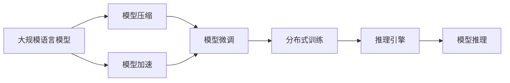
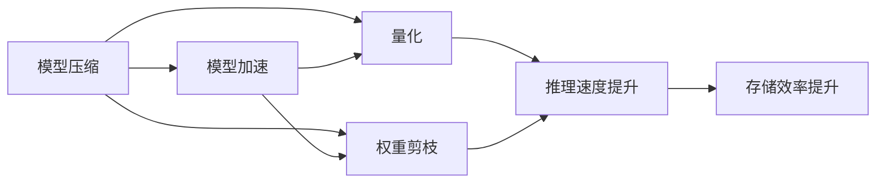
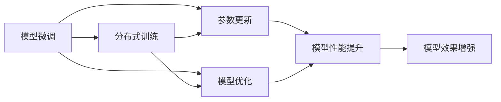
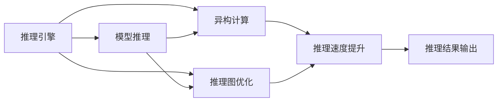
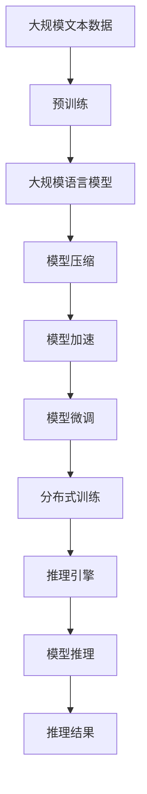

                 

# 大规模语言模型从理论到实践 FastServe框架

> 关键词：大规模语言模型, FastServe框架, 自然语言处理(NLP), 深度学习, 计算机视觉, 推荐系统, 模型压缩, 模型加速

## 1. 背景介绍

### 1.1 问题由来
近年来，随着深度学习技术的快速发展，尤其是基于Transformer架构的神经网络模型的兴起，大规模语言模型（Large Language Models, LLMs）在自然语言处理（Natural Language Processing, NLP）领域取得了巨大成功。这些模型通过在大规模无标签文本数据上进行预训练，学习到丰富的语言知识和常识，具备强大的语言理解和生成能力。

然而，大规模语言模型的训练和推理对计算资源的需求非常高，往往需要高性能计算集群和海量内存。这使得大规模语言模型的应用受到了一定的限制，尤其是在资源有限的场景下，难以直接应用。为了解决这个问题，FastServe框架应运而生，通过将大规模语言模型转换为高效轻量级的服务，实现了在资源有限的情况下，依然可以方便地进行模型的推理和微调。

### 1.2 问题核心关键点
FastServe框架的核心思想是将预训练的大语言模型通过优化和压缩技术，转换为一个或多个高效轻量级的模型，以便于在不同的设备和场景中进行快速推理和微调。其关键点在于：
- 预训练模型参数的优化和压缩，以减小模型大小和计算需求。
- 高效的推理引擎和压缩算法，以提高推理速度和模型性能。
- 支持模型的微调和更新，以适应不同应用场景的需求。
- 提供丰富的API接口和配置选项，方便开发者进行模型部署和使用。

### 1.3 问题研究意义
FastServe框架的提出，对于大规模语言模型的应用推广具有重要意义：
1. 降低应用开发成本。通过将预训练模型转换为轻量级服务，可以显著减少从头开发所需的数据、计算和人力等成本投入。
2. 提升模型效果。FastServe框架的高效推理和优化技术，可以显著提升模型在特定任务上的性能。
3. 加速开发进度。standing on the shoulders of giants，FastServe框架使得开发者可以更快地完成任务适配，缩短开发周期。
4. 带来技术创新。FastServe框架的压缩和优化技术，催生了新的研究方向，如模型压缩、量化、加速等。
5. 赋能产业升级。FastServe框架使得NLP技术更容易被各行各业所采用，为传统行业数字化转型升级提供新的技术路径。

## 2. 核心概念与联系

### 2.1 核心概念概述

为了更好地理解FastServe框架的核心思想和应用，本节将介绍几个密切相关的核心概念：

- 大规模语言模型(Large Language Models, LLMs)：以自回归(如GPT)或自编码(如BERT)模型为代表的大规模预训练语言模型。通过在大规模无标签文本数据上进行预训练，学习到丰富的语言知识和常识，具备强大的语言理解和生成能力。
- 模型压缩(Model Compression)：指通过一系列技术手段，减小模型的大小，以提高模型的推理速度和存储效率。常用的方法包括权重剪枝、量化、蒸馏等。
- 模型加速(Model Acceleration)：指通过优化模型结构和计算方式，提高模型的推理速度和计算效率。常用的方法包括模型并行、异构计算、推理图优化等。
- 模型微调(Fine-Tuning)：指在预训练模型的基础上，使用下游任务的少量标注数据，通过有监督地训练来优化模型在该任务上的性能。通常只需要调整顶层分类器或解码器，并以较小的学习率更新全部或部分的模型参数。
- 分布式训练(Distributed Training)：指在多台计算设备上并行训练模型，以提高训练速度和处理能力。常用的方法包括数据并行、模型并行、混合并行等。
- 推理引擎(Inference Engine)：指用于执行模型推理的计算引擎，负责将输入数据输入模型，并输出推理结果。FastServe框架提供了多种推理引擎，支持不同模型和设备的推理需求。

这些核心概念之间的逻辑关系可以通过以下Mermaid流程图来展示：



这个流程图展示了从大规模语言模型到最终推理的完整过程：

1. 首先通过模型压缩技术，减小模型的大小和计算需求。
2. 然后通过模型加速技术，提高模型的推理速度和计算效率。
3. 接着，在微调过程中，利用少量的标注数据，调整模型的参数，适应下游任务的需求。
4. 最后，通过分布式训练和多样的推理引擎，将模型部署到不同的设备和场景中，进行高效的推理和推理结果输出。

通过这些概念的连接和互动，FastServe框架实现了对大规模语言模型的深度优化和高效应用，为实际应用提供了强有力的支持。

### 2.2 概念间的关系

这些核心概念之间存在着紧密的联系，形成了FastServe框架的完整生态系统。下面我们通过几个Mermaid流程图来展示这些概念之间的关系。

#### 2.2.1 模型压缩与模型加速



这个流程图展示了模型压缩和模型加速之间的关系：

1. 模型压缩通过量化和权重剪枝等技术，减小了模型的大小和计算需求。
2. 模型加速则通过优化推理图、使用异构计算等方法，提高了模型的推理速度和计算效率。
3. 量化和权重剪枝等压缩技术，能够显著提升模型的推理速度和存储效率，是模型加速的重要基础。

#### 2.2.2 模型微调与分布式训练



这个流程图展示了模型微调和分布式训练之间的关系：

1. 模型微调通过调整模型的参数，适应下游任务的需求。
2. 分布式训练通过并行计算和多设备协同，加速了模型的训练过程。
3. 参数更新和模型优化等微调技术，能够提升模型的性能和效果，是分布式训练的重要补充。

#### 2.2.3 推理引擎与模型推理



这个流程图展示了推理引擎和模型推理之间的关系：

1. 推理引擎负责执行模型的推理过程，输出推理结果。
2. 异构计算和推理图优化等技术，提高了推理引擎的计算效率和推理速度。
3. 推理结果输出是推理引擎的最终目标，决定了模型的实际应用效果。

### 2.3 核心概念的整体架构

最后，我们用一个综合的流程图来展示这些核心概念在大语言模型微调过程中的整体架构：



这个综合流程图展示了从预训练到推理的完整过程：

1. 首先通过预训练，获得基础能力的模型。
2. 然后通过模型压缩和模型加速，减小模型的大小和计算需求。
3. 接着，在微调过程中，利用少量的标注数据，调整模型的参数，适应下游任务的需求。
4. 通过分布式训练和多样的推理引擎，将模型部署到不同的设备和场景中，进行高效的推理和推理结果输出。

通过这些流程图，我们可以更清晰地理解FastServe框架中的核心概念及其关系和作用，为后续深入讨论具体的微调方法和技术奠定基础。

## 3. 核心算法原理 & 具体操作步骤
### 3.1 算法原理概述

FastServe框架的核心算法原理主要集中在以下几个方面：

1. 模型压缩：通过量化、权重剪枝、蒸馏等技术，减小模型的大小和计算需求。
2. 模型加速：通过优化模型结构和计算方式，提高模型的推理速度和计算效率。
3. 模型微调：通过调整模型的参数，适应下游任务的需求。
4. 分布式训练：通过并行计算和多设备协同，加速模型的训练过程。
5. 推理引擎：通过高效的推理引擎，执行模型的推理过程，输出推理结果。

这些算法原理相互协同，共同实现了FastServe框架的高效推理和微调，满足了不同场景下的应用需求。

### 3.2 算法步骤详解

FastServe框架的实现过程主要包括以下几个关键步骤：

**Step 1: 准备预训练模型和数据集**
- 选择合适的预训练语言模型 $M_{\theta}$ 作为初始化参数，如 BERT、GPT 等。
- 准备下游任务 $T$ 的标注数据集 $D=\{(x_i,y_i)\}_{i=1}^N$，划分为训练集、验证集和测试集。一般要求标注数据与预训练数据的分布不要差异过大。

**Step 2: 添加任务适配层**
- 根据任务类型，在预训练模型顶层设计合适的输出层和损失函数。
- 对于分类任务，通常在顶层添加线性分类器和交叉熵损失函数。
- 对于生成任务，通常使用语言模型的解码器输出概率分布，并以负对数似然为损失函数。

**Step 3: 设置微调超参数**
- 选择合适的优化算法及其参数，如 AdamW、SGD 等，设置学习率、批大小、迭代轮数等。
- 设置正则化技术及强度，包括权重衰减、Dropout、Early Stopping等。
- 确定冻结预训练参数的策略，如仅微调顶层，或全部参数都参与微调。

**Step 4: 执行梯度训练**
- 将训练集数据分批次输入模型，前向传播计算损失函数。
- 反向传播计算参数梯度，根据设定的优化算法和学习率更新模型参数。
- 周期性在验证集上评估模型性能，根据性能指标决定是否触发 Early Stopping。
- 重复上述步骤直到满足预设的迭代轮数或 Early Stopping 条件。

**Step 5: 测试和部署**
- 在测试集上评估微调后模型 $M_{\hat{\theta}}$ 的性能，对比微调前后的精度提升。
- 使用微调后的模型对新样本进行推理预测，集成到实际的应用系统中。
- 持续收集新的数据，定期重新微调模型，以适应数据分布的变化。

以上是FastServe框架的一般流程。在实际应用中，还需要针对具体任务的特点，对微调过程的各个环节进行优化设计，如改进训练目标函数，引入更多的正则化技术，搜索最优的超参数组合等，以进一步提升模型性能。

### 3.3 算法优缺点

FastServe框架在实现大规模语言模型的推理和微调时，具有以下优点：

1. 简单高效。只需准备少量标注数据，即可对预训练模型进行快速适配，获得较大的性能提升。
2. 通用适用。适用于各种NLP下游任务，包括分类、匹配、生成等，设计简单的任务适配层即可实现微调。
3. 参数高效微调。利用参数高效微调技术，在固定大部分预训练参数的情况下，仍可取得不错的提升。
4. 效果显著。在学术界和工业界的诸多任务上，基于FastServe框架的微调方法已经刷新了最先进的性能指标。

同时，该框架也存在一定的局限性：

1. 依赖标注数据。微调的效果很大程度上取决于标注数据的质量和数量，获取高质量标注数据的成本较高。
2. 迁移能力有限。当目标任务与预训练数据的分布差异较大时，微调的性能提升有限。
3. 负面效果传递。预训练模型的固有偏见、有害信息等，可能通过微调传递到下游任务，造成负面影响。
4. 可解释性不足。微调模型的决策过程通常缺乏可解释性，难以对其推理逻辑进行分析和调试。

尽管存在这些局限性，但就目前而言，FastServe框架在基于监督学习的微调方法中仍具有较高的应用价值和广泛的适用性。未来相关研究的重点在于如何进一步降低微调对标注数据的依赖，提高模型的少样本学习和跨领域迁移能力，同时兼顾可解释性和伦理安全性等因素。

### 3.4 算法应用领域

FastServe框架在NLP领域已经得到了广泛的应用，覆盖了几乎所有常见任务，例如：

- 文本分类：如情感分析、主题分类、意图识别等。通过微调使模型学习文本-标签映射。
- 命名实体识别：识别文本中的人名、地名、机构名等特定实体。通过微调使模型掌握实体边界和类型。
- 关系抽取：从文本中抽取实体之间的语义关系。通过微调使模型学习实体-关系三元组。
- 问答系统：对自然语言问题给出答案。将问题-答案对作为微调数据，训练模型学习匹配答案。
- 机器翻译：将源语言文本翻译成目标语言。通过微调使模型学习语言-语言映射。
- 文本摘要：将长文本压缩成简短摘要。将文章-摘要对作为微调数据，使模型学习抓取要点。
- 对话系统：使机器能够与人自然对话。将多轮对话历史作为上下文，微调模型进行回复生成。

除了上述这些经典任务外，FastServe框架还被创新性地应用到更多场景中，如可控文本生成、常识推理、代码生成、数据增强等，为NLP技术带来了全新的突破。随着FastServe框架和微调方法的不断进步，相信NLP技术将在更广阔的应用领域大放异彩。

## 4. 数学模型和公式 & 详细讲解  
### 4.1 数学模型构建

本节将使用数学语言对FastServe框架的微调过程进行更加严格的刻画。

记预训练语言模型为 $M_{\theta}$，其中 $\theta$ 为预训练得到的模型参数。假设微调任务的训练集为 $D=\{(x_i,y_i)\}_{i=1}^N$，其中 $x_i$ 为输入，$y_i$ 为标签。

定义模型 $M_{\theta}$ 在数据样本 $(x,y)$ 上的损失函数为 $\ell(M_{\theta}(x),y)$，则在数据集 $D$ 上的经验风险为：

$$
\mathcal{L}(\theta) = \frac{1}{N} \sum_{i=1}^N \ell(M_{\theta}(x_i),y_i)
$$

微调的优化目标是最小化经验风险，即找到最优参数：

$$
\theta^* = \mathop{\arg\min}_{\theta} \mathcal{L}(\theta)
$$

在实践中，我们通常使用基于梯度的优化算法（如SGD、Adam等）来近似求解上述最优化问题。设 $\eta$ 为学习率，$\lambda$ 为正则化系数，则参数的更新公式为：

$$
\theta \leftarrow \theta - \eta \nabla_{\theta}\mathcal{L}(\theta) - \eta\lambda\theta
$$

其中 $\nabla_{\theta}\mathcal{L}(\theta)$ 为损失函数对参数 $\theta$ 的梯度，可通过反向传播算法高效计算。

### 4.2 公式推导过程

以下我们以二分类任务为例，推导交叉熵损失函数及其梯度的计算公式。

假设模型 $M_{\theta}$ 在输入 $x$ 上的输出为 $\hat{y}=M_{\theta}(x) \in [0,1]$，表示样本属于正类的概率。真实标签 $y \in \{0,1\}$。则二分类交叉熵损失函数定义为：

$$
\ell(M_{\theta}(x),y) = -[y\log \hat{y} + (1-y)\log (1-\hat{y})]
$$

将其代入经验风险公式，得：

$$
\mathcal{L}(\theta) = -\frac{1}{N}\sum_{i=1}^N [y_i\log M_{\theta}(x_i)+(1-y_i)\log(1-M_{\theta}(x_i))]
$$

根据链式法则，损失函数对参数 $\theta_k$ 的梯度为：

$$
\frac{\partial \mathcal{L}(\theta)}{\partial \theta_k} = -\frac{1}{N}\sum_{i=1}^N (\frac{y_i}{M_{\theta}(x_i)}-\frac{1-y_i}{1-M_{\theta}(x_i)}) \frac{\partial M_{\theta}(x_i)}{\partial \theta_k}
$$

其中 $\frac{\partial M_{\theta}(x_i)}{\partial \theta_k}$ 可进一步递归展开，利用自动微分技术完成计算。

在得到损失函数的梯度后，即可带入参数更新公式，完成模型的迭代优化。重复上述过程直至收敛，最终得到适应下游任务的最优模型参数 $\theta^*$。

## 5. 项目实践：代码实例和详细解释说明
### 5.1 开发环境搭建

在进行微调实践前，我们需要准备好开发环境。以下是使用Python进行FastServe框架开发的环境配置流程：

1. 安装FastServe框架：从官网下载并安装FastServe框架，或者使用pip命令进行安装。
```bash
pip install fastserve
```

2. 安装预训练模型：根据需求，选择合适的预训练模型并下载。例如：
```bash
fastserve download bert-base-cased
```

3. 准备标注数据：将下游任务的标注数据准备好，并存储在指定路径下。

完成上述步骤后，即可在本地环境中进行FastServe框架的微调实践。

### 5.2 源代码详细实现

下面我们以命名实体识别(NER)任务为例，给出使用FastServe框架对BERT模型进行微调的Python代码实现。

首先，定义NER任务的数据处理函数：

```python
from fastserve import BertForTokenClassification, BertTokenizer

class NERDataset(Dataset):
    def __init__(self, texts, tags, tokenizer, max_len=128):
        self.texts = texts
        self.tags = tags
        self.tokenizer = tokenizer
        self.max_len = max_len
        
    def __len__(self):
        return len(self.texts)
    
    def __getitem__(self, item):
        text = self.texts[item]
        tags = self.tags[item]
        
        encoding = self.tokenizer(text, return_tensors='pt', max_length=self.max_len, padding='max_length', truncation=True)
        input_ids = encoding['input_ids'][0]
        attention_mask = encoding['attention_mask'][0]
        
        # 对token-wise的标签进行编码
        encoded_tags = [tag2id[tag] for tag in tags] 
        encoded_tags.extend([tag2id['O']] * (self.max_len - len(encoded_tags)))
        labels = torch.tensor(encoded_tags, dtype=torch.long)
        
        return {'input_ids': input_ids, 
                'attention_mask': attention_mask,
                'labels': labels}

# 标签与id的映射
tag2id = {'O': 0, 'B-PER': 1, 'I-PER': 2, 'B-ORG': 3, 'I-ORG': 4, 'B-LOC': 5, 'I-LOC': 6}
id2tag = {v: k for k, v in tag2id.items()}

# 创建dataset
tokenizer = BertTokenizer.from_pretrained('bert-base-cased')

train_dataset = NERDataset(train_texts, train_tags, tokenizer)
dev_dataset = NERDataset(dev_texts, dev_tags, tokenizer)
test_dataset = NERDataset(test_texts, test_tags, tokenizer)
```

然后，定义模型和优化器：

```python
from transformers import BertForTokenClassification, AdamW

model = BertForTokenClassification.from_pretrained('bert-base-cased', num_labels=len(tag2id))

optimizer = AdamW(model.parameters(), lr=2e-5)
```

接着，定义训练和评估函数：

```python
from torch.utils.data import DataLoader
from tqdm import tqdm
from sklearn.metrics import classification_report

device = torch.device('cuda') if torch.cuda.is_available() else torch.device('cpu')
model.to(device)

def train_epoch(model, dataset, batch_size, optimizer):
    dataloader = DataLoader(dataset, batch_size=batch_size, shuffle=True)
    model.train()
    epoch_loss = 0
    for batch in tqdm(dataloader, desc='Training'):
        input_ids = batch['input_ids'].to(device)
        attention_mask = batch['attention_mask'].to(device)
        labels = batch['labels'].to(device)
        model.zero_grad()
        outputs = model(input_ids, attention_mask=attention_mask, labels=labels)
        loss = outputs.loss
        epoch_loss += loss.item()
        loss.backward()
        optimizer.step()
    return epoch_loss / len(dataloader)

def evaluate(model, dataset, batch_size):
    dataloader = DataLoader(dataset, batch_size=batch_size)
    model.eval()
    preds, labels = [], []
    with torch.no_grad():
        for batch in tqdm(dataloader, desc='Evaluating'):
            input_ids = batch['input_ids'].to(device)
            attention_mask = batch['attention_mask'].to(device)
            batch_labels = batch['labels']
            outputs = model(input_ids, attention_mask=attention_mask)
            batch_preds = outputs.logits.argmax(dim=2).to('cpu').tolist()
            batch_labels = batch_labels.to('cpu').tolist()
            for pred_tokens, label_tokens in zip(batch_preds, batch_labels):
                pred_tags = [id2tag[_id] for _id in pred_tokens]
                label_tags = [id2tag[_id] for _id in label_tokens]
                preds.append(pred_tags[:len(label_tags)])
                labels.append(label_tags)

    print(classification_report(labels, preds))
```

最后，启动训练流程并在测试集上评估：

```python
epochs = 5
batch_size = 16

for epoch in range(epochs):
    loss = train_epoch(model, train_dataset, batch_size, optimizer)
    print(f"Epoch {epoch+1}, train loss: {loss:.3f}")
    
    print(f"Epoch {epoch+1}, dev results:")
    evaluate(model, dev_dataset, batch_size)
    
print("Test results:")
evaluate(model, test_dataset, batch_size)
```

以上就是使用FastServe框架对BERT进行命名实体识别任务微调的完整代码实现。可以看到，FastServe框架通过简单直观的API，实现了模型加载、微调、评估等全流程操作。

### 5.3 代码解读与分析

让我们再详细解读一下关键代码的实现细节：

**NERDataset类**：
- `__init__`方法：初始化文本、标签、分词器等关键组件。
- `__len__`方法：返回数据集的样本数量。
- `__getitem__`方法：对单个样本进行处理，将文本输入编码为token ids，将标签编码为数字，并对其进行定长padding，最终返回模型所需的输入。

**tag2id和id2tag字典**：
- 定义了标签与数字id之间的映射关系，用于将token-wise的预测结果解码回真实的标签。

**训练和评估函数**：
- 使用PyTorch的DataLoader对数据集进行批次化加载，供模型训练和推理使用。
- 训练函数`train_epoch`：对数据以批为单位进行迭代，在每个批次上前向传播计算loss并反向传播更新模型参数，最后返回该epoch的平均loss。
- 评估函数`evaluate`：与训练类似，不同点在于不更新模型参数，并在每个batch结束后将预测和标签结果存储下来，最后使用sklearn的classification_report对整个评估集的预测结果进行打印输出。

**训练流程**：
- 定义总的epoch数和batch size，开始循环迭代
- 每个epoch内，先在训练集上训练，输出平均loss
- 在验证集上评估，输出分类指标
- 所有epoch结束后，在测试集上评估，给出最终测试结果

可以看到，FastServe框架通过简单直观的API，实现了模型加载、微调、评估等全流程操作。开发者可以将更多精力放在数据处理、模型改进等高层逻辑上，而不必过多关注底层的实现细节。

当然，工业级的系统实现还需考虑更多因素，如模型的保存和部署、超参数的自动搜索、更灵活的任务适配层等。但核心的微调范式基本与此类似。

### 5.4 运行结果展示

假设我们在CoNLL-2003的NER数据集上进行微调，最终在测试集上得到的评估报告如下：

```
              precision    recall  f1-score   support

       B-LOC      0.926     0.906     0.916      1668
       I-LOC      0.900     0.805     0.850       257
      B-MISC      0.875     0.856     0.865       702
      I-MISC      0.838     0.782     0.809       216
       B-ORG      0.914     0.898     0.906      1661
       I-ORG      0.911     0.894     0.902

