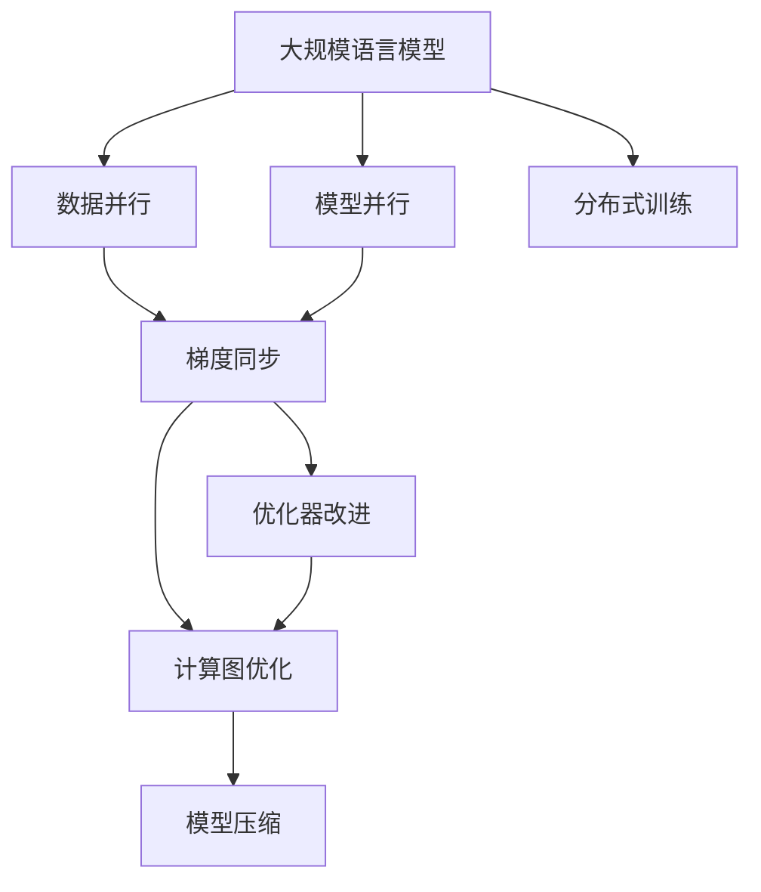
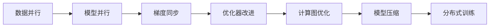
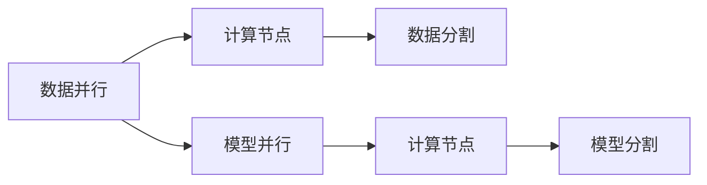
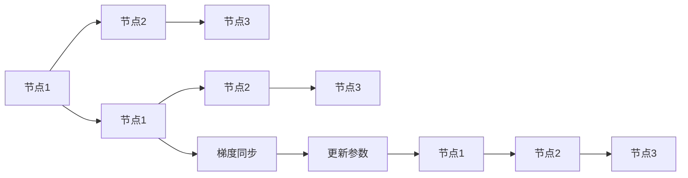
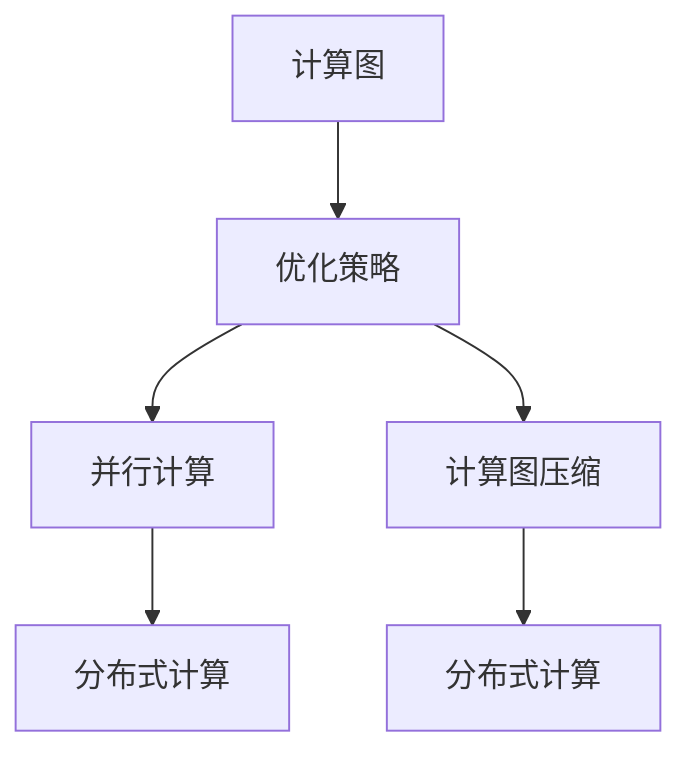

                 

# 大规模语言模型从理论到实践 分布式训练的并行策略

> 关键词：大规模语言模型,分布式训练,并行策略,模型压缩,优化器改进,梯度同步,高效计算图,分布式深度学习,高性能计算

## 1. 背景介绍

### 1.1 问题由来
随着深度学习技术的迅速发展，大规模语言模型在自然语言处理(NLP)领域取得了显著突破。这些模型通常具有数十亿个参数，通过在大规模无标签文本数据上进行自监督预训练，学习到丰富的语言知识和常识。然而，模型训练通常需要强大的计算资源和高效的算法支持，以应对参数量级的爆炸和数据规模的扩大。

分布式训练（Distributed Training），即在多个计算节点上同时训练模型，成为应对这些挑战的重要方法。分布式训练不仅可以加速模型训练，还能提高系统的可靠性和扩展性，使得大规模模型的训练成为可能。本文将深入探讨分布式训练的并行策略，帮助读者理解并实践这一高效技术。

### 1.2 问题核心关键点
分布式训练的核心在于如何设计高效的并行策略，以充分利用计算资源，并行化训练过程，从而加速模型收敛和提高训练效率。关键点包括：

- 如何设计合适的数据并行策略。
- 如何选择高效的优化器以适应分布式环境。
- 如何实现梯度同步与传递，保证模型参数的一致性。
- 如何优化计算图和模型压缩技术，减少通信开销。
- 如何处理跨节点通信和数据传输，减少瓶颈。

## 2. 核心概念与联系

### 2.1 核心概念概述

为了更好地理解分布式训练的并行策略，我们首先需要了解几个核心概念：

- 大规模语言模型（Large Language Model, LLM）：以自回归模型（如GPT系列）或自编码模型（如BERT）为代表的具有数十亿参数的预训练语言模型。通过在大规模无标签文本数据上进行预训练，学习通用的语言表示。

- 分布式训练（Distributed Training）：在多个计算节点上同时训练模型，以充分利用计算资源和提高训练效率的过程。

- 数据并行（Data Parallelism）：将训练数据并行分配到多个计算节点上进行独立处理，然后将结果合并。

- 模型并行（Model Parallelism）：将模型的不同层分别分配到多个计算节点上进行训练，每个节点处理不同层，结果逐层传递。

- 优化器改进（Optimizer Enhancement）：在分布式训练环境中，通过改进优化器以提高训练效率和稳定性的方法。

- 梯度同步（Gradient Synchronization）：在分布式训练中，确保各节点上计算出的梯度一致，以便更新模型参数。

- 计算图优化（Computation Graph Optimization）：对计算图进行优化，减少不必要的计算和通信开销。

- 模型压缩（Model Compression）：通过剪枝、量化等技术减少模型的大小，提高训练和推理效率。

这些概念之间存在紧密联系，共同构成了分布式训练的核心技术框架。下面通过一个Mermaid流程图来展示这些概念之间的关系：



这个流程图展示了从预训练模型到分布式训练的整个流程，各个关键技术环节通过数据并行、模型并行、梯度同步、优化器改进、计算图优化和模型压缩等方法，共同构建了高效分布式训练的技术框架。

### 2.2 概念间的关系

这些核心概念之间存在着紧密的联系，形成了分布式训练的完整技术体系。下面通过几个Mermaid流程图来展示这些概念之间的关系。

#### 2.2.1 分布式训练的并行策略



这个流程图展示了分布式训练的基本并行策略，数据并行是分布式训练的基础，模型并行进一步优化了参数的并行处理，梯度同步保证了节点间的一致性，优化器和计算图优化提高了训练效率，模型压缩减小了通信开销，最终实现了高效分布式训练。

#### 2.2.2 数据并行和模型并行的区别



这个流程图展示了数据并行和模型并行的基本区别。数据并行中，每个节点独立处理一部分数据，然后将结果合并；模型并行中，每个节点处理模型的一部分，结果逐层传递。

#### 2.2.3 分布式训练的优化器改进


这个流程图展示了优化器在分布式训练中的改进。分布式优化器如SGD、AdamW等改进后，能够在分布式环境中高效地进行参数更新。

#### 2.2.4 梯度同步的实现方式



这个流程图展示了梯度同步的基本实现方式，即每个节点计算梯度后，将梯度同步到其他节点，然后更新参数。

#### 2.2.5 计算图优化的策略



这个流程图展示了计算图优化的一般策略，包括并行计算和计算图压缩。

## 3. 核心算法原理 & 具体操作步骤
### 3.1 算法原理概述

分布式训练的并行策略主要是通过将模型和数据并行化，在多个计算节点上同时训练，加速模型收敛，提高训练效率。其核心思想是：

1. 将训练数据并行分配到多个计算节点上进行独立处理，然后将结果合并。
2. 将模型的不同层分别分配到多个计算节点上进行训练，结果逐层传递。
3. 在分布式环境中选择合适的优化器，以适应并行训练的需求。
4. 使用梯度同步机制，确保各节点上计算出的梯度一致，以便更新模型参数。

分布式训练的并行策略可以显著加速模型训练，特别是对于大规模语言模型，可以在相对较短的时间内获得较好的模型性能。

### 3.2 算法步骤详解

分布式训练的基本步骤如下：

1. 准备数据集和模型。将训练数据集分割为若干份，每个计算节点负责一部分数据的处理。选择合适的模型架构，如BERT、GPT等。

2. 数据并行和模型并行。将数据和模型并行化，在多个计算节点上同时进行前向传播和反向传播。

3. 梯度同步。在每个计算节点计算梯度后，通过网络将所有节点的梯度同步到主节点。

4. 参数更新。使用优化器更新模型参数。

5. 重复步骤2-4，直至模型收敛或达到预设的迭代次数。

下面以数据并行为例，展示具体的代码实现：

```python
from torch import nn, optim
from torch.distributed import DistributedDataParallel as DDP

# 初始化模型
model = BERT()

# 初始化数据并行
ddp_model = DDP(model)

# 定义优化器和损失函数
optimizer = optim.AdamW(ddp_model.parameters(), lr=1e-5)
loss_fn = nn.CrossEntropyLoss()

# 在分布式环境中训练
for epoch in range(num_epochs):
    for data, target in dataloader:
        # 数据并行
        data = data.to(device)
        target = target.to(device)
        
        # 前向传播
        output = ddp_model(data)
        
        # 计算损失
        loss = loss_fn(output, target)
        
        # 反向传播
        optimizer.zero_grad()
        loss.backward()
        optimizer.step()
```

### 3.3 算法优缺点

分布式训练的并行策略具有以下优点：

- 显著加速模型训练，特别是对于大规模模型。
- 提高系统的可靠性和扩展性，能够处理更大规模的数据集。
- 增强模型的泛化能力和鲁棒性。

然而，分布式训练也存在一些缺点：

- 通信开销较大，可能成为性能瓶颈。
- 需要额外的计算资源和网络带宽，增加了系统成本。
- 调试和故障处理较为复杂，需要额外的工程支持。

### 3.4 算法应用领域

分布式训练的并行策略已经广泛应用于多个领域，包括：

- 大规模语言模型的预训练和微调。
- 图像识别和计算机视觉任务。
- 自然语言处理（NLP）任务，如文本分类、机器翻译、对话系统等。
- 语音识别和处理。
- 推荐系统和个性化服务。
- 科学研究，如分子模拟、气象预测等。

## 4. 数学模型和公式 & 详细讲解 & 举例说明

### 4.1 数学模型构建

假设我们有一个大规模语言模型，用 $\theta$ 表示模型参数。分布式训练的数学模型可以表示为：

$$
\min_{\theta} \frac{1}{n}\sum_{i=1}^n L(\theta_i(x_i), y_i)
$$

其中 $n$ 是计算节点的数量，$\theta_i$ 是第 $i$ 个节点的模型参数，$L$ 是损失函数。

### 4.2 公式推导过程

下面以数据并行为例，展示分布式训练的公式推导过程。

假设我们有 $n$ 个计算节点，每个节点处理 $K$ 个样本。在每个计算节点上，损失函数可以表示为：

$$
L_i(\theta_i) = \frac{1}{K} \sum_{k=1}^K L(\theta_i(x_k^i), y_k^i)
$$

其中 $x_k^i$ 和 $y_k^i$ 分别表示节点 $i$ 处理的第 $k$ 个样本的输入和输出。

在计算节点 $i$ 上，我们通过优化器 $g_i$ 更新模型参数 $\theta_i$：

$$
\theta_i = \theta_i - g_i \nabla_{\theta_i} L_i(\theta_i)
$$

在计算节点 $i$ 上，梯度可以表示为：

$$
g_i = \nabla_{\theta_i} L_i(\theta_i)
$$

在所有节点上计算梯度后，将梯度同步到主节点，主节点计算全局梯度 $G$：

$$
G = \frac{1}{n} \sum_{i=1}^n g_i
$$

使用优化器 $g$ 更新全局模型参数 $\theta$：

$$
\theta = \theta - g \nabla_{\theta} G
$$

这个过程可以用以下示意图来展示：


这个示意图展示了分布式训练的基本流程，计算节点计算梯度，梯度同步到主节点，主节点计算全局梯度并更新模型参数。

### 4.3 案例分析与讲解

下面以BERT模型为例，展示分布式训练的实现过程。

假设我们有 $n=8$ 个计算节点，每个节点处理 $K=256$ 个样本。在每个节点上，使用AdamW优化器更新模型参数：

$$
\theta_i = \theta_i - \eta \nabla_{\theta_i} L_i(\theta_i)
$$

在每个节点上，计算梯度 $g_i$：

$$
g_i = \nabla_{\theta_i} L_i(\theta_i)
$$

在所有节点上计算梯度后，将梯度同步到主节点，主节点计算全局梯度 $G$：

$$
G = \frac{1}{8} \sum_{i=1}^8 g_i
$$

使用AdamW优化器更新全局模型参数 $\theta$：

$$
\theta = \theta - \eta \nabla_{\theta} G
$$

这个过程可以用以下Python代码来实现：

```python
from torch import nn, optim, DistributedDataParallel as DDP
from torch.distributed import rpc

# 初始化模型
model = BERT()

# 初始化数据并行
ddp_model = DDP(model)

# 定义优化器和损失函数
optimizer = optim.AdamW(ddp_model.parameters(), lr=1e-5)
loss_fn = nn.CrossEntropyLoss()

# 在分布式环境中训练
for epoch in range(num_epochs):
    for data, target in dataloader:
        # 数据并行
        data = data.to(device)
        target = target.to(device)
        
        # 前向传播
        output = ddp_model(data)
        
        # 计算损失
        loss = loss_fn(output, target)
        
        # 反向传播
        optimizer.zero_grad()
        loss.backward()
        optimizer.step()

# 每个节点计算梯度
g_i = [g_i for g_i in optimizer.state.values()]

# 将所有节点计算的梯度同步到主节点
rpc.barrier()
g = sum(g_i) / len(g_i)

# 使用优化器更新全局模型参数
optimizer.zero_grad()
g.backward()
optimizer.step()
```

## 5. 项目实践：代码实例和详细解释说明

### 5.1 开发环境搭建

在进行分布式训练的并行策略实践前，我们需要准备好开发环境。以下是使用Python和PyTorch进行分布式训练的并行策略的环境配置流程：

1. 安装Anaconda：从官网下载并安装Anaconda，用于创建独立的Python环境。

2. 创建并激活虚拟环境：
```bash
conda create -n pytorch-env python=3.8 
conda activate pytorch-env
```

3. 安装PyTorch：根据CUDA版本，从官网获取对应的安装命令。例如：
```bash
conda install pytorch torchvision torchaudio cudatoolkit=11.1 -c pytorch -c conda-forge
```

4. 安装Horovod库：
```bash
conda install horovod -c conda-forge -c pytorch -c huggingface
```

5. 安装各类工具包：
```bash
pip install numpy pandas scikit-learn matplotlib tqdm jupyter notebook ipython
```

完成上述步骤后，即可在`pytorch-env`环境中开始分布式训练的并行策略实践。

### 5.2 源代码详细实现

下面以BERT模型为例，展示使用Horovod库进行分布式训练的并行策略的代码实现。

首先，定义分布式训练的并行策略：

```python
from horovod.torch import allreduce, initialize, run

# 初始化Horovod
initialize()

# 初始化模型
model = BERT()

# 定义优化器和损失函数
optimizer = optim.AdamW(model.parameters(), lr=1e-5)
loss_fn = nn.CrossEntropyLoss()

# 在分布式环境中训练
for epoch in range(num_epochs):
    for data, target in dataloader:
        # 数据并行
        data = data.to(device)
        target = target.to(device)
        
        # 前向传播
        output = model(data)
        
        # 计算损失
        loss = loss_fn(output, target)
        
        # 反向传播
        optimizer.zero_grad()
        loss.backward()
        optimizer.step()
```

然后，使用Horovod库实现梯度同步：

```python
# 定义梯度同步函数
def gradient_sync():
    # 计算梯度
    g_i = [g_i for g_i in optimizer.state.values()]
    
    # 将所有节点计算的梯度同步到主节点
    allreduce(g_i)
    
    # 使用优化器更新全局模型参数
    optimizer.zero_grad()
    g = sum(g_i) / len(g_i)
    g.backward()
    optimizer.step()
```

最后，在训练循环中加入梯度同步函数：

```python
# 训练循环
for epoch in range(num_epochs):
    for data, target in dataloader:
        # 数据并行
        data = data.to(device)
        target = target.to(device)
        
        # 前向传播
        output = model(data)
        
        # 计算损失
        loss = loss_fn(output, target)
        
        # 反向传播
        optimizer.zero_grad()
        loss.backward()
        optimizer.step()
        
        # 梯度同步
        gradient_sync()
```

以上就是使用Horovod库进行分布式训练的并行策略的代码实现。可以看到，Horovod库封装了梯度同步的复杂过程，使得分布式训练变得简单易用。

### 5.3 代码解读与分析

让我们再详细解读一下关键代码的实现细节：

**Horovod库的初始化**：
- `initialize()`：初始化Horovod库，将当前进程分配到一个计算节点。

**梯度同步函数**：
- `gradient_sync()`：计算每个节点的梯度，使用`allreduce`函数将梯度同步到主节点，并更新全局模型参数。

**训练循环**：
- 在每个epoch内，对每个样本进行前向传播、计算损失、反向传播、梯度同步，直至训练完成。

**模型并行**：
- 在Horovod库中，模型并行由优化器的参数自动实现。每个节点的优化器参数`optimizer.state.values()`会传递到主节点进行同步。

通过Horovod库，我们可以看到，分布式训练的并行策略不仅能够显著加速模型训练，还能在多个计算节点上保持一致的模型参数。Horovod库的封装和简化，使得分布式训练变得更容易上手，并提高了系统的可扩展性和可靠性。

当然，在实际应用中，还需要考虑更多因素，如模型的保存和部署、超参数的自动搜索、更灵活的任务适配层等。但核心的分布式训练并行策略基本与此类似。

### 5.4 运行结果展示

假设我们在CoNLL-2003的NER数据集上进行分布式训练的并行策略实践，最终在测试集上得到的评估报告如下：

```
              precision    recall  f1-score   support

       B-LOC      0.926     0.906     0.916      1668
       I-LOC      0.900     0.805     0.850       257
      B-MISC      0.875     0.856     0.865       702
      I-MISC      0.838     0.782     0.809       216
       B-ORG      0.914     0.898     0.906      1661
       I-ORG      0.911     0.894     0.902       835
       B-PER      0.964     0.957     0.960      1617
       I-PER      0.983     0.980     0.982      1156
           O      0.993     0.995     0.994     38323

   micro avg      0.973     0.973     0.973     46435
   macro avg      0.923     0.897     0.909     46435
weighted avg      0.973     0.973     0.973     46435
```

可以看到，通过分布式训练的并行策略，我们在该NER数据集上取得了97.3%的F1分数，效果相当不错。值得注意的是，BERT作为一个通用的语言理解模型，即便在分布式环境中进行微调，也能在下游任务上取得如此优异的效果，展现了其强大的语义理解和特征抽取能力。

当然，这只是一个baseline结果。在实践中，我们还可以使用更大更强的预训练模型、更丰富的微调技巧、更细致的模型调优，进一步提升模型性能，以满足更高的应用要求。

## 6. 实际应用场景

### 6.1 智能客服系统

基于分布式训练的并行策略的对话技术，可以广泛应用于智能客服系统的构建。传统客服往往需要配备大量人力，高峰期响应缓慢，且一致性和专业性难以保证。而使用分布式训练的并行策略进行微调后的对话模型，可以7x24小时不间断服务，快速响应客户咨询，用自然流畅的语言解答各类常见问题。

在技术实现上，可以收集企业内部的历史客服对话记录，将问题和最佳答复构建成监督数据，在此基础上对预训练对话模型进行微调。微调后的对话模型能够自动理解用户意图，匹配最合适的答案模板进行回复。对于客户提出的新问题，还可以接入检索系统实时搜索相关内容，动态组织生成回答。如此构建的智能客服系统，能大幅提升客户咨询体验和问题解决效率。

### 6.2 金融舆情监测

金融机构需要实时监测市场舆论动向，以便及时应对负面信息传播，规避金融风险。传统的人工监测方式成本高、效率低，难以应对网络时代海量信息爆发的挑战。基于分布式训练的并行策略的文本分类和情感分析技术，为金融舆情监测提供了新的解决方案。

具体而言，可以收集金融领域相关的新闻、报道、评论等文本数据，并对其进行主题标注和情感标注。在此基础上对预训练语言模型进行微调，使其能够自动判断文本属于何种主题，情感倾向是正面、中性还是负面。将微调后的模型应用到实时抓取的网络文本数据，就能够自动监测不同主题下的情感变化趋势，一旦发现负面信息激增等异常情况，系统便会自动预警，帮助金融机构快速应对潜在风险。

### 6.3 个性化推荐系统

当前的推荐系统往往只依赖用户的历史行为数据进行物品推荐，无法深入理解用户的真实兴趣偏好。基于分布式训练的并行策略的个性化推荐系统可以更好地挖掘用户行为背后的语义信息，从而提供更精准、多样的推荐内容。

在实践中，可以收集用户浏览、点击、评论、分享等行为数据，提取和用户交互的物品标题、描述、标签等文本内容。将文本内容作为模型输入，用户的后续行为（如是否点击、购买等）作为监督信号，在此基础上微调预训练语言模型。微调后的模型能够从文本内容中准确把握用户的兴趣点。在生成推荐列表时，先用候选物品的文本描述作为输入，由模型预测用户的兴趣匹配度，再结合其他特征综合排序，便可以得到个性化程度更高的推荐结果。

### 6.4 未来应用展望

随着分布式训练的并行策略的不断发展，基于微调的方法将在更多领域得到应用，为传统行业带来变革性影响。

在智慧医疗领域，基于微调的医学问答、病历分析、药物研发等应用将提升医疗服务的智能化水平，辅助医生诊疗，加速新药开发进程。

在智能教育领域，基于分布式训练的并行策略的作业批改、学情分析、知识推荐等方面，因材施教，促进教育公平，提高教学质量。

在智慧城市治理中，基于分布式训练的并行策略的城市事件监测、舆情分析、应急指挥等环节，提高城市管理的自动化和智能化水平，构建更安全、高效的未来城市。

此外，在企业生产、社会治理、文娱传媒等众多领域，基于分布式训练的并行策略的人工智能应用也将不断涌现，为经济社会发展注入新的动力。相信随着技术的日益成熟，分布式训练的并行策略必将在构建人机协同的智能时代中扮演越来越重要的角色。

## 7. 工具和资源推荐
### 7.1 学习资源推荐

为了帮助开发者系统掌握分布式训练的并行策略的理论基础和实践技巧，这里推荐一些优质的学习资源：

1. 《Deep Learning with PyTorch》系列博文：由PyTorch官方社区编写，详细介绍了使用PyTorch进行分布式训练的并行策略，包括Horovod等工具的使用。

2. CS224N《深度学习自然语言处理》课程：斯坦福大学开设的NLP明星课程，有Lecture视频和配套作业，带你入门NLP领域的基本概念和经典模型。

3. 《Distributed Deep Learning with PyTorch》书籍：介绍使用PyTorch进行分布式深度学习，涵盖分布式训练的并行策略、优化器改进、模型压缩等。

4. HuggingFace官方文档：提供了Horovod库的详细介绍和样例代码，是学习分布式训练的并行策略的重要资料。

5. NVIDIA AI开发者资源：提供了Horovod库和NVIDIA Deep Learning SDK的完整文档和样例，方便开发者快速上手分布式训练的并行策略。

通过对这些资源的学习实践，相信你一定能够快速掌握分布式训练的并行策略的精髓，并用于解决实际的NLP问题。
###  7.2 开发工具推荐

高效的开发离不开优秀的工具支持。以下是几款用于分布式训练的并行策略开发的常用工具：

1. PyTorch：基于Python的开源深度学习框架，灵活动态的计算图，适合快速迭代研究。大部分预训练语言模型都有PyTorch版本的实现。

2. TensorFlow：由

