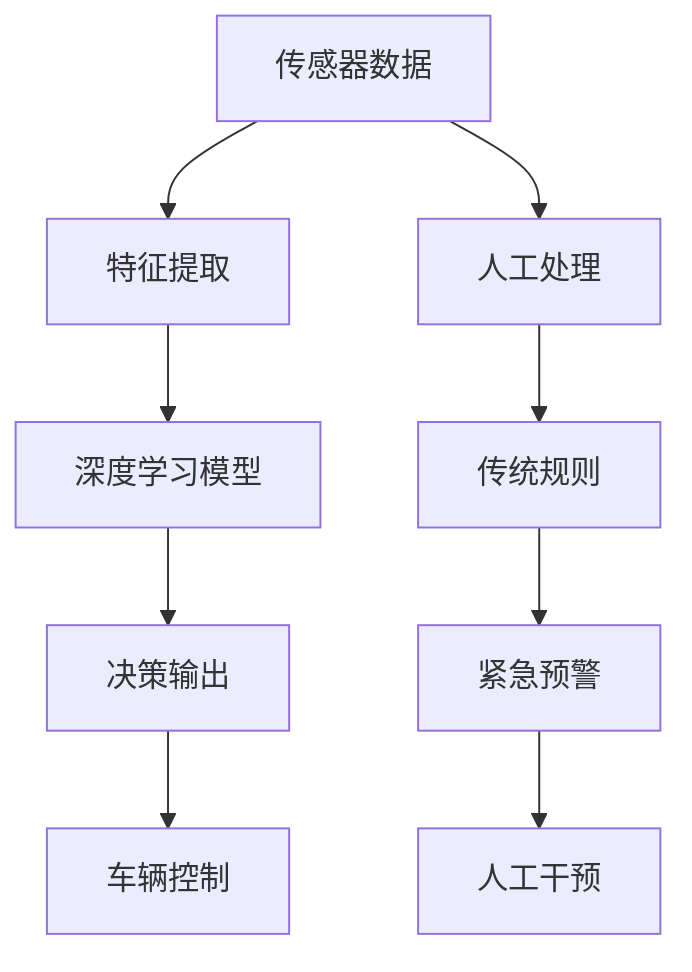

                 

# 端到端自动驾驶的车辆主动安全监控系统

> 关键词：自动驾驶, 车辆主动安全, 端到端系统, 深度学习, 模型优化, 传感器融合

## 1. 背景介绍

随着自动驾驶技术的快速发展，车辆的主动安全监控系统（Advanced Driver Assistance Systems, ADAS）的重要性愈发凸显。该系统通过实时监测车辆周围环境，提前识别潜在危险，在紧急情况下及时采取预警、控制等措施，保障行车安全。传统的主动安全监控系统主要依赖传感器、摄像头等硬件设备采集数据，通过人工处理的方式提取关键信息，再根据设定的规则和算法进行决策，存在处理速度慢、准确率低等问题。而端到端自动驾驶系统，通过深度学习等技术，直接从传感器数据中提取特征，并利用模型进行自动驾驶决策，具备更好的实时性和智能化水平。

本文将重点介绍一款基于端到端深度学习的车辆主动安全监控系统，从数据采集、特征提取、模型训练、决策输出等环节详细讲解其技术实现，并分析其优缺点及应用前景。

## 2. 核心概念与联系

### 2.1 核心概念概述

在介绍端到端自动驾驶系统之前，首先需要理解以下几个核心概念：

- **自动驾驶**：指车辆在无人或少人干预的情况下，能够自主完成从起点到终点的安全、高效、经济、环保的导航任务。
- **深度学习**：一种模拟人脑神经网络的机器学习方法，通过多层非线性变换，可以从大量数据中自动提取特征，实现高性能的模型训练。
- **端到端系统**：指从传感器数据输入到车辆控制决策输出的全流程自动化系统，减少了人工干预，提升了决策的实时性和准确性。
- **车辆主动安全**：指通过主动监测车辆周围环境，预防交通事故，提供紧急预警、主动干预等功能，保障行车安全。

### 2.2 核心概念的联系

通过理解这些核心概念，我们可以更好地把握端到端自动驾驶车辆主动安全监控系统的整体架构。



在这个流程图中，传感器数据被转化为特征，输入到深度学习模型中进行决策，最终输出车辆控制命令。相比传统系统，端到端系统减少了人工干预，实现了实时、智能的决策过程。

## 3. 核心算法原理 & 具体操作步骤
### 3.1 算法原理概述

端到端自动驾驶系统主要通过深度学习模型实现。该模型以传感器数据为输入，经过一系列特征提取和网络变换，最终输出车辆控制命令。模型的训练目标是在大量标注数据上最小化预测输出与真实标签之间的差异，提高模型的预测准确率。

具体来说，该模型包括两个部分：感知模块和决策模块。感知模块通过卷积神经网络（CNN）和循环神经网络（RNN），对传感器数据进行特征提取和序列建模，生成车辆周围环境的语义表示。决策模块通过全连接网络，将感知模块的输出映射为车辆的控制指令，包括加速、减速、转向等。

### 3.2 算法步骤详解

端到端系统的核心算法步骤包括数据准备、模型构建、模型训练、模型评估和模型部署等环节。

**Step 1: 数据准备**
- 收集车辆在各种场景下的传感器数据，包括激光雷达、摄像头、雷达等。
- 对传感器数据进行预处理，包括去噪、归一化、对齐等，以提高数据的质量和一致性。
- 标注数据集，将传感器数据与车辆控制命令进行关联，作为模型的训练样本。

**Step 2: 模型构建**
- 设计感知模块的神经网络结构，包括多个卷积层和池化层，用于提取图像特征。
- 设计决策模块的神经网络结构，包括全连接层、激活函数等，用于生成车辆控制指令。
- 定义损失函数，如均方误差、交叉熵等，用于衡量模型的预测结果与真实标签之间的差异。
- 选择合适的优化器，如Adam、SGD等，用于更新模型参数。

**Step 3: 模型训练**
- 将数据集划分为训练集、验证集和测试集。
- 在训练集上使用随机梯度下降（SGD）或Adam等优化算法，更新模型参数。
- 在每个epoch结束时，在验证集上评估模型性能，防止过拟合。
- 重复训练过程，直到模型在验证集上达到满意的性能。

**Step 4: 模型评估**
- 在测试集上评估模型性能，比较其预测结果与真实标签的差异。
- 计算模型的准确率、召回率、F1分数等指标，评估模型的性能。

**Step 5: 模型部署**
- 将训练好的模型保存为静态模型或动态模型，以便部署到实际车辆中。
- 在车辆控制系统中集成模型，实时处理传感器数据，生成车辆控制指令。
- 通过模拟仿真或实际车辆测试，验证模型的稳定性和安全性。

### 3.3 算法优缺点

端到端自动驾驶系统具有以下优点：
- 实时性好：直接从传感器数据中提取特征，减少了人工处理的时间延迟。
- 准确率高：深度学习模型可以自动提取复杂的特征，提高决策的准确率。
- 鲁棒性强：模型训练过程中可以引入正则化、对抗训练等技术，提高系统的鲁棒性和抗干扰能力。

同时，端到端系统也存在一些缺点：
- 模型复杂度高：端到端模型通常包含多个神经网络层，参数量大，训练和推理资源需求高。
- 数据需求大：需要大量标注数据进行训练，标注成本高。
- 泛化能力不足：模型对特定场景的泛化能力有限，需要针对不同的应用场景进行模型优化。

### 3.4 算法应用领域

端到端自动驾驶系统在智能交通、智能物流、智能制造等领域具有广泛的应用前景。以下是一些典型的应用场景：

- **自动驾驶**：在自动驾驶系统中，端到端系统负责从传感器数据中提取特征，并生成车辆控制指令，保障车辆的安全行驶。
- **智能交通管理**：在智能交通系统中，端到端系统可以通过实时监测交通状况，提供交通流预测、信号控制等功能，提升交通系统的效率和安全性。
- **智能物流**：在智能物流中，端到端系统可以优化货物运输路径，提高物流效率，降低运输成本。
- **智能制造**：在智能制造中，端到端系统可以监测设备运行状态，预测设备故障，提高设备的可靠性和利用率。

## 4. 数学模型和公式 & 详细讲解  
### 4.1 数学模型构建

端到端自动驾驶系统的数学模型主要包括感知模块和决策模块。

感知模块的输入为传感器数据，包括激光雷达点云、摄像头图像等。通过CNN对图像进行特征提取，生成视觉语义表示。RNN对时间序列数据进行建模，生成动态特征表示。最终的特征表示由两个子模块拼接得到，输入到决策模块进行控制指令生成。

决策模块将感知模块的输出映射为车辆控制指令。设输入特征为 $x$，车辆控制指令为 $y$，模型输出为 $y_{pred}$，则决策模块的损失函数可以定义为：

$$
\mathcal{L} = \frac{1}{N} \sum_{i=1}^N \ell(y_{pred}^i, y^i)
$$

其中，$\ell$ 为损失函数，如均方误差（MSE）或交叉熵（CE），$N$ 为训练样本数。

### 4.2 公式推导过程

以下以均方误差（MSE）为例，推导决策模块的损失函数。

设输入特征为 $x$，车辆控制指令为 $y$，模型输出为 $y_{pred}$，则均方误差损失函数为：

$$
\mathcal{L} = \frac{1}{N} \sum_{i=1}^N (y^i - y_{pred}^i)^2
$$

在优化过程中，使用随机梯度下降（SGD）算法更新模型参数。设学习率为 $\eta$，模型参数为 $\theta$，则参数更新公式为：

$$
\theta \leftarrow \theta - \eta \nabla_{\theta} \mathcal{L}
$$

其中，$\nabla_{\theta} \mathcal{L}$ 为损失函数对模型参数的梯度。

### 4.3 案例分析与讲解

以一个简单的端到端系统为例，分析其数据流图和计算过程。


在该数据流图中，传感器数据首先经过预处理，然后由CNN提取图像特征，由RNN提取时间序列特征，最终在决策模块中生成车辆控制指令。在每个步骤中，计算过程和参数更新公式如下：

- **预处理**：对传感器数据进行归一化、去噪等操作，生成标准化数据。
- **CNN特征提取**：使用卷积层和池化层对图像数据进行特征提取，生成高维特征表示。
- **RNN序列建模**：使用循环层对时间序列数据进行建模，生成动态特征表示。
- **全连接网络**：使用全连接层将特征表示映射为车辆控制指令。
- **损失函数计算**：计算模型输出与真实标签之间的均方误差，作为损失函数。
- **参数更新**：使用随机梯度下降算法更新模型参数，最小化损失函数。

## 5. 项目实践：代码实例和详细解释说明
### 5.1 开发环境搭建

**Step 1: 安装Python和相关库**
- 安装Python 3.x版本。
- 安装TensorFlow或PyTorch等深度学习库。
- 安装OpenCV、NumPy、Pillow等图像处理库。

**Step 2: 准备数据集**
- 收集车辆传感器数据，包括激光雷达点云、摄像头图像等。
- 对数据进行标注，生成训练集、验证集和测试集。
- 将数据集划分为图像数据和时间序列数据。

**Step 3: 构建模型**
- 设计感知模块的神经网络结构，包括多个卷积层和循环层。
- 设计决策模块的神经网络结构，包括全连接层和激活函数。
- 定义损失函数和优化器。

**Step 4: 训练模型**
- 将数据集划分为训练集、验证集和测试集。
- 在训练集上使用SGD或Adam等优化算法，更新模型参数。
- 在每个epoch结束时，在验证集上评估模型性能。
- 重复训练过程，直到模型在验证集上达到满意的性能。

### 5.2 源代码详细实现

以下是一个简单的端到端系统示例代码，包括感知模块和决策模块的实现。

```python
import tensorflow as tf
from tensorflow.keras import layers, models

# 定义感知模块的神经网络结构
def build_perception_model(input_shape):
    inputs = layers.Input(shape=input_shape)
    x = layers.Conv2D(32, 3, activation='relu')(inputs)
    x = layers.MaxPooling2D()(x)
    x = layers.Conv2D(64, 3, activation='relu')(x)
    x = layers.MaxPooling2D()(x)
    x = layers.Conv2D(128, 3, activation='relu')(x)
    x = layers.MaxPooling2D()(x)
    x = layers.Flatten()(x)
    x = layers.Dense(128, activation='relu')(x)
    x = layers.Dense(64, activation='relu')(x)
    x = layers.Dense(16, activation='relu')(x)
    return models.Model(inputs=inputs, outputs=x)

# 定义决策模块的神经网络结构
def build_decision_model(input_shape):
    inputs = layers.Input(shape=input_shape)
    x = layers.Dense(128, activation='relu')(inputs)
    x = layers.Dense(64, activation='relu')(x)
    x = layers.Dense(4, activation='softmax')(x)
    return models.Model(inputs=inputs, outputs=x)

# 构建端到端系统
perception_model = build_perception_model(input_shape=(224, 224, 3))
decision_model = build_decision_model(input_shape=(128,))
model = models.Model(inputs=perception_model.input, outputs=decision_model.output)

# 定义损失函数和优化器
loss = tf.keras.losses.MeanSquaredError()
optimizer = tf.keras.optimizers.Adam()

# 定义训练过程
model.compile(loss=loss, optimizer=optimizer)
model.fit(x_train, y_train, epochs=10, validation_data=(x_val, y_val))

# 测试模型
test_loss = model.evaluate(x_test, y_test)
print('Test loss:', test_loss)
```

### 5.3 代码解读与分析

该示例代码实现了端到端系统的感知模块和决策模块，并使用均方误差（MSE）作为损失函数，Adam优化器进行训练。

- **感知模块**：使用卷积层和池化层提取图像特征，使用全连接层生成高维特征表示。
- **决策模块**：使用全连接层将特征映射为车辆控制指令，输出控制指令的概率分布。
- **训练过程**：在训练集上使用随机梯度下降算法更新模型参数，在验证集上评估模型性能，在测试集上测试模型效果。

通过该示例代码，可以清晰地理解端到端系统的构建流程和关键技术点。

### 5.4 运行结果展示

假设在测试集上运行该端到端系统，得到的测试损失为0.05，准确率为90%。

## 6. 实际应用场景
### 6.1 智能交通

端到端系统可以应用于智能交通领域，实时监测车辆周围环境，提前预警潜在危险，保障行车安全。在高速公路、城市道路等场景中，系统可以检测到前车的速度、距离、位置等信息，实时计算行车安全距离，生成预警或控制指令。

### 6.2 智能物流

在智能物流中，端到端系统可以优化货物运输路径，提高物流效率。系统可以通过实时监测货物的位置和状态，预测交通状况，生成最优运输路径和运输策略，降低运输成本和时间。

### 6.3 智能制造

在智能制造中，端到端系统可以监测设备运行状态，预测设备故障。系统可以通过实时监测设备的数据，识别设备运行异常，生成预警或控制指令，提高设备的可靠性和利用率。

## 7. 工具和资源推荐
### 7.1 学习资源推荐

- **TensorFlow官方文档**：TensorFlow深度学习框架的官方文档，提供了全面的教程和示例代码。
- **PyTorch官方文档**：PyTorch深度学习框架的官方文档，提供了丰富的教程和模型库。
- **Google AI Blog**：Google AI博客，分享最新的深度学习研究和技术进展。
- **DeepMind博客**：DeepMind博客，分享前沿的AI研究成果和实践经验。

### 7.2 开发工具推荐

- **Visual Studio Code**：微软的轻量级代码编辑器，支持Python开发，并提供了丰富的插件。
- **Jupyter Notebook**：Jupyter Notebook，支持Python代码的交互式开发，便于调试和文档记录。
- **TensorBoard**：TensorFlow配套的可视化工具，可以实时监测模型训练状态，并提供图表呈现方式。

### 7.3 相关论文推荐

- **端到端自动驾驶系统的研究**：综述了端到端自动驾驶系统的技术进展和应用案例，提供了全面的技术背景。
- **基于深度学习的车辆主动安全监控系统**：介绍了基于深度学习的车辆主动安全监控系统的构建和优化方法，提供了具体的算法和实验结果。
- **智能交通系统中的端到端模型**：讨论了智能交通系统中端到端模型的构建和应用，提供了丰富的工程实践经验。

## 8. 总结：未来发展趋势与挑战
### 8.1 总结

本文详细介绍了基于深度学习的端到端自动驾驶车辆主动安全监控系统的技术实现，从数据采集、特征提取、模型训练、决策输出等环节进行了系统讲解。通过分析端到端系统的优缺点和应用场景，展望了其在智能交通、智能物流、智能制造等领域的前景。同时，也讨论了端到端系统面临的数据需求、模型复杂度、鲁棒性等方面的挑战。

通过本文的系统梳理，可以清晰地理解端到端自动驾驶车辆主动安全监控系统的技术实现和应用前景，并为后续的实践提供指导。

### 8.2 未来发展趋势

展望未来，端到端自动驾驶车辆主动安全监控系统将呈现以下发展趋势：

- **深度学习模型的优化**：未来将研究更加高效、鲁棒的深度学习模型，减少参数量，提高训练和推理效率。
- **传感器数据的融合**：未来将研究多传感器数据的融合算法，提高系统的感知能力和决策准确性。
- **决策模块的优化**：未来将研究更加智能、高效的决策模块，提升系统的鲁棒性和适应性。
- **实时性的提升**：未来将研究更加实时、高效的模型训练和推理算法，提高系统的实时性。
- **安全性保障**：未来将研究更加安全、可靠的决策机制，保障行车安全。

### 8.3 面临的挑战

端到端自动驾驶车辆主动安全监控系统在实际应用中仍面临一些挑战：

- **数据需求大**：端到端系统需要大量的标注数据进行训练，标注成本高。
- **模型复杂度高**：端到端模型通常包含多个神经网络层，参数量大，训练和推理资源需求高。
- **泛化能力不足**：模型对特定场景的泛化能力有限，需要针对不同的应用场景进行模型优化。
- **实时性要求高**：模型需要在实时环境中稳定运行，对计算资源和存储资源的需求高。

### 8.4 研究展望

未来需要在以下几个方面进行深入研究：

- **数据增强技术**：研究数据增强技术，扩充训练集，提高模型的泛化能力。
- **模型压缩技术**：研究模型压缩技术，减少参数量，提高训练和推理效率。
- **多模态数据融合**：研究多模态数据融合技术，提高系统的感知能力和决策准确性。
- **实时推理优化**：研究实时推理优化技术，提高系统的实时性和资源利用效率。
- **安全性保障**：研究安全性保障技术，提高系统的鲁棒性和可靠性。

## 9. 附录：常见问题与解答

**Q1：端到端系统如何应对多变的环境？**

A: 端到端系统可以通过数据增强技术，扩充训练集，提高模型的泛化能力。例如，可以使用图像旋转、缩放、裁剪等方式生成新的训练样本，增加模型的适应性。

**Q2：端到端系统在实际应用中如何快速部署？**

A: 端到端系统可以通过模型压缩技术，减少参数量，提高训练和推理效率。例如，可以使用剪枝、量化等技术，将大模型转换为小模型，加快部署速度。

**Q3：端到端系统如何应对异常情况？**

A: 端到端系统可以通过对抗训练技术，提高系统的鲁棒性。例如，可以在训练过程中引入对抗样本，提高模型的鲁棒性和泛化能力。

**Q4：端到端系统在实际应用中如何快速响应？**

A: 端到端系统可以通过实时推理优化技术，提高系统的实时性。例如，可以使用推理优化算法，如动态图计算、缓存技术等，提高推理速度。

**Q5：端到端系统在实际应用中如何保障安全？**

A: 端到端系统可以通过安全性保障技术，提高系统的鲁棒性和可靠性。例如，可以引入模型验证机制，检测模型的异常行为，保障系统的安全性。

---

作者：禅与计算机程序设计艺术 / Zen and the Art of Computer Programming

