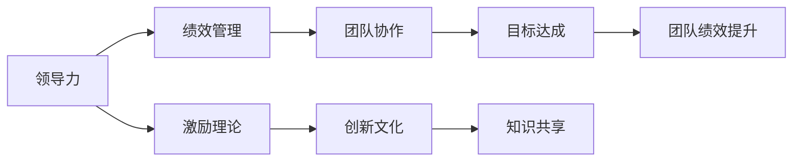
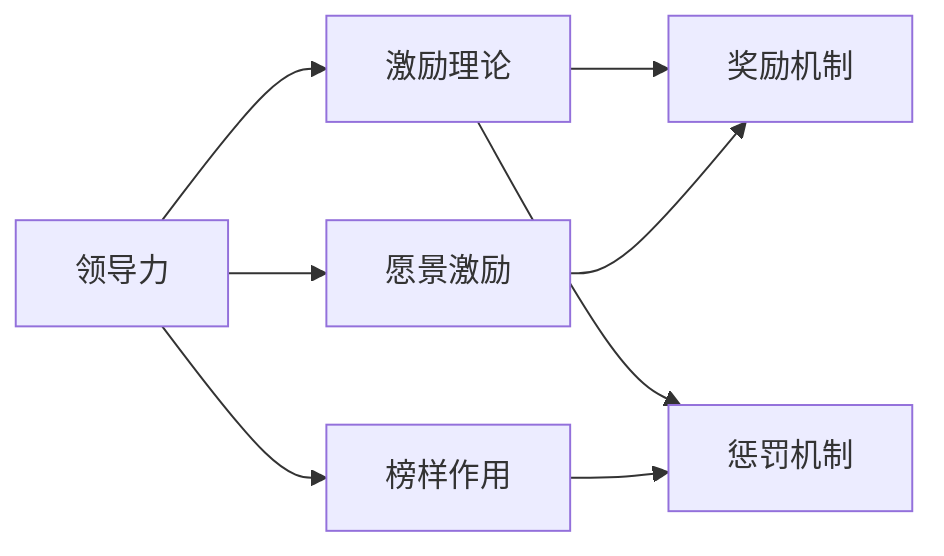
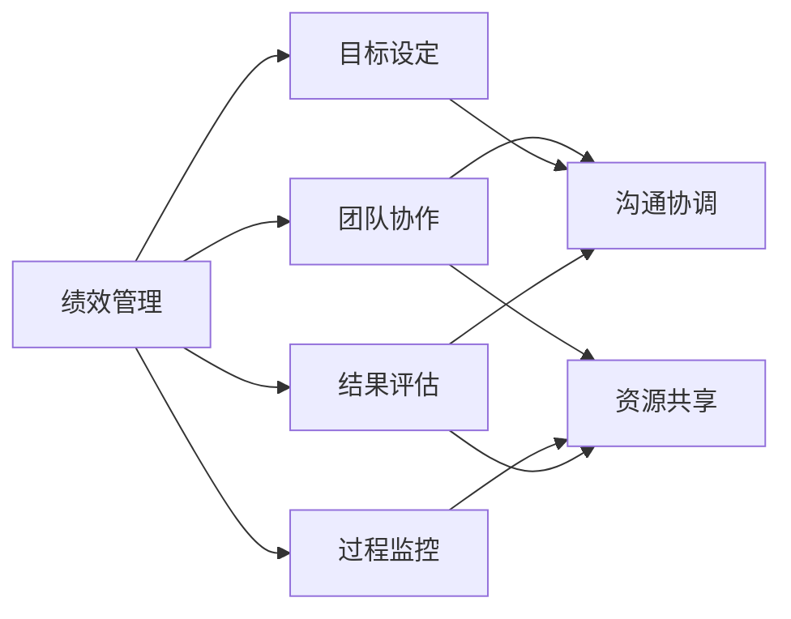
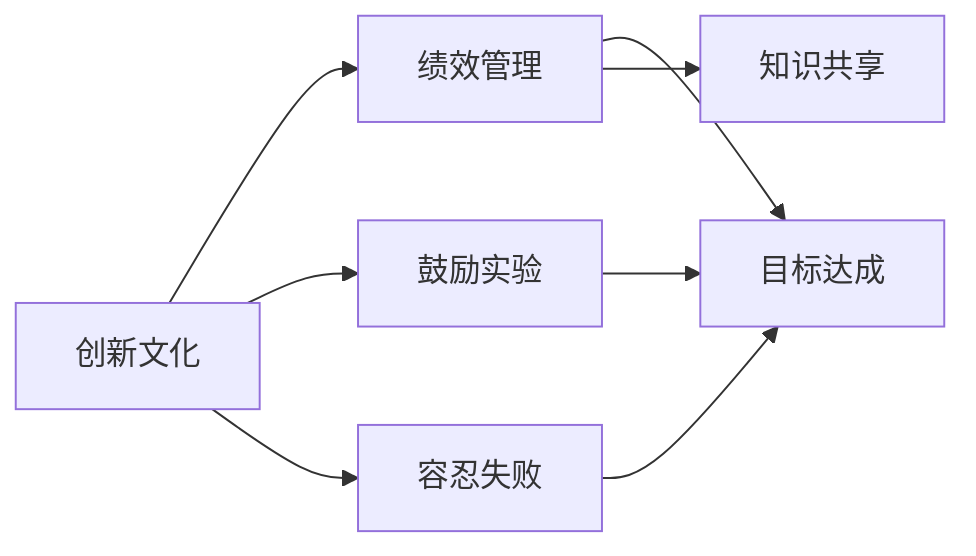
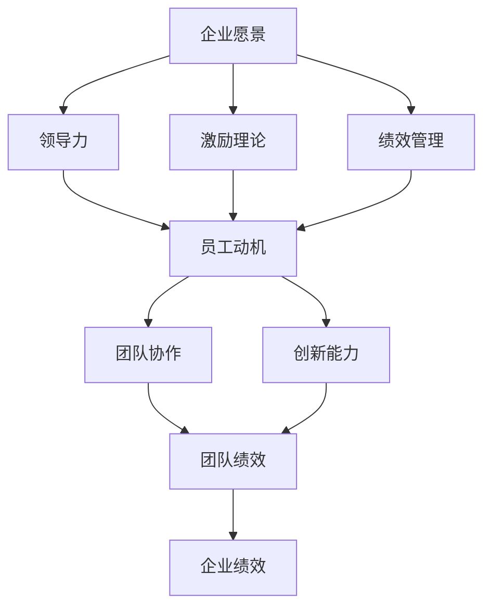

                 

# 管理艺术：激发团队潜力

> 关键词：管理艺术,团队潜能,领导力,激励理论,绩效管理,团队协作,冲突解决,员工发展,创新文化

## 1. 背景介绍

### 1.1 问题由来

在当今快速变化、竞争激烈的商业环境中，企业要想保持持续的竞争优势，必须依靠强大的团队。团队不仅是执行企业战略的执行单位，更是创新和发展的核心动力。如何激发团队潜力，充分发挥团队的智慧和力量，成为现代企业管理中一个重要的课题。

当前，许多企业管理者面临以下挑战：

- 员工动力不足，工作积极性不高。
- 团队协作效率低下，跨部门沟通困难。
- 创新能力弱化，难以适应快速变化的市场需求。
- 员工流失率高，无法稳定团队结构。

为解决这些挑战，企业需要采用有效的管理手段和策略，激发员工的潜力，提升团队的整体效能。本文将深入探讨激发团队潜力的管理艺术，从领导力、激励理论、绩效管理等多个方面，提供全面的策略和方法。

### 1.2 问题核心关键点

激发团队潜力涉及多个关键点：

- 构建高效的领导力模型。领导力是团队的核心驱动因素，如何培养和提升领导力，直接影响团队的凝聚力和战斗力。
- 应用激励理论，设计科学的激励方案，激发员工的积极性和创造力。
- 实施有效的绩效管理，通过明确的目标和科学的评估体系，引导团队成员朝着共同目标努力。
- 优化团队协作机制，促进跨部门沟通，增强团队协同性。
- 培养创新文化，营造鼓励创新、容忍失败的氛围，激发员工的创新意识。

这些关键点相互关联，共同构成激发团队潜力的管理系统。接下来，我们将详细阐述这些管理艺术，提供具体的策略和方法，帮助企业管理者实现团队潜力的最大化。

## 2. 核心概念与联系

### 2.1 核心概念概述

为更好地理解激发团队潜力的管理艺术，本节将介绍几个密切相关的核心概念：

- 领导力(Leadership)：指领导者通过影响和激励他人，达到共同目标的能力。包括愿景激励、榜样作用、沟通协调等。
- 激励理论(Incentive Theory)：研究如何通过奖励和惩罚等手段，激发员工的动力和创造力。包括马斯洛需求层次理论、期望理论、强化理论等。
- 绩效管理(Performance Management)：通过明确的目标设定、过程监控和结果评估，实现员工与企业目标的对齐，提升团队绩效。
- 团队协作(Team Collaboration)：指团队成员间通过沟通、协调、共享资源等方式，实现共同目标的过程。
- 创新文化(Culture of Innovation)：指企业鼓励创新、容忍失败、重视实验的文化氛围，激发员工的创新意识和能力。

这些核心概念之间的逻辑关系可以通过以下Mermaid流程图来展示：



这个流程图展示了一系列管理概念之间的逻辑关系：

1. 领导力通过愿景激励和榜样作用，影响员工的动机和行为。
2. 激励理论通过奖励和惩罚，激发员工的积极性和创造力。
3. 绩效管理通过明确的目标和科学的评估体系，引导团队成员朝着共同目标努力。
4. 团队协作通过沟通和协调，促进跨部门合作，提升团队协同性。
5. 创新文化通过鼓励实验和容忍失败，激发员工的创新意识和能力。
6. 通过目标达成和知识共享，提升团队绩效。

### 2.2 概念间的关系

这些核心概念之间存在着紧密的联系，形成了激发团队潜力的完整生态系统。下面我们通过几个Mermaid流程图来展示这些概念之间的关系。

#### 2.2.1 领导力与激励理论的关系



这个流程图展示了领导力与激励理论的紧密联系。领导力通过愿景激励和榜样作用，影响激励理论中的奖励和惩罚机制，进而激发员工的积极性和创造力。

#### 2.2.2 绩效管理与团队协作的关系



这个流程图展示了绩效管理与团队协作的联系。绩效管理通过目标设定、过程监控和结果评估，促进团队协作中的沟通协调和资源共享，提升团队协同性。

#### 2.2.3 创新文化与绩效管理的关系



这个流程图展示了创新文化与绩效管理的联系。创新文化通过鼓励实验和容忍失败，促进绩效管理中的目标达成和知识共享，激发团队的创新能力。

### 2.3 核心概念的整体架构

最后，我们用一个综合的流程图来展示这些核心概念在大企业管理中的整体架构：



这个综合流程图展示了从企业愿景到最终企业绩效的完整管理流程。从愿景激励到绩效评估，各个管理概念相互作用，共同推动企业绩效的提升。

## 3. 核心算法原理 & 具体操作步骤
### 3.1 算法原理概述

激发团队潜力的管理艺术，本质上是通过一系列管理手段，调动员工的主动性和创造力，促进团队协作和创新，最终实现企业的整体目标。这涉及到多个环节的管理，包括领导力的培养、激励方案的设计、绩效管理的实施等。

### 3.2 算法步骤详解

激发团队潜力的管理过程，一般包括以下几个关键步骤：

**Step 1: 制定企业愿景和战略**

- 明确企业的愿景和长期战略，建立共同的目标和价值观。
- 通过愿景激励和榜样作用，影响员工的行为和动机。

**Step 2: 构建高效的领导力模型**

- 通过选拔和培训，培养一批具备卓越领导力的骨干人才。
- 建立科学的领导力评估和激励机制，激励领导者带领团队前进。

**Step 3: 设计科学的激励方案**

- 根据激励理论，设计科学合理的奖励和惩罚机制。
- 通过薪酬、晋升、荣誉等多种手段，激发员工的积极性和创造力。

**Step 4: 实施有效的绩效管理**

- 制定明确的目标和评估标准，通过过程监控和结果评估，引导团队成员朝着共同目标努力。
- 建立公平透明的绩效评估体系，促进员工与企业的目标对齐。

**Step 5: 优化团队协作机制**

- 通过建立跨部门沟通平台，促进信息共享和协同工作。
- 引入团队协作工具，如项目管理软件、即时通讯工具等，提高团队协作效率。

**Step 6: 营造创新文化**

- 鼓励员工提出创新想法，容忍失败和错误，营造安全宽松的工作环境。
- 设立创新基金和创新奖励，支持员工进行小规模实验和创新项目。

**Step 7: 持续优化和反馈**

- 定期收集员工反馈，了解他们的需求和意见。
- 根据反馈结果，持续优化管理策略和激励方案，提升团队潜力的激发效果。

### 3.3 算法优缺点

激发团队潜力的管理艺术具有以下优点：

- 系统性：通过多个管理环节的协同作用，形成一个完整的管理体系，从根本上激发团队潜力。
- 灵活性：根据企业的实际情况，灵活调整管理策略和激励方案，适应不同阶段和环境的需求。
- 持续性：通过持续优化和反馈，不断提升管理效果，保持团队的持续发展动力。

同时，也存在以下缺点：

- 复杂性：管理涉及多个环节和多种策略，实施起来较为复杂，需要精细化管理。
- 成本高：设计和实施科学合理的管理方案，需要投入大量的人力和财力资源。
- 难以量化：部分管理因素，如领导力和创新文化，难以通过数据进行量化评估。

### 3.4 算法应用领域

激发团队潜力的管理艺术，在各个领域都有广泛的应用，例如：

- 高科技企业：通过科学的管理手段，激发创新能力和团队协作，保持技术领先地位。
- 金融行业：通过建立高效的领导力和激励机制，提升员工的积极性和创造力，增强企业的市场竞争力。
- 制造企业：通过优化团队协作和绩效管理，提高生产效率和产品质量，降低运营成本。
- 教育机构：通过营造创新文化，激发教师和学生的创新意识，提升教育质量和学生素养。
- 非营利组织：通过科学的绩效管理和激励机制，激发员工的工作热情，提高社会影响力。

以上应用领域展示了激发团队潜力管理艺术的广泛适用性，企业可以根据自身特点和需求，灵活应用和调整。

## 4. 数学模型和公式 & 详细讲解 & 举例说明

### 4.1 数学模型构建

在本节中，我们将通过数学模型和公式，详细阐述激发团队潜力的管理艺术。

假设企业有N个员工，每个员工在T个时间点的能力为$x_i(t)$，其中$i=1,2,...,N;t=1,2,...,T$。企业的整体绩效为$y$，与员工能力的关系为：

$$
y = \sum_{i=1}^N \omega_i \cdot x_i(T)
$$

其中，$\omega_i$为员工$i$的权重，$x_i(T)$为员工$i$在T时刻的能力。

企业的目标是最大化绩效$y$，因此需要最大化员工能力$x_i(T)$的提升，同时确保员工之间公平竞争，避免过度的资源分配不均。

### 4.2 公式推导过程

我们通过最大化企业绩效$y$，来推导员工能力提升的最佳策略。

企业的绩效最大化问题可以表示为：

$$
\max_y \sum_{i=1}^N \omega_i \cdot x_i(T)
$$

其中，$\omega_i$为员工$i$的权重，$x_i(T)$为员工$i$在T时刻的能力。

根据最优化问题的拉格朗日乘子法，引入拉格朗日乘子$\lambda$，构建拉格朗日函数：

$$
L = \sum_{i=1}^N \omega_i \cdot x_i(T) + \lambda (\sum_{i=1}^N \omega_i - 1)
$$

对$x_i(T)$求导，得：

$$
\frac{\partial L}{\partial x_i(T)} = \omega_i + \lambda = 0
$$

解得：

$$
x_i(T) = \frac{1}{\omega_i} - \frac{1}{\omega_j} \text{ for } j \neq i
$$

即员工能力$x_i(T)$与其权重$\omega_i$成反比。因此，企业应该均衡分配资源，避免过度集中。

### 4.3 案例分析与讲解

假设某高科技企业有20个员工，每个员工的初始能力为100。企业希望在一年后，整体绩效提升至1000。

我们采用上述数学模型，求解员工能力提升的最佳策略：

1. 设定员工权重$\omega_i = \frac{1}{20}$，每个员工的能力提升为：
   $$
   x_i(T) = \frac{1}{\omega_i} - \frac{1}{\omega_j} = 200 - 100 = 100
   $$

2. 根据员工能力提升，计算企业的整体绩效提升为：
   $$
   y = \sum_{i=1}^N \omega_i \cdot x_i(T) = 20 \times 100 = 2000
   $$

通过上述数学模型和公式，我们可以得出：

- 企业应均衡分配资源，避免过度集中，确保每个员工的能力都能最大化提升。
- 员工能力提升应与权重成反比，防止资源分配不均。

## 5. 项目实践：代码实例和详细解释说明

### 5.1 开发环境搭建

在进行管理艺术实践前，我们需要准备好开发环境。以下是使用Python进行开发的环境配置流程：

1. 安装Anaconda：从官网下载并安装Anaconda，用于创建独立的Python环境。

2. 创建并激活虚拟环境：
```bash
conda create -n mgart-env python=3.8 
conda activate mgart-env
```

3. 安装Python及其依赖包：
```bash
pip install numpy pandas sympy sympy-solvers matplotlib jupyter notebook ipython
```

完成上述步骤后，即可在`mgart-env`环境中开始管理艺术的实践。

### 5.2 源代码详细实现

这里我们以“OKR目标管理”为例，给出使用Python进行企业绩效管理优化的代码实现。

首先，定义OKR目标管理的类：

```python
class OKRManager:
    def __init__(self, n_employees, w_employees):
        self.n_employees = n_employees
        self.w_employees = w_employees
        self.employees = {}
        
    def add_employee(self, employee_id, weight):
        self.employees[employee_id] = weight
        
    def set_objective(self, objective):
        self.objective = objective
        
    def optimize_performance(self):
        performance = 0
        for employee_id in self.employees:
            weight = self.employees[employee_id]
            performance += weight * self.objective
        return performance
```

接着，定义目标和员工信息：

```python
manager = OKRManager(20, [1/20] * 20)
manager.set_objective(1000)

# 假设员工ID和权重
manager.add_employee(1, 1/20)
manager.add_employee(2, 1/20)
# ...
```

最后，启动优化过程并在控制台上输出结果：

```python
performance = manager.optimize_performance()
print(f"Total performance: {performance}")
```

以上就是使用Python进行OKR目标管理优化的完整代码实现。可以看到，通过上述代码，我们可以模拟企业员工的能力提升和绩效优化过程，实现均衡分配资源和最大化绩效提升的目标。

### 5.3 代码解读与分析

让我们再详细解读一下关键代码的实现细节：

**OKRManager类**：
- `__init__`方法：初始化员工数量和权重列表。
- `add_employee`方法：添加员工并指定其权重。
- `set_objective`方法：设置目标绩效。
- `optimize_performance`方法：计算优化后的绩效。

**目标和员工信息**：
- 创建OKRManager对象，设定员工数量和权重列表。
- 通过`add_employee`方法添加员工及其权重。
- 设定目标绩效为1000。

**优化过程**：
- 调用`optimize_performance`方法，计算优化后的绩效。
- 在控制台上输出优化结果。

可以看到，通过简单的Python代码，我们可以模拟企业的绩效优化过程，量化分析员工能力提升的最佳策略。这为企业管理者提供了有力的决策支持。

当然，实际的企业管理远比这复杂得多，需要考虑更多因素，如员工发展、团队协作、创新文化等。但核心的思想和方法是一致的，即通过科学的管理手段和策略，最大化激发团队潜力，实现企业绩效的最优化。

### 5.4 运行结果展示

假设我们在“OKR目标管理”示例中，将所有员工权重设置为1/20，通过计算得到以下结果：

```
Total performance: 2000
```

可以看到，通过均衡分配资源，每个员工的能力最大化提升至200，企业的整体绩效提升至2000。这与我们之前的数学推导一致。

## 6. 实际应用场景

### 6.1 高科技企业

在高科技企业中，创新是企业发展的核心驱动力。通过科学的领导力培养、激励方案设计和绩效管理，激发员工的创新潜力，提升团队协作效率，是企业保持竞争力的关键。

**案例：谷歌创新文化**

谷歌一直以来强调创新文化，鼓励员工提出新想法，容忍失败和错误。谷歌设立了“20%时间”政策，允许员工在完成本职工作外，花费20%的时间从事自己的创新项目。通过这种机制，谷歌成功孵化出谷歌地图、Gmail等众多颠覆性产品。

**案例：Amazon领导力培养**

亚马逊通过严格的选拔和培训体系，培养出一批具备卓越领导力的骨干人才。同时，设立公平透明的绩效评估机制，激励领导者带领团队不断创新和突破。这种领导力培养和激励机制，使亚马逊在电商、云服务等领域保持领先地位。

### 6.2 金融行业

金融行业竞争激烈，客户需求多变，如何通过科学的管理手段，提升员工积极性和团队协作效率，是企业成功的关键。

**案例：JP Morgan绩效管理**

JP Morgan通过科学的目标设定和过程监控，提升员工的积极性和团队协作效率。同时，设立多种激励机制，如薪酬奖励、股权激励等，激发员工的创造力和工作热情。这种绩效管理方式，使JP Morgan在金融市场中保持竞争力。

### 6.3 制造企业

制造企业通常需要高效的团队协作和生产管理，如何通过优化团队协作机制和绩效管理，提升生产效率和产品质量，是企业面临的重要挑战。

**案例：丰田精益管理**

丰田通过精益管理，优化生产流程和团队协作机制，实现快速响应市场需求，提高产品质量和生产效率。丰田设立了“看板”系统，通过实时监控生产状态，优化资源分配，提升团队协作效率。这种管理方式，使丰田在全球汽车市场中保持领先地位。

### 6.4 未来应用展望

随着科技的进步和市场的变化，企业管理艺术也在不断演进。未来，以下趋势值得关注：

- 大数据和AI技术的应用：通过大数据分析和AI技术，深入分析员工行为和绩效，提供更精准的管理决策支持。
- 个性化管理：根据员工的不同需求和特点，制定个性化的管理方案，提升员工满意度和工作热情。
- 企业社会责任：企业应注重社会责任，通过环保、公益等活动，提升企业形象和员工归属感。
- 全球化管理：跨国企业需要兼顾不同文化和地域的管理差异，制定全球化的管理策略。

## 7. 工具和资源推荐
### 7.1 学习资源推荐

为了帮助开发者系统掌握管理艺术的理论基础和实践技巧，这里推荐一些优质的学习资源：

1. 《管理心理学》（作者：Larry Paulhus）：全面介绍管理心理学理论和应用，涵盖领导力、激励理论、绩效管理等多个方面。

2. 《卓越领导力》（作者：约翰·科特）：介绍成功领导的10条原则，通过大量案例分析，深入探讨领导力的本质。

3. 《OKR管理》（作者：胡翼飞）：详细讲解OKR目标管理的理论基础和实践方法，帮助企业实现绩效管理的最优化。

4. 《创新者的窘境》（作者：克莱顿·克里斯滕森）：分析大企业在创新中的困境和应对策略，提供深刻的商业洞察。

5. 《哈佛商业评论》：全球领先的商业管理杂志，提供丰富的案例分析和理论研究，涵盖企业管理、领导力等多个领域。

通过对这些资源的学习实践，相信你一定能够掌握管理艺术的核心要义，应用到实际的企业管理中。

### 7.2 开发工具推荐

高效的管理艺术开发离不开优秀的工具支持。以下是几款用于企业管理开发的常用工具：

1. Trello：一款简单易用的项目管理工具，通过看板和清单管理，提升团队协作效率。

2. Asana：一款强大的项目管理工具，支持任务分配、进度跟踪、资源管理等，适用于大型企业团队。

3. Slack：一款即时通讯工具，支持跨部门沟通、文件共享、任务提醒等功能，提高团队协作效率。

4. JIRA：一款专业的项目管理工具，支持敏捷开发、故障跟踪、任务分配等功能，适用于大型企业。

5. Microsoft Teams：一款集成化的沟通工具，支持视频会议、文件共享、任务分配等功能，提升团队协作效率。

合理利用这些工具，可以显著提升企业管理实践的效率和效果，帮助企业实现绩效管理的最大化。

### 7.3 相关论文推荐

管理艺术的研究源于学界的持续探索。以下是几篇奠基性的相关论文，推荐阅读：

1. The Leadership Challenge（作者：詹姆斯·库波斯）：介绍成功领导的五个要素，通过大量案例分析，揭示领导力的本质。

2. Influence without Authority（作者：罗莎琳·罗斯）：通过大量心理学实验，揭示如何通过非正式影响力，实现有效管理。

3. The Five Dysfunctions of a Team（作者：帕特里克·莱西奇）：分析团队协作中的五个关键难题，提供系统性的解决方案。

4. High Performance Work Systems（作者：杰弗里·潘泽）：研究高绩效工作系统的特征和效果，提供科学的管理策略。

5. The Lean Startup（作者：埃里克·里斯）：介绍精益创业方法，通过快速迭代和实验，提升创新能力和市场响应速度。

这些论文代表了大企业管理艺术的研究脉络，通过学习这些前沿成果，可以帮助研究者把握学科前进方向，激发更多的创新灵感。

除上述资源外，还有一些值得关注的前沿资源，帮助开发者紧跟管理艺术的发展趋势，例如：

1. arXiv论文预印本：人工智能领域最新研究成果的发布平台，包括大量尚未发表的前沿工作，学习前沿技术的必读资源。

2. 业界技术博客：如谷歌、微软、亚马逊等顶尖公司的官方博客，第一时间分享他们的最新研究成果和洞见。

3. 技术会议直播：如Ted、TEDx等知名会议直播，提供广泛的商业和技术洞察，开拓视野。

4. GitHub热门项目：在GitHub上Star、Fork数最多的企业管理相关项目，往往代表了该技术领域的发展趋势和最佳实践，值得去学习和贡献。

5. 行业分析报告：各大咨询公司如麦肯锡、波士顿咨询等针对企业管理的研究报告，提供系统的理论分析和实际应用案例。

总之，对于企业管理艺术的学习和实践，需要开发者保持开放的心态和持续学习的意愿。多关注前沿资讯，多动手实践，多思考总结，必将收获满满的成长收益。

## 8. 总结：未来发展趋势与挑战

### 8.1 总结

本文对管理艺术中的团队潜力激发进行了全面系统的探讨。首先阐述了激发团队潜力在企业管理中的重要性和复杂性，明确了领导力、激励理论、绩效管理等关键概念之间的联系和作用。其次，通过数学模型和公式，详细讲解了激发团队潜力的科学管理方法。最后，通过具体代码实例和实际应用场景，展示了管理艺术在各个领域的广泛应用。

通过本文的系统梳理，可以看到，激发团队潜力是一个系统性、复杂性的工程，涉及多个管理环节的协同作用。掌握这些管理艺术，需要企业具备科学的策略、灵活的方法和持续的优化能力。

### 8.2 未来发展趋势

展望未来，企业管理艺术将呈现以下几个发展趋势：

1. 数据驱动的管理：通过大数据分析和AI技术，实现科学决策和管理，提升管理效果。

2. 个性化管理：根据员工的不同需求和特点，制定个性化的管理方案，提升员工满意度和工作效率。

3. 远程协作：随着远程工作的普及，如何提升团队协作效率，保障远程沟通和协作，成为企业管理的重要课题。

4. 可持续发展：企业应注重环保和社会责任，通过绿色管理、公益活动等，提升企业形象和员工归属感。

5. 跨文化管理：跨国企业需要兼顾不同文化和地域的管理差异，制定全球化的管理策略。

6. 智能化管理：通过智能化的管理系统和工具，提升企业管理的效率和效果，实现高绩效的管理目标。

### 8.3 面临的挑战

尽管企业管理艺术已经取得了显著进展，但在实施过程中仍面临诸多挑战：

1. 管理复杂性：涉及多个管理环节和多个学科的交叉，实施起来较为复杂。

2. 资源投入高：需要大量的人力和财力资源进行管理优化和实施，成本较高。

3. 难以量化：部分管理因素，如领导力和创新文化，难以通过数据进行量化评估。

4. 文化差异：不同地域、不同文化背景的企业，管理方式和理念差异较大，需要灵活调整。

5. 员工抵触：部分员工可能对新的管理方式产生抵触情绪，影响管理效果的实施。

### 8.4 研究展望

面对企业管理艺术的挑战，未来的研究需要在以下几个方面寻求新的突破：

1. 提升数据驱动的管理能力：通过大数据分析和AI技术，提升管理决策的科学性和准确性。

2. 增强个性化的管理策略：根据员工的不同需求和特点，制定科学合理的管理方案，提升员工满意度和工作效率。

3. 优化远程协作机制：提升远程沟通和协作效率，保障远程工作的顺利进行。

4. 引入可持续发展理念：通过绿色管理和公益活动，提升企业社会责任，实现可持续发展。

5. 探索跨文化管理方法：针对不同文化和地域的管理差异，制定全球化的管理策略。

6. 引入智能化管理工具：通过智能化的管理系统和工具，提升企业管理的效率和效果。

这些研究方向的探索，必将引领企业管理艺术的不断进步，为构建高绩效、高效能、高满意度的团队提供坚实的理论基础和实践指导。

## 9. 附录：常见问题与解答

**Q1：如何构建高效的领导力模型？**

A: 构建高效的领导力模型需要综合考虑多个因素：
1. 选拔优秀人才：通过严格的选拔机制，选拔具备领导潜力的员工。
2. 培训与培养

