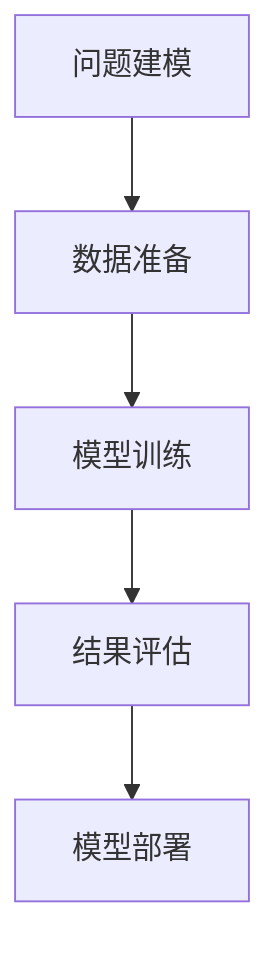
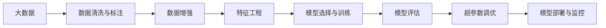

                 

## 1. 背景介绍

在当前信息爆炸和快速迭代的技术环境下，结构化思维（Structured Thinking）显得尤为重要。它不仅能帮助人们应对复杂问题，还能在处理数据、解决问题时保持清晰的思路。本文章将围绕结构化思维展开，从基本概念、算法原理到具体实践，一步步深入探讨如何通过结构化思维从混沌走向秩序。

### 1.1 问题由来

结构化思维起源于20世纪中叶，在项目管理、产品设计、软件工程等领域被广泛应用。然而，随着AI技术的迅猛发展，结构化思维在机器学习、深度学习等前沿领域中也显现出巨大价值。在大数据、深度学习等技术的加持下，我们面临着前所未有的数据量和复杂性挑战。如何从混沌中找到秩序，成为当前技术发展的核心议题。

### 1.2 问题核心关键点

结构化思维的核心在于利用明确的模型、算法和流程，将复杂问题分解成可处理的小问题，逐步解决。在机器学习和深度学习领域，结构化思维主要体现在以下几个方面：

- **问题建模**：将实际问题抽象成可计算的数学模型。
- **数据准备**：清洗、标注数据，为模型训练准备充分的输入。
- **模型训练**：选择合适的算法，训练模型并优化超参数。
- **结果评估**：通过评估指标，检验模型效果，优化模型。
- **模型部署**：将模型部署到实际应用场景中，进行生产环境测试。

结构化思维不仅帮助人们系统性地解决问题，还为模型训练和优化提供了清晰的路径，是当前AI技术实践的核心。

### 1.3 问题研究意义

结构化思维在大数据和深度学习中的应用，具有重要意义：

1. **提升模型效率**：结构化思维将复杂问题分解成小问题，有助于模型更高效地处理数据和特征。
2. **增强模型泛化能力**：结构化思维帮助模型从具体问题中抽象出一般性原理，提升模型在不同数据集和任务上的泛化能力。
3. **优化模型设计**：结构化思维为模型设计提供了明确的步骤和指南，有助于提高模型性能。
4. **降低工程成本**：结构化思维通过合理规划模型开发流程，减少项目延期和成本超支的风险。
5. **增强可解释性**：结构化思维使模型输出和推理过程更具可解释性，有助于提升模型的可信度和接受度。

## 2. 核心概念与联系

### 2.1 核心概念概述

为更好地理解结构化思维，本节将介绍几个密切相关的核心概念：

- **结构化思维**：利用明确的模型和流程，将复杂问题分解成可处理的子问题，逐步解决。
- **数据驱动**：以数据为中心，通过数据和模型来驱动决策。
- **模型训练**：选择适当的算法，利用数据训练模型，优化超参数。
- **结果评估**：通过预定义的指标，评估模型性能，并根据评估结果进行模型优化。
- **模型部署**：将训练好的模型部署到实际应用场景中，进行生产环境测试。

这些概念通过合理的衔接，构成了结构化思维的完整框架，为模型训练和优化提供了系统性的指导。

### 2.2 概念间的关系

这些核心概念之间的逻辑关系可以通过以下Mermaid流程图来展示：



这个流程图展示了从问题建模到模型部署的结构化思维流程：

1. 问题建模：将实际问题抽象成可计算的数学模型。
2. 数据准备：清洗、标注数据，为模型训练提供输入。
3. 模型训练：选择合适的算法，训练模型并优化超参数。
4. 结果评估：通过评估指标，检验模型效果，优化模型。
5. 模型部署：将模型部署到实际应用场景中，进行生产环境测试。

通过这些流程图，我们可以更清晰地理解结构化思维在模型训练和优化过程中的作用和步骤。

### 2.3 核心概念的整体架构

最后，我们用一个综合的流程图来展示这些核心概念在大数据和深度学习中的整体架构：



这个综合流程图展示了从数据准备到模型部署的全过程。

## 3. 核心算法原理 & 具体操作步骤

### 3.1 算法原理概述

结构化思维的核心算法原理在于将复杂问题分解成多个可处理的子问题，并通过系统的流程和工具来解决这些子问题。在大数据和深度学习中，这通常涉及以下几个步骤：

1. **问题建模**：将问题抽象成数学模型，选择合适的算法。
2. **数据准备**：清洗和标注数据，准备输入数据。
3. **模型训练**：选择合适的超参数，使用数据训练模型。
4. **结果评估**：通过评估指标，评估模型性能。
5. **模型优化**：根据评估结果，调整模型参数或优化算法。
6. **模型部署**：将训练好的模型部署到实际应用场景中，进行生产环境测试。

### 3.2 算法步骤详解

以下是结构化思维在大数据和深度学习中具体实现的步骤：

**Step 1: 问题建模**

问题建模是结构化思维的第一步。需要明确问题的目标和需求，选择合适的数学模型和算法。例如，针对图像分类任务，可以选择卷积神经网络（CNN）作为模型，使用交叉熵作为损失函数。

**Step 2: 数据准备**

数据准备涉及数据的清洗、标注和增强。具体步骤包括：

- 数据清洗：去除缺失值、噪声等不合适的数据点。
- 数据标注：手动标注或使用自动标注工具，为模型提供标签。
- 数据增强：通过旋转、缩放、裁剪等变换，扩充训练集，提高模型泛化能力。

**Step 3: 模型训练**

模型训练需要选择适当的算法和超参数，训练模型并优化。具体步骤如下：

- 选择合适的优化器（如SGD、Adam等）和损失函数。
- 设定学习率、批大小等超参数，进行模型训练。
- 定期在验证集上评估模型，调整超参数，防止过拟合。

**Step 4: 结果评估**

结果评估通过评估指标（如准确率、精确率、召回率等），检验模型性能。具体步骤如下：

- 在测试集上评估模型性能，计算评估指标。
- 比较不同模型或参数配置，选择最优模型。
- 分析模型性能，识别问题并改进。

**Step 5: 模型优化**

模型优化根据评估结果，调整模型参数或优化算法。具体步骤如下：

- 通过网格搜索、随机搜索等方法，寻找最优超参数。
- 通过数据增强、模型集成等方法，提高模型性能。
- 通过迁移学习、知识蒸馏等方法，提升模型泛化能力。

**Step 6: 模型部署**

模型部署将训练好的模型部署到实际应用场景中，进行生产环境测试。具体步骤如下：

- 选择适当的部署平台（如AWS、Google Cloud等）。
- 将模型导出为可部署的格式（如TensorFlow Serving、TorchScript等）。
- 进行性能测试和优化，确保模型在实际场景中稳定运行。

### 3.3 算法优缺点

结构化思维具有以下优点：

- **系统性**：通过系统化的流程，确保模型训练的完整性和高效性。
- **可解释性**：每一步都有明确的目标和指标，有助于理解模型训练过程和结果。
- **可重复性**：每个步骤都有详细的文档记录，便于后续的模型优化和改进。

同时，结构化思维也存在以下缺点：

- **复杂度高**：流程复杂，需要大量的时间和精力来规划和执行。
- **对数据要求高**：数据质量和标注工作是模型训练的前提，需要投入大量资源。
- **灵活性差**：流程一旦确定，难以灵活应对新问题和变化。

尽管有这些缺点，但结构化思维仍是当前大数据和深度学习中最重要的实践方法之一。

### 3.4 算法应用领域

结构化思维在以下几个领域得到了广泛应用：

- **自然语言处理**：如文本分类、情感分析、机器翻译等。
- **计算机视觉**：如图像分类、目标检测、图像分割等。
- **语音识别**：如自动语音识别、语音情感分析等。
- **推荐系统**：如协同过滤、基于内容的推荐等。
- **医疗健康**：如病历分析、疾病预测等。

## 4. 数学模型和公式 & 详细讲解 & 举例说明

### 4.1 数学模型构建

结构化思维的数学模型构建通常包括以下几个步骤：

1. **问题抽象**：将实际问题抽象成数学表达式，如将图像分类问题抽象成函数映射。
2. **目标函数**：定义优化目标函数，如交叉熵损失函数。
3. **约束条件**：设定模型约束条件，如权重限制、数据规模等。
4. **求解方法**：选择合适的求解方法，如梯度下降算法。

### 4.2 公式推导过程

以图像分类任务为例，通过结构化思维构建的数学模型如下：

$$
\min_{\theta} L(\theta) = \sum_{i=1}^N \log \frac{e^{y_i \cdot \theta^T x_i}}{\sum_{j=1}^K e^{y_j \cdot \theta^T x_i}}
$$

其中，$x_i$ 为输入图像，$y_i$ 为标签，$\theta$ 为模型参数，$K$ 为类别数。上式即为常用的交叉熵损失函数。

### 4.3 案例分析与讲解

在深度学习中，结构化思维通过具体案例进行应用：

**案例1: 图像分类**

针对图像分类任务，可以选择卷积神经网络（CNN）作为模型，使用交叉熵作为损失函数。在模型训练时，通过梯度下降算法优化模型参数，使模型在测试集上的准确率达到最优。

**案例2: 目标检测**

在目标检测任务中，可以通过Faster R-CNN、YOLO等模型框架实现。通过结构化思维，将问题分解成特征提取、候选框生成、目标分类等多个子问题，逐一解决，最终得到检测结果。

## 5. 项目实践：代码实例和详细解释说明

### 5.1 开发环境搭建

在进行结构化思维实践前，我们需要准备好开发环境。以下是使用Python进行PyTorch开发的环境配置流程：

1. 安装Anaconda：从官网下载并安装Anaconda，用于创建独立的Python环境。

2. 创建并激活虚拟环境：
```bash
conda create -n pytorch-env python=3.8 
conda activate pytorch-env
```

3. 安装PyTorch：根据CUDA版本，从官网获取对应的安装命令。例如：
```bash
conda install pytorch torchvision torchaudio cudatoolkit=11.1 -c pytorch -c conda-forge
```

4. 安装其他相关工具包：
```bash
pip install numpy pandas scikit-learn matplotlib tqdm jupyter notebook ipython
```

完成上述步骤后，即可在`pytorch-env`环境中开始结构化思维实践。

### 5.2 源代码详细实现

下面我们以图像分类任务为例，给出使用PyTorch进行结构化思维的代码实现。

首先，定义问题建模函数：

```python
import torch.nn as nn
import torch.optim as optim

class CNNModel(nn.Module):
    def __init__(self):
        super(CNNModel, self).__init__()
        self.conv1 = nn.Conv2d(3, 64, kernel_size=3, padding=1)
        self.conv2 = nn.Conv2d(64, 128, kernel_size=3, padding=1)
        self.pool = nn.MaxPool2d(kernel_size=2, stride=2)
        self.fc1 = nn.Linear(128 * 14 * 14, 512)
        self.fc2 = nn.Linear(512, 10)

    def forward(self, x):
        x = self.pool(F.relu(self.conv1(x)))
        x = self.pool(F.relu(self.conv2(x)))
        x = x.view(x.size(0), -1)
        x = F.relu(self.fc1(x))
        x = self.fc2(x)
        return x

model = CNNModel()

criterion = nn.CrossEntropyLoss()
optimizer = optim.SGD(model.parameters(), lr=0.01)
```

然后，定义数据准备函数：

```python
from torch.utils.data import Dataset, DataLoader
from torchvision import transforms

class ImageDataset(Dataset):
    def __init__(self, data_dir, transform=None):
        self.data_dir = data_dir
        self.transform = transform
        self.file_list = [os.path.join(self.data_dir, f) for f in os.listdir(self.data_dir)]
        self.file_list.sort()

    def __len__(self):
        return len(self.file_list)

    def __getitem__(self, idx):
        img_path = self.file_list[idx]
        img = Image.open(img_path)
        if self.transform is not None:
            img = self.transform(img)
        return img, torch.tensor(int(os.path.basename(img_path).split('.')[0]))

transform = transforms.Compose([
    transforms.Resize((224, 224)),
    transforms.ToTensor(),
    transforms.Normalize(mean=[0.485, 0.456, 0.406], std=[0.229, 0.224, 0.225])
])

train_dataset = ImageDataset(train_dir, transform=transform)
val_dataset = ImageDataset(val_dir, transform=transform)
test_dataset = ImageDataset(test_dir, transform=transform)
```

接着，定义模型训练函数：

```python
def train_epoch(model, dataset, batch_size, optimizer, criterion, device):
    dataloader = DataLoader(dataset, batch_size=batch_size, shuffle=True)
    model.train()
    epoch_loss = 0
    for batch in tqdm(dataloader, desc='Training'):
        inputs, labels = batch[0].to(device), batch[1].to(device)
        model.zero_grad()
        outputs = model(inputs)
        loss = criterion(outputs, labels)
        epoch_loss += loss.item()
        loss.backward()
        optimizer.step()
    return epoch_loss / len(dataloader)

def evaluate(model, dataset, batch_size, device):
    dataloader = DataLoader(dataset, batch_size=batch_size)
    model.eval()
    correct = 0
    total = 0
    with torch.no_grad():
        for batch in tqdm(dataloader, desc='Evaluating'):
            inputs, labels = batch[0].to(device), batch[1].to(device)
            outputs = model(inputs)
            _, predicted = torch.max(outputs.data, 1)
            total += labels.size(0)
            correct += (predicted == labels).sum().item()
    print('Accuracy: ', (correct / total) * 100, '%')
```

最后，启动训练流程并在测试集上评估：

```python
epochs = 10
batch_size = 64

device = torch.device('cuda' if torch.cuda.is_available() else 'cpu')

for epoch in range(epochs):
    loss = train_epoch(model, train_dataset, batch_size, optimizer, criterion, device)
    print(f'Epoch {epoch+1}, train loss: {loss:.3f}')
    
    print(f'Epoch {epoch+1}, dev accuracy: ')
    evaluate(model, val_dataset, batch_size, device)
    
print('Test accuracy: ')
evaluate(model, test_dataset, batch_size, device)
```

以上就是使用PyTorch进行结构化思维实践的完整代码实现。可以看到，结构化思维通过明确的模型定义、数据准备、模型训练、结果评估和模型部署步骤，使模型训练过程更加系统化、可重复，便于理解和优化。

### 5.3 代码解读与分析

让我们再详细解读一下关键代码的实现细节：

**CNNModel类**：
- `__init__`方法：定义卷积层、池化层和全连接层，并构建模型。
- `forward`方法：定义前向传播，将输入数据传递到模型中，输出预测结果。

**ImageDataset类**：
- `__init__`方法：定义数据集，包括数据路径、转换和文件列表。
- `__len__`方法：返回数据集大小。
- `__getitem__`方法：获取单个样本，并进行预处理。

**train_epoch函数**：
- 定义训练过程，包括前向传播、计算损失、反向传播和参数更新。
- 在每个epoch结束后，计算平均损失。

**evaluate函数**：
- 定义评估过程，包括前向传播、计算预测结果和精度。

**训练流程**：
- 定义总的epoch数和batch size，开始循环迭代。
- 每个epoch内，先在训练集上训练，输出平均损失。
- 在验证集上评估，输出准确率。
- 所有epoch结束后，在测试集上评估，给出最终测试结果。

## 6. 实际应用场景

### 6.1 智能推荐系统

结构化思维在智能推荐系统中的应用，可以帮助推荐引擎从混沌中找到秩序，提升推荐效果。具体步骤如下：

1. **问题建模**：将推荐问题抽象成用户兴趣与物品属性之间的映射问题。
2. **数据准备**：清洗用户行为数据，提取物品特征。
3. **模型训练**：选择合适的推荐算法，如协同过滤、基于内容的推荐等，训练模型。
4. **结果评估**：通过A/B测试、离线评估等方法，评估模型性能。
5. **模型优化**：根据评估结果，调整模型参数或优化算法。
6. **模型部署**：将训练好的模型部署到推荐系统中，进行实时推荐。

### 6.2 金融风控系统

在金融风控系统中，结构化思维可以帮助建立有效的风险评估模型。具体步骤如下：

1. **问题建模**：将风控问题抽象成客户特征与违约概率之间的关系。
2. **数据准备**：清洗客户数据，提取重要特征。
3. **模型训练**：选择合适的风控算法，如逻辑回归、决策树等，训练模型。
4. **结果评估**：通过ROC曲线、AUC等指标评估模型性能。
5. **模型优化**：根据评估结果，调整模型参数或优化算法。
6. **模型部署**：将训练好的模型部署到风控系统中，实时评估客户风险。

### 6.3 医疗健康系统

在医疗健康系统中，结构化思维可以帮助构建有效的诊断和治疗推荐系统。具体步骤如下：

1. **问题建模**：将诊断问题抽象成症状与疾病之间的关系。
2. **数据准备**：清洗病历数据，提取症状特征。
3. **模型训练**：选择合适的诊断算法，如逻辑回归、随机森林等，训练模型。
4. **结果评估**：通过准确率、召回率等指标评估模型性能。
5. **模型优化**：根据评估结果，调整模型参数或优化算法。
6. **模型部署**：将训练好的模型部署到医疗系统中，实时辅助诊断。

## 7. 工具和资源推荐

### 7.1 学习资源推荐

为了帮助开发者系统掌握结构化思维的理论基础和实践技巧，这里推荐一些优质的学习资源：

1. 《结构化思维：从混沌到秩序》系列博文：由结构化思维专家撰写，深入浅出地介绍了结构化思维的原理和实践方法。
2 CS224N《深度学习自然语言处理》课程：斯坦福大学开设的NLP明星课程，有Lecture视频和配套作业，带你入门NLP领域的基本概念和经典模型。
3 《机器学习实战》书籍：Wesley Chun所著，详细介绍了机器学习和深度学习的基本算法和实践技巧，适合初学者入门。
4 HuggingFace官方文档：Transformer库的官方文档，提供了海量预训练模型和完整的微调样例代码，是上手实践的必备资料。
5 《深度学习》书籍：Ian Goodfellow、Yoshua Bengio、Aaron Courville所著，全面介绍了深度学习的理论和实践，是结构化思维实践的重要参考。

通过对这些资源的学习实践，相信你一定能够快速掌握结构化思维的精髓，并用于解决实际的NLP问题。

### 7.2 开发工具推荐

高效的开发离不开优秀的工具支持。以下是几款用于结构化思维开发的常用工具：

1. PyTorch：基于Python的开源深度学习框架，灵活动态的计算图，适合快速迭代研究。大部分预训练语言模型都有PyTorch版本的实现。
2 TensorFlow：由Google主导开发的开源深度学习框架，生产部署方便，适合大规模工程应用。同样有丰富的预训练语言模型资源。
3 Weights & Biases：模型训练的实验跟踪工具，可以记录和可视化模型训练过程中的各项指标，方便对比和调优。与主流深度学习框架无缝集成。
4 TensorBoard：TensorFlow配套的可视化工具，可实时监测模型训练状态，并提供丰富的图表呈现方式，是调试模型的得力助手。
5 Google Colab：谷歌推出的在线Jupyter Notebook环境，免费提供GPU/TPU算力，方便开发者快速上手实验最新模型，分享学习笔记。

合理利用这些工具，可以显著提升结构化思维任务的开发效率，加快创新迭代的步伐。

### 7.3 相关论文推荐

结构化思维在大数据和深度学习中的应用，得到了学界的持续关注和研究。以下是几篇奠基性的相关论文，推荐阅读：

1 《Structured Learning with Deep Neural Networks》：Keskar等，系统介绍了结构化学习方法，包括问题建模、数据准备、模型训练和结果评估等步骤。
2 《Deep Learning》：Ian Goodfellow等，全面介绍了深度学习的理论和实践，特别是结构化思维在模型训练中的应用。
3 《A Survey on Deep Learning for Recommendation Systems》：Chen等，综述了深度学习在推荐系统中的应用，包括结构化思维在推荐算法中的具体实现。
4 《Structured Deep Learning: A Deep Dive into Online Learning, Feature Engineering, and Complexity Management》：Leyton-Brown等，探讨了结构化深度学习的复杂性管理，特别是模型训练和结果评估中的挑战和解决方案。

这些论文代表了大数据和深度学习中结构化思维的研究进展，通过学习这些前沿成果，可以帮助研究者把握学科前进方向，激发更多的创新灵感。

除上述资源外，还有一些值得关注的前沿资源，帮助开发者紧跟结构化思维技术的最新进展，例如：

1 arXiv论文预印本：人工智能领域最新研究成果的发布平台，包括大量尚未发表的前沿工作，学习前沿技术的必读资源。
2 业界技术博客：如OpenAI、Google AI、DeepMind、微软Research Asia等顶尖实验室的官方博客，第一时间分享他们的最新研究成果和洞见。
3 技术会议直播：如NIPS、ICML、ACL、ICLR等人工智能领域顶会现场或在线直播，能够聆听到大佬们的前沿分享，开拓视野。
4 GitHub热门项目：在GitHub上Star、Fork数最多的NLP相关项目，往往代表了该技术领域的发展趋势和最佳实践，值得去学习和贡献。
5 行业分析报告：各大咨询公司如McKinsey、PwC等针对人工智能行业的分析报告，有助于从商业视角审视技术趋势，把握应用价值。

总之，对于结构化思维的学习和实践，需要开发者保持开放的心态和持续学习的意愿。多关注前沿资讯，多动手实践，多思考总结，必将收获满满的成长收益。

## 8. 总结：未来发展趋势与挑战

### 8.1 总结

本文对结构化思维在数据科学和深度学习中的应用进行了全面系统的介绍。首先阐述了结构化思维的基本概念和应用背景，明确了其在模型训练和优化中的重要作用。其次，从原理到实践，详细讲解了结构化思维的数学模型和操作步骤，给出了结构化思维任务开发的完整代码实例。同时，本文还广泛探讨了结构化思维在智能推荐、金融风控、医疗健康等诸多领域的应用前景，展示了其巨大的潜力。此外，本文精选了结构化思维技术的各类学习资源，力求为读者提供全方位的技术指引。

通过本文的系统梳理，可以看到，结构化思维在大数据和深度学习中的应用，具有重要意义：

1. 提升模型效率：结构化思维将复杂问题分解成小问题，有助于模型更高效地处理数据和特征。
2. 增强模型泛化能力：结构化思维帮助模型从具体问题中抽象出一般性原理，提升模型在不同数据集和任务上的泛化能力。
3. 优化模型设计：结构化思维为模型设计提供了明确的步骤和指南，有助于提高模型性能。
4. 降低工程成本：结构化思维通过合理规划模型开发流程，减少项目延期和成本超支的风险。
5. 增强可解释性：结构化思维使模型输出和推理过程更具可解释性，有助于提升模型的可信度和接受度。

### 8.2 未来发展趋势

展望未来，结构化思维在数据科学和深度学习中的应用，将呈现以下几个发展趋势：

1. 模型规模持续增大：随着算力成本的下降和数据规模的扩张，模型参数量将持续增长。超大模型蕴含的丰富语言知识，有望支撑更加复杂多变的下游任务。
2. 数据驱动成为核心：结构化思维将更加依赖数据驱动，数据质量和标注工作成为模型训练的前提。
3. 自动化技术普及：自动化技术如自动化机器学习（AutoML）、自动化超参数调优等将逐步普及，提高模型训练的效率和准确性。
4. 融合多模态数据：结构化思维将更多地融合多模态数据，如文本、图像、音频等，提升模型的综合分析和推理能力。
5. 提升可解释性：结构化思维将更多地关注模型的可解释性，通过可视化、因果推断等手段，增强模型输出的解释能力。

###

