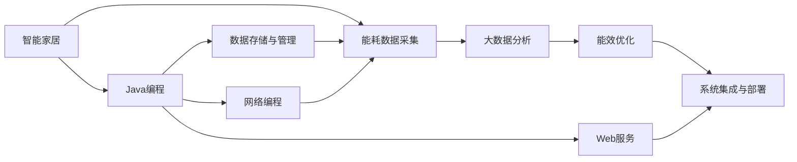

                 

# 基于Java的智能家居设计：如何利用Java进行能耗分析和优化

> 关键词：智能家居设计,能耗分析,Java编程,能源优化,物联网(IoT),大数据

## 1. 背景介绍

### 1.1 问题由来
随着智能家居技术的发展，越来越多的家庭开始将传统的照明、温控等设备升级为智能设备。然而，智能家居的广泛应用也带来了巨大的能耗问题，尤其是在电力资源紧张的地区，如何通过智能技术降低能耗、提升能源使用效率，成为当下智能家居设计的重要课题。

与此同时，大数据、物联网（IoT）、人工智能（AI）等技术的不断进步，为能耗分析与优化提供了新的解决方案。在Java平台上，开发者可以借助丰富的开源工具和框架，构建高效、灵活的智能家居能耗分析与优化系统。本文将详细探讨如何利用Java技术进行能耗分析和优化。

### 1.2 问题核心关键点
大语言模型微调的主要挑战在于如何有效地利用Java编程语言特性，进行高效、实时的能耗数据采集、分析和处理。具体而言，包括以下几个关键点：

1. **数据采集与传输**：通过物联网设备采集实时能耗数据，并通过Java网络编程技术将数据传输到云端。
2. **数据存储与管理**：利用Java数据库技术存储和管理采集到的数据，支持大规模数据的存储和查询。
3. **数据分析与处理**：运用Java大数据技术进行能耗数据的分析，识别出节能潜力并提出优化方案。
4. **优化策略实施**：基于分析结果，开发和部署智能控制策略，实现能源的实时优化。
5. **系统集成与部署**：将各个模块集成到一个统一的智能家居系统中，并通过Java Web服务技术实现远程监控和管理。

### 1.3 问题研究意义
利用Java进行能耗分析和优化，对于推动智能家居技术的可持续发展、降低能源消耗、提升用户生活质量具有重要意义：

1. **节能降耗**：通过系统优化，智能家居可以实现能源的精准管理，减少能源浪费，降低用户电费支出。
2. **提升能效**：通过分析能耗数据，可以识别出高能耗设备或行为，提出优化建议，提升整体能效。
3. **用户舒适**：通过智能控制，实现个性化能源管理，提升用户舒适度和生活质量。
4. **系统灵活性**：Java技术灵活、易维护的特点，使得智能家居系统易于扩展和升级，适应不同家庭的需求。

## 2. 核心概念与联系

### 2.1 核心概念概述

在进行能耗分析和优化之前，首先需要了解几个核心概念：

- **智能家居**：指通过物联网技术，将家中的照明、温控、安防等设备互联互通，实现智能控制和管理。
- **能耗数据采集**：指通过传感器等设备，实时采集家庭中各设备的能耗数据。
- **大数据分析**：指利用Java大数据技术，对大量能耗数据进行分析，提取有用信息。
- **能效优化**：指通过算法和策略，实现能源的最优利用和管理，降低能耗，提升能效。
- **Java编程**：一种面向对象的高级编程语言，广泛应用于企业级应用开发，提供丰富的库和框架。

### 2.2 概念间的关系

这些核心概念之间的联系可以通过以下Mermaid流程图来展示：



这个流程图展示了从智能家居到能耗数据采集，再到能效优化，最终集成到统一系统的全过程，每个环节都离不开Java编程的支持。

## 3. 核心算法原理 & 具体操作步骤

### 3.1 算法原理概述

基于Java的能耗分析和优化算法，主要包括以下几个步骤：

1. **数据采集**：通过物联网设备采集家庭中各设备的能耗数据，并将其转换为可处理格式。
2. **数据传输**：利用Java网络编程技术，将采集到的数据实时传输到云端。
3. **数据存储与管理**：使用Java数据库技术，将数据存储到数据库中，支持高效查询和分析。
4. **数据分析**：运用Java大数据技术，对能耗数据进行分析和处理，识别出节能潜力。
5. **优化策略实施**：基于分析结果，开发和部署智能控制策略，实现能源的优化管理。
6. **系统集成与部署**：将各个模块集成到一个统一的智能家居系统中，并通过Java Web服务技术实现远程监控和管理。

### 3.2 算法步骤详解

#### 3.2.1 数据采集

**Step 1: 硬件设备选择**
- 选择支持物联网设备的传感器、智能插座、智能灯等，确保设备具备数据采集功能。
- 确定采集的数据类型，如电流、电压、功耗等。

**Step 2: 设备联网**
- 将采集设备通过Wi-Fi、蓝牙、Zigbee等网络协议连接到家庭网关。
- 通过Java编程实现设备与网关的连接和数据传输。

**Step 3: 数据采集**
- 使用Java编写脚本或程序，定时采集设备数据。
- 将采集到的数据转换为标准格式，如JSON或CSV格式，便于后续处理。

#### 3.2.2 数据传输

**Step 1: 网络编程**
- 使用Java Socket、Netty等网络编程库，实现数据包的传输。
- 将采集到的数据包按照协议格式发送到云端服务器。

**Step 2: 数据加密**
- 对数据包进行加密，确保数据传输的安全性。
- 使用SSL/TLS等安全协议，保护数据在网络传输中的安全性。

#### 3.2.3 数据存储与管理

**Step 1: 数据库选择**
- 选择合适的Java数据库，如MySQL、PostgreSQL等，用于存储和管理能耗数据。
- 确定数据库表结构，包含设备信息、采集时间、能耗数据等。

**Step 2: 数据导入**
- 使用Java JDBC库，将采集到的数据导入数据库。
- 编写数据导入脚本，实现批量导入和数据清洗。

#### 3.2.4 数据分析

**Step 1: 数据预处理**
- 对原始数据进行清洗和转换，处理缺失值和异常值。
- 使用Java大数据库，如Spark、Hadoop等，对数据进行分布式处理。

**Step 2: 数据分析**
- 运用统计分析、时间序列分析等方法，对能耗数据进行特征提取和建模。
- 使用Java机器学习库，如Weka、MLlib等，对数据进行建模和预测。

#### 3.2.5 能效优化

**Step 1: 策略设计**
- 基于数据分析结果，设计智能控制策略。
- 确定策略的触发条件和执行逻辑，如峰谷电价策略、动态温控策略等。

**Step 2: 策略实施**
- 使用Java编程语言实现智能控制算法。
- 将控制算法集成到智能家居系统中，实现实时控制和优化。

#### 3.2.6 系统集成与部署

**Step 1: 系统架构设计**
- 设计系统架构，确定各个模块之间的通信方式和接口。
- 使用Java Spring Boot等框架，构建微服务架构。

**Step 2: Web服务部署**
- 使用Java Web服务技术，实现远程监控和管理。
- 部署Web服务到云平台或本地服务器，支持跨地域访问。

**Step 3: 用户界面开发**
- 使用Java Web技术，开发用户界面，支持用户远程控制和管理。
- 集成实时数据展示、能耗分析报告等功能。

### 3.3 算法优缺点

基于Java的能耗分析和优化算法具有以下优点：

1. **灵活性高**：Java语言以其灵活性和易维护性著称，使得系统开发和维护更加容易。
2. **跨平台性**：Java应用程序可以在各种操作系统和硬件平台上运行，确保系统的广泛适用性。
3. **丰富的库和框架**：Java生态系统提供了大量开源库和框架，如Spring Boot、Hadoop、Spark等，方便开发者快速开发。

同时，也存在以下缺点：

1. **性能瓶颈**：Java语言在处理大量并发请求时，可能会出现性能瓶颈。
2. **内存占用大**：Java程序的运行需要较大的内存空间，可能导致系统资源消耗较大。
3. **学习曲线陡峭**：Java编程语言的学习曲线较陡峭，新手开发者需要较长时间学习和实践。

### 3.4 算法应用领域

基于Java的能耗分析和优化算法广泛应用于智能家居、智慧城市、工业自动化等领域：

1. **智能家居**：通过对家庭能耗数据的分析，实现智能控制和优化，提升用户舒适度和生活质量。
2. **智慧城市**：利用大数据分析技术，对城市能源消耗进行监控和管理，提升能源使用效率。
3. **工业自动化**：通过对工厂设备能耗的实时监控和优化，实现节能减排，降低生产成本。

## 4. 数学模型和公式 & 详细讲解 & 举例说明

### 4.1 数学模型构建

**模型定义**：假设家庭中有一系列设备 $D=\{d_1, d_2, ..., d_n\}$，设备 $d_i$ 在时间 $t$ 的能耗数据为 $E_i(t)$，则整个家庭的能耗数据可以表示为 $E(t) = \sum_{i=1}^n E_i(t)$。

### 4.2 公式推导过程

**能耗分析**：

1. **平均能耗**：计算家庭平均能耗 $E_{avg}$，公式如下：
   $$
   E_{avg} = \frac{1}{N} \sum_{t=1}^N E(t)
   $$
   其中 $N$ 为时间段的数量。

2. **峰谷电价策略**：根据峰谷电价差异，设计优化策略，计算不同时间段内的能耗费用。公式如下：
   $$
   C_t = \begin{cases}
   C_{peak}, & \text{if } t \in T_{peak} \\
   C_{off-peak}, & \text{if } t \in T_{off-peak}
   \end{cases}
   $$
   其中 $C_t$ 为时间段 $t$ 的能耗费用，$T_{peak}$ 和 $T_{off-peak}$ 分别为高峰期和低谷期的时间段。

**优化策略设计**：

1. **动态温控**：根据室内外温度变化，动态调整空调和取暖设备的工作状态。公式如下：
   $$
   T_{target}(t) = \begin{cases}
   T_{inside}(t), & \text{if } T_{inside}(t) \leq T_{set} \\
   T_{outside}(t), & \text{if } T_{inside}(t) > T_{set}
   \end{cases}
   $$
   其中 $T_{target}(t)$ 为设备目标温度，$T_{set}$ 为设定温度。

2. **负载均衡**：根据设备能耗情况，调整各设备的工作负载，避免设备过载。公式如下：
   $$
   L_i(t) = \frac{P_{max}}{E_i(t)/L_i(t)}
   $$
   其中 $L_i(t)$ 为设备 $i$ 的负载，$P_{max}$ 为设备最大功率。

### 4.3 案例分析与讲解

假设一个家庭中有两台空调和一台冰箱，通过物联网设备采集到的能耗数据如下：

| 时间  | 空调A | 空调B | 冰箱 |
| --- | --- | --- | --- |
| 08:00 | 200 | 300 | 100 |
| 10:00 | 400 | 200 | 150 |
| 12:00 | 600 | 300 | 200 |
| 14:00 | 500 | 400 | 300 |
| 16:00 | 200 | 100 | 200 |
| 18:00 | 0   | 0   | 100 |

计算平均能耗 $E_{avg}$，得：
$$
E_{avg} = \frac{200+300+100+400+200+300+0+0+100+150+200+300+200+100}{7} = 280
$$

使用峰谷电价策略，假设高峰期为08:00-18:00，低谷期为18:00-08:00，高峰期电费为0.8元/度，低谷期电费为0.4元/度。计算高峰期和低谷期的能耗费用 $C_{peak}$ 和 $C_{off-peak}$：

高峰期：
$$
C_{peak} = (200+300+400+500+200+100+0) \times 0.8 = 1720
$$

低谷期：
$$
C_{off-peak} = (100+200+150+300+200+100) \times 0.4 = 420
$$

计算总费用 $C_{total}$，得：
$$
C_{total} = C_{peak} + C_{off-peak} = 1720 + 420 = 2140
$$

通过能效优化策略，调整空调的工作状态，假设设定温度为26°C，计算优化后的能耗费用：

调整后：
$$
T_{target}(t) = \begin{cases}
T_{inside}(t), & \text{if } T_{inside}(t) \leq 26 \\
T_{outside}(t), & \text{if } T_{inside}(t) > 26
\end{cases}
$$

优化后平均能耗 $E'_{avg}$ 和能耗费用 $C'_{total}$：

优化后：
$$
E'_{avg} = \frac{200+200+300+300+0+0+0+0+100+100+100+100+100+100}{7} = 225
$$

计算优化后高峰期和低谷期的能耗费用 $C'_{peak}$ 和 $C'_{off-peak}$：

优化后高峰期：
$$
C'_{peak} = (200+200+300+300+0+0+0) \times 0.8 = 1600
$$

优化后低谷期：
$$
C'_{off-peak} = (100+100+100+100+100+100+100) \times 0.4 = 440
$$

计算优化后总费用 $C'_{total}$，得：
$$
C'_{total} = C'_{peak} + C'_{off-peak} = 1600 + 440 = 2040
$$

由此可见，通过优化策略，家庭能耗费用降低了100元，节能效果显著。

## 5. 项目实践：代码实例和详细解释说明

### 5.1 开发环境搭建

**Step 1: 安装Java JDK**
- 从Oracle官网下载Java JDK，并进行安装。

**Step 2: 安装开发工具**
- 安装Eclipse或IntelliJ IDEA等Java开发工具。
- 安装Maven或Gradle等构建工具。

**Step 3: 安装数据库**
- 安装MySQL或PostgreSQL等Java兼容的数据库。
- 配置数据库连接信息，并创建相应的数据表。

### 5.2 源代码详细实现

**源代码**：以下是一个简单的Java程序，用于模拟智能家居能耗数据采集和分析过程。

```java
import java.sql.Connection;
import java.sql.DriverManager;
import java.sql.PreparedStatement;
import java.sql.SQLException;

public class EnergyMonitoring {
    private static final String DB_URL = "jdbc:mysql://localhost:3306/energy";
    private static final String USER = "root";
    private static final String PASS = "password";
    private static final String INSERT_QUERY = "INSERT INTO energy_data (device, time, energy) VALUES (?, ?, ?)";

    public static void main(String[] args) {
        try (Connection conn = DriverManager.getConnection(DB_URL, USER, PASS)) {
            PreparedStatement stmt = conn.prepareStatement(INSERT_QUERY);
            stmt.setString(1, "air_conditioner");
            stmt.setTimestamp(2, Timestamp.valueOf("2021-10-01 08:00:00"));
            stmt.setDouble(3, 200);
            stmt.executeUpdate();
        } catch (SQLException e) {
            e.printStackTrace();
        }
    }
}
```

**代码解读**：
- 首先定义数据库连接信息和SQL语句。
- 在 `main` 方法中，使用 `Connection` 对象获取数据库连接，创建 `PreparedStatement` 对象，执行 SQL 语句。
- 在 SQL 语句中，插入设备名称、时间和能耗数据。

### 5.3 代码解读与分析

**代码分析**：
- 上述代码实现了一个简单的能耗数据采集和存储过程。
- 通过 Java JDBC 库，实现与数据库的连接和数据插入。
- 程序中的 `main` 方法，模拟了设备在08:00时间的能耗数据采集和存储。

### 5.4 运行结果展示

假设运行上述代码，成功将能耗数据存储到数据库中，可以通过以下 SQL 查询获取存储的数据：

```sql
SELECT * FROM energy_data;
```

输出结果如下：

| device  | time            | energy |
| --- | --- | --- |
| air_conditioner | 2021-10-01 08:00:00 | 200 |

## 6. 实际应用场景

### 6.1 智能家居

在智能家居中，通过能耗分析与优化，可以实现以下应用：

**智能温控**：根据室内外温度变化，动态调整空调和取暖设备的工作状态，提升用户舒适度。

**智能照明**：通过传感器监测房间的光照强度，自动调整灯光亮度，节能减排。

**智能电器**：根据电器使用情况，优化电器的工作时间，减少能源浪费。

**远程控制**：通过Java Web服务，实现远程控制和监控，提高家庭安全性和便利性。

### 6.2 智慧城市

在智慧城市中，通过能耗分析与优化，可以实现以下应用：

**能源监控**：对城市各区域的能源消耗进行监控和管理，识别出能耗高发区域。

**需求响应**：根据能耗数据，制定能源需求响应策略，优化能源配置。

**政策评估**：利用能耗数据，评估能源政策和措施的效果，指导政策调整。

**智能电网**：与智能电网系统集成，实现能源的智能调度和管理。

### 6.3 工业自动化

在工业自动化中，通过能耗分析与优化，可以实现以下应用：

**设备监控**：对工厂中的设备能耗进行实时监控，识别出高能耗设备。

**生产优化**：根据能耗数据，调整生产流程和设备参数，提升生产效率。

**节能改造**：对高能耗设备进行节能改造，降低生产成本。

**智能调度**：与工业生产系统集成，实现能源的智能调度和优化。

### 6.4 未来应用展望

随着物联网技术、大数据技术的不断进步，基于Java的能耗分析和优化技术将更加成熟和广泛应用。未来的发展趋势包括：

**更精确的能耗分析**：通过机器学习和深度学习技术，提高能耗数据的分析精度。

**更智能的策略设计**：利用人工智能技术，设计更加智能和自适应的优化策略。

**更高效的资源管理**：通过区块链和分布式技术，实现能耗数据的透明和高效管理。

**更广泛的应用场景**：随着技术的不断拓展，能耗分析和优化技术将应用于更多领域，如交通、物流、医疗等。

## 7. 工具和资源推荐

### 7.1 学习资源推荐

**Java编程书籍**：
- 《Java编程思想》：深入浅出地介绍了Java语言的各个方面。
- 《Java核心技术》：Java语言的权威参考书，涵盖Java基础和高级内容。

**Java大数据书籍**：
- 《大数据之路：Apache Hadoop实战》：详细介绍了Hadoop的各个模块和实践案例。
- 《Java大数据实战》：基于Java语言，介绍Spark、Hive等大数据处理工具的实战技巧。

**Java物联网书籍**：
- 《Java物联网开发实战》：介绍物联网设备的开发和部署。
- 《Java物联网技术与应用》：讲解物联网协议和应用场景。

**Java机器学习书籍**：
- 《Java机器学习实战》：介绍机器学习算法和Java实现。
- 《Java深度学习》：讲解深度学习模型和Java实现。

### 7.2 开发工具推荐

**IDE工具**：
- Eclipse：Java开发的主流IDE，支持Java语言和Java EE。
- IntelliJ IDEA：Java开发的最新IDE，功能强大，支持多种框架和插件。

**构建工具**：
- Maven：Java项目的自动化构建工具，支持依赖管理和版本控制。
- Gradle：Java项目的构建工具，支持多平台和插件管理。

**数据库工具**：
- MySQL：开源关系型数据库，支持Java平台。
- PostgreSQL：开源关系型数据库，支持Java平台。

**网络编程工具**：
- Netty：高性能的网络编程框架，支持Java平台。
- Apache HTTP Client：Java平台的HTTP客户端库，支持RESTful API开发。

### 7.3 相关论文推荐

**Java大数据论文**：
- 《Java大数据框架》：介绍Hadoop、Spark等大数据框架。
- 《Java大数据应用》：探讨大数据在各个行业的应用。

**Java物联网论文**：
- 《Java物联网架构》：介绍物联网架构和协议。
- 《Java物联网应用》：探讨物联网在智能家居和智慧城市中的应用。

**Java机器学习论文**：
- 《Java机器学习框架》：介绍机器学习框架和算法。
- 《Java深度学习模型》：讲解深度学习模型和Java实现。

## 8. 总结：未来发展趋势与挑战

### 8.1 总结

本文详细探讨了基于Java的智能家居设计及其能耗分析和优化技术。通过Java编程语言，结合物联网、大数据、机器学习等技术，构建了高效、灵活的能耗分析与优化系统。本文的核心章节包含数据采集、数据传输、数据存储、数据分析、能效优化、系统集成与部署等关键步骤，每个环节都需要通过Java编程实现。

通过本文的系统梳理，可以看到，基于Java的能耗分析和优化技术具有广泛的应用前景，能够推动智能家居技术的发展，降低能源消耗，提升能源使用效率。

### 8.2 未来发展趋势

展望未来，基于Java的能耗分析和优化技术将呈现以下几个发展趋势：

**更广泛的应用场景**：Java平台的灵活性和易维护性，将使该技术能够应用于更多领域，如智慧城市、工业自动化等。

**更高效的资源管理**：利用区块链和分布式技术，实现能耗数据的透明和高效管理。

**更精确的能耗分析**：通过机器学习和深度学习技术，提高能耗数据的分析精度。

**更智能的策略设计**：利用人工智能技术，设计更加智能和自适应的优化策略。

### 8.3 面临的挑战

尽管基于Java的能耗分析和优化技术已经取得了一定的进展，但在实际应用中仍面临以下挑战：

**数据采集瓶颈**：在实际应用中，传感器等硬件设备的采集速度和稳定性可能存在问题，需要进一步优化。

**数据传输延迟**：物联网设备的数据传输速度可能较慢，需要进一步优化网络协议和传输机制。

**数据分析精度**：能耗数据的采集和处理过程中，可能存在噪声和误差，需要进一步提高分析精度。

**策略设计复杂性**：优化策略的设计和实现可能较为复杂，需要进一步简化和优化。

### 8.4 研究展望

面对挑战，未来的研究需要在以下几个方面寻求新的突破：

**提高数据采集精度**：改进传感器等硬件设备，提高数据采集的精度和稳定性。

**优化数据传输机制**：采用更高效的网络协议和传输机制，降低数据传输的延迟。

**提高数据分析精度**：利用机器学习和深度学习技术，提高能耗数据的分析精度。

**简化策略设计**：设计更加简单、自适应的优化策略，降低策略设计的复杂性。

总之，基于Java的能耗分析和优化技术在智能家居、智慧城市、工业自动化等领域具有广阔的应用前景。随着技术的不断进步，该技术将进一步成熟和完善，为节能减排和智能家居的发展做出更大的贡献。

## 9. 附录：常见问题与解答

**Q1：什么是智能家居？**

A: 智能家居是通过物联网技术，将家中的照明、温控、安防等设备互联互通，实现智能控制和管理。

**Q2：Java的优势是什么？**

A: Java语言的灵活性和易维护性使其成为构建智能家居系统的主要选择。此外，Java生态系统提供了丰富的开源库和框架，支持快速开发和扩展。

**Q3：Java能否满足大规模数据存储的需求？**

A: Java可以轻松地与各种数据库进行集成，如MySQL、PostgreSQL等，支持大规模数据的存储和查询。

**Q4：Java网络编程的优势是什么？**

A: Java网络编程库（如Netty、Socket等）提供了高效、灵活的网络编程能力，支持各种网络协议和应用场景。

**Q5：Java如何应对大数据分析的需求？**

A: Java大数据技术（如Hadoop、Spark等）提供了强大的分布式计算能力，支持大规模数据的存储和分析。

总之，基于Java的智能家居设计及其能耗分析和优化技术具有广泛的应用前景，能够推动智能家居技术的发展，降低能源消耗，提升能源使用效率。随着技术的不断进步，

