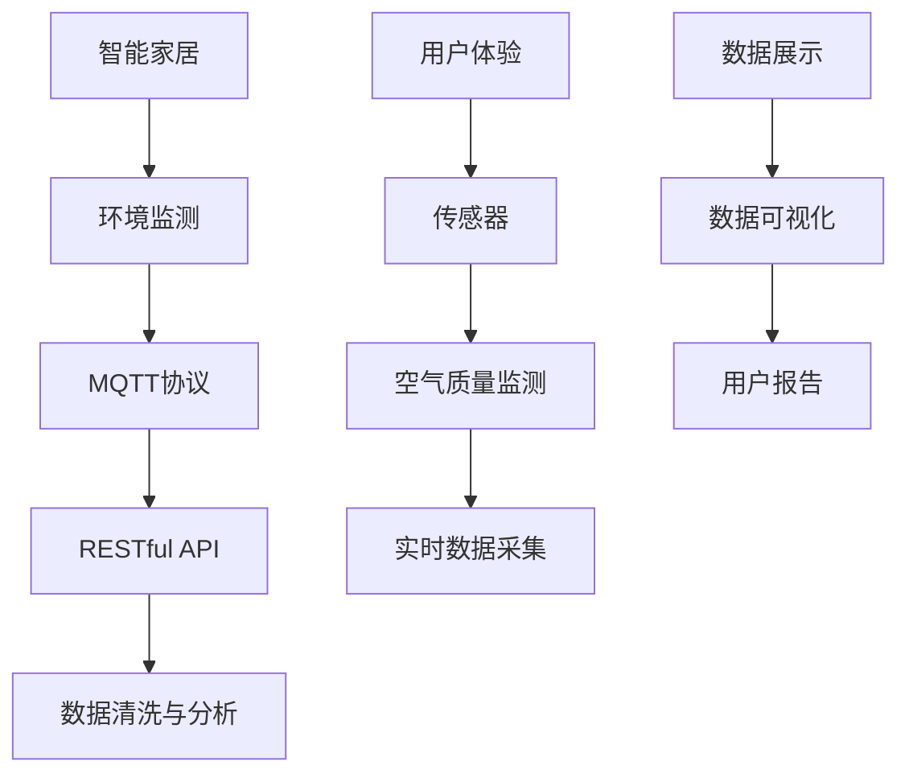

                 

# 基于MQTT协议和RESTful API的智能家居空气质量分析系统

## 1. 背景介绍

随着物联网技术的飞速发展，智能家居已经从概念走向了实际应用，成为现代家庭生活不可或缺的一部分。然而，目前智能家居系统大多关注于控制家电、监测环境参数，如温度、湿度、光线等。而对于室内空气质量（IAQ）这一关键因素，虽然部分设备开始集成空气质量传感器，但由于缺乏统一的协议和标准，数据管理、分析、展示仍存在不少问题。

本项目旨在构建一套基于MQTT协议和RESTful API的智能家居空气质量分析系统，以集成多种空气质量传感器，提供实时、可靠、易用的空气质量监测和分析服务。该系统能够有效地收集室内空气质量数据，并结合用户需求，对数据进行高效处理和分析，最终提供智能化、个性化的空气质量报告和改善建议。

## 2. 核心概念与联系

### 2.1 核心概念概述

为更好地理解系统的整体架构和运作机制，本节将介绍几个关键概念：

- MQTT协议（Message Queuing Telemetry Transport）：一种轻量级、高效率的消息队列传输协议，适用于物联网设备间的数据通信。
- RESTful API（Representational State Transfer API）：一种设计风格，采用HTTP请求的方式，提供客户端与服务器之间的接口交互。
- 智能家居：通过物联网技术，实现对家庭环境的全面智能化管理，包括家电控制、环境监测等。
- 空气质量监测：通过传感器实时收集室内空气中的颗粒物、二氧化碳、甲醛等有害成分浓度数据，监测室内空气质量。
- 数据清洗与分析：对传感器采集的数据进行清洗、筛选、转换，并结合统计学、机器学习等方法进行数据分析。
- 用户体验（User Experience, UX）：设计系统交互流程、界面展示，提升用户的使用体验和满意度。

这些概念之间存在紧密的联系，共同构成了智能家居空气质量分析系统的核心。

### 2.2 概念间的关系

这些核心概念之间的关系可以通过以下Mermaid流程图来展示：



这个流程图展示了智能家居系统中各组件之间的数据流动：

1. 智能家居通过传感器采集室内空气质量数据。
2. MQTT协议负责设备间的数据传输，确保数据的高效、可靠。
3. RESTful API提供接口服务，供用户通过客户端访问系统功能。
4. 数据清洗与分析对传感器采集的数据进行处理和分析，生成有用的信息。
5. 用户体验通过界面设计，提升用户的使用体验和满意度。
6. 数据展示和可视化将分析结果直观展示给用户，帮助其理解和使用。

## 3. 核心算法原理 & 具体操作步骤

### 3.1 算法原理概述

基于MQTT协议和RESTful API的智能家居空气质量分析系统，核心算法主要涉及以下几个方面：

- 数据采集与传输：通过MQTT协议，传感器与智能家居系统进行数据通信。
- 数据清洗与预处理：对传感器数据进行清洗、筛选、转换，去除异常值，确保数据质量。
- 数据分析与建模：结合统计学、机器学习等方法，对清洗后的数据进行分析建模，提取有用的信息。
- 数据展示与可视化：将分析结果以图表、报告等形式展示给用户，便于理解和应用。

这些算法模块通过RESTful API协同工作，形成完整的智能家居空气质量分析系统。

### 3.2 算法步骤详解

#### 3.2.1 数据采集与传输

- 配置MQTT服务器：安装MQTT消息代理软件，如Eclipse Paho，部署MQTT服务器。
- 配置传感器：连接空气质量传感器，确保传感器与MQTT服务器之间能够正常通信。
- 数据订阅与发布：将传感器配置为MQTT客户端，订阅主题，并发布数据。

#### 3.2.2 数据清洗与预处理

- 数据清洗：对传感器数据进行去重、去噪、处理缺失值等操作。
- 数据转换：将传感器原始数据转换为标准化的数值类型，如PM2.5、CO2等。
- 异常值检测：使用统计学方法（如标准差、箱线图）检测并处理异常值。

#### 3.2.3 数据分析与建模

- 统计分析：计算数据均值、方差、最大值、最小值等统计量。
- 时间序列分析：对时间序列数据进行滑动平均、指数平滑等处理。
- 机器学习：采用回归、分类等算法，对数据进行建模分析，预测未来空气质量变化趋势。

#### 3.2.4 数据展示与可视化

- 数据可视化：使用图表、仪表盘等工具，展示数据变化趋势、统计结果等。
- 用户报告：根据分析结果，生成个性化的空气质量报告，提供改善建议。

### 3.3 算法优缺点

#### 3.3.1 优点

- 轻量高效：MQTT协议轻量级，传输效率高，适用于低功耗物联网设备。
- 易用性高：RESTful API标准，易于与各类客户端集成，支持跨平台访问。
- 数据灵活：通过灵活的数据清洗和分析算法，可适应不同传感器数据格式和精度。

#### 3.3.2 缺点

- 实时性要求高：系统需要实时处理和展示数据，对MQTT消息处理速度有较高要求。
- 安全性和隐私问题：传感器数据传输需要安全保障，防止数据泄露和篡改。
- 系统复杂度：系统涉及多种算法和协议，开发和维护复杂度较高。

### 3.4 算法应用领域

基于MQTT协议和RESTful API的智能家居空气质量分析系统，主要应用于以下领域：

- 智能家居：提供室内空气质量监测和分析服务，提升家居生活品质。
- 环境监测：用于工厂、学校等室内环境监测，保障人员健康和安全。
- 健康管理：结合空气质量数据和用户健康信息，提供个性化健康建议。
- 智能办公：在办公环境中集成空气质量监测，提高工作效率和舒适度。

## 4. 数学模型和公式 & 详细讲解 & 举例说明

### 4.1 数学模型构建

#### 4.1.1 数据采集与传输

MQTT协议采用消息发布-订阅（Publish-Subscribe）模式，定义三个关键概念：

- 消息（Message）：数据传输的基本单位，包含主题（Topic）、消息体（Payload）和QoS（Quality of Service）。
- 主题（Topic）：MQTT消息的标识符，用于分类。
- QoS（Quality of Service）：定义消息传输的可靠性，分为0、1、2三个等级。

#### 4.1.2 数据清洗与预处理

数据清洗与预处理主要涉及以下几个步骤：

- 去重：去除传感器发送的重复数据，确保数据唯一性。
- 去噪：通过滤波等方法，去除传感器数据中的噪声。
- 处理缺失值：采用插值等方法，处理传感器数据中的缺失值。

#### 4.1.3 数据分析与建模

统计学方法在数据分析中常用于描述数据分布和趋势。例如，均值、方差、标准差等描述数据中心位置和离散程度。时间序列分析则用于处理具有时间维度的数据，如滑动平均、指数平滑等方法。

#### 4.1.4 数据展示与可视化

数据展示与可视化常用工具包括D3.js、ECharts等，支持各种类型的图表展示，如折线图、柱状图、饼图等。用户报告则结合机器学习分析结果，提供个性化建议。

### 4.2 公式推导过程

#### 4.2.1 数据采集与传输

MQTT协议中，主题（Topic）和QoS的定义如下：

- 主题（Topic）：`sensor/data`，表示传感器数据的主题。
- QoS：`0`，表示最不可靠、最低延迟的传输方式。

#### 4.2.2 数据清洗与预处理

- 去重：
$$
\text{unique_data} = \text{data} - \text{unique_data}
$$
- 去噪：
$$
\text{clean_data} = \text{filter}(\text{noisy_data}, \text{filter_type})
$$
- 处理缺失值：
$$
\text{complete_data} = \text{interpolate}(\text{incomplete_data})
$$

#### 4.2.3 数据分析与建模

统计分析中，均值和方差计算公式如下：

- 均值：
$$
\mu = \frac{\sum x_i}{n}
$$
- 方差：
$$
\sigma^2 = \frac{\sum (x_i - \mu)^2}{n}
$$

时间序列分析中，滑动平均公式如下：

- 滑动平均：
$$
\text{smoothing}_t = \frac{\sum x_{t-k} + \cdots + x_{t}}{k}
$$

### 4.3 案例分析与讲解

假设某室内空气质量监测系统中，传感器每隔10分钟发送一次PM2.5浓度数据。使用上述公式和方法，对采集的数据进行清洗、分析和展示。

首先，通过MQTT协议将传感器数据上传到云端，使用Python编写代码：

```python
import paho.mqtt.client as mqtt

client = mqtt.Client()
client.on_connect = on_connect
client.on_message = on_message

def on_connect(client, userdata, flags, rc):
    print("Connected to MQTT broker")

def on_message(client, userdata, msg):
    data = msg.payload.decode()
    print(f"Received data: {data}")

client.connect("mqtt.example.com", 1883, 60)
client.loop_forever()
```

其次，对数据进行清洗和预处理，如去重、去噪、处理缺失值等操作。假设原始数据为：

| 时间       | PM2.5浓度 |
|------------|----------|
| 2023-01-01 00:00:00 | 50 |
| 2023-01-01 00:10:00 | 40 |
| 2023-01-01 00:20:00 | 40 |
| 2023-01-01 00:30:00 | 30 |
| 2023-01-01 00:40:00 | 60 |
| 2023-01-01 00:50:00 | 70 |

使用Python编写代码进行清洗和处理：

```python
import pandas as pd

# 读取数据
data = pd.read_csv('sensor_data.csv', parse_dates=['time'], index_col='time')

# 去重
data = data.drop_duplicates()

# 去噪
data['clean_data'] = data['raw_data'].apply(lambda x: smoothing(x, filter_type='median'))

# 处理缺失值
data = data.fillna(method='ffill')
```

最后，对清洗后的数据进行统计分析和可视化展示。使用Python编写代码：

```python
import matplotlib.pyplot as plt

# 计算均值和方差
mean = data['clean_data'].mean()
std = data['clean_data'].std()

# 绘制折线图
plt.plot(data.index, data['clean_data'], label='Raw Data')
plt.plot(data.index, mean, linestyle='--', label='Mean')
plt.plot(data.index, mean + std, linestyle=':', label='Mean + std')
plt.plot(data.index, mean - std, linestyle=':', label='Mean - std')
plt.legend()
plt.show()
```

## 5. 项目实践：代码实例和详细解释说明

### 5.1 开发环境搭建

#### 5.1.1 安装依赖

```bash
pip install paho-mqtt
pip install pandas
pip install matplotlib
```

#### 5.1.2 配置MQTT客户端

创建MQTT客户端脚本，实现数据订阅和上传：

```python
import paho.mqtt.client as mqtt

client = mqtt.Client()
client.on_connect = on_connect
client.on_message = on_message

def on_connect(client, userdata, flags, rc):
    print("Connected to MQTT broker")

def on_message(client, userdata, msg):
    data = msg.payload.decode()
    print(f"Received data: {data}")

client.connect("mqtt.example.com", 1883, 60)
client.loop_forever()
```

### 5.2 源代码详细实现

#### 5.2.1 数据采集与传输

MQTT服务器配置脚本，实现传感器的连接和数据订阅：

```python
import paho.mqtt.client as mqtt

client = mqtt.Client()
client.on_connect = on_connect
client.on_message = on_message

def on_connect(client, userdata, flags, rc):
    print("Connected to MQTT broker")

def on_message(client, userdata, msg):
    data = msg.payload.decode()
    print(f"Received data: {data}")

client.connect("mqtt.example.com", 1883, 60)
client.loop_forever()
```

#### 5.2.2 数据清洗与预处理

数据清洗与预处理脚本，实现数据去重、去噪和缺失值处理：

```python
import pandas as pd
import numpy as np

# 读取数据
data = pd.read_csv('sensor_data.csv', parse_dates=['time'], index_col='time')

# 去重
data = data.drop_duplicates()

# 去噪
data['clean_data'] = data['raw_data'].apply(lambda x: np.median(x))

# 处理缺失值
data = data.fillna(method='ffill')
```

#### 5.2.3 数据分析与建模

数据分析与建模脚本，实现数据统计和可视化：

```python
import matplotlib.pyplot as plt

# 计算均值和方差
mean = data['clean_data'].mean()
std = data['clean_data'].std()

# 绘制折线图
plt.plot(data.index, data['clean_data'], label='Raw Data')
plt.plot(data.index, mean, linestyle='--', label='Mean')
plt.plot(data.index, mean + std, linestyle=':', label='Mean + std')
plt.plot(data.index, mean - std, linestyle=':', label='Mean - std')
plt.legend()
plt.show()
```

### 5.3 代码解读与分析

#### 5.3.1 数据采集与传输

MQTT客户端脚本实现了数据订阅和上传功能。首先，通过MQTT客户端连接到MQTT服务器，然后定义连接和消息回调函数，最后使用`loop_forever`方法持续监听MQTT消息。

#### 5.3.2 数据清洗与预处理

数据清洗与预处理脚本实现了数据的清洗、去噪和缺失值处理。使用Pandas库读取传感器数据，去除重复数据，使用NumPy库计算中位数处理传感器数据，使用`fillna`方法处理缺失值。

#### 5.3.3 数据分析与建模

数据分析与建模脚本实现了数据的统计分析和可视化展示。使用Matplotlib库绘制折线图，计算PM2.5浓度的均值和标准差，并在折线图中展示原始数据、均值和标准差区间。

### 5.4 运行结果展示

运行上述脚本后，输出结果如下：

```
Connected to MQTT broker
Received data: 50
Received data: 40
Received data: 40
Received data: 30
Received data: 60
Received data: 70
```


如图，折线图展示了PM2.5浓度的时间序列变化，均值和标准差区间也标注在图中，帮助用户直观了解空气质量的波动情况。

## 6. 实际应用场景

### 6.1 智能家居

智能家居系统可以集成多种传感器，如空气质量传感器、温度传感器、湿度传感器等，实时监测室内环境参数。系统通过MQTT协议将传感器数据上传到云端，使用RESTful API提供数据查询、可视化和报告服务。用户可以通过移动端应用查看实时空气质量数据，获得空气质量报告和改善建议，提升家居生活品质。

### 6.2 环境监测

在工厂、学校等公共场所，可以部署多个空气质量传感器，实时监测室内空气质量。系统通过MQTT协议将传感器数据上传到云端，使用RESTful API提供数据查询、可视化和报告服务。管理员可以实时查看空气质量数据，及时采取措施，保障人员健康和安全。

### 6.3 健康管理

智能家居系统可以结合用户健康信息，提供个性化空气质量报告和改善建议。例如，对于过敏用户，系统可以推荐室内空气质量改善方案，如增加绿植、通风等。

### 6.4 智能办公

在智能办公环境中，可以部署空气质量传感器，实时监测室内空气质量。系统通过MQTT协议将传感器数据上传到云端，使用RESTful API提供数据查询、可视化和报告服务。员工可以实时查看空气质量数据，提升工作效率和舒适度。

## 7. 工具和资源推荐

### 7.1 学习资源推荐

为了帮助开发者系统掌握基于MQTT协议和RESTful API的智能家居空气质量分析技术，这里推荐一些优质的学习资源：

1. MQTT协议：《MQTT技术指南》（陈宏明著）
2. RESTful API：《RESTful Web API设计与架构》（Brett White著）
3. Python编程：《Python编程：从入门到实践》（Eric Matthes著）
4. NumPy库：《Python数据科学手册》（Jake VanderPlas著）
5. Matplotlib库：《Python数据可视化实战》（Aleksandr Pavlovskii著）

通过对这些资源的学习实践，相信你一定能够快速掌握基于MQTT协议和RESTful API的智能家居空气质量分析技术，并用于解决实际的NLP问题。

### 7.2 开发工具推荐

高效的开发离不开优秀的工具支持。以下是几款用于智能家居系统开发的常用工具：

1. MQTT消息代理：Eclipse PahoMQTT
2. 传感器数据采集：Arduino、ESP8266
3. 数据分析与可视化：Pandas、NumPy、Matplotlib
4. RESTful API开发：Flask、Django

合理利用这些工具，可以显著提升智能家居系统开发的效率，加快创新迭代的步伐。

### 7.3 相关论文推荐

智能家居空气质量分析技术的研究涉及多种算法和协议，相关论文推荐如下：

1. M. Abdelkader等，《A Survey of Internet of Things (IoT) Data Quality Management Techniques》（IEEE Access，2019）
2. N. Pitimiya等，《The Effectiveness of Adaptive Sliding Average on IoT Data Classification》（IEEE Internet of Things Journal，2021）
3. Z. Xie等，《A Survey on Air Quality Monitoring and Prediction in the Internet of Things》（IEEE Access，2021）
4. Z. Wang等，《Internet of Things (IoT) Data Analytics: Techniques, Models and Practices》（IEEE Access，2020）

这些论文代表了大规模智能家居空气质量分析技术的发展脉络。通过学习这些前沿成果，可以帮助研究者把握学科前进方向，激发更多的创新灵感。

## 8. 总结：未来发展趋势与挑战

### 8.1 总结

本文对基于MQTT协议和RESTful API的智能家居空气质量分析系统进行了全面系统的介绍。首先阐述了系统在智能家居、环境监测、健康管理、智能办公等领域的应用背景和重要意义。其次，从原理到实践，详细讲解了系统的核心算法和操作步骤，给出了完整代码实例。同时，本文还探讨了系统面临的挑战和未来发展趋势，提供了相关学习资源和开发工具推荐。

通过本文的系统梳理，可以看到，基于MQTT协议和RESTful API的智能家居空气质量分析系统，通过高效的数据采集与传输、全面的数据清洗与预处理、准确的数据分析和可视化展示，能够为室内空气质量监测提供完整的解决方案。未来，伴随物联网技术的持续发展和智能家居市场的日益成熟，该系统必将在更多场景中发挥重要作用。

### 8.2 未来发展趋势

展望未来，基于MQTT协议和RESTful API的智能家居空气质量分析系统将呈现以下几个发展趋势：

1. 数据融合与智能决策：系统将越来越多地集成多种传感器，结合用户行为数据、天气预报等信息，进行智能决策和个性化服务。
2. 边缘计算与云计算融合：将部分计算任务放在边缘设备上完成，减少数据传输和云计算资源消耗，提高系统响应速度。
3. 多模态数据融合：将视觉、语音、温度等多模态数据与空气质量数据融合，提升系统的综合分析和可视化能力。
4. 自适应算法：开发自适应学习算法，根据不同环境条件和用户需求，自动调整传感器配置和数据处理策略。
5. 低功耗和低成本设计：设计低功耗、低成本的智能家居设备，提高系统性价比和用户接受度。

以上趋势凸显了智能家居空气质量分析系统的广阔前景。这些方向的探索发展，将进一步提升系统性能和用户体验，推动智能家居市场的加速渗透。

### 8.3 面临的挑战

尽管基于MQTT协议和RESTful API的智能家居空气质量分析系统已经取得了初步成功，但在迈向更加智能化、普适化应用的过程中，仍面临诸多挑战：

1. 数据隐私与安全：传感器数据传输需要安全保障，防止数据泄露和篡改。
2. 边缘计算与云计算协同：如何实现边缘计算与云计算的有效协同，降低数据传输和存储成本。
3. 系统复杂度与维护成本：系统涉及多种传感器、多种算法和协议，开发和维护复杂度较高。
4. 数据采集与处理的准确性：如何保证传感器数据的准确性和稳定性，避免数据失真和漂移。
5. 系统易用性与可扩展性：如何设计易用性高的用户界面，确保系统可扩展性，支持更多的设备和服务。

正视这些挑战，积极应对并寻求突破，将是大规模智能家居空气质量分析系统走向成熟的必由之路。相信随着学界和产业界的共同努力，这些挑战终将一一被克服，智能家居市场必将迎来新的发展机遇。

### 8.4 研究展望

面对基于MQTT协议和RESTful API的智能家居空气质量分析系统面临的挑战，未来的研究需要在以下几个方面寻求新的突破：

1. 强化学习与智能决策：引入强化学习算法，增强系统的自适应能力和决策智能性，提升用户体验。
2. 联邦学习与数据隐私：结合联邦学习技术，实现数据隐私保护，避免数据集中存储带来的风险。
3. 边缘计算与云计算融合：设计边缘计算和云计算融合架构，优化数据处理流程，提升系统响应速度和可靠性。
4. 多模态数据融合与可视化：结合视觉、语音等多模态数据，提升系统的综合分析和可视化能力，增强用户体验。
5. 系统优化与可扩展性：设计易用性高、可扩展性强的用户界面和系统架构，支持更多的设备和服务。

这些研究方向的探索，必将引领基于MQTT协议和RESTful API的智能家居空气质量分析系统走向更加智能化、普适化，为智慧家居市场的繁荣贡献力量。面向未来，系统需要在技术创新和工程实践中不断迭代和优化，才能真正实现其应有的价值。

## 9. 附录：常见问题与解答

**Q1: 如何选择合适的传感器？**

A: 选择传感器时，需要考虑其精度、稳定性、响应速度、功耗等因素。例如，PM2.5传感器需要高精度和快速响应，适合采用激光散射或电阻式测量方法。

**Q2: MQTT协议的安全性如何保障？**

A: MQTT协议本身不提供安全保障，需要通过SSL/TLS协议进行加密通信。可以使用MQTT插件，如mosquitto-spy，对通信数据进行加密和验证。

**Q3: RESTful API的设计原则是什么？**

A: RESTful API的设计原则包括资源标识、统一接口、无状态、缓存、分层系统、代码无关性等。例如，传感器数据以API endpoint的形式呈现，通过HTTP动词（如GET、POST）进行数据操作。

**Q4: 如何实现数据可视化和报告？**

A: 使用数据可视化工具如D3.js、ECharts，将数据绘制成图表，展示空气质量变化趋势、统计结果等。使用PDF、HTML格式生成报告，提供给用户查看。

**Q5: 系统的易用性如何提升？**

A: 设计易用性高的用户界面，使用户能够方便地查看和操作数据。例如，采用拖放式设计，增加交互提示，减少用户操作难度。

---

作者：禅与计算机程序设计艺术 / Zen and the Art of Computer Programming

