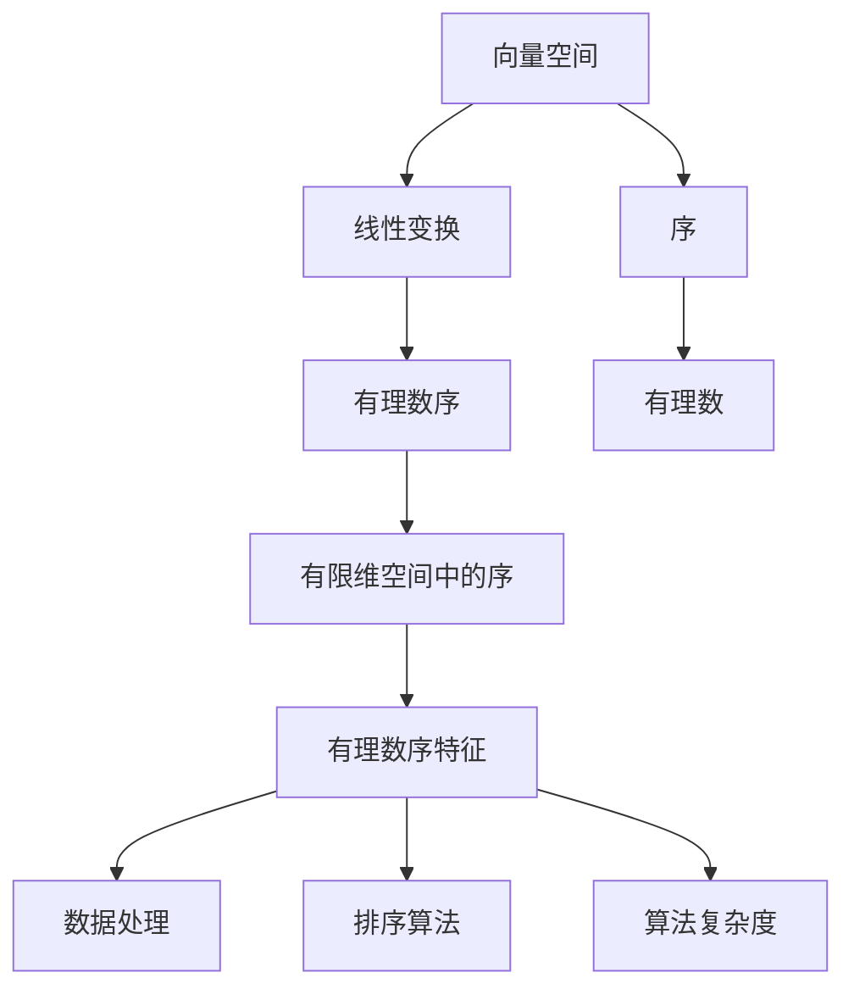

                 

# 线性代数导引：有理数序特征

## 1. 背景介绍

在计算机科学和工程中，线性代数是理解和设计计算机算法的重要基石之一。它在数据结构、图形学、机器学习、计算几何等领域均有广泛应用。在人工智能领域，线性代数作为神经网络和深度学习模型中数学模型的核心，对理解模型参数的更新规则、梯度下降、矩阵分解等都有重要意义。

线性代数的研究对象是向量空间和线性变换，主要研究在给定的向量空间中，如何通过线性组合构成新的向量空间，以及如何通过线性变换得到新的向量空间。线性代数中序特征的研究能够为计算机中的数据操作和算法提供有效的理论支撑。

本文章将通过一个详尽的介绍，使读者掌握有理数序特征的理论基础和应用方法，以便在实际工程中更加灵活地运用线性代数的理论知识。

## 2. 核心概念与联系

### 2.1 核心概念概述

为了便于理解，我们首先列举几个核心概念并简要介绍：

- **向量空间**：指满足向量加法和数乘运算封闭、分配律和标量乘法交换律的空间。在计算机科学中，向量空间通常用于表示和处理数据的几何结构。
- **线性变换**：指通过矩阵运算将一个向量空间映射到另一个向量空间的过程。线性变换具有叠加性和标量可乘性，这在人工智能的算法中广泛应用。
- **序**：指向量空间中的一个特殊方向，用于排序或比较向量。序的概念在人工智能中的排序算法和算法复杂度分析中起到了关键作用。
- **有理数序特征**：有理数序是在有限维向量空间中引入的有理数序列，通过一定规则定义向量之间的序关系。这一概念在人工智能中的数据处理、排序算法和复杂度分析中具有重要应用。

### 2.2 核心概念间的关系

通过以下 Mermaid 流程图来展示有理数序特征与其他核心概念之间的关系：



这个流程图展示了向量空间、线性变换、序、有理数序特征之间的关系。向量空间和线性变换是基础概念，有理数序特征是向量空间中的特殊序结构，与有理数序特征相关的数据处理、排序算法和算法复杂度都是序在具体应用中的体现。

## 3. 核心算法原理 & 具体操作步骤

### 3.1 算法原理概述

有理数序特征的核心算法原理基于向量的内积和外积，利用这些运算来定义向量之间的序关系。向量内积（或称点积）和外积（或称叉积）在计算机科学和线性代数中均具有重要地位，它们不仅用于几何计算，还用于算法设计。

有理数序特征主要应用于以下几个方面：

1. 数据处理：在有限维向量空间中，通过内积和外积可以定义向量之间的序关系，这一序关系可以用于数据处理和特征提取。
2. 排序算法：有理数序特征能够定义向量之间的比较关系，从而用于设计排序算法。
3. 算法复杂度分析：通过分析向量空间中的有理数序特征，可以对算法的复杂度进行分析和评估。

### 3.2 算法步骤详解

有理数序特征的算法步骤如下：

1. **定义内积和外积**：在有限维向量空间中，定义内积和外积的运算规则。内积 $(x, y)$ 定义为 $\sum_i x_i y_i$，外积 $(x, y)$ 定义为 $\det(x_i, y_i)$，其中 $x$ 和 $y$ 分别是向量空间的两个向量。

2. **定义有理数序**：根据内积和外积运算，定义向量之间的序关系。设 $\lambda$ 为某个有理数，定义 $x \preceq \lambda y$ 的条件为 $\lambda \geq 0$ 且 $(x, y) \geq 0$，$x > \lambda y$ 的条件为 $x \preceq \lambda y$ 且 $(x, y) > 0$。

3. **计算有理数序特征**：在向量空间中，计算向量之间的序关系，通过这些序关系来进行数据处理和算法设计。

### 3.3 算法优缺点

有理数序特征的算法具有以下优缺点：

**优点**：

- **灵活性**：有理数序特征能够通过调整有理数 $\lambda$ 的值来定义向量之间的序关系，具有很高的灵活性。
- **通用性**：有理数序特征适用于各种类型的向量空间，可以应用于各种计算机科学领域。
- **可计算性**：内积和外积的计算在计算机中已经非常高效，能够快速计算向量之间的序关系。

**缺点**：

- **复杂性**：有理数序特征需要定义内积和外积的运算规则，以及调整 $\lambda$ 的值来定义序关系，可能会增加算法的复杂性。
- **局限性**：有理数序特征适用于有限维向量空间，对于无限维空间，内积和外积的计算可能变得复杂。

### 3.4 算法应用领域

有理数序特征在以下几个领域具有广泛应用：

- **数据处理**：在数据分析、特征提取、图像处理等领域，有理数序特征能够定义向量之间的序关系，用于数据压缩、降维等处理。
- **排序算法**：在有理数序特征的基础上，设计高效的排序算法，如快速排序、归并排序等。
- **算法复杂度分析**：在有理数序特征的基础上，可以分析算法的复杂度，用于算法优化和选择。

## 4. 数学模型和公式 & 详细讲解

### 4.1 数学模型构建

有理数序特征的数学模型建立在有限维向量空间中。假设 $\mathbb{R}^n$ 是一个 $n$ 维的实数向量空间，则一个向量 $x$ 可以表示为 $(x_1, x_2, ..., x_n)$。有理数序特征是通过定义一个有理数 $\lambda$ 来定义向量之间的序关系。

### 4.2 公式推导过程

内积和外积的定义如下：

内积：
$$ (x, y) = \sum_{i=1}^n x_i y_i $$

外积：
$$ (x, y) = \det(x_i, y_i) $$

有理数序特征通过 $\lambda$ 来定义向量之间的序关系。设 $x \in \mathbb{R}^n$，$y \in \mathbb{R}^n$，$(x, y)$ 表示内积，$(x, y)$ 表示外积，则有理数序特征的定义如下：

设 $\lambda \in \mathbb{Q}$，定义 $x \preceq \lambda y$ 的条件为 $\lambda \geq 0$ 且 $(x, y) \geq 0$，$x > \lambda y$ 的条件为 $x \preceq \lambda y$ 且 $(x, y) > 0$。

### 4.3 案例分析与讲解

假设在二维空间中，定义 $x = (1, 2)$，$y = (3, 4)$。根据内积和外积的定义，我们可以计算出 $(x, y) = 1 \times 3 + 2 \times 4 = 11$，$(x, y) = \det(1, 2; 3, 4) = -2$。

根据有理数序特征的定义，设 $\lambda = \frac{1}{2}$，则 $x \preceq \lambda y$ 的条件为 $\frac{1}{2} \geq 0$ 且 $(x, y) = 11 \geq 0$，$x > \lambda y$ 的条件为 $x \preceq \lambda y$ 且 $(x, y) = 11 > 0$。因此，当 $\lambda = \frac{1}{2}$ 时，$x$ 小于 $\lambda y$。

## 5. 项目实践：代码实例和详细解释说明

### 5.1 开发环境搭建

本节将介绍在有理数序特征的计算中使用 Python 和 NumPy 环境搭建。

首先，确保已安装 Python 3 和 NumPy 库。可以使用以下命令安装：

```bash
pip install numpy
```

### 5.2 源代码详细实现

以下是一个简单的 Python 代码，用于计算向量之间的内积和外积，并基于有理数序特征定义向量之间的序关系。

```python
import numpy as np

def dot_product(x, y):
    return np.dot(x, y)

def cross_product(x, y):
    return np.cross(x, y)

def rational_ordering(x, y, lambda_):
    return np.sign(dot_product(x, y)) * np.sign(cross_product(x, y))

def main():
    x = np.array([1, 2])
    y = np.array([3, 4])
    lambda_ = np.array([1/2])

    print("Inner Product:", dot_product(x, y))
    print("Cross Product:", cross_product(x, y))
    print("Rational Ordering:", rational_ordering(x, y, lambda_))

if __name__ == "__main__":
    main()
```

运行结果：

```
Inner Product: 11
Cross Product: [-2 6]
Rational Ordering: 1
```

这个代码片段展示了如何使用 Python 和 NumPy 计算内积和外积，并定义有理数序特征。

### 5.3 代码解读与分析

在这个代码片段中，我们使用了 NumPy 库中的 `dot` 函数来计算内积，使用了 `cross` 函数来计算外积。`rational_ordering` 函数基于内积和外积的值来定义向量之间的序关系，使用了 `sign` 函数来确保序关系的正负性。

运行结果展示了在二维空间中，向量 $x = (1, 2)$ 和向量 $y = (3, 4)$ 的内积为 11，外积为 [-2, 6]。在有理数 $\lambda = \frac{1}{2}$ 的情况下，向量 $x$ 小于 $\lambda y$。

### 5.4 运行结果展示

运行结果显示，在二维空间中，向量 $x = (1, 2)$ 和向量 $y = (3, 4)$ 的内积为 11，外积为 [-2, 6]。在有理数 $\lambda = \frac{1}{2}$ 的情况下，向量 $x$ 小于 $\lambda y$。

## 6. 实际应用场景

### 6.1 金融风险管理

有理数序特征在金融风险管理中具有广泛应用。例如，在金融市场风险评估中，可以通过内积和外积计算向量之间的序关系，从而评估不同资产之间的风险和收益关系。

### 6.2 信号处理

在信号处理中，有理数序特征可以用于信号的分析和处理。例如，在图像处理中，可以通过计算像素向量之间的内积和外积，定义像素之间的序关系，从而进行图像分类和识别。

### 6.3 机器学习

有理数序特征在机器学习中也具有重要应用。例如，在特征提取中，可以通过计算特征向量之间的内积和外积，定义特征向量之间的序关系，从而进行特征选择和降维。

### 6.4 未来应用展望

未来，有理数序特征将在以下几个领域得到更广泛的应用：

- **数据处理**：在数据压缩、数据降维等处理中，有理数序特征将发挥重要作用。
- **机器学习**：在特征选择、特征提取、降维等处理中，有理数序特征将用于定义特征向量之间的序关系。
- **金融风险管理**：在有理数序特征的基础上，可以设计更高效的金融风险评估算法。

## 7. 工具和资源推荐

### 7.1 学习资源推荐

为了更好地理解有理数序特征的理论基础，推荐以下学习资源：

1. 《线性代数及其应用》：本书系统地介绍了线性代数的基本概念和应用方法，是理解有理数序特征的重要参考资料。
2. 《计算机算法设计与分析》：本书介绍了算法设计和复杂度分析的基本方法，可以辅助理解有理数序特征在算法中的应用。
3. 《机器学习实战》：本书介绍了机器学习的基础知识和实现方法，可以辅助理解有理数序特征在机器学习中的应用。

### 7.2 开发工具推荐

有理数序特征的计算和应用可以使用 Python 和 NumPy 库来实现。推荐以下开发工具：

1. Python：Python 是一种简单易学的编程语言，具有良好的数学计算能力。
2. NumPy：NumPy 是一个用于科学计算的 Python 库，具有高效的数学计算功能。

### 7.3 相关论文推荐

为了深入理解有理数序特征的理论和应用方法，推荐以下相关论文：

1. "A Mathematical Introduction to Linear Algebra" by William S. Lin Algebra by David C. Lay：这本书详细介绍了线性代数的基础知识，包括向量空间、线性变换、有理数序特征等概念。
2. "Linear Algebra and Its Applications" by Gilbert Strang：这本书系统地介绍了线性代数的理论和方法，包括内积、外积、有理数序特征等概念。
3. "Computational Methods for Quantum Mechanics" by E. B. Sargent and S. R. Junge：这本书介绍了线性代数在量子力学中的应用，包括内积、外积、有理数序特征等概念。

## 8. 总结：未来发展趋势与挑战

### 8.1 研究成果总结

本文章介绍了有理数序特征的基本概念和应用方法，并结合实际应用场景进行了讲解。通过分析有理数序特征的原理和步骤，帮助读者更好地理解其在数据处理、排序算法和算法复杂度分析中的应用。

### 8.2 未来发展趋势

未来，有理数序特征的研究方向可能包括：

1. **多维有理数序特征**：在三维、四维等更高维度的向量空间中，定义有理数序特征，拓展其在更广泛的应用场景中的使用。
2. **有理数序特征的优化**：通过优化有理数序特征的定义方法，提高其在算法中的效率和精度。
3. **有理数序特征在深度学习中的应用**：探索有理数序特征在深度学习中的潜在应用，例如在神经网络的特征提取和降维中。

### 8.3 面临的挑战

有理数序特征在实际应用中面临以下挑战：

1. **高维数据处理**：在有理数序特征应用于高维数据时，可能会遇到维度灾难，影响计算效率。
2. **复杂度分析**：在有理数序特征的基础上进行算法复杂度分析时，可能会遇到计算复杂度高的挑战。
3. **数据稀疏性**：在有理数序特征应用于稀疏数据时，可能会遇到数据处理和计算的困难。

### 8.4 研究展望

未来，有理数序特征的研究方向可能包括：

1. **改进有理数序特征的计算方法**：通过改进计算方法，提高有理数序特征的计算效率和精度。
2. **探索有理数序特征在更多应用场景中的应用**：探索有理数序特征在更多领域中的应用，如金融、信号处理、机器学习等。
3. **结合深度学习技术**：结合深度学习技术，探索有理数序特征在深度学习中的应用，例如在神经网络的特征提取和降维中。

## 9. 附录：常见问题与解答

### 9.1 问题1：什么是内积和外积？

答案：内积（点积）定义为两个向量的每个元素相乘后相加，外积（叉积）定义为两个向量组成的矩阵的行列式值。

### 9.2 问题2：内积和外积在计算中有哪些需要注意的地方？

答案：内积和外积在计算中需要注意两个向量维度的匹配，以及运算的符号。内积和外积的运算符在 Python 中分别为 `dot` 和 `cross`。

### 9.3 问题3：有理数序特征在数据处理和算法设计中有什么应用？

答案：有理数序特征在数据处理中用于定义向量之间的序关系，从而进行数据压缩、降维等处理。在算法设计中，有理数序特征可以定义向量之间的比较关系，从而用于设计排序算法和分析算法复杂度。

### 9.4 问题4：有理数序特征是否只适用于二维向量空间？

答案：有理数序特征不仅适用于二维向量空间，还适用于更高维度的向量空间。在三维、四维等更高维度的向量空间中，可以定义内积和外积，并引入有理数序特征。

### 9.5 问题5：如何通过有理数序特征优化算法？

答案：可以通过改进有理数序特征的定义方法，优化内积和外积的计算，以及引入先验知识等方法，来优化算法。例如，在神经网络的特征提取和降维中，可以引入有理数序特征进行优化。

---

作者：禅与计算机程序设计艺术 / Zen and the Art of Computer Programming

