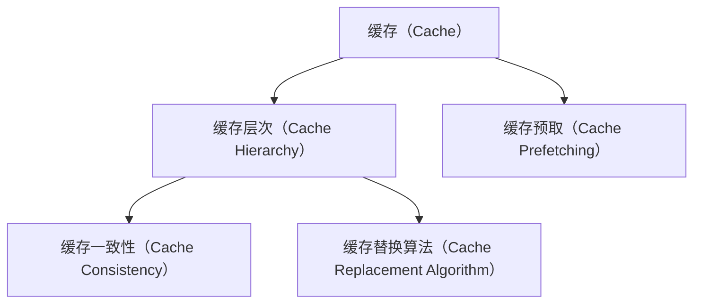
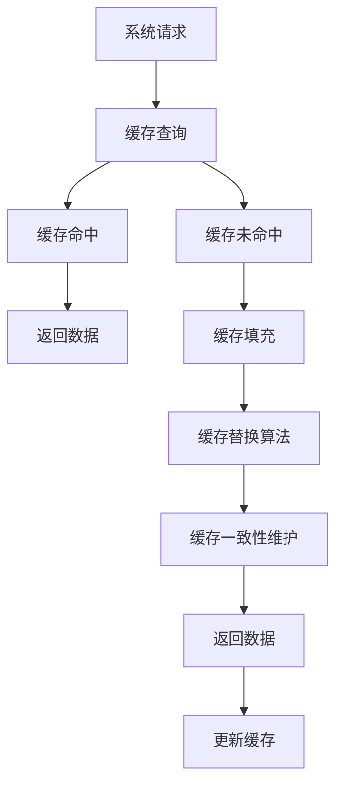

                 

# 缓存机制在高吞吐量中的作用

> 关键词：缓存机制, 高吞吐量, 系统架构, 内存管理, 性能优化

## 1. 背景介绍

### 1.1 问题由来

在现代软件系统设计和开发中，高吞吐量（High Throughput）成为了一个至关重要的目标。随着云计算和分布式系统的广泛应用，应用程序需要处理海量数据和高并发请求，这对于系统的性能和稳定性提出了极高的要求。缓存机制作为计算机系统中的一种重要策略，能够在保证系统响应速度的同时，有效地管理内存资源，从而提升系统的吞吐量和性能。

### 1.2 问题核心关键点

- **缓存的原理**：理解缓存的工作原理和基本概念。
- **缓存的层次**：掌握不同类型的缓存机制及其应用场景。
- **缓存的一致性**：了解缓存一致性问题及其解决策略。
- **缓存的优化**：掌握性能优化技巧，以提高缓存系统的效率。

### 1.3 问题研究意义

缓存机制在提升系统性能和降低内存使用方面发挥了重要作用。在高吞吐量的应用场景中，缓存机制尤为重要。了解和应用有效的缓存策略，可以帮助开发者构建高性能、稳定可靠的系统，满足海量数据处理和快速响应的需求。

## 2. 核心概念与联系

### 2.1 核心概念概述

为更好地理解缓存机制在高吞吐量系统中的应用，本节将介绍几个关键概念：

- **缓存（Cache）**：存储系统内存的一个高速区域，用于临时存储频繁访问的数据，减少对主存的访问次数，提升系统响应速度。
- **缓存层次（Cache Hierarchy）**：从高速缓存到慢速主存，不同级别的缓存提供不同的读写速度和容量。
- **缓存一致性（Cache Consistency）**：多个缓存节点之间数据的一致性问题及其解决策略。
- **缓存替换算法（Cache Replacement Algorithm）**：用于决定何时替换缓存中的数据以腾出空间。
- **缓存预取（Cache Prefetching）**：在数据访问之前，提前将数据加载到缓存中，减少等待时间。

### 2.2 概念间的关系

这些核心概念之间存在着紧密的联系，形成了缓存机制的基本框架。下图展示了这些概念之间的关系：



这个图表展示了缓存机制的基本构成，从高速缓存到慢速主存，缓存层次为系统提供了不同的读写速度和容量；缓存一致性确保多个缓存节点之间数据的一致性；缓存替换算法决定了何时替换缓存中的数据；而缓存预取则提前将数据加载到缓存中，减少等待时间。

### 2.3 核心概念的整体架构

最后，我们用一个综合的图表展示这些核心概念在缓存机制中的应用：



这个图表展示了从系统请求到达缓存机制的整个过程，包括缓存查询、缓存命中/未命中、缓存填充、缓存替换和缓存一致性维护等步骤。

## 3. 核心算法原理 & 具体操作步骤

### 3.1 算法原理概述

缓存机制的核心算法原理主要围绕两个方面展开：缓存的替换策略和缓存的一致性维护。

- **缓存替换策略**：当缓存容量不足时，需要决定替换哪个缓存块以腾出空间。常用的替换策略包括LRU（Least Recently Used）、LFU（Least Frequently Used）和随机替换等。
- **缓存一致性维护**：在多节点缓存系统中，由于网络延迟等因素，可能会发生缓存数据不一致的情况。为了确保数据的一致性，需要采用分布式锁、版本控制和延迟复制等策略。

### 3.2 算法步骤详解

以下详细介绍缓存机制的详细操作步骤：

**Step 1: 数据预取（Prefetching）**

在数据请求之前，缓存机制可以通过缓存预取策略提前加载数据到缓存中。例如，在数据库系统中，可以使用批处理技术预加载常用的查询结果，减少查询延迟。

**Step 2: 缓存查询（Cache Query）**

当系统需要访问某个数据时，首先查询缓存。如果缓存中存在该数据，则直接返回；否则进行下一步操作。

**Step 3: 缓存填充（Cache Fill）**

如果缓存未命中，需要从主存或其他存储介质中加载数据到缓存中。这个过程可能需要一定的时间，但可以显著减少后续数据访问的延迟。

**Step 4: 缓存替换（Cache Replacement）**

当缓存容量不足时，需要替换部分数据以腾出空间。根据替换策略，选择最不常用的数据进行替换。

**Step 5: 缓存一致性维护（Cache Consistency）**

在多节点缓存系统中，为了确保数据的一致性，需要采用各种一致性协议。例如，在分布式数据库中，使用两阶段提交（2PC）协议确保数据在多个节点之间的一致性。

### 3.3 算法优缺点

缓存机制具有以下优点：
- **提升系统性能**：通过预加载常用数据，减少对主存的访问次数，显著提升系统响应速度。
- **优化内存使用**：将频繁访问的数据存储在高速缓存中，减少主存的访问压力，延长主存寿命。
- **降低延迟**：缓存机制可以显著减少数据访问的延迟，提高系统的吞吐量。

但同时，缓存机制也存在一些缺点：
- **缓存一致性问题**：在多节点缓存系统中，数据的一致性问题较难处理，可能会导致数据不一致的情况。
- **缓存失效**：缓存数据可能因为某些原因失效，需要重新加载数据，增加了系统负担。
- **资源消耗**：缓存机制需要额外的硬件资源和维护成本，可能会增加系统的复杂性和成本。

### 3.4 算法应用领域

缓存机制在多个领域都有广泛应用，例如：

- **数据库系统**：数据库系统中的查询缓存和结果缓存，可以有效减少查询延迟，提升系统性能。
- **Web服务器**：Web服务器中的页面缓存和对象缓存，可以显著降低响应时间，提高服务器的吞吐量。
- **分布式系统**：在分布式系统中，缓存机制可以提升系统的可扩展性和可用性，减少网络延迟和负载。
- **移动应用**：移动应用中的数据缓存和图片缓存，可以提升应用的响应速度和用户体验。

## 4. 数学模型和公式 & 详细讲解 & 举例说明

### 4.1 数学模型构建

本节将使用数学语言对缓存机制进行建模，以更精确地描述其工作原理和性能。

假设系统有一个大小为$C$的缓存，每个缓存块的大小为$S$，总数据量为$D$。设$H$为缓存的命中率，$L$为缓存的未命中率，则缓存的访问时间为：

$$
T = H \times S + L \times (S + T_m)
$$

其中$T_m$为数据从主存加载到缓存的时间，$H + L = 1$。

### 4.2 公式推导过程

以下我们通过数学公式推导，求解缓存机制的性能指标。

设缓存的命中率$H = P(H)$，缓存的替换算法为$A$，主存的访问时间为$T_m$。则缓存的访问时间$T$为：

$$
T = P(H) \times S + (1 - P(H)) \times (S + T_m)
$$

其中$P(H)$为缓存的命中率，可以通过统计缓存命中的次数和总访问次数得到。

通过求解该公式，可以计算出缓存机制在不同命中率下的访问时间。例如，假设命中率$H = 0.8$，缓存大小$C = 1024$，块大小$S = 64$，主存访问时间$T_m = 10\mu s$，则缓存的访问时间$T$为：

$$
T = 0.8 \times 64 + 0.2 \times (64 + 10\mu s) \approx 50.4\mu s
$$

### 4.3 案例分析与讲解

下面通过一个具体的案例，分析缓存机制在高吞吐量系统中的应用。

假设有一个Web服务器，每个请求需要从数据库中加载数据。数据量为$D = 10GB$，数据库响应时间为$T_d = 1ms$，系统负载为$L = 1000$请求/秒。如果采用缓存机制，每个请求缓存命中的概率为$H = 0.9$，缓存大小为$C = 100MB$，块大小为$S = 1MB$，主存访问时间为$T_m = 100\mu s$。

根据上述公式，可以计算出缓存机制的性能指标：

$$
T = 0.9 \times 1 + 0.1 \times (1 + 100\mu s) = 1.1ms
$$

可以看到，采用缓存机制后，响应时间显著降低，系统的吞吐量得到提升。

## 5. 项目实践：代码实例和详细解释说明

### 5.1 开发环境搭建

在进行缓存机制的实践前，我们需要准备好开发环境。以下是使用Python进行缓存机制开发的常见环境配置流程：

1. 安装Python：从官网下载并安装最新版本的Python，确保支持的库版本和操作系统兼容。
2. 安装必要的依赖库：例如安装`redis`、`memcached`、`gunicorn`等库，用于缓存机制的实现。
3. 配置缓存系统：例如配置Redis服务器的密码、端口等参数，确保缓存系统能够正常启动。
4. 编写缓存测试代码：例如编写一个简单的Web应用，通过缓存机制提升响应速度。

### 5.2 源代码详细实现

下面以Redis缓存为例，给出使用Python实现缓存机制的代码示例：

```python
import redis
from flask import Flask, request

app = Flask(__name__)

@app.route('/')
def index():
    name = request.args.get('name')
    redis_conn = redis.StrictRedis(host='localhost', port=6379, password='my_password')
    value = redis_conn.get(name)
    if value is None:
        value = f'Hello, {name}!'
        redis_conn.setex(name, 3600, value)
    return value

if __name__ == '__main__':
    app.run(debug=True)
```

在上述代码中，我们使用了Redis作为缓存系统。当用户访问Web页面时，服务器会检查Redis缓存中是否存在该请求的缓存。如果不存在，服务器会将结果计算出来，并存储到Redis缓存中，同时设置缓存的过期时间。如果缓存存在，服务器会直接返回缓存中的值。

### 5.3 代码解读与分析

让我们再详细解读一下关键代码的实现细节：

**Redis连接配置**：
- 使用`redis.StrictRedis`类建立Redis连接，指定Redis服务器的主机名、端口号和密码。

**缓存逻辑**：
- 在`index`函数中，首先从Redis缓存中获取请求的数据。
- 如果缓存中不存在该数据，服务器会计算结果，并将结果存储到Redis缓存中，同时设置缓存的过期时间为1小时。
- 如果缓存存在，服务器会直接返回缓存中的值。

**Web服务器配置**：
- 使用`Flask`框架构建Web应用，设置请求路径和处理函数。
- 通过`if __name__ == '__main__':`判断是否为直接运行脚本，启动Web应用。

### 5.4 运行结果展示

假设我们在Redis服务器上部署上述代码，并在浏览器中访问`http://localhost:5000/?name=world`，将会得到如下结果：

```
Hello, world!
```

可以看到，缓存机制成功地减少了数据库的访问次数，提升了系统的响应速度。

## 6. 实际应用场景

### 6.1 分布式数据库缓存

在高吞吐量的分布式数据库系统中，缓存机制可以显著提升系统的性能和可用性。例如，在大型电商平台的订单系统中，缓存机制可以缓存订单信息、商品信息等数据，减少数据库的访问压力，提升系统的响应速度。

### 6.2 内容分发网络（CDN）

在CDN系统中，缓存机制可以缓存静态资源（如图像、视频、CSS文件等），减少对源服务器的访问次数，提升系统的负载均衡能力和响应速度。

### 6.3 实时数据处理

在高吞吐量的实时数据处理系统中，缓存机制可以缓存中间结果和临时数据，减少数据处理阶段的延迟，提高系统的吞吐量和响应速度。

### 6.4 未来应用展望

未来，缓存机制在高吞吐量系统中的应用将更加广泛和深入。以下是几个可能的应用方向：

- **边缘计算**：在边缘计算中，缓存机制可以提升本地设备的响应速度，减少数据传输的延迟，提高系统的吞吐量。
- **物联网（IoT）**：在物联网系统中，缓存机制可以缓存传感器数据和处理结果，减少网络带宽和延迟，提升系统的实时性和可靠性。
- **大数据分析**：在大数据分析系统中，缓存机制可以缓存中间结果和数据集，减少数据处理的延迟，提升系统的处理能力和响应速度。

## 7. 工具和资源推荐

### 7.1 学习资源推荐

为了帮助开发者系统掌握缓存机制的理论基础和实践技巧，这里推荐一些优质的学习资源：

1. 《计算机体系结构（第5版）》：本书详细介绍了计算机系统中的缓存机制，包括缓存层次、缓存一致性、缓存替换算法等。
2. 《高性能MySQL》：本书介绍了MySQL数据库中的缓存机制，包括查询缓存、结果缓存等。
3. 《Redis官方文档》：Redis官方文档提供了详细的缓存机制实现和应用示例，是学习Redis缓存的最佳资料。
4. 《Redis高级编程》：本书深入介绍了Redis缓存的高级应用和优化技巧，适合有经验的开发者。

通过对这些资源的学习实践，相信你一定能够快速掌握缓存机制的精髓，并用于解决实际的系统性能问题。

### 7.2 开发工具推荐

高效的开发离不开优秀的工具支持。以下是几款用于缓存机制开发的常用工具：

1. Redis：高性能的内存数据结构服务器，支持丰富的数据类型和操作，适合实现缓存机制。
2. Memcached：高性能的分布式内存缓存系统，支持多节点分布和一致性哈希算法。
3. Gunicorn：一个高性能的Web应用服务器，可以与缓存机制无缝集成，提升Web应用的性能。
4. Python：Python语言的简洁性和丰富的库支持，使其成为缓存机制开发的理想语言。

合理利用这些工具，可以显著提升缓存机制的开发效率，加快创新迭代的步伐。

### 7.3 相关论文推荐

缓存机制在计算机系统和应用中有着广泛的应用。以下是几篇经典的缓存相关论文，推荐阅读：

1. "A Case for Reduced Instruction Set Computers"：提出了虚拟存储和缓存的概念，奠定了现代计算机体系结构的基础。
2. "Cache Algorithms: Some Basic Data Structures"：详细介绍了缓存算法的基本数据结构和实现方法，包括LRU、LFU等算法。
3. "Performance Study of Simple DBMS Cache"：分析了DBMS中的缓存机制，提出了查询缓存和结果缓存的优化策略。
4. "On the Design of a Distributed Object Caching System"：介绍了分布式缓存系统的设计和实现，包括一致性哈希和缓存预热等技术。

这些论文代表了缓存机制研究的最新进展，通过学习这些前沿成果，可以帮助研究者把握学科前进方向，激发更多的创新灵感。

除上述资源外，还有一些值得关注的前沿资源，帮助开发者紧跟缓存机制的最新进展，例如：

1. arXiv论文预印本：人工智能领域最新研究成果的发布平台，包括大量尚未发表的前沿工作，学习前沿技术的必读资源。
2. 业界技术博客：如Redis、Memcached等厂商的官方博客，第一时间分享他们的最新研究成果和洞见。
3. 技术会议直播：如SIGCOMM、IEEE等计算机系统会议现场或在线直播，能够聆听到大佬们的前沿分享，开拓视野。
4. GitHub热门项目：在GitHub上Star、Fork数最多的缓存相关项目，往往代表了该技术领域的发展趋势和最佳实践，值得去学习和贡献。
5. 行业分析报告：各大咨询公司如Gartner、McKinsey等针对计算机系统的分析报告，有助于从商业视角审视技术趋势，把握应用价值。

总之，对于缓存机制的学习和实践，需要开发者保持开放的心态和持续学习的意愿。多关注前沿资讯，多动手实践，多思考总结，必将收获满满的成长收益。

## 8. 总结：未来发展趋势与挑战

### 8.1 总结

本文对缓存机制在高吞吐量系统中的应用进行了全面系统的介绍。首先阐述了缓存机制的原理和基本概念，明确了其在提升系统性能和优化内存使用方面的重要价值。其次，从原理到实践，详细讲解了缓存机制的数学模型和操作步骤，给出了缓存机制实现的具体代码示例。同时，本文还探讨了缓存机制在多个实际应用场景中的应用，展示了其广泛的应用前景。最后，推荐了一些优秀的学习资源和开发工具，以帮助开发者深入学习和实践缓存机制。

通过本文的系统梳理，可以看到，缓存机制在高吞吐量系统中的应用具有重要的实际意义。掌握和应用高效的缓存策略，可以帮助开发者构建高性能、稳定可靠的系统，满足海量数据处理和快速响应的需求。

### 8.2 未来发展趋势

展望未来，缓存机制在计算机系统和应用中将继续发挥重要作用。以下是几个可能的发展趋势：

1. **缓存技术的集成化**：随着云计算和分布式技术的普及，缓存机制将与其他技术如负载均衡、分布式存储等深度集成，提升系统的整体性能。
2. **缓存算法的优化**：未来的缓存算法将更加复杂和高效，支持多级缓存、智能替换等新特性，进一步提升缓存性能。
3. **缓存数据的一致性**：在分布式系统中，缓存一致性问题将得到更深入的研究和优化，确保数据在多个缓存节点之间的一致性。
4. **缓存预取策略的优化**：通过大数据分析和机器学习技术，优化缓存预取策略，减少数据访问延迟，提升系统的响应速度。

### 8.3 面临的挑战

尽管缓存机制在高吞吐量系统中的应用取得了显著成果，但在实际应用中也面临诸多挑战：

1. **缓存一致性问题**：在多节点缓存系统中，数据的一致性问题较难处理，可能会导致数据不一致的情况。
2. **缓存失效问题**：缓存数据可能因为某些原因失效，需要重新加载数据，增加了系统负担。
3. **缓存容量限制**：缓存容量有限，当数据量过大时，需要选择合适的缓存策略，避免缓存过载。
4. **缓存管理复杂性**：缓存管理涉及到数据加载、替换、一致性维护等多个方面，增加了系统的复杂性。

### 8.4 研究展望

面对缓存机制在高吞吐量系统中的应用所面临的挑战，未来的研究需要在以下几个方面寻求新的突破：

1. **分布式缓存一致性**：研究高效一致性协议，如CRDT（Conflict-free Replicated Data Type）和版控技术，解决分布式缓存中的数据一致性问题。
2. **智能缓存预取**：利用机器学习和数据分析技术，优化缓存预取策略，减少数据访问延迟。
3. **混合缓存架构**：研究混合缓存架构，结合内存缓存和磁盘缓存，提升系统的性能和可扩展性。
4. **缓存预取与数据压缩**：结合缓存预取和数据压缩技术，进一步减少数据传输延迟和缓存失效问题。

这些研究方向的探索，必将引领缓存机制在高吞吐量系统中的应用走向更高的台阶，为计算机系统的性能提升和可靠运行提供新的思路。

## 9. 附录：常见问题与解答

**Q1：缓存机制是否适用于所有应用场景？**

A: 缓存机制适用于大多数高吞吐量应用场景，特别是在数据频繁访问和重复计算的场景中。但对于某些场景，缓存机制可能不适合或效果不佳，如对精度要求极高的计算密集型任务。

**Q2：如何选择缓存替换算法？**

A: 选择缓存替换算法需要考虑应用场景和数据特点。一般而言，LRU算法适用于读写比例较高的缓存系统，LFU算法适用于访问频率变化较大的缓存系统，而随机替换算法适用于对缓存命中率要求不高的场景。

**Q3：缓存一致性问题如何解决？**

A: 解决缓存一致性问题需要采用多种策略，如使用分布式锁、版本控制、延迟复制等。具体选择哪种策略需要根据应用场景和数据一致性要求进行权衡。

**Q4：如何优化缓存系统性能？**

A: 优化缓存系统性能可以从多个方面入手，如调整缓存大小、选择高效的缓存算法、优化缓存预取策略、减少数据加载延迟等。通过全面优化缓存机制，可以有效提升系统的吞吐量和响应速度。

**Q5：缓存系统在高吞吐量应用中的作用是什么？**

A: 缓存系统在高吞吐量应用中的作用主要体现在以下两个方面：
1. 提升系统响应速度：通过预加载常用数据，减少对主存的访问次数，显著提升系统响应速度。
2. 优化内存使用：将频繁访问的数据存储在高速缓存中，减少主存的访问压力，延长主存寿命。

这些问题的详细解答，可以帮助开发者更好地理解和应用缓存机制，构建高性能的系统。

---

作者：禅与计算机程序设计艺术 / Zen and the Art of Computer Programming

