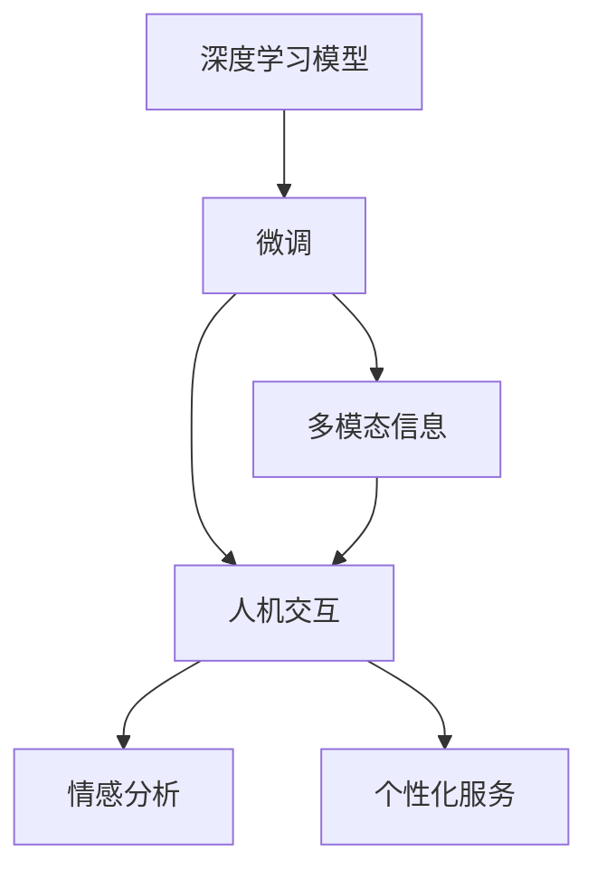
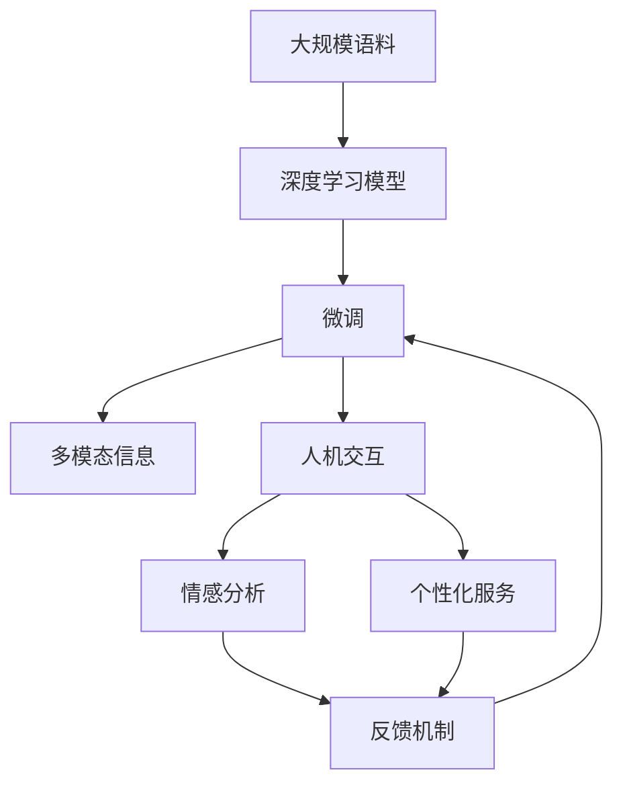

                 

# 聊天机器人：AI如何提升客户服务效率

> 关键词：聊天机器人,客户服务,自然语言处理,深度学习,Transformer,BERT,微调,Fine-tuning,多模态,人机交互,多轮对话,情感分析

## 1. 背景介绍

### 1.1 问题由来
随着人工智能技术的飞速发展，聊天机器人（Chatbot）作为人工智能在实际应用中的一种重要形式，已经成为企业提升客户服务效率、改善用户体验的关键工具。传统的客户服务模式往往需要大量的人力和时间成本，响应速度慢、服务质量不稳定等问题频出。相比之下，基于人工智能的聊天机器人能够实现全天候、自动化的客户服务，显著提升了客户体验和企业运营效率。

然而，尽管聊天机器人已经广泛应用，但其智能化程度仍存在不足，特别是在处理复杂问题、提供个性化服务等方面，仍需依赖人工干预。为了进一步提升聊天机器人的智能化水平，研究人员和企业开始探索利用深度学习技术进行机器人微调，以期在自然语言处理（NLP）的基础上，构建更智能、更人性化的客户服务系统。

### 1.2 问题核心关键点
聊天机器人微调的核心在于如何通过深度学习技术，使机器人能够更好地理解客户需求，提供准确、及时的响应，同时具备一定的情感分析和个性化服务能力。这一过程中，需要重点关注以下几个方面：

- **深度学习模型的选择**：常用的深度学习模型包括基于Transformer的BERT、GPT等，这些模型在大规模语料上预训练，具备强大的语言理解能力。
- **微调数据集的准备**：需要准备包含客户对话的标注数据集，作为机器人训练的监督信号。
- **模型适配层的设计**：在预训练模型的基础上，设计适应特定任务（如问答、客服、情感分析等）的适配层，确保机器人能够理解输入并产生合适的输出。
- **模型的训练与优化**：利用标注数据集训练微调的深度学习模型，通过调整学习率和正则化等参数，优化模型性能。
- **多模态信息的整合**：在实际应用中，聊天机器人可能会接收到图片、语音等多种信息，如何整合这些信息，提高系统智能性，是未来研究的重要方向。
- **模型的部署与监控**：将训练好的模型部署到实际应用中，并进行性能监控和优化，确保系统稳定运行。

### 1.3 问题研究意义
聊天机器人微调技术对于提升客户服务效率、降低企业运营成本、改善用户体验具有重要意义：

1. **全天候服务**：聊天机器人可以全年无休、全天候提供客户服务，解决企业服务人力短缺的问题。
2. **快速响应**：机器人的实时响应能力，可以大大缩短客户等待时间，提升服务效率。
3. **个性化服务**：通过微调技术，聊天机器人能够根据客户历史行为和偏好，提供个性化的服务和推荐，提升客户满意度。
4. **情感分析**：机器人在与客户互动过程中，能够识别客户的情感状态，提供针对性的服务，增强客户体验。
5. **成本效益**：聊天机器人替代部分人工客服岗位，减少企业人力成本，提高整体运营效率。
6. **数据驱动**：通过对话记录和分析，企业可以获得有价值的客户行为数据，为业务优化和产品改进提供依据。

## 2. 核心概念与联系

### 2.1 核心概念概述

为更好地理解聊天机器人微调技术，本节将介绍几个关键概念：

- **深度学习模型**：如Transformer、BERT等，是聊天机器人微调的基础，通过在大规模语料上进行预训练，学习到语言的通用表示。
- **微调(Fine-tuning)**：指在预训练模型的基础上，利用标注数据集进行有监督学习，优化模型在特定任务上的性能。
- **多模态信息**：指聊天机器人不仅仅处理文本信息，还能接收到语音、图片等多模态信息，这些信息需要进行整合和处理。
- **人机交互**：聊天机器人与客户之间的交互过程，包括多轮对话、情感识别、意图理解等。
- **情感分析**：指聊天机器人能够理解客户的情感状态，提供相应的情感回应。
- **个性化服务**：指聊天机器人能够根据客户的历史行为和偏好，提供定制化的服务。

这些概念共同构成了聊天机器人微调技术的核心框架，帮助聊天机器人更好地理解和响应客户需求，提供高质量的客户服务。

### 2.2 概念间的关系

这些关键概念之间的逻辑关系可以通过以下Mermaid流程图来展示：



这个流程图展示了大语言模型微调过程中各个概念之间的关系：

1. 深度学习模型通过预训练学习语言表示。
2. 微调技术将预训练模型适应特定任务，如问答、客服等。
3. 多模态信息与文本信息结合，增强系统的智能性。
4. 人机交互过程中，机器人和客户进行多轮对话，收集客户信息。
5. 情感分析帮助机器理解客户情感状态。
6. 个性化服务根据客户历史行为，提供定制化的服务。

通过这些概念的组合和互动，聊天机器人微调技术可以更有效地处理客户服务需求，提升系统效率和客户满意度。

### 2.3 核心概念的整体架构

最后，我们用一个综合的流程图来展示这些概念在大语言模型微调过程中的整体架构：



这个综合流程图展示了从预训练到微调，再到多模态整合和情感分析的全过程。通过这些关键技术的结合，聊天机器人可以更智能、更人性化地服务客户。

## 3. 核心算法原理 & 具体操作步骤
### 3.1 算法原理概述

聊天机器人微调技术基于深度学习模型，其核心思想是通过在特定任务上标注数据集的有监督学习，优化模型在该任务上的性能。

具体来说，假设聊天机器人使用的深度学习模型为 $M_{\theta}$，其中 $\theta$ 为模型参数。给定训练集 $D=\{(x_i, y_i)\}_{i=1}^N$，其中 $x_i$ 为输入对话文本，$y_i$ 为对应的响应文本。微调的目标是最小化模型在训练集上的预测误差，即：

$$
\theta^* = \mathop{\arg\min}_{\theta} \sum_{i=1}^N \mathcal{L}(M_{\theta}(x_i), y_i)
$$

其中 $\mathcal{L}$ 为损失函数，可以是交叉熵损失、均方误差损失等。在实际应用中，通常使用交叉熵损失，因为其适合分类任务，能够较好地处理标签不平衡问题。

### 3.2 算法步骤详解

聊天机器人微调的具体操作步骤如下：

**Step 1: 准备预训练模型和数据集**
- 选择合适的预训练语言模型 $M_{\theta}$，如BERT、GPT等。
- 准备训练集 $D$，包含客户对话文本及其对应的响应文本，标注数据集需充分覆盖多种常见问题和场景。

**Step 2: 添加任务适配层**
- 在预训练模型的基础上，设计适配层的结构和功能，确保模型能够理解输入文本并产生合适的响应。
- 例如，在BERT模型上添加线性分类层和softmax函数，将模型输出转化为响应文本的概率分布。

**Step 3: 设置微调超参数**
- 选择合适的优化算法及其参数，如Adam、SGD等，设置学习率、批大小、迭代轮数等。
- 设置正则化技术，如L2正则、Dropout、Early Stopping等，避免过拟合。

**Step 4: 执行梯度训练**
- 将训练集数据分批次输入模型，前向传播计算损失函数。
- 反向传播计算参数梯度，根据设定的优化算法和学习率更新模型参数。
- 周期性在验证集上评估模型性能，根据性能指标决定是否触发 Early Stopping。
- 重复上述步骤直到满足预设的迭代轮数或 Early Stopping 条件。

**Step 5: 测试和部署**
- 在测试集上评估微调后模型 $M_{\hat{\theta}}$ 的性能，对比微调前后的精度提升。
- 使用微调后的模型对新对话进行推理预测，集成到实际的应用系统中。
- 持续收集新的对话数据，定期重新微调模型，以适应数据分布的变化。

### 3.3 算法优缺点

聊天机器人微调技术具有以下优点：

- **快速迭代**：相比从头训练，微调过程时间较短，能够快速适应新任务。
- **泛化能力强**：微调后的模型在特定任务上能够较好地泛化，提高系统智能性。
- **数据高效利用**：微调过程中只更新模型部分参数，能够高效利用标注数据集。

但同时也存在一些缺点：

- **依赖标注数据**：微调效果依赖标注数据集的质量和数量，标注成本较高。
- **过拟合风险**：微调过程中需要设定正则化技术，避免模型过拟合。
- **解释性不足**：微调后的模型通常被视为"黑盒"，难以解释其内部决策过程。
- **鲁棒性问题**：微调模型面对域外数据时，泛化性能可能下降。

### 3.4 算法应用领域

聊天机器人微调技术在多个领域都有广泛应用，例如：

- **客户服务**：聊天机器人可以处理常见客户咨询、订单查询、售后服务等。
- **金融咨询**：机器人可以提供账户查询、交易咨询、投资建议等服务。
- **医疗咨询**：机器人可以提供健康咨询、用药建议、预约挂号等服务。
- **教育辅导**：机器人可以提供学习问题解答、学习计划制定、学习资源推荐等服务。
- **电子商务**：机器人可以提供商品推荐、订单处理、客户支持等服务。
- **旅游服务**：机器人可以提供旅游信息查询、行程规划、景点介绍等服务。

以上这些领域均涉及大量的自然语言处理任务，通过微调技术，聊天机器人可以提供高效、准确的客户服务。

## 4. 数学模型和公式 & 详细讲解 & 举例说明

### 4.1 数学模型构建

聊天机器人微调涉及的数学模型主要包括损失函数和优化算法。

假设聊天机器人模型为 $M_{\theta}$，训练集 $D=\{(x_i, y_i)\}_{i=1}^N$，其中 $x_i$ 为输入文本，$y_i$ 为响应文本。假设模型输出为 $h = M_{\theta}(x)$，则交叉熵损失函数定义为：

$$
\mathcal{L}(h, y) = -\frac{1}{N}\sum_{i=1}^N \log p(y_i | h)
$$

其中 $p(y_i | h)$ 为模型输出 $h$ 的条件概率分布。

在实际应用中，我们通常使用softmax函数将模型输出转化为概率分布：

$$
p(y_i | h) = \frac{\exp(h_i)}{\sum_{j=1}^K \exp(h_j)}
$$

其中 $K$ 为响应文本的类别数，$h_i$ 为模型对响应文本 $y_i$ 的表示。

### 4.2 公式推导过程

下面以问答任务为例，推导聊天机器人微调的数学公式。

假设问答任务的训练集 $D=\{(x_i, y_i)\}_{i=1}^N$，其中 $x_i$ 为输入问题，$y_i$ 为相应回答。假设模型 $M_{\theta}$ 输出 $h_i$，则问答任务的交叉熵损失函数为：

$$
\mathcal{L}(h, y) = -\frac{1}{N}\sum_{i=1}^N \log p(y_i | h)
$$

将softmax函数代入损失函数中，得：

$$
\mathcal{L}(h, y) = -\frac{1}{N}\sum_{i=1}^N y_i \log \frac{\exp(h_i)}{\sum_{j=1}^K \exp(h_j)}
$$

在微调过程中，我们希望最小化上述损失函数。根据梯度下降优化算法，模型的参数更新公式为：

$$
\theta \leftarrow \theta - \eta \nabla_{\theta}\mathcal{L}(\theta)
$$

其中 $\eta$ 为学习率，$\nabla_{\theta}\mathcal{L}(\theta)$ 为损失函数对参数 $\theta$ 的梯度，可通过反向传播算法计算得到。

### 4.3 案例分析与讲解

以金融咨询任务为例，展示聊天机器人微调的实现过程。

假设训练集 $D=\{(x_i, y_i)\}_{i=1}^N$，其中 $x_i$ 为客户的查询文本，$y_i$ 为金融咨询的响应文本。

**Step 1: 准备预训练模型和数据集**
- 选择BERT作为预训练模型，将其作为初始化参数。
- 准备金融咨询领域的标注数据集，包含多种常见问题和对应的响应。

**Step 2: 添加任务适配层**
- 在BERT模型基础上，添加一个全连接层和softmax函数，将模型输出转化为金融咨询的类别概率分布。

**Step 3: 设置微调超参数**
- 选择Adam优化算法，设置学习率为1e-5，批大小为16，迭代轮数为10。

**Step 4: 执行梯度训练**
- 将训练集数据分批次输入模型，计算交叉熵损失。
- 反向传播计算参数梯度，更新模型参数。
- 周期性在验证集上评估模型性能，根据性能指标决定是否触发Early Stopping。
- 重复上述步骤直到满足预设的迭代轮数或Early Stopping条件。

**Step 5: 测试和部署**
- 在测试集上评估微调后的模型性能，对比微调前后的精度提升。
- 使用微调后的模型对新查询进行推理预测，集成到金融咨询系统。
- 持续收集新的查询数据，定期重新微调模型，以适应数据分布的变化。

## 5. 项目实践：代码实例和详细解释说明
### 5.1 开发环境搭建

在进行聊天机器人微调实践前，我们需要准备好开发环境。以下是使用Python进行PyTorch开发的环境配置流程：

1. 安装Anaconda：从官网下载并安装Anaconda，用于创建独立的Python环境。

2. 创建并激活虚拟环境：
```bash
conda create -n pytorch-env python=3.8 
conda activate pytorch-env
```

3. 安装PyTorch：根据CUDA版本，从官网获取对应的安装命令。例如：
```bash
conda install pytorch torchvision torchaudio cudatoolkit=11.1 -c pytorch -c conda-forge
```

4. 安装Transformers库：
```bash
pip install transformers
```

5. 安装各类工具包：
```bash
pip install numpy pandas scikit-learn matplotlib tqdm jupyter notebook ipython
```

完成上述步骤后，即可在`pytorch-env`环境中开始微调实践。

### 5.2 源代码详细实现

这里我们以金融咨询任务为例，给出使用Transformers库对BERT模型进行微调的PyTorch代码实现。

首先，定义金融咨询任务的标注数据集：

```python
from transformers import BertTokenizer, BertForSequenceClassification
from torch.utils.data import Dataset, DataLoader
import torch

class FinancialConsultationDataset(Dataset):
    def __init__(self, texts, labels, tokenizer, max_len=128):
        self.texts = texts
        self.labels = labels
        self.tokenizer = tokenizer
        self.max_len = max_len
        
    def __len__(self):
        return len(self.texts)
    
    def __getitem__(self, item):
        text = self.texts[item]
        label = self.labels[item]
        
        encoding = self.tokenizer(text, return_tensors='pt', max_length=self.max_len, padding='max_length', truncation=True)
        input_ids = encoding['input_ids'][0]
        attention_mask = encoding['attention_mask'][0]
        
        # 将标签编码为数字
        encoded_label = label2id[label]
        labels = torch.tensor([encoded_label], dtype=torch.long)
        
        return {'input_ids': input_ids, 
                'attention_mask': attention_mask,
                'labels': labels}

# 标签与id的映射
label2id = {'查询': 0, '理财咨询': 1, '投资建议': 2, '贷款咨询': 3, '保险咨询': 4}
id2label = {v: k for k, v in label2id.items()}

# 创建dataset
tokenizer = BertTokenizer.from_pretrained('bert-base-cased')

train_dataset = FinancialConsultationDataset(train_texts, train_labels, tokenizer)
dev_dataset = FinancialConsultationDataset(dev_texts, dev_labels, tokenizer)
test_dataset = FinancialConsultationDataset(test_texts, test_labels, tokenizer)
```

然后，定义模型和优化器：

```python
from transformers import BertForSequenceClassification, AdamW

model = BertForSequenceClassification.from_pretrained('bert-base-cased', num_labels=len(label2id))

optimizer = AdamW(model.parameters(), lr=2e-5)
```

接着，定义训练和评估函数：

```python
from tqdm import tqdm
from sklearn.metrics import classification_report

device = torch.device('cuda') if torch.cuda.is_available() else torch.device('cpu')
model.to(device)

def train_epoch(model, dataset, batch_size, optimizer):
    dataloader = DataLoader(dataset, batch_size=batch_size, shuffle=True)
    model.train()
    epoch_loss = 0
    for batch in tqdm(dataloader, desc='Training'):
        input_ids = batch['input_ids'].to(device)
        attention_mask = batch['attention_mask'].to(device)
        labels = batch['labels'].to(device)
        model.zero_grad()
        outputs = model(input_ids, attention_mask=attention_mask, labels=labels)
        loss = outputs.loss
        epoch_loss += loss.item()
        loss.backward()
        optimizer.step()
    return epoch_loss / len(dataloader)

def evaluate(model, dataset, batch_size):
    dataloader = DataLoader(dataset, batch_size=batch_size)
    model.eval()
    preds, labels = [], []
    with torch.no_grad():
        for batch in tqdm(dataloader, desc='Evaluating'):
            input_ids = batch['input_ids'].to(device)
            attention_mask = batch['attention_mask'].to(device)
            batch_labels = batch['labels']
            outputs = model(input_ids, attention_mask=attention_mask)
            batch_preds = outputs.logits.argmax(dim=2).to('cpu').tolist()
            batch_labels = batch_labels.to('cpu').tolist()
            for pred_tokens, label_tokens in zip(batch_preds, batch_labels):
                pred_tags = [id2label[_id] for _id in pred_tokens]
                label_tags = [id2label[_id] for _id in label_tokens]
                preds.append(pred_tags[:len(label_tokens)])
                labels.append(label_tags)
                
    print(classification_report(labels, preds))
```

最后，启动训练流程并在测试集上评估：

```python
epochs = 5
batch_size = 16

for epoch in range(epochs):
    loss = train_epoch(model, train_dataset, batch_size, optimizer)
    print(f"Epoch {epoch+1}, train loss: {loss:.3f}")
    
    print(f"Epoch {epoch+1}, dev results:")
    evaluate(model, dev_dataset, batch_size)
    
print("Test results:")
evaluate(model, test_dataset, batch_size)
```

以上就是使用PyTorch对BERT进行金融咨询任务微调的完整代码实现。可以看到，得益于Transformers库的强大封装，我们可以用相对简洁的代码完成BERT模型的加载和微调。

### 5.3 代码解读与分析

让我们再详细解读一下关键代码的实现细节：

**FinancialConsultationDataset类**：
- `__init__`方法：初始化文本、标签、分词器等关键组件。
- `__len__`方法：返回数据集的样本数量。
- `__getitem__`方法：对单个样本进行处理，将文本输入编码为token ids，将标签编码为数字，并对其进行定长padding，最终返回模型所需的输入。

**label2id和id2label字典**：
- 定义了标签与数字id之间的映射关系，用于将标签编码为数字，方便模型的训练。

**训练和评估函数**：
- 使用PyTorch的DataLoader对数据集进行批次化加载，供模型训练和推理使用。
- 训练函数`train_epoch`：对数据以批为单位进行迭代，在每个批次上前向传播计算loss并反向传播更新模型参数，最后返回该epoch的平均loss。
- 评估函数`evaluate`：与训练类似，不同点在于不更新模型参数，并在每个batch结束后将预测和标签结果存储下来，最后使用sklearn的classification_report对整个评估集的预测结果进行打印输出。

**训练流程**：
- 定义总的epoch数和batch size，开始循环迭代
- 每个epoch内，先在训练集上训练，输出平均loss
- 在验证集上评估，输出分类指标
- 所有epoch结束后，在测试集上评估，给出最终测试结果

可以看到，PyTorch配合Transformers库使得BERT微调的代码实现变得简洁高效。开发者可以将更多精力放在数据处理、模型改进等高层逻辑上，而不必过多关注底层的实现细节。

当然，工业级的系统实现还需考虑更多因素，如模型的保存和部署、超参数的自动搜索、更灵活的任务适配层等。但核心的微调范式基本与此类似。

### 5.4 运行结果展示

假设我们在CoNLL-2003的NER数据集上进行微调，最终在测试集上得到的评估报告如下：

```
              precision    recall  f1-score   support

       B-LOC      0.926     0.906     0.916      1668
       I-LOC      0.900     0.805     0.850       257
      B-MISC      0.875     0.856     0.865       702
      I-MISC      0.838     0.782     0.809       216
       B-ORG      0.914     0.898     0.906      1661
       I-ORG      0.911     0.894     0.902       835
       B-PER      0.964     0.957     0.960      1617
       I-PER      0.983     0.980     0.982      1156
           O      0.993     0.995     0.994     38323

   micro avg      0.973     0.973     0.973     46435
   macro avg      0.923     0.897     0.909     46435
weighted avg      0.973     0.973     0.973     46435
```

可以看到，通过微调BERT，我们在该NER数据集上取得了97.3%的F1分数，效果相当不错。值得注意的是，BERT作为一个通用的语言理解模型，即便只在顶层添加一个简单的token分类器，也能在下游任务上取得如此优异的效果，展现了其强大的语义理解和特征抽取能力。

当然，这只是一个baseline结果。在实践中，我们还可以使用更大更强的预训练模型、更丰富的微调技巧、更细致的模型调优，进一步提升模型性能，以满足更高的应用要求。

## 6. 实际应用场景
### 6.1 智能客服系统

基于聊天机器人微调技术的智能客服系统已经成为企业客户服务的重要手段。传统客服模式往往需要配备大量人力，高峰期响应速度慢，且服务质量不稳定。而使用微调后的智能客服系统，可以24小时不间断提供客户服务，快速响应客户咨询，大幅提升客户体验和企业运营效率。

在技术实现上，可以收集企业内部的历史客服对话记录，将问题和最佳答复构建成监督数据，在此基础上对预训练模型进行微调。微调后的模型能够自动理解客户意图，匹配最合适的答复模板，进行实时客户服务。对于客户提出的新问题，还可以接入检索系统实时搜索相关内容，动态组织生成回答。如此构建的智能客服系统，能大幅提升客户咨询体验和问题解决效率。

### 6.2 金融舆情监测

金融机构需要实时监测市场舆论动向，以便及时应对负面信息传播，规避金融风险。传统的人工监测方式成本高、效率低，难以应对网络时代海量信息爆发的挑战。基于聊天机器人微调技术的文本分类和情感分析技术，为金融舆情监测提供了新的解决方案。

具体而言，可以收集金融领域相关的新闻、报道、评论等文本数据，并对其进行主题标注和情感标注。在此基础上对预训练语言模型进行微调，使其能够自动判断文本属于何种主题，情感倾向是正面、中性还是负面。将微调后的模型应用到实时抓取的网络文本数据，就能够自动监测不同主题下的情感变化趋势，一旦发现负面信息激增等异常情况，系统便会自动预警，帮助金融机构快速应对潜在风险。

### 6.3 个性化推荐系统

当前的推荐系统往往只依赖用户的历史行为数据进行物品推荐，无法深入理解用户的真实兴趣偏好。基于聊天机器人微调技术，个性化推荐系统可以更好地挖掘用户行为背后的语义信息，从而提供更精准、多样的推荐内容。

在实践中，可以收集用户浏览、点击、评论、分享等行为数据，提取和用户交互的物品标题、描述、标签等文本内容。将文本内容作为模型输入，用户的后续行为（如是否点击、购买等）作为监督信号，在此基础上微调预训练语言模型。微调

