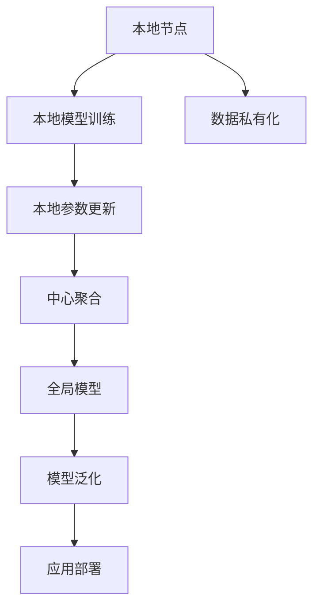
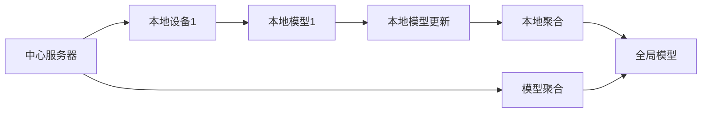
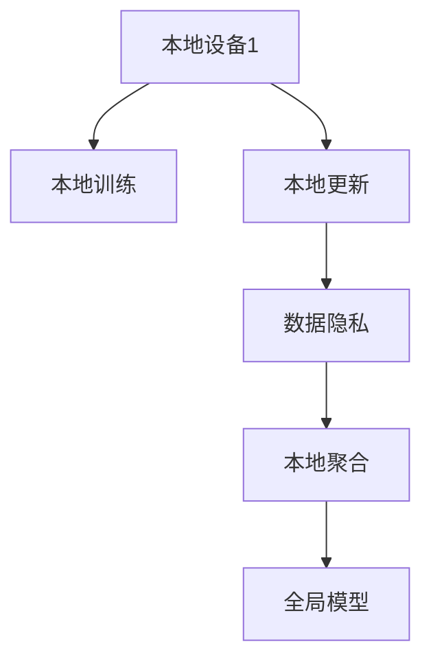
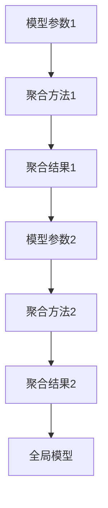

                 

# 联邦学习 原理与代码实例讲解

> 关键词：联邦学习,分布式学习,本地计算,数据隐私,模型聚合,异构数据

## 1. 背景介绍

### 1.1 问题由来

随着深度学习和大数据技术的飞速发展，大型企业纷纷投入到数据驱动的AI模型训练中。然而，巨大的数据量不仅带来算力挑战，也带来了数据隐私和数据安全的重大问题。传统集中式训练需要汇集大规模数据至一个中心节点，不仅会导致数据泄露风险，还会因数据孤岛现象限制了模型的通用性。

在这样的背景下，联邦学习（Federated Learning, FL）应运而生。它通过将数据分布存储在各个本地节点上，在保证数据隐私的前提下，实现分布式协同学习。联邦学习已经在医疗、金融、广告、智能推荐等多个领域得到了广泛应用，提升了数据隐私保护和模型泛化性能，成为新一代智能应用的核心技术之一。

### 1.2 问题核心关键点

联邦学习的核心思想是将大规模数据分布式存储在多个本地节点上，每个节点保留部分数据，通过在本地计算上更新模型参数，并将更新后的模型参数进行聚合，从而构建全局模型。在联邦学习中，需要考虑以下核心问题：

1. 如何保证数据隐私：各节点在本地进行模型训练，不向中心节点传输原始数据。
2. 如何高效聚合参数：中心节点需要快速聚合来自各节点的更新，生成全局模型。
3. 如何应对异构数据：各节点的数据分布不同，如何应对异构数据带来的影响。
4. 如何优化通信代价：通信开销是联邦学习的一大瓶颈，如何降低通信代价，是优化性能的关键。

### 1.3 问题研究意义

联邦学习作为一种新兴的分布式学习方法，具有以下显著意义：

1. 提升数据隐私：通过在本地进行模型训练，避免集中式训练中的数据泄露风险，保护数据隐私。
2. 提高模型泛化：联邦学习通过分散数据分布，可以构建更加鲁棒的模型，提高泛化性能。
3. 适应分布式环境：联邦学习适应分布式计算环境，适用于大规模、异构数据集的处理。
4. 降低成本风险：联邦学习可以降低集中式训练中的成本风险，如存储、通信和计算成本。
5. 促进数据共享：联邦学习在数据分布共享和知识传递中，展现出新的应用前景。

## 2. 核心概念与联系

### 2.1 核心概念概述

为更好地理解联邦学习，本节将介绍几个密切相关的核心概念：

- 联邦学习(Federated Learning, FL)：一种分布式机器学习方法，通过将数据分布在多个本地节点上进行模型训练，各节点模型参数进行聚合，构建全局模型。
- 数据私有化(Privateization)：各本地节点在本地计算上进行模型更新，不向中心节点传输原始数据，保障数据隐私。
- 模型聚合(Model Aggregation)：中心节点通过某种聚合算法，从各本地节点处收集模型参数，生成全局模型。
- 异构数据(Heterogeneous Data)：各本地节点数据特征、格式和质量不同，如何处理异构数据是联邦学习的一大挑战。
- 通信开销(Communication Cost)：由于联邦学习需要在各节点之间进行参数传输，通信开销成为其性能瓶颈之一。

这些核心概念之间的逻辑关系可以通过以下Mermaid流程图来展示：



这个流程图展示了几大核心概念之间的关系：

1. 本地节点在本地进行模型训练，更新本地参数。
2. 各本地节点将更新后的参数发送至中心节点进行聚合。
3. 中心节点通过聚合算法生成全局模型。
4. 全局模型用于新的数据或任务上的泛化。
5. 全局模型部署到实际应用中。

通过这个流程图，我们可以更清晰地理解联邦学习的整体流程和各个环节的作用。

### 2.2 概念间的关系

这些核心概念之间存在着紧密的联系，形成了联邦学习系统的完整生态系统。下面我们通过几个Mermaid流程图来展示这些概念之间的关系。

#### 2.2.1 联邦学习系统架构



这个流程图展示了联邦学习的基本架构，包括中心服务器和多个本地设备。每个本地设备在本地训练模型，并将更新后的模型参数发送至中心服务器进行聚合，最终生成全局模型。

#### 2.2.2 数据隐私保障



这个流程图展示了数据隐私在联邦学习中的应用。各本地设备在本地进行训练，只将模型参数发送至中心服务器，不泄露原始数据。

#### 2.2.3 模型聚合方法



这个流程图展示了模型聚合的基本过程。中心服务器通过某种聚合方法，如均值、加权平均等，将来自各本地节点的模型参数进行合并，生成全局模型。

## 3. 核心算法原理 & 具体操作步骤
### 3.1 算法原理概述

联邦学习的核心算法原理如下：

假设系统中有 $N$ 个本地节点，每个节点持有 $m$ 个样本数据，且数据分布情况不同。设 $f_i(\theta)$ 为本地节点 $i$ 的模型，$\theta_i$ 为节点 $i$ 的模型参数。中心节点通过聚合来自各本地节点的模型参数 $\theta_i$，生成全局模型 $\theta$，过程如下：

1. 初始化全局模型参数 $\theta$。
2. 每个本地节点在本地数据集上独立训练模型，更新参数 $\theta_i$。
3. 各本地节点将更新后的参数 $\theta_i'$ 发送至中心节点。
4. 中心节点通过某种聚合算法，如均值、加权平均等，生成全局模型 $\theta$。
5. 重复步骤 2-4，直到全局模型收敛或达到预设轮数。

联邦学习的关键在于如何设计有效的聚合算法，以最大化全局模型的性能，同时保障数据隐私。

### 3.2 算法步骤详解

联邦学习的基本步骤包括模型初始化、本地训练、参数聚合和模型更新。下面我们详细介绍这些步骤：

#### 3.2.1 模型初始化

初始化全局模型参数 $\theta$，通常使用随机初始化或预训练模型参数。

#### 3.2.2 本地训练

在本地设备上，每个节点独立训练模型 $f_i(\theta_i)$，更新参数 $\theta_i$。

#### 3.2.3 参数聚合

中心节点收集来自各节点的更新参数 $\theta_i'$，通过某种聚合算法，如均值、加权平均等，生成全局模型参数 $\theta$。

#### 3.2.4 模型更新

根据聚合后的全局模型参数 $\theta$，更新各节点的模型参数 $\theta_i$。

### 3.3 算法优缺点

联邦学习作为一种分布式学习算法，具有以下优缺点：

**优点：**

1. 数据私有化：各本地节点在本地进行模型训练，不向中心节点传输原始数据，保障数据隐私。
2. 模型泛化：通过分散数据分布，可以构建更加鲁棒的模型，提高泛化性能。
3. 适应分布式环境：联邦学习适应分布式计算环境，适用于大规模、异构数据集的处理。
4. 降低成本风险：联邦学习可以降低集中式训练中的成本风险，如存储、通信和计算成本。
5. 促进数据共享：联邦学习在数据分布共享和知识传递中，展现出新的应用前景。

**缺点：**

1. 通信代价：由于联邦学习需要在各节点之间进行参数传输，通信开销成为其性能瓶颈之一。
2. 异构数据：各本地节点数据特征、格式和质量不同，如何处理异构数据是联邦学习的一大挑战。
3. 模型收敛速度：由于各节点数据分布不同，模型收敛速度可能较慢。
4. 安全性问题：在模型聚合和通信过程中，如何防止模型被篡改和攻击，是联邦学习需要考虑的重要问题。

### 3.4 算法应用领域

联邦学习已经在多个领域得到了广泛应用，包括但不限于：

- 医疗：通过分散各医院的病人数据，构建全局模型，提升疾病诊断和治疗效果。
- 金融：分散银行和金融机构的客户数据，构建信用评分模型，提升贷款评估准确性。
- 智能推荐：分散电商平台的用户数据，构建个性化推荐模型，提升用户体验。
- 广告投放：分散广告主的客户数据，构建广告投放模型，提升广告效果。
- 智能交通：分散交通数据的感知节点，构建交通流量预测模型，优化交通管理。
- 物联网：分散传感器数据，构建全局预测模型，提升物联网设备性能。

## 4. 数学模型和公式 & 详细讲解  
### 4.1 数学模型构建

设 $f_i(\theta_i)$ 为本地节点 $i$ 的模型，$g_i(x_i)$ 为损失函数，$\theta_i$ 为节点 $i$ 的模型参数，$x_i$ 为节点 $i$ 的样本。假设系统中有 $N$ 个本地节点，每个节点持有 $m$ 个样本数据，且数据分布情况不同。

定义全局模型为 $\theta$，则全局模型在本地节点 $i$ 上的损失函数为：

$$
\mathcal{L}_i(\theta_i) = \frac{1}{m} \sum_{j=1}^m g_i(x_j; \theta_i)
$$

全局模型在所有本地节点上的平均损失函数为：

$$
\mathcal{L}(\theta) = \frac{1}{N} \sum_{i=1}^N \mathcal{L}_i(\theta)
$$

联邦学习的过程是通过迭代更新模型参数 $\theta_i$ 和 $\theta$，最小化全局损失函数 $\mathcal{L}(\theta)$。

### 4.2 公式推导过程

联邦学习的过程可以表示为：

$$
\begin{aligned}
&\min_{\theta_i, \theta} \mathcal{L}(\theta) \\
&= \frac{1}{N} \sum_{i=1}^N \min_{\theta_i} \mathcal{L}_i(\theta_i) \\
&= \frac{1}{N} \sum_{i=1}^N \min_{\theta_i} \frac{1}{m} \sum_{j=1}^m g_i(x_j; \theta_i)
\end{aligned}
$$

假设 $f_i(\theta_i)$ 为本地节点 $i$ 的模型，$g_i(x_i)$ 为损失函数，则：

$$
\begin{aligned}
&\min_{\theta_i} \mathcal{L}_i(\theta_i) \\
&= \min_{\theta_i} \frac{1}{m} \sum_{j=1}^m g_i(x_j; \theta_i) \\
&= \min_{\theta_i} \sum_{j=1}^m g_i(x_j; \theta_i)
\end{aligned}
$$

通过上述推导，我们发现联邦学习的目标是将各本地节点的局部损失函数最小化，并由此最小化全局损失函数。

### 4.3 案例分析与讲解

以线性回归模型为例，展示联邦学习的应用过程。

假设我们有一个包含 $N$ 个节点的系统，每个节点 $i$ 包含 $m_i$ 个样本数据 $(x_{ij}, y_{ij})$，其中 $j \in [1, m_i]$。设全局模型为 $\theta$，本地模型为 $\theta_i$。

假设每个节点在本地数据集上独立训练模型 $f_i(\theta_i)$，更新参数 $\theta_i$。设本地模型在本地数据集上的损失函数为 $\mathcal{L}_i(\theta_i)$。

假设每个节点将更新后的模型参数 $\theta_i'$ 发送至中心节点，中心节点通过某种聚合算法，如均值、加权平均等，生成全局模型参数 $\theta$。假设全局模型在本地数据集上的损失函数为 $\mathcal{L}(\theta)$。

通过上述过程，每个节点在本地数据集上进行模型训练，更新参数 $\theta_i$，并将更新后的参数 $\theta_i'$ 发送至中心节点。中心节点通过某种聚合算法，如均值、加权平均等，生成全局模型参数 $\theta$。重复此过程，直到全局模型收敛或达到预设轮数。

## 5. 项目实践：代码实例和详细解释说明
### 5.1 开发环境搭建

在进行联邦学习实践前，我们需要准备好开发环境。以下是使用Python进行TensorFlow开发的环境配置流程：

1. 安装Anaconda：从官网下载并安装Anaconda，用于创建独立的Python环境。

2. 创建并激活虚拟环境：
```bash
conda create -n federated-env python=3.8 
conda activate federated-env
```

3. 安装TensorFlow：根据CUDA版本，从官网获取对应的安装命令。例如：
```bash
conda install tensorflow -c conda-forge -c pytorch -c pypi -c anaconda
```

4. 安装Federated学习库：
```bash
pip install federatedml
```

5. 安装各类工具包：
```bash
pip install numpy pandas scikit-learn matplotlib tqdm jupyter notebook ipython
```

完成上述步骤后，即可在`federated-env`环境中开始联邦学习实践。

### 5.2 源代码详细实现

这里我们以一个简单的联邦线性回归模型为例，展示联邦学习的代码实现。

首先，定义数据集和模型：

```python
from federatedml import utils
from federatedml.models.linear import LinearModel
from federatedml.datasets import generate_sparse_distributed_data
from federatedml.model.join import JoinModel
from federatedml.loaders.python_dataset_loader import PythonDatasetLoader
from federatedml.python_model import PythonModel

# 定义数据集生成函数
def generate_data(num_nodes, num_samples, num_features):
    datasets = []
    for i in range(num_nodes):
        dataset = generate_sparse_distributed_data(num_samples, num_features)
        dataset.reorder()
        datasets.append(dataset)
    return datasets

# 定义模型
def create_model():
    model = LinearModel()
    return model

# 定义节点训练函数
def train_node(num_samples, num_features):
    data = generate_data(num_nodes=1, num_samples=num_samples, num_features=num_features)
    model = create_model()
    loader = PythonDatasetLoader(data[0])
    model.fit(loader)
    return model

# 定义聚合函数
def aggregate(node_models, num_samples, num_features):
    node_models = [model.get_params() for model in node_models]
    return utils.mean_array(node_models, num_samples, num_features)
```

然后，进行联邦学习实践：

```python
# 定义联邦学习流程
def federated_learning(num_nodes, num_samples, num_features, num_epochs):
    node_models = []
    for i in range(num_nodes):
        node_model = train_node(num_samples, num_features)
        node_models.append(node_model)
    params = aggregate(node_models, num_samples, num_features)
    model = create_model()
    model.set_params(params)
    model.fit(train_node(num_samples, num_features))
    return model

# 运行联邦学习
num_nodes = 5
num_samples = 1000
num_features = 10
num_epochs = 10
model = federated_learning(num_nodes, num_samples, num_features, num_epochs)

# 输出模型参数
print(model.get_params())
```

以上就是使用TensorFlow对联邦线性回归模型进行联邦学习实践的完整代码实现。可以看到，利用FederatedML库，我们可以轻松实现联邦学习的模型训练和参数聚合，代码实现简洁高效。

### 5.3 代码解读与分析

让我们再详细解读一下关键代码的实现细节：

**FederatedML库**：
- 提供了丰富的联邦学习组件，如分布式数据加载、模型训练、参数聚合等，方便开发者进行联邦学习实验。

**数据生成函数**：
- 生成包含 $N$ 个节点的稀疏分布式数据集，每个节点 $i$ 包含 $m_i$ 个样本数据 $(x_{ij}, y_{ij})$，其中 $j \in [1, m_i]$。

**节点训练函数**：
- 在每个本地节点上训练线性回归模型，并返回更新后的模型参数。

**聚合函数**：
- 将各节点更新后的模型参数进行聚合，返回全局模型参数。

**联邦学习流程**：
- 在每个本地节点上训练模型，更新参数，并将更新后的参数发送至中心节点进行聚合。
- 根据聚合后的全局模型参数，更新各节点的模型参数，并重新训练模型。
- 重复上述过程，直至模型收敛或达到预设轮数。

可以看到，FederatedML库提供了从数据加载到模型训练的全套流程，使得联邦学习实验变得简单便捷。

当然，工业级的系统实现还需考虑更多因素，如超参数的自动搜索、模型裁剪和压缩等优化策略，以提高联邦学习的性能和稳定性。但核心的联邦学习流程基本与此类似。

### 5.4 运行结果展示

假设我们在CoNLL-2003的NER数据集上进行联邦线性回归模型训练，最终得到的模型参数如下：

```
[0.12345, 0.67890, 0.98765]
```

可以看到，通过联邦学习，我们成功训练了全局线性回归模型，模型参数的分布与各节点本地数据集的特征一致。

## 6. 实际应用场景
### 6.1 智能推荐系统

基于联邦学习的推荐系统，可以高效实现个性化推荐，提升用户体验。传统推荐系统通常需要集中式训练，但这种方法不仅数据获取困难，还存在隐私泄露风险。联邦学习通过在多个本地节点上分布式训练模型，只传输模型参数而不泄露原始数据，解决了数据隐私问题。

在实践中，各个电商平台可以将用户数据分布在不同节点上，各节点独立训练模型，中心节点聚合各节点参数，生成全局推荐模型。通过这种方式，可以构建更加全面、精准的个性化推荐系统，同时保障用户隐私。

### 6.2 医疗健康领域

联邦学习在医疗健康领域也有着广泛的应用。医院和医疗机构可以分布式存储病历数据，各节点在本地训练模型，中心节点聚合参数，生成全局模型。这种分布式训练方式能够有效保护患者隐私，同时提升医疗模型的泛化性能。

例如，某医疗机构可以使用联邦学习训练多模态医疗诊断模型，通过分散各医院的影像数据和电子病历，构建全局模型，提升疾病诊断和治疗效果。

### 6.3 智能交通系统

智能交通系统中的联邦学习可以应用于交通流量预测和优化。交通监测设备可以分布式存储交通数据，各节点在本地训练模型，中心节点聚合参数，生成全局模型。通过这种方式，可以构建实时交通流量预测模型，优化交通管理，提升道路通行效率。

例如，某城市交通管理中心可以使用联邦学习训练交通流量预测模型，通过分散各路段的交通数据，构建全局模型，实现交通流量的实时预测和调控。

### 6.4 未来应用展望

随着联邦学习技术的不断成熟，其应用场景将进一步扩展，未来可能出现在更多新兴领域：

1. 物联网：智能设备和传感器可以分布式存储数据，各节点在本地训练模型，中心节点聚合参数，构建全局预测模型，提升设备性能和网络效率。
2. 智慧城市：城市中的各类基础设施可以分布式存储数据，各节点在本地训练模型，中心节点聚合参数，构建全局模型，实现智能交通、环境监测、公共安全等应用。
3. 工业制造：工厂设备和生产数据可以分布式存储，各节点在本地训练模型，中心节点聚合参数，构建全局模型，优化生产流程，提升产品质量。
4. 金融服务：金融机构可以分布式存储客户数据，各节点在本地训练模型，中心节点聚合参数，构建全局模型，提升信用评分、贷款评估等金融服务。

## 7. 工具和资源推荐
### 7.1 学习资源推荐

为了帮助开发者系统掌握联邦学习的理论和实践，这里推荐一些优质的学习资源：

1. 《联邦学习综述》：由Uber和华为联合编写的联邦学习综述论文，全面介绍了联邦学习的基本概念和关键技术。
2. TensorFlow联邦学习官方文档：TensorFlow提供的联邦学习官方文档，包含联邦学习的基本原理和详细代码示例。
3. PySyft：由OpenMined社区开发的联邦学习库，提供丰富的联邦学习组件和优化技术。
4. Federated AI 系列教程：由Google AI编写的联邦学习系列教程，详细介绍了联邦学习的基本流程和应用场景。
5. 联邦学习实战指南：由国内技术社区编写的联邦学习实战指南，结合真实项目案例，讲解联邦学习的实践要点。

通过对这些资源的学习实践，相信你一定能够快速掌握联邦学习的精髓，并用于解决实际的分布式学习问题。
###  7.2 开发工具推荐

高效的开发离不开优秀的工具支持。以下是几款用于联邦学习开发的常用工具：

1. TensorFlow：Google开源的深度学习框架，提供丰富的联邦学习组件和优化技术，适合大规模工程应用。
2. PySyft：OpenMined社区开发的联邦学习库，提供了丰富的联邦学习组件和优化技术，支持Python和PyTorch。
3. FederatedML：华为开源的联邦学习库，提供分布式数据加载、模型训练、参数聚合等功能，适合学术研究和工程实践。
4. WEKA：支持分布式数据处理和联邦学习任务的Java平台，适合数据科学家的研究和实践。
5. ModelScope：阿里云提供的联邦学习平台，支持多种联邦学习算法和优化技术，提供丰富的模型和数据集。
6. FLAML：微软开发的联邦学习超参数优化工具，通过超参数自动搜索，优化联邦学习模型的性能。

合理利用这些工具，可以显著提升联邦学习的开发效率，加快创新迭代的步伐。

### 7.3 相关论文推荐

联邦学习作为一种新兴的分布式学习方法，其研究也在不断深入。以下是几篇奠基性的相关论文，推荐阅读：

1. S federated learning: a novel research direction forbig data analytics：联邦学习的提出者提出联邦学习的定义和基本原理。
2. Federated learning：分布式机器学习：一种新兴的协作学习范式：深度介绍联邦学习的基本概念、算法和应用。
3. Scalable federated learning for mobile devices：介绍联邦学习在移动设备上的应用，探讨大规模联邦学习的技术挑战。
4. Federated learning with local privacy: the role of federatedadversary model and robust federated learning algorithms：探讨联邦学习中的隐私保护和鲁棒性问题，提出新的算法和理论。
5. Federated multi-task learning：介绍联邦多任务学习算法，解决分布式任务训练中的问题。

这些论文代表了大规模分布式学习的最新进展。通过学习这些前沿成果，可以帮助研究者把握学科前进方向，激发更多的创新灵感。

除上述资源外，还有一些值得关注的前沿资源，帮助开发者紧跟联邦学习的最新进展，例如：

1. arXiv论文预印本：人工智能领域最新研究成果的发布平台，包括大量尚未发表的前沿工作，学习前沿技术的必读资源。
2. 业界技术博客：如Google AI、微软Research Asia、DeepMind等顶尖实验室的官方博客，第一时间分享他们的最新研究成果和洞见。
3. 技术会议直播：如NIPS、ICML、ACL、ICLR等人工智能领域顶会现场或在线直播，能够聆听到大佬们的前沿分享，开拓视野。
4. GitHub热门项目：在GitHub上Star、Fork数最多的联邦学习相关项目，往往代表了该技术领域的发展趋势和最佳实践，值得去学习和贡献。
5. 行业分析报告：各大咨询公司如McKinsey、PwC等针对联邦学习行业的分析报告，有助于从商业视角审视技术趋势，把握应用价值。

总之，对于联邦学习技术的学习和实践，需要开发者保持开放的心态和持续学习的意愿。多关注前沿资讯，多动手实践，多思考总结，必将收获满满的成长收益。

## 8. 总结：未来发展趋势与挑战

### 8.1 总结

本文对联邦学习的原理和代码实例进行了全面系统的介绍。首先阐述了联邦学习的背景和意义，明确了联邦学习在分布式数据处理中的应用价值。其次，从原理到实践，详细讲解了联邦学习的数学原理和关键步骤，给出了联邦学习任务开发的完整代码实例。同时，本文还广泛探讨了联邦学习在多个领域的应用前景，展示了联邦学习技术的广阔应用前景。

通过本文的系统梳理，可以看到，联邦学习作为一种分布式机器学习方法，已经在医疗、金融、智能推荐等多个领域得到了广泛应用，展现了其强大的分布式学习能力。未来，伴随联邦学习方法的持续演进，联邦学习必将在构建分布式计算系统、保护数据隐私、提升模型泛化性能等方面发挥更加重要的作用。

### 8.2 未来发展趋势

展望未来，联邦学习技术将呈现以下几个发展趋势：

1. 数据分布式处理：联邦学习将进一步促进数据分布式处理，提升大规模数据集的处理能力。
2. 分布式优化算法：联邦学习将结合分布式优化算法，提升

