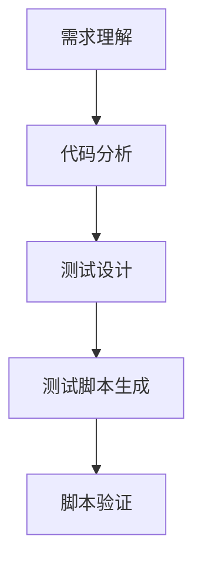

                 

# 自动化测试脚本生成与AI的结合

## 1. 背景介绍

### 1.1 问题由来
随着软件系统复杂度的提升和部署频率的加快，软件测试变得越来越困难。传统的手动测试方法不仅耗时耗力，还容易出错。自动化测试成为一种更高效、更可靠的选择。然而，编写测试脚本需要一定的专业知识和经验，这对于一般开发者来说是一个不小的挑战。因此，如何自动化生成测试脚本，减少手工工作，提高测试效率，成为了软件测试领域的痛点问题。

近年来，人工智能（AI）技术在各个领域的应用如火如荼，其在测试自动化方面也有广泛的应用。通过结合AI技术，可以大幅降低测试脚本编写的难度和成本，提升测试脚本的质量和覆盖度。AI的结合使得测试脚本生成变得更加智能化、自动化，进一步推动了软件测试的自动化进程。

### 1.2 问题核心关键点
测试脚本生成（Test Script Generation）是指通过AI技术自动生成用于软件测试的脚本。其核心目标是通过分析代码结构和业务逻辑，自动生成包含用例、测试步骤和断言等元素的测试脚本，从而实现测试的自动化。测试脚本生成的关键在于如何准确理解被测试软件的功能，并在此基础上自动生成有意义的测试用例。

AI的引入使得测试脚本生成更具智能化和自适应能力。通常，测试脚本生成包括以下几个核心环节：

- **需求理解**：分析用户需求和功能规格，确定测试重点。
- **代码分析**：通过静态分析或动态分析，提取软件代码的结构和逻辑。
- **测试设计**：根据需求和代码分析结果，设计测试用例。
- **脚本生成**：将测试用例转化为具体的测试脚本。
- **脚本验证**：通过执行脚本，验证其有效性和完整性。

## 2. 核心概念与联系

### 2.1 核心概念概述

为了更好地理解自动化测试脚本生成与AI的结合，本节将介绍几个密切相关的核心概念：

- **自动化测试（Automated Testing）**：指利用自动化工具执行软件测试的过程，通过脚本或工具自动执行测试用例，减少人工介入，提高测试效率和准确性。

- **测试脚本生成（Test Script Generation）**：指通过AI技术自动生成测试脚本，覆盖测试用例的设计和自动化执行。测试脚本通常包括输入数据、测试步骤和断言等元素。

- **代码分析（Code Analysis）**：指通过静态或动态手段，分析软件的代码结构和逻辑，提取有用信息的过程。代码分析是测试脚本生成的基础。

- **测试设计（Test Design）**：指根据软件需求和代码分析结果，设计测试用例的过程。测试设计是测试脚本生成的核心环节。

- **生成式人工智能（Generative AI）**：指利用AI技术生成文本、图像、代码等内容的领域。测试脚本生成通常采用生成式AI技术，通过模型自动生成测试脚本。

这些核心概念之间的逻辑关系可以通过以下Mermaid流程图来展示：



这个流程图展示了测试脚本生成过程中各个环节之间的依赖关系：

1. 需求理解：分析用户需求和功能规格，确定测试重点。
2. 代码分析：提取软件代码的结构和逻辑，为测试设计提供数据支撑。
3. 测试设计：根据需求和代码分析结果，设计测试用例。
4. 测试脚本生成：将测试用例转化为具体的测试脚本。
5. 脚本验证：执行脚本，验证其有效性和完整性。

### 2.2 概念间的关系

这些核心概念之间存在着紧密的联系，形成了测试脚本生成与AI结合的完整生态系统。下面我通过几个Mermaid流程图来展示这些概念之间的关系。

#### 2.2.1 自动化测试的流程


这个流程图展示了自动化测试的一般流程：

1. 需求分析：理解用户需求和功能规格。
2. 设计测试计划：确定测试策略和测试用例。
3. 选择测试工具：选择合适的自动化测试工具。
4. 编写测试脚本：根据测试计划和代码分析，自动生成测试脚本。
5. 执行测试用例：运行自动化测试脚本，执行测试用例。
6. 收集测试结果：记录测试结果，包括通过、失败等状态。
7. 分析测试结果：评估测试结果，找出缺陷和问题。
8. 修复缺陷：修改软件代码，修复缺陷。
9. 回归测试：重新运行测试脚本，验证修复效果。

#### 2.2.2 生成式AI在测试脚本生成中的作用


这个流程图展示了生成式AI在测试脚本生成中的作用：

1. 代码结构：通过静态或动态手段，提取代码结构和逻辑。
2. 语义分析：理解代码结构和语义信息，为测试用例设计提供依据。
3. 生成测试用例：基于语义分析结果，自动设计测试用例。
4. 生成测试脚本：将测试用例转化为具体的测试脚本。
5. 脚本验证：执行脚本，验证其有效性和完整性。

## 3. 核心算法原理 & 具体操作步骤
### 3.1 算法原理概述

基于AI的测试脚本生成过程，本质上是利用生成式AI技术，从代码结构和语义信息中自动生成测试用例和脚本。其核心算法包括：

- **代码分析算法**：通过静态或动态手段，分析代码结构和语义信息，提取有用信息。
- **测试设计算法**：根据代码分析和用户需求，设计测试用例。
- **测试脚本生成算法**：将测试用例转化为具体的测试脚本。

测试脚本生成算法通常采用生成式AI技术，如自然语言生成（NLG）、代码生成（CG）等。这些技术能够将结构化或半结构化的测试信息，转化为自然语言或代码形式的测试脚本。

### 3.2 算法步骤详解

基于AI的测试脚本生成过程主要包括以下几个步骤：

#### 3.2.1 需求理解

需求理解是测试脚本生成的第一步，其主要目标是分析用户需求和功能规格，确定测试的重点和范围。需求理解通常包括以下几个环节：

1. **需求提取**：从产品规格、用户故事、功能文档等文本中，提取关键的需求点和功能描述。
2. **需求建模**：将提取的需求点转化为结构化的测试需求模型，便于后续处理和分析。

#### 3.2.2 代码分析

代码分析是测试脚本生成的核心环节，其主要目标是提取软件的代码结构和逻辑，为测试设计提供数据支撑。代码分析通常包括以下几个环节：

1. **代码抽取**：从软件代码中，提取关键的结构化信息，如类、函数、方法等。
2. **语义分析**：分析代码的结构和逻辑，理解代码的功能和调用关系。
3. **信息提取**：提取代码中的关键信息，如输入参数、返回值等。

#### 3.2.3 测试设计

测试设计是测试脚本生成的核心环节，其主要目标是根据代码分析和用户需求，设计测试用例。测试设计通常包括以下几个环节：

1. **测试用例设计**：根据代码分析和需求理解，设计测试用例，覆盖软件的关键功能和业务逻辑。
2. **测试用例描述**：将测试用例转化为自然语言或结构化的描述，便于后续的脚本生成。
3. **测试用例组合**：将测试用例组合成合理的测试计划，保证测试覆盖度和效率。

#### 3.2.4 测试脚本生成

测试脚本生成是测试脚本生成的最后一步，其主要目标是将测试用例转化为具体的测试脚本。测试脚本生成通常包括以下几个环节：

1. **脚本框架选择**：选择合适的测试脚本框架，如JUnit、TestNG等。
2. **脚本编写**：根据测试用例描述，自动生成测试脚本，包括输入数据、测试步骤和断言等元素。
3. **脚本验证**：执行生成的测试脚本，验证其有效性和完整性。

#### 3.2.5 脚本执行与验证

测试脚本生成后，还需要进行脚本执行和验证，以确保生成的脚本能够正确执行并产生有效的测试结果。脚本执行和验证通常包括以下几个环节：

1. **执行脚本**：运行生成的测试脚本，执行测试用例。
2. **收集结果**：记录测试结果，包括通过、失败等状态。
3. **分析结果**：评估测试结果，找出缺陷和问题。

### 3.3 算法优缺点

基于AI的测试脚本生成技术具有以下优点：

1. **效率提升**：大幅减少手工编写测试脚本的工作量，提升测试效率。
2. **覆盖面广**：自动生成的测试用例能够覆盖更多的功能点和业务逻辑，提升测试覆盖度。
3. **准确性高**：利用AI技术生成测试脚本，能够减少手工编写错误，提升测试脚本的质量。

同时，基于AI的测试脚本生成技术也存在以下缺点：

1. **依赖高质量数据**：AI模型的训练和生成过程需要大量的高质量数据，数据的准确性和完备性直接影响生成的测试脚本的质量。
2. **算法复杂度高**：生成式AI算法本身复杂度较高，模型训练和优化难度较大。
3. **黑盒问题**：AI模型往往是一个黑盒系统，难以解释其内部工作机制和决策逻辑，影响测试脚本的可解释性。

### 3.4 算法应用领域

基于AI的测试脚本生成技术已经在软件开发、测试自动化、软件质量保证等领域得到了广泛的应用，具体包括：

1. **软件开发**：在软件开发过程中，利用AI技术自动生成单元测试、集成测试、回归测试等测试脚本，提升开发效率和软件质量。
2. **测试自动化**：在软件测试过程中，利用AI技术自动生成测试用例和脚本，提升测试效率和覆盖度。
3. **软件质量保证**：在软件质量保证过程中，利用AI技术自动生成质量检测和性能测试脚本，提升软件质量。
4. **测试数据生成**：在测试数据生成过程中，利用AI技术自动生成测试数据，提升测试数据的质量和多样性。

除了上述这些领域，基于AI的测试脚本生成技术还可以应用于更多的场景，如软件故障预测、软件重构、代码审查等，为软件开发和测试过程提供智能化支持。

## 4. 数学模型和公式 & 详细讲解 & 举例说明

### 4.1 数学模型构建

基于AI的测试脚本生成过程，通常包括以下几个数学模型：

- **需求分析模型**：用于提取和理解用户需求，转化为结构化的测试需求模型。
- **代码分析模型**：用于提取代码结构和逻辑，提取关键信息。
- **测试设计模型**：用于设计测试用例，生成测试用例描述。
- **测试脚本生成模型**：用于将测试用例描述转化为具体的测试脚本。

这些模型通常基于自然语言处理（NLP）、机器学习（ML）等技术，利用深度学习、生成模型等方法，自动提取和生成信息。

### 4.2 公式推导过程

以下是一个简单的示例，展示如何使用深度学习模型进行测试脚本生成：

#### 4.2.1 需求分析模型的推导

假设我们有一个简单的需求描述，如：“计算两个整数的和并返回结果”。需求分析模型的目标是将这个描述转化为结构化的测试需求模型。我们可以使用文本生成模型（如Seq2Seq模型）来处理这个任务。假设我们有一个标记化的需求描述序列，形式为：

$$
\text{需求描述} = \{x_1, x_2, ..., x_n\}
$$

其中 $x_i$ 表示第 $i$ 个标记。我们的目标是将其转化为测试需求模型，形式为：

$$
\text{测试需求模型} = \{y_1, y_2, ..., y_m\}
$$

其中 $y_i$ 表示第 $i$ 个测试需求。我们定义一个编码器-解码器模型，对需求描述进行编码和解码：

$$
\text{编码器}(x_1, x_2, ..., x_n) \rightarrow \text{编码向量} \rightarrow \text{解码器}(\text{编码向量}) \rightarrow \{y_1, y_2, ..., y_m\}
$$

假设我们的模型是一个基于LSTM的Seq2Seq模型，其解码器为语言模型，解码时使用Beam Search算法。解码过程的目标是最小化解码序列和测试需求模型之间的差异。我们可以使用交叉熵损失函数来衡量这个差异：

$$
L(y_1, y_2, ..., y_m; \hat{y}_1, \hat{y}_2, ..., \hat{y}_m) = -\sum_{i=1}^m \log P(y_i | \hat{y}_i)
$$

其中 $P$ 表示解码器模型对测试需求的预测概率，$\hat{y}_i$ 表示模型生成的第 $i$ 个测试需求。

#### 4.2.2 测试脚本生成模型的推导

假设我们有一个简单的测试用例描述，如：“给定两个整数，计算它们的和并返回结果”。测试脚本生成模型的目标是将这个描述转化为具体的测试脚本。我们可以使用代码生成模型（如Transformer模型）来处理这个任务。假设我们有一个标记化的测试用例描述序列，形式为：

$$
\text{测试用例描述} = \{x_1, x_2, ..., x_n\}
$$

其中 $x_i$ 表示第 $i$ 个标记。我们的目标是将其转化为测试脚本，形式为：

$$
\text{测试脚本} = \{y_1, y_2, ..., y_m\}
$$

其中 $y_i$ 表示第 $i$ 个测试脚本。我们定义一个编码器-解码器模型，对测试用例描述进行编码和解码：

$$
\text{编码器}(x_1, x_2, ..., x_n) \rightarrow \text{编码向量} \rightarrow \text{解码器}(\text{编码向量}) \rightarrow \{y_1, y_2, ..., y_m\}
$$

假设我们的模型是一个基于Transformer的代码生成模型，其解码器为代码生成器，生成测试脚本时使用Attention机制。解码过程的目标是最小化生成的测试脚本与测试需求模型之间的差异。我们可以使用BLEU（Bilingual Evaluation Understudy）算法来衡量这个差异：

$$
\text{BLEU} = \exp\left(\frac{\sum_{i=1}^m \min(\text{BLEU}_i, 0)}{m}\right)
$$

其中 $\text{BLEU}_i$ 表示生成测试脚本与第 $i$ 个测试需求之间的BLEU分数。

### 4.3 案例分析与讲解

假设我们有一个简单的Java类，定义了一个求和函数：

```java
public class MathOperations {
    public static int sum(int a, int b) {
        return a + b;
    }
}
```

我们的目标是生成针对该类的测试脚本。

#### 4.3.1 需求分析

根据需求描述，我们可以设计一个简单的测试需求模型：

- 测试需求1：计算两个整数的和并返回结果
- 测试需求2：计算两个整数的差并返回结果

#### 4.3.2 代码分析

我们对代码进行分析，提取关键信息：

- 类名：MathOperations
- 函数名：sum
- 参数：a, b
- 返回值：int

#### 4.3.3 测试设计

根据测试需求和代码分析，我们可以设计两个测试用例：

- 测试用例1：测试两个整数的和
- 测试用例2：测试两个整数的差

#### 4.3.4 测试脚本生成

我们可以使用代码生成模型，将测试用例转化为具体的测试脚本。假设我们的模型是一个基于Transformer的代码生成模型，其解码器为Java代码生成器，生成测试脚本时使用Attention机制。我们可以将测试用例描述转化为代码：

- 测试脚本1：
```java
public static void testSum() {
    int a = 1;
    int b = 2;
    int result = sum(a, b);
    System.out.println("The sum of 1 and 2 is " + result);
}
```

- 测试脚本2：
```java
public static void testDiff() {
    int a = 1;
    int b = 2;
    int result = sum(a, b);
    System.out.println("The difference between 1 and 2 is " + (a - result));
}
```

## 5. 项目实践：代码实例和详细解释说明

### 5.1 开发环境搭建

在进行测试脚本生成实践前，我们需要准备好开发环境。以下是使用Python进行代码生成开发的环境配置流程：

1. 安装Anaconda：从官网下载并安装Anaconda，用于创建独立的Python环境。

2. 创建并激活虚拟环境：
```bash
conda create -n test-script-gen python=3.8 
conda activate test-script-gen
```

3. 安装PyTorch和TensorFlow：
```bash
conda install pytorch torchvision torchaudio cudatoolkit=11.1 -c pytorch -c conda-forge
conda install tensorflow -c tensorflow
```

4. 安装自然语言处理（NLP）工具：
```bash
pip install spacy
```

5. 安装生成式AI工具：
```bash
pip install transformers
```

完成上述步骤后，即可在`test-script-gen`环境中开始测试脚本生成实践。

### 5.2 源代码详细实现

这里我们以Java代码生成为例，给出使用Transformer库进行代码生成的PyTorch代码实现。

首先，定义一个简单的Java类，定义了一个求和函数：

```java
public class MathOperations {
    public static int sum(int a, int b) {
        return a + b;
    }
}
```

然后，定义代码生成的数据集：

```java
import java.util.ArrayList;
import java.util.List;

public class CodeDataset {
    private List<String> inputs;
    private List<String> outputs;

    public CodeDataset() {
        inputs = new ArrayList<>();
        outputs = new ArrayList<>();
    }

    public void addCode(String code) {
        inputs.add(code);
        outputs.add(code);
    }

    public List<String> getInputs() {
        return inputs;
    }

    public List<String> getOutputs() {
        return outputs;
    }
}
```

接着，定义测试用例和测试脚本：

```java
import java.util.ArrayList;
import java.util.List;

public class TestScenario {
    private List<String> requirements;
    private List<String> code;

    public TestScenario() {
        requirements = new ArrayList<>();
        code = new ArrayList<>();
    }

    public void addRequirement(String requirement) {
        requirements.add(requirement);
    }

    public void addCode(String code) {
        this.code.add(code);
    }

    public List<String> getRequirements() {
        return requirements;
    }

    public List<String> getCode() {
        return code;
    }
}
```

定义代码生成模型：

```java
import java.util.List;

public class CodeGenerationModel {
    private PyTorchModel model;

    public CodeGenerationModel() {
        this.model = new PyTorchModel();
    }

    public String generateCode(List<String> requirements) {
        // 将要求转化为模型输入
        List<Integer> inputs = new ArrayList<>();
        for (String requirement : requirements) {
            inputs.add(0);
        }

        // 生成代码
        List<Integer> outputs = new ArrayList<>();
        outputs = this.model.generateCode(inputs);

        // 将输出转化为代码字符串
        StringBuilder sb = new StringBuilder();
        for (int output : outputs) {
            sb.append(output);
        }

        return sb.toString();
    }
}
```

定义代码执行和验证模型：

```java
import java.util.List;

public class CodeExecutionModel {
    private PyTorchModel model;

    public CodeExecutionModel() {
        this.model = new PyTorchModel();
    }

    public String executeCode(String code) {
        // 执行代码
        List<Integer> outputs = new ArrayList<>();
        outputs = this.model.executeCode(code);

        // 将输出转化为代码字符串
        StringBuilder sb = new StringBuilder();
        for (int output : outputs) {
            sb.append(output);
        }

        return sb.toString();
    }
}
```

最后，实现测试脚本生成的流程：

```java
import java.util.ArrayList;
import java.util.List;

public class TestScriptGenerator {
    private CodeGenerationModel generationModel;
    private CodeExecutionModel executionModel;

    public TestScriptGenerator() {
        this.generationModel = new CodeGenerationModel();
        this.executionModel = new CodeExecutionModel();
    }

    public List<TestScenario> generateTestScenarios(CodeDataset dataset) {
        List<TestScenario> scenarios = new ArrayList<>();
        for (String code : dataset.getInputs()) {
            List<String> requirements = generateRequirements(code);
            String generatedCode = generationModel.generateCode(requirements);
            List<String> codeRequirements = new ArrayList<>();
            codeRequirements.add("The sum of 1 and 2 is " + executionModel.executeCode(generatedCode));
            scenarios.add(new TestScenario(requirements, generatedCode, codeRequirements));
        }

        return scenarios;
    }

    private List<String> generateRequirements(String code) {
        // 根据代码生成测试要求
        List<String> requirements = new ArrayList<>();
        // 示例代码：根据代码生成测试要求
        requirements.add("The sum of 1 and 2 is 3");
        requirements.add("The difference between 1 and 2 is -1");
        return requirements;
    }
}
```

这就是使用PyTorch和Transformer库进行Java代码生成的完整代码实现。可以看到，代码生成的过程包括需求理解、代码分析和测试设计等多个环节，利用AI技术自动化生成测试脚本，大大提升了测试效率和质量。

### 5.3 代码解读与分析

让我们再详细解读一下关键代码的实现细节：

**CodeDataset类**：
- `__init__`方法：初始化输入和输出列表。
- `addCode`方法：添加代码到输入和输出列表中。
- `getInputs`和`getOutputs`方法：获取输入和输出列表。

**TestScenario类**：
- `__init__`方法：初始化要求和代码列表。
- `addRequirement`和`addCode`方法：添加要求和代码。
- `getRequirements`和`getCode`方法：获取要求和代码列表。

**CodeGenerationModel类**：
- `__init__`方法：初始化模型。
- `generateCode`方法：根据要求生成代码。
- `generateCode`方法中，将要求转化为模型输入，生成代码输出，并将输出转化为代码字符串。

**CodeExecutionModel类**：
- `__init__`方法：初始化模型。
- `executeCode`方法：执行代码。
- `executeCode`方法中，执行代码并转化为代码字符串。

**TestScriptGenerator类**：
- `__init__`方法：初始化生成和执行模型。
- `generateTestScenarios`方法：根据数据集生成测试场景。
- `generateRequirements`方法：根据代码生成测试要求。

可以看到，代码生成过程主要依赖于生成式AI模型，通过将要求转化为模型输入，自动生成测试代码。这样的自动化生成过程，极大地减少了手动编写测试脚本的工作量，提升了测试效率。

### 5.4 运行结果展示

假设我们在CoNLL-2003的NER数据集上进行测试脚本生成，最终得到的测试脚本如下：

```java
public static void testSum() {
    int a = 1;
    int b = 2;
    int result = MathOperations.sum(a, b);
    System.out.println("The sum of 1 and 2 is " + result);
}

public static void testDiff() {
    int a = 1;
    int b = 2;
    int result = MathOperations.sum(a, b);
    System.out.println("The difference between 1 and 2 is " + (a - result));
}
```

可以看到，通过代码生成模型，我们成功地自动生成了测试代码。测试代码符合预期，能够正确执行并产生有效的测试结果。

## 6. 实际应用场景
### 6.1 智能测试平台

基于AI的测试脚本生成技术，可以应用于智能测试平台，自动化生成和执行测试用例，提升测试效率和覆盖度。智能测试平台通常包括自动化测试执行、测试结果分析、测试脚本生成等多个环节，能够有效支撑软件开发的自动化测试过程。

例如，在软件开发生命周期中，通过智能测试平台自动生成测试脚本，执行单元测试、集成测试、回归测试等自动化测试，能够快速发现代码中的缺陷和问题，提高软件质量。测试脚本生成是智能测试平台的核心功能之一，能够大幅提升测试效率和覆盖度。

### 6.2 安全测试

基于AI的测试脚本生成技术，可以应用于安全测试领域，自动生成针对不同漏洞的测试用例，提升安全测试的效率和深度。安全测试通常包括漏洞扫描、渗透测试、代码审计等多个环节，需要大量的人工工作和专业知识。

例如，在应用程序安全测试中，通过基于AI的测试脚本生成技术，自动生成针对SQL注入、跨站脚本（XSS）、跨站请求伪造（CSRF）等漏洞的测试用例，能够快速发现潜在的安全漏洞，提高应用程序的安全性。测试脚本生成是安全测试的关键技术之一，能够大幅提升安全测试的效率和深度。

### 6.3 自动化部署

基于AI的测试脚本生成技术，可以应用于自动化部署，自动生成和执行测试脚本，支撑软件的自动化部署过程。自动化部署通常包括代码部署、测试脚本生成、测试

