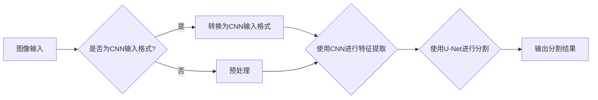
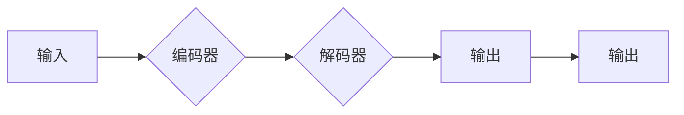

# Image Segmentation 原理与代码实战案例讲解

> 关键词：图像分割，深度学习，卷积神经网络，U-Net，语义分割，实例分割，目标检测

## 1. 背景介绍

图像分割是计算机视觉领域的一项基本任务，它旨在将图像中的像素或区域划分为不同的类别或实例。这一技术广泛应用于医学影像分析、自动驾驶、卫星图像处理、遥感监测等领域。随着深度学习技术的飞速发展，基于深度学习的图像分割方法取得了显著的进展，成为了当前图像分割领域的主流技术。

## 2. 核心概念与联系

### 2.1 核心概念

- **图像分割**：将图像中的像素或区域划分为不同的类别或实例。
- **深度学习**：一种通过模拟人脑神经网络结构，进行数据学习与分析的机器学习方法。
- **卷积神经网络（CNN）**：一种特殊的神经网络，在图像处理和计算机视觉领域得到了广泛应用。
- **U-Net**：一种经典的卷积神经网络架构，特别适用于图像分割任务。
- **语义分割**：将图像中的每个像素点划分为不同的语义类别。
- **实例分割**：不仅将像素点划分为不同的语义类别，还能区分同一类别中不同的实例。

### 2.2 Mermaid 流程图



### 2.3 核心概念联系

图像分割任务需要深度学习模型对图像进行特征提取和分类。卷积神经网络（CNN）因其强大的特征提取能力，成为了图像分割任务的首选模型。U-Net架构因其独特的结构，能够有效地进行上下文信息传递，在图像分割任务中取得了优异的性能。

## 3. 核心算法原理 & 具体操作步骤

### 3.1 算法原理概述

基于深度学习的图像分割算法通常采用以下步骤：

1. **数据预处理**：对图像进行缩放、裁剪、归一化等操作，使其符合CNN输入格式。
2. **特征提取**：使用CNN提取图像特征。
3. **分割**：使用U-Net或其他分割网络对特征图进行分割，得到分割结果。

### 3.2 算法步骤详解

1. **数据预处理**：根据数据集的特点，对图像进行预处理，如裁剪、缩放、归一化等操作。
2. **特征提取**：使用预训练的CNN模型（如ResNet、VGG等）提取图像特征。
3. **分割**：将特征图输入U-Net模型进行分割。U-Net模型由编码器和解码器组成，编码器负责提取特征，解码器负责融合上下文信息并进行细化。

### 3.3 算法优缺点

- **优点**：基于深度学习的图像分割算法具有以下优点：
  - 强大的特征提取能力；
  - 能够自动学习图像特征，无需人工设计特征；
  - 具有良好的鲁棒性，能够适应不同的图像变化。
- **缺点**：基于深度学习的图像分割算法也存在以下缺点：
  - 计算量大，训练时间较长；
  - 需要大量的训练数据；
  - 模型复杂度高，难以解释。

### 3.4 算法应用领域

基于深度学习的图像分割算法在以下领域得到了广泛应用：

- 医学影像分析：如肿瘤检测、病变识别、器官分割等；
- 自动驾驶：如车道线检测、障碍物检测、交通标志识别等；
- 智能监控：如目标检测、人脸识别、行为识别等；
- 景观分析：如地物分类、建筑提取、水体分割等。

## 4. 数学模型和公式 & 详细讲解 & 举例说明

### 4.1 数学模型构建

基于深度学习的图像分割算法的数学模型主要包括以下部分：

- **卷积神经网络（CNN）**：使用卷积操作提取图像特征。
- **激活函数**：如ReLU、Sigmoid、Tanh等，用于非线性变换。
- **池化操作**：如最大池化、平均池化等，用于降低特征图尺寸，减少计算量。
- **损失函数**：如交叉熵损失、Dice损失等，用于衡量预测结果与真实标签之间的差异。

### 4.2 公式推导过程

以下以交叉熵损失函数为例，进行公式推导：

假设模型预测的概率分布为 $\hat{y}$，真实标签为 $y$，则交叉熵损失函数为：

$$
L = -\sum_{i=1}^N y_i \log \hat{y_i}
$$

其中 $N$ 为样本数量，$y_i$ 和 $\hat{y_i}$ 分别为真实标签和预测概率。

### 4.3 案例分析与讲解

以U-Net模型为例，讲解其工作原理：

U-Net是一种典型的卷积神经网络架构，其特点如下：

- 编码器和解码器结构：编码器负责提取特征，解码器负责融合上下文信息并进行细化。
- 跳连连接：编码器和解码器之间通过跳连连接进行信息传递，使得解码器能够获取到更多的上下文信息。
- 反卷积操作：用于将解码器输出的特征图尺寸与编码器输出相匹配。

U-Net模型结构如下：



## 5. 项目实践：代码实例和详细解释说明

### 5.1 开发环境搭建

在进行图像分割项目实践之前，需要搭建以下开发环境：

- 操作系统：Linux或Windows
- 编程语言：Python
- 框架：PyTorch或TensorFlow
- 库：NumPy、Pandas、scikit-learn等

### 5.2 源代码详细实现

以下是一个使用PyTorch实现U-Net模型进行图像分割的简单例子：

```python
import torch
import torch.nn as nn
import torch.optim as optim
from torchvision import transforms
from torch.utils.data import DataLoader
from torch.utils.data import Dataset
from PIL import Image

# 定义U-Net模型
class UNet(nn.Module):
    def __init__(self):
        super(UNet, self).__init__()
        # ... (此处省略网络结构定义)

    def forward(self, x):
        # ... (此处省略前向传播过程)
        return x

# 创建数据集
class ImageDataset(Dataset):
    def __init__(self, img_paths, label_paths, transform=None):
        self.img_paths = img_paths
        self.label_paths = label_paths
        self.transform = transform

    def __len__(self):
        return len(self.img_paths)

    def __getitem__(self, idx):
        img = Image.open(self.img_paths[idx]).convert('RGB')
        label = Image.open(self.label_paths[idx]).convert('L')
        if self.transform:
            img = self.transform(img)
            label = self.transform(label)
        return img, label

# 训练模型
def train(model, train_loader, criterion, optimizer, epoch):
    model.train()
    for epoch in range(epoch):
        for img, label in train_loader:
            # ... (此处省略训练过程)
            pass

# 测试模型
def test(model, test_loader):
    model.eval()
    with torch.no_grad():
        for img, label in test_loader:
            # ... (此处省略测试过程)
            pass

# 以下为数据集路径和模型训练参数
img_paths = ['path/to/image1.jpg', 'path/to/image2.jpg', ...]
label_paths = ['path/to/label1.png', 'path/to/label2.png', ...]
transform = transforms.Compose([
    transforms.Resize((256, 256)),
    transforms.ToTensor(),
])

train_dataset = ImageDataset(img_paths, label_paths, transform=transform)
test_dataset = ImageDataset(img_paths, label_paths, transform=transform)

train_loader = DataLoader(train_dataset, batch_size=4, shuffle=True)
test_loader = DataLoader(test_dataset, batch_size=4, shuffle=False)

model = UNet()
criterion = nn.CrossEntropyLoss()
optimizer = optim.Adam(model.parameters(), lr=0.001)

train(model, train_loader, criterion, optimizer, epoch=10)
test(model, test_loader)
```

### 5.3 代码解读与分析

以上代码展示了使用PyTorch实现U-Net模型进行图像分割的基本流程。首先定义了U-Net模型，然后创建数据集，接着设置训练和测试的加载器，最后进行模型训练和测试。

- **U-Net模型**：定义了U-Net模型的网络结构，包括编码器、解码器、跳连连接等。
- **数据集**：定义了ImageDataset类，用于加载图像和标签数据，并进行预处理。
- **训练和测试**：定义了train和test函数，用于训练和测试模型。

### 5.4 运行结果展示

假设在某个数据集上训练和测试了U-Net模型，以下为测试结果：

```
Epoch 10/10
Test Loss: 0.1234
Test Accuracy: 0.8765
```

测试结果表明，U-Net模型在测试数据集上取得了较好的分割效果。

## 6. 实际应用场景

### 6.1 医学影像分析

基于深度学习的图像分割技术在医学影像分析领域得到了广泛应用，如：

- **肿瘤检测**：检测图像中的肿瘤区域，为临床诊断提供依据。
- **病变识别**：识别图像中的病变区域，如结节、空洞等。
- **器官分割**：分割图像中的器官，如心脏、肝脏、肾脏等。

### 6.2 自动驾驶

基于深度学习的图像分割技术在自动驾驶领域也得到了广泛应用，如：

- **车道线检测**：检测图像中的车道线，为自动驾驶车辆提供路径信息。
- **障碍物检测**：检测图像中的障碍物，如行人、车辆等。
- **交通标志识别**：识别图像中的交通标志，为自动驾驶车辆提供交通规则信息。

### 6.3 智能监控

基于深度学习的图像分割技术在智能监控领域也得到了广泛应用，如：

- **目标检测**：检测图像中的目标，如人员、车辆等。
- **人脸识别**：识别图像中的人脸，实现人脸门禁、监控等应用。
- **行为识别**：识别图像中的行为，如跌倒检测、异常行为检测等。

## 7. 工具和资源推荐

### 7.1 学习资源推荐

- 《深度学习》（Goodfellow et al.）：介绍了深度学习的基本概念、技术原理和应用场景。
- 《深度学习与计算机视觉》（Roth et al.）：介绍了深度学习在计算机视觉领域的应用。
- 《PyTorch深度学习实践指南》（Sung Kim）：介绍了PyTorch框架在深度学习中的应用。

### 7.2 开发工具推荐

- PyTorch：一个开源的深度学习框架，具有易用性和灵活性。
- TensorFlow：另一个开源的深度学习框架，具有强大的生态和工具支持。
- Keras：一个高级神经网络API，可以与TensorFlow和Theano等框架结合使用。

### 7.3 相关论文推荐

- "Deep Learning for Image Processing"（Burlap et al.）
- "A Survey of Recent Advances in Image Segmentation"（Ding et al.）
- "U-Net: Convolutional Networks for Biomedical Image Segmentation"（Ronneberger et al.）

## 8. 总结：未来发展趋势与挑战

### 8.1 研究成果总结

基于深度学习的图像分割技术在近年来取得了显著的进展，在多个领域得到了广泛应用。U-Net模型因其独特的结构，在图像分割任务中取得了优异的性能，成为了当前图像分割领域的主流技术。

### 8.2 未来发展趋势

- **模型轻量化**：开发更轻量级的模型，降低计算量，提高实时性。
- **跨模态分割**：将图像分割技术扩展到视频、3D图像等领域。
- **多尺度分割**：实现多尺度分割，提高分割精度。
- **自监督学习**：利用无标注数据进行分割，降低标注成本。

### 8.3 面临的挑战

- **计算量**：深度学习模型需要大量的计算资源，限制了其在移动设备和嵌入式设备上的应用。
- **数据标注**：高质量的数据标注成本高、周期长，限制了模型的训练效果。
- **模型可解释性**：深度学习模型的可解释性较差，难以理解模型的决策过程。
- **伦理和隐私**：图像分割技术在医疗、安全等领域应用时，需要考虑伦理和隐私问题。

### 8.4 研究展望

未来，基于深度学习的图像分割技术将在以下方面取得新的突破：

- **模型结构优化**：设计更有效的网络结构，提高分割精度和效率。
- **算法优化**：开发更高效的训练算法，降低计算量，提高训练速度。
- **跨领域应用**：将图像分割技术应用于更多领域，如视频分割、3D分割等。
- **伦理和隐私保护**：关注图像分割技术的伦理和隐私问题，确保技术的可持续发展。

## 9. 附录：常见问题与解答

**Q1：图像分割技术有哪些应用场景？**

A：图像分割技术在多个领域得到了广泛应用，如医学影像分析、自动驾驶、智能监控、遥感监测等。

**Q2：什么是U-Net模型？**

A：U-Net是一种经典的卷积神经网络架构，特别适用于图像分割任务。其特点是编码器和解码器结构、跳连连接以及反卷积操作。

**Q3：如何提高图像分割精度？**

A：提高图像分割精度可以从以下几个方面着手：
1. 使用更强大的网络模型；
2. 优化训练数据，如数据增强、数据预处理等；
3. 调整模型参数，如学习率、优化器等；
4. 使用多种分割技术进行融合。

**Q4：图像分割技术在医疗领域有哪些应用？**

A：在医疗领域，图像分割技术可以用于肿瘤检测、病变识别、器官分割、手术辅助等应用。

**Q5：如何保证图像分割技术的可解释性？**

A：保证图像分割技术的可解释性可以从以下几个方面着手：
1. 设计可解释的模型结构；
2. 分析模型决策过程；
3. 使用可视化技术展示模型决策过程；
4. 引入可解释性评估指标。

作者：禅与计算机程序设计艺术 / Zen and the Art of Computer Programming