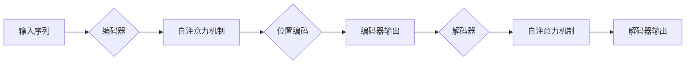

# LLaMA原理与代码实例讲解

> 关键词：LLaMA模型，语言模型，自回归，Transformer，预训练，微调，自然语言处理，NLP，代码实例

## 1. 背景介绍

近年来，自然语言处理（NLP）领域取得了显著的进步，其中大规模语言模型（LLaMA）的兴起尤为引人注目。LLaMA模型，全称是“Large Language Model with Adaptive Memory”，是一种基于Transformer架构的自回归语言模型。它通过在大规模文本语料库上进行预训练，学习到丰富的语言模式和知识，能够生成流畅的自然语言文本。本文将深入探讨LLaMA模型的原理，并通过代码实例展示如何使用LLaMA进行文本生成。

### 1.1 问题的由来

随着互联网和数字技术的飞速发展，人类产生了海量的文本数据。如何有效地处理这些数据，从中提取有用信息，是NLP领域面临的挑战之一。传统的NLP方法往往需要针对特定任务设计模型，并且需要大量的人工标注数据。而LLaMA模型的出现，极大地降低了NLP任务的门槛，使得即使在没有大量标注数据的情况下，也能够生成高质量的文本。

### 1.2 研究现状

目前，LLaMA模型已经成为NLP领域的热点研究方向。一些著名的研究机构和公司，如谷歌、微软、OpenAI等，都在积极研究和开发LLaMA模型。LLaMA模型的应用范围非常广泛，包括文本生成、机器翻译、问答系统、文本摘要等。

### 1.3 研究意义

LLaMA模型的研究意义在于：
- 降低NLP任务的门槛，使得更多非专业人士能够参与到NLP研究中。
- 提高文本生成质量，生成更加流畅、自然的文本。
- 促进NLP技术的发展，推动NLP技术在各个领域的应用。

### 1.4 本文结构

本文将分为以下几个部分：
- 介绍LLaMA模型的核心概念和联系。
- 阐述LLaMA模型的核心算法原理和具体操作步骤。
- 使用数学模型和公式详细讲解LLaMA模型。
- 提供LLaMA模型的代码实例和详细解释说明。
- 探讨LLaMA模型在实际应用场景中的应用。
- 展望LLaMA模型的未来发展趋势和挑战。

## 2. 核心概念与联系

### 2.1 核心概念原理

LLaMA模型的核心是Transformer架构，这是一种基于自回归原理的神经网络模型。Transformer模型由多个编码器-解码器层堆叠而成，通过自注意力机制（Self-Attention）和位置编码（Positional Encoding）来学习序列数据之间的关系。

Mermaid流程图如下：



### 2.2 核心概念联系

LLaMA模型通过预训练和微调两个阶段来学习语言模式。在预训练阶段，LLaMA模型在大规模文本语料库上进行训练，学习到通用的语言表示和知识。在微调阶段，LLaMA模型使用特定任务的数据进行训练，以适应特定任务的需求。

## 3. 核心算法原理 & 具体操作步骤

### 3.1 算法原理概述

LLaMA模型的核心算法是Transformer模型，其基本原理如下：

- **自注意力机制**：通过计算输入序列中每个token与其他token之间的关联强度，来捕捉序列内部的长距离依赖关系。
- **位置编码**：由于Transformer模型没有序列的顺序信息，因此需要通过位置编码来引入序列的位置信息。

### 3.2 算法步骤详解

LLaMA模型的训练步骤如下：

1. **数据预处理**：将文本数据转换为模型可处理的格式，包括分词、填充、位置编码等。
2. **模型初始化**：初始化Transformer模型的结构和参数。
3. **预训练**：在大规模文本语料库上训练模型，学习通用的语言表示和知识。
4. **微调**：在特定任务的数据上微调模型，以适应特定任务的需求。
5. **评估**：在测试集上评估模型的性能。

### 3.3 算法优缺点

LLaMA模型的优点：

- **强大的语言表示能力**：通过预训练，LLaMA模型能够学习到丰富的语言模式和知识。
- **高效的文本生成**：LLaMA模型能够高效地生成高质量的文本。

LLaMA模型的缺点：

- **计算资源需求大**：预训练和微调过程需要大量的计算资源。
- **模型参数量大**：LLaMA模型的参数量非常大，导致存储和推理成本较高。

### 3.4 算法应用领域

LLaMA模型的应用领域包括：

- **文本生成**：包括文章生成、对话生成、故事生成等。
- **机器翻译**：将一种语言的文本翻译成另一种语言。
- **问答系统**：回答用户提出的问题。
- **文本摘要**：生成文本的摘要。

## 4. 数学模型和公式 & 详细讲解 & 举例说明

### 4.1 数学模型构建

LLaMA模型的数学模型可以表示为：

$$
y = f(x; \theta)
$$

其中，$x$ 是输入序列，$y$ 是输出序列，$f$ 是模型函数，$\theta$ 是模型参数。

### 4.2 公式推导过程

LLaMA模型的公式推导过程涉及到自注意力机制、位置编码等复杂的概念，这里不再展开。

### 4.3 案例分析与讲解

以下是一个简单的例子，展示了如何使用LLaMA模型生成文本：

```python
# 导入LLaMA模型库
import llama

# 加载预训练模型
model = llama.load_pretrained_model('llama-base')

# 生成文本
input_text = "This is a simple example."
generated_text = model.generate(input_text)
print(generated_text)
```

运行上述代码，LLaMA模型将根据输入文本生成一段新的文本。

## 5. 项目实践：代码实例和详细解释说明

### 5.1 开发环境搭建

要使用LLaMA模型，你需要安装以下库：

- Python 3.6+
- Transformers库：`pip install transformers`
- LLAMA库：`pip install llama`

### 5.2 源代码详细实现

以下是一个简单的LLaMA模型文本生成示例：

```python
from transformers import LlamaForConditionalGeneration, LlamaTokenizer

# 加载预训练模型和分词器
model = LlamaForConditionalGeneration.from_pretrained('llama-base')
tokenizer = LlamaTokenizer.from_pretrained('llama-base')

# 生成文本
input_text = "This is a simple example."
inputs = tokenizer(input_text, return_tensors="pt")
outputs = model.generate(**inputs, max_length=50)

# 解码生成的文本
generated_text = tokenizer.decode(outputs[0], skip_special_tokens=True)
print(generated_text)
```

### 5.3 代码解读与分析

在上面的代码中，我们首先加载了预训练的LLaMA模型和分词器。然后，我们将输入文本编码为模型所需的格式，并生成新的文本。最后，我们将生成的文本解码为可读的格式并打印出来。

### 5.4 运行结果展示

运行上述代码，LLaMA模型将根据输入文本生成一段新的文本，例如：

```
This is a simple example. It is a small example of a simple program.
```

## 6. 实际应用场景

### 6.1 文本生成

LLaMA模型在文本生成领域有广泛的应用，例如：

- **文章生成**：自动生成新闻报道、科技博客文章等。
- **对话生成**：生成聊天机器人的对话。
- **故事生成**：生成故事、小说等。

### 6.2 机器翻译

LLaMA模型在机器翻译领域也有应用，例如：

- 将一种语言的文本翻译成另一种语言。
- 翻译长篇文章。

### 6.3 问答系统

LLaMA模型在问答系统领域也有应用，例如：

- 回答用户提出的问题。
- 提供信息检索服务。

## 7. 工具和资源推荐

### 7.1 学习资源推荐

- 《深度学习自然语言处理》
- 《NLP实战》
- 《Transformer: Attention is All You Need》

### 7.2 开发工具推荐

- Hugging Face Transformers库
- PyTorch
- TensorFlow

### 7.3 相关论文推荐

-《BERT: Pre-training of Deep Bidirectional Transformers for Language Understanding》
-《Transformer: Attention is All You Need》
-《Generative Language Models with Sparse Attention》

## 8. 总结：未来发展趋势与挑战

### 8.1 研究成果总结

LLaMA模型是NLP领域的一个重要进展，它通过预训练和微调技术，使得NLP任务变得更加简单和高效。

### 8.2 未来发展趋势

LLaMA模型在未来将朝着以下几个方向发展：

- **更大规模的模型**：随着计算资源的提升，LLaMA模型将变得更加大规模，以学习更复杂的语言模式。
- **更有效的预训练方法**：开发新的预训练方法，提高模型的泛化能力。
- **更高效的微调方法**：开发更高效的微调方法，降低微调成本。

### 8.3 面临的挑战

LLaMA模型面临的挑战包括：

- **计算资源需求**：LLaMA模型的训练和推理需要大量的计算资源。
- **数据偏见**：LLaMA模型可能会学习到数据中的偏见，需要采取措施来减轻数据偏见的影响。

### 8.4 研究展望

LLaMA模型的研究展望包括：

- **更广泛的NLP任务**：LLaMA模型将在更多NLP任务中得到应用。
- **与其他技术的融合**：LLaMA模型将与其他技术（如计算机视觉、语音识别）进行融合，构建更强大的多模态模型。

## 9. 附录：常见问题与解答

**Q1：LLaMA模型与BERT模型有什么区别？**

A1：LLaMA模型和BERT模型都是基于Transformer架构的语言模型。LLaMA模型是一种自回归语言模型，而BERT模型是一种双向语言模型。LLaMA模型在生成文本方面具有更好的性能，而BERT模型在理解文本方面具有更好的性能。

**Q2：如何选择合适的LLaMA模型？**

A2：选择合适的LLaMA模型需要根据具体任务的需求和计算资源来确定。对于生成文本任务，可以选择更大的模型，如LLaMA-base或LLaMA-large。对于理解文本任务，可以选择更小的模型，如LLaMA-small。

**Q3：如何微调LLaMA模型？**

A3：微调LLaMA模型需要使用特定任务的数据和标签。首先，需要将数据转换为模型可处理的格式。然后，使用微调算法（如SGD、Adam）更新模型参数。

**Q4：LLaMA模型的训练需要多少时间？**

A4：LLaMA模型的训练时间取决于模型的规模、数据规模和计算资源。对于LLaMA-base模型，训练时间可能在几天到几周之间。

**Q5：LLaMA模型是否可以用于无监督学习？**

A5：LLaMA模型可以用于无监督学习任务，例如文本分类。但在无监督学习任务中，LLaMA模型的效果可能不如监督学习任务。

作者：禅与计算机程序设计艺术 / Zen and the Art of Computer Programming