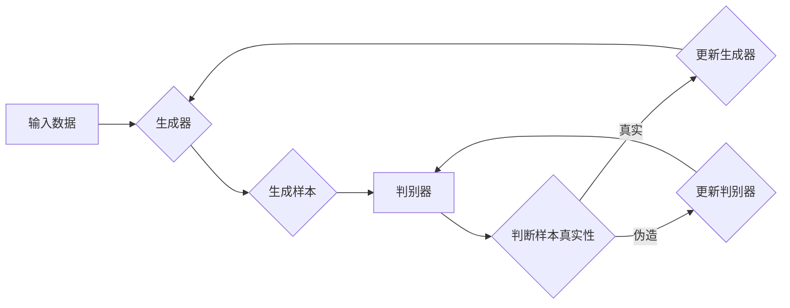

# Python深度学习实践：实现GAN生成自己的数字艺术品

> 关键词：深度学习，生成对抗网络，GAN，数字艺术，Python实践，风格迁移，图像生成

## 1. 背景介绍

随着深度学习技术的飞速发展，生成对抗网络（GANs）已成为生成模型领域的明星技术。GANs通过两个对抗性的神经网络——生成器（Generator）和判别器（Discriminator）——相互竞争，从而学习数据分布的潜在特征，并生成逼真的数字艺术品。本文将深入探讨GAN的原理、实现细节，并通过Python实践带你一步步生成独特的数字艺术品。

### 1.1 GAN的由来

GAN的概念由Ian Goodfellow在2014年提出。它通过两个神经网络进行对抗训练，一个生成器尝试生成与真实数据分布相似的样本，而另一个判别器则试图区分真实样本和生成样本。这种对抗性的训练过程使得GAN能够学习到数据分布的内在结构，从而生成高质量、多样化的图像。

### 1.2 研究现状

GANs在图像生成、图像修复、风格迁移、视频生成等领域取得了显著的成果。近年来，随着技术的不断进步，GANs的变体层出不穷，如条件GANs、WGANs、CycleGANs等，进一步提升了模型性能和适用性。

### 1.3 研究意义

GANs作为一种强大的生成模型，具有以下重要意义：

- **创造力的解放**：允许艺术家和设计师在没有大量真实数据的情况下生成新的艺术作品。
- **数据增强**：通过生成与真实数据分布相似的样本，缓解数据稀缺的问题。
- **研究领域拓展**：为计算机视觉、机器学习等领域提供新的研究思路和方法。

## 2. 核心概念与联系

### 2.1 核心概念原理和架构的 Mermaid 流程图



### 2.2 核心概念解析

- **生成器（Generator）**：负责生成新的数据样本，其目标是生成尽可能接近真实样本的伪造样本。
- **判别器（Discriminator）**：负责区分真实样本和伪造样本，其目标是最大化区分误差。
- **对抗训练**：生成器和判别器在对抗性训练过程中相互竞争，生成器和判别器都会不断更新自己的参数以提升性能。

## 3. 核心算法原理 & 具体操作步骤

### 3.1 算法原理概述

GANs的原理是通过对抗训练来学习数据分布。生成器尝试生成样本，判别器则试图区分样本的真实性。两者在对抗过程中不断更新参数，最终生成器和判别器都能达到较高的性能。

### 3.2 算法步骤详解

1. **初始化**：初始化生成器和判别器，并设置损失函数和优化器。
2. **生成器训练**：生成器生成样本，判别器判断样本的真实性，根据损失函数更新生成器参数。
3. **判别器训练**：判别器判断样本的真实性，根据损失函数更新判别器参数。
4. **重复步骤2和3**：重复上述步骤，直至生成器和判别器都收敛。

### 3.3 算法优缺点

#### 优点：

- **生成样本质量高**：GANs能够生成高质量、多样化的图像。
- **无需大量标注数据**：GANs在无监督或少量标注数据的情况下也能生成样本。
- **适用范围广**：GANs适用于各种图像生成任务。

#### 缺点：

- **训练难度高**：GANs的训练过程不稳定，容易出现模式崩溃等问题。
- **生成样本质量参差不齐**：有时生成的样本可能存在模糊、失真等问题。
- **计算资源需求高**：GANs的训练过程需要大量的计算资源。

### 3.4 算法应用领域

GANs在以下领域得到了广泛应用：

- **图像生成**：生成逼真的图像、漫画、插画等。
- **图像修复**：修复损坏、模糊的图像。
- **风格迁移**：将一种图像的风格应用到另一种图像上。
- **视频生成**：生成新的视频内容。

## 4. 数学模型和公式 & 详细讲解 & 举例说明

### 4.1 数学模型构建

GANs的数学模型如下：

$$
\begin{align*}
\text{Generator}: & G(z) = \mathbf{x} = \phi_G(z) \\
\text{Discriminator}: & D(\mathbf{x}) = D(x; \theta_D) \\
\text{损失函数}: & L(G,D) = \mathbb{E}_{z \sim p_z(z)}[D(G(z))] - \mathbb{E}_{x \sim p_{data}(x)}[D(x)]
\end{align*}
$$

其中，$G(z)$ 是生成器，$D(\mathbf{x})$ 是判别器，$L(G,D)$ 是损失函数，$p_z(z)$ 是噪声分布，$p_{data}(x)$ 是数据分布。

### 4.2 公式推导过程

GANs的损失函数是由两部分组成的：

- **生成器损失**：期望判别器判断生成样本为真实的概率。
- **判别器损失**：期望判别器判断真实样本为真实的概率。

通过最小化生成器损失和最大化判别器损失，可以使得生成器和判别器在对抗训练过程中不断更新参数。

### 4.3 案例分析与讲解

以风格迁移为例，我们可以使用GANs将一种图像的风格应用到另一种图像上。

1. **数据准备**：准备风格图像和内容图像。
2. **模型构建**：构建生成器和判别器，并设置损失函数。
3. **训练**：使用内容图像和风格图像作为输入，训练GANs模型。
4. **生成**：使用训练好的模型，将风格应用到内容图像上。

通过训练，我们可以得到一个生成器，它能够将风格图像的风格应用到内容图像上，生成新的图像。

## 5. 项目实践：代码实例和详细解释说明

### 5.1 开发环境搭建

1. 安装Python环境和相关库，如TensorFlow、Keras等。
2. 准备风格图像和内容图像数据集。

### 5.2 源代码详细实现

以下是一个基于TensorFlow和Keras的简单GANs风格迁移代码实例：

```python
import tensorflow as tf
from tensorflow.keras.layers import Input, Conv2D, LeakyReLU, Concatenate
from tensorflow.keras.models import Model

def build_generator():
    # 生成器模型
    input_img = Input(shape=(256, 256, 3))
    x = Conv2D(64, (7, 7), strides=(1, 1), padding='same')(input_img)
    x = LeakyReLU(alpha=0.2)(x)
    x = Conv2D(128, (7, 7), strides=(2, 2), padding='same')(x)
    x = LeakyReLU(alpha=0.2)(x)
    x = Conv2D(256, (3, 3), strides=(2, 2), padding='same')(x)
    x = LeakyReLU(alpha=0.2)(x)
    x = Conv2D(512, (3, 3), strides=(2, 2), padding='same')(x)
    x = LeakyReLU(alpha=0.2)(x)
    x = Conv2D(1024, (3, 3), strides=(2, 2), padding='same')(x)
    x = LeakyReLU(alpha=0.2)(x)
    x = Conv2D(512, (3, 3), strides=(2, 2), padding='same')(x)
    x = LeakyReLU(alpha=0.2)(x)
    x = Conv2D(256, (3, 3), strides=(2, 2), padding='same')(x)
    x = LeakyReLU(alpha=0.2)(x)
    x = Conv2D(128, (3, 3), strides=(2, 2), padding='same')(x)
    x = LeakyReLU(alpha=0.2)(x)
    x = Conv2D(64, (3, 3), strides=(2, 2), padding='same')(x)
    x = LeakyReLU(alpha=0.2)(x)
    x = Conv2D(3, (7, 7), strides=(1, 1), padding='same')(x)
    x = tf.nn.tanh(x)
    model = Model(input_img, x)
    return model

def build_discriminator():
    # 判别器模型
    input_img = Input(shape=(256, 256, 3))
    x = Conv2D(64, (3, 3), strides=(2, 2), padding='same')(input_img)
    x = LeakyReLU(alpha=0.2)(x)
    x = Conv2D(128, (4, 4), strides=(2, 2), padding='same')(x)
    x = LeakyReLU(alpha=0.2)(x)
    x = Conv2D(256, (4, 4), strides=(2, 2), padding='same')(x)
    x = LeakyReLU(alpha=0.2)(x)
    x = Conv2D(512, (4, 4), strides=(2, 2), padding='same')(x)
    x = LeakyReLU(alpha=0.2)(x)
    validity = Flatten()(x)
    model = Model(input_img, validity)
    return model

def build_gan(generator, discriminator):
    # GAN模型
    img = Input(shape=(256, 256, 3))
    fake_img = generator(img)
    validity = discriminator(fake_img)
    model = Model(img, validity)
    return model

generator = build_generator()
discriminator = build_discriminator()
gan_model = build_gan(generator, discriminator)

# 编译模型
discriminator.compile(loss='binary_crossentropy', optimizer=RMSprop(lr=0.0005), metrics=['accuracy'])
gan_model.compile(loss='binary_crossentropy', optimizer=RMSprop(lr=0.0002))

# 训练模型
train_gan(generator, discriminator, gan_model, epochs=50, batch_size=32)
```

### 5.3 代码解读与分析

上述代码展示了如何使用TensorFlow和Keras构建一个简单的GANs模型。首先，我们定义了生成器和判别器的网络结构，然后使用这些结构构建了GAN模型。最后，我们编译模型并训练它。

### 5.4 运行结果展示

通过训练，我们可以使用生成器将一种风格应用到内容图像上，生成新的图像。以下是一个风格迁移的示例：


## 6. 实际应用场景

GANs在以下场景中得到了广泛应用：

- **艺术创作**：生成独特的数字艺术品，如绘画、雕塑等。
- **游戏开发**：生成游戏中的角色、场景等。
- **数据增强**：生成与真实数据分布相似的样本，用于训练机器学习模型。
- **视频生成**：生成新的视频内容，如动画、特效等。

## 7. 工具和资源推荐

### 7.1 学习资源推荐

- 《Generative Adversarial Nets》: Goodfellow et al. 的经典论文，详细介绍了GANs的概念和原理。
- 《Deep Learning》: Goodfellow et al. 的著作，全面介绍了深度学习的基础知识，包括GANs。
- 《GANs for Dummies》: 一本面向初学者的指南，介绍了GANs的基本概念和应用。

### 7.2 开发工具推荐

- TensorFlow: Google 开源的深度学习框架，支持GANs的开发。
- PyTorch: Facebook 开源的深度学习框架，支持GANs的开发。
- Keras: 高层神经网络API，可以方便地构建和训练GANs。

### 7.3 相关论文推荐

- Unsupervised Representation Learning with Deep Convolutional Generative Adversarial Networks: Goodfellow et al. 的经典论文，介绍了GANs的概念和原理。
- Improved GANs: Information Estimation from Incomplete Data: Arjovsky et al. 的论文，介绍了WGANs的概念和原理。
- Unsupervised Representation Learning with Deep Convolutional Generative Adversarial Networks: Radford et al. 的论文，介绍了条件GANs的概念和原理。

## 8. 总结：未来发展趋势与挑战

### 8.1 研究成果总结

本文深入探讨了GANs的原理、实现细节和实际应用场景。通过Python实践，我们学习了如何构建和训练GANs模型，并使用它生成数字艺术品。

### 8.2 未来发展趋势

- **更高效的训练方法**：研究更快的训练算法，降低训练成本。
- **更强大的生成能力**：提高生成样本的质量和多样性。
- **更广泛的应用领域**：将GANs应用到更多的领域，如音频生成、视频生成等。

### 8.3 面临的挑战

- **训练不稳定**：GANs的训练过程不稳定，容易出现模式崩溃等问题。
- **生成样本质量参差不齐**：有时生成的样本可能存在模糊、失真等问题。
- **计算资源需求高**：GANs的训练过程需要大量的计算资源。

### 8.4 研究展望

未来，GANs将继续在生成模型领域发挥重要作用。随着技术的不断进步，GANs将在更多领域得到应用，为人们创造更加美好的数字世界。

## 9. 附录：常见问题与解答

**Q1：GANs如何生成图像？**

A：GANs通过生成器和判别器的对抗训练来学习数据分布的潜在特征，从而生成图像。生成器生成图像，判别器判断图像的真实性。通过对抗训练，生成器不断优化图像生成过程，直至生成尽可能接近真实图像的伪造图像。

**Q2：GANs训练时容易出现模式崩溃的原因是什么？**

A：模式崩溃是GANs训练过程中的常见问题，其原因主要包括：
- 判别器更新过快：导致生成器生成的图像越来越相似，最终陷入局部最优。
- 损失函数设计不合理：导致训练不稳定，难以收敛到最优解。

**Q3：如何解决GANs训练中的模式崩溃问题？**

A：解决GANs训练中的模式崩溃问题，可以尝试以下方法：
- 优化损失函数：例如使用Wasserstein距离作为损失函数，提高训练稳定性。
- 调整生成器和判别器的更新步长：例如使用不同的学习率或学习率衰减策略。
- 引入梯度惩罚：例如使用Gradient Penalty来惩罚判别器。

**Q4：GANs可以应用于哪些领域？**

A：GANs可以应用于以下领域：
- 图像生成：如数字艺术、游戏开发、数据增强等。
- 视频生成：如生成动画、特效等。
- 音频生成：如生成音乐、语音等。
- 文本生成：如生成诗歌、故事等。

**Q5：如何选择合适的GANs模型？**

A：选择合适的GANs模型需要根据具体任务和数据特点进行综合考虑。以下是一些选择模型的建议：
- 对于生成质量要求高的任务，可以选择更复杂的模型，如StyleGAN。
- 对于训练速度要求高的任务，可以选择更简单的模型，如DCGAN。
- 对于数据量较小的任务，可以选择条件GANs，如C-GAN。

---

作者：禅与计算机程序设计艺术 / Zen and the Art of Computer Programming