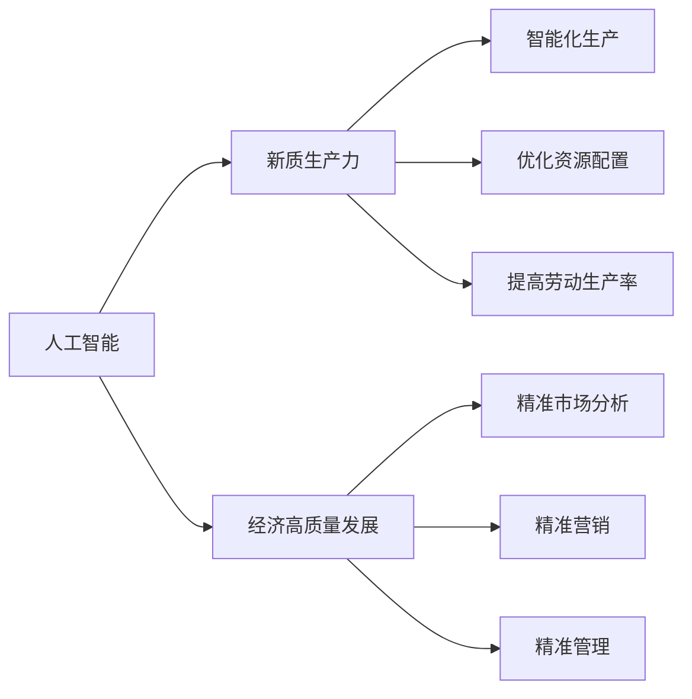

                 

# 发展新质生产力提高核心竞争力

## 1. 背景介绍

随着全球科技革命和产业变革的深入推进，新质生产力的崛起已经成为推动国家经济高质量发展的重要驱动力。新质生产力强调以技术创新为核心，以数据驱动为手段，通过构建高效、智能、可持续的生产组织体系，实现经济增长与资源环境的高效协调，提升国家核心竞争力。在这一背景下，如何利用人工智能等前沿技术，构建新质生产力，成为当前国内外学术界和工业界共同关注的焦点。

本文聚焦于基于人工智能技术的生产力提升，探讨如何通过技术手段，推动经济结构和产业体系的转型升级，实现更高质量、更有效益的经济发展。通过系统分析人工智能在新质生产力发展中的应用场景、技术挑战及解决方案，我们希望能够为相关领域的专家和从业者提供理论支持和实践指导。

## 2. 核心概念与联系

### 2.1 核心概念概述

在探讨人工智能与新质生产力的关系之前，我们先来了解一下几个核心概念：

- **人工智能（AI）**：指通过模拟人类智能行为，实现信息处理、决策支持、自然语言处理等技术。人工智能涵盖机器学习、深度学习、自然语言处理、计算机视觉等多个技术领域。
- **新质生产力**：指基于新技术、新产业、新模式，通过智能化、自动化、网络化等方式，实现生产效率和服务质量的全面提升。新质生产力强调科技驱动下的创新、协调、绿色、开放、共享发展。
- **经济高质量发展**：指在创新驱动下，通过技术进步、产业升级、结构优化等途径，实现经济增长与资源环境协调、社会公平、安全稳定等多重目标。

这三个概念之间的联系密不可分。人工智能作为新质生产力的重要组成部分，通过提供高效的计算、数据分析和决策支持，帮助企业优化生产流程、提高产品和服务质量、开拓新市场，从而推动经济高质量发展。

### 2.2 核心概念的关系

**人工智能与新质生产力的关系**：

- **赋能**：人工智能通过提供智能化的生产工具和服务，赋能传统行业，实现生产流程的优化、产品品质的提升和成本的降低。
- **驱动**：人工智能技术本身是驱动新质生产力发展的关键力量，它通过数据驱动、模型驱动和智能驱动，推动产业结构的转型和升级。
- **实现**：人工智能为新质生产力的目标提供实现手段，帮助企业和组织构建智能化生产体系，提升市场竞争力和创新能力。

**人工智能与经济高质量发展的关系**：

- **促进**：人工智能通过提升劳动生产率、优化资源配置、增强创新能力等手段，促进经济结构调整和产业转型，实现高质量发展。
- **引导**：人工智能技术的发展方向，如深度学习、自然语言处理、机器人技术等，引导了经济高质量发展的趋势和路径。
- **支撑**：人工智能提供的数据驱动和智能化支撑，帮助企业实现精准市场分析、精准营销和精准管理，提升经济发展的可持续性和包容性。

这些概念之间的关系可以用以下Mermaid流程图来展示：



这个流程图展示了人工智能如何赋能新质生产力，驱动经济高质量发展，以及新质生产力在生产、市场、管理等方面的具体应用。

## 3. 核心算法原理 & 具体操作步骤

### 3.1 算法原理概述

基于人工智能的新质生产力提升，其核心原理可以归纳为以下几个方面：

- **数据驱动**：通过收集、处理、分析大量数据，人工智能帮助企业洞察市场需求、优化生产流程、提升产品和服务质量。
- **模型驱动**：利用机器学习、深度学习等技术，构建高性能的预测模型和决策模型，为企业提供精准的市场预测、生产调度和资源优化。
- **智能驱动**：通过智能算法和智能系统，实现生产自动化、运营智能化、服务个性化，提升生产效率和客户满意度。

这些原理构成了人工智能在新质生产力发展中的核心技术基础，使得人工智能成为推动经济高质量发展的关键引擎。

### 3.2 算法步骤详解

基于人工智能的新质生产力提升，通常包括以下几个关键步骤：

**Step 1: 数据采集与预处理**

- 收集企业运营数据、市场交易数据、客户反馈数据等，进行数据清洗和特征工程。
- 对数据进行标准化、归一化、降维等预处理操作，以提高数据的质量和可用性。

**Step 2: 模型构建与训练**

- 根据具体应用场景选择合适的机器学习模型或深度学习模型，如线性回归、决策树、随机森林、神经网络等。
- 利用训练数据对模型进行训练，调整模型参数，优化模型性能。

**Step 3: 模型评估与优化**

- 在测试集上对模型进行评估，计算准确率、召回率、F1分数等指标。
- 根据评估结果调整模型参数，如增加训练数据量、调整学习率、引入正则化等，以提高模型性能。

**Step 4: 模型部署与应用**

- 将训练好的模型部署到实际生产环境中，进行生产调度和资源优化。
- 利用模型进行市场预测、生产调度、客户管理等应用，提升企业的生产效率和市场竞争力。

**Step 5: 持续优化与迭代**

- 在实际应用中不断收集反馈数据，进行模型的持续优化和迭代。
- 引入最新的技术手段，如强化学习、自然语言处理、计算机视觉等，提升模型的预测能力和智能化水平。

### 3.3 算法优缺点

基于人工智能的新质生产力提升，具有以下优点：

- **高效性**：通过数据驱动和模型驱动，人工智能可以快速识别市场机会、优化生产流程，提高生产效率。
- **智能性**：利用智能算法和智能系统，人工智能能够实现自动化、智能化、个性化生产，提升产品和服务质量。
- **灵活性**：人工智能技术具有高度的灵活性，可以根据企业的具体需求进行定制化开发，提升企业竞争力。

然而，也存在一些缺点：

- **高成本**：人工智能技术的开发和应用需要高昂的硬件设备和数据处理成本。
- **复杂性**：人工智能模型的构建和优化需要专业知识和技术手段，对企业的数据分析和建模能力提出较高要求。
- **风险性**：人工智能模型可能存在偏见和误差，需要进行严格的测试和验证，以确保其可靠性。

### 3.4 算法应用领域

基于人工智能的新质生产力提升，可以广泛应用于以下多个领域：

- **制造业**：通过智能制造、预测维护、质量控制等技术，提升生产效率和产品质量。
- **农业**：利用农业物联网、智能农场、精准农业等技术，实现农业生产的智能化、精准化和可持续化。
- **服务业**：通过智能客服、推荐系统、供应链管理等技术，提升服务质量和客户满意度。
- **物流**：利用智能仓储、路径规划、配送优化等技术，提高物流效率和降低运营成本。
- **金融**：通过风险评估、欺诈检测、智能投顾等技术，提升金融服务的智能化水平。

## 4. 数学模型和公式 & 详细讲解  
### 4.1 数学模型构建

在人工智能与新质生产力的应用中，数学模型和公式是实现智能化的关键工具。下面以制造业的智能预测维护为例，构建相关的数学模型。

**假设条件**：
- 设企业有 $N$ 台设备，每台设备的健康状态 $X_i$ 服从正态分布 $N(\mu_i,\sigma_i^2)$。
- 设备的故障时间 $Y_i$ 服从指数分布 $Exp(\lambda_i)$。

**模型目标**：预测设备未来的故障时间，进行预防性维护，降低生产停机时间。

**数学模型**：
1. 基于健康状态 $X_i$ 和故障时间 $Y_i$ 的历史数据，构建高斯过程模型，预测未来 $k$ 个时间点的故障时间。
2. 利用贝叶斯推断方法，计算每个时间点的预测概率密度函数。
3. 根据预测概率密度函数，计算最优维护时间点，实现预防性维护。

**数学公式**：
1. **高斯过程模型**：
   $$
   y_i = f(x_i) + \epsilon_i
   $$
   其中 $y_i$ 为故障时间，$f(x_i)$ 为设备健康状态与故障时间的函数关系，$\epsilon_i$ 为误差项。

2. **贝叶斯推断**：
   $$
   p(y_{i+1}|y_{i},X_i,Y_i) \sim N(\hat{y}_{i+1},\hat{\sigma}_{i+1}^2)
   $$
   其中 $\hat{y}_{i+1}$ 为预测的故障时间，$\hat{\sigma}_{i+1}^2$ 为预测误差的方差。

3. **最优维护时间**：
   $$
   \min_{i} p(y_{i+1}|y_{i},X_i,Y_i)
   $$

### 4.2 公式推导过程

以高斯过程模型为例，推导其基本数学公式。

**高斯过程模型**：
$$
y_i = f(x_i) + \epsilon_i
$$
其中 $y_i$ 为故障时间，$f(x_i)$ 为设备健康状态与故障时间的函数关系，$\epsilon_i$ 为误差项。

假设 $f(x_i)$ 服从均值为 $\mu$，协方差矩阵为 $K$ 的高斯过程。则有：
$$
y_i \sim N(K(x_i,x_j) \mu + f(x_j),K(x_i,x_i) - K(x_i,x_j))
$$

**贝叶斯推断**：
假设观测数据 $y = [y_1,...,y_N]$，则贝叶斯推断公式为：
$$
p(f|y) \sim N(M,K)
$$
其中 $M = \frac{K + \Lambda Y}{K + \Lambda} \Lambda^{-1} y$，$K = K - \Lambda \Lambda^T(K + \Lambda)^{-1}$，$\Lambda = \Sigma^{-1}$，$\Sigma$ 为协方差矩阵。

**最优维护时间**：
假设在 $t_i$ 时刻设备故障，则有：
$$
p(Y_{i+1}<t_i) = \int_{t_i}^{\infty} p(Y_{i+1}|t_i) dt_i = 1 - e^{-\lambda_i t_i}
$$
令 $\frac{d}{dt_i} p(Y_{i+1}<t_i) = 0$，解得最优维护时间 $t_i^*$。

### 4.3 案例分析与讲解

假设某企业有 $10$ 台设备，每台设备的健康状态 $X_i$ 和故障时间 $Y_i$ 的历史数据如表所示：

| 设备编号 | 健康状态 $X_i$ | 故障时间 $Y_i$ |
| --- | --- | --- |
| 1 | 100 | 500 |
| 2 | 80 | 600 |
| 3 | 90 | 400 |
| ... | ... | ... |
| 10 | 110 | 300 |

利用上述高斯过程模型，可以对设备的故障时间进行预测，从而实现预防性维护。

## 5. 项目实践：代码实例和详细解释说明
### 5.1 开发环境搭建

基于人工智能的新质生产力提升，需要搭建一个包含数据采集、模型训练、模型评估和模型应用的全流程开发环境。以下是一个简单的开发环境搭建流程：

1. **Python环境**：安装Python 3.x版本，建议使用Anaconda环境管理工具，方便后续的安装和配置。
2. **数据管理**：使用Pandas、Hadoop等工具，对数据进行采集、清洗和预处理。
3. **模型训练**：使用Scikit-learn、TensorFlow、PyTorch等库，构建和训练机器学习模型和深度学习模型。
4. **模型评估**：使用Scikit-learn、TensorBoard等工具，对模型进行评估和调优。
5. **模型应用**：使用Flask、Django等框架，将模型部署到Web应用中，实现生产调度、资源优化等功能。

### 5.2 源代码详细实现

以下是一个基于机器学习的预测维护系统的Python代码实现。假设我们使用Scikit-learn库中的线性回归模型进行设备故障时间的预测：

```python
import pandas as pd
from sklearn.linear_model import LinearRegression
from sklearn.metrics import mean_squared_error
from sklearn.model_selection import train_test_split

# 加载设备健康状态和故障时间数据
data = pd.read_csv('device_data.csv')

# 数据预处理
X = data[['health_state']] # 设备健康状态
y = data['failure_time'] # 设备故障时间

# 划分训练集和测试集
X_train, X_test, y_train, y_test = train_test_split(X, y, test_size=0.2, random_state=42)

# 构建线性回归模型
model = LinearRegression()

# 训练模型
model.fit(X_train, y_train)

# 预测测试集故障时间
y_pred = model.predict(X_test)

# 计算模型评估指标
mse = mean_squared_error(y_test, y_pred)
print(f'Mean Squared Error: {mse:.2f}')

# 部署模型到Web应用
from flask import Flask, request, jsonify

app = Flask(__name__)

@app.route('/predict', methods=['POST'])
def predict():
    data = request.json
    health_state = data['health_state']
    prediction = model.predict([health_state])
    return jsonify({'prediction': prediction[0]})

if __name__ == '__main__':
    app.run(debug=True)
```

### 5.3 代码解读与分析

上述代码实现了一个简单的基于机器学习的预测维护系统，主要步骤如下：

1. **数据加载和预处理**：使用Pandas库读取设备健康状态和故障时间数据，并进行标准化处理。
2. **模型训练**：使用Scikit-learn库中的线性回归模型进行训练。
3. **模型评估**：使用均方误差作为评估指标，评估模型预测性能。
4. **模型应用**：使用Flask框架将模型部署到Web应用中，实现故障时间的预测。

## 6. 实际应用场景

基于人工智能的新质生产力提升，已经广泛应用于多个实际应用场景，以下是几个典型案例：

### 6.1 制造业智能制造

某汽车制造企业通过智能制造系统，利用工业物联网、人工智能和大数据分析技术，实现生产流程的智能化和优化。具体应用包括：

- **生产调度优化**：通过实时监控生产数据，预测设备故障和产能瓶颈，优化生产调度。
- **质量控制**：利用机器视觉和深度学习技术，检测产品缺陷，提升产品质量。
- **供应链管理**：利用大数据分析，优化库存管理和物流配送，降低运营成本。

### 6.2 农业智能农场

某农业企业通过智能农场系统，利用物联网、人工智能和大数据分析技术，实现农业生产的智能化和精准化。具体应用包括：

- **智能灌溉**：利用传感器和机器学习技术，实时监控土壤湿度和气象条件，精准控制灌溉量。
- **病虫害检测**：利用图像识别和深度学习技术，自动识别病虫害，及时采取防治措施。
- **精准农业**：利用无人机和传感器技术，采集农田数据，实现精细化管理和智能化决策。

### 6.3 服务业智能客服

某电商平台通过智能客服系统，利用自然语言处理和机器学习技术，提升客户服务和用户体验。具体应用包括：

- **智能问答**：通过自然语言理解和生成技术，实现自动回答用户咨询，提升响应速度。
- **情感分析**：利用情感分析技术，识别用户情绪，提供个性化服务。
- **推荐系统**：利用协同过滤和深度学习技术，推荐相关商品，提升用户满意度。

### 6.4 金融智能投顾

某金融公司通过智能投顾系统，利用机器学习和自然语言处理技术，提升金融服务的智能化和个性化。具体应用包括：

- **风险评估**：利用机器学习模型，评估贷款和投资的风险。
- **欺诈检测**：利用深度学习技术，检测金融欺诈行为，提升安全性。
- **智能投顾**：利用自然语言处理和深度学习技术，提供个性化的投资建议。

## 7. 工具和资源推荐

### 7.1 学习资源推荐

为了帮助开发者深入理解人工智能在新质生产力提升中的应用，以下是一些优质的学习资源：

1. **《机器学习》（周志华）**：全面介绍机器学习和深度学习的理论和实践，是学习人工智能的必读教材。
2. **Coursera《Deep Learning》课程**：斯坦福大学开设的深度学习课程，涵盖深度学习的基本概念和算法。
3. **Kaggle竞赛**：参加Kaggle的机器学习和深度学习竞赛，积累实战经验，提升解决实际问题的能力。
4. **GitHub开源项目**：GitHub上大量开源的人工智能项目，涵盖各种算法和应用场景，适合学习和参考。
5. **TensorFlow官方文档**：TensorFlow官方文档，提供了丰富的API文档和教程，帮助开发者快速上手。

### 7.2 开发工具推荐

以下几款工具和库是人工智能在新质生产力提升中的常用工具：

1. **Python**：Python是人工智能领域的主流编程语言，具有丰富的库和框架支持。
2. **TensorFlow**：由Google开发的人工智能框架，支持分布式计算和模型优化，适合大规模深度学习任务。
3. **PyTorch**：由Facebook开发的人工智能框架，支持动态计算图和模型优化，适合研究和实验。
4. **Scikit-learn**：Python科学计算库，提供各种机器学习算法和模型，适合数据预处理和模型训练。
5. **Pandas**：Python数据处理库，支持数据清洗、数据可视化等操作，适合数据管理和预处理。

### 7.3 相关论文推荐

以下是几篇人工智能与新质生产力相关的重要论文，值得深入阅读：

1. **《智能制造：人工智能在制造中的应用》**：阐述了人工智能在智能制造中的应用场景和技术手段，探讨了智能制造的未来发展方向。
2. **《智能农业：基于物联网和人工智能的精准农业》**：介绍了基于物联网和人工智能的精准农业技术，分析了其在农业生产中的优势和挑战。
3. **《智能客服：基于深度学习的客户服务系统》**：探讨了基于深度学习的智能客服系统，分析了其在客户服务中的重要性和应用价值。
4. **《智能投顾：人工智能在金融领域的应用》**：阐述了基于人工智能的智能投顾系统，分析了其在金融服务中的创新和优势。

## 8. 总结：未来发展趋势与挑战

### 8.1 研究成果总结

基于人工智能的新质生产力提升，已经在多个行业领域取得了显著成果。通过数据驱动和模型驱动，人工智能帮助企业优化生产流程、提升产品和服务质量，推动了经济高质量发展。未来，随着技术的不断进步和应用的深入，人工智能将在更多领域发挥重要作用。

### 8.2 未来发展趋势

基于人工智能的新质生产力提升，未来将呈现以下几个发展趋势：

1. **智能化水平提升**：人工智能技术将更加智能化，能够实现更高层次的决策支持、自动化和智能化。
2. **跨领域融合**：人工智能技术与大数据、物联网、区块链等技术将更加深入融合，形成更全面、更复杂的应用场景。
3. **应用范围扩展**：人工智能技术将应用于更多领域，如医疗、教育、能源、交通等，推动各行业数字化转型。
4. **模型和算法优化**：人工智能算法和模型将不断优化，提高模型的预测精度和泛化能力。
5. **伦理和安全**：人工智能技术将更加注重伦理和安全性，避免偏见和有害信息传播，提升系统的透明性和可解释性。

### 8.3 面临的挑战

尽管人工智能在新质生产力提升中发挥了重要作用，但也面临一些挑战：

1. **数据质量问题**：数据质量和数据标注的准确性是影响人工智能性能的关键因素。如何获取高质量的数据和标注，是当前亟待解决的问题。
2. **计算资源瓶颈**：人工智能模型的高计算需求和资源消耗，对硬件设备提出更高要求，如何优化计算资源配置，是未来技术发展的重点。
3. **算法复杂性**：人工智能算法的复杂性和技术门槛，对企业的数据分析和建模能力提出更高要求，如何简化算法实现，降低技术门槛，是未来技术推广的关键。
4. **模型鲁棒性**：人工智能模型在实际应用中可能存在偏见和误差，如何提高模型的鲁棒性和可靠性，是未来技术优化的重点。
5. **伦理和安全**：人工智能技术在应用过程中可能存在伦理和安全性问题，如何确保系统的透明性和可解释性，避免有害信息传播，是未来技术发展的关键。

### 8.4 研究展望

未来，基于人工智能的新质生产力提升，需要在以下几个方面进行深入研究：

1. **无监督学习和自监督学习**：探索更多无监督学习和自监督学习的方法，减少对标注数据的依赖，提高模型的泛化能力。
2. **强化学习和多智能体系统**：引入强化学习和多智能体系统，提升智能系统在复杂环境下的决策能力和适应能力。
3. **跨领域知识融合**：将符号化的知识与神经网络模型结合，增强模型的知识整合能力和泛化能力。
4. **公平性和透明性**：研究如何建立公平和透明的模型评估和解释机制，确保人工智能系统的公正性和可信性。
5. **伦理和安全性**：加强人工智能伦理和安全性的研究，确保人工智能技术的应用符合人类价值观和伦理道德。

通过不断创新和优化，人工智能将在新质生产力提升中发挥更大的作用，推动经济高质量发展和可持续发展。

## 9. 附录：常见问题与解答

**Q1: 人工智能在新质生产力提升中面临哪些挑战？**

A: 人工智能在新质生产力提升中面临的主要挑战包括：
1. 数据质量问题：数据标注和质量控制是影响人工智能性能的关键因素。
2. 计算资源瓶颈：人工智能模型的高计算需求和资源消耗，对硬件设备提出更高要求。
3. 算法复杂性：人工智能算法的复杂性和技术门槛，对企业的数据分析和建模能力提出更高要求。
4. 模型鲁棒性：人工智能模型在实际应用中可能存在偏见和误差，需要提高模型的鲁棒性和可靠性。
5. 伦理和安全：人工智能技术在应用过程中可能存在伦理和安全性问题，需要确保系统的透明性和可解释性。

**Q2: 如何提高人工智能模型的鲁棒性和可靠性？**

A: 提高人工智能模型的鲁棒性和可靠性，主要可以从以下几个方面入手：
1. 数据预处理：进行数据清洗、去噪、标准化等预处理操作，提高数据质量。
2. 模型优化：引入正则化、dropout等技术，防止模型过拟合，提高模型的泛化能力。
3. 模型融合：采用集成学习、模型融合等方法，提高模型的稳定性和鲁棒性。
4. 模型评估：进行模型评估和验证，及时发现和修复模型中的问题，提高模型的可靠性。
5. 伦理和安全：引入伦理和安全评估机制，确保模型符合人类价值观和伦理道德。

**Q3: 人工智能在新质生产力提升中如何应用？**

A: 人工智能在新质生产力提升中的应用主要包括以下几个方面：
1. 数据驱动：利用数据驱动，进行市场分析、生产调度和资源优化。
2. 模型驱动：构建高性能的预测模型和决策模型，提升决策的精准性和可靠性。
3. 智能驱动：利用智能算法和智能系统，实现生产自动化、运营智能化和客户个性化服务。
4. 跨领域融合：将人工智能技术与大数据、物联网、区块链等技术结合，形成更全面、更复杂的应用场景。
5. 伦理和安全：加强人工智能伦理和安全性研究，确保技术应用符合人类价值观和伦理道德。

**Q4: 人工智能在新质生产力提升中如何提高生产效率？**

A: 人工智能在新质生产力提升中提高生产效率，主要可以通过以下几个方面：
1. 生产调度优化：利用实时监控和预测技术，优化生产调度，降低生产停机时间。
2. 质量控制：利用机器视觉和深度学习技术，检测产品缺陷，提升产品质量。
3. 供应链管理：利用大数据分析和机器学习技术，优化库存管理和物流配送，降低运营成本。
4. 智能制造：利用工业物联网和人工智能技术，实现生产流程的智能化和优化。
5. 智能客服：利用自然语言处理和机器学习技术，提升客户服务和用户体验。

**Q5: 人工智能在新质生产力提升中如何提升客户满意度？**

A: 人工智能在新质生产力提升中提升客户满意度，主要可以通过以下几个方面：
1. 智能问答：通过自然语言理解和生成技术，实现自动回答用户咨询，提升响应速度。
2. 情感分析：利用情感分析技术，识别用户情绪，提供个性化服务。
3. 推荐系统：利用协同过滤和深度学习技术，推荐相关商品，提升用户满意度。
4. 智能客服：利用自然语言处理和机器学习技术，提升客户服务和用户体验。
5. 客户反馈：利用数据分析和机器学习技术，及时获取客户反馈，优化产品和服务。

---

作者：禅与计算机程序设计艺术 / Zen and the Art of Computer Programming

