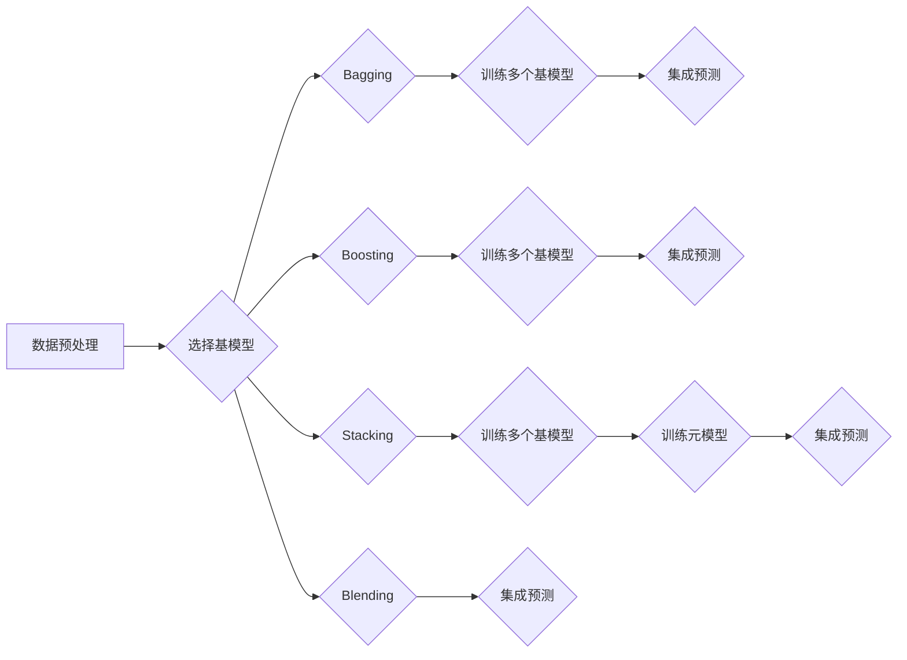

# Python机器学习实战：使用Stacking和Blending集成方法提高模型性能

> 关键词：机器学习，集成学习，Stacking，Blending，模型性能，Python，Scikit-learn

## 1. 背景介绍

机器学习作为一种强大的数据分析工具，已经在各个领域取得了显著的应用成果。然而，单个模型的性能往往受到数据集的复杂性、噪声以及模型本身的局限性等因素的影响。为了提升模型在复杂数据上的预测能力，集成学习方法应运而生。集成学习通过结合多个模型的预测结果来提高整体的预测性能。其中，Stacking和Blending是两种常用的集成学习方法，本文将深入探讨这两种方法在Python中的实现和应用。

## 2. 核心概念与联系

### 2.1 集成学习原理

集成学习的基本思想是将多个模型组合起来，通过投票或加权平均等方式对预测结果进行整合，从而提高预测的准确性和稳定性。集成学习通常分为以下几种类型：

- **Bagging**：通过随机重采样训练数据集来训练多个模型，然后通过多数投票或平均来整合预测结果。
- **Boosting**：通过一系列模型逐个训练，每次都关注前一次模型的错误，从而逐步提高预测能力。
- **Stacking**：使用多个基模型对数据进行预测，然后将这些预测作为输入数据训练一个元模型。
- **Blending**：将不同模型的输出作为输入，直接进行预测，无需训练额外的元模型。

### 2.2 Mermaid流程图



### 2.3 核心概念联系

- **Bagging和Boosting**：这两种方法通过训练多个基模型来提高集成模型的性能，但它们在训练基模型和集成预测的方式上有所不同。
- **Stacking**：在Stacking中，基模型的预测结果被用作元模型的输入，通过训练元模型来整合预测结果。
- **Blending**：Blending直接将基模型的输出作为输入进行预测，无需额外的元模型训练。

## 3. 核心算法原理 & 具体操作步骤

### 3.1 算法原理概述

#### 3.1.1 Stacking原理

Stacking是一种分层集成学习方法，它首先使用多个基模型对训练数据进行预测，然后将这些预测结果作为输入，训练一个元模型来整合这些预测结果。

#### 3.1.2 Blending原理

Blending方法则更为直接，它将多个基模型的预测结果直接用于最终的预测，无需额外的元模型训练。

### 3.2 算法步骤详解

#### 3.2.1 Stacking步骤

1. 使用多个不同的算法训练多个基模型。
2. 使用基模型对训练数据进行预测。
3. 将基模型的预测结果作为新的训练集，训练一个元模型。
4. 使用元模型进行最终的预测。

#### 3.2.2 Blending步骤

1. 使用多个不同的算法训练多个基模型。
2. 将基模型的预测结果直接用于最终的预测。

### 3.3 算法优缺点

#### 3.3.1 Stacking优缺点

**优点**：

- 能够有效地结合多个基模型的预测能力。
- 对基模型的性能要求不是非常高，即使是性能一般的模型，通过Stacking也能得到较好的结果。

**缺点**：

- 训练一个元模型可能需要大量的时间和资源。
- 需要选择合适的基模型和元模型。

#### 3.3.2 Blending优缺点

**优点**：

- 简单易行，无需训练额外的元模型。
- 通常比Stacking更快。

**缺点**：

- 预测能力可能不如Stacking。
- 对基模型的性能要求较高。

### 3.4 算法应用领域

Stacking和Blending方法在各个领域都有广泛的应用，例如：

- 信用评分
- 预测分析
- 医疗诊断
- 情感分析

## 4. 数学模型和公式 & 详细讲解 & 举例说明

### 4.1 数学模型构建

#### 4.1.1 Stacking

Stacking的数学模型可以表示为：

$$
\hat{y} = f(\hat{y}_1, \hat{y}_2, ..., \hat{y}_n) = g(w_1 \hat{y}_1 + w_2 \hat{y}_2 + ... + w_n \hat{y}_n)
$$

其中 $\hat{y}_i$ 是第 $i$ 个基模型的预测结果，$w_i$ 是第 $i$ 个基模型的权重，$g$ 是元模型的函数。

#### 4.1.2 Blending

Blending的数学模型可以表示为：

$$
\hat{y} = \frac{w_1 \hat{y}_1 + w_2 \hat{y}_2 + ... + w_n \hat{y}_n}{w_1 + w_2 + ... + w_n}
$$

其中 $w_i$ 是第 $i$ 个基模型的权重。

### 4.2 公式推导过程

Stacking和Blending的公式推导过程较为简单，主要是基于基模型的预测结果进行加权平均。

### 4.3 案例分析与讲解

下面我们以一个简单的例子来说明Stacking和Blending的应用。

假设我们有三个基模型 $M_1$、$M_2$ 和 $M_3$，以及一个元模型 $M_4$。我们有如下预测结果：

- $M_1$ 预测结果：[0.2, 0.4, 0.3]
- $M_2$ 预测结果：[0.3, 0.5, 0.2]
- $M_3$ 预测结果：[0.1, 0.3, 0.6]

#### 4.3.1 Stacking

我们首先将基模型的预测结果作为输入，训练元模型 $M_4$。假设 $M_4$ 的权重为 $w_1 = 0.2$、$w_2 = 0.3$、$w_3 = 0.5$，那么：

$$
\hat{y}_4 = g(0.2 \times 0.2 + 0.3 \times 0.4 + 0.5 \times 0.3) = g(0.34) = 0.5
$$

#### 4.3.2 Blending

我们将基模型的预测结果直接进行加权平均，得到：

$$
\hat{y} = \frac{0.2 \times 0.2 + 0.3 \times 0.4 + 0.5 \times 0.3}{0.2 + 0.3 + 0.5} = 0.3
$$

## 5. 项目实践：代码实例和详细解释说明

### 5.1 开发环境搭建

要实现Stacking和Blending，我们需要Python编程环境和以下库：

- Scikit-learn：用于机器学习算法的实现。
- Pandas：用于数据处理。
- Numpy：用于数学计算。

以下是在Python环境中安装所需库的命令：

```bash
pip install scikit-learn pandas numpy
```

### 5.2 源代码详细实现

以下是一个使用Scikit-learn实现Stacking和Blending的简单例子：

```python
from sklearn.datasets import load_iris
from sklearn.ensemble import RandomForestClassifier
from sklearn.linear_model import LogisticRegression
from sklearn.model_selection import cross_val_score, train_test_split
from sklearn.neighbors import KNeighborsClassifier

# 加载数据集
data = load_iris()
X, y = data.data, data.target

# 划分数据集
X_train, X_test, y_train, y_test = train_test_split(X, y, test_size=0.2, random_state=42)

# 创建基模型
models = [
    RandomForestClassifier(n_estimators=10, random_state=42),
    KNeighborsClassifier(),
    LogisticRegression()
]

# 创建元模型
estimator = RandomForestClassifier(n_estimators=10, random_state=42)

# Stacking
from sklearn.ensemble import StackingClassifier

stack_clf = StackingClassifier(estimators=models, final_estimator=estimator, cv=5)
stack_clf.fit(X_train, y_train)
stack_score = cross_val_score(stack_clf, X_test, y_test, cv=5)

# Blending
from sklearn.linear_model import Ridge

blender = Ridge()
blender.fit([clf.predict(X_train) for clf in models], y_train)
blender_score = cross_val_score(blender, [clf.predict(X_test) for clf in models], y_test, cv=5)

print(f"Stacking score: {stack_score.mean()}")
print(f"Blending score: {blender_score.mean()}")
```

### 5.3 代码解读与分析

在上面的代码中，我们首先加载了Iris数据集，并将其划分为训练集和测试集。然后，我们创建了三个基模型：随机森林、KNN和逻辑回归。接着，我们使用StackingClassifier来创建一个Stacking模型，并使用cross_val_score来评估其性能。同样的方法也被用于Blending模型。

### 5.4 运行结果展示

运行上述代码，你将得到Stacking和Blending模型在测试集上的平均交叉验证分数。这些分数将帮助你比较两种集成方法的性能。

## 6. 实际应用场景

Stacking和Blending方法在以下实际应用场景中非常有效：

- **金融市场预测**：结合多个时间序列预测模型，提高预测的准确性和稳定性。
- **医疗诊断**：结合多个生物标志物检测模型，提高疾病诊断的准确性。
- **客户流失预测**：结合多个预测模型，提高客户流失预测的准确率。

## 7. 工具和资源推荐

### 7.1 学习资源推荐

- 《Python机器学习》
- Scikit-learn官方文档
- 《统计学习方法》

### 7.2 开发工具推荐

- Jupyter Notebook
- PyCharm

### 7.3 相关论文推荐

- Stacking to enhance accuracy and interpretability of machine learning models
- Ensemble learning

## 8. 总结：未来发展趋势与挑战

### 8.1 研究成果总结

Stacking和Blending是两种有效的集成学习方法，通过结合多个模型的预测结果，可以显著提高模型的预测性能。这两种方法在各个领域都有广泛的应用，并取得了良好的效果。

### 8.2 未来发展趋势

随着机器学习技术的不断发展，Stacking和Blending方法可能会在以下几个方面得到进一步发展：

- **模型选择**：研究如何选择更合适的基模型和元模型，以提高集成模型的性能。
- **模型优化**：研究如何优化集成模型的训练过程，以提高训练效率。
- **可解释性**：研究如何提高集成模型的可解释性，以便更好地理解和信任模型的预测结果。

### 8.3 面临的挑战

Stacking和Blending方法在应用过程中也面临一些挑战：

- **模型选择**：如何选择合适的基模型和元模型是一个难题。
- **计算复杂度**：集成模型通常需要更多的计算资源。
- **可解释性**：集成模型的可解释性通常较差。

### 8.4 研究展望

随着机器学习技术的不断发展，Stacking和Blending方法将会在以下方面得到进一步研究和应用：

- **跨领域集成**：研究如何将不同领域的数据和模型进行集成，以提高模型的泛化能力。
- **动态集成**：研究如何根据数据的动态变化，动态调整基模型和元模型，以提高模型的适应性。
- **可解释性**：研究如何提高集成模型的可解释性，以便更好地理解和信任模型的预测结果。

## 9. 附录：常见问题与解答

**Q1：Stacking和Blending有什么区别？**

A：Stacking和Blending都是集成学习方法，但它们在实现方式上有所不同。Stacking需要训练一个元模型来整合基模型的预测结果，而Blending则直接将基模型的预测结果进行加权平均。

**Q2：Stacking和Blending适用于所有类型的机器学习任务吗？**

A：Stacking和Blending通常适用于回归和分类任务。对于聚类等无监督学习任务，这两种方法的效果可能不如其他集成学习方法。

**Q3：如何选择合适的基模型和元模型？**

A：选择合适的基模型和元模型取决于具体的应用场景和数据特点。通常需要通过实验和比较来确定最佳的模型组合。

**Q4：Stacking和Blending的计算复杂度如何？**

A：Stacking和Blending的计算复杂度通常比单个模型要高，因为它们需要训练多个模型并进行预测。在实际应用中，需要根据计算资源选择合适的模型组合。

**Q5：Stacking和Blending的可解释性如何？**

A：Stacking和Blending的可解释性通常较差，因为它们结合了多个模型的预测结果。为了提高可解释性，可以考虑使用可解释性更强的模型或结合其他技术。

作者：禅与计算机程序设计艺术 / Zen and the Art of Computer Programming