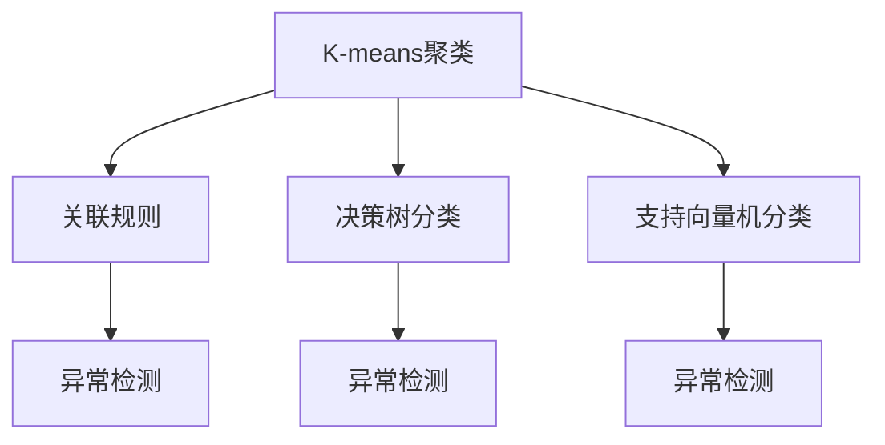
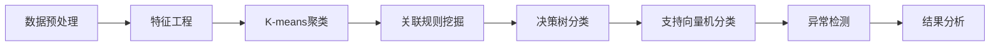
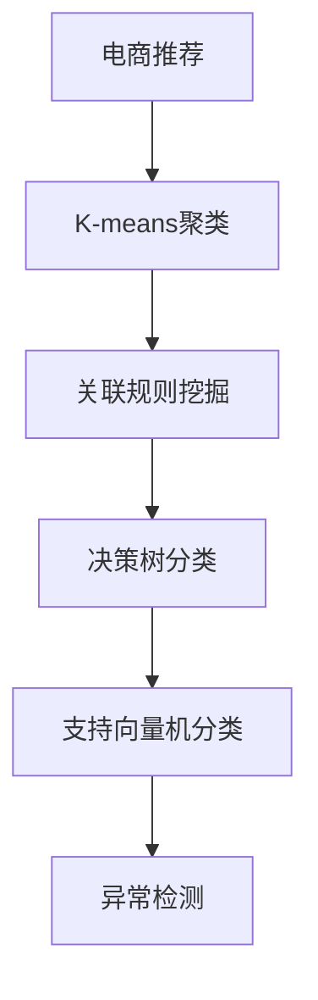
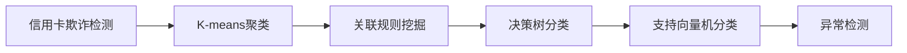
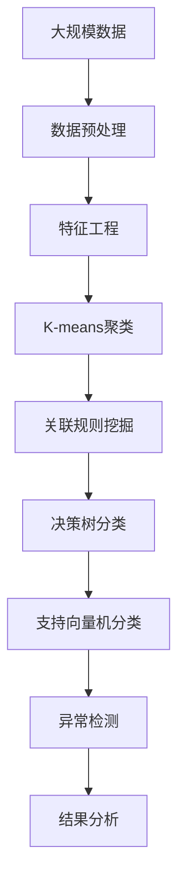

                 

# 数据挖掘 原理与代码实例讲解

> 关键词：数据挖掘, K-means, 聚类算法, 关联规则, 分类算法, 异常检测, Python, Pandas, Scikit-learn

## 1. 背景介绍

### 1.1 问题由来

数据挖掘（Data Mining）是指从大量数据中提取有用信息和知识的过程。随着互联网和大数据的蓬勃发展，数据挖掘在金融、医疗、电商、社交网络等多个领域发挥了重要的作用。例如，电商行业可以通过数据挖掘分析消费者行为，制定个性化推荐策略；金融行业可以通过数据挖掘监控金融市场动态，预测股票价格；医疗行业可以通过数据挖掘分析患者数据，制定个性化的治疗方案。

数据挖掘的核心问题包括聚类、分类、关联规则挖掘和异常检测等。其中，聚类算法是数据挖掘的基础，能够将数据划分为不同的类别或群体；分类算法是根据已有标记的训练数据，学习模型对新数据进行分类或预测；关联规则挖掘可以从大量交易数据中发现商品之间的关系；异常检测则是在数据集中发现异常值或离群点。

### 1.2 问题核心关键点

数据挖掘的核心在于如何从大量数据中提取有价值的信息和知识。其关键点包括：

- 数据预处理：清洗、归一化、特征选择等。
- 算法选择：根据数据类型和任务需求选择合适的算法。
- 模型训练：根据训练数据训练模型，并评估模型性能。
- 结果分析：解释和应用模型挖掘结果，提取有意义的知识和模式。

## 2. 核心概念与联系

### 2.1 核心概念概述

为更好地理解数据挖掘的原理和实践，本节将介绍几个关键概念：

- K-means聚类算法：一种基于距离的聚类算法，将数据划分为K个簇，每个簇的中心为质心。
- 关联规则挖掘：从大量交易数据中发现不同商品之间的关联关系，如购物篮分析。
- 决策树分类算法：根据已有标记的训练数据，构建一棵决策树，对新数据进行分类或预测。
- 支持向量机分类算法：基于最优化理论，寻找最优的超平面，将数据分为两个类别。
- 异常检测：识别数据集中的异常值或离群点，如基于统计学方法或密度聚类方法。

这些核心概念之间的逻辑关系可以通过以下Mermaid流程图来展示：



这个流程图展示了大数据挖掘的主要算法及其之间的关系：

1. 聚类算法（K-means）将数据划分为不同的簇。
2. 关联规则算法发现不同商品之间的关系。
3. 分类算法（决策树、支持向量机）对数据进行分类或预测。
4. 异常检测算法识别数据中的异常值或离群点。

这些算法共同构成了数据挖掘的基本框架，帮助我们从数据中提取有价值的信息和知识。

### 2.2 概念间的关系

这些核心概念之间存在着紧密的联系，形成了数据挖掘的完整生态系统。下面我们通过几个Mermaid流程图来展示这些概念之间的关系。

#### 2.2.1 数据挖掘的基本流程



这个流程图展示了数据挖掘的基本流程：

1. 数据预处理和特征工程，将原始数据转换为模型可以处理的格式。
2. 使用聚类算法对数据进行划分。
3. 使用关联规则算法发现数据中的关联关系。
4. 使用分类算法对数据进行分类或预测。
5. 使用异常检测算法识别数据中的异常值或离群点。
6. 对挖掘结果进行分析和应用。

#### 2.2.2 K-means聚类的应用场景



这个流程图展示了K-means聚类在电商推荐中的应用：

1. 使用K-means聚类对用户进行分组。
2. 使用关联规则挖掘发现不同用户之间的商品关联关系。
3. 使用决策树分类对用户进行个性化推荐。
4. 使用支持向量机分类对用户进行二分类预测。
5. 使用异常检测识别并移除异常用户。

#### 2.2.3 异常检测的应用场景



这个流程图展示了异常检测在信用卡欺诈检测中的应用：

1. 使用K-means聚类对交易行为进行分组。
2. 使用关联规则挖掘发现交易行为中的异常模式。
3. 使用决策树分类对交易行为进行分类预测。
4. 使用支持向量机分类对交易行为进行二分类预测。
5. 使用异常检测识别并报警异常交易。

### 2.3 核心概念的整体架构

最后，我们用一个综合的流程图来展示这些核心概念在大数据挖掘过程中的整体架构：



这个综合流程图展示了从数据预处理到结果分析的完整数据挖掘流程。大数据挖掘的各个步骤相互关联，共同构建了一个完整的体系，帮助我们从大量数据中提取有价值的信息和知识。

## 3. 核心算法原理 & 具体操作步骤
### 3.1 算法原理概述

数据挖掘的核心算法包括聚类、分类、关联规则挖掘和异常检测等。下面我们以K-means聚类算法为例，详细讲解其原理和操作步骤。

K-means算法是一种基于距离的聚类算法，将数据划分为K个簇，每个簇的中心为质心。其基本原理如下：

1. 随机初始化K个质心。
2. 将每个数据点分配到最近的质心所在的簇。
3. 重新计算每个簇的质心。
4. 重复步骤2和3，直到簇不再发生变化。

K-means算法通过迭代更新质心的位置，使得每个簇内的数据点与质心的距离最小。算法的时间复杂度为O(NKD)，其中N为数据点数量，K为簇的数量，D为数据维度。

### 3.2 算法步骤详解

K-means算法的详细步骤如下：

1. 随机初始化K个质心。
2. 对于每个数据点x，计算其与每个质心的距离，并将其分配到距离最近的质心所在的簇。
3. 对于每个簇，重新计算其质心，即所有簇内数据点的均值。
4. 重复步骤2和3，直到簇不再发生变化，即质心位置不再变化。

### 3.3 算法优缺点

K-means算法具有以下优点：

1. 简单易懂，易于实现。
2. 高效，适合大规模数据集。
3. 聚类效果较好，适用于大多数数据集。

同时，K-means算法也存在一些缺点：

1. 需要预先指定簇的数量K，否则难以确定。
2. 对初始质心敏感，不同的初始质心可能导致不同的聚类结果。
3. 适用于凸形簇，对于复杂形状或不规则形状的簇，效果较差。

### 3.4 算法应用领域

K-means聚类算法在许多领域都有广泛应用，例如：

- 电商推荐：将用户分为不同的群组，进行个性化推荐。
- 市场细分：将客户分为不同的细分市场，制定精准的市场策略。
- 图像处理：将图像中的像素分为不同的类别，进行图像分割。
- 生物信息学：将基因序列分为不同的簇，进行基因分类和功能分析。
- 社交网络：将社交网络中的用户分为不同的社区，进行社区分析和营销。

## 4. 数学模型和公式 & 详细讲解 & 举例说明

### 4.1 数学模型构建

K-means算法的基本模型为：

$$
\min_{\mu_k, x_i, k} \sum_{i=1}^N \min_{k} \|x_i - \mu_k\|^2
$$

其中，$\mu_k$为簇$k$的质心，$x_i$为数据点，$k$为簇的编号，$N$为数据点数量。

### 4.2 公式推导过程

K-means算法的公式推导过程如下：

1. 随机初始化K个质心$\mu_k$。
2. 对于每个数据点$x_i$，计算其与每个质心的距离$d(x_i, \mu_k)$，并将其分配到距离最近的质心所在的簇$k_i$。
3. 对于每个簇$k_i$，重新计算其质心$\mu_k = \frac{1}{|k_i|} \sum_{x_j \in k_i} x_j$。
4. 重复步骤2和3，直到簇不再发生变化，即质心位置不再变化。

### 4.3 案例分析与讲解

下面以一个简单的数据集为例，演示K-means算法的实现过程。

假设有一个包含100个点的数据集，我们需要将其分为2个簇。使用K-means算法进行聚类，步骤如下：

1. 随机初始化两个质心。
2. 对于每个数据点，计算其与两个质心的距离，并将其分配到距离最近的质心所在的簇。
3. 对于每个簇，重新计算其质心。
4. 重复步骤2和3，直到簇不再发生变化。

下面是使用Python实现K-means算法的代码：

```python
import numpy as np
from sklearn.cluster import KMeans

# 生成数据集
np.random.seed(42)
X = np.random.rand(100, 2)

# 创建K-means模型
kmeans = KMeans(n_clusters=2)

# 训练模型
kmeans.fit(X)

# 预测簇标签
labels = kmeans.predict(X)

# 输出聚类结果
print(labels)
```

这段代码使用Scikit-learn库中的KMeans模型进行聚类，输出每个数据点的簇标签。

## 5. 项目实践：代码实例和详细解释说明
### 5.1 开发环境搭建

在进行数据挖掘实践前，我们需要准备好开发环境。以下是使用Python进行Scikit-learn开发的环境配置流程：

1. 安装Anaconda：从官网下载并安装Anaconda，用于创建独立的Python环境。

2. 创建并激活虚拟环境：
```bash
conda create -n sklearn-env python=3.8 
conda activate sklearn-env
```

3. 安装Scikit-learn：使用pip安装Scikit-learn库。
```bash
pip install scikit-learn
```

4. 安装各类工具包：
```bash
pip install numpy pandas matplotlib
```

完成上述步骤后，即可在`sklearn-env`环境中开始数据挖掘实践。

### 5.2 源代码详细实现

下面我们以K-means聚类为例，给出使用Scikit-learn库对数据集进行聚类的PyTorch代码实现。

首先，定义数据集：

```python
from sklearn.datasets import make_blobs
import numpy as np

# 生成数据集
np.random.seed(42)
X, y = make_blobs(n_samples=100, centers=2, random_state=42)

# 创建K-means模型
kmeans = KMeans(n_clusters=2)

# 训练模型
kmeans.fit(X)
```

然后，训练K-means模型并输出聚类结果：

```python
# 预测簇标签
labels = kmeans.predict(X)

# 输出聚类结果
print(labels)
```

最后，使用Matplotlib可视化聚类结果：

```python
import matplotlib.pyplot as plt

# 可视化聚类结果
plt.scatter(X[:, 0], X[:, 1], c=labels)
plt.show()
```

以上就是使用Scikit-learn对数据集进行K-means聚类的完整代码实现。可以看到，得益于Scikit-learn的强大封装，我们可以用相对简洁的代码完成K-means聚类的实现。

### 5.3 代码解读与分析

让我们再详细解读一下关键代码的实现细节：

**make_blobs函数**：
- 用于生成一个包含指定数量样本和簇中心的数据集。
- 参数n_samples指定生成的样本数量，参数centers指定簇中心的数量。

**K-means模型**：
- 使用Scikit-learn库中的KMeans模型。
- 参数n_clusters指定簇的数量，初始质心通过K-means算法自动生成。

**fit函数**：
- 用于训练K-means模型。
- 输入参数为数据集X，输出为训练好的模型kmeans。

**predict函数**：
- 用于预测数据集X的簇标签。
- 输入参数为数据集X，输出为预测的簇标签。

**可视化结果**：
- 使用Matplotlib库的scatter函数绘制数据集和聚类结果。
- 参数c指定数据点的颜色，参数X指定数据点的坐标。

可以看到，使用Scikit-learn进行K-means聚类的代码实现相对简单，但其功能非常强大，可以处理各种类型的数据集，具有很高的应用价值。

## 6. 实际应用场景

### 6.1 电商推荐系统

电商推荐系统是K-means聚类算法的一个重要应用场景。推荐系统通过分析用户的历史行为数据，为用户推荐其可能感兴趣的商品。在电商推荐系统中，K-means聚类可以将用户分为不同的群组，每个群组的用户具有相似的购物行为和偏好。基于此，可以针对不同群组的用户，制定个性化的推荐策略。

### 6.2 市场细分

市场细分是K-means聚类算法的另一个重要应用场景。市场细分是将客户分为不同的细分市场，以便制定精准的市场策略。在市场细分过程中，K-means聚类可以将客户分为不同的群组，每个群组具有相似的消费习惯和需求。基于此，可以针对不同群组的客户，制定个性化的营销策略，提高营销效果。

### 6.3 图像处理

图像处理是K-means聚类算法在计算机视觉领域的重要应用。图像处理中，K-means聚类可以将图像中的像素分为不同的类别，进行图像分割。例如，可以将一张包含多个物体的图像分为不同的物体类别，提取每个物体的特征信息。

### 6.4 生物信息学

生物信息学是K-means聚类算法在生物领域的重要应用。生物信息学中，K-means聚类可以将基因序列分为不同的簇，进行基因分类和功能分析。例如，可以将一段基因序列分为不同的功能模块，分析每个模块的基因功能。

### 6.5 社交网络分析

社交网络分析是K-means聚类算法在社交网络领域的重要应用。社交网络分析中，K-means聚类可以将社交网络中的用户分为不同的社区，进行社区分析和营销。例如，可以将一个社交网络中的用户分为不同的兴趣群组，制定针对不同兴趣群组的营销策略。

## 7. 工具和资源推荐
### 7.1 学习资源推荐

为了帮助开发者系统掌握数据挖掘的理论基础和实践技巧，这里推荐一些优质的学习资源：

1. 《Python数据科学手册》：详细介绍了使用Python进行数据挖掘和机器学习的各种技术。
2. 《数据科学入门：使用Scikit-learn》：介绍了Scikit-learn库的各种机器学习算法和应用场景。
3. 《数据挖掘：概念与技术》：经典的数据挖掘教材，介绍了数据挖掘的基本概念和算法。
4. Kaggle竞赛平台：提供了大量数据集和竞赛任务，可以通过参与竞赛提高数据挖掘技能。
5. Coursera《数据挖掘与统计学习》课程：由斯坦福大学教授讲授，深入浅出地介绍了数据挖掘的基本原理和应用。

通过对这些资源的学习实践，相信你一定能够快速掌握数据挖掘的精髓，并用于解决实际的业务问题。

### 7.2 开发工具推荐

高效的开发离不开优秀的工具支持。以下是几款用于数据挖掘开发的常用工具：

1. Python：开源的编程语言，生态丰富，适合数据挖掘和机器学习任务。
2. Jupyter Notebook：交互式的编程环境，支持Python和各种库的代码编写和运行。
3. Scikit-learn：Python中的数据挖掘和机器学习库，提供了各种常用的机器学习算法和工具。
4. Pandas：Python中的数据处理库，提供了强大的数据处理和分析功能。
5. Matplotlib：Python中的数据可视化库，提供了丰富的绘图工具和函数。
6. Seaborn：基于Matplotlib的高级数据可视化库，提供了更高级的绘图功能。

合理利用这些工具，可以显著提升数据挖掘任务的开发效率，加快创新迭代的步伐。

### 7.3 相关论文推荐

数据挖掘技术的发展源于学界的持续研究。以下是几篇奠基性的相关论文，推荐阅读：

1. K-means：J.B. MacQueen, 1967
2. DBSCAN：Ester, M., H. Kriegel, J. Sander, X. Xu, 1996
3. 决策树：Quinlan, J.R., 1986
4. 支持向量机：Vapnik, V.N., 1995
5. 关联规则挖掘：Agrawal, R., Srikant, R., 1993
6. 异常检测：Zliobaite, I., 2010

这些论文代表了大数据挖掘技术的发展脉络。通过学习这些前沿成果，可以帮助研究者把握学科前进方向，激发更多的创新灵感。

除上述资源外，还有一些值得关注的前沿资源，帮助开发者紧跟数据挖掘技术的最新进展，例如：

1. arXiv论文预印本：人工智能领域最新研究成果的发布平台，包括大量尚未发表的前沿工作，学习前沿技术的必读资源。
2. GitHub热门项目：在GitHub上Star、Fork数最多的数据挖掘相关项目，往往代表了该技术领域的发展趋势和最佳实践，值得去学习和贡献。
3. 技术会议直播：如KDD、ICML、ICDM等数据挖掘领域顶会现场或在线直播，能够聆听到大佬们的前沿分享，开拓视野。
4. 数据挖掘社区：如Kaggle社区、Data Science Central社区等，可以与其他数据科学家交流心得，分享经验。
5. 行业分析报告：各大咨询公司如McKinsey、PwC等针对数据挖掘行业的分析报告，有助于从商业视角审视技术趋势，把握应用价值。

总之，对于数据挖掘技术的学习和实践，需要开发者保持开放的心态和持续学习的意愿。多关注前沿资讯，多动手实践，多思考总结，必将收获满满的成长收益。

## 8. 总结：未来发展趋势与挑战

### 8.1 总结

本文对数据挖掘的原理和实践进行了全面系统的介绍。首先阐述了数据挖掘的研究背景和意义，明确了聚类、分类、关联规则挖掘和异常检测等核心问题的价值。其次，从原理到实践，详细讲解了K-means聚类算法的基本原理和操作步骤，给出了数据挖掘任务开发的完整代码实例。同时，本文还广泛探讨了数据挖掘方法在电商推荐、市场细分、图像处理等多个行业领域的应用前景，展示了数据挖掘技术的巨大潜力。此外，本文精选了数据挖掘技术的各类学习资源，力求为读者提供全方位的技术指引。

通过本文的系统梳理，可以看到，数据挖掘技术在众多领域都发挥着重要的作用。从电商推荐到市场细分，从图像处理到生物信息学，数据挖掘技术的应用范围越来越广泛，为我们分析和应用海量数据提供了强有力的工具。未来，伴随大数据和人工智能技术的不断发展，数据挖掘技术必将迎来更广阔的应用前景，进一步提升我们的生活和工作效率。

### 8.2 未来发展趋势

展望未来，数据挖掘技术将呈现以下几个发展趋势：

1. 大数据与AI融合。大数据和人工智能技术的结合，将推动数据挖掘技术的发展。通过机器学习算法，可以从大数据中提取更有价值的信息和知识。
2. 自动化和智能化。自动化和智能化技术的应用，将使得数据挖掘过程更加高效和智能化。例如，自动特征工程、自动化模型选择和调优等。
3. 跨领域融合。数据挖掘技术将与其他技术进行更深入的融合，如自然语言处理、计算机视觉、机器人等。
4. 多模态数据挖掘。从单一模态数据挖掘扩展到多模态数据挖掘，如语音、图像、文本等多模态数据融合。
5. 实时数据挖掘。从离线数据挖掘扩展到实时数据挖掘，如流数据挖掘、事件驱动数据挖掘等。
6. 可解释性和公平性。可解释性和公平性是数据挖掘的重要研究方向，未来的数据挖掘算法需要具备更高的透明度和公平性。

以上趋势凸显了数据挖掘技术的广阔前景。这些方向的探索发展，将进一步提升数据挖掘的性能和应用范围，为大数据时代的分析和应用提供更强大的工具。

### 8.3 面临的挑战

尽管数据挖掘技术已经取得了瞩目成就，但在迈向更加智能化、普适化应用的过程中，它仍面临着诸多挑战：

1. 数据隐私和安全。大数据挖掘涉及大量的敏感数据，如何保障数据隐私和安全是一个重要问题。
2. 数据质量和完整性。数据挖掘的准确性依赖于数据的质量和完整性，如何确保数据质量是一个重要问题。
3. 计算资源和算力。数据挖掘涉及大量的计算资源和算力，如何高效利用计算资源是一个重要问题。
4. 模型可解释性和透明性。数据挖掘模型往往是"黑盒"系统，如何解释模型的决策过程是一个重要问题。
5. 异常检测和异常值的处理。异常检测是数据挖掘中的重要问题，如何识别和处理异常值是一个重要问题。
6. 自动化和智能化。自动化和智能化技术的应用，虽然提高了效率，但也带来了新的问题，如自动化调参、自动化模型选择等。

正视数据挖掘面临的这些挑战，积极应对并寻求突破，将是大数据挖掘技术走向成熟的必由之路。相信随着学界和产业界的共同努力，这些挑战终将一一被克服，数据挖掘技术必将在构建人机协同的智能时代中扮演越来越重要的角色。

### 8.4 研究展望

面对数据挖掘面临的种种挑战，未来的研究需要在以下几个方面寻求新的突破：

1. 自动化和智能化。研究自动化和智能化技术，提高数据挖掘过程的效率和准确性。
2. 数据隐私和安全。研究数据隐私和安全技术，保护数据隐私和安全。
3. 数据质量和完整性。研究数据清洗和处理技术，提高数据质量和完整性。
4. 模型可解释性和透明性。研究可解释性技术和透明性技术，提高模型的可解释性和透明性。
5. 异常检测和异常值的处理。研究异常检测和异常值处理技术，提高异常检测的准确性。
6. 多模态数据挖掘。研究多模态数据挖掘技术，提高多模态数据的融合能力。
7. 实时数据挖掘。研究实时数据挖掘技术，提高实时数据的挖掘能力。

这些研究方向将推动数据挖掘技术的发展，使得数据挖掘技术更好地服务于社会和经济的发展。总之，数据挖掘技术需要在数据质量、数据安全、自动化和智能化等方面不断优化和创新，才能在未来的数据驱动时代中发挥更大的作用。

## 9. 附录：常见问题与解答

**Q1：数据挖掘和机器学习的区别是什么？**

A: 数据挖掘和机器学习是两个不同的概念。数据挖掘是从大量数据中提取有用信息和知识的过程，而机器学习则是训练模型进行预测和决策的过程。数据挖掘可以看作是机器学习的前置工作，数据挖掘的结果可以为机器学习提供数据和特征，帮助机器学习更高效地进行预测和决策。

**Q2：数据挖掘需要哪些步骤？**

A: 数据挖掘通常包括以下几个步骤：

1. 数据预处理：清洗、归一化、特征选择等。
2. 特征工程：构造新的特征，提高模型的准确性。
3. 数据探索：对数据进行探索性分析，了解数据特征。
4. 模型选择：选择合适的算法，训练模型。
5. 模型评估：评估模型的性能，选择最优模型。
6. 结果解释：解释和应用模型挖掘结果。

**Q3：数据挖掘的应用场景有哪些？**

A: 数据挖掘的应用场景非常广泛，包括但不限于：

1. 电商推荐系统：通过分析用户行为，推荐商品。
2. 市场细分：将客户分为不同的细分市场，制定精准的市场策略。
3. 图像处理：对图像进行分割、分类和识别。
4. 生物信息学：从基因序列中提取有用信息，进行基因分类和功能分析。
5. 金融风险管理：通过分析金融数据，预测股票价格和信用风险。
6. 社交网络分析：对社交网络进行分析和挖掘，发现用户行为和社区关系。
7. 健康医疗：从患者数据中提取有用信息，制定个性化的治疗方案。

**Q4：数据挖掘和人工智能的结合点在哪里？**

A: 数据挖掘和人工智能的结合点主要在以下几个方面：

1. 数据预处理：数据挖掘中的数据清洗和特征选择可以为人工智能提供高质量的训练数据。
2. 特征工程：数据挖掘中的特征提取和构造可以为人工智能提供更好的输入特征。
3. 模型选择和评估：

