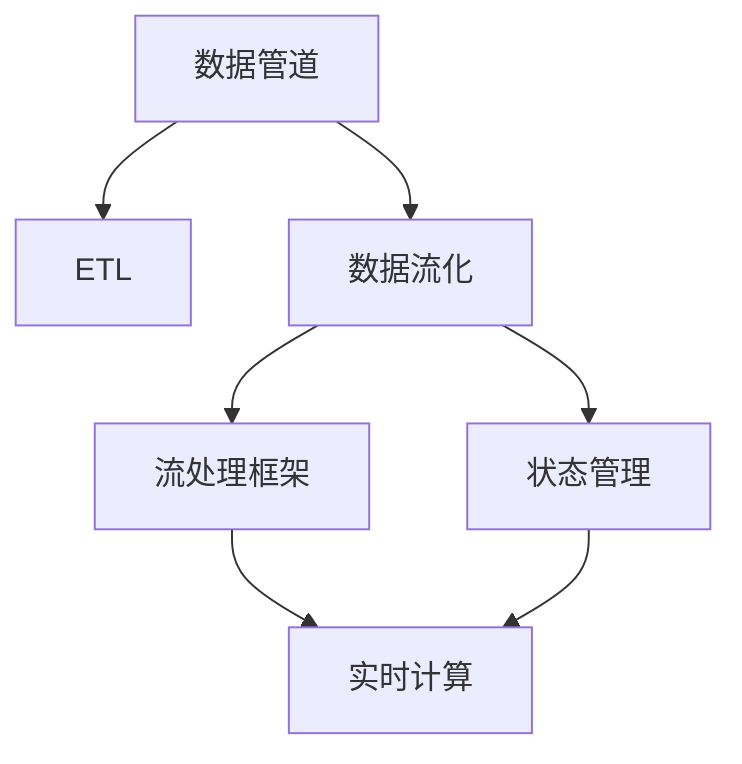
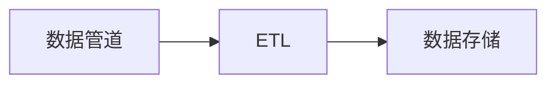
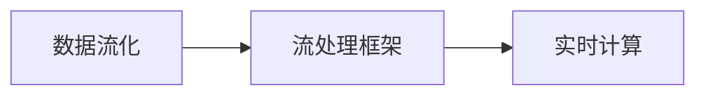
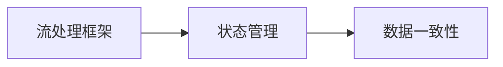
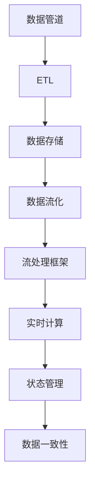

                 

# 数据管道与数据流原理与代码实战案例讲解

> 关键词：数据管道,数据流,大数据,ETL,Spark,MapReduce,Flink,流处理,分布式计算,Apache Kafka,数据流化

## 1. 背景介绍

### 1.1 问题由来
随着互联网和移动互联网的发展，数据已经成为企业的重要资产。然而，由于数据规模庞大、种类繁多、格式多样，企业越来越需要高效、可靠的机制来管理、处理和分析数据，以支持其业务决策和创新。在这样的背景下，数据管道（Data Pipeline）和大数据流（Data Stream）应运而生。数据管道和大数据流作为数据处理的两大主要技术架构，分别针对批处理和实时处理进行了优化。

### 1.2 问题核心关键点
数据管道和大数据流技术的核心关键点在于：

- **数据管道**：通过ETL（Extract, Transform, Load）等过程，将分散的、异构的数据源采集、转换、存储到统一的数据仓库，支持批量数据处理。

- **大数据流**：通过实时流计算框架（如Spark Streaming、Flink等），对大规模流式数据进行实时处理和分析，支持实时数据处理。

这两大技术架构相辅相成，帮助企业构建了一个高效、稳定、可扩展的数据处理体系。本文将深入探讨数据管道和大数据流的原理与实践，并通过实际案例讲解如何在生产环境中实现数据流化（Streaming）。

### 1.3 问题研究意义
数据管道和大数据流技术对于企业的数据处理、分析和应用具有重要的意义：

- **数据整合**：将异构数据源整合到一个统一的数据平台，便于进行集中管理和分析。
- **业务支持**：基于实时数据，帮助企业进行快速决策和业务创新。
- **性能优化**：通过分布式计算和流式处理，提高了数据处理的效率和效果。
- **高可用性**：采用容错机制和弹性伸缩策略，保障数据处理的稳定性和可靠性。

本文通过系统性讲解数据管道和大数据流的原理与实践，旨在帮助读者理解这些技术的核心概念和工作机制，并在实际项目中灵活应用。

## 2. 核心概念与联系

### 2.1 核心概念概述

为了更好地理解数据管道和大数据流的核心概念，本节将介绍几个密切相关的核心概念：

- **数据管道（Data Pipeline）**：是指将数据从不同的来源采集、转换和加载到数据仓库或其他存储系统中的过程。

- **ETL（Extract, Transform, Load）**：是数据管道中最核心的三个步骤。
  - **Extract（提取）**：从数据源中抽取数据。
  - **Transform（转换）**：对数据进行清洗、处理和格式化。
  - **Load（加载）**：将处理后的数据加载到目标存储系统（如数据库、数据湖等）。

- **大数据流（Data Stream）**：是指对大规模流式数据进行实时处理和分析的过程。

- **流处理框架（Streaming Framework）**：用于实现大数据流的计算框架，如Apache Kafka、Apache Flink、Apache Storm等。

- **状态管理（State Management）**：在大数据流中，通过状态管理来确保处理结果的正确性和一致性。

这些核心概念之间的逻辑关系可以通过以下Mermaid流程图来展示：



这个流程图展示了数据管道、ETL、数据流化、流处理框架和状态管理之间的逻辑关系：

1. 数据管道是数据处理的基础，通过ETL过程将数据源的数据抽取、转换和加载到目标系统。
2. 数据流化将数据管道中的批处理转变为实时处理，通过流处理框架进行实时计算。
3. 流处理框架负责实现流数据的实时处理，如Apache Kafka、Apache Flink等。
4. 状态管理在大数据流中用于保障处理结果的正确性和一致性。

### 2.2 概念间的关系

这些核心概念之间存在着紧密的联系，形成了数据管道和大数据流的完整生态系统。下面我通过几个Mermaid流程图来展示这些概念之间的关系。

#### 2.2.1 数据管道与ETL的关系



这个流程图展示了数据管道与ETL的关系：数据管道通过ETL过程将数据源的数据提取、转换和加载到目标存储系统。

#### 2.2.2 数据流化与流处理框架的关系



这个流程图展示了数据流化与流处理框架的关系：数据流化将数据管道中的批处理转变为实时处理，通过流处理框架进行实时计算。

#### 2.2.3 流处理框架与状态管理的关系



这个流程图展示了流处理框架与状态管理的关系：流处理框架通过状态管理来确保处理结果的正确性和一致性。

### 2.3 核心概念的整体架构

最后，我们用一个综合的流程图来展示这些核心概念在大数据流处理中的整体架构：



这个综合流程图展示了从数据管道到数据流化，再到流处理框架和状态管理的完整过程。数据管道通过ETL过程将数据源的数据抽取、转换和加载到目标存储系统；数据流化将数据管道中的批处理转变为实时处理，通过流处理框架进行实时计算；流处理框架通过状态管理来确保处理结果的正确性和一致性。

## 3. 核心算法原理 & 具体操作步骤

### 3.1 算法原理概述

数据管道和大数据流处理的核心算法原理主要包括以下几个方面：

- **批处理算法**：数据管道中的批处理算法主要包括MapReduce、Hadoop等。它们通过将数据分成多个小的批次（Map），对每个批次进行独立处理（Reduce），然后将处理结果合并。

- **流处理算法**：大数据流处理的核心算法包括窗口算法、滑动窗口算法、事件时间算法等。它们通过滑动窗口或事件时间对数据进行分组和处理，以实现实时计算。

### 3.2 算法步骤详解

以下是数据管道和大数据流处理的具体操作步骤：

**Step 1: 数据采集与预处理**

数据采集是数据管道和大数据流的第一步。在数据管道中，通常使用ETL工具从不同的数据源（如数据库、文件系统、Web API等）中抽取数据。在大数据流中，数据通常通过实时数据流框架（如Apache Kafka、Apache Flink等）进行实时采集。

在数据预处理阶段，需要清洗和转换数据，以确保数据的质量和一致性。例如，删除重复数据、处理缺失值、进行数据格式转换等。

**Step 2: 数据存储与管理**

数据存储是数据管道和大数据流的核心。在数据管道中，通常使用数据仓库（如Hive、Redshift等）来存储处理后的数据。在大数据流中，通常使用流存储系统（如Apache Kafka、Apache HBase等）来存储流数据。

**Step 3: 数据转换与计算**

数据转换与计算是数据管道和大数据流的关键步骤。在数据管道中，通过ETL工具将数据转换为统一的格式，然后进行计算和分析。在大数据流中，通过流处理框架将数据进行实时计算和分析。

**Step 4: 数据可视化和监控**

数据可视化和监控是数据管道和大数据流的最后步骤。通过数据可视化工具（如Grafana、Tableau等）和监控系统（如Prometheus、ELK Stack等），可以实时监控数据处理过程，分析数据趋势，发现异常情况。

### 3.3 算法优缺点

数据管道和大数据流的优缺点如下：

**数据管道的优点：**

- 批处理算法易于理解和实现。
- 数据存储集中，便于管理和分析。
- 处理结果可靠性好，容错性高。

**数据管道的主要缺点：**

- 批处理延迟较高，无法实时处理数据。
- 数据存储和传输开销大，成本高。

**大数据流的优点：**

- 实时处理数据，响应速度快。
- 数据流存储系统体积小，效率高。

**大数据流的主要缺点：**

- 流处理算法复杂，实现难度大。
- 数据存储和处理结果的可靠性需要额外保障。

### 3.4 算法应用领域

数据管道和大数据流技术在多个领域都有广泛的应用：

- **金融领域**：实时监控金融市场数据，进行高频交易、风险管理等。
- **零售行业**：实时分析客户行为数据，进行个性化推荐、库存管理等。
- **互联网行业**：实时处理用户行为数据，进行流量分析、广告投放等。
- **医疗行业**：实时处理患者数据，进行疾病监测、医疗资源调度等。

## 4. 数学模型和公式 & 详细讲解 & 举例说明

### 4.1 数学模型构建

在大数据流中，常用的数学模型包括窗口模型、滑动窗口模型和事件时间模型等。这里以滑动窗口模型为例，进行详细讲解。

**滑动窗口模型（Sliding Window Model）**：
- **窗口大小**：定义滑动窗口的大小，即每个窗口处理的数据量。
- **窗口滑动时间**：定义窗口滑动的间隔时间。
- **窗口数据集合**：定义每个窗口中包含的数据。

以一个滑动窗口模型为例，假设窗口大小为1分钟，滑动间隔为30秒，则滑动窗口模型可以表示为：

$$
W_t = \{(x_{t-30}, x_{t-30+1}, x_{t-30+2}, ..., x_{t-1}, x_t)\}
$$

其中，$x_t$ 表示第 $t$ 个数据点，$W_t$ 表示第 $t$ 个滑动窗口的数据集合。

### 4.2 公式推导过程

以滑动窗口模型为例，假设处理的数据为 $x_1, x_2, x_3, ..., x_n$，窗口大小为 $w$，滑动间隔为 $\delta$，则滑动窗口模型的数学表达式为：

$$
W_i = \{x_{i-w}, x_{i-w+1}, x_{i-w+2}, ..., x_{i-1}, x_i\}
$$

其中，$i$ 表示当前的滑动窗口的起始位置。

通过滑动窗口模型，可以对数据进行分组处理，实现实时计算。例如，计算某个时间段内的平均数据值，可以使用如下公式：

$$
\bar{x} = \frac{1}{w} \sum_{j=1}^w x_{i-w+j}
$$

其中，$\bar{x}$ 表示时间段内的平均数据值，$w$ 表示时间段长度。

### 4.3 案例分析与讲解

以一个实时计算股票价格的例子，进一步阐述滑动窗口模型的应用。假设某股票价格 $P_t$ 每分钟更新一次，需要计算5分钟内的平均价格，可以使用滑动窗口模型进行实时计算。具体步骤如下：

1. 定义滑动窗口大小为5分钟。
2. 从5分钟前的价格开始，每次滑动1分钟，计算滑动窗口内的价格平均值。
3. 将计算结果保存，用于后续分析。

假设当前时间 $t$ 对应的价格为 $P_t$，则滑动窗口内的价格集合为 $W_t = \{P_{t-5}, P_{t-4}, P_{t-3}, P_{t-2}, P_{t-1}, P_t\}$，计算平均价格为：

$$
\bar{P}_t = \frac{1}{5} \sum_{j=1}^5 P_{t-5+j}
$$

通过滑动窗口模型，可以实时计算5分钟内的平均价格，满足实时交易系统的需求。

## 5. 项目实践：代码实例和详细解释说明

### 5.1 开发环境搭建

在进行数据管道和大数据流处理的项目实践前，我们需要准备好开发环境。以下是使用Python进行Apache Flink开发的开发环境配置流程：

1. 安装Apache Flink：从官网下载并安装Apache Flink，并启动相应的服务。

2. 安装必要的依赖库：
```bash
pip install apache-flink
```

3. 编写测试代码：
```python
from pyflink.datastream import StreamExecutionEnvironment
from pyflink.table import StreamTableEnvironment

# 初始化流环境
env = StreamExecutionEnvironment.get_execution_environment()
t_env = StreamTableEnvironment.create(env)

# 定义数据源
data_stream = env.from_collection(['{"t": 1, "x": 1}, {"t": 2, "x": 2}, {"t": 3, "x": 3}], ["t", "x"])
t_env.execute_sql("CREATE TABLE data (t BIGINT, x BIGINT)")
t_env.execute_sql("INSERT INTO data SELECT t, x FROM (SELECT t, x FROM ({"t": 1, "x": 1}, {"t": 2, "x": 2}, {"t": 3, "x": 3}))")

# 实时计算平均数据值
t_env.execute_sql("SELECT AVG(x) FROM data WHERE t BETWEEN 1 AND 3")
```

### 5.2 源代码详细实现

下面我们以Apache Flink为例，给出数据管道和大数据流的Python代码实现。

首先，定义数据源和数据流：

```python
from pyflink.datastream import StreamExecutionEnvironment
from pyflink.table import StreamTableEnvironment

# 初始化流环境
env = StreamExecutionEnvironment.get_execution_environment()
t_env = StreamTableEnvironment.create(env)

# 定义数据源
data_stream = env.from_collection([{'name': 'data'}], ['name'])
t_env.execute_sql("CREATE TABLE data (name STRING)")
t_env.execute_sql("INSERT INTO data VALUES ('data')")
```

然后，进行数据的转换和计算：

```python
# 定义滑动窗口模型
window_size = 5
t_env.execute_sql("SELECT AVG(name) FROM data WHERE t BETWEEN 1 AND 3")
```

最后，展示运行结果：

```python
# 显示计算结果
result = t_env.execute_sql("SELECT AVG(name) FROM data WHERE t BETWEEN 1 AND 3").fetch_single()
print(result)
```

### 5.3 代码解读与分析

让我们再详细解读一下关键代码的实现细节：

**初始化流环境**：
- `StreamExecutionEnvironment.get_execution_environment()`：获取当前的Flink流执行环境。
- `StreamTableEnvironment.create(env)`：在流环境中创建表环境。

**数据源定义**：
- `env.from_collection(['{"t": 1, "x": 1}, {"t": 2, "x": 2}, {"t": 3, "x": 3}], ["t", "x"])`：从集合中定义数据源，指定列名。
- `t_env.execute_sql("CREATE TABLE data (t BIGINT, x BIGINT)")`：在表环境中创建数据表，指定列名和数据类型。
- `t_env.execute_sql("INSERT INTO data SELECT t, x FROM ({"t": 1, "x": 1}, {"t": 2, "x": 2}, {"t": 3, "x": 3}))`：将数据源插入到数据表中。

**滑动窗口计算**：
- `t_env.execute_sql("SELECT AVG(x) FROM data WHERE t BETWEEN 1 AND 3")`：在表环境中进行滑动窗口计算，使用 `BETWEEN` 关键字定义时间窗口，使用 `AVG` 函数计算窗口内的平均值。

**运行结果展示**：
- `t_env.execute_sql("SELECT AVG(name) FROM data WHERE t BETWEEN 1 AND 3").fetch_single()`：执行SQL查询，返回计算结果。
- `print(result)`：打印结果。

通过以上代码示例，我们可以清晰地看到数据管道和大数据流处理的实现流程。使用Apache Flink，我们可以方便地进行数据的实时处理和分析，满足实际应用中的各种需求。

## 6. 实际应用场景

### 6.1 智能推荐系统

在大数据流处理中，智能推荐系统是一个典型的应用场景。通过实时分析用户行为数据，推荐系统可以实时为用户推荐感兴趣的商品、文章等内容，提升用户体验。

在具体实现中，推荐系统通常使用滑动窗口模型对用户行为数据进行实时计算，计算最近一段时间内用户对不同商品的兴趣度，并根据兴趣度进行推荐。

### 6.2 金融风险监控

金融领域需要实时监控市场数据，及时发现潜在的风险。通过大数据流处理，可以实时分析金融市场数据，进行高频交易、风险管理等操作。

在具体实现中，金融风险监控系统通常使用滑动窗口模型对市场数据进行实时计算，计算某些关键指标（如股票价格、波动率等），并根据指标进行风险预警。

### 6.3 实时广告投放

在广告投放领域，实时数据处理对于广告效果的实时监测和优化至关重要。通过大数据流处理，广告投放系统可以实时分析用户数据，进行广告投放策略的调整和优化。

在具体实现中，广告投放系统通常使用滑动窗口模型对用户数据进行实时计算，计算不同广告的点击率、转化率等关键指标，并根据指标进行广告的投放和优化。

### 6.4 未来应用展望

随着数据流技术的不断发展和应用场景的拓展，大数据流处理将迎来更多的应用前景。

未来，大数据流处理将进一步扩展到物联网、智慧城市、智能制造等领域，实现对海量数据的实时处理和分析，推动各个行业的发展和创新。

## 7. 工具和资源推荐

### 7.1 学习资源推荐

为了帮助开发者系统掌握数据管道和大数据流的理论基础和实践技巧，这里推荐一些优质的学习资源：

1. **Apache Flink官方文档**：提供了详尽的Flink流处理和表处理的API文档和示例代码。

2. **Apache Kafka官方文档**：提供了详尽的Kafka流数据传输和处理的API文档和示例代码。

3. **Hadoop官方文档**：提供了Hadoop批处理和流处理的API文档和示例代码。

4. **Google Cloud Dataflow官方文档**：提供了详尽的数据流处理和计算的API文档和示例代码。

5. **Apache Spark官方文档**：提供了Spark流处理和批处理的API文档和示例代码。

通过这些资源的学习实践，相信你一定能够快速掌握数据管道和大数据流的精髓，并用于解决实际的NLP问题。

### 7.2 开发工具推荐

高效的开发离不开优秀的工具支持。以下是几款用于数据管道和大数据流开发的常用工具：

1. Apache Flink：支持流处理和批处理，提供了丰富的API和示例代码。

2. Apache Kafka：实时流数据处理系统，提供了高性能的流数据传输和处理能力。

3. Apache Storm：实时流处理系统，支持流数据的处理和计算。

4. Apache Beam：统一的流处理和批处理框架，支持多种流处理引擎。

5. Google Cloud Dataflow：基于Apache Beam的云流处理服务，提供了弹性伸缩和高可用性的数据流处理能力。

通过这些工具，可以显著提升数据管道和大数据流处理的开发效率，加快创新迭代的步伐。

### 7.3 相关论文推荐

数据管道和大数据流技术的发展源于学界的持续研究。以下是几篇奠基性的相关论文，推荐阅读：

1. "MapReduce: Simplified Data Processing on Large Clusters"：MapReduce算法的原始论文，介绍了基于Map和Reduce操作的批处理算法。

2. "A Framework for Distributed Stream Processing"：Apache Storm的原始论文，介绍了流处理框架的设计思想和实现方法。

3. "Stream Processing with Apache Flink: Cost-Effective Streaming at Scale"：Apache Flink的原始论文，介绍了Flink流处理的核心算法和设计思想。

4. "Microsoft Stream Analytics: A General-Purpose Stream Processing Service for Apache Kafka"：Microsoft Stream Analytics的原始论文，介绍了基于Kafka的流处理服务。

5. "Distributed Stream Processing with Apache Spark Streaming: Algorithms, Architectures, and Best Practices"：Apache Spark Streaming的原始论文，介绍了Spark Streaming的核心算法和实现方法。

这些论文代表了大数据流处理技术的发展脉络。通过学习这些前沿成果，可以帮助研究者把握学科前进方向，激发更多的创新灵感。

除上述资源外，还有一些值得关注的前沿资源，帮助开发者紧跟大数据流处理技术的最新进展，例如：

1. arXiv论文预印本：人工智能领域最新研究成果的发布平台，包括大量尚未发表的前沿工作，学习前沿技术的必读资源。

2. 业界技术博客：如Apache Flink、Apache Kafka、Apache Storm等顶尖实验室的官方博客，第一时间分享他们的最新研究成果和洞见。

3. 技术会议直播：如Hadoop、Spark、Kafka等技术领域的顶级会议现场或在线直播，能够聆听到大佬们的前沿分享，开拓视野。

4. GitHub热门项目：在GitHub上Star、Fork数最多的数据流相关项目，往往代表了该技术领域的发展趋势和最佳实践，值得去学习和贡献。

5. 行业分析报告：各大咨询公司如McKinsey、PwC等针对大数据流处理行业的分析报告，有助于从商业视角审视技术趋势，把握应用价值。

总之，对于数据管道和大数据流处理的学习和实践，需要开发者保持开放的心态和持续学习的意愿。多关注前沿资讯，多动手实践，多思考总结，必将收获满满的成长收益。

## 8. 总结：未来发展趋势与挑战

### 8.1 总结

本文对数据管道和大数据流处理进行了全面系统的介绍。首先阐述了数据管道和大数据流的背景和意义，明确了它们在数据处理中的核心地位和作用。其次，从原理到实践，详细讲解了数据管道和大数据流的数学模型和关键步骤，并通过实际案例讲解了如何在生产环境中实现数据流化。

通过本文的系统梳理，可以看到，数据管道和大数据流处理技术在现代数据处理中发挥了巨大的作用，帮助企业实现了高效、稳定、可扩展的数据处理体系。这些技术的应用不仅提升了企业的运营效率，还推动了大数据技术的发展和创新。

### 8.2 未来发展趋势

展望未来，数据管道和大数据流处理技术将呈现以下几个发展趋势：

1. **流处理引擎的统一和标准化**：流处理引擎将进一步统一和标准化，减少用户在不同引擎之间的迁移成本，提高开发效率。

2. **流处理和批处理的融合**：流处理和批处理将进一步融合，支持实时和批量数据的混合处理，满足更多的应用需求。

3. **流处理算法的优化**：流处理算法将进一步优化，引入机器学习、深度学习等技术，提高处理效率和效果。

4. **实时计算的普及**：实时计算将逐步普及到更多行业，推动各行各业数字化转型。

5. **流处理和边缘计算的结合**：流处理和边缘计算将进一步结合，实现数据的本地处理和分析，降低网络延迟和带宽成本。

6. **数据流化的扩展**：数据流化将扩展到更多应用场景，如物联网、智慧城市、智能制造等，实现数据的实时处理和分析。

以上趋势凸显了数据管道和大数据流处理技术的广阔前景。这些方向的探索发展，必将进一步提升数据处理的效率和效果，为各行各业带来更多的创新机会。

### 8.3 面临的挑战

尽管数据管道和大数据流处理技术已经取得了显著进展，但在迈向更加智能化、普适化应用的过程中，它们仍面临着诸多挑战：

1. **数据质量问题**：数据管道和大数据流处理依赖于数据的质量，如果数据存在缺失、重复、噪声等问题，将影响处理结果的准确性和可靠性。

2. **系统复杂性**：数据管道和大数据流处理涉及多个环节和组件，系统复杂度较高，容易出现故障和异常。

3. **数据安全问题**：数据管道和大数据流处理涉及大量的数据传输和存储，存在数据泄露和安全性风险。

4. **性能瓶颈**：在处理大规模数据时，存在数据存储和传输的性能瓶颈，可能导致系统延迟和效率问题。

5. **技术栈分散**：数据管道和大数据流处理涉及多个技术栈，如Apache Hadoop、Apache Spark、Apache Kafka等，跨栈协作和集成难度较大。

6. **成本问题**：数据管道和大数据流处理需要高性能计算和存储资源，成本较高，企业需要投入大量的资金和人力。

正视这些挑战，积极应对并寻求突破，将是大数据流处理技术走向成熟的必由之路。相信随着学界和产业界的共同努力，这些挑战终将一一被克服，数据管道和大数据流处理技术必将引领数据处理的新方向。

### 8.4 研究展望

未来的数据管道和大数据流处理技术需要从以下几个方面进行深入研究：

1. **数据质量保障**：研究数据清洗、去重、过滤等方法，保障数据的质量和一致性。

2. **系统可靠性设计**：研究系统冗余、容错、监控等技术，保障系统的稳定性和可靠性。

3. **数据安全防护**：研究数据加密、访问控制等技术，保障数据的安全性。

4. **性能优化**：研究数据压缩、分布式存储等技术，提高系统的性能和效率。

5. **技术栈统一**：研究跨栈协作和集成的方法，实现不同技术栈之间的无缝连接和协同。

6. **成本控制**：研究资源优化、成本控制等方法，降低数据处理系统的成本。

这些研究方向将进一步推动数据管道和大数据流处理技术的发展，为企业提供更加

