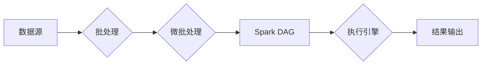

# Spark Streaming原理与代码实例讲解

> 关键词：Spark Streaming，实时流处理，微批处理，数据流，高吞吐量，弹性，可扩展性，编程模型

## 1. 背景介绍

随着互联网和物联网的快速发展，实时数据处理成为企业数据架构中不可或缺的一部分。Apache Spark Streaming 是 Apache Spark 生态系统中的一个组件，它允许开发者以高吞吐量、低延迟的方式处理实时数据流。本文将深入探讨 Spark Streaming 的原理，并通过代码实例讲解其应用。

### 1.1 问题的由来

实时数据处理需求源于以下几个方面的原因：

- **在线分析**：企业需要实时分析用户行为，以便及时调整营销策略或优化用户体验。
- **事件驱动应用**：金融、电商等行业需要实时处理交易事件，以快速响应市场变化。
- **日志聚合**：IT运维需要实时监控和分析系统日志，以便及时发现和解决问题。

传统的批处理系统，如 Hadoop，虽然能够处理大规模数据，但无法满足实时性要求。Spark Streaming 应运而生，它结合了 Spark 的高性能和实时性，成为了处理实时数据流的理想选择。

### 1.2 研究现状

Spark Streaming 支持多种数据源，包括 Kafka、Flume、Twitter、ZeroMQ 等，并且可以与 Spark 的其他组件无缝集成，如 Spark SQL、MLlib 和 GraphX。它通过微批处理的方式来实现实时数据处理，即在固定时间窗口内对一小批数据执行计算。

### 1.3 研究意义

掌握 Spark Streaming 的原理和应用，对于开发实时数据应用程序至关重要。它可以帮助开发者：

- **快速构建实时应用程序**：利用 Spark Streaming 的易用性和高吞吐量特性。
- **集成多种数据源**：轻松地将实时数据流与现有的数据基础设施集成。
- **优化数据处理流程**：通过 Spark 的强大数据处理能力，优化实时数据处理流程。

### 1.4 本文结构

本文将按照以下结构进行：

- 介绍 Spark Streaming 的核心概念和流程。
- 深入探讨 Spark Streaming 的算法原理和操作步骤。
- 通过代码实例展示 Spark Streaming 的应用。
- 探讨 Spark Streaming 在实际应用场景中的案例。
- 推荐相关学习资源、开发工具和论文。
- 总结 Spark Streaming 的发展趋势和挑战。

## 2. 核心概念与联系

### 2.1 核心概念原理

Spark Streaming 的核心概念包括：

- **DStream (Discretized Stream)**：离散化流，是 Spark Streaming 的基本抽象，代表了实时数据流。
- **批处理**：将实时数据流划分为固定时间窗口的批次进行处理。
- **微批处理**：Spark Streaming 通常使用微批处理来模拟实时数据处理，每个批次包含一定数量的数据点。
- **操作符**：如 map、reduce、join 等，用于对 DStream 进行操作。

以下是一个 Mermaid 流程图，展示了 Spark Streaming 的基本架构：



### 2.2 关联组件

Spark Streaming 与 Spark 的其他组件紧密关联，包括：

- **Spark Core**：提供分布式计算引擎。
- **Spark SQL**：提供数据处理和分析能力。
- **MLlib**：提供机器学习算法库。
- **GraphX**：提供图处理能力。

## 3. 核心算法原理 & 具体操作步骤

### 3.1 算法原理概述

Spark Streaming 的微批处理机制允许开发者以流式的方式对数据进行处理。它通过以下步骤实现：

1. 数据源接收入流数据。
2. 将数据划分为固定时间窗口的批次。
3. 对每个批次的数据执行批处理操作。
4. 将处理结果输出到指定目标。

### 3.2 算法步骤详解

1. **数据源接入**：Spark Streaming 支持多种数据源，如 Kafka、Flume、Twitter 等。开发者需要根据实际需求选择合适的数据源。

2. **批处理**：Spark Streaming 使用 Spark Core 的分布式计算能力，对每个批次的数据进行批处理。

3. **微批处理**：为了实现实时处理，Spark Streaming 通常使用微批处理。微批处理的大小可以根据具体需求进行调整。

4. **操作符应用**：在批处理阶段，开发者可以使用 Spark 提供的各种操作符对数据进行分析和处理。

5. **结果输出**：处理结果可以输出到文件系统、数据库或其他数据源。

### 3.3 算法优缺点

**优点**：

- **高吞吐量**：Spark Streaming 能够处理高吞吐量的数据流。
- **低延迟**：微批处理机制允许开发者以较低的延迟处理数据。
- **可扩展性**：Spark Streaming 可以轻松扩展到大规模集群。

**缺点**：

- **资源消耗**：微批处理需要额外的计算资源。
- **数据丢失风险**：在极端情况下，可能会发生数据丢失。

### 3.4 算法应用领域

Spark Streaming 在以下领域得到了广泛应用：

- **实时监控**：监控服务器性能、网络流量等。
- **实时分析**：分析用户行为、市场趋势等。
- **事件驱动应用**：处理交易事件、社交媒体数据等。

## 4. 数学模型和公式 & 详细讲解 & 举例说明

### 4.1 数学模型构建

Spark Streaming 的核心数学模型是 DStream。DStream 可以表示为：

$$
DStream = \{ batch_1, batch_2, \ldots, batch_n \}
$$

其中，每个 $batch_i$ 是一个固定时间窗口内的数据批次。

### 4.2 公式推导过程

由于 Spark Streaming 的微批处理机制，我们通常使用以下公式来表示 DStream：

$$
DStream = \{ \{ record_1, record_2, \ldots, record_{batch_size} \}, \{ record_{batch_size+1}, record_{batch_size+2}, \ldots, record_{2 \cdot batch_size} \}, \ldots \}
$$

其中，$batch_size$ 是微批处理的大小。

### 4.3 案例分析与讲解

假设我们有一个来自 Kafka 的实时数据流，其中包含用户点击事件。我们想计算每个批次的点击量。

```python
from pyspark.streaming import StreamingContext
from pyspark.streaming.kafka import KafkaUtils

# 创建 StreamingContext
ssc = StreamingContext(sc, 1)  # 1秒一个批次

# 创建 Kafka 集群连接
kafkaStream = KafkaUtils.createStream(ssc, "localhost:2181", "spark-streaming", {"clicks": 1})

# 计算每个批次的点击量
clicks = kafkaStream.flatMap(lambda x: x.split(" ")) \
                    .map(lambda x: (x, 1)) \
                    .reduceByKey(lambda a, b: a + b)

# 输出结果
clicks.print()

# 启动流处理
ssc.start()
ssc.awaitTermination()
```

这段代码首先创建了一个 StreamingContext，然后创建了一个 Kafka 集群连接。接下来，它使用 `flatMap` 和 `map` 操作符对 Kafka 数据流进行处理，并将每个点击事件映射为一个 (click, 1) 元组。使用 `reduceByKey` 操作符对相同点击事件的计数进行累加，最后将结果打印到控制台。

## 5. 项目实践：代码实例和详细解释说明

### 5.1 开发环境搭建

在进行 Spark Streaming 开发之前，需要搭建以下环境：

- Java 1.8 或更高版本
- Scala 2.11 或更高版本
- Spark 2.0 或更高版本

以下是一个简单的开发环境搭建步骤：

1. 下载 Spark 安装包。
2. 解压安装包到指定目录。
3. 在环境变量中添加 Spark 的 bin 和 lib 目录。
4. 编译 Scala 代码。

### 5.2 源代码详细实现

以下是一个简单的 Spark Streaming 示例，它从 Kafka 接收数据，并计算每个批次的点击量。

```python
from pyspark.streaming import StreamingContext
from pyspark.streaming.kafka import KafkaUtils

# 创建 StreamingContext
ssc = StreamingContext(sc, 1)  # 1秒一个批次

# 创建 Kafka 集群连接
kafkaStream = KafkaUtils.createStream(ssc, "localhost:2181", "spark-streaming", {"clicks": 1})

# 计算每个批次的点击量
clicks = kafkaStream.flatMap(lambda x: x.split(" ")) \
                    .map(lambda x: (x, 1)) \
                    .reduceByKey(lambda a, b: a + b)

# 输出结果
clicks.print()

# 启动流处理
ssc.start()
ssc.awaitTermination()
```

### 5.3 代码解读与分析

这段代码首先创建了一个 StreamingContext，其中 `sc` 是 SparkContext。`ssc` 的第二个参数指定了批次的时间间隔，这里是 1 秒。

然后，它使用 `KafkaUtils.createStream` 创建了一个 Kafka 集群连接。`"localhost:2181"` 是 Kafka 集群的地址，`"spark-streaming"` 是消费者组名，`{"clicks": 1}` 是主题列表。

接下来，它使用 `flatMap` 和 `map` 操作符对 Kafka 数据流进行处理。`flatMap` 操作符将每个 Kafka 消息分割成多个记录，然后 `map` 操作符将每个记录映射为一个 (click, 1) 元组。

使用 `reduceByKey` 操作符对相同点击事件的计数进行累加，最后将结果打印到控制台。

### 5.4 运行结果展示

当运行上述代码时，它将每隔 1 秒计算一次点击量，并将结果打印到控制台。

## 6. 实际应用场景

### 6.1 实时监控

Spark Streaming 可以用于实时监控服务器性能、网络流量等。例如，可以监控每分钟的 CPU 使用率、内存使用率、磁盘 I/O 等指标，并将结果输出到实时仪表盘。

### 6.2 实时分析

Spark Streaming 可以用于实时分析用户行为、市场趋势等。例如，可以分析每个批次的用户点击事件，以了解用户的兴趣点和行为模式。

### 6.3 事件驱动应用

Spark Streaming 可以用于处理事件驱动应用，如交易事件、社交媒体数据等。例如，可以处理每个批次的交易事件，以实时监控交易异常。

## 7. 工具和资源推荐

### 7.1 学习资源推荐

- [Spark Streaming 官方文档](https://spark.apache.org/streaming/)
- [Spark Streaming 教程](https://spark.apache.org/docs/latest/streaming/)
- [《Spark Streaming实战》](https://www.manning.com/books/the-definitive-guide-to-apache-spark-streaming)

### 7.2 开发工具推荐

- [IntelliJ IDEA](https://www.jetbrains.com/idea/)
- [Eclipse](https://www.eclipse.org/)
- [PyCharm](https://www.jetbrains.com/pycharm/)

### 7.3 相关论文推荐

- [Spark Streaming: Large-Scale Streaming Computation at LinkedIn](https://www.usenix.org/system/files/conference/hotcloud11/hotcloud11_paper_57.pdf)

## 8. 总结：未来发展趋势与挑战

### 8.1 研究成果总结

Spark Streaming 作为 Spark 生态系统的一部分，为实时数据处理提供了强大的支持。它结合了 Spark 的高性能和实时性，成为了处理实时数据流的理想选择。

### 8.2 未来发展趋势

- **更高效的数据源集成**：未来 Spark Streaming 将支持更多类型的数据源，如实时数据库、实时消息队列等。
- **更强大的数据流处理能力**：通过改进微批处理机制和算法优化，Spark Streaming 将提供更高的吞吐量和更低的延迟。
- **更灵活的部署模式**：Spark Streaming 将支持更灵活的部署模式，如边缘计算、云计算等。

### 8.3 面临的挑战

- **资源管理**：随着数据流规模的不断扩大，Spark Streaming 需要更有效的资源管理机制。
- **容错性**：提高 Spark Streaming 的容错性，以应对数据流中断和节点故障。
- **可扩展性**：提高 Spark Streaming 的可扩展性，以支持大规模集群。

### 8.4 研究展望

Spark Streaming 的未来发展将更加注重性能优化、可扩展性和易用性。通过不断的改进和创新，Spark Streaming 将在实时数据处理领域发挥更大的作用。

## 9. 附录：常见问题与解答

**Q1：Spark Streaming 与 Flink 和 Storm 有何区别？**

A: Spark Streaming、Flink 和 Storm 都是用于实时数据处理的系统。它们的主要区别如下：

- **Spark Streaming**：基于 Spark 生态系统，具有高吞吐量和低延迟的特点，易于与其他 Spark 组件集成。
- **Flink**：专为实时数据处理设计，具有高性能和易用性，支持多种数据源和窗口操作。
- **Storm**：由 Twitter 开发，是第一个成熟的分布式实时计算系统，具有高吞吐量和可扩展性。

**Q2：Spark Streaming 支持哪些数据源？**

A: Spark Streaming 支持多种数据源，包括 Kafka、Flume、Twitter、ZeroMQ、Kinesis、RabbitMQ、JMS、Socket 等。

**Q3：如何优化 Spark Streaming 的性能？**

A: 可以通过以下方式优化 Spark Streaming 的性能：

- 调整批次大小和并行度。
- 使用更少的网络和磁盘 I/O。
- 优化 Spark 配置，如内存、核心数等。
- 使用数据压缩和序列化技术。

**Q4：Spark Streaming 如何处理数据丢失？**

A: Spark Streaming 通过以下方式处理数据丢失：

- 使用可靠的传输协议，如 Kafka。
- 在数据源端进行数据复制。
- 使用 checkpoint 功能进行状态恢复。

**Q5：Spark Streaming 是否支持状态更新？**

A: 是的，Spark Streaming 支持状态更新。可以通过更新 DStream 的状态来处理状态更新操作。

---

作者：禅与计算机程序设计艺术 / Zen and the Art of Computer Programming