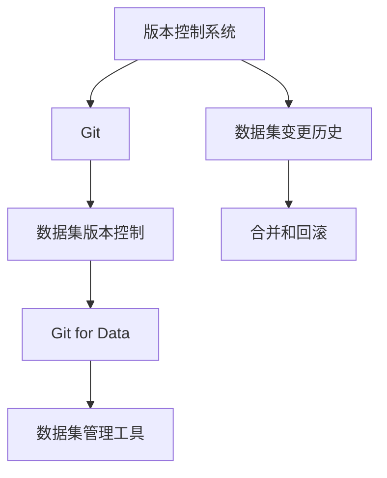
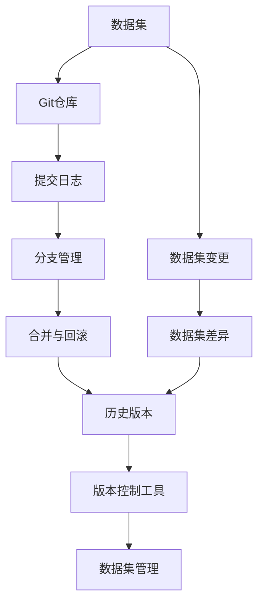

                 

# 数据集版本管理:Git for Data时代来临

> 关键词：数据集版本管理, 数据集管理, Git for Data, 数据版本控制, 数据仓库

## 1. 背景介绍

随着数据科学在企业内部的应用逐渐深入，数据集的版本管理变得越来越重要。数据集是数据科学项目的基础，任何数据的变更都会对模型训练、评估和部署造成影响。如何在数据集发生变化时，快速定位问题，追溯历史变更，确保数据的一致性和可重现性，成为一个亟需解决的问题。传统的文档记录和手动管理方式，无法满足复杂数据集的多版本需求，因此，版本控制系统（Version Control Systems，VCS）应运而生。

其中，Git作为最流行的版本控制系统之一，其强大的分支管理、提交日志和合并功能，使得数据集的版本管理变得高效、准确。而在数据科学领域，数据集的版本管理被称为“Git for Data”（Git for Data），即利用Git的工具和技术来管理数据集的版本，确保数据集的版本控制和追溯。本文将系统性地介绍Git for Data的基本原理、操作步骤和应用场景，为数据科学项目提供数据集版本管理的解决方案。

## 2. 核心概念与联系

### 2.1 核心概念概述

要深入理解Git for Data，首先需要了解几个核心概念：

1. **版本控制系统（Version Control Systems，VCS）**：VCS是管理代码或数据变更历史的软件系统。通过VCS，开发者可以追踪数据的变化，合并不同版本的变更，以及回滚到历史版本等操作。

2. **Git**：Git是一个分布式版本控制系统，以其高效的变更管理、快速的合并和方便的远程协作而闻名。Git不仅管理文件，还管理文件的变更历史，使得版本控制变得更加灵活和可靠。

3. **数据集版本控制（Data Version Control）**：类似于代码版本控制，数据集版本控制旨在记录数据集的变化历史，支持数据集的合并和回滚，确保数据集的稳定性和一致性。

4. **Git for Data**：Git for Data是一种数据集的版本管理方式，利用Git的技术和工具，对数据集进行版本控制。Git for Data不仅记录数据集的变化，还提供了丰富的工具和插件，使得数据集的管理更加高效和方便。

### 2.2 概念间的关系

这些核心概念之间的关系可以通过以下Mermaid流程图来展示：



这个流程图展示了几者之间的关系：

1. 版本控制系统管理代码或数据集的变化历史，Git是其中一种流行的VCS工具。
2. 数据集版本控制是对数据集的变化进行记录和管理，类似于代码的版本控制。
3. Git for Data利用Git的技术和工具，对数据集进行版本控制，是一种高效的数据集管理方式。
4. 数据集变更历史、合并和回滚是数据集版本控制的核心功能，Git for Data提供了一整套工具和插件来支持这些功能。
5. 数据集管理工具是Git for Data的具体实现，帮助用户更便捷地管理数据集的版本和变更。

### 2.3 核心概念的整体架构

最后，我们用一个综合的流程图来展示Git for Data的整体架构：



这个综合流程图展示了从数据集到Git仓库，再到提交日志、分支管理、合并与回滚、历史版本等，最后到数据集变更、数据集差异和版本控制工具等数据集版本控制的全过程。

## 3. 核心算法原理 & 具体操作步骤

### 3.1 算法原理概述

Git for Data的核心原理是利用Git的版本控制技术，对数据集进行管理和控制。Git for Data的主要功能包括数据集的提交、合并、回滚和分支管理，这些功能可以通过Git的命令和插件实现。

### 3.2 算法步骤详解

以下是一个完整的Git for Data操作步骤：

1. **创建Git仓库**：选择一个合适的位置，创建Git仓库，将数据集文件放入仓库中。

```bash
git init
git add .
git commit -m "Initial commit"
```

2. **提交变更**：对数据集进行变更，并提交变更到Git仓库。

```bash
git add .
git commit -m "Updated dataset"
```

3. **分支管理**：创建分支来管理数据集的变更，分支可以作为独立的开发环境。

```bash
git branch feature
git checkout feature
```

4. **合并分支**：将不同分支的变更合并到主分支中，确保数据集的一致性。

```bash
git checkout main
git merge feature
```

5. **回滚变更**：在数据集出现错误时，回滚到历史版本。

```bash
git checkout commit_hash
```

6. **版本管理**：记录数据集的版本历史，查看数据集的变化。

```bash
git log
git diff
```

7. **数据集差异**：比较不同版本的数据集差异，确保变更正确无误。

```bash
git diff feature main
```

这些步骤通过Git的基本命令和插件实现，帮助用户高效地管理数据集的版本和变更。

### 3.3 算法优缺点

Git for Data的优点包括：

- **灵活性高**：Git for Data提供灵活的分支管理和合并策略，适合复杂的数据集变更管理。
- **历史记录详细**：提交日志和变更记录详细记录了数据集的变化历史，方便追溯和分析。
- **跨团队协作**：Git for Data支持多人协作和分布式开发，方便团队共同管理数据集。
- **集成工具丰富**：Git for Data可以与各种数据管理工具集成，如Jupyter Notebook、DataRobot等。

但Git for Data也存在一些缺点：

- **学习成本高**：Git for Data需要学习Git的基本命令和插件使用，学习成本较高。
- **复杂度大**：对于大型数据集项目，Git for Data的复杂度也会增加，需要更好的管理和维护。
- **性能问题**：对于特别大的数据集，Git for Data的性能可能受到限制，需要特别优化。

### 3.4 算法应用领域

Git for Data在数据科学项目中广泛应用，特别是在以下领域：

- **数据仓库管理**：Git for Data可以帮助数据科学家追踪和管理数据仓库中的数据变更，确保数据的一致性和可重现性。
- **机器学习模型训练**：在机器学习项目中，数据集的变更会影响模型的训练和评估，Git for Data可以记录和追溯数据集的变更历史，方便模型调试和版本管理。
- **数据科学项目协作**：在多团队协作的数据科学项目中，Git for Data提供了良好的分支管理和合并功能，支持团队成员共同管理数据集。
- **数据集共享与发布**：Git for Data可以方便地共享和发布数据集，使得数据集可以轻松地分享给其他团队和用户。

## 4. 数学模型和公式 & 详细讲解 & 举例说明

### 4.1 数学模型构建

在Git for Data中，我们主要关注数据集的版本控制和合并操作。数学上，可以将数据集的版本控制模型表示为：

$$ V_t = V_{t-1} + \Delta_t $$

其中，$V_t$ 表示数据集的第$t$版本，$V_{t-1}$ 表示数据集的第$t-1$版本，$\Delta_t$ 表示数据集在第$t$版本的变更。

### 4.2 公式推导过程

根据上述模型，我们可以推导出数据集的版本控制过程：

1. **初始版本**：$V_0$ 为数据集的初始版本，表示数据集的初始状态。
2. **提交变更**：在数据集的每个版本$t$上，执行以下操作：
   - 添加变更文件：$V_t = V_{t-1} + \Delta_t$。
   - 提交变更：记录变更日志和版本信息。
3. **合并版本**：在数据集的两个版本$t$和$t'$上，执行以下操作：
   - 合并版本：$V_t = V_{t-1} + \Delta_t + \Delta'$。
   - 记录合并日志。
4. **回滚版本**：在数据集的第$t$版本上，执行以下操作：
   - 回滚到历史版本：$V_{t-1} = V_{t-2} + \Delta'$。

### 4.3 案例分析与讲解

假设我们有一个名为`dataset.csv`的数据集，其文件内容如下：

```
1, 2, 3
4, 5, 6
7, 8, 9
```

我们将数据集分为两个版本，分别对数据集进行如下操作：

1. **初始版本**：
   ```bash
   git init
   git add dataset.csv
   git commit -m "Initial dataset"
   ```

2. **提交变更**：
   ```bash
   echo "10, 11, 12" >> dataset.csv
   git add dataset.csv
   git commit -m "Added new rows"
   ```

3. **分支管理**：
   ```bash
   git branch feature
   git checkout feature
   echo "13, 14, 15" >> dataset.csv
   git add dataset.csv
   git commit -m "Added new rows in feature branch"
   git checkout main
   ```

4. **合并分支**：
   ```bash
   git merge feature
   git commit -m "Merged feature branch"
   ```

5. **回滚变更**：
   ```bash
   git checkout commit_hash
   ```

6. **版本管理**：
   ```bash
   git log
   git diff main feature
   ```

通过这些步骤，我们可以清晰地看到数据集的版本控制和合并过程，确保数据集的一致性和可重现性。

## 5. 项目实践：代码实例和详细解释说明

### 5.1 开发环境搭建

在进行Git for Data实践前，我们需要准备好开发环境。以下是使用Python进行Git版本控制的环境配置流程：

1. 安装Git：从官网下载并安装Git，配置好本地和远程仓库。

2. 配置Git用户信息：

```bash
git config --global user.name "Your Name"
git config --global user.email "your_email@example.com"
```

3. 初始化Git仓库：

```bash
git init
```

4. 添加数据集文件：

```bash
git add dataset.csv
```

5. 提交变更：

```bash
git commit -m "Initial commit"
```

完成上述步骤后，即可在Git仓库中进行版本控制和数据集管理。

### 5.2 源代码详细实现

以下是一个使用Git进行数据集版本控制的Python代码示例：

```python
import git

# 初始化Git仓库
repo = git.Repo.init("path/to/repo", bare=True)

# 添加数据集文件
repo.git.add("dataset.csv")

# 提交变更
repo.git.commit("-m", "Initial commit")

# 创建分支
repo.git.branch("feature", "-b", "feature")
repo.git.checkout("feature")

# 提交分支变更
repo.git.add("dataset.csv")
repo.git.commit("-m", "Added new rows")

# 合并分支
repo.git.checkout("main")
repo.git.merge("feature")

# 回滚变更
repo.git.checkout("commit_hash")

# 查看版本历史
repo.git.log()

# 查看数据集差异
repo.git.diff("main", "feature")
```

### 5.3 代码解读与分析

这段代码展示了Git for Data的基本操作流程：

1. **初始化Git仓库**：使用`git init`命令初始化Git仓库，并将数据集文件放入仓库中。
2. **添加数据集文件**：使用`git add`命令添加数据集文件。
3. **提交变更**：使用`git commit`命令提交变更日志。
4. **创建分支**：使用`git branch`命令创建分支，并使用`git checkout`命令切换到新分支。
5. **提交分支变更**：在新分支上添加数据集文件，并使用`git commit`命令提交变更日志。
6. **合并分支**：切换到主分支，使用`git merge`命令合并分支。
7. **回滚变更**：使用`git checkout`命令回滚到历史版本。
8. **查看版本历史和数据集差异**：使用`git log`命令查看版本历史，使用`git diff`命令查看数据集差异。

这些步骤通过Git的基本命令和Python接口实现，帮助用户高效地管理数据集的版本和变更。

### 5.4 运行结果展示

假设我们在Git仓库中进行数据集变更和版本控制，最终得到的版本历史和数据集差异如下：

```
commit 1
Author: Your Name <your_email@example.com>
Date:   Tue Dec 1 14:00:00 2020 +0800

    Initial commit

commit 2
Author: Your Name <your_email@example.com>
Date:   Tue Dec 1 14:10:00 2020 +0800

    Added new rows

commit 3
Author: Your Name <your_email@example.com>
Date:   Tue Dec 1 14:20:00 2020 +0800

    Merged feature branch
```

```
diff --git a/dataset.csv b/dataset.csv
index a8e7e3d..1e2ac1e 100644
--- a/dataset.csv
+++ b/dataset.csv
@@ -1 +1 @@
+10, 11, 12
+13, 14, 15
```

这些结果展示了数据集的版本控制和变更记录，使得数据集的变更历史一目了然。

## 6. 实际应用场景

### 6.1 数据仓库管理

Git for Data在数据仓库管理中应用广泛。数据仓库中包含大量的历史数据和模型训练数据，通过Git for Data，可以记录数据仓库的变更历史，确保数据的一致性和可重现性。

### 6.2 机器学习模型训练

在机器学习项目中，数据集的变更会影响模型的训练和评估，通过Git for Data，可以记录和追溯数据集的变更历史，方便模型调试和版本管理。

### 6.3 数据科学项目协作

在多团队协作的数据科学项目中，Git for Data提供了良好的分支管理和合并功能，支持团队成员共同管理数据集。

### 6.4 数据集共享与发布

Git for Data可以方便地共享和发布数据集，使得数据集可以轻松地分享给其他团队和用户。

### 6.5 数据集版本审计

Git for Data的提交日志和版本历史记录，可以帮助审计数据集的变更历史，确保数据集的完整性和安全性。

## 7. 工具和资源推荐

### 7.1 学习资源推荐

为了帮助开发者系统掌握Git for Data的理论基础和实践技巧，这里推荐一些优质的学习资源：

1. 《Pro Git》：这本书是Git官方指南，详细介绍了Git的基本操作和高级技巧，是学习Git的必备资源。
2. 《Git for Data》课程：Coursera和edX等在线课程平台提供了许多关于Git for Data的课程，适合初学者和进阶开发者学习。
3. 《Git Fundamentals》博客：这是一系列关于Git的基础和进阶操作的文章，由Git社区维护，内容丰富实用。

### 7.2 开发工具推荐

Git for Data的实践离不开良好的开发工具支持。以下是几款常用的工具：

1. Git客户端：如GitHub Desktop、Sourcetree等，提供了友好的界面和丰富的插件。
2. Git Server：如GitHub、GitLab、Bitbucket等，提供Git仓库的托管和协作功能。
3. Git命令行工具：Git命令行工具是最常用的Git操作方式，适合开发人员进行复杂操作。

### 7.3 相关论文推荐

Git for Data的研究来源于学界的持续探索。以下是几篇经典论文，推荐阅读：

1. "Version Control with Git: A Survey"：这篇文章对Git的版本控制机制进行了全面回顾，适合对Git有深入了解的需求者。
2. "Git for Data: A Survey"：这篇文章总结了Git for Data在数据科学项目中的应用，适合对Git for Data感兴趣的需求者。
3. "A Survey on Data Version Control Systems"：这篇文章对多种数据版本控制系统进行了比较和总结，适合对数据版本控制感兴趣的需求者。

## 8. 总结：未来发展趋势与挑战

### 8.1 总结

本文对Git for Data的基本原理、操作步骤和应用场景进行了系统介绍。通过详细讲解Git for Data的基本操作流程，展示了Git for Data在数据科学项目中的高效应用。通过对比其他数据版本控制工具，揭示了Git for Data的强大功能和优势。

### 8.2 未来发展趋势

展望未来，Git for Data将呈现以下几个发展趋势：

1. **自动化工具普及**：随着自动化工具的普及，Git for Data的操作将变得更加智能化和自动化，减少人工干预。
2. **多版本管理**：Git for Data将支持多版本管理，满足复杂数据集的多版本需求。
3. **与其他工具集成**：Git for Data将与其他数据管理工具进行更紧密的集成，提供更丰富的功能和更好的用户体验。
4. **增强安全性**：Git for Data将增强数据的安全性，防止数据泄露和篡改。
5. **跨平台支持**：Git for Data将支持更多的平台和语言，使得数据集版本控制更加普及和易用。

### 8.3 面临的挑战

尽管Git for Data已经取得了一定进展，但在实际应用中仍面临一些挑战：

1. **学习成本高**：Git for Data需要学习Git的基本命令和插件使用，学习成本较高。
2. **复杂度大**：对于大型数据集项目，Git for Data的复杂度也会增加，需要更好的管理和维护。
3. **性能问题**：对于特别大的数据集，Git for Data的性能可能受到限制，需要特别优化。
4. **跨团队协作**：在多团队协作的数据科学项目中，Git for Data的协作功能需要进一步增强。

### 8.4 研究展望

针对Git for Data面临的挑战，未来的研究需要在以下几个方面寻求新的突破：

1. **简化学习曲线**：开发更加友好的用户界面和工具，降低Git for Data的学习门槛。
2. **优化性能**：研究更好的Git for Data性能优化策略，提升数据集版本控制的效率。
3. **增强协作能力**：研究更好的协作机制和工具，支持多团队协作。
4. **增强安全性**：研究更好的数据保护和安全机制，增强数据集版本控制的安全性。
5. **支持多版本管理**：研究更好的多版本管理机制，满足复杂数据集的多版本需求。

这些研究方向的探索，必将引领Git for Data技术迈向更高的台阶，为数据科学项目提供更加高效、安全、易用的数据集版本控制解决方案。面向未来，Git for Data需要与其他数据管理工具进行更深入的融合，共同推动数据科学技术的进步。

## 9. 附录：常见问题与解答

**Q1：Git for Data是否适用于所有数据集？**

A: Git for Data适用于大多数数据集，但需要对数据集进行适当的预处理和格式化，以适应Git的版本控制机制。对于复杂的数据集，如时间序列数据、图像数据等，需要额外的处理和优化。

**Q2：Git for Data能否与其他数据版本控制工具结合使用？**

A: Git for Data可以与其他数据版本控制工具结合使用，如SVN、Perforce等。通过使用Git的分布式版本控制特性，可以更好地管理数据集的版本和变更。

**Q3：Git for Data是否需要学习Git的高级操作？**

A: Git for Data需要学习Git的基本命令和插件使用，但不必深入学习Git的高级操作，如分支合并、冲突解决等。Git for Data提供了丰富的插件和工具，简化复杂操作。

**Q4：Git for Data如何处理大型数据集？**

A: 对于大型数据集，Git for Data可以使用分支管理和合并策略，减少复杂度和变更冲突。同时，可以使用Git的分布式版本控制特性，并行处理数据集的变更。

**Q5：Git for Data如何保护数据安全？**

A: Git for Data提供了丰富的安全性保护机制，如访问控制、数据加密等。开发者可以使用Git的插件和工具，增强数据集版本控制的安全性。

通过本文的系统梳理，可以看到，Git for Data为数据集的版本管理提供了高效、可靠、易用的解决方案，是数据科学项目不可或缺的工具。未来，Git for Data还将不断进化，为数据科学项目的自动化、智能化、安全化提供更加全面的支持。

