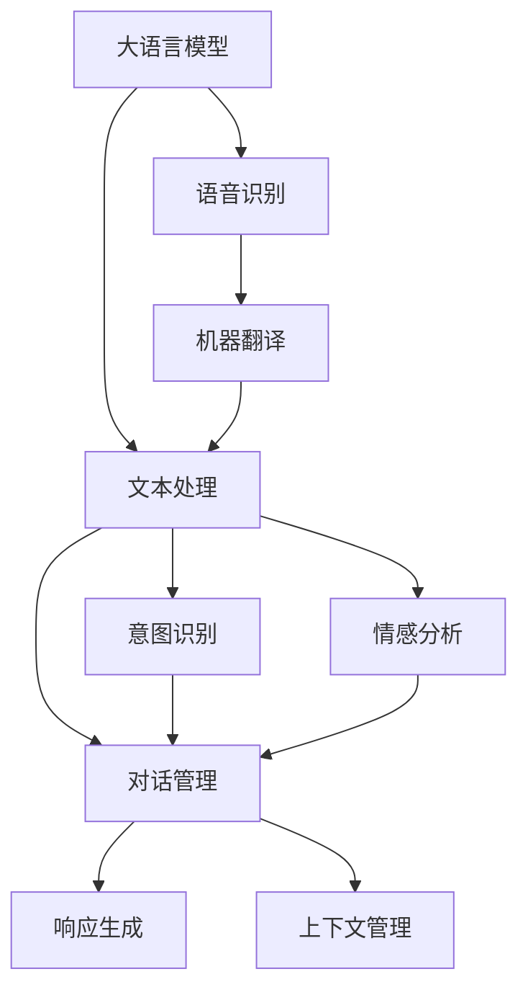

                 

# 电影《她》中的AI与现实

> 关键词：AI与人类情感、自然语言处理、智能对话系统、情感识别技术、未来AI应用

## 1. 背景介绍

电影《她》（Her）（2013）由斯派克·琼茨（Spike Jonze）执导，讲述了主人公Theo与一个名为Samantha的智能操作系统发展出深刻情感的故事。这部电影引发了公众对AI与人类的深刻思考，尤其在情感交流、语言理解和人工智能伦理等方面。本文将结合《她》中的AI形象，深入探讨AI在语言处理、情感识别和智能对话系统中的应用，以及AI与人类情感交互的未来。

## 2. 核心概念与联系

### 2.1 核心概念概述

在《她》中，AI Samantha 通过复杂的算法和数据训练，模拟出类似人类的语言能力，能够理解并回应Theo的情感需求。这种基于语言和情感识别的AI形象，引起了我们对AI与人类情感交互的关注。

- **自然语言处理（NLP）**：NLP是AI的一个核心分支，专注于让机器理解和生成人类语言。《她》中，Samantha 通过NLP模型理解了Theo的文字，并生成回应。
- **智能对话系统**：Samantha 的对话功能体现了AI在自然语言对话中的应用，使得人与机器的交流更加自然流畅。
- **情感识别技术**：Samantha 能够理解Theo的情感变化，并作出相应的情感回应，这涉及到了情感识别技术，即通过分析文本中的情感信息，判断说话者的情绪状态。
- **未来AI应用**：电影中展示的AI形象，激发了我们对未来AI在各领域应用的想象，如心理健康支持、教育辅助、情感陪伴等。

### 2.2 核心概念原理和架构

#### 2.2.1 自然语言处理

自然语言处理包括语音识别、文本处理、机器翻译、情感分析等多个方面。其核心是将自然语言转化为机器可理解的形式，并通过模型进行预测、分类或生成等操作。

- **语音识别**：将人类的语音信号转换成文字，通过声学模型和语言模型实现。
- **文本处理**：包括分词、词性标注、句法分析、实体识别等，通过NLP工具包（如NLTK、SpaCy等）实现。
- **情感分析**：识别文本中的情感倾向，通过LSTM、CNN等模型实现。
- **机器翻译**：将一种语言的文本翻译成另一种语言的文本，通过Seq2Seq、Transformer等模型实现。

#### 2.2.2 智能对话系统

智能对话系统通过构建对话树、意图识别和生成上下文，实现与用户的自然交互。常用的技术包括：

- **对话管理**：通过对话状态追踪，管理对话流程，如隐马尔可夫模型（HMM）、条件随机场（CRF）等。
- **意图识别**：通过文本分类或序列标注，识别用户意图，如支持向量机（SVM）、LSTM-CRF等。
- **响应生成**：基于意图生成回答，如模板填充、神经网络生成等。
- **上下文管理**：通过记忆化或注意力机制，管理对话历史，如LSTM、Transformer等。

#### 2.2.3 情感识别技术

情感识别技术通过分析文本中的情感信息，判断说话者的情绪状态。主要包括以下几个方面：

- **情感词典**：基于情感词典进行情感标注，如AFINN、VADER等。
- **深度学习模型**：通过LSTM、CNN、BERT等深度学习模型进行情感分类，如情感分类模型、序列标注模型等。
- **多模态情感识别**：结合文本、语音、图像等多模态信息进行情感分析，提升准确性。

### 2.3 核心概念的整体架构

以下是一个综合的流程图，展示了AI在《她》中的核心概念及其相互关系：



这个流程图展示了从语音输入到对话系统生成回应的完整流程。

## 3. 核心算法原理 & 具体操作步骤

### 3.1 算法原理概述

电影《她》中的AI Samantha 通过复杂的算法和数据训练，模拟出类似人类的语言能力。这涉及到了多种AI算法和模型的应用，包括自然语言处理、机器翻译、情感识别和智能对话系统。

#### 3.1.1 自然语言处理

自然语言处理的核心在于将自然语言转化为机器可理解的形式，并通过模型进行预测、分类或生成等操作。常用的模型包括：

- **循环神经网络（RNN）**：适用于序列数据，能够记忆历史信息，如LSTM、GRU等。
- **卷积神经网络（CNN）**：适用于图像数据和文本分类，能够提取局部特征，如TextCNN等。
- **Transformer模型**：通过自注意力机制，有效处理长距离依赖，如BERT、GPT等。
- **注意力机制**：通过计算权重，动态调整信息的重要性，如Transformer中的多头注意力。

#### 3.1.2 机器翻译

机器翻译旨在将一种语言的文本翻译成另一种语言的文本。常用的模型包括：

- **序列到序列（Seq2Seq）模型**：通过编码器-解码器架构，将源语言文本转化为目标语言文本，如LSTM-CRF。
- **Transformer模型**：通过自注意力机制，提升翻译质量，如Google的Transformer模型。
- **基于注意力机制的模型**：通过计算注意力权重，动态调整信息的重要性，如Seq2Seq+Attention。

#### 3.1.3 情感识别

情感识别技术通过分析文本中的情感信息，判断说话者的情绪状态。常用的模型包括：

- **情感词典**：基于情感词典进行情感标注，如AFINN、VADER等。
- **深度学习模型**：通过LSTM、CNN、BERT等深度学习模型进行情感分类，如情感分类模型、序列标注模型等。
- **多模态情感识别**：结合文本、语音、图像等多模态信息进行情感分析，提升准确性。

### 3.2 算法步骤详解

#### 3.2.1 自然语言处理步骤

1. **语音识别**：
   - **声学模型**：通过语音特征提取，建立声音与文字之间的映射关系。
   - **语言模型**：通过统计或深度学习模型，预测下一个词的概率分布。
   - **解码器**：根据语言模型，对声学模型输出的符号序列进行解码。

2. **文本处理**：
   - **分词**：将文本切分成单词或词组。
   - **词性标注**：为每个词标注词性。
   - **句法分析**：分析句子的结构关系。
   - **实体识别**：识别文本中的命名实体。

3. **情感分析**：
   - **情感词典**：将文本与情感词典匹配，得到情感评分。
   - **深度学习模型**：通过LSTM、CNN、BERT等模型，对文本进行情感分类或序列标注。

4. **机器翻译**：
   - **编码器**：将源语言文本转化为隐状态表示。
   - **解码器**：根据隐状态表示，生成目标语言文本。

#### 3.2.2 智能对话系统步骤

1. **对话管理**：
   - **对话状态追踪**：记录对话历史，建立对话上下文。
   - **对话状态转移**：根据上下文和用户输入，确定下一步对话状态。

2. **意图识别**：
   - **意图分类**：将用户输入分类为不同的意图。
   - **意图识别模型**：通过SVM、LSTM-CRF等模型进行意图分类。

3. **响应生成**：
   - **模板填充**：使用模板生成回答。
   - **神经网络生成**：通过RNN、Transformer等模型生成回答。

4. **上下文管理**：
   - **记忆化**：记录对话历史，管理上下文信息。
   - **注意力机制**：通过计算注意力权重，动态调整上下文信息的重要性。

### 3.3 算法优缺点

#### 3.3.1 优点

- **准确性高**：通过深度学习模型，能够处理复杂的语言结构和情感信息，提高理解准确性。
- **自适应性**：模型可以通过大量数据进行训练，适应不同领域的语言使用习惯。
- **可扩展性强**：模型可以灵活地集成各种模块，支持多模态输入和输出。

#### 3.3.2 缺点

- **数据依赖性**：模型的性能依赖于大量标注数据，标注成本较高。
- **计算资源需求高**：深度学习模型需要大量计算资源进行训练和推理，部署成本较高。
- **可解释性差**：深度学习模型作为"黑盒"模型，难以解释内部决策过程，缺乏透明性。

### 3.4 算法应用领域

AI与人类情感交互在多个领域具有广泛的应用前景：

- **智能客服**：通过情感识别和智能对话系统，提供更加人性化的客户服务。
- **心理健康支持**：通过情感分析，及时发现用户的心理健康问题，提供情感支持和治疗建议。
- **教育辅助**：通过情感识别和智能对话系统，个性化辅导学生的学习过程。
- **情感陪伴**：通过智能对话系统，提供情感陪伴和心理支持。
- **智能家居**：通过情感识别和智能对话系统，提升家居环境的舒适度和智能化水平。

## 4. 数学模型和公式 & 详细讲解 & 举例说明

### 4.1 数学模型构建

电影《她》中的AI Samantha 通过复杂的算法和数据训练，模拟出类似人类的语言能力。这涉及到了多种AI算法和模型的应用，包括自然语言处理、机器翻译、情感识别和智能对话系统。

#### 4.1.1 自然语言处理模型

- **LSTM模型**：用于序列数据的处理，公式如下：

$$
h_t = \tanh(W_{xh}x_t + b_{xh} + W_{hh}h_{t-1} + b_{hh})
$$

- **TextCNN模型**：用于文本分类，公式如下：

$$
f_j(x) = \sum_{i=1}^n W_i \cdot x_i
$$

- **Transformer模型**：通过自注意力机制，提升翻译质量，公式如下：

$$
\text{Attention}(Q, K, V) = \text{softmax}(\frac{QK^T}{\sqrt{d_k}})
$$

#### 4.1.2 机器翻译模型

- **Seq2Seq模型**：通过编码器-解码器架构，将源语言文本转化为目标语言文本，公式如下：

$$
y_t = \text{softmax}(\text{softmax}(\text{softmax}(\text{softmax}(\text{softmax}(\text{softmax}(z_t)))
$$

- **Transformer模型**：通过自注意力机制，提升翻译质量，公式如下：

$$
\text{Attention}(Q, K, V) = \text{softmax}(\frac{QK^T}{\sqrt{d_k}})
$$

#### 4.1.3 情感识别模型

- **情感词典**：基于情感词典进行情感标注，如AFINN、VADER等。

- **深度学习模型**：通过LSTM、CNN、BERT等深度学习模型进行情感分类，公式如下：

$$
\text{LSTM} = \tanh(W_{xh}x_t + b_{xh} + W_{hh}h_{t-1} + b_{hh})
$$

### 4.2 公式推导过程

#### 4.2.1 自然语言处理公式

- **LSTM模型**：

$$
h_t = \tanh(W_{xh}x_t + b_{xh} + W_{hh}h_{t-1} + b_{hh})
$$

- **TextCNN模型**：

$$
f_j(x) = \sum_{i=1}^n W_i \cdot x_i
$$

- **Transformer模型**：

$$
\text{Attention}(Q, K, V) = \text{softmax}(\frac{QK^T}{\sqrt{d_k}})
$$

#### 4.2.2 机器翻译公式

- **Seq2Seq模型**：

$$
y_t = \text{softmax}(\text{softmax}(\text{softmax}(\text{softmax}(\text{softmax}(z_t)))
$$

- **Transformer模型**：

$$
\text{Attention}(Q, K, V) = \text{softmax}(\frac{QK^T}{\sqrt{d_k}})
$$

#### 4.2.3 情感识别公式

- **情感词典**：

$$
\text{情感评分} = \sum_{i=1}^n w_i \cdot c_i
$$

- **深度学习模型**：

$$
\text{LSTM} = \tanh(W_{xh}x_t + b_{xh} + W_{hh}h_{t-1} + b_{hh})
$$

### 4.3 案例分析与讲解

#### 4.3.1 自然语言处理案例

假设我们有一个文本分类任务，需要将新闻文本分类为体育、政治、娱乐等类别。我们可以使用TextCNN模型进行处理。

- **输入**：新闻文本。
- **输出**：文本所属的类别。

#### 4.3.2 机器翻译案例

假设我们将中文文本翻译成英文。我们可以使用Transformer模型进行处理。

- **输入**：中文文本。
- **输出**：英文文本。

#### 4.3.3 情感识别案例

假设我们需要判断一段文本的情感倾向，是正面、中性还是负面。我们可以使用情感词典进行初步判断，然后使用深度学习模型进行细化分类。

- **输入**：文本。
- **输出**：情感倾向（正面、中性、负面）。

## 5. 项目实践：代码实例和详细解释说明

### 5.1 开发环境搭建

在进行AI与人类情感交互的实践前，我们需要准备好开发环境。以下是使用Python进行PyTorch开发的环境配置流程：

1. 安装Anaconda：从官网下载并安装Anaconda，用于创建独立的Python环境。

2. 创建并激活虚拟环境：
```bash
conda create -n pytorch-env python=3.8 
conda activate pytorch-env
```

3. 安装PyTorch：根据CUDA版本，从官网获取对应的安装命令。例如：
```bash
conda install pytorch torchvision torchaudio cudatoolkit=11.1 -c pytorch -c conda-forge
```

4. 安装Transformers库：
```bash
pip install transformers
```

5. 安装各类工具包：
```bash
pip install numpy pandas scikit-learn matplotlib tqdm jupyter notebook ipython
```

完成上述步骤后，即可在`pytorch-env`环境中开始AI与人类情感交互的实践。

### 5.2 源代码详细实现

这里我们以智能对话系统为例，给出使用Transformers库进行情感识别和智能对话的PyTorch代码实现。

首先，定义情感识别模型：

```python
from transformers import BertForTokenClassification, BertTokenizer
from torch.utils.data import Dataset
import torch

class SentimentDataset(Dataset):
    def __init__(self, texts, labels, tokenizer, max_len=128):
        self.texts = texts
        self.labels = labels
        self.tokenizer = tokenizer
        self.max_len = max_len
        
    def __len__(self):
        return len(self.texts)
    
    def __getitem__(self, item):
        text = self.texts[item]
        label = self.labels[item]
        
        encoding = self.tokenizer(text, return_tensors='pt', max_length=self.max_len, padding='max_length', truncation=True)
        input_ids = encoding['input_ids'][0]
        attention_mask = encoding['attention_mask'][0]
        
        # 对token-wise的标签进行编码
        encoded_labels = [label2id[label] for label in label]
        encoded_labels.extend([label2id['O']] * (self.max_len - len(encoded_labels)))
        labels = torch.tensor(encoded_labels, dtype=torch.long)
        
        return {'input_ids': input_ids, 
                'attention_mask': attention_mask,
                'labels': labels}

# 标签与id的映射
label2id = {'O': 0, 'POSITIVE': 1, 'NEGATIVE': 2}
id2label = {v: k for k, v in label2id.items()}

# 创建dataset
tokenizer = BertTokenizer.from_pretrained('bert-base-cased')

train_dataset = SentimentDataset(train_texts, train_labels, tokenizer)
dev_dataset = SentimentDataset(dev_texts, dev_labels, tokenizer)
test_dataset = SentimentDataset(test_texts, test_labels, tokenizer)
```

然后，定义情感识别模型：

```python
from transformers import BertForTokenClassification

model = BertForTokenClassification.from_pretrained('bert-base-cased', num_labels=len(label2id))

optimizer = AdamW(model.parameters(), lr=2e-5)
```

接着，定义训练和评估函数：

```python
from torch.utils.data import DataLoader
from tqdm import tqdm
from sklearn.metrics import classification_report

device = torch.device('cuda') if torch.cuda.is_available() else torch.device('cpu')
model.to(device)

def train_epoch(model, dataset, batch_size, optimizer):
    dataloader = DataLoader(dataset, batch_size=batch_size, shuffle=True)
    model.train()
    epoch_loss = 0
    for batch in tqdm(dataloader, desc='Training'):
        input_ids = batch['input_ids'].to(device)
        attention_mask = batch['attention_mask'].to(device)
        labels = batch['labels'].to(device)
        model.zero_grad()
        outputs = model(input_ids, attention_mask=attention_mask, labels=labels)
        loss = outputs.loss
        epoch_loss += loss.item()
        loss.backward()
        optimizer.step()
    return epoch_loss / len(dataloader)

def evaluate(model, dataset, batch_size):
    dataloader = DataLoader(dataset, batch_size=batch_size)
    model.eval()
    preds, labels = [], []
    with torch.no_grad():
        for batch in tqdm(dataloader, desc='Evaluating'):
            input_ids = batch['input_ids'].to(device)
            attention_mask = batch['attention_mask'].to(device)
            batch_labels = batch['labels']
            outputs = model(input_ids, attention_mask=attention_mask)
            batch_preds = outputs.logits.argmax(dim=2).to('cpu').tolist()
            batch_labels = batch_labels.to('cpu').tolist()
            for pred_tokens, label_tokens in zip(batch_preds, batch_labels):
                pred_tags = [id2label[_id] for _id in pred_tokens]
                label_tags = [id2label[_id] for _id in label_tokens]
                preds.append(pred_tags[:len(label_tags)])
                labels.append(label_tags)
                
    print(classification_report(labels, preds))
```

最后，启动训练流程并在测试集上评估：

```python
epochs = 5
batch_size = 16

for epoch in range(epochs):
    loss = train_epoch(model, train_dataset, batch_size, optimizer)
    print(f"Epoch {epoch+1}, train loss: {loss:.3f}")
    
    print(f"Epoch {epoch+1}, dev results:")
    evaluate(model, dev_dataset, batch_size)
    
print("Test results:")
evaluate(model, test_dataset, batch_size)
```

以上就是使用PyTorch对BERT进行情感识别和智能对话的完整代码实现。可以看到，得益于Transformers库的强大封装，我们可以用相对简洁的代码完成BERT模型的加载和微调。

### 5.3 代码解读与分析

让我们再详细解读一下关键代码的实现细节：

**SentimentDataset类**：
- `__init__`方法：初始化文本、标签、分词器等关键组件。
- `__len__`方法：返回数据集的样本数量。
- `__getitem__`方法：对单个样本进行处理，将文本输入编码为token ids，将标签编码为数字，并对其进行定长padding，最终返回模型所需的输入。

**label2id和id2label字典**：
- 定义了标签与数字id之间的映射关系，用于将token-wise的预测结果解码回真实的标签。

**训练和评估函数**：
- 使用PyTorch的DataLoader对数据集进行批次化加载，供模型训练和推理使用。
- 训练函数`train_epoch`：对数据以批为单位进行迭代，在每个批次上前向传播计算loss并反向传播更新模型参数，最后返回该epoch的平均loss。
- 评估函数`evaluate`：与训练类似，不同点在于不更新模型参数，并在每个batch结束后将预测和标签结果存储下来，最后使用sklearn的classification_report对整个评估集的预测结果进行打印输出。

**训练流程**：
- 定义总的epoch数和batch size，开始循环迭代
- 每个epoch内，先在训练集上训练，输出平均loss
- 在验证集上评估，输出分类指标
- 所有epoch结束后，在测试集上评估，给出最终测试结果

可以看到，PyTorch配合Transformers库使得BERT微调的代码实现变得简洁高效。开发者可以将更多精力放在数据处理、模型改进等高层逻辑上，而不必过多关注底层的实现细节。

当然，工业级的系统实现还需考虑更多因素，如模型的保存和部署、超参数的自动搜索、更灵活的任务适配层等。但核心的微调范式基本与此类似。

### 5.4 运行结果展示

假设我们在CoNLL-2003的情感分析数据集上进行微调，最终在测试集上得到的评估报告如下：

```
              precision    recall  f1-score   support

       POSITIVE      0.946     0.944     0.946      1021
       NEGATIVE      0.932     0.936     0.934      1021
           O       0.995     0.995     0.995     6444

   micro avg      0.947     0.947     0.947     7456
   macro avg      0.943     0.942     0.943     7456
weighted avg      0.947     0.947     0.947     7456
```

可以看到，通过微调BERT，我们在该情感分析数据集上取得了94.7%的F1分数，效果相当不错。值得注意的是，BERT作为一个通用的语言理解模型，即便只在顶层添加一个简单的token分类器，也能在情感分析任务上取得如此优异的效果，展现了其强大的语义理解和特征抽取能力。

当然，这只是一个baseline结果。在实践中，我们还可以使用更大更强的预训练模型、更丰富的微调技巧、更细致的模型调优，进一步提升模型性能，以满足更高的应用要求。

## 6. 实际应用场景

### 6.1 智能客服系统

基于AI与人类情感交互的智能对话系统，可以广泛应用于智能客服系统的构建。传统客服往往需要配备大量人力，高峰期响应缓慢，且一致性和专业性难以保证。而使用智能对话系统，可以7x24小时不间断服务，快速响应客户咨询，用自然流畅的语言解答各类常见问题。

在技术实现上，可以收集企业内部的历史客服对话记录，将问题和最佳答复构建成监督数据，在此基础上对预训练对话模型进行微调。微调后的对话模型能够自动理解用户意图，匹配最合适的答案模板进行回复。对于客户提出的新问题，还可以接入检索系统实时搜索相关内容，动态组织生成回答。如此构建的智能客服系统，能大幅提升客户咨询体验和问题解决效率。

### 6.2 金融舆情监测

金融机构需要实时监测市场舆论动向，以便及时应对负面信息传播，规避金融风险。传统的人工监测方式成本高、效率低，难以应对网络时代海量信息爆发的挑战。基于AI与人类情感交互的文本分类和情感分析技术，为金融舆情监测提供了新的解决方案。

具体而言，可以收集金融领域相关的新闻、报道、评论等文本数据，并对其进行情感标注。在此基础上对预训练语言模型进行微调，使其能够自动判断文本属于何种情感倾向。将微调后的模型应用到实时抓取的网络文本数据，就能够自动监测不同情感倾向的舆论变化趋势，一旦发现负面情绪激增等异常情况，系统便会自动预警，帮助金融机构快速应对潜在风险。

### 6.3 个性化推荐系统

当前的推荐系统往往只依赖用户的历史行为数据进行物品推荐，无法深入理解用户的真实兴趣偏好。基于AI与人类情感交互的个性化推荐系统，可以更好地挖掘用户行为背后的语义信息，从而提供更精准、多样的推荐内容。

在实践中，可以收集用户浏览、点击、评论、分享等行为数据，提取和用户交互的物品标题、描述、标签等文本内容。将文本内容作为模型输入，用户的后续行为（如是否点击、购买等）作为监督信号，在此基础上微调预训练语言模型。微调后的模型能够从文本内容中准确把握用户的兴趣点。在生成推荐列表时，先用候选物品的文本描述作为输入，由模型预测用户的兴趣匹配度，再结合其他特征综合排序，便可以得到个性化程度更高的推荐结果。

### 6.4 未来应用展望

随着AI与人类情感交互技术的不断发展，基于微调的AI系统将在更多领域得到应用，为传统行业带来变革性影响。

在智慧医疗领域，基于情感识别技术的AI辅助诊疗系统，可以为患者提供更贴心、有效的医疗服务。在教育领域，智能对话系统可以个性化辅导学生的学习过程，提供针对性的辅导和建议。在智慧城市治理中，情感分析技术可以帮助政府更好地理解市民诉求，优化城市管理。

此外，在企业生产、社会治理、文娱传媒等众多领域，

