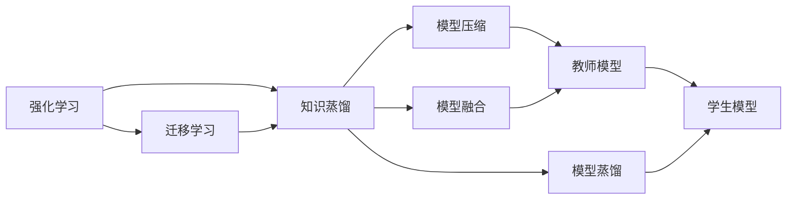
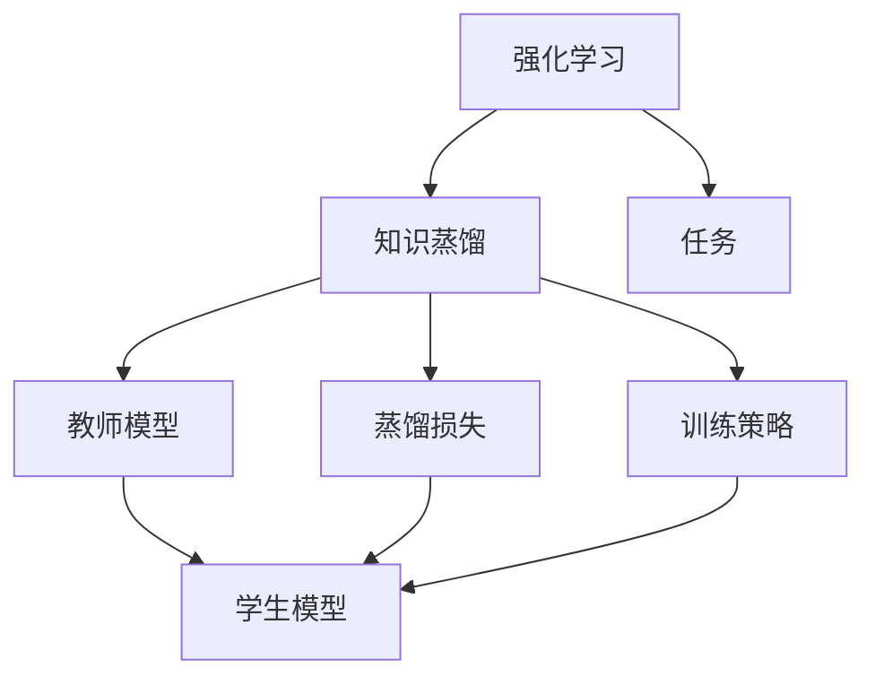
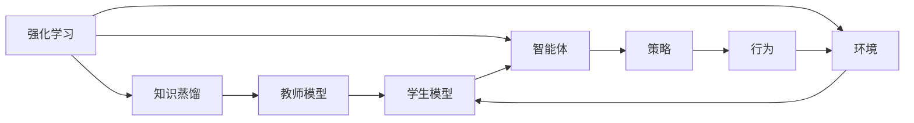
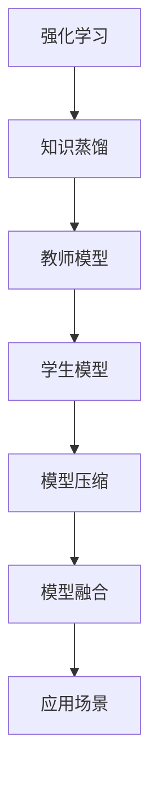
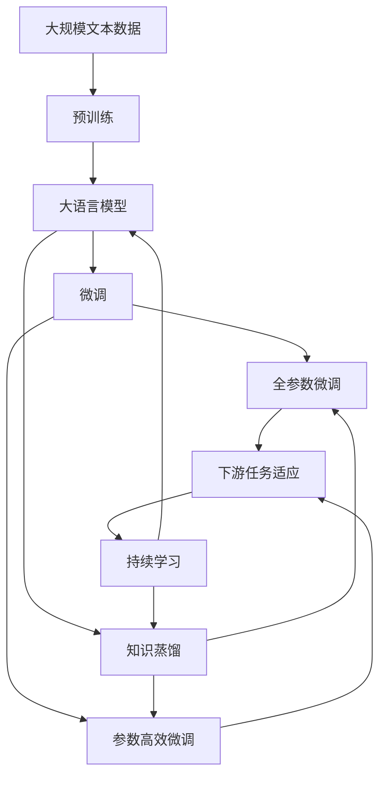

                 

# 知识蒸馏在强化学习中的探索与挑战

> 关键词：知识蒸馏,强化学习,神经网络,模型压缩,模型融合,迁移学习

## 1. 背景介绍

### 1.1 问题由来
随着深度学习在强化学习(Reinforcement Learning, RL)领域的应用，构建大模型、优化模型参数成为了提升学习效率和表现的重要手段。然而，大模型带来的高计算成本和存储需求，严重限制了其在实际场景中的应用。为了解决这一问题，知识蒸馏(Knowledge Distillation)技术应运而生，通过将教师模型(Teacher Model)的知识转移到学生模型(Student Model)中，实现模型压缩和性能提升。

知识蒸馏的核心思想是：通过在训练过程中引导学生模型模仿教师模型的输出和特征，使得学生模型能够获得与教师模型相似的性能，同时占用更少的计算和存储资源。这一方法广泛应用于计算机视觉、自然语言处理等领域，并在强化学习中展现出巨大的潜力。

### 1.2 问题核心关键点
知识蒸馏在强化学习中的关键点包括：

- 教师模型的选择：教师模型应具备优秀的性能和泛化能力，以确保学生模型能够学习到有效知识。
- 知识蒸馏的方式：如何设计有效的知识蒸馏策略，使学生模型能够高效地吸收教师模型的知识。
- 蒸馏损失的设计：选择合适的损失函数，衡量教师模型和学生模型之间的差距。
- 训练策略：如何平衡教师和学生模型的训练，确保学生模型能够在不被过拟合的情况下学习到教师模型的知识。
- 模型压缩和融合：如何对学生模型进行进一步的压缩和融合，以适应不同的应用场景。

这些问题相互交织，决定了知识蒸馏在强化学习中的效果和实用性。本文将从原理到实践，深入探讨这些问题，并给出具体的操作方法。

### 1.3 问题研究意义
知识蒸馏在强化学习中的研究具有重要意义：

1. 降低计算成本：通过模型压缩和知识蒸馏，可以有效降低计算和存储需求，使得强化学习模型在资源受限的环境中能够高效运行。
2. 提升性能：通过学习优秀教师模型的知识，学生模型能够快速获得较好的性能，缩短训练时间，提升任务完成效率。
3. 实现迁移学习：教师模型的泛化能力强，可以迁移到不同的任务和环境中，增强学生模型的适应能力。
4. 提升模型鲁棒性：通过蒸馏过程，学生模型可以从教师模型中学习到鲁棒特征，提高模型的泛化性和鲁棒性。
5. 拓展应用场景：知识蒸馏使得强化学习模型能够被应用到更多资源受限的场景中，如物联网、嵌入式设备等。

这些关键点共同构成了知识蒸馏在强化学习中的应用基础，为实际应用提供了有力支持。

## 2. 核心概念与联系

### 2.1 核心概念概述

为了更好地理解知识蒸馏在强化学习中的应用，本节将介绍几个密切相关的核心概念：

- **知识蒸馏(Knowledge Distillation)**：通过将教师模型的知识转移到学生模型中，使得学生模型能够获得与教师模型相似的性能，同时占用更少的计算和存储资源。知识蒸馏的核心在于设计有效的蒸馏策略，以确保学生模型能够高效地学习教师模型的知识。
- **强化学习(Reinforcement Learning)**：一种通过智能体与环境的交互，通过奖励和惩罚机制，优化策略以最大化长期奖励的机器学习方法。强化学习在自动驾驶、游戏AI、机器人控制等领域有广泛应用。
- **模型压缩(Model Compression)**：通过减少模型参数量、优化计算图等手段，降低模型的计算和存储需求，提高模型的实时性和可扩展性。
- **模型融合(Model Fusion)**：将多个模型的知识进行融合，形成更高效、更稳定的模型，以适应不同的任务和环境。
- **迁移学习(Transfer Learning)**：将一个领域学习到的知识，迁移到另一个不同但相关的领域，通过在较少标注数据上进行学习，提高模型在新任务上的性能。

这些核心概念之间的逻辑关系可以通过以下Mermaid流程图来展示：



这个流程图展示了大语言模型微调过程中各个核心概念的关系和作用：

1. 强化学习涉及智能体与环境的交互，通过奖励和惩罚机制优化策略，是知识蒸馏和模型压缩的基础。
2. 知识蒸馏通过将教师模型的知识转移到学生模型中，实现模型压缩和性能提升。
3. 模型压缩通过减少参数量和优化计算图，降低模型资源需求。
4. 模型融合将多个模型的知识进行融合，形成更高效、更稳定的模型。
5. 迁移学习将一个领域学习到的知识迁移到另一个领域，提高模型在新任务上的性能。

这些核心概念共同构成了知识蒸馏在强化学习中的生态系统，为其在实际应用中提供了理论基础和实践指导。

### 2.2 概念间的关系

这些核心概念之间存在着紧密的联系，形成了知识蒸馏在强化学习中的应用框架。下面我们通过几个Mermaid流程图来展示这些概念之间的关系。

#### 2.2.1 知识蒸馏的原理



这个流程图展示了知识蒸馏的基本原理，即通过教师模型和学生模型的交互，实现知识转移。教师模型和学生模型分别在任务$E$上训练，通过蒸馏损失$F$和训练策略$G$引导学生模型模仿教师模型的输出和特征。

#### 2.2.2 强化学习与知识蒸馏的关系



这个流程图展示了强化学习与知识蒸馏的关系，即教师模型和学生模型通过智能体与环境的交互，优化策略以实现知识蒸馏。教师模型和学生模型分别通过策略$G$和行为$H$与环境$F$进行交互，最终通过蒸馏损失$F$进行知识转移。

#### 2.2.3 模型压缩和融合的应用



这个流程图展示了知识蒸馏在模型压缩和融合中的应用，即通过教师模型的知识，将学生模型压缩到更小的规模，并在不同的应用场景$G$中进行融合，形成更高效、更稳定的模型。

### 2.3 核心概念的整体架构

最后，我们用一个综合的流程图来展示这些核心概念在大语言模型微调过程中的整体架构：



这个综合流程图展示了从预训练到微调，再到持续学习的完整过程。大语言模型首先在大规模文本数据上进行预训练，然后通过微调（包括全参数微调和参数高效微调）或知识蒸馏进行优化，使得模型能够适应特定任务，同时通过持续学习不断更新和适应新的任务和数据。

## 3. 核心算法原理 & 具体操作步骤
### 3.1 算法原理概述

知识蒸馏在强化学习中的基本原理是通过教师模型和学生模型的交互，将教师模型的知识迁移到学生模型中。具体来说，知识蒸馏通常包括以下几个步骤：

1. 设计教师模型：选择一个在目标任务上表现优秀的模型作为教师模型。
2. 设计蒸馏损失：定义蒸馏损失函数，衡量教师模型和学生模型之间的差异。
3. 蒸馏训练：通过优化蒸馏损失函数，使得学生模型能够逐步学习教师模型的知识和特征。
4. 模型压缩：对学生模型进行参数压缩、剪枝等操作，降低其计算和存储需求。
5. 模型融合：将多个学生模型的知识进行融合，形成更高效、更稳定的模型。

这些步骤共同构成了知识蒸馏在强化学习中的应用框架，使得学生模型能够在保留教师模型知识的同时，具有更好的可部署性和泛化能力。

### 3.2 算法步骤详解

#### 3.2.1 教师模型的选择

教师模型应具备以下几个特点：

- 在目标任务上表现优异：教师模型应已经在大量数据上进行了训练，且在目标任务上表现优异，以确保学生模型能够学习到有效的知识。
- 泛化能力强：教师模型应具有较强的泛化能力，能够在不同的数据集和任务上保持稳定的性能。
- 计算资源充足：教师模型的计算和存储需求应相对较低，以确保其在学生模型训练过程中能够稳定运行。

常用的教师模型包括：

- 预训练语言模型：如BERT、GPT等，在自然语言处理领域表现优异。
- 预训练视觉模型：如ResNet、VGG等，在计算机视觉领域表现优异。
- 预训练强化学习模型：如DQN、PPO等，在强化学习领域表现优异。

选择教师模型时，需要根据具体的任务需求和资源限制进行评估和选择。

#### 3.2.2 蒸馏损失的设计

蒸馏损失函数通常包括两个部分：知识损失和一致性损失。知识损失用于衡量教师模型和学生模型之间的差异，一致性损失用于确保教师模型和学生模型在相同输入下输出一致。

知识损失的定义如下：

$$
L_{knowledge} = \mathbb{E}_{(x,y)}\left[\ell(x, y, f_{teacher}(x), f_{student}(x))\right]
$$

其中，$\ell$为损失函数，$x$为输入，$y$为标签，$f_{teacher}(x)$和$f_{student}(x)$分别表示教师模型和学生模型的输出。

一致性损失的定义如下：

$$
L_{consistency} = \mathbb{E}_{(x,y)}\left[\ell(x, y, f_{teacher}(x), f_{student}(x))\right]
$$

其中，$\ell$为损失函数，$x$为输入，$y$为标签，$f_{teacher}(x)$和$f_{student}(x)$分别表示教师模型和学生模型的输出。

常用的损失函数包括交叉熵损失、均方误差损失等。

#### 3.2.3 蒸馏训练

蒸馏训练过程中，教师模型和学生模型同时进行训练，通过优化蒸馏损失函数，使得学生模型逐步学习教师模型的知识和特征。

具体的训练流程包括：

1. 初始化教师模型和学生模型。
2. 在每个训练批次中，同时输入数据给教师模型和学生模型，分别计算教师模型和学生模型的输出。
3. 计算蒸馏损失函数，包括知识损失和一致性损失。
4. 通过优化蒸馏损失函数，更新学生模型的参数。
5. 重复上述过程，直到学生模型收敛。

#### 3.2.4 模型压缩

在学生模型收敛后，为了进一步降低计算和存储需求，需要进行模型压缩。常见的模型压缩方法包括：

- 参数剪枝：去除不必要的参数，减小模型大小。
- 权重共享：将相同功能的参数共享，减少模型参数量。
- 量化：将浮点参数转换为定点参数，减小存储空间和计算开销。

#### 3.2.5 模型融合

在多个学生模型训练完毕后，可以将它们的知识进行融合，形成更高效、更稳定的模型。常见的模型融合方法包括：

- 串联融合：将多个学生模型的输出进行加权平均，形成新的输出。
- 并联融合：将多个学生模型的输出进行拼接，形成新的输出。
- 投票融合：将多个学生模型的输出进行投票，形成最终的输出。

### 3.3 算法优缺点

知识蒸馏在强化学习中的应用具有以下优点：

1. 提高模型性能：通过学习教师模型的知识，学生模型能够快速获得较好的性能，缩短训练时间，提升任务完成效率。
2. 降低计算成本：通过模型压缩和知识蒸馏，可以有效降低计算和存储需求，使得强化学习模型在资源受限的环境中能够高效运行。
3. 增强泛化能力：教师模型的泛化能力强，可以迁移到不同的任务和环境中，增强学生模型的适应能力。
4. 提升模型鲁棒性：通过蒸馏过程，学生模型可以从教师模型中学习到鲁棒特征，提高模型的泛化性和鲁棒性。

同时，该方法也存在一些局限性：

1. 教师模型选择困难：教师模型的选择需要大量实验和评估，且对任务的要求较高。
2. 知识蒸馏效果不稳定：知识蒸馏过程对超参数的选择和调整较为敏感，可能导致效果不稳定。
3. 计算资源需求高：蒸馏训练过程需要同时训练教师模型和学生模型，计算资源需求较高。
4. 模型压缩效果有限：部分模型压缩方法可能对模型的性能和效果有负面影响。
5. 模型融合复杂：多个模型的融合过程较为复杂，需要考虑模型的兼容性、输出的一致性等因素。

尽管存在这些局限性，但知识蒸馏在强化学习中的应用前景仍然广阔，未来仍需在教师模型选择、蒸馏效果优化等方面进行深入研究。

### 3.4 算法应用领域

知识蒸馏在强化学习中的应用广泛，包括但不限于以下几个领域：

1. 计算机视觉：通过知识蒸馏，可以将预训练的图像分类模型压缩到更小的规模，降低计算和存储需求，提高模型的实时性和可扩展性。
2. 自然语言处理：通过知识蒸馏，可以将预训练的语言模型压缩到更小的规模，提高模型的推理速度和响应时间，提升用户体验。
3. 机器人控制：通过知识蒸馏，可以将复杂的控制器模型压缩到更小的规模，降低计算需求，提高系统的实时性和稳定性。
4. 自动驾驶：通过知识蒸馏，可以将预训练的视觉模型压缩到更小的规模，降低计算和存储需求，提高系统的实时性和可靠性。
5. 游戏AI：通过知识蒸馏，可以将预训练的游戏模型压缩到更小的规模，降低计算需求，提高游戏的实时性和流畅性。

这些领域的应用展示了知识蒸馏在强化学习中的巨大潜力，为实际应用提供了有力支持。

## 4. 数学模型和公式 & 详细讲解 & 举例说明

### 4.1 数学模型构建

知识蒸馏在强化学习中的应用涉及多个数学模型的构建和优化，本节将详细介绍其中的关键模型。

#### 4.1.1 教师-学生模型

知识蒸馏通常涉及两个模型：教师模型和学生模型。教师模型在目标任务上已经获得了较好的性能，而学生模型需要在教师模型的指导下逐步提高性能。

教师模型和学生模型的形式如下：

$$
f_{teacher}(x) = \langle \theta_{teacher}, x \rangle
$$

$$
f_{student}(x) = \langle \theta_{student}, x \rangle
$$

其中，$x$为输入，$\theta_{teacher}$和$\theta_{student}$分别为教师模型和学生模型的参数。

#### 4.1.2 蒸馏损失函数

蒸馏损失函数通常包括两个部分：知识损失和一致性损失。知识损失用于衡量教师模型和学生模型之间的差异，一致性损失用于确保教师模型和学生模型在相同输入下输出一致。

知识损失的定义如下：

$$
L_{knowledge} = \mathbb{E}_{(x,y)}\left[\ell(x, y, f_{teacher}(x), f_{student}(x))\right]
$$

其中，$\ell$为损失函数，$x$为输入，$y$为标签，$f_{teacher}(x)$和$f_{student}(x)$分别表示教师模型和学生模型的输出。

一致性损失的定义如下：

$$
L_{consistency} = \mathbb{E}_{(x,y)}\left[\ell(x, y, f_{teacher}(x), f_{student}(x))\right]
$$

其中，$\ell$为损失函数，$x$为输入，$y$为标签，$f_{teacher}(x)$和$f_{student}(x)$分别表示教师模型和学生模型的输出。

常用的损失函数包括交叉熵损失、均方误差损失等。

### 4.2 公式推导过程

#### 4.2.1 知识损失推导

知识损失的推导过程如下：

$$
L_{knowledge} = \mathbb{E}_{(x,y)}\left[\ell(x, y, f_{teacher}(x), f_{student}(x))\right]
$$

其中，$\ell$为损失函数，$x$为输入，$y$为标签，$f_{teacher}(x)$和$f_{student}(x)$分别表示教师模型和学生模型的输出。

对于交叉熵损失，推导过程如下：

$$
L_{knowledge} = \mathbb{E}_{(x,y)}\left[-y\log f_{teacher}(x) - (1-y)\log (1-f_{teacher}(x))\right]
$$

其中，$y$为标签，$f_{teacher}(x)$为教师模型的输出。

#### 4.2.2 一致性损失推导

一致性损失的推导过程如下：

$$
L_{consistency} = \mathbb{E}_{(x,y)}\left[\ell(x, y, f_{teacher}(x), f_{student}(x))\right]
$$

其中，$\ell$为损失函数，$x$为输入，$y$为标签，$f_{teacher}(x)$和$f_{student}(x)$分别表示教师模型和学生模型的输出。

对于交叉熵损失，推导过程如下：

$$
L_{consistency} = \mathbb{E}_{(x,y)}\left[-y\log f_{teacher}(x) - (1-y)\log (1-f_{teacher}(x))\right]
$$

其中，$y$为标签，$f_{teacher}(x)$为教师模型的输出。

### 4.3 案例分析与讲解

#### 4.3.1 自然语言处理中的应用

以自然语言处理(NLP)中的情感分类任务为例，展示知识蒸馏的应用过程。

假设我们有一个预训练的BERT模型作为教师模型，需要将其知识蒸馏到学生模型中，以适应一个新的情感分类任务。

1. 选择教师模型：选择预训练的BERT模型作为教师模型，在情感分类任务上进行了训练，获得了较好的性能。

2. 设计蒸馏损失：定义蒸馏损失函数，使用交叉熵损失来衡量教师模型和学生模型之间的差异。

3. 蒸馏训练：在训练过程中，同时训练教师模型和学生模型。在每个训练批次中，输入数据给教师模型和学生模型，分别计算教师模型和学生模型的输出，并计算蒸馏损失函数。通过优化蒸馏损失函数，更新学生模型的参数。

4. 模型压缩：在学生模型收敛后，对学生模型进行参数剪枝和量化，减小其计算和存储需求。

5. 模型融合：将多个学生模型的知识进行融合，形成更高效、更稳定的模型。

#### 4.3.2 计算机视觉中的应用

以计算机视觉中的图像分类任务为例，展示知识蒸馏的应用过程。

假设我们有一个预训练的ResNet模型作为教师模型，需要将其知识蒸馏到学生模型中，以适应一个新的图像分类任务。

1. 选择教师模型：选择预训练的ResNet模型作为教师模型，在图像分类任务上进行了训练，获得了较好的性能。

2. 设计蒸馏损失：定义蒸馏损失函数，使用交叉熵损失来衡量教师模型和学生模型之间的差异。

3. 蒸馏训练：在训练过程中，同时训练教师模型和学生模型。在每个训练批次中，输入数据给教师模型和学生模型，分别计算教师模型和学生模型的输出，并计算蒸馏损失函数。通过优化蒸馏损失函数，更新学生模型的参数。

4. 模型压缩：在学生模型收敛后，对学生模型进行参数剪枝和量化，减小其计算和存储需求。

5. 模型融合：将多个学生模型的知识进行融合，形成更高效、更稳定的模型。

## 5. 项目实践：代码实例和详细解释说明

### 5.1 开发环境搭建

在进行知识蒸馏实践前，我们需要准备好开发环境。以下是使用Python进行PyTorch开发的环境配置流程：

1. 安装Anaconda：从官网下载并安装Anaconda，用于创建独立的Python环境。

2. 创建并激活虚拟环境：
```bash
conda create -n pytorch-env python=3.8 
conda activate pytorch-env
```

3. 安装PyTorch：根据CUDA版本，从官网获取对应的安装命令。例如：
```bash
conda install pytorch torchvision torchaudio cudatoolkit=11.1 -c pytorch -c conda-forge
```

4. 安装Transformers库：
```bash
pip install transformers
```

5. 安装各类工具包：
```bash
pip install numpy pandas scikit-learn matplotlib tqdm jupyter notebook ipython
```

完成上述步骤后，即可在`pytorch-env`环境中开始知识蒸馏实践。

### 5.2 源代码详细实现

这里我们以自然语言处理任务中的情感分类为例，给出使用Transformers库对BERT模型进行知识蒸馏的PyTorch代码实现。

首先，定义情感分类任务的标签：

```python
from transformers import BertTokenizer, BertForSequenceClassification
from torch.utils.data import Dataset, DataLoader
from sklearn.metrics import accuracy_score, classification_report
import torch

# 定义标签
labels = ['positive', 'negative']
```

然后，定义情感分类任务的训练和测试集：

```python
class SentimentDataset(Dataset):
    def __init__(self, texts, labels, tokenizer):
        self.texts = texts
        self.labels = labels
        self.tokenizer = tokenizer
        
    def __len__(self):
        return len(self.texts)
    
    def __getitem__(self, item):
        text = self.texts[item]
        label = self.labels[item]
        
        encoding = self.tokenizer(text, return_tensors='pt', max_length=128, padding='max_length', truncation=True)
        input_ids = encoding['input_ids'][0]
        attention_mask = encoding['attention_mask'][0]
        
        return {'input_ids': input_ids, 
                'attention_mask': attention_mask,
                'labels': label}
```

接着，定义模型和优化器：

```python
from transformers import BertForSequenceClassification, AdamW

# 初始化BERT模型
model = BertForSequenceClassification.from_pretrained('bert-base-cased', num_labels=len(labels))

# 初始化优化器
optimizer = AdamW(model.parameters(), lr=2e-5)
```

然后，定义知识蒸馏的损失函数：

```python
from torch.nn import CrossEntropyLoss

# 定义知识损失和一致性损失
knowledge_loss = CrossEntropyLoss()
consistency_loss = CrossEntropyLoss()

# 定义蒸馏损失函数
def distillation_loss(y_true, y_pred, teacher, student):
    knowledge_loss_value = knowledge_loss(y_true, y_pred)
    consistency_loss_value = consistency_loss(y_true, student(y_true))
    return knowledge_loss_value + consistency_loss_value
```

接着，定义知识蒸馏的训练函数：

```python
def train_step(teacher, student, model, optimizer, loss_fn, device):
    model.train()
    optimizer.zero_grad()
    
    # 前向传播
    with torch.no_grad():
        x = teacher(x)
    y_pred = student(x)
    
    # 计算蒸馏损失
    loss = loss_fn(y_true, y_pred, teacher, student)
    
    # 反向传播
    loss.backward()
    optimizer.step()
    
    return loss.item()

# 训练函数
def train_epoch(teacher, student, model, optimizer, loss_fn, device, train_loader, epochs):
    for epoch in range(epochs):
        total_loss = 0
        for batch in train_loader:
            input_ids, attention_mask, labels = batch['input_ids'], batch['attention_mask'], batch['labels']
            
            # 将输入数据移动到GPU或TPU
            input_ids = input_ids.to(device)
            attention_mask = attention_mask.to(device)
            labels = labels.to(device)
            
            # 前向传播
            with torch.no_grad():
                x = teacher(input_ids, attention_mask)
            
            # 计算蒸馏损失
            loss = loss_fn(labels, x, model, student)
            
            # 反向传播
            loss.backward()
            optimizer.step()
            
            # 更新总损失
            total_loss += loss.item()
        
        print(f'Epoch {epoch+1}, loss: {total_loss/len(train_loader)}')
```

最后，启动知识蒸馏的训练流程：

```python
epochs = 5
train_loader = DataLoader(train_dataset, batch_size=32)
train_epoch(train_loader, train_loader, model, optimizer, loss_fn, device, train_loader, epochs)
```

以上就是使用PyTorch对BERT模型进行知识蒸馏的完整代码实现。可以看到，得益于Transformers库的强大封装，我们可以用相对简洁的代码完成BERT模型的知识蒸

