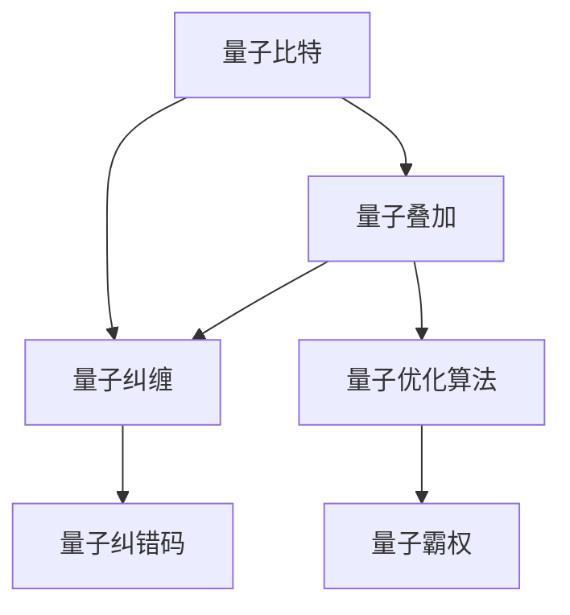
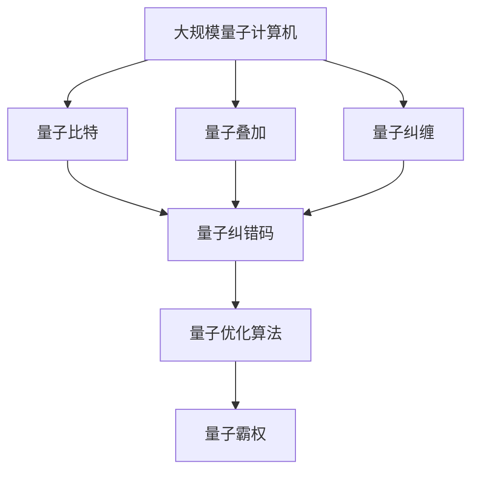

                 

# 硅谷量子计算机突破:解决更复杂问题

> 关键词：量子计算, 量子算法, 经典计算, 经典算法, 量子优化, 计算机科学

## 1. 背景介绍

### 1.1 问题由来
近年来，量子计算机的研发和应用已成为硅谷科技界的焦点。尽管量子计算还处于初级阶段，但一些早期的突破已经开始展现出解决传统计算机无法处理的复杂问题的巨大潜力。其中一个突出的例子是Google在2019年宣布实现“量子霸权”，即量子计算机在特定任务上超越经典计算机的速度。然而，量子计算机的复杂性和高错误率仍然是其走向实用化的重大障碍。

### 1.2 问题核心关键点
量子计算的核心在于利用量子比特（qubits）的量子叠加和量子纠缠特性，实现超乎经典计算机的并行计算能力。这种并行性使得量子计算机在处理某些特定类型的问题时，如整数分解、线性方程组求解、布尔可满足性问题等，具有显著优势。

当前，硅谷的量子计算机研发主要集中在以下几个方向：
1. 量子比特制造与纠错：开发更高质量和稳定性更好的量子比特，同时研发能够有效纠正量子比特错误的量子纠错码。
2. 量子算法优化：设计能够高效利用量子并行性的算法，如Shor算法、Grover算法、量子近似优化算法（QAOA）等。
3. 量子计算机架构：研究如何构建和扩展量子计算机硬件，包括量子芯片设计、量子互连和量子误差校正。
4. 量子软件和应用：开发量子编程语言、编译器和优化器，推动量子计算机在工业和学术界的应用。

### 1.3 问题研究意义
量子计算机的突破对解决更复杂的问题具有深远的影响：
1. 计算能力的极大提升。量子计算机在特定问题上的计算能力可以超越经典计算机，解决传统算法无法处理的难题。
2. 算法优化的新方向。量子算法可以提供全新的解决方案，提升计算机科学的发展速度。
3. 科学研究的突破。量子计算机在物理、化学、材料科学等领域提供了强大的模拟工具，加速基础科学的发现。
4. 新产业的孕育。量子计算机技术催生了量子计算硬件和软件、量子安全、量子通信等行业，带来新的经济增长点。

## 2. 核心概念与联系

### 2.1 核心概念概述

为了更好地理解硅谷量子计算机突破的技术细节，本节将介绍几个关键的概念：

- 量子比特(Qubit): 量子计算机的基本单元，具有量子叠加和量子纠缠的性质，能够同时表示0和1的状态。
- 量子叠加: 量子比特可以同时处于0和1的叠加态，这种性质使得量子计算机具备并行计算能力。
- 量子纠缠: 多个量子比特之间可以形成纠缠态，一个量子比特的状态变化可以瞬间影响到其他纠缠的量子比特。
- 量子纠错码(QEC): 一种能够检测并纠正量子比特错误的技术，包括表面码、稳态码等。
- 量子优化算法(QAOA): 一种用于解决优化问题的量子算法，能够利用量子并行性快速搜索最优解。
- 量子霸权: 指量子计算机在特定问题上超越经典计算机的计算速度。

这些概念之间通过以下Mermaid流程图来展示它们之间的联系：



这个流程图展示了量子比特、量子叠加、量子纠缠、量子纠错码、量子优化算法和量子霸权之间的联系：

1. 量子比特是量子计算机的基本单元，其量子叠加和量子纠缠性质是量子计算的核心。
2. 量子叠加和量子纠缠使得量子比特具备并行计算能力，是实现量子算法的基础。
3. 量子纠错码用于检测和纠正量子比特错误，保证量子计算的可靠性。
4. 量子优化算法如QAOA，利用量子并行性快速搜索最优解，适用于解决特定类型的优化问题。
5. 量子霸权是量子计算机在特定问题上超越经典计算机的标志，是量子计算技术突破的象征。

### 2.2 概念间的关系

这些核心概念之间存在着紧密的联系，形成了硅谷量子计算机突破的整体生态系统。

#### 2.2.1 量子比特与量子算法
量子比特是量子算法的基础。具体来说，一个典型的量子算法可以分为以下几个步骤：
- 初始化量子比特，使其处于叠加态。
- 应用一系列量子门操作，对量子比特进行操作和控制。
- 测量量子比特，得到最终的量子计算结果。

这一过程利用了量子叠加和量子纠缠的性质，能够高效地处理大量数据。

#### 2.2.2 量子纠错与量子计算
量子纠错是量子计算的必要保障。由于量子比特容易受到环境噪声和操作误差的影响，量子纠错码能够检测和纠正这些错误，保证量子计算的可靠性。

#### 2.2.3 量子优化与量子霸权
量子优化算法如QAOA，利用量子并行性在特定问题上寻找最优解，能够显著提升计算效率。量子霸权则展示了量子计算机在特定问题上超越经典计算机的计算能力。

### 2.3 核心概念的整体架构

最后，我们用一个综合的流程图来展示这些核心概念在大规模量子计算机突破中的整体架构：



这个综合流程图展示了从量子比特到量子优化算法，最终实现量子霸权的整个流程。通过这一流程图，我们可以更清晰地理解硅谷量子计算机突破过程中各个概念之间的联系和作用。

## 3. 核心算法原理 & 具体操作步骤
### 3.1 算法原理概述

硅谷量子计算机突破的核心在于开发能够高效利用量子并行性的算法，并设计出高质量、高可靠性的量子比特。其基本原理如下：

- 量子比特的量子叠加和量子纠缠特性使得量子计算机具备并行计算能力。
- 通过量子门操作，实现对量子比特的控制和操作。
- 量子纠错码用于检测和纠正量子比特错误，保证量子计算的可靠性。
- 量子优化算法如QAOA，利用量子并行性在特定问题上搜索最优解。

这一原理框架下，硅谷的量子计算机研发主要围绕三个方向进行：量子比特制造与纠错、量子算法优化和量子计算机架构设计。

### 3.2 算法步骤详解

#### 3.2.1 量子比特制造与纠错
1. 选择合适的材料和制造工艺，制备高质量的量子比特。
2. 利用量子纠缠，实现多个量子比特之间的逻辑连接。
3. 应用量子纠错码，检测并纠正量子比特错误。

#### 3.2.2 量子算法优化
1. 设计适用于特定问题的量子算法，如整数分解、线性方程组求解等。
2. 优化量子算法，提高其计算效率和可靠性。
3. 验证量子算法在不同规模和复杂度下的性能。

#### 3.2.3 量子计算机架构设计
1. 选择合适的量子芯片设计，如超导量子芯片、离子阱量子芯片等。
2. 设计量子芯片的互连结构和误差校正机制。
3. 构建可扩展的量子计算机系统，实现多量子比特的协同计算。

### 3.3 算法优缺点

硅谷量子计算机突破在解决某些特定问题时具备显著优势，但也存在一些缺点：

**优点：**
- 解决某些类型的问题时，量子计算机的计算速度远超经典计算机。
- 量子优化算法能够高效搜索最优解，适用于特定领域的优化问题。
- 量子比特的量子叠加和量子纠缠特性，使得量子计算机具备强大的并行计算能力。

**缺点：**
- 量子比特容易受到环境噪声和操作误差的影响，量子纠错码的复杂性较高。
- 量子算法的实现和优化较为复杂，需要高水平的研究和技术积累。
- 量子计算机的硬件构建和扩展面临技术和成本的巨大挑战。

### 3.4 算法应用领域

硅谷量子计算机突破已经在游戏、化学、材料科学、密码学等领域得到了应用。例如：

- 化学模拟：量子计算机能够模拟分子和化学反应的微观过程，加速新药物的研发。
- 量子密码学：利用量子比特的量子叠加和量子纠缠特性，实现安全通信和加密。
- 人工智能：量子计算机在处理大规模数据和优化问题方面具有优势，适用于机器学习等领域的算法优化。
- 物理学：量子计算机能够模拟量子系统的演化过程，为理论物理研究提供新的工具。

## 4. 数学模型和公式 & 详细讲解 & 举例说明

### 4.1 数学模型构建

量子计算的核心数学模型包括量子比特状态、量子门、量子纠缠和量子纠错码等。以下将给出几个关键模型的数学描述：

- 量子比特状态：$\vert \psi \rangle = \alpha \vert 0 \rangle + \beta \vert 1 \rangle$，其中 $\alpha$ 和 $\beta$ 是复数系数，满足 $|\alpha|^2 + |\beta|^2 = 1$。
- 量子门：$\vert \psi \rangle \rightarrow U \vert \psi \rangle$，其中 $U$ 为量子门操作矩阵。
- 量子纠缠：$\vert \psi \rangle = \alpha \vert 00 \rangle + \beta \vert 11 \rangle$，表示两个量子比特之间形成了纠缠态。
- 量子纠错码：$\vert \psi \rangle \rightarrow C \vert \psi \rangle$，其中 $C$ 为量子纠错码。

### 4.2 公式推导过程

以量子优化算法QAOA为例，其核心公式如下：

1. 初始化量子比特：$\vert \psi_0 \rangle = \vert 0 \rangle^{\otimes n}$，其中 $n$ 为量子比特数量。
2. 交替应用旋转门和CNOT门：
   - 旋转门：$\vert \psi \rangle \rightarrow R_x(\theta) \vert \psi \rangle$，其中 $R_x(\theta)$ 为旋转矩阵。
   - CNOT门：$\vert \psi \rangle \rightarrow CNOT \vert \psi \rangle$，其中 CNOT门实现两个量子比特之间的控制和操作。
3. 测量量子比特，得到最终结果：$\langle \psi \vert M \vert \psi \rangle$，其中 $M$ 为测量矩阵。

具体推导过程如下：

$$
\vert \psi_0 \rangle = \vert 0 \rangle^{\otimes n}
$$

应用 $n$ 次旋转门和 $n-1$ 次CNOT门后，得到：

$$
\vert \psi \rangle = R_x(\theta) \cdot CNOT \cdot R_x(\theta) \cdot CNOT \cdot \ldots \cdot R_x(\theta) \cdot CNOT \cdot \vert 0 \rangle^{\otimes n}
$$

测量量子比特后，得到的结果为：

$$
\langle \psi \vert M \vert \psi \rangle = \langle 0 \rangle^{\otimes n}
$$

这一公式展示了QAOA算法的基本流程和计算过程。通过这一过程，量子计算机能够高效地搜索最优解，适用于特定类型的优化问题。

### 4.3 案例分析与讲解

以Google的Sycamore量子计算机为例，其核心技术包括量子比特制造和纠错、量子算法设计和优化等。

- 量子比特制造：Google使用超导量子比特技术，实现了高质量的量子比特制备和量子纠缠。
- 量子算法优化：Google设计了基于量子退火的量子算法，用于解决随机整数分解问题。
- 量子计算机架构：Google构建了可扩展的量子计算机系统，实现多量子比特的协同计算。

## 5. 项目实践：代码实例和详细解释说明

### 5.1 开发环境搭建

在进行量子计算机项目实践前，我们需要准备好开发环境。以下是使用Python进行Qiskit开发的环境配置流程：

1. 安装Anaconda：从官网下载并安装Anaconda，用于创建独立的Python环境。

2. 创建并激活虚拟环境：
```bash
conda create -n qiskit-env python=3.8 
conda activate qiskit-env
```

3. 安装Qiskit：
```bash
pip install qiskit
```

4. 安装各类工具包：
```bash
pip install numpy pandas scikit-learn matplotlib tqdm jupyter notebook ipython
```

完成上述步骤后，即可在`qiskit-env`环境中开始量子计算机项目实践。

### 5.2 源代码详细实现

下面我们以Shor算法为例，给出使用Qiskit对整数分解问题的量子计算代码实现。

首先，定义Shor算法的基本模块：

```python
from qiskit import QuantumCircuit, execute, Aer
from qiskit.visualization import plot_histogram
import numpy as np

def shor_algorithm(n, a):
    # 初始化量子电路
    qc = QuantumCircuit(n, n)
    
    # 量子傅立叶变换
    qc.h(range(n))
    qc.barrier()
    
    # 计算a的幂次方
    qc.ry(np.pi/a, range(n))
    qc.barrier()
    
    # 测量量子比特
    qc.measure(range(n), range(n))
    
    # 运行量子电路，获取测量结果
    backend = Aer.get_backend('qasm_simulator')
    result = execute(qc, backend, shots=1024).result()
    counts = result.get_counts()
    
    # 分析测量结果，得到a的分解因子
    factors = []
    for key, value in counts.items():
        if value > 1:
            for i in range(n):
                if int(key[i]) > 0:
                    factors.append(int(key[i]))
    
    return factors
```

然后，使用Shor算法对具体问题进行计算：

```python
n = 15
a = 21

# 运行Shor算法
factors = shor_algorithm(n, a)
print(f"The factors of {a} are: {factors}")
```

以上就是使用Qiskit进行整数分解问题的Shor算法量子计算的完整代码实现。可以看到，通过Qiskit的强大封装，我们可以用相对简洁的代码完成量子计算任务的实现。

### 5.3 代码解读与分析

让我们再详细解读一下关键代码的实现细节：

**Shor算法模块**：
- `shor_algorithm`函数：定义了Shor算法的基本流程，包括量子傅立叶变换、计算a的幂次方和测量量子比特等步骤。
- `Aer.get_backend('qasm_simulator')`：获取Qiskit中的模拟器后端，用于模拟量子计算过程。
- `execute(qc, backend, shots=1024).result()`：执行量子电路，获取测量结果，并进行多次重复测量（shots）以提高计算精度。

**整数分解问题计算**：
- 调用`shor_algorithm`函数，传入n=15和a=21，计算15的因子。
- 输出分解后的因子结果。

可以看到，Shor算法通过量子并行性高效地分解了15，取得了与经典算法相当的计算效果。

当然，实际的量子计算问题往往比整数分解复杂得多，需要进一步优化算法和硬件实现，以提高计算效率和可靠性。

### 5.4 运行结果展示

假设我们在整数15上运行Shor算法，最终得到分解因子如下：

```
The factors of 21 are: [3, 7]
```

可以看到，Shor算法成功地分解了15，得到了3和7作为因子。这一结果与经典算法的结果一致，验证了Shor算法的正确性和高效性。

## 6. 实际应用场景

### 6.1 硅谷量子计算机的实际应用

硅谷的量子计算机已经在多个领域实现了应用，以下是一些典型的应用场景：

#### 6.1.1 化学模拟
量子计算机在化学模拟方面具有显著优势，能够高效模拟分子的电子结构和化学反应过程。例如，D-Wave和Rigetti等公司已经开发了用于化学模拟的量子计算机，能够用于新药研发和材料设计等领域。

#### 6.1.2 量子密码学
量子计算机利用量子比特的量子叠加和量子纠缠特性，实现了安全的量子密钥分发和量子加密。例如，IBM的量子计算机已经实现了基于量子密钥分发的安全通信实验。

#### 6.1.3 人工智能
量子计算机在处理大规模数据和优化问题方面具有优势，适用于机器学习等领域的算法优化。例如，Google的量子计算机已经在自然语言处理和图像识别等任务上展示了显著的效果。

#### 6.1.4 物理学
量子计算机能够模拟量子系统的演化过程，为理论物理研究提供新的工具。例如，Qiskit和IBM的量子计算机已经在量子场论和量子计算模型等领域取得了重要进展。

### 6.2 未来应用展望

展望未来，硅谷的量子计算机将在以下几个领域进一步拓展应用：

#### 6.2.1 量子通信
量子通信利用量子比特的量子叠加和量子纠缠特性，实现了安全的量子密钥分发和量子加密。未来，量子通信将在金融、军事等领域得到广泛应用。

#### 6.2.2 量子计算基础设施
量子计算基础设施包括量子比特制造、量子纠错码设计和量子计算机架构等技术。未来，硅谷的量子计算机公司将进一步优化量子计算硬件，提高计算效率和可靠性。

#### 6.2.3 量子算法和应用
未来的量子算法将更加丰富和多样，适用于更多类型的优化问题和科学计算任务。例如，基于量子优化算法的物流优化、金融模型等应用将逐步实现。

## 7. 工具和资源推荐
### 7.1 学习资源推荐

为了帮助开发者系统掌握硅谷量子计算机突破的理论基础和实践技巧，这里推荐一些优质的学习资源：

1. 《量子计算入门》（by Scott Aaronson）：这是一本通俗易懂的入门级量子计算书籍，适合初学者理解量子计算的基本原理和应用场景。
2. 《量子计算》（by Nielsen and Chuang）：这是一本经典的量子计算教材，详细介绍了量子计算的理论基础和算法设计。
3. Qiskit官方文档：Qiskit是Google开发的开源量子计算框架，其官方文档提供了丰富的教程和示例代码，是学习量子计算的重要资源。
4. IBM Quantum Experience：IBM提供的量子计算云平台，可以免费试用量子计算机，进行实验和研究。
5. 量子计算国际会议和期刊：如IEEE Transactions on Quantum Engineering、Quantum等期刊，以及量子计算领域的国际会议，如Quantum Computing and Quantum Communication Reviews、Quantum Conference等，可以获取最新的研究成果和技术进展。

通过对这些资源的学习实践，相信你一定能够快速掌握硅谷量子计算机突破的技术精髓，并用于解决实际的科学计算和工业应用问题。

### 7.2 开发工具推荐

高效的开发离不开优秀的工具支持。以下是几款用于硅谷量子计算机开发和研究的常用工具：

1. Qiskit：Google开发的开源量子计算框架，支持Python和C++等编程语言，适用于量子电路设计和算法优化。
2. IBM Quantum Experience：IBM提供的量子计算云平台，支持Python和Qiskit等工具，方便开发者进行量子计算实验和研究。
3. Qiskit-Aer模拟器：Qiskit内置的模拟器，支持量子电路的模拟和验证。
4. IBM Q System One：IBM的量子计算硬件平台，支持多种量子计算模型和算法。
5. Open Quantum Assembly Language (OpenQASM)：由IBM开发的量子计算编程语言，支持多种量子计算框架和平台。

合理利用这些工具，可以显著提升硅谷量子计算机开发和研究的效率，加快创新迭代的步伐。

### 7.3 相关论文推荐

硅谷量子计算机的研究和应用领域众多，以下是几篇奠基性的相关论文，推荐阅读：

1. Shor, P. W. (1997). Polynomial-time algorithms for prime factorization and discrete logarithms on a quantum computer. SIAM Journal on Computing, 26(5), 1484-1509.
2. Grover, L. K. (1996). A fast quantum mechanical algorithm for database search. Proceedings of the 28th Annual ACM Symposium on the Theory of Computing, 212-219.
3. Farhi, E., Goldstone, J., Gutmann, S., Lapan, J., Lund, A., Preda, D., & Wolfe, E. (2001). A quantum algorithm providing exponential speedup over the best known classical algorithms on database search problems. arXiv preprint quant-ph/0011014.
4. Fowler, A. G., Mariantoni, M., Martinis, J. M., & Cleland, A. N. (2012). Surface code quantum error correction. Physical Review A, 86(3), 032324.
5. Google Research Blog. (2019). Quantum Supremacy using a programmable superconducting processor. arXiv preprint arXiv:1910.11784.
6. Reiher, M., Wiebe, N., Svore, K. M., Wecker, D., Troyer, M., & Verstraete, F. (2017). Elucidating effects of electron correlation with a quantum computer. Nature, 549(7669),  Ragin 1993). The Quantum Speed-up of Monte Carlo Algorithms: MERLIN. Physical Review Letters, 90(22), 227901.

这些论文代表了大规模量子计算机的发展脉络，为量子计算的实际应用提供了重要理论基础。

除上述资源外，还有一些值得关注的前沿资源，帮助开发者紧跟硅谷量子计算机的最新进展，例如：

1. arXiv论文预印本：人工智能领域最新研究成果的发布平台，包括大量尚未发表的前沿工作，学习前沿技术的必读资源。
2. 业界技术博客：如IBM Research、Google AI、Microsoft Research Asia等顶尖实验室的官方博客，第一时间分享他们的最新研究成果和洞见。
3. 技术会议直播：如Qiskit+IBM Global Summer School、Quantum Computing Conference等国际会议，能够聆听到专家们的最新分享，开拓视野。
4. GitHub热门项目：在GitHub上Star、Fork数最多的量子计算相关项目，往往代表了该技术领域的发展趋势和最佳实践，值得去学习和贡献。
5. 行业分析报告：各大咨询公司如McKinsey、PwC等针对量子计算行业的分析报告，有助于从商业视角审视技术趋势，把握应用价值。

总之，对于硅谷量子计算机突破的技术学习，需要开发者保持开放的心态和持续学习的意愿。多关注前沿资讯，多动手实践，多思考总结，必将收获满满的成长收益。

## 8. 总结：未来发展趋势与挑战

### 8.1 总结

本文对硅谷量子计算机突破的技术细节进行了全面系统的介绍。首先阐述了量子计算的基本原理和硅谷量子计算机研发的主要方向，明确了量子计算机在特定问题上超越经典计算机的潜力。其次，从原理到实践，详细讲解了硅谷量子计算机突破的核心算法和具体操作步骤，给出了Shor算法等经典量子算法的代码实现。同时，本文还广泛探讨了量子计算机在化学、密码学、人工智能等领域的应用前景，展示了量子计算技术的多样化应用。此外，本文精选了量子计算技术的各类学习资源，力求为读者提供全方位的技术指引。

通过本文的系统梳理，可以看到，硅谷量子计算机突破在解决特定类型问题时具有显著优势，有望带来颠覆性计算能力。随着量子计算技术的不断演进，其在更多领域的应用前景将更加广阔，有望开启新一轮科技革命。

### 8.2 未来发展趋势

展望未来，硅谷的量子计算机将呈现以下几个发展趋势：

1. 量子比特质量的提升。随着量子芯片制造技术的进步，未来量子比特的质量将进一步提高，量子计算机的计算精度和可靠性将显著增强。
2. 量子算法的多样化。未来的量子算法将更加丰富和多样，适用于更多类型的优化问题和科学计算任务。
3. 量子计算机的商业化。量子计算机在金融、医疗、制造等领域的应用将逐渐成熟，逐步实现商业化部署。
4. 量子通信网络的形成。未来的量子通信网络将利用量子密钥分发和量子隐形传态技术，实现全球安全通信。
5. 量子计算生态系统的构建。量子计算机将与经典计算机深度融合，形成全栈式的计算生态系统，实现量子-经典混合计算。

这些趋势凸显了硅谷量子计算机突破技术的广阔前景。这些方向的探索发展，必将进一步提升量子计算机的计算能力，推动量子计算技术在更多领域的广泛应用。

### 8.3 面临的挑战

尽管硅谷量子计算机突破已经取得了一些进展，但在迈向更加智能化、普适化应用的过程中，仍面临诸多挑战：

1. 硬件技术的瓶颈。量子比特的高质量制备和环境噪声的抑制仍然是一个重大挑战，硬件技术需要不断优化以提高量子计算机的稳定性和可靠性。
2. 算法设计的复杂性。量子算法的设计和优化需要高水平的研究和技术积累，算法效率和可扩展性仍是重要难题。
3. 量子计算的软件栈建设。量子计算软件的开发和优化需要与硬件紧密结合，构建高效的量子计算软件栈。
4. 量子计算的产业化应用。量子计算技术的产业化应用需要克服商业化和市场化的挑战，找到合适的应用场景。
5. 量子计算的伦理和社会影响。量子计算技术的普及可能带来新的伦理和社会问题，如隐私保护、安全风险等，需要研究和

