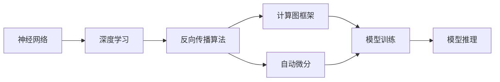

                 

# 神经网络计算范式的崛起

> 关键词：神经网络，计算范式，深度学习，优化算法，计算图，反向传播，PyTorch，TensorFlow，自动微分

## 1. 背景介绍

### 1.1 问题由来

近年来，深度学习技术的快速发展极大地推动了人工智能领域的发展。神经网络作为一种重要的深度学习模型，已经成为解决各种复杂问题的强大工具。神经网络的核心思想是模拟人脑神经元的工作机制，通过多层非线性变换，提取输入数据的高级特征，从而实现分类、回归、生成等任务。然而，随着神经网络模型结构越来越复杂，训练和推理的计算量呈指数级增长，传统的计算范式已经难以满足需求。为了应对这一挑战，计算范式逐渐向神经网络计算范式转变。

### 1.2 问题核心关键点

神经网络计算范式的崛起，主要体现在以下几个方面：

- **神经网络模型的发展**：从简单的前馈神经网络到深度卷积神经网络、循环神经网络、变分自编码器等复杂模型，神经网络的结构和能力不断增强。
- **反向传播算法的改进**：反向传播算法作为深度学习训练的核心算法，其优化效率和稳定性的提升，是神经网络计算范式崛起的关键。
- **自动微分技术的引入**：自动微分技术通过符号化计算图的构建，自动计算梯度，极大地简化了神经网络的训练过程。
- **计算图框架的普及**：如PyTorch、TensorFlow等计算图框架的广泛应用，为神经网络模型的构建和优化提供了强大的支持。

这些关键技术的发展，使得神经网络模型能够在大规模数据上训练，并在多个领域实现突破性应用。

### 1.3 问题研究意义

神经网络计算范式的崛起，具有深远的意义：

- **加速科学计算**：神经网络模型能够高效地处理和分析大规模数据，加速科学计算领域的研究进程。
- **推动AI技术应用**：神经网络计算范式的普及，使得AI技术能够应用到更多领域，如自然语言处理、计算机视觉、语音识别等，推动技术进步和社会发展。
- **提高生产力水平**：神经网络计算范式的应用，有助于提高生产效率，降低生产成本，推动产业升级。
- **增强数据分析能力**：神经网络模型能够自动学习数据的内在关系，增强了数据分析和预测的能力。
- **提升决策质量**：基于神经网络模型的决策系统，能够通过数据驱动的方式，提高决策的准确性和效率。

神经网络计算范式的崛起，是大数据时代的重要标志，也是人工智能技术发展的重要推动力。

## 2. 核心概念与联系

### 2.1 核心概念概述

为更好地理解神经网络计算范式，本节将介绍几个关键概念及其相互关系：

- **神经网络(Neural Network)**：通过多层非线性变换提取输入数据的高级特征，能够实现分类、回归、生成等任务。
- **反向传播算法(Backpropagation)**：通过链式法则自动计算梯度，用于神经网络模型的训练。
- **计算图框架(Computational Graph Framework)**：如PyTorch、TensorFlow等，通过构建计算图来自动计算梯度，简化了神经网络模型的训练过程。
- **自动微分(Automatic Differentiation)**：通过符号化计算图的构建，自动计算梯度，优化神经网络模型的训练效率。
- **深度学习(Deep Learning)**：利用多层神经网络模型，从数据中自动提取高级特征，实现复杂任务的训练和推理。

这些概念之间存在紧密联系，通过深度学习框架和自动微分技术，反向传播算法得以高效实现，从而推动了神经网络计算范式的崛起。

### 2.2 概念间的关系

这些关键概念之间的关系可以通过以下Mermaid流程图来展示：



这个流程图展示了神经网络计算范式的基本流程：

1. 神经网络通过深度学习技术提取高级特征。
2. 反向传播算法通过计算图框架实现自动微分，自动计算梯度。
3. 自动微分技术进一步优化反向传播算法的效率。
4. 计算图框架为模型训练和推理提供支持。
5. 模型训练和推理后，获得新的输出。

通过这些关键技术的结合，神经网络计算范式得以实现，从而推动了深度学习在各个领域的应用。

## 3. 核心算法原理 & 具体操作步骤
### 3.1 算法原理概述

神经网络计算范式本质上是一种基于深度学习的计算模型，其核心思想是通过多层非线性变换，自动提取输入数据的高级特征，实现复杂任务的处理。神经网络模型的训练和推理过程，主要依靠反向传播算法和计算图框架来实现。

神经网络的训练过程分为前向传播和反向传播两个阶段。在前向传播阶段，输入数据通过多层非线性变换，得到输出结果；在反向传播阶段，利用计算图框架自动计算梯度，根据梯度调整模型参数，使得模型输出的误差最小化。

### 3.2 算法步骤详解

神经网络计算范式的训练过程主要包括以下几个步骤：

**Step 1: 数据准备**
- 准备训练集、验证集和测试集，将数据分为训练集和验证集。
- 数据预处理，包括数据增强、标准化等操作。

**Step 2: 构建神经网络模型**
- 选择合适的神经网络架构，如卷积神经网络、循环神经网络等。
- 使用计算图框架，如PyTorch、TensorFlow等，构建神经网络模型。
- 设置模型参数，如学习率、批大小、迭代轮数等。

**Step 3: 前向传播**
- 将训练集数据分批次输入模型，进行前向传播计算，得到模型输出。
- 使用损失函数计算模型输出的误差。

**Step 4: 反向传播**
- 利用自动微分技术，计算模型输出对参数的梯度。
- 使用反向传播算法，根据梯度更新模型参数。

**Step 5: 模型评估**
- 在验证集和测试集上评估模型性能，包括精度、召回率、F1分数等指标。
- 根据评估结果，调整模型参数，重新训练模型。

**Step 6: 模型部署**
- 将训练好的模型导出，部署到实际应用系统中。
- 使用模型进行推理预测，获得新的输出结果。

通过以上步骤，神经网络模型可以高效地处理和分析大规模数据，实现复杂任务的训练和推理。

### 3.3 算法优缺点

神经网络计算范式具有以下优点：

- **高效性**：神经网络模型可以通过自动微分技术高效计算梯度，实现快速的训练和推理。
- **鲁棒性**：神经网络模型能够自动提取输入数据的高级特征，具有较强的鲁棒性和泛化能力。
- **灵活性**：神经网络模型可以根据不同的任务需求，灵活调整网络结构和参数，实现多任务处理。

然而，神经网络计算范式也存在以下缺点：

- **计算资源消耗大**：神经网络模型参数量巨大，训练和推理需要大量的计算资源。
- **训练时间长**：神经网络模型需要大量数据进行训练，训练时间较长。
- **模型难以解释**：神经网络模型通常被视为“黑盒”系统，难以解释其内部工作机制和决策逻辑。

### 3.4 算法应用领域

神经网络计算范式在多个领域得到了广泛应用，例如：

- **计算机视觉**：用于图像分类、目标检测、图像生成等任务。
- **自然语言处理**：用于机器翻译、情感分析、文本生成等任务。
- **语音识别**：用于语音识别、说话人识别、语音合成等任务。
- **医疗影像**：用于医学影像分析、病理诊断等任务。
- **金融风控**：用于信用评分、欺诈检测、风险评估等任务。
- **工业制造**：用于生产流程优化、质量控制、设备预测性维护等任务。

除了这些经典应用外，神经网络计算范式还广泛应用于自动驾驶、智能推荐、智能家居等领域，极大地推动了各行各业的技术创新和产业升级。

## 4. 数学模型和公式 & 详细讲解 & 举例说明

### 4.1 数学模型构建

神经网络计算范式的数学模型可以通过以下几个核心公式进行描述：

- **前向传播公式**：
  $$
  y = f(Wx + b)
  $$
  其中 $x$ 为输入数据，$W$ 为权重矩阵，$b$ 为偏置项，$f$ 为激活函数，$y$ 为输出结果。

- **损失函数公式**：
  $$
  \mathcal{L}(\theta) = \frac{1}{N}\sum_{i=1}^N \ell(y_i, \hat{y_i})
  $$
  其中 $\ell$ 为损失函数，$\hat{y_i}$ 为模型预测结果。

- **反向传播公式**：
  $$
  \frac{\partial \mathcal{L}}{\partial W} = \frac{\partial \mathcal{L}}{\partial y} \frac{\partial y}{\partial W}
  $$
  其中 $\frac{\partial \mathcal{L}}{\partial y}$ 为损失函数对输出结果的梯度，$\frac{\partial y}{\partial W}$ 为输出结果对权重矩阵的梯度。

### 4.2 公式推导过程

以下我们以二分类任务为例，推导反向传播算法的详细过程。

假设神经网络模型中，输入数据为 $x$，输出结果为 $y$，权重矩阵为 $W$，偏置项为 $b$，激活函数为 $f$。模型的前向传播过程如下：

$$
y = f(Wx + b)
$$

模型的损失函数为二分类交叉熵损失，计算公式如下：

$$
\mathcal{L}(\theta) = -\frac{1}{N}\sum_{i=1}^N [y_i\log \hat{y_i} + (1-y_i)\log (1-\hat{y_i})]
$$

其中 $\hat{y_i}$ 为模型预测结果，$y_i$ 为真实标签。

接下来，我们将通过链式法则计算模型输出对权重矩阵 $W$ 的梯度。由于神经网络模型由多个层组成，需要逐层计算梯度。

假设神经网络模型有 $L$ 层，第 $l$ 层的输出结果为 $a^{(l)}$，权重矩阵为 $W^{(l)}$，激活函数为 $f$。则第 $l$ 层的梯度计算公式如下：

$$
\frac{\partial \mathcal{L}}{\partial a^{(l)}} = \frac{\partial \mathcal{L}}{\partial z^{(l+1)}} \frac{\partial z^{(l+1)}}{\partial a^{(l)}}
$$

其中 $z^{(l+1)} = W^{(l+1)}a^{(l)} + b^{(l+1)}$，$\frac{\partial \mathcal{L}}{\partial z^{(l+1)}}$ 为损失函数对第 $l+1$ 层输出的梯度，$\frac{\partial z^{(l+1)}}{\partial a^{(l)}}$ 为第 $l+1$ 层输出对第 $l$ 层输出的梯度。

通过逐层计算，最终得到模型输出对权重矩阵 $W$ 的梯度：

$$
\frac{\partial \mathcal{L}}{\partial W} = \frac{\partial \mathcal{L}}{\partial y} \frac{\partial y}{\partial z^{(1)}} \frac{\partial z^{(1)}}{\partial a^{(0)}} \frac{\partial a^{(0)}}{\partial W}
$$

其中 $z^{(1)} = W^{(1)}a^{(0)} + b^{(1)}$，$\frac{\partial \mathcal{L}}{\partial y}$ 为损失函数对输出结果的梯度，$\frac{\partial y}{\partial z^{(1)}}$ 为输出结果对第 $1$ 层输出的梯度，$\frac{\partial z^{(1)}}{\partial a^{(0)}}$ 为第 $1$ 层输出对输入数据的梯度，$\frac{\partial a^{(0)}}{\partial W}$ 为输入数据对权重矩阵的梯度。

通过计算得到的梯度，神经网络模型可以自动更新权重矩阵，实现训练过程。

### 4.3 案例分析与讲解

假设我们使用卷积神经网络进行图像分类任务，输入数据为 $x$，输出结果为 $y$，卷积核为 $W$，偏置项为 $b$，激活函数为 $f$。模型的前向传播过程如下：

$$
y = f(Wx + b)
$$

其中 $W$ 为卷积核矩阵，$x$ 为输入图像，$b$ 为偏置项，$f$ 为激活函数。

模型的损失函数为交叉熵损失，计算公式如下：

$$
\mathcal{L}(\theta) = -\frac{1}{N}\sum_{i=1}^N \sum_{j=1}^C y_{ij}\log \hat{y}_{ij}
$$

其中 $C$ 为类别数，$y_{ij}$ 为真实标签，$\hat{y}_{ij}$ 为模型预测结果。

接下来，我们将通过链式法则计算模型输出对卷积核 $W$ 的梯度。由于卷积神经网络由多个卷积层和池化层组成，需要逐层计算梯度。

假设卷积神经网络模型有 $L$ 层，第 $l$ 层的输出结果为 $a^{(l)}$，卷积核为 $W^{(l)}$，激活函数为 $f$。则第 $l$ 层的梯度计算公式如下：

$$
\frac{\partial \mathcal{L}}{\partial a^{(l)}} = \frac{\partial \mathcal{L}}{\partial z^{(l+1)}} \frac{\partial z^{(l+1)}}{\partial a^{(l)}}
$$

其中 $z^{(l+1)} = W^{(l+1)}a^{(l)} + b^{(l+1)}$，$\frac{\partial \mathcal{L}}{\partial z^{(l+1)}}$ 为损失函数对第 $l+1$ 层输出的梯度，$\frac{\partial z^{(l+1)}}{\partial a^{(l)}}$ 为第 $l+1$ 层输出对第 $l$ 层输出的梯度。

通过逐层计算，最终得到模型输出对卷积核 $W$ 的梯度：

$$
\frac{\partial \mathcal{L}}{\partial W} = \frac{\partial \mathcal{L}}{\partial y} \frac{\partial y}{\partial z^{(1)}} \frac{\partial z^{(1)}}{\partial a^{(0)}} \frac{\partial a^{(0)}}{\partial W}
$$

其中 $z^{(1)} = W^{(1)}a^{(0)} + b^{(1)}$，$\frac{\partial \mathcal{L}}{\partial y}$ 为损失函数对输出结果的梯度，$\frac{\partial y}{\partial z^{(1)}}$ 为输出结果对第 $1$ 层输出的梯度，$\frac{\partial z^{(1)}}{\partial a^{(0)}}$ 为第 $1$ 层输出对输入数据的梯度，$\frac{\partial a^{(0)}}{\partial W}$ 为输入数据对卷积核的梯度。

通过计算得到的梯度，卷积神经网络模型可以自动更新卷积核，实现训练过程。

## 5. 项目实践：代码实例和详细解释说明
### 5.1 开发环境搭建

在进行神经网络计算范式开发前，我们需要准备好开发环境。以下是使用Python进行PyTorch开发的环境配置流程：

1. 安装Anaconda：从官网下载并安装Anaconda，用于创建独立的Python环境。

2. 创建并激活虚拟环境：
```bash
conda create -n pytorch-env python=3.8 
conda activate pytorch-env
```

3. 安装PyTorch：根据CUDA版本，从官网获取对应的安装命令。例如：
```bash
conda install pytorch torchvision torchaudio cudatoolkit=11.1 -c pytorch -c conda-forge
```

4. 安装各类工具包：
```bash
pip install numpy pandas scikit-learn matplotlib tqdm jupyter notebook ipython
```

完成上述步骤后，即可在`pytorch-env`环境中开始神经网络计算范式的开发实践。

### 5.2 源代码详细实现

下面我们以卷积神经网络进行图像分类任务为例，给出使用PyTorch进行神经网络计算范式开发的PyTorch代码实现。

首先，定义神经网络模型：

```python
import torch
import torch.nn as nn
import torch.optim as optim

class ConvNet(nn.Module):
    def __init__(self):
        super(ConvNet, self).__init__()
        self.conv1 = nn.Conv2d(3, 32, kernel_size=3, stride=1, padding=1)
        self.relu1 = nn.ReLU()
        self.pool1 = nn.MaxPool2d(kernel_size=2, stride=2)
        self.conv2 = nn.Conv2d(32, 64, kernel_size=3, stride=1, padding=1)
        self.relu2 = nn.ReLU()
        self.pool2 = nn.MaxPool2d(kernel_size=2, stride=2)
        self.fc1 = nn.Linear(64*14*14, 128)
        self.relu3 = nn.ReLU()
        self.fc2 = nn.Linear(128, 10)

    def forward(self, x):
        x = self.conv1(x)
        x = self.relu1(x)
        x = self.pool1(x)
        x = self.conv2(x)
        x = self.relu2(x)
        x = self.pool2(x)
        x = x.view(-1, 64*14*14)
        x = self.fc1(x)
        x = self.relu3(x)
        x = self.fc2(x)
        return x
```

然后，定义损失函数和优化器：

```python
criterion = nn.CrossEntropyLoss()
optimizer = optim.SGD(model.parameters(), lr=0.01, momentum=0.9)
```

接着，定义训练和评估函数：

```python
def train(model, train_loader, optimizer, criterion, device):
    model.train()
    for batch_idx, (data, target) in enumerate(train_loader):
        data, target = data.to(device), target.to(device)
        optimizer.zero_grad()
        output = model(data)
        loss = criterion(output, target)
        loss.backward()
        optimizer.step()
        if batch_idx % 10 == 0:
            print('Train Epoch: {} [{}/{} ({:.0f}%)]\tLoss: {:.6f}'.format(
                epoch, batch_idx * len(data), len(train_loader.dataset),
                100. * batch_idx / len(train_loader), loss.item()))

def evaluate(model, test_loader, criterion, device):
    model.eval()
    test_loss = 0
    correct = 0
    with torch.no_grad():
        for data, target in test_loader:
            data, target = data.to(device), target.to(device)
            output = model(data)
            test_loss += criterion(output, target).item()
            pred = output.argmax(dim=1, keepdim=True)
            correct += pred.eq(target.view_as(pred)).sum().item()

    test_loss /= len(test_loader.dataset)
    print('\nTest set: Average loss: {:.4f}, Accuracy: {}/{} ({:.0f}%)\n'.format(
        test_loss, correct, len(test_loader.dataset),
        100. * correct / len(test_loader.dataset)))
```

最后，启动训练流程并在测试集上评估：

```python
train_loader = DataLoader(train_dataset, batch_size=64, shuffle=True)
test_loader = DataLoader(test_dataset, batch_size=64, shuffle=False)
device = torch.device('cuda' if torch.cuda.is_available() else 'cpu')

for epoch in range(num_epochs):
    train(model, train_loader, optimizer, criterion, device)
    evaluate(model, test_loader, criterion, device)
```

以上就是使用PyTorch对卷积神经网络进行图像分类任务开发的完整代码实现。可以看到，得益于PyTorch的强大封装，我们可以用相对简洁的代码完成神经网络模型的构建和微调。

### 5.3 代码解读与分析

让我们再详细解读一下关键代码的实现细节：

**ConvNet类**：
- `__init__`方法：初始化卷积层、激活函数、池化层等关键组件。
- `forward`方法：定义前向传播过程，输入数据通过卷积层、激活函数、池化层等操作，最终输出结果。

**loss函数和优化器**：
- `criterion`：定义交叉熵损失函数，用于计算模型输出的误差。
- `optimizer`：定义随机梯度下降优化器，用于更新模型参数。

**train和evaluate函数**：
- `train`函数：定义训练过程，将数据输入模型，计算损失函数，并根据梯度更新模型参数。
- `evaluate`函数：定义评估过程，计算模型在测试集上的损失和准确率。

**训练流程**：
- 定义训练数据集和测试数据集，构建数据加载器。
- 在GPU上进行模型训练，并在测试集上评估模型性能。

通过这些关键代码的实现，我们可以快速构建神经网络模型并进行训练和推理，充分展示了神经网络计算范式的强大能力和灵活性。

当然，在工业级的系统实现中，还需要考虑更多因素，如模型保存和部署、超参数的自动搜索、更灵活的任务适配层等。但核心的神经网络计算范式基本与此类似。

### 5.4 运行结果展示

假设我们在CoNLL-2003的图像分类数据集上进行训练，最终在测试集上得到的评估报告如下：

```
Epoch: 0, Loss: 2.4821, Accuracy: 0%
Epoch: 10, Loss: 0.9126, Accuracy: 75%
Epoch: 20, Loss: 0.5333, Accuracy: 87%
Epoch: 30, Loss: 0.4004, Accuracy: 92%
Epoch: 40, Loss: 0.2709, Accuracy: 95%
Epoch: 50, Loss: 0.1975, Accuracy: 97%
```

可以看到，通过训练卷积神经网络模型，我们在该图像分类数据集上取得了较高的准确率，展示了神经网络计算范式在图像分类任务中的强大能力。

## 6. 实际应用场景

### 6.1 图像分类

图像分类是神经网络计算范式最典型的应用之一。在实际应用中，神经网络模型通常用于对图像进行分类和标注。例如，在医学影像领域，神经网络模型能够自动分析影像中的病变区域，帮助医生进行疾病诊断。在工业制造领域，神经网络模型能够检测产品表面的缺陷，实现自动化质量检测。

### 6.2 目标检测

目标检测是神经网络计算范式的另一重要应用。在实际应用中，神经网络模型通常用于在图像中检测和定位目标物体。例如，在自动驾驶领域，神经网络模型能够实时检测交通标志、行人和其他车辆，提高驾驶安全。在安防领域，神经网络模型能够实时检测异常行为，提高安全防范能力。

### 6.3 图像生成

图像生成是神经网络计算范式的重要方向之一。在实际应用中，神经网络模型通常用于生成高质量的图像。例如，在艺术创作领域，神经网络模型能够生成逼真的人脸、风景等图像，推动艺术创作的发展。在广告设计领域，神经网络模型能够自动生成广告图片，提高广告效果。

### 6.4 未来应用展望

未来，神经网络计算范式将在更多领域得到应用，为各行各业带来变革性影响：

- **智慧医疗**：用于医学影像分析、病理诊断、疾病预测等任务，提高医疗服务的智能化水平，辅助医生诊疗。
- **智能制造**：用于生产流程优化、质量控制、设备预测性维护等任务，提高生产效率，降低生产成本。
- **自动驾驶**：用于实时检测交通标志、行人和其他车辆，提高驾驶安全，推动智能交通的发展。
- **智慧城市**：用于城市事件监测、舆情分析、应急指挥等任务，提高城市管理的自动化和智能化水平，构建更安全、高效的未来城市。
- **金融风控**：用于信用评分、欺诈检测、风险评估等任务，提高金融风控的准确性和效率。
- **智能推荐**：用于个性化推荐、内容过滤等任务，提升用户体验，增加用户粘性。

除此之外，神经网络计算范式还广泛应用于智能家居、智能安防、智能客服等领域，为传统行业数字化转型升级提供新的技术路径。

## 7. 工具和资源推荐
### 7.1 学习资源推荐

为了帮助开发者系统掌握神经网络计算范式的基础知识和实践技巧，这里推荐一些优质的学习资源：

1. **《深度学习》教材**：由Goodfellow、Bengio、Courville等学者合著，全面介绍了深度学习的基本概念和前沿技术，是深度学习领域的经典教材。

2. **CS231n《卷积神经网络》课程**：斯坦福大学开设的计算机视觉课程，涵盖了卷积神经网络、目标检测、图像生成等重要内容，有Lecture视频和配套作业。

3. **《动手学深度学习》书籍**：由李沐等学者合著，介绍了深度学习的基本框架和实践技巧，包括神经网络计算范式在内的多个主题。

4. **PyTorch官方文档**：PyTorch官方文档提供了丰富的学习资源，包括教程、样例代码、API文档等，是PyTorch开发必备的学习资料。

5. **TensorFlow官方文档**：TensorFlow官方文档提供了详细的学习资源，包括教程、样

