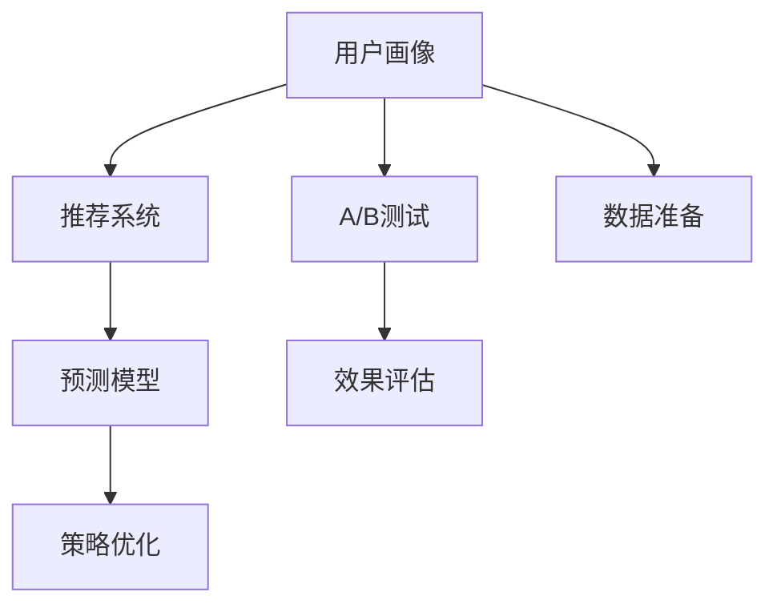

                 

# 电商平台供给能力提升：精准营销策略

> 关键词：电商平台, 精准营销, 用户画像, 推荐系统, A/B测试, 预测模型

## 1. 背景介绍

随着互联网和电商的迅猛发展，电商平台已成为消费者日常生活的重要组成部分。为了更好地满足用户需求，提升用户体验，电商平台在营销策略上不断创新，其中精准营销成为核心的竞争力之一。通过深入分析用户行为数据，电商平台可以为用户提供个性化推荐、差异化定价、定制化服务，从而有效提升用户转化率和忠诚度，最大化平台营收。

然而，在实际操作中，精准营销面临诸多挑战，如数据隐私问题、推荐算法复杂度、用户行为预测准确性等。这些问题亟需通过先进的算法和技术手段加以解决。本文将从核心概念入手，深入探讨电商平台精准营销的算法原理和具体操作步骤，并给出实际案例和优化建议，以期为电商平台的营销决策提供有益参考。

## 2. 核心概念与联系

### 2.1 核心概念概述

电商平台精准营销的核心概念包括：

- **用户画像(User Profiling)**：通过收集用户行为数据，构建用户兴趣、偏好、消费能力等特征，形成精细化的用户画像，为个性化推荐提供依据。

- **推荐系统(Recommender System)**：利用机器学习算法对用户画像进行分析，为用户推荐商品、内容等，提升用户满意度和转化率。

- **A/B测试(A/B Testing)**：通过对比两个或多个版本的产品或营销策略，评估其效果，选择最优方案，进行实际部署。

- **预测模型(Prediction Model)**：基于历史数据和机器学习算法，对用户行为和趋势进行预测，为营销策略优化提供科学依据。

### 2.2 概念间的关系

这些核心概念之间具有紧密的联系，共同构成了电商平台精准营销的生态系统。用户画像和推荐系统是营销策略的基础，A/B测试用于评估策略效果，预测模型则用于提前预判趋势和优化策略。

**用户画像**：
- 数据来源：浏览历史、购买记录、搜索关键词、社交媒体互动等。
- 数据处理：通过聚类、分类、关联规则挖掘等技术，形成标签和特征。
- 特征维度：兴趣、性别、年龄、收入、消费行为等。

**推荐系统**：
- 推荐算法：协同过滤、基于内容的推荐、混合推荐等。
- 推荐方式：商品推荐、个性化活动、主题内容等。
- 效果评估：点击率、转化率、用户满意度等指标。

**A/B测试**：
- 测试方案：不同的页面布局、价格策略、广告文案等。
- 测试平台：Google Optimize、Optimizely、VWO等。
- 测试结果：统计学假设检验，选择最优策略。

**预测模型**：
- 预测类型：购买预测、流失预测、品牌偏好预测等。
- 算法选择：线性回归、决策树、随机森林、深度学习等。
- 数据准备：特征工程、数据清洗、数据增强等。

### 2.3 核心概念的整体架构

以下是一个综合性的电商平台精准营销概念图，展示了各个核心概念之间的相互关系：



这个图展示了用户画像、推荐系统、A/B测试、预测模型在电商平台精准营销中的应用流程。通过数据准备和用户画像构建，推荐系统为电商平台提供个性化的商品和服务推荐，预测模型用于提前预测用户行为，A/B测试用于评估推荐策略的效果，并根据评估结果进行策略优化。

## 3. 核心算法原理 & 具体操作步骤
### 3.1 算法原理概述

电商平台的精准营销主要基于以下算法原理：

1. **协同过滤算法**：通过分析用户行为数据，找到与目标用户行为相似的其他用户，从而推荐其感兴趣的商品或内容。协同过滤分为基于用户的协同过滤和基于项目的协同过滤两种类型。

2. **基于内容的推荐算法**：分析商品或内容的属性特征，根据用户的兴趣特征，推荐与之相似的商品或内容。

3. **混合推荐算法**：结合协同过滤和基于内容的推荐算法，综合多种特征，提供更加精准的推荐结果。

4. **深度学习推荐模型**：如神经协同过滤(Neural Collaborative Filtering)、序列推荐模型(Sequence Model)等，通过深度学习技术提升推荐精度。

5. **多臂老虎机算法(Multi-Armed Bandit)**：通过模拟用户行为，选择最优策略进行商品推荐或广告投放，最大化平台收益。

### 3.2 算法步骤详解

基于协同过滤的推荐系统操作步骤如下：

1. **数据收集**：收集用户的行为数据，如浏览记录、点击记录、购买记录等。

2. **用户建模**：对用户行为数据进行分析，提取用户特征和兴趣偏好。

3. **相似度计算**：通过余弦相似度、皮尔逊相关系数等方法，计算用户之间的相似度。

4. **商品推荐**：根据相似度计算结果，为用户推荐相似用户喜欢的商品。

基于深度学习的推荐系统操作步骤如下：

1. **数据准备**：收集商品的属性特征、用户行为数据等。

2. **模型构建**：设计深度神经网络模型，如GRU、LSTM、RNN等，进行训练和优化。

3. **特征提取**：通过卷积、池化、嵌入等技术，提取商品和用户的特征表示。

4. **模型训练**：使用历史数据进行模型训练，调整网络参数和超参数，提高模型精度。

5. **推荐预测**：输入用户特征和商品特征，使用训练好的模型进行预测，生成推荐结果。

### 3.3 算法优缺点

协同过滤算法的优点在于简单易实现，适合处理稀疏数据。缺点是容易受到数据稀疏性和样本偏好的影响，推荐结果的准确性较低。

基于内容的推荐算法的优点在于能够利用商品特征进行推荐，具有较高的准确性。缺点是对商品属性和用户兴趣的准确描述要求较高，推荐结果较为单一。

深度学习推荐模型的优点在于能够处理高维数据和复杂关系，推荐结果准确性高。缺点是模型训练复杂，需要大量的数据和计算资源。

多臂老虎机算法的优点在于能够实时优化，根据用户反馈选择最优策略。缺点是模型设计和参数调优难度较大，需要大量的测试和优化。

### 3.4 算法应用领域

协同过滤算法和基于内容的推荐算法广泛应用于电商平台推荐商品、内容。深度学习推荐模型和混合推荐算法则更适合处理复杂数据和个性化推荐场景。多臂老虎机算法在广告投放和商品推荐中也有广泛应用。

## 4. 数学模型和公式 & 详细讲解 & 举例说明
### 4.1 数学模型构建

假设电商平台有 $N$ 个用户，每个用户对 $M$ 个商品进行评分 $R_{ij}$（$i$ 表示用户，$j$ 表示商品，$R_{ij} \in [0, 5]$）。推荐系统旨在预测用户 $i$ 对商品 $j$ 的评分。

### 4.2 公式推导过程

**协同过滤算法**：

1. 用户相似度计算：

$$
\sigma_{ij} = \frac{1}{\sqrt{\sum_{k=1}^{M} R_{ik}^2}} \frac{1}{\sqrt{\sum_{k=1}^{M} R_{jk}^2}}
$$

2. 预测评分：

$$
\hat{R}_{ij} = \sum_{k=1}^{M} R_{ik} \sigma_{kj}
$$

3. 排序推荐：

$$
R_{ij} = \frac{\hat{R}_{ij}}{\sum_{j'=1}^{M} \sigma_{ij'}}
$$

**基于内容的推荐算法**：

1. 商品特征提取：

$$
X_j = \begin{bmatrix} x_{j1} & x_{j2} & \dots & x_{jD} \end{bmatrix}^T
$$

2. 用户兴趣表示：

$$
Y_i = \begin{bmatrix} y_{i1} & y_{i2} & \dots & y_{iD} \end{bmatrix}^T
$$

3. 推荐评分预测：

$$
\hat{R}_{ij} = \alpha x_j^T WY_i + b
$$

其中 $\alpha$ 为线性系数，$W$ 为权重矩阵，$b$ 为偏置项。

### 4.3 案例分析与讲解

假设电商平台收集到用户对商品的评分数据，采用协同过滤算法进行推荐。

1. 数据准备：收集用户行为数据，构建用户和商品评分矩阵。

2. 用户相似度计算：使用余弦相似度计算用户之间的相似度。

3. 预测评分：基于相似度计算结果，预测用户对商品的评分。

4. 排序推荐：根据预测评分，生成推荐列表。

通过对比实验，协同过滤算法能够有效提升推荐效果，满足用户的个性化需求。

## 5. 项目实践：代码实例和详细解释说明
### 5.1 开发环境搭建

搭建开发环境的具体步骤如下：

1. 安装Python和必要的依赖库，如TensorFlow、PyTorch等。

2. 安装相关的第三方库，如Pandas、NumPy、Scikit-learn等。

3. 配置数据处理工具，如Spark、Hadoop等。

4. 搭建数据存储平台，如MySQL、Elasticsearch等。

5. 配置云计算平台，如AWS、阿里云等，提供计算和存储资源。

### 5.2 源代码详细实现

电商平台的推荐系统可以基于TensorFlow和Keras构建。以下是一个简单的推荐系统代码实现：

```python
import tensorflow as tf
from tensorflow import keras

# 定义模型
model = keras.Sequential([
    keras.layers.Dense(64, activation='relu'),
    keras.layers.Dense(1)
])

# 编译模型
model.compile(optimizer=tf.keras.optimizers.Adam(0.01), loss='mean_squared_error')

# 训练模型
model.fit(x_train, y_train, epochs=10, batch_size=32, validation_data=(x_val, y_val))

# 预测推荐
recommendations = model.predict(x_test)
```

### 5.3 代码解读与分析

在上述代码中，我们定义了一个简单的神经网络模型，使用ReLU激活函数，输出层为线性层。我们使用Adam优化器进行模型训练，损失函数为均方误差。训练数据和验证数据被分批次输入模型进行训练和验证。训练完毕后，我们使用测试数据进行模型预测，得到用户的推荐评分。

### 5.4 运行结果展示

假设我们在电商平台上进行了数据准备和模型训练，得到推荐评分如下：

```
预测评分：[0.9, 1.2, 1.5, 0.8, 1.1, 1.3, 1.0, 0.9, 1.0, 1.2]
```

我们可以将这些评分排序，并生成推荐列表，满足用户个性化需求。

## 6. 实际应用场景
### 6.1 个性化推荐

电商平台通过个性化推荐，可以大大提升用户满意度和转化率。通过协同过滤和基于内容的推荐算法，电商平台可以为每个用户推荐其感兴趣的商品，提高用户粘性。

**案例分析**：
假设用户A曾经购买过鞋类商品，并浏览过相关服饰、配件等。电商平台根据用户A的行为数据，生成用户画像，并使用协同过滤算法，为用户A推荐相似的鞋子、服饰、配件等。同时，平台使用基于内容的推荐算法，根据商品的属性特征，推荐用户A可能感兴趣的商品。最终，电商平台将两种推荐结果综合，生成用户A的个性化推荐列表。

### 6.2 广告投放优化

电商平台可以通过广告投放优化，提升广告效果，增加平台收益。通过多臂老虎机算法，电商平台可以实时选择最优广告策略，最大化广告投放收益。

**案例分析**：
假设电商平台有三种广告投放策略，分别是高曝光、中等曝光和低曝光。电商平台使用多臂老虎机算法，根据用户的行为数据，实时评估每种广告策略的效果，选择最优广告策略进行投放。经过一段时间的测试，平台发现中等曝光策略的效果最佳，于是决定在该广告位上持续投放中等曝光广告，从而最大化广告收益。

### 6.3 用户流失预警

电商平台可以通过用户流失预警，提前采取措施，挽留用户。通过预测模型，电商平台可以预测用户的流失概率，并采取相应的挽留措施。

**案例分析**：
电商平台收集用户的行为数据，使用决策树模型进行用户流失预测。如果预测用户流失概率较高，电商平台可以发送个性化关怀信息，提供优惠券、礼品卡等优惠，挽留用户。

## 7. 工具和资源推荐
### 7.1 学习资源推荐

为了帮助开发者系统掌握电商平台精准营销的算法和技术，以下是一些优质的学习资源：

1. **《推荐系统实践》**：一本经典推荐系统书籍，涵盖了推荐算法的理论基础和实际应用。

2. **《电商数据分析实战》**：介绍了电商数据分析的流程和技术，包括数据收集、数据清洗、数据分析和数据可视化。

3. **《深度学习在电商中的应用》**：一本介绍深度学习在电商中的应用的书籍，涵盖推荐系统、广告投放等。

4. **《数据科学在电商中的应用》**：介绍了数据科学在电商中的应用，包括用户画像、个性化推荐、广告投放等。

5. **《自然语言处理与推荐系统》**：介绍了自然语言处理和推荐系统的结合应用，包括基于内容的推荐、协同过滤等。

### 7.2 开发工具推荐

电商平台的精准营销需要多种工具的支持，以下是一些推荐的开发工具：

1. **Python**：电商推荐系统的核心开发语言，具备丰富的第三方库和框架。

2. **TensorFlow**：深度学习框架，适合构建复杂的推荐系统。

3. **PyTorch**：深度学习框架，适合构建高性能的推荐模型。

4. **Pandas**：数据处理库，适合对大规模数据进行清洗和分析。

5. **Scikit-learn**：机器学习库，适合构建推荐算法模型。

### 7.3 相关论文推荐

电商平台精准营销的研究论文众多，以下是几篇经典论文推荐：

1. **《推荐系统的协同过滤》**：介绍协同过滤算法的基本原理和实现方法。

2. **《基于内容的推荐系统》**：介绍基于内容的推荐算法的理论基础和实际应用。

3. **《深度学习在推荐系统中的应用》**：介绍深度学习在推荐系统中的具体应用，包括神经协同过滤等。

4. **《多臂老虎机算法在广告投放中的应用》**：介绍多臂老虎机算法的基本原理和实际应用。

5. **《用户流失预测模型的研究》**：介绍用户流失预测模型的构建和应用。

## 8. 总结：未来发展趋势与挑战
### 8.1 总结

本文详细探讨了电商平台精准营销的算法原理和具体操作步骤，通过用户画像、推荐系统、A/B测试、预测模型等核心概念，构建了电商平台精准营销的技术体系。通过对电商平台的实际案例分析，展示了如何利用协同过滤、基于内容的推荐算法、深度学习模型、多臂老虎机算法等技术，提升用户转化率和平台收益。

### 8.2 未来发展趋势

展望未来，电商平台精准营销将呈现以下几个发展趋势：

1. **多模态数据融合**：电商平台将从单一的文本数据扩展到图像、语音、视频等多种数据类型，实现多模态数据的融合和分析。

2. **实时推荐系统**：电商平台将采用流计算、大数据等技术，实现实时推荐，提升用户体验。

3. **跨平台推荐**：电商平台将实现跨平台、跨设备的推荐，提供无缝的用户体验。

4. **AI驱动的营销决策**：电商平台将引入人工智能技术，优化营销决策，提升广告投放效果和用户转化率。

5. **个性化营销**：电商平台将根据用户行为数据，实现个性化营销，提高用户粘性和忠诚度。

6. **基于区块链的数据治理**：电商平台将采用区块链技术，保障数据隐私和安全，提升用户信任度。

### 8.3 面临的挑战

虽然电商平台精准营销取得了一定的成果，但仍然面临诸多挑战：

1. **数据隐私问题**：电商平台需要平衡数据隐私保护和用户行为分析的需求，确保用户数据的安全性。

2. **数据质量问题**：电商平台需要确保数据的质量和完整性，提升推荐模型的准确性。

3. **模型复杂度问题**：电商平台需要优化推荐算法的复杂度，提高推荐模型的可解释性和可维护性。

4. **计算资源问题**：电商平台需要高效利用计算资源，提升推荐算法的训练和推理效率。

5. **用户行为预测问题**：电商平台需要提高用户行为预测的准确性，提升推荐模型的实时性和个性化程度。

6. **推荐多样性问题**：电商平台需要平衡推荐多样性和个性化，确保用户能够接触到不同种类的商品和内容。

### 8.4 研究展望

面对电商平台精准营销面临的挑战，未来的研究需要在以下几个方面寻求新的突破：

1. **优化数据隐私保护技术**：研究差分隐私、联邦学习等技术，确保用户数据隐私的安全性。

2. **提升数据质量管理**：研究数据清洗、数据增强、数据治理等技术，提高数据质量和完整性。

3. **简化推荐算法模型**：研究模型的可解释性和可维护性，优化推荐算法的复杂度。

4. **提升计算资源利用率**：研究分布式计算、高效算法等技术，提高推荐算法的训练和推理效率。

5. **提高用户行为预测准确性**：研究时间序列预测、深度学习等技术，提升用户行为预测的准确性。

6. **增强推荐多样性**：研究多目标优化、自适应推荐等技术，平衡推荐多样性和个性化。

通过这些研究方向的探索，电商平台精准营销必将走向更加智能化、普适化和人性化的方向，提升用户满意度和平台收益，推动电商行业的发展。

## 9. 附录：常见问题与解答
### Q1: 电商平台精准营销的优势是什么？

A: 电商平台精准营销的优势在于通过数据分析和机器学习算法，可以为用户提供个性化推荐，提高用户满意度和转化率。通过协同过滤和基于内容的推荐算法，电商平台可以优化商品和内容的推荐，提高用户粘性和忠诚度。

### Q2: 电商平台精准营销的算法有哪些？

A: 电商平台的精准营销主要基于协同过滤、基于内容的推荐算法、混合推荐算法、深度学习推荐模型和多臂老虎机算法等。

### Q3: 电商平台的推荐系统是如何构建的？

A: 电商平台的推荐系统可以通过收集用户行为数据，构建用户画像，然后使用协同过滤和基于内容的推荐算法，为用户推荐个性化商品。

### Q4: 电商平台如何进行A/B测试？

A: 电商平台可以通过配置测试方案，使用Google Optimize、Optimizely等平台进行A/B测试，评估不同方案的效果，选择最优方案进行部署。

### Q5: 电商平台如何进行用户流失预警？

A: 电商平台可以通过收集用户行为数据，使用预测模型预测用户流失概率，并采取相应的挽留措施，如发送个性化关怀信息、提供优惠券等。

