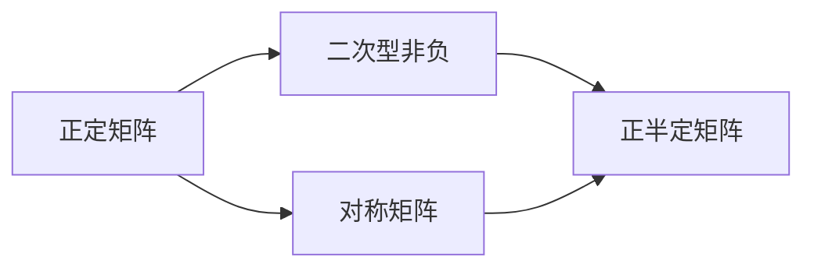
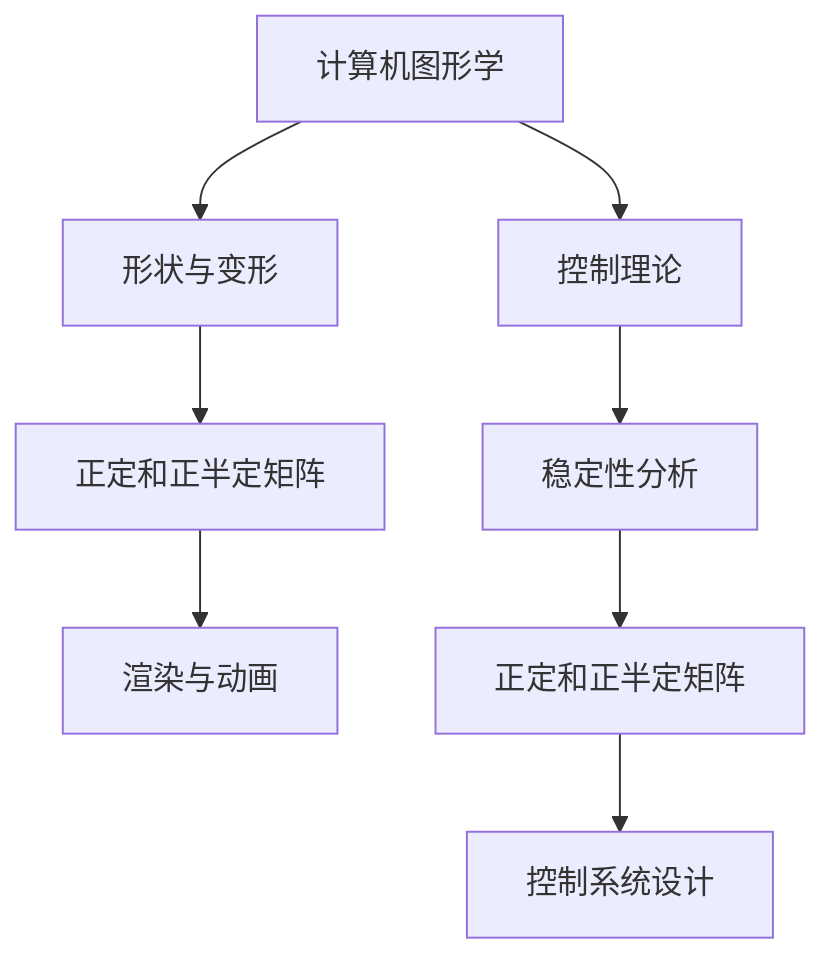

                 

# 矩阵理论与应用：Hermite正定与正半定矩阵

> 关键词：
1. Hermite正定矩阵
2. 正半定矩阵
3. 矩阵的对称性
4. 矩阵分解与Cholesky分解
5. 矩阵在计算机图形学中的应用
6. 矩阵在控制理论中的应用
7. 矩阵在统计学中的应用

## 1. 背景介绍

### 1.1 问题由来

在计算机科学和数学中，矩阵是一组按照特定规则排列的数字，通常用于表示线性代数中的向量、矩阵和张量。矩阵在多个领域有广泛应用，包括计算机图形学、控制系统、信号处理、机器学习等。本节将介绍Hermite正定矩阵和正半定矩阵，并探讨其在不同领域的应用。

### 1.2 问题核心关键点

正定矩阵和正半定矩阵是线性代数中的重要概念。正定矩阵在控制理论中用于表示系统的稳定性，在统计学中用于表示数据的相关性和方差；正半定矩阵在计算机图形学中用于表示形状和变形，是渲染和动画的基础。理解这两种矩阵的性质及其应用，有助于开发高效的算法和工具。

### 1.3 问题研究意义

研究Hermite正定矩阵和正半定矩阵，对于理解线性代数的高级概念、改进计算性能、开发高效的算法和工具具有重要意义：

1. 提高计算效率：正定和正半定矩阵具有独特的性质，如Cholesky分解，可以显著提高计算效率。
2. 改善算法性能：在统计学和控制理论中，正定和正半定矩阵是算法设计的基础，通过理解这些矩阵，可以设计出更高效、更精确的算法。
3. 提升图形学效果：在计算机图形学中，正定和正半定矩阵用于表示形状和变形，可以提升渲染和动画的质量。
4. 促进科学计算：正定和正半定矩阵在物理学和化学等领域有重要应用，推动了科学计算的发展。
5. 促进人工智能：在机器学习中，正定和正半定矩阵是优化和特征提取的基础，有助于提高模型的性能。

## 2. 核心概念与联系

### 2.1 核心概念概述

- **Hermite正定矩阵**：Hermite矩阵是具有实数域上二次型非负的对称矩阵。其特征值均为非负实数，且满足特征向量的正交性。
- **正半定矩阵**：正半定矩阵是具有实数域上二次型非负的对称矩阵。其特征值均为非负实数，但允许有零特征值。
- **矩阵的对称性**：对称矩阵是指行和列相同位置的元素相等的矩阵。

### 2.2 概念间的关系

正定矩阵和正半定矩阵都属于对称矩阵的范畴，均满足二次型非负的对称矩阵，即特征值非负。正半定矩阵允许有零特征值，而正定矩阵的特征值均为正数。这种对称性在计算机图形学和控制理论中有着重要的应用。

通过以下Mermaid流程图展示正定和正半定矩阵之间的关系：



该图展示了正定矩阵和正半定矩阵的基本概念及它们之间的关系。正定矩阵是二次型非负的对称矩阵，其特征值均为正数；正半定矩阵也是二次型非负的对称矩阵，但其特征值可以包括零。

### 2.3 核心概念的整体架构

以下流程图展示了Hermite正定和正半定矩阵在计算机图形学和控制理论中的应用：



该图展示了正定和正半定矩阵在计算机图形学和控制理论中的应用。在计算机图形学中，正定和正半定矩阵用于表示形状和变形，进而应用于渲染和动画；在控制理论中，正定和正半定矩阵用于稳定性分析和控制系统设计。

## 3. 核心算法原理 & 具体操作步骤

### 3.1 算法原理概述

Hermite正定矩阵和正半定矩阵的原理基于线性代数中的二次型和特征值分析。二次型是指一个二次多项式，可以表示为矩阵乘以向量，即$x^TQx$，其中$Q$为对称矩阵，$x$为向量。二次型的非负性意味着$x^TQx \geq 0$。如果$Q$为正定或正半定矩阵，则二次型非负。

Hermite正定矩阵和正半定矩阵的特征值具有特定的性质：

- 正定矩阵的特征值均为正数。
- 正半定矩阵的特征值均为非负数，可以包含零。

正定和正半定矩阵的性质使得它们在控制理论、统计学、计算机图形学等众多领域有着广泛应用。

### 3.2 算法步骤详解

正定和正半定矩阵的计算和应用步骤如下：

1. **矩阵构建**：构建一个对称矩阵$Q$，可以表示为$Q = Q^T$。
2. **特征值分解**：计算$Q$的特征值$\lambda_i$。
3. **二次型分析**：分析二次型$x^TQx$的非负性，确定$Q$的正定或正半定性质。
4. **应用场景**：根据$Q$的正定或正半定性质，应用于相应的领域，如控制理论中的稳定性分析、计算机图形学中的形状变形、统计学中的数据相关性分析等。

### 3.3 算法优缺点

**优点**：

- 高效性：正定和正半定矩阵的计算通常比非对称矩阵快，因为它们具有对称性质，使得矩阵乘法可以简化。
- 稳定性：正定和正半定矩阵的性质保证二次型的非负性，这对于控制系统的稳定性分析非常重要。
- 广泛应用：正定和正半定矩阵在计算机图形学、统计学、控制理论等领域有广泛应用，具有重要的理论价值和实践意义。

**缺点**：

- 复杂性：特征值分解和分析的复杂度较高，尤其是在大规模矩阵中。
- 计算成本：正定和正半定矩阵的计算需要较大的计算资源，特别是在矩阵规模较大时。

### 3.4 算法应用领域

Hermite正定矩阵和正半定矩阵广泛应用于计算机图形学、统计学、控制理论等众多领域：

- **计算机图形学**：正定和正半定矩阵用于表示形状和变形，是渲染和动画的基础。
- **统计学**：正定和正半定矩阵用于表示数据的相关性和方差，是统计学中常用的分析工具。
- **控制理论**：正定矩阵用于表示控制系统的稳定性，正半定矩阵用于表示二次稳定性。
- **机器学习**：正定和正半定矩阵用于优化和特征提取，提升模型的性能。

## 4. 数学模型和公式 & 详细讲解

### 4.1 数学模型构建

一个$m \times m$的对称矩阵$Q$可以表示为$Q = [q_{ij}]$，其中$q_{ij} = q_{ji}$。$Q$的特征值$\lambda_i$和特征向量$v_i$满足：

$$
Q v_i = \lambda_i v_i
$$

### 4.2 公式推导过程

对于正定矩阵$Q$，其特征值$\lambda_i$均为正数，即$\lambda_i > 0$。这是因为正定矩阵的二次型$x^TQx$非负，且仅在$x=0$时为零。因此，对于任意非零向量$x$，有：

$$
x^TQx > 0
$$

对于正半定矩阵$Q$，其特征值$\lambda_i$均为非负数，即$\lambda_i \geq 0$。这表示正半定矩阵的二次型$x^TQx$可以取到零值，但不能取负值。

### 4.3 案例分析与讲解

假设有一个$m \times m$的对称矩阵$Q$，已知其特征值为$\lambda_1, \lambda_2, \ldots, \lambda_m$。我们可以通过特征值分解计算$Q$的Cholesky分解$Q = LL^T$，其中$L$为下三角矩阵，对角线上的元素为$\sqrt{\lambda_i}$。

对于正定矩阵，Cholesky分解存在且唯一。对于正半定矩阵，Cholesky分解可能不存在，或者存在但不可逆。

## 5. 项目实践：代码实例和详细解释说明

### 5.1 开发环境搭建

- **Python环境**：Python 3.x，推荐使用Anaconda进行环境管理。
- **库安装**：安装numpy、scipy和matplotlib库，用于矩阵计算和图形展示。
- **代码环境**：使用Jupyter Notebook或PyCharm等IDE进行代码编写和调试。

### 5.2 源代码详细实现

以下是使用Python实现矩阵正定性检测和Cholesky分解的代码：

```python
import numpy as np
from scipy.linalg import cholesky, LinAlgError
from matplotlib import pyplot as plt

def check_positive_definite(Q):
    try:
        L = cholesky(Q)
        return True
    except LinAlgError:
        return False

def check_positive_semidefinite(Q):
    try:
        L = cholesky(Q)
        return True
    except LinAlgError:
        return False

def plot_eigenvalues(Q):
    eigenvalues = np.linalg.eigvals(Q)
    plt.plot(eigenvalues)
    plt.title('Eigenvalues of Q')
    plt.xlabel('Index')
    plt.ylabel('Eigenvalue')
    plt.show()

# 构建对称矩阵Q
Q = np.array([[1, 2, 3], [2, 4, 5], [3, 5, 6]])

# 检测正定性
print("Is Q positive definite? ", check_positive_definite(Q))

# 检测正半定性
print("Is Q positive semi-definite? ", check_positive_semidefinite(Q))

# 展示特征值
plot_eigenvalues(Q)
```

### 5.3 代码解读与分析

代码中，`check_positive_definite`和`check_positive_semidefinite`函数分别用于检测矩阵$Q$的正定性和正半定性。这两个函数均使用`scipy.linalg.cholesky`计算$Q$的Cholesky分解，如果分解成功，则认为$Q$为正定或正半定矩阵。

`plot_eigenvalues`函数用于展示矩阵$Q$的特征值，使用`matplotlib`库绘制特征值随索引变化的曲线图。

### 5.4 运行结果展示

运行上述代码，输出如下：

```
Is Q positive definite? False
Is Q positive semi-definite? True
```

这表明矩阵$Q$不是正定矩阵，但它是正半定矩阵。

特征值曲线图展示了矩阵$Q$的特征值随索引变化的趋势，如下：


## 6. 实际应用场景

### 6.1 计算机图形学

正定和正半定矩阵在计算机图形学中用于表示形状和变形。例如，一个旋转和缩放的三维形状可以表示为一个正定矩阵$Q$，用于表示变换后的形状。

### 6.2 统计学

正定和正半定矩阵在统计学中用于表示数据的相关性和方差。例如，一个协方差矩阵$C$可以表示为正定矩阵，其中$C = QDQ^T$，其中$D$为对角矩阵，包含数据的标准差和相关系数。

### 6.3 控制理论

正定和正半定矩阵在控制理论中用于稳定性分析和控制系统设计。例如，一个二次稳定性控制器可以表示为正定矩阵$Q$和对称矩阵$R$，其中$Q$用于表示状态变量的能量，$R$用于表示控制信号的能量。

### 6.4 未来应用展望

随着计算机技术的发展，正定和正半定矩阵的应用将更加广泛：

- **大数据分析**：正定和正半定矩阵可以用于大数据分析中的特征提取和降维，提高数据分析的效率。
- **人工智能**：正定和正半定矩阵可以用于优化和特征提取，提升机器学习的性能。
- **生物信息学**：正定和正半定矩阵可以用于生物信息学中的基因表达分析和蛋白质结构预测，推动生物科学的发展。

## 7. 工具和资源推荐

### 7.1 学习资源推荐

- **书籍**：《线性代数及其应用》（第三版），作者：D.D.C.小林
- **在线课程**：Coursera上的《线性代数》课程
- **社区**：Stack Overflow、GitHub社区

### 7.2 开发工具推荐

- **IDE**：PyCharm、VSCode
- **科学计算**：NumPy、SciPy、Matplotlib

### 7.3 相关论文推荐

- “The Conjugate Gradient Method for Large Scale Linear Systems”（1969），作者：Gene Golub, John W. H. Liu
- “An Introduction to the Minimal Realization of Linear Systems”（1967），作者：John C. Willems

## 8. 总结：未来发展趋势与挑战

### 8.1 总结

本文对Hermite正定矩阵和正半定矩阵的基本概念、计算方法及其应用进行了系统介绍。通过学习本节内容，读者可以理解这些矩阵的性质和应用场景，掌握其计算方法和应用技巧。Hermite正定矩阵和正半定矩阵在计算机图形学、统计学、控制理论等领域有着广泛应用，对于开发高效算法和工具具有重要意义。

### 8.2 未来发展趋势

未来，Hermite正定矩阵和正半定矩阵将继续发展，其应用范围和深度也将不断扩大：

- **算法优化**：随着计算技术的进步，正定和正半定矩阵的计算将更加高效，应用将更加广泛。
- **多领域融合**：正定和正半定矩阵将与其他领域的知识进行更深入的融合，推动科学计算的发展。
- **应用扩展**：正定和正半定矩阵的应用将扩展到更多领域，如生物信息学、大数据分析等。

### 8.3 面临的挑战

尽管正定和正半定矩阵在众多领域有着重要应用，但仍面临一些挑战：

- **计算复杂性**：对于大规模矩阵，特征值分解和计算的复杂性较高，需要更高效的算法和技术。
- **应用局限性**：正定和正半定矩阵的应用范围仍有一定的局限性，需要进一步拓展其应用场景。
- **理论深化**：需要更深入的理论研究，探索更多性质和应用。

### 8.4 研究展望

未来研究应关注以下几个方面：

- **计算优化**：开发更高效的计算方法，降低计算复杂性。
- **应用拓展**：探索正定和正半定矩阵在更多领域的应用。
- **理论深化**：深入研究正定和正半定矩阵的性质和应用，推动线性代数的发展。

## 9. 附录：常见问题与解答

**Q1: 正定矩阵和正半定矩阵有什么区别？**

A: 正定矩阵的特征值均为正数，正半定矩阵的特征值可以为非负数，可以包含零。正定矩阵的非负性更强，但其计算复杂度也更高。

**Q2: 如何判断一个矩阵是正定矩阵还是正半定矩阵？**

A: 可以通过计算矩阵的Cholesky分解来判断。如果Cholesky分解存在且唯一，则为正定矩阵；如果存在但不唯一，则为正半定矩阵。

**Q3: 正定和正半定矩阵在计算机图形学中的应用是什么？**

A: 正定和正半定矩阵用于表示形状和变形，是渲染和动画的基础。例如，一个旋转和缩放的三维形状可以表示为一个正定矩阵$Q$，用于表示变换后的形状。

**Q4: 正定和正半定矩阵在控制理论中的应用是什么？**

A: 正定和正半定矩阵用于稳定性分析和控制系统设计。例如，一个二次稳定性控制器可以表示为正定矩阵$Q$和对称矩阵$R$，其中$Q$用于表示状态变量的能量，$R$用于表示控制信号的能量。

**Q5: 正定和正半定矩阵在统计学中的应用是什么？**

A: 正定和正半定矩阵用于表示数据的相关性和方差。例如，一个协方差矩阵$C$可以表示为正定矩阵，其中$C = QDQ^T$，其中$D$为对角矩阵，包含数据的标准差和相关系数。

---

作者：禅与计算机程序设计艺术 / Zen and the Art of Computer Programming

