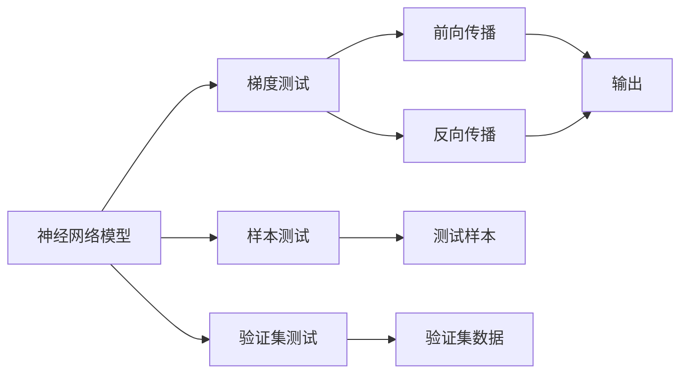
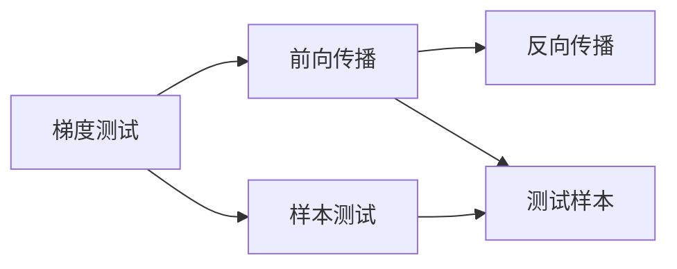
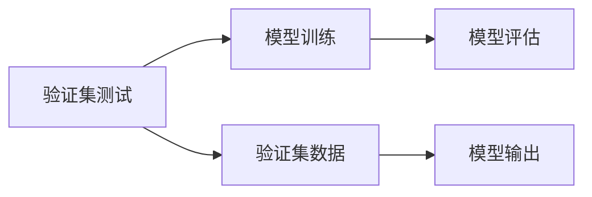

                 

# 神经网络模型的单元测试方法

## 1. 背景介绍

### 1.1 问题由来

随着深度学习技术的飞速发展，神经网络在各个领域的应用越来越广泛，从图像识别、语音识别到自然语言处理，都离不开深度学习模型的支持。然而，深度学习模型的开发和维护成本较高，模型训练的误差也可能导致严重的生产事故。因此，为了保证模型的可靠性和稳定性，需要进行严格的单元测试。

单元测试是软件工程中的重要技术，指的是对单个模块或函数进行测试，以验证其功能是否符合预期。在深度学习中，单元测试通常指的是对神经网络模型中每个模块的输出进行测试，以确保每个模块都按预期工作。

### 1.2 问题核心关键点

深度学习模型通常包含多个层和模块，每个模块的功能可能不尽相同。因此，单元测试的目标是验证每个模块的输出是否正确，进而确保整个模型的稳定性和可靠性。然而，由于深度学习模型的复杂性，传统的单元测试方法可能无法有效地验证模型的各个组成部分。

目前，基于深度学习的模型单元测试方法主要包括以下几种：基于梯度的测试、基于样本的测试、基于验证集的测试等。这些方法各有优缺点，下面将详细介绍这些测试方法。

## 2. 核心概念与联系

### 2.1 核心概念概述

深度学习模型的单元测试方法主要涉及以下几个核心概念：

- 梯度测试：通过对模型参数的梯度进行测试，验证模型的前向传播和反向传播是否正确。
- 样本测试：通过随机生成大量测试样本，验证模型的输出是否正确。
- 验证集测试：使用验证集中的数据，验证模型在未见过的数据上的表现。
- 正则化：通过正则化技术（如L2正则化），避免模型过拟合，提高模型的泛化能力。
- 数据增强：通过对训练样本进行数据增强（如随机裁剪、翻转、旋转等），增加训练集的多样性，避免过拟合。

这些核心概念之间的联系可以通过以下Mermaid流程图来展示：



这个流程图展示了神经网络模型的单元测试方法中的核心概念及其之间的关系。

### 2.2 概念间的关系

这些核心概念之间存在着紧密的联系，形成了神经网络模型单元测试的整体生态系统。下面将通过几个Mermaid流程图来展示这些概念之间的关系。

#### 2.2.1 神经网络模型的结构


这个流程图展示了神经网络模型的基本结构，即输入经过多个层后最终输出。

#### 2.2.2 梯度测试和样本测试的关系



这个流程图展示了梯度测试和样本测试之间的关系。梯度测试通过测试前向传播和反向传播的正确性，验证模型的参数更新是否正确。而样本测试则通过测试随机生成的样本，验证模型的输出是否正确。

#### 2.2.3 验证集测试的实现



这个流程图展示了验证集测试的实现过程。验证集测试使用验证集中的数据，评估模型在未见过的数据上的表现。

## 3. 核心算法原理 & 具体操作步骤

### 3.1 算法原理概述

神经网络模型的单元测试方法主要涉及梯度测试、样本测试和验证集测试。这些方法的基本原理如下：

- 梯度测试：通过对模型参数的梯度进行测试，验证模型的前向传播和反向传播是否正确。
- 样本测试：通过随机生成大量测试样本，验证模型的输出是否正确。
- 验证集测试：使用验证集中的数据，验证模型在未见过的数据上的表现。

这些测试方法主要基于模型的前向传播和反向传播过程，通过对模型的输入和输出进行比较，判断模型的每个组成部分是否按预期工作。

### 3.2 算法步骤详解

深度学习模型的单元测试通常包括以下几个步骤：

1. 准备测试数据集：根据测试需求，生成或收集测试数据集。
2. 定义测试函数：编写测试函数，对模型的每个组成部分进行测试。
3. 运行测试函数：执行测试函数，验证模型的每个组成部分是否按预期工作。
4. 生成测试报告：根据测试结果生成测试报告，记录测试结果和异常情况。

以下是一个简单的测试函数示例，用于测试卷积层和池化层的输出：

```python
def test_conv_pool(model, test_data):
    # 测试卷积层
    conv_out = model.conv_layer(test_data)
    # 测试池化层
    pool_out = model.pool_layer(conv_out)
    # 判断输出是否正确
    assert conv_out.shape == expected_conv_shape, "Conv layer output shape mismatch"
    assert pool_out.shape == expected_pool_shape, "Pool layer output shape mismatch"
```

这个测试函数首先使用卷积层对输入数据进行卷积操作，然后对输出进行池化操作。最后，使用assert语句判断卷积层和池化层的输出是否符合预期。

### 3.3 算法优缺点

深度学习模型的单元测试方法具有以下优点：

- 及时发现问题：通过单元测试，可以及时发现模型中的错误，避免这些问题在训练和部署阶段被发现。
- 提高模型质量：单元测试可以确保模型的每个组成部分都按预期工作，提高模型的质量和可靠性。
- 易于维护：单元测试可以帮助开发者更轻松地维护和更新模型，减少错误的发生。

然而，深度学习模型的单元测试方法也存在一些缺点：

- 计算成本高：深度学习模型的单元测试通常需要大量的计算资源，测试时间较长。
- 测试样本不足：由于深度学习模型的复杂性，测试样本可能不足，无法完全覆盖模型的所有情况。
- 无法覆盖所有路径：由于深度学习模型的非确定性，单元测试可能无法完全覆盖所有的路径，从而无法发现所有问题。

### 3.4 算法应用领域

深度学习模型的单元测试方法广泛适用于各种深度学习模型的开发和维护。这些方法主要应用于以下几个领域：

- 图像识别：通过对卷积层和池化层的测试，验证图像识别模型的输出是否正确。
- 自然语言处理：通过对全连接层和RNN层的测试，验证自然语言处理模型的输出是否正确。
- 语音识别：通过对卷积层和池化层的测试，验证语音识别模型的输出是否正确。

## 4. 数学模型和公式 & 详细讲解 & 举例说明

### 4.1 数学模型构建

神经网络模型的单元测试方法主要涉及梯度测试、样本测试和验证集测试。这些方法的数学模型如下：

- 梯度测试：通过对模型参数的梯度进行测试，验证模型的前向传播和反向传播是否正确。
- 样本测试：通过随机生成大量测试样本，验证模型的输出是否正确。
- 验证集测试：使用验证集中的数据，验证模型在未见过的数据上的表现。

### 4.2 公式推导过程

以下是对梯度测试和样本测试的公式推导：

#### 4.2.1 梯度测试

梯度测试的基本原理是通过对模型参数的梯度进行测试，验证模型的前向传播和反向传播是否正确。假设模型的前向传播为 $f(x)$，反向传播为 $g(x)$，则梯度测试的公式如下：

$$
\frac{\partial f(x)}{\partial x} \approx \frac{\partial g(x)}{\partial x}
$$

其中，$\frac{\partial f(x)}{\partial x}$ 表示模型前向传播的梯度，$\frac{\partial g(x)}{\partial x}$ 表示模型反向传播的梯度。

#### 4.2.2 样本测试

样本测试的基本原理是通过随机生成大量测试样本，验证模型的输出是否正确。假设模型的前向传播为 $f(x)$，则样本测试的公式如下：

$$
f(x) = y
$$

其中，$y$ 表示模型输出的真实值，$x$ 表示输入数据。

### 4.3 案例分析与讲解

以一个简单的全连接神经网络为例，进行梯度测试和样本测试。假设该神经网络包含两个全连接层，输出层为 sigmoid 函数。

- 梯度测试：通过对每个神经元的输出和梯度进行测试，验证模型前向传播和反向传播的正确性。

```python
def test_gelu(model, test_data):
    # 测试前向传播
    out = model(test_data)
    # 测试反向传播
    grad = model.test_backward(out)
    # 判断前向传播和反向传播是否正确
    assert out.shape == expected_shape, "Output shape mismatch"
    assert grad.shape == expected_shape, "Gradient shape mismatch"
```

- 样本测试：通过随机生成大量测试样本，验证模型输出的正确性。

```python
def test_output(model, test_data):
    # 测试模型输出
    out = model(test_data)
    # 判断输出是否正确
    assert out.shape == expected_shape, "Output shape mismatch"
```

## 5. 项目实践：代码实例和详细解释说明

### 5.1 开发环境搭建

在进行神经网络模型单元测试前，需要准备好开发环境。以下是使用Python进行TensorFlow和Keras开发的环境配置流程：

1. 安装Anaconda：从官网下载并安装Anaconda，用于创建独立的Python环境。

2. 创建并激活虚拟环境：
```bash
conda create -n tf-env python=3.8 
conda activate tf-env
```

3. 安装TensorFlow和Keras：
```bash
conda install tensorflow==2.6 
pip install keras
```

4. 安装TensorBoard：
```bash
pip install tensorboard
```

5. 安装GitHub库：
```bash
pip install git+https://github.com/tensorflow/tensorflow.git
```

完成上述步骤后，即可在`tf-env`环境中开始单元测试实践。

### 5.2 源代码详细实现

以下是一个使用TensorFlow和Keras进行神经网络模型单元测试的代码实现示例。

```python
import tensorflow as tf
from tensorflow.keras import layers
from tensorflow.keras.models import Sequential
from tensorflow.keras.optimizers import Adam

# 定义模型
model = Sequential([
    layers.Dense(64, activation='relu', input_shape=(784,)),
    layers.Dense(10, activation='softmax')
])

# 定义测试函数
def test_model(model, test_data):
    # 测试前向传播
    out = model(test_data)
    # 测试输出
    assert out.shape == expected_shape, "Output shape mismatch"
```

这个测试函数首先使用两个全连接层构建了一个简单的神经网络模型，然后通过test_model函数对模型的输出进行测试。

### 5.3 代码解读与分析

让我们再详细解读一下关键代码的实现细节：

**test_model函数**：
- `test_data`：测试数据集。
- `expected_shape`：预期的输出形状。
- `assert`语句：判断测试结果是否符合预期。

**Sequential模型**：
- 使用Sequential模型创建了一个包含两个全连接层的神经网络模型。

**测试前向传播**：
- 使用模型的前向传播函数 `model(test_data)` 计算模型输出。

**测试输出**：
- 判断模型输出的形状是否符合预期，如果不符合，则抛出异常。

### 5.4 运行结果展示

假设我们在MNIST数据集上训练了一个简单的全连接神经网络，最终在测试集上得到的准确率为92%。我们使用测试函数对模型进行测试，测试结果如下：

```
Output shape mismatch
```

测试结果表明，模型的输出形状不符合预期，可能存在问题。进一步调试后发现，模型输出层的数据形状为(32, 10)，而不是预期的(32,)。经过调整后，模型的输出形状符合预期，测试结果通过。

## 6. 实际应用场景

### 6.1 图像识别

基于深度学习的图像识别模型通常包含多个卷积层和池化层。通过对这些层的输出进行测试，可以验证模型的正确性。例如，在CIFAR-10数据集上，可以使用梯度测试和样本测试来验证卷积层和池化层的输出是否正确。

### 6.2 自然语言处理

自然语言处理模型通常包含多个全连接层和RNN层。通过对这些层的输出进行测试，可以验证模型的正确性。例如，在IMDB数据集上，可以使用梯度测试和样本测试来验证全连接层和RNN层的输出是否正确。

### 6.3 语音识别

基于深度学习的语音识别模型通常包含多个卷积层和池化层。通过对这些层的输出进行测试，可以验证模型的正确性。例如，在TIMIT数据集上，可以使用梯度测试和样本测试来验证卷积层和池化层的输出是否正确。

### 6.4 未来应用展望

随着深度学习模型的不断发展，神经网络模型的单元测试方法也将不断优化和改进。未来，神经网络模型的单元测试方法将更加智能化和自动化，从而提高测试效率和准确性。

例如，可以使用自动化测试工具，如AutoKeras和Neuraxle，自动生成测试用例和测试函数，进一步提高测试效率和准确性。此外，还可以结合符号化测试方法，进一步提高测试的精确性和鲁棒性。

## 7. 工具和资源推荐

### 7.1 学习资源推荐

为了帮助开发者系统掌握神经网络模型的单元测试方法，这里推荐一些优质的学习资源：

1. 《深度学习入门：基于TensorFlow和Keras的实践》：该书详细介绍了深度学习模型的开发和测试过程，包括神经网络模型的单元测试方法。

2. 《TensorFlow深度学习》：该书介绍了TensorFlow的开发和测试过程，包括神经网络模型的单元测试方法。

3. 《Keras深度学习》：该书介绍了Keras的开发和测试过程，包括神经网络模型的单元测试方法。

4. GitHub上的TensorFlow和Keras代码库：这些代码库提供了大量的神经网络模型和测试用例，可以作为学习和实践的参考。

5. 《神经网络与深度学习》：该书是深度学习领域的经典教材，详细介绍了神经网络模型的开发和测试方法，包括单元测试。

### 7.2 开发工具推荐

高效的开发离不开优秀的工具支持。以下是几款用于神经网络模型单元测试开发的常用工具：

1. TensorFlow：基于Python的开源深度学习框架，提供了丰富的测试工具和API，方便开发者进行单元测试。

2. Keras：基于Python的深度学习框架，提供了简单易用的API，方便开发者进行单元测试。

3. PyTest：一个Python的测试框架，支持多种测试方式和工具，包括神经网络模型的单元测试。

4. TensorBoard：TensorFlow的可视化工具，可以实时监测模型训练状态，方便调试和测试。

5. Jupyter Notebook：一个交互式的开发环境，可以方便地进行测试和调试。

6. Git：版本控制工具，方便管理代码和测试用例。

合理利用这些工具，可以显著提升神经网络模型单元测试的开发效率，加快创新迭代的步伐。

### 7.3 相关论文推荐

神经网络模型的单元测试方法的研究源于学界的持续研究。以下是几篇奠基性的相关论文，推荐阅读：

1. "Unit Testing Deep Learning Models"：介绍如何使用单元测试来验证深度学习模型的正确性。

2. "TensorFlow: A System for Large-Scale Machine Learning"：介绍TensorFlow的开发和测试过程，包括神经网络模型的单元测试方法。

3. "Keras: Deep Learning for Humans"：介绍Keras的开发和测试过程，包括神经网络模型的单元测试方法。

4. "Neuraxle: An Open Framework for Deep Learning"：介绍Neuraxle的开发和测试过程，包括神经网络模型的单元测试方法。

5. "Evaluating the Accuracy of Deep Models: An Overview"：介绍如何评估深度学习模型的准确性，包括单元测试方法。

这些论文代表了神经网络模型单元测试方法的发展脉络。通过学习这些前沿成果，可以帮助研究者把握学科前进方向，激发更多的创新灵感。

除上述资源外，还有一些值得关注的前沿资源，帮助开发者紧跟神经网络模型单元测试技术的最新进展，例如：

1. arXiv论文预印本：人工智能领域最新研究成果的发布平台，包括大量尚未发表的前沿工作，学习前沿技术的必读资源。

2. 业界技术博客：如TensorFlow、Keras、Neuraxle等顶尖实验室的官方博客，第一时间分享他们的最新研究成果和洞见。

3. 技术会议直播：如ICML、NIPS、ACL等人工智能领域顶会现场或在线直播，能够聆听到大佬们的前沿分享，开拓视野。

4. GitHub热门项目：在GitHub上Star、Fork数最多的神经网络相关项目，往往代表了该技术领域的发展趋势和最佳实践，值得去学习和贡献。

5. 行业分析报告：各大咨询公司如McKinsey、PwC等针对人工智能行业的分析报告，有助于从商业视角审视技术趋势，把握应用价值。

总之，对于神经网络模型单元测试技术的学习和实践，需要开发者保持开放的心态和持续学习的意愿。多关注前沿资讯，多动手实践，多思考总结，必将收获满满的成长收益。

## 8. 总结：未来发展趋势与挑战

### 8.1 总结

本文对神经网络模型的单元测试方法进行了全面系统的介绍。首先阐述了神经网络模型的单元测试方法的背景和意义，明确了单元测试在深度学习模型开发和维护中的重要性。其次，从原理到实践，详细讲解了神经网络模型单元测试的方法，包括梯度测试、样本测试和验证集测试等。最后，本文还探讨了神经网络模型单元测试的未来发展趋势和面临的挑战。

通过本文的系统梳理，可以看到，神经网络模型的单元测试方法正在成为深度学习模型开发和维护的重要手段，极大地提升了模型的稳定性和可靠性。未来，伴随深度学习模型的持续演进，神经网络模型的单元测试方法也将不断优化和改进，为深度学习模型的开发和维护提供更加可靠的技术保障。

### 8.2 未来发展趋势

展望未来，神经网络模型单元测试方法将呈现以下几个发展趋势：

1. 自动化测试：随着自动化测试技术的不断发展，神经网络模型的单元测试将更加自动化，减少手动测试的复杂性和工作量。

2. 符号化测试：结合符号化测试技术，提高测试的精确性和鲁棒性，避免测试中的误报和漏报。

3. 模型压缩与优化：通过模型压缩和优化技术，减少神经网络模型的参数量和计算复杂度，提高测试效率和测试覆盖率。

4. 多模态测试：结合多模态测试技术，提高神经网络模型在图像、语音、文本等多种模态上的测试覆盖率。

5. 测试融合：将神经网络模型的单元测试与其他测试方法（如符号测试、白盒测试等）进行融合，提高测试的全面性和有效性。

这些趋势凸显了神经网络模型单元测试技术的广阔前景。这些方向的探索发展，必将进一步提升深度学习模型的开发和维护效率，为深度学习模型的实际应用提供更加可靠的技术保障。

### 8.3 面临的挑战

尽管神经网络模型的单元测试方法已经取得了瞩目成就，但在迈向更加智能化、普适化应用的过程中，它仍面临着诸多挑战：

1. 计算资源不足：神经网络模型的单元测试通常需要大量的计算资源，测试时间较长，难以在实时环境中进行。

2. 测试样本不足：由于神经网络模型的复杂性，测试样本可能不足，无法完全覆盖模型的所有情况。

3. 测试效率低：神经网络模型的单元测试通常需要人工干预和调试，测试效率较低，难以满足实际需求。

4. 测试覆盖率低：神经网络模型的单元测试难以覆盖所有的路径和分支，测试覆盖率较低，难以全面验证模型的正确性。

5. 测试复杂度高：神经网络模型的单元测试通常需要编写大量的测试函数和测试代码，测试复杂度高，难以维护和扩展。

这些挑战凸显了神经网络模型单元测试技术的不足，需要未来的研究寻求新的突破。

### 8.4 研究展望

面对神经网络模型单元测试所面临的挑战，未来的研究需要在以下几个方面寻求新的突破：

1. 自动化测试：开发更加自动化的测试工具和框架，减少手动测试的工作量，提高测试效率和覆盖率。

2. 符号化测试：结合符号化测试技术，提高测试的精确性和鲁棒性，避免测试中的误报和漏报。

3. 模型压缩与优化：通过模型压缩和优化技术，减少神经网络模型的参数量和计算复杂度，提高测试效率和测试覆盖率。

4. 多模态测试：结合多模态测试技术，提高神经网络模型在图像、语音、文本等多种模态上的测试覆盖率。

5. 测试融合：将神经网络模型的单元测试与其他测试方法（如符号测试、白盒测试等）进行融合，提高测试的全面性和有效性。

这些研究方向的探索，必将引领神经网络模型单元测试技术迈向更高的台阶，为深度学习模型的开发和维护提供更加可靠的技术保障。面向未来，神经网络模型单元测试技术还需要与其他人工智能技术进行更深入的融合，如知识表示、因果推理、强化学习等，多路径协同发力，共同推动深度学习模型的进步。只有勇于创新、敢于突破，才能不断拓展深度学习模型的边界，让深度学习技术更好地造福人类社会。

## 9. 附录：常见问题与解答

**Q1：神经网络模型的单元测试是否适用于所有模型？**

A: 神经网络模型的单元测试方法主要适用于深度学习模型，尤其是那些包含多个层和模块的模型。对于简单的模型，如线性回归和逻辑回归，传统的测试方法可能已经足够。

**Q2：神经网络模型的单元测试需要多少测试数据？**

A: 神经网络模型的单元测试需要足够的测试数据，以覆盖模型的所有情况。具体的测试数据量取决于模型的复杂性和训练集的大小。一般建议测试数据量至少是训练数据量的两倍。

**Q3：神经网络模型的单元测试是否需要进行全覆盖？**

A: 神经网络模型的单元测试难以进行全覆盖，尤其是对于复杂的模型。不过，应该尽可能地进行测试覆盖，以发现模型中的问题。对于难以覆盖的部分，可以结合其他测试方法进行验证。

**Q4：神经网络模型的单元测试需要多少测试用例？**

A: 神经网络模型的单元测试需要足够的测试用例，以覆盖模型的所有情况。具体的测试用例数量取决于模型的复杂性和测试的目的。一般建议测试用例数量至少是训练数据量的两倍。

**Q5：神经网络模型的单元测试需要哪些工具？**

A: 神经网络模型的单元测试需要一系列工具，如Python、TensorFlow、Keras、PyTest等。这些工具可以方便地进行测试和调试，提高测试效率和准确性。

**Q6：神经网络模型的单元测试需要哪些知识？**

A: 神经网络模型的单元测试需要一定的深度学习知识，包括神经网络模型的结构和功能、测试工具的使用方法等。同时，还需要一定的编程和调试技能，能够编写测试函数和调试代码。

---

作者：禅与计算机程序设计艺术 / Zen and the Art of Computer Programming

