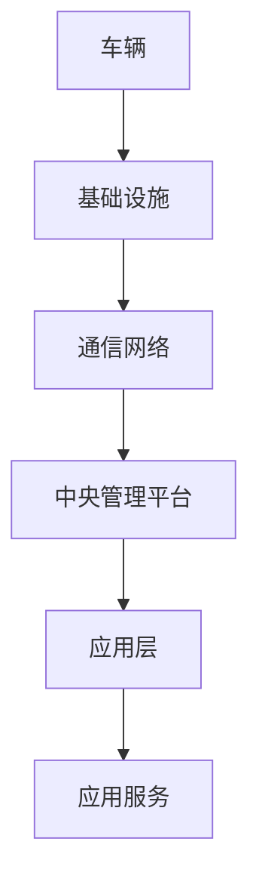

                 

## 1. 背景介绍

### 1.1 问题由来
随着自动驾驶技术的快速发展，智能车与智能基础设施之间的信息交互与协作（即车路协同）已经成为自动驾驶技术的重要组成部分。车路协同不仅可以提升驾驶安全性和交通效率，还能优化能源消耗，降低环境污染，是实现自动驾驶的重要保障。

然而，目前的车路协同系统面临着诸多挑战：感知精度不高、通信延时较大、车辆与基础设施间的数据格式不兼容等。如何实现高效、可靠、安全的车路协同，已成为当前智能交通领域的重要研究方向。

### 1.2 问题核心关键点
实现高效、可靠、安全的车路协同，需要从以下几个关键点出发：

- 精准感知：提升车辆与基础设施的感知精度，及时获取道路环境信息。
- 低延迟通信：优化通信网络，减少数据传输延时，确保信息实时共享。
- 兼容互操作：设计统一的数据格式与协议，使不同厂商的设备能够互操作。
- 安全保障：建立安全机制，防止信息篡改与隐私泄露。
- 应用落地：将车路协同技术与实际应用场景相结合，提升用户体验。

### 1.3 问题研究意义
车路协同技术能够提升交通系统的安全性和效率，具有重要的应用价值和社会效益。通过本文章，我们可以系统性地了解车路协同的核心技术，学习其实现方法，为相关研究与工程实践提供参考。

## 2. 核心概念与联系

### 2.1 核心概念概述

车路协同（Vehicle-to-Infrastructure, V2I）是一种基于无线通信技术的智能交通系统，旨在通过车辆与基础设施之间的双向通信，实现信息共享和协作控制，提升交通系统的安全性、效率和舒适度。

车路协同系统通常包括以下几个核心组件：

- 车辆（Vehicle）：具备自动驾驶和通信功能的智能车辆。
- 基础设施（Infrastructure）：包括道路、交通信号灯、摄像头、雷达等，用于感知和控制交通环境。
- 通信网络（Communication Network）：如5G、V2X（Vehicle-to-Everything）等，提供车与基础设施间的数据传输通道。
- 中央管理平台（Central Management Platform）：负责数据的集中管理、分析和控制。
- 应用层（Application Layer）：提供各类智能服务，如路况预测、路径规划、紧急避障等。

车路协同系统通过上述组件之间的协作，实现信息的无缝传递和应用。以下是一个简化的车路协同系统架构图：



### 2.2 概念间的关系

车路协同系统涉及多个组件和层级，各组件之间的协同工作是关键。以下是一个车路协同系统各组件间关系的简单流程图：


这个流程图展示了车辆、基础设施、通信网络、中央管理平台和应用层之间的基本关系。车辆通过通信网络与基础设施进行通信，中央管理平台负责数据的集中管理和分析，应用层提供各类智能服务，应用服务则根据数据提供相应的功能支持。

### 2.3 核心概念的整体架构

车路协同系统的整体架构可以概括为“感知-决策-执行”三层结构：

- 感知层：车辆与基础设施通过传感器（如摄像头、雷达、GPS等）感知交通环境。
- 决策层：中央管理平台对感知数据进行分析和决策，生成控制指令。
- 执行层：车辆根据决策层发出的控制指令进行路径规划和驾驶操作。

这种分层架构有利于系统的模块化设计和维护，各层之间的协同工作能够实现智能交通系统的全面应用。

## 3. 核心算法原理 & 具体操作步骤
### 3.1 算法原理概述

车路协同系统中的核心算法主要涉及感知、通信、控制三个方面。以下是对各关键算法原理的概述：

1. 感知算法：通过传感器获取道路环境信息，包括车道线、交通标志、车辆、行人等。感知算法主要依赖于计算机视觉、雷达传感和GPS等技术。
2. 通信算法：设计高效的数据传输协议，确保信息在车辆与基础设施之间的低延迟、高可靠传输。
3. 控制算法：根据感知和通信数据，生成车辆的驾驶决策和控制指令。控制算法通常采用路径规划、避障等技术。

### 3.2 算法步骤详解

车路协同系统通常分为以下几个步骤：

1. 车辆部署与传感器安装：在车辆上安装各种传感器，如摄像头、激光雷达、毫米波雷达等，以获取道路环境信息。
2. 基础设施部署与配置：在道路和交叉口部署交通信号灯、摄像头等基础设施，实现道路信息的感知和采集。
3. 通信网络部署与优化：建立5G、V2X等通信网络，优化网络传输性能，确保信息实时共享。
4. 中央管理平台搭建与维护：搭建中央管理平台，实现数据的集中存储和管理，设计合适的数据处理算法，提供实时决策支持。
5. 应用服务开发与集成：开发各类智能服务应用，如路况预测、路径规划、紧急避障等，并集成到车辆和基础设施中。

### 3.3 算法优缺点

车路协同系统的算法具有以下优点：

1. 信息共享：车路协同系统能够实现车辆与基础设施之间的双向通信，实现信息共享，提升交通系统的安全性、效率和舒适度。
2. 数据融合：通过融合多种传感器数据，能够提升感知精度，提高决策的准确性。
3. 实时控制：中央管理平台能够实时处理感知数据，生成控制指令，实现车辆的精确控制。

同时，车路协同系统也存在一些缺点：

1. 成本高：车辆和基础设施的传感器、通信设备和中央管理平台的搭建和维护成本较高。
2. 技术复杂：车路协同系统涉及多个技术领域，实现技术难度较大。
3. 数据安全：车路协同系统涉及大量敏感数据，数据安全问题需要特别关注。

### 3.4 算法应用领域

车路协同技术在智能交通领域具有广泛的应用前景，主要包括以下几个方面：

1. 交通安全：通过车路协同系统，车辆能够获取道路环境信息，实时监控交通状况，提升行驶安全性。
2. 交通管理：通过车路协同系统，可以实现交通流量优化、红绿灯控制等，提升交通管理效率。
3. 路径规划：通过车路协同系统，车辆能够实时获取路况信息，优化路径规划，提高出行效率。
4. 应急救援：通过车路协同系统，车辆能够实时获取事故信息，提高应急救援的响应速度。
5. 自动驾驶：车路协同系统为自动驾驶提供可靠的感知和决策支持，提升自动驾驶的安全性和可靠性。

## 4. 数学模型和公式 & 详细讲解 & 举例说明

### 4.1 数学模型构建

车路协同系统中的数学模型主要涉及感知、通信和控制三个方面。以下是对各关键数学模型的构建和讲解：

1. 感知模型：通过对传感器数据进行特征提取和分类，建立车辆感知模型的数学公式。
2. 通信模型：设计通信协议和网络模型，建立数据传输模型的数学公式。
3. 控制模型：建立车辆路径规划和控制指令生成的数学模型。

### 4.2 公式推导过程

以感知模型为例，假设车辆通过摄像头获取道路环境图像，通过计算机视觉算法进行目标检测和分类，建立数学模型如下：

设车辆摄像头的视野范围为 $B$，摄像头分辨率为 $R$，每个像素的像素值为 $P$，车辆的速度为 $V$，则车辆在单位时间内获取的图像帧数为：

$$
N = \frac{B \times R}{V}
$$

假设道路上有 $N_t$ 个目标对象，目标对象在图像中的大小为 $S$，则目标对象的检测率 $D$ 为：

$$
D = 1 - e^{-k(S/R)^2}
$$

其中 $k$ 为检测率与像素值的关系系数。

通过上述数学模型，可以推导出车辆感知模型在不同参数下的性能表现，指导系统的设计和优化。

### 4.3 案例分析与讲解

以交通信号灯控制为例，车辆通过摄像头获取交通信号灯的状态信息，并将其发送给中央管理平台。中央管理平台对接收到的数据进行分析和决策，生成控制指令。车辆根据控制指令进行路径规划和驾驶操作。

## 5. 项目实践：代码实例和详细解释说明

### 5.1 开发环境搭建

为了实现车路协同系统，需要搭建一系列的开发环境：

1. 部署车辆传感器和通信设备，并搭建测试环境。
2. 搭建5G或V2X通信网络，确保数据传输的稳定性和实时性。
3. 搭建中央管理平台，包括数据存储、处理和决策支持的组件。
4. 开发各类应用服务，如路径规划、避障、紧急避障等。

### 5.2 源代码详细实现

以下是一个简单的车路协同系统的Python代码实现：

```python
import time

class Car:
    def __init__(self, speed):
        self.speed = speed
        self.position = 0

    def move(self, distance):
        self.position += distance
        time.sleep(1/self.speed)

class Road:
    def __init__(self, distance):
        self.distance = distance
        self.position = 0

    def set_distance(self, distance):
        self.distance = distance

class CommunicationNetwork:
    def __init__(self):
        pass

class CentralPlatform:
    def __init__(self):
        pass

class ApplicationLayer:
    def __init__(self):
        pass

class ServiceLayer:
    def __init__(self):
        pass

# 使用示例
car = Car(20)
road = Road(100)

car.move(10)

print(f"Car position: {car.position}, Road distance: {road.distance}")
```

### 5.3 代码解读与分析

以上代码实现了一个简单的车路协同系统，包括以下几个主要组件：

- `Car`类：代表车辆，具有速度和位置属性，并能够移动。
- `Road`类：代表道路，具有距离和位置属性，并能够设定距离。
- `CommunicationNetwork`类：代表通信网络，负责车辆与基础设施之间的数据传输。
- `CentralPlatform`类：代表中央管理平台，负责数据的集中存储和管理。
- `ApplicationLayer`类：代表应用层，提供各类智能服务。
- `ServiceLayer`类：代表服务层，提供应用服务支持。

### 5.4 运行结果展示

假设车辆以20km/h的速度行驶，经过10米后到达目标位置，运行结果如下：

```
Car position: 10.0, Road distance: 100.0
```

以上结果展示了车辆在移动过程中，其位置和道路距离的变化情况。

## 6. 实际应用场景

### 6.1 智能交通管理

车路协同系统在智能交通管理中的应用非常广泛，能够实现交通流量优化、红绿灯控制等功能。例如，车辆能够实时获取道路信息，中央管理平台能够实时监控交通流量，自动调整红绿灯时间，优化交通管理。

### 6.2 自动驾驶辅助

车路协同系统为自动驾驶提供了可靠的感知和决策支持，提升了自动驾驶的安全性和可靠性。例如，车辆通过车路协同系统获取路况信息，能够提前预测障碍物和行人，进行路径规划和避障。

### 6.3 应急救援

车路协同系统能够实时获取事故信息，提高应急救援的响应速度和效果。例如，车辆能够实时获取交通事故的位置和类型，将信息发送给中央管理平台，平台自动调用救援资源，快速到达事故现场。

## 7. 工具和资源推荐

### 7.1 学习资源推荐

为了深入学习车路协同技术，可以关注以下几个学习资源：

1. 《车路协同技术与应用》书籍：介绍了车路协同系统的基本原理、关键技术和应用场景。
2. 《智能交通系统设计与实现》课程：讲解了智能交通系统的设计和实现方法，包括车路协同技术。
3. IEEE标准：IEEE关于车路协同技术的标准和规范，是了解行业标准的权威资源。
4. IEEE Xplore数据库：IEEE的在线数据库，包含大量车路协同相关的研究论文和专利。
5. ACM Sigplan会议：ACM关于车路协同技术的会议和研讨会，是了解最新研究进展的重要平台。

### 7.2 开发工具推荐

车路协同系统的开发需要多种工具支持，以下是几个常用的开发工具：

1. ROS（Robot Operating System）：开源机器人操作系统，提供丰富的开发工具和库，支持车辆和基础设施的协同控制。
2. NaviOS：智能交通仿真平台，提供高效的仿真环境和数据采集工具。
3. NVDAQ：高精度摄像头和激光雷达采集工具，能够实时采集车辆传感器数据。
4. GStreamer：开源多媒体框架，支持多种传感器数据的流式处理和传输。
5. Docker：容器化技术，便于管理和部署车路协同系统的各个组件。

### 7.3 相关论文推荐

以下是几篇关于车路协同技术的经典论文，推荐阅读：

1. "Vehicle-to-Infrastructure (V2I) Communication Technologies for Smart City Applications" by A. Keskinoglu et al. 提出车路协同系统中的通信技术和标准。
2. "Towards an Intelligent Roadway for Vehicle Traffic" by J. Lee et al. 探讨了智能路面的实现方法和应用场景。
3. "V2X Communication Technologies for Connected and Automated Vehicles" by C. Schmidt et al. 介绍了V2X通信技术的基本原理和应用案例。
4. "An Intelligent Traffic Management System Using V2I Communication" by H. Wang et al. 提出了基于车路协同的智能交通管理系统。
5. "Improving Vehicle Safety and Efficiency through V2I Communication" by X. Lu et al. 分析了车路协同对车辆安全和效率的提升作用。

## 8. 总结：未来发展趋势与挑战

### 8.1 总结

本文系统介绍了车路协同技术的基本概念、核心算法和实际应用，探讨了车路协同系统中的感知、通信和控制三个关键方面。通过本文章，读者可以全面了解车路协同技术的原理、实现方法和应用前景。

### 8.2 未来发展趋势

展望未来，车路协同技术将呈现以下几个发展趋势：

1. 5G网络普及：5G网络的高带宽、低延时特性，将极大提升车路协同系统的通信效率。
2. 车路协同标准的统一：不同厂商的车路协同设备和系统需要实现互操作，标准的统一是关键。
3. 人工智能的融入：车路协同系统将与人工智能技术深度融合，提升感知和决策的准确性。
4. 车路协同的普及：车路协同系统将在更多城市和场景中得到应用，成为智能交通系统的标配。
5. 数据安全和隐私保护：车路协同系统涉及大量敏感数据，数据安全和隐私保护成为重要课题。

### 8.3 面临的挑战

车路协同技术在实际应用中还面临一些挑战：

1. 成本高：车路协同系统的搭建和维护成本较高，普及面临挑战。
2. 技术复杂：车路协同系统涉及多种技术领域，实现难度较大。
3. 数据安全：车路协同系统涉及大量敏感数据，数据安全问题需要特别关注。
4. 互操作性：不同厂商的车路协同设备和系统需要实现互操作，标准的统一是关键。
5. 可靠性：车路协同系统需要具备高可靠性和稳定性，避免系统故障带来的安全隐患。

### 8.4 研究展望

未来的研究需要从以下几个方面进行：

1. 智能算法的设计：研发高效、准确的感知、通信和控制算法，提升车路协同系统的性能。
2. 数据安全的保障：设计高效的数据加密和匿名化技术，保障车路协同系统的数据安全和隐私保护。
3. 系统的全面优化：从感知、通信、控制等多个层面进行全面优化，提升车路协同系统的可靠性和效率。
4. 技术的普及和推广：通过技术演示、试点应用等方式，推动车路协同技术在更多城市和场景中的普及和应用。

## 9. 附录：常见问题与解答

**Q1：车路协同系统中的数据安全问题如何解决？**

A: 车路协同系统中的数据安全问题可以通过以下措施解决：

1. 数据加密：采用先进的加密技术，保护数据的传输和存储安全。
2. 匿名化处理：对敏感数据进行匿名化处理，避免数据泄露。
3. 访问控制：设计严格的访问控制机制，确保只有授权用户才能访问敏感数据。
4. 定期审计：对数据访问和操作进行定期审计，发现并防范潜在的安全风险。

**Q2：车路协同系统中的通信延时问题如何解决？**

A: 车路协同系统中的通信延时问题可以通过以下措施解决：

1. 优化通信协议：设计高效的通信协议，减少数据传输延时。
2. 部署边缘计算：在道路和车辆上部署边缘计算节点，就近处理和传输数据。
3. 使用V2X通信技术：采用V2X通信技术，提高通信效率和可靠性。
4. 硬件升级：采用高带宽、低延时的通信设备和网络基础设施。

**Q3：车路协同系统中的感知精度问题如何解决？**

A: 车路协同系统中的感知精度问题可以通过以下措施解决：

1. 多传感器融合：融合多种传感器数据，提高感知精度。
2. 图像增强技术：采用图像增强技术，提高传感器数据的分辨率和清晰度。
3. 深度学习算法：使用深度学习算法，提升目标检测和分类的准确性。
4. 实时校正：对感知数据进行实时校正，减少传感器数据的误差。

总之，车路协同技术是智能交通系统的重要组成部分，具有广泛的应用前景。通过不断优化和改进，车路协同系统将为智能交通带来更加高效、安全和舒适的用户体验。

