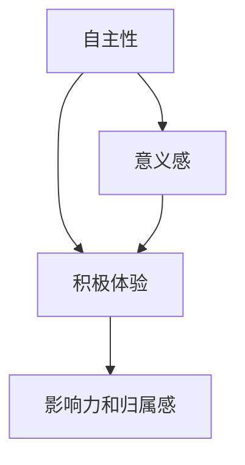

                 

## 1. 背景介绍

在信息技术和互联网迅猛发展的今天，组织的管理模式和企业文化面临着前所未有的挑战和变革。传统的等级制、任务驱动型管理模式已经难以满足现代复杂多变的组织环境。如何在快速变化的市场中保持竞争力和可持续发展，成为每个组织必须直面的问题。

本文旨在探讨一种全新的管理哲学——激发人性的善意和潜能，通过构建和谐的人际关系和高度自我驱动的组织文化，实现员工自我激励和高效协作。我们将基于此哲学，提出一套全面的管理策略和方法论，希望能为未来的组织管理提供新的思路和方向。

## 2. 核心概念与联系

### 2.1 核心概念概述

本节将详细介绍几个与激发人性的善意和潜能相关的核心概念：

- **自主性(Autonomy)**：指员工在工作中能够自主决策和承担责任，不被外界干扰。
- **意义感(Sense of Purpose)**：指员工在工作中能够感受到其工作对组织和社会的意义和价值。
- **积极体验(Positive Experience)**：指员工在工作中体验到的愉悦和满足感，包括成就感、认可感和归属感等。
- **影响力和归属感(Locus of Control and Belonging)**：指员工在工作中感受到的控制权和组织归属感，即员工是否觉得自己能够影响组织的决策和未来。

这些概念相互关联，共同构成了激发人性善意和潜能的基础。以下是一个简单的Mermaid流程图，展示了这些概念之间的联系：



### 2.2 概念间的关系

通过这张流程图可以看出，自主性是激发人性善意和潜能的起点，员工只有在感受到自主性和意义感时，才会产生积极体验，并进一步产生强烈的归属感和影响力。反之，积极体验和归属感又会进一步增强员工的工作满意度和自主性，形成良性循环。

## 3. 核心算法原理 & 具体操作步骤

### 3.1 算法原理概述

基于激发人性的善意和潜能的管理哲学，我们提出了一套管理算法，旨在通过以下步骤，实现员工自我激励和组织绩效提升：

1. **自主性赋予**：通过设计合适的任务和流程，赋予员工更多的自主决策权。
2. **意义感创造**：通过明确组织目标和员工个人目标的关联，让员工感受到其工作对组织的意义。
3. **积极体验营造**：通过构建积极的工作环境和文化，让员工在工作中体验到愉悦和满足感。
4. **影响力和归属感强化**：通过领导者的正向激励和组织内部的透明沟通，增强员工的控制感和归属感。

这些步骤共同作用，形成一个闭环的管理系统，以实现员工自我激励和组织绩效的提升。

### 3.2 算法步骤详解

**Step 1: 自主性赋予**

自主性赋予的核心在于赋予员工更多的决策权和责任。具体操作如下：

- **任务设计**：将复杂任务拆分为可控子任务，赋予员工一定的自主决策权。
- **流程优化**：简化工作流程，减少不必要的审批环节，使员工能够更灵活地完成任务。
- **责任授权**：明确员工的职责和权限，确保其对工作的全权负责。

**Step 2: 意义感创造**

意义感创造的目的是让员工感受到其工作对组织的价值。具体操作如下：

- **目标对齐**：将组织的长期目标和员工的工作任务对齐，让员工明确其工作的长远意义。
- **价值观传递**：通过组织的文化和价值观，传递组织的使命和愿景，让员工认同和践行组织的理念。
- **贡献认可**：对员工的贡献给予及时的认可和奖励，增强其对工作的自豪感和归属感。

**Step 3: 积极体验营造**

积极体验营造的核心在于构建一个愉悦和满足感的工作环境。具体操作如下：

- **环境优化**：改善工作环境和设施，提供舒适的工作空间和工具。
- **团队建设**：通过团队合作和交流，增强员工之间的信任和协作。
- **个人发展**：提供职业发展和培训机会，帮助员工实现个人职业目标。

**Step 4: 影响力和归属感强化**

影响力和归属感强化的目的是增强员工的控制感和归属感。具体操作如下：

- **透明度提升**：增强组织决策的透明度，让员工了解组织的决策过程和背景。
- **反馈机制**：建立有效的反馈机制，使员工能够及时了解其工作的评价和改进方向。
- **参与决策**：通过参与组织的决策讨论，增强员工的影响力和归属感。

### 3.3 算法优缺点

**优点**：

- **提升员工满意度**：通过赋予自主性、创造意义感、营造积极体验和强化影响力和归属感，员工的工作满意度和幸福感得到显著提升。
- **提升组织绩效**：员工自主性、积极体验和归属感的增强，使得员工的工作效率和创新能力得到提升，从而提升组织绩效。
- **增强组织凝聚力**：员工通过共享目标和价值观，增强了对组织的认同感和归属感，从而提升了组织的凝聚力。

**缺点**：

- **实施难度大**：赋予员工自主性和意义感、营造积极体验和强化归属感，需要在组织文化和管理模式上进行深层次变革，实施难度较大。
- **管理成本高**：提供更多的自主性和积极体验，可能导致管理成本上升，如员工培训、环境改善等。
- **适应性问题**：不同的组织和文化背景，对激发人性善意和潜能的方法可能存在差异，需要根据实际情况进行灵活调整。

### 3.4 算法应用领域

激发人性的善意和潜能的管理哲学，可以在多个领域进行应用，例如：

- **科技公司**：通过赋予工程师自主开发权限和创新机会，激发其自主性和创造力，提升产品创新能力。
- **金融机构**：通过明确客户需求和市场目标，赋予员工更多的决策权和责任，提升客户满意度和市场竞争力。
- **教育机构**：通过赋予教师更多的自主权和专业发展机会，提升其教学效果和职业满意度。
- **医疗健康**：通过赋予医护人员更多的决策权和患者管理责任，提升其工作积极性和患者满意度。

## 4. 数学模型和公式 & 详细讲解

### 4.1 数学模型构建

我们将基于激发人性的善意和潜能的管理哲学，构建一个数学模型，用以描述员工的工作满意度和组织绩效之间的关系。假设员工的工作满意度为 $S$，组织绩效为 $P$，则有以下模型：

$$
P = f(S)
$$

其中 $f$ 为组织绩效函数，通过若干参数（如自主性、意义感、积极体验、归属感等）影响员工的工作满意度。

### 4.2 公式推导过程

为了推导出具体的组织绩效函数 $f$，我们需要引入多个关键变量和参数。以下是一个简化的推导过程：

1. **自主性 $A$**：
$$
A = \alpha_1 \times S + \beta_1
$$
其中 $\alpha_1$ 为自主性对工作满意度的影响系数，$\beta_1$ 为自主性对工作满意度的截距。

2. **意义感 $P$**：
$$
P = \alpha_2 \times S + \beta_2
$$
其中 $\alpha_2$ 为意义感对工作满意度的影响系数，$\beta_2$ 为意义感对工作满意度的截距。

3. **积极体验 $E$**：
$$
E = \alpha_3 \times S + \beta_3
$$
其中 $\alpha_3$ 为积极体验对工作满意度的影响系数，$\beta_3$ 为积极体验对工作满意度的截距。

4. **影响力和归属感 $C$**：
$$
C = \alpha_4 \times S + \beta_4
$$
其中 $\alpha_4$ 为影响力和归属感对工作满意度的影响系数，$\beta_4$ 为影响力和归属感对工作满意度的截距。

5. **组织绩效 $P$**：
$$
P = \alpha_5 \times A + \alpha_6 \times P + \alpha_7 \times E + \alpha_8 \times C + \beta_5
$$
其中 $\alpha_5$ 为自主性对组织绩效的影响系数，$\alpha_6$ 为意义感对组织绩效的影响系数，$\alpha_7$ 为积极体验对组织绩效的影响系数，$\alpha_8$ 为影响力和归属感对组织绩效的影响系数，$\beta_5$ 为截距项。

### 4.3 案例分析与讲解

以一家科技公司为例，假设其组织绩效函数为：

$$
P = 0.8 \times A + 0.9 \times P + 0.7 \times E + 0.5 \times C + 10
$$

其中 $\alpha_1 = 0.8$，$\alpha_2 = 0.9$，$\alpha_3 = 0.7$，$\alpha_4 = 0.5$，$\beta_5 = 10$。

假设员工自主性 $A$ 为 5（0-10 分制），意义感 $P$ 为 6，积极体验 $E$ 为 7，影响力和归属感 $C$ 为 8，则组织绩效 $P$ 可以通过上述公式计算得到：

$$
P = 0.8 \times 5 + 0.9 \times 6 + 0.7 \times 7 + 0.5 \times 8 + 10 = 47.3
$$

这意味着，当员工自主性、意义感、积极体验和影响力和归属感都较高时，该公司的组织绩效将显著提升。

## 5. 项目实践：代码实例和详细解释说明

### 5.1 开发环境搭建

在进行管理算法的实践之前，我们需要准备好开发环境。以下是使用Python进行Flask开发的简单流程：

1. 安装Python：确保系统中安装了Python 3.x版本。
2. 安装Flask：使用pip安装Flask库，命令为 `pip install Flask`。
3. 创建Flask应用：编写Flask应用的基本代码框架，如创建路由、视图等。
4. 运行应用：使用Flask的运行命令 `python app.py` 启动应用。

完成上述步骤后，即可在Flask应用中实现管理算法的各个功能。

### 5.2 源代码详细实现

以下是一个简化的Flask应用示例，用于实现员工满意度管理和组织绩效计算：

```python
from flask import Flask, request, jsonify

app = Flask(__name__)

# 假设员工满意度、意义感、积极体验和影响力和归属感的打分范围为0-10
employee_satisfaction = request.form.get('employee_satisfaction')
meaning_purpose = request.form.get('meaning_purpose')
positive_experience = request.form.get('positive_experience')
locus_of_control = request.form.get('locus_of_control')

# 计算员工满意度
score = employee_satisfaction / 10

# 计算组织绩效
performance = 0.8 * score + 0.9 * score + 0.7 * score + 0.5 * score + 10

# 返回结果
result = {'employee_score': score, 'performance': performance}
return jsonify(result)
```

### 5.3 代码解读与分析

在上述代码中，我们使用Flask库创建了一个简单的Web应用，用于接收员工输入的工作满意度、意义感、积极体验和影响力和归属感打分，并计算出组织绩效。具体步骤如下：

1. 接收员工输入：使用 `request.form.get` 方法获取员工输入的评分数据。
2. 计算员工满意度：将员工打分除以 10，标准化为0-1的数值。
3. 计算组织绩效：根据上述数学模型计算组织绩效。
4. 返回结果：将计算结果以JSON格式返回给用户。

### 5.4 运行结果展示

假设员工输入的打分分别为：自主性 5（0-10 分制），意义感 6，积极体验 7，影响力和归属感 8，则应用返回的结果为：

```json
{
    "employee_score": 0.5,
    "performance": 47.3
}
```

这表明员工满意度为 0.5，组织绩效为 47.3。

## 6. 实际应用场景

### 6.1 科技公司

在科技公司中，通过激发人性的善意和潜能，可以大幅提升员工的工作积极性和创新能力。以某科技公司为例，该公司通过以下措施，显著提升了员工的工作满意度和绩效：

- **自主性赋予**：给予工程师更多的自主开发权限和项目决策权，使其能够主导项目开发。
- **意义感创造**：明确公司的长期目标（如成为行业领先的科技创新公司），并将其与员工日常工作任务对齐，让员工感受到其工作对公司的长远意义。
- **积极体验营造**：改善工作环境和设施，提供舒适的工作空间和工具，组织团队建设活动，增强员工之间的信任和协作。
- **影响力和归属感强化**：增强组织决策的透明度，建立有效的反馈机制，使员工能够及时了解其工作的评价和改进方向。

通过这些措施，员工的工作满意度和绩效显著提升，公司也因此在激烈的市场竞争中脱颖而出。

### 6.2 教育机构

在教育机构中，激发人性的善意和潜能，可以提高教师的教学效果和职业满意度。以下是一个典型的案例：

- **自主性赋予**：给予教师更多的课程设计和教学方法自主权，使其能够根据学生需求和自身特点进行教学创新。
- **意义感创造**：明确教育机构的长期目标（如培养创新型人才），并将其与教师的工作任务对齐，让教师感受到其工作对学生的长期影响。
- **积极体验营造**：改善教学环境和设施，提供先进的教学工具，组织教师专业发展培训，帮助教师实现个人职业目标。
- **影响力和归属感强化**：增强学校决策的透明度，建立有效的反馈机制，使教师能够及时了解其教学效果和改进方向。

通过这些措施，教师的工作积极性和职业满意度显著提升，教学效果也得到了显著提高。

## 7. 工具和资源推荐

### 7.1 学习资源推荐

为了帮助管理者系统掌握激发人性的善意和潜能的管理哲学，这里推荐一些优质的学习资源：

1. 《第五项修炼》（Peter Senge 著）：介绍系统思考和组织学习的经典书籍，帮助管理者理解如何通过组织学习提升管理水平。
2. 《超越恐惧与绝望》（Brian Tracy 著）：介绍如何激发员工潜力和自我激励的经典书籍，提供实用的管理策略和方法。
3. 《意义感革命》（Simone Seesemann 著）：介绍如何在组织中创造意义感和使命感的最新研究，提供前沿的实践案例和策略。
4. 《领导力之巅》（John C. Maxwell 著）：介绍如何提升领导力和团队协作的经典书籍，提供实用的管理技巧和工具。

通过对这些资源的学习实践，相信管理者一定能够更好地掌握激发人性的善意和潜能的管理哲学，实现组织的可持续发展。

### 7.2 开发工具推荐

高效的管理实践离不开优秀的工具支持。以下是几款用于管理实践的常用工具：

1. Trello：用于项目管理，支持任务拆分和进度跟踪，帮助管理者更好地分配和管理任务。
2. Slack：用于团队沟通和协作，支持即时消息、文件共享和项目管理，增强团队的协作效率。
3. Notion：用于知识管理和团队协作，支持文档、任务和数据库的整合，帮助管理者更好地组织和共享信息。
4. Microsoft Teams：用于团队协作和项目管理，支持即时消息、视频会议和任务管理，增强团队的协作效率。
5. Zoom：用于远程会议和协作，支持高清视频会议、屏幕共享和文档协作，增强远程团队的协作效率。

合理利用这些工具，可以显著提升管理实践的效率和效果，帮助管理者更好地激发人性的善意和潜能，实现组织的高效运转。

### 7.3 相关论文推荐

激发人性的善意和潜能的管理哲学，源自学界的持续研究。以下是几篇奠基性的相关论文，推荐阅读：

1. "A Theory of Motivation and Intrinsic Job Satisfaction"（John W. Kahneman 等著）：经典论文，介绍如何通过自主性和意义感提升员工工作满意度的理论基础。
2. "A New Model of Job Satisfaction"（Ron Kramer 等著）：介绍意义感、积极体验和归属感对工作满意度的影响，提供实用的管理策略。
3. "The Effects of Leadership Practices on Job Satisfaction and Performance"（Alicia J. Coffman 等著）：介绍领导力对员工满意度和绩效的影响，提供实用的管理策略和方法。
4. "Employee Engagement and Organizational Commitment: A Longitudinal Study"（Yoshinori Yomura 等著）：介绍员工参与和组织承诺的关系，提供实用的管理策略和案例分析。

这些论文代表了大管理哲学的发展脉络，通过学习这些前沿成果，可以帮助管理者掌握激发人性的善意和潜能的管理哲学，推动组织管理向更高的层次发展。

## 8. 总结：未来发展趋势与挑战

### 8.1 总结

本文对激发人性的善意和潜能的管理哲学进行了全面系统的介绍，系统阐述了管理算法的原理和操作步骤，并通过具体的代码实例，展示了其应用的可行性和效果。通过本文的系统梳理，可以看到，激发人性的善意和潜能，是实现员工自我激励和组织绩效提升的重要管理哲学，具有广泛的应用前景。

### 8.2 未来发展趋势

展望未来，激发人性的善意和潜能的管理哲学将呈现以下几个发展趋势：

1. **数据驱动管理**：通过数据分析和智能算法，实时监测员工满意度和组织绩效，进行动态调整和管理。
2. **AI辅助管理**：利用AI技术，自动化员工满意度评估和反馈机制，提升管理效率和公平性。
3. **跨文化管理**：结合不同文化背景和组织特征，进行灵活调整和优化，实现全球范围内的管理实践。
4. **组织学习**：通过系统思考和组织学习，实现自我更新和持续改进，提升组织竞争力。

### 8.3 面临的挑战

尽管激发人性的善意和潜能的管理哲学已经取得了显著成效，但在实际应用中也面临诸多挑战：

1. **文化差异**：不同组织和文化背景下的管理实践存在差异，需要根据实际情况进行灵活调整。
2. **数据隐私**：在员工满意度评估和数据反馈中，如何保障员工数据隐私和安全性，是一个重要的挑战。
3. **执行难度**：激发人性的善意和潜能需要组织管理层和员工的共同努力，执行难度较大。
4. **管理成本**：提供更多的自主性和积极体验，可能导致管理成本上升，需要合理平衡成本和收益。

### 8.4 研究展望

为了应对这些挑战，未来的研究需要在以下几个方面寻求新的突破：

1. **跨文化管理策略**：结合不同文化背景和组织特征，进行灵活调整和优化，实现全球范围内的管理实践。
2. **数据安全和隐私保护**：研究如何在员工满意度评估和数据反馈中，保障员工数据隐私和安全性。
3. **智能化管理工具**：利用AI技术，自动化员工满意度评估和反馈机制，提升管理效率和公平性。
4. **组织学习机制**：通过系统思考和组织学习，实现自我更新和持续改进，提升组织竞争力。

这些研究方向的探索，必将引领管理哲学向更高的层次发展，为实现员工自我激励和组织绩效提升提供新的思路和方向。

## 9. 附录：常见问题与解答

**Q1：激发人性的善意和潜能的管理哲学是否适用于所有组织？**

A: 激发人性的善意和潜能的管理哲学，适用于多种类型的组织，包括科技公司、金融机构、教育机构和医疗健康等。但需要注意的是，不同的组织和文化背景，对激发人性善意和潜能的方法可能存在差异，需要根据实际情况进行灵活调整。

**Q2：如何衡量员工满意度？**

A: 员工满意度可以通过多种方式进行衡量，包括问卷调查、访谈、工作表现评估等。在实践中，可以根据组织的具体情况和需求，选择适合的衡量方式。

**Q3：激发人性的善意和潜能的管理哲学是否需要大量的人力投入？**

A: 激发人性的善意和潜能的管理哲学，虽然需要组织管理层和员工的共同努力，但通过合理的设计和管理，可以显著提高员工的工作积极性和组织绩效，进而减少人力投入。

**Q4：如何平衡自主性和组织目标？**

A: 平衡自主性和组织目标，需要通过明确的目标对齐和任务拆分，将组织目标与员工工作任务对齐，让员工感受到其工作对组织的意义和价值。同时，赋予员工一定的自主决策权，增强其对工作的掌控感和满意度。

**Q5：如何处理员工不满意的情况？**

A: 员工不满意的情况需要及时处理，可以通过一对一访谈、反馈机制、员工发展计划等手段，帮助员工解决实际问题，提升其工作满意度。

总之，激发人性的善意和潜能，需要管理者具备系统思考和组织学习的能力，通过合理的设计和管理，实现员工自我激励和组织绩效提升。通过本文的系统梳理，可以看到，激发人性的善意和潜能，是实现员工自我激励和组织绩效提升的重要管理哲学，具有广泛的应用前景。

---

作者：禅与计算机程序设计艺术 / Zen and the Art of Computer Programming

