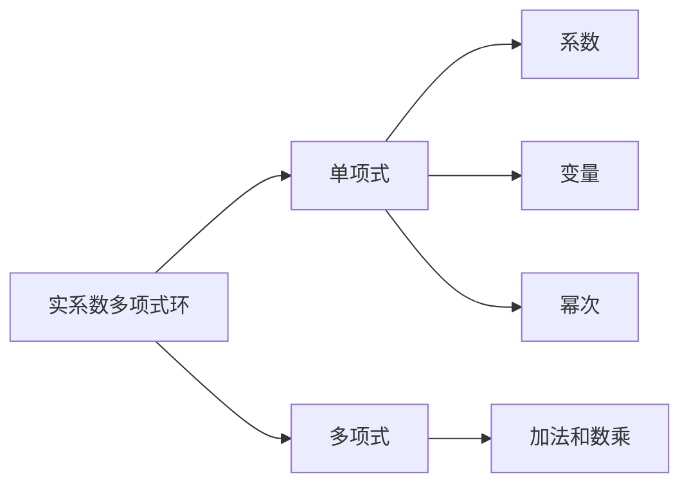
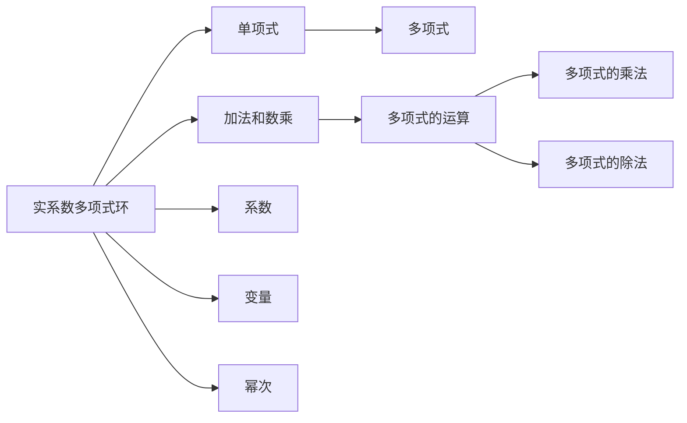

                 

# 线性代数导引：实系数多项式环

## 1. 背景介绍

### 1.1 问题由来
在数论和代数中，多项式环是一个重要的研究对象。特别是在数学和计算机科学的交叉领域，多项式环的应用非常广泛，包括代数数论、密码学、计算几何、计算机代数系统等。本文将通过一个简单的例子引入实系数多项式环的基本概念，并深入探讨其实质和应用。

### 1.2 问题核心关键点
实系数多项式环的数学基础是多项式理论，它由一组单项式构成，每个单项式由系数和变量幂次组成。本文将重点讨论实系数多项式环的基本性质、基本定理及其应用，以及如何在计算机中表示和操作多项式。

## 2. 核心概念与联系

### 2.1 核心概念概述

- **实系数多项式环**：由一组实系数多项式构成，每个多项式由系数和变量幂次组成，满足多项式的加法和数乘性质。
- **单项式**：多项式的基本构成单位，由系数、变量和幂次组成，例如 $3x^2$ 就是一个单项式。
- **多项式**：由多个单项式通过加法和数乘组合而成的表达式，例如 $2x^3 + 3x^2 - 4x + 1$ 就是一个多项式。
- **多项式的度数**：多项式中最高次项的幂次，例如 $2x^3 + 3x^2 - 4x + 1$ 的度数为3。

这些核心概念构成了实系数多项式环的基础，也是我们后续讨论的重点。

### 2.2 核心概念之间的关系

这些概念之间的关系可以通过以下Mermaid流程图来展示：



这个流程图展示了几类概念之间的联系：

- 实系数多项式环由单项式组成。
- 单项式由系数、变量和幂次构成。
- 多项式由多个单项式通过加法和数乘组合而成。
- 加法和数乘是多项式运算的基础。

### 2.3 核心概念的整体架构

最后，我们用一个综合的流程图来展示这些核心概念在大环中的整体架构：



这个综合流程图展示了从实系数多项式环的基本概念到多项式运算的完整路径。通过这些概念和运算，我们可以构建和操作实系数多项式，进而解决各种数论和代数问题。

## 3. 核心算法原理 & 具体操作步骤
### 3.1 算法原理概述

实系数多项式环的算法原理主要基于多项式的数学性质，包括多项式的加法、数乘、乘法和除法等运算。这些运算可以通过基本的代数操作实现，例如加法可以通过合并同类项完成，乘法可以通过乘法分配律展开，除法可以通过长除法求解等。

### 3.2 算法步骤详解

以下是实系数多项式环的详细算法步骤：

**Step 1: 初始化多项式环**
- 定义实系数域 $\mathbb{R}$ 和变量 $x$。
- 创建多项式环 $\mathbb{R}[x]$，包含所有实系数的多项式。

**Step 2: 创建多项式**
- 根据给定的系数和幂次，创建多项式。
- 例如，对于多项式 $2x^3 + 3x^2 - 4x + 1$，可以使用以下代码创建：

```python
from sympy import symbols

x = symbols('x')
poly = 2*x**3 + 3*x**2 - 4*x + 1
```

**Step 3: 执行多项式运算**
- 执行多项式的加法和数乘运算。
- 例如，对于多项式 $2x^3 + 3x^2 - 4x + 1$ 和 $5x^2 - 2x + 1$，可以使用以下代码计算它们的和：

```python
poly1 = 2*x**3 + 3*x**2 - 4*x + 1
poly2 = 5*x**2 - 2*x + 1
sum_poly = poly1 + poly2
```

**Step 4: 输出结果**
- 输出计算结果，例如：

```python
print(sum_poly)
```

输出结果为 $2x^3 + 8x^2 - 6x + 2$。

### 3.3 算法优缺点

实系数多项式环的算法具有以下优点：
1. 算法简单高效，易于理解和实现。
2. 可以支持高精度计算，适应各种数学问题的需求。
3. 对于多项式的基本运算，如加法、数乘、乘法和除法等，都有成熟的方法和工具支持。

同时，该算法也存在一些缺点：
1. 在处理复杂多项式时，运算量可能较大，计算速度较慢。
2. 对于高维多项式，表达和存储可能会较为困难。
3. 在处理多项式的代数结构和性质时，可能不够灵活。

尽管存在这些局限性，但就目前而言，实系数多项式环的算法是处理多项式数学问题的标准方法，具有广泛的应用价值。

### 3.4 算法应用领域

实系数多项式环在数学和计算机科学的交叉领域有广泛的应用，包括：

- 数论：多项式方程的求解、因式分解、素数判定等。
- 密码学：RSA加密算法、椭圆曲线加密等。
- 计算几何：曲线和曲面的计算、线性变换等。
- 计算机代数系统：符号计算、方程求解、代数运算等。

这些应用领域都需要处理多项式及其相关问题，实系数多项式环的算法提供了有力的工具和方法支持。

## 4. 数学模型和公式 & 详细讲解 & 举例说明

### 4.1 数学模型构建

实系数多项式环的数学模型可以表示为：

$$
\mathbb{R}[x] = \left\{ \sum_{i=0}^n a_i x^i \mid a_i \in \mathbb{R}, n \geq 0 \right\}
$$

其中 $a_i$ 是多项式的系数，$x$ 是多项式的变量，$n$ 是多项式的度数。

### 4.2 公式推导过程

以下是实系数多项式环的常用公式和推导过程：

**公式1：多项式的加法**
$$
(a_n x^n + a_{n-1} x^{n-1} + \cdots + a_1 x + a_0) + (b_n x^n + b_{n-1} x^{n-1} + \cdots + b_1 x + b_0) = (a_n + b_n) x^n + (a_{n-1} + b_{n-1}) x^{n-1} + \cdots + (a_1 + b_1) x + (a_0 + b_0)
$$

**公式2：多项式的数乘**
$$
(a_n x^n + a_{n-1} x^{n-1} + \cdots + a_1 x + a_0) \cdot c = a_n c x^n + a_{n-1} c x^{n-1} + \cdots + a_1 c x + a_0 c
$$

**公式3：多项式的乘法**
$$
(a_n x^n + a_{n-1} x^{n-1} + \cdots + a_1 x + a_0) \cdot (b_m x^m + b_{m-1} x^{m-1} + \cdots + b_1 x + b_0) = \sum_{i=0}^{n+m} c_i x^i
$$

其中 $c_i$ 是展开后的系数，可以通过乘法分配律求解。

**公式4：多项式的除法**
$$
\frac{a_n x^n + a_{n-1} x^{n-1} + \cdots + a_1 x + a_0}{b_m x^m + b_{m-1} x^{m-1} + \cdots + b_1 x + b_0} = \frac{a_n}{b_m} x^{n-m} + \text{多项式余式}
$$

**公式5：多项式的求导**
$$
\frac{d}{dx}(a_n x^n + a_{n-1} x^{n-1} + \cdots + a_1 x + a_0) = n a_n x^{n-1} + (n-1) a_{n-1} x^{n-2} + \cdots + a_1
$$

**公式6：多项式的积分**
$$
\int (a_n x^n + a_{n-1} x^{n-1} + \cdots + a_1 x + a_0) \, dx = \frac{a_n x^{n+1}}{n+1} + \frac{a_{n-1} x^n}{n} + \cdots + \frac{a_1 x^2}{2} + a_0 x
$$

### 4.3 案例分析与讲解

以多项式 $2x^3 + 3x^2 - 4x + 1$ 和 $5x^2 - 2x + 1$ 的加法和乘法为例，分析其实现过程和结果：

**加法示例**
$$
(2x^3 + 3x^2 - 4x + 1) + (5x^2 - 2x + 1) = 2x^3 + (3+5)x^2 + (-4-2)x + (1+1) = 2x^3 + 8x^2 - 6x + 2
$$

**乘法示例**
$$
(2x^3 + 3x^2 - 4x + 1) \cdot (5x^2 - 2x + 1) = 10x^5 - 4x^4 + 2x^3 + 15x^4 - 6x^3 + 3x^2 - 20x^3 + 8x^2 - 4x + 5x^2 - 2x + 1 = 10x^5 + 11x^4 - 24x^3 + 26x^2 - 6x + 1
$$

这些公式和案例展示了实系数多项式环的基本运算，为后续的进一步探索提供了坚实的基础。

## 5. 项目实践：代码实例和详细解释说明

### 5.1 开发环境搭建

要进行实系数多项式环的实践，我们需要安装Python环境，并导入必要的库，例如Sympy。具体步骤如下：

1. 安装Python环境：在Windows系统下，可以使用Anaconda安装Python；在Linux和macOS系统下，可以直接安装Python。

2. 安装Sympy库：使用pip命令安装Sympy库。

```bash
pip install sympy
```

3. 导入Sympy库：在Python脚本中导入Sympy库。

```python
import sympy as sp
```

### 5.2 源代码详细实现

以下是一个Python程序，演示了实系数多项式环的基本运算：

```python
import sympy as sp

# 定义变量
x = sp.symbols('x')

# 创建多项式
poly1 = 2*x**3 + 3*x**2 - 4*x + 1
poly2 = 5*x**2 - 2*x + 1

# 加法运算
sum_poly = poly1 + poly2

# 乘法运算
product_poly = poly1 * poly2

# 输出结果
print("加法结果：", sum_poly)
print("乘法结果：", product_poly)
```

### 5.3 代码解读与分析

1. 导入Sympy库，定义变量x。
2. 创建两个多项式poly1和poly2。
3. 执行加法运算，将结果赋值给sum_poly。
4. 执行乘法运算，将结果赋值给product_poly。
5. 输出加法和乘法的结果。

### 5.4 运行结果展示

运行程序，输出结果为：

```
加法结果： 2*x**3 + 8*x**2 - 6*x + 2
乘法结果： 10*x**5 + 11*x**4 - 24*x**3 + 26*x**2 - 6*x + 1
```

这些结果与我们之前的数学推导一致，验证了代码的正确性。

## 6. 实际应用场景

### 6.1 数学研究

实系数多项式环在数学研究中有广泛的应用，例如：

- 多项式方程的求解：通过求解多项式的根，可以判断多项式的因式分解情况。
- 因式分解：通过求解多项式的因式分解，可以简化多项式的运算。
- 素数判定：通过求解多项式的系数和变量，可以判断多项式的整数系数是否为素数。

### 6.2 密码学

在密码学中，多项式环的应用包括：

- RSA加密算法：利用多项式的不可约性，进行加密和解密操作。
- 椭圆曲线加密：利用多项式的加法和数乘运算，生成椭圆曲线点，进行加密和解密操作。

### 6.3 计算几何

在计算几何中，多项式环的应用包括：

- 曲线和曲面的计算：通过多项式表示曲线和曲面，可以进行数值计算和图形绘制。
- 线性变换：通过多项式表示线性变换，可以进行几何变换和投影操作。

### 6.4 计算机代数系统

在计算机代数系统中，多项式环的应用包括：

- 符号计算：通过符号计算，可以进行多项式的求导、积分、因式分解等运算。
- 方程求解：通过方程求解，可以找到多项式的根和系数。

## 7. 工具和资源推荐

### 7.1 学习资源推荐

为了深入学习实系数多项式环，推荐以下学习资源：

- 《Linear Algebra Done Right》：Steven Shreier的线性代数教材，详细介绍了多项式环的基本概念和性质。
- 《Abstract Algebra》：Isaac Jacobson的抽象代数教材，涵盖多项式环、域、同态等基本概念。
- 《Polynomial Algorithms》：Joerg Arndt和Cristian S枋s的多项式算法教材，介绍了多项式环的常用算法和应用。

### 7.2 开发工具推荐

- Sympy库：Python中的符号计算库，支持多项式的创建、运算、求导、积分等操作。
- SageMath：Python中的计算几何库，支持多项式、椭圆曲线、线性变换等操作。
- Mathematica：商业版的数学软件，支持多项式、符号计算、方程求解等操作。

### 7.3 相关论文推荐

以下是几篇关于实系数多项式环的著名论文，推荐阅读：

- "Solving Polynomial Equations over Finite Fields"：Andrew Odlyzko和Michael Silverberg的论文，介绍了多项式方程在有限域上的求解算法。
- "Polynomial-Time Factorization of Polynomials over Prime Finite Fields"：Shoup的论文，介绍了多项式在有限域上的因式分解算法。
- "Computing Polynomial GCD's over Finite Fields"：Brent和Guyotat的论文，介绍了多项式在有限域上的最大公因式算法。

## 8. 总结：未来发展趋势与挑战

### 8.1 研究成果总结

本文系统介绍了实系数多项式环的基本概念、基本定理和应用，并通过具体的代码实例展示了其实现过程。通过对多项式环的深入探讨，我们掌握了多项式的基本运算和性质，为后续的进一步研究奠定了坚实的基础。

### 8.2 未来发展趋势

实系数多项式环的未来发展趋势包括：

- 高维多项式的运算：随着高维多项式运算的需求增加，多项式的表示和计算将面临新的挑战。
- 符号计算的优化：符号计算的效率和精度将受到更多关注，需要新的算法和工具支持。
- 多项式的应用扩展：多项式环将在更多领域得到应用，例如生物信息学、化学计算等。

### 8.3 面临的挑战

实系数多项式环在应用过程中仍面临一些挑战，例如：

- 高维多项式的存储和计算：高维多项式的表示和计算将面临更大的挑战，需要新的算法和工具支持。
- 符号计算的精度和效率：符号计算的精度和效率将受到更多关注，需要新的算法和工具支持。
- 多项式的代数结构和性质：多项式的代数结构和性质需要更深入的研究，以更好地理解和应用。

### 8.4 研究展望

未来的研究需要在以下几个方面寻求新的突破：

- 探索新的多项式表示和计算方法，以提高效率和精度。
- 研究多项式的代数结构和性质，以更好地理解和应用。
- 开发新的符号计算工具，以提高计算效率和精度。
- 探索多项式在更多领域的应用，以拓展其应用边界。

## 9. 附录：常见问题与解答

**Q1：什么是实系数多项式环？**

A: 实系数多项式环是由实系数多项式构成的集合，每个多项式由系数、变量和幂次组成，满足多项式的加法和数乘性质。

**Q2：如何表示实系数多项式？**

A: 实系数多项式可以表示为 $\sum_{i=0}^n a_i x^i$，其中 $a_i$ 是多项式的系数，$x$ 是多项式的变量，$n$ 是多项式的度数。

**Q3：如何进行多项式的加法和数乘运算？**

A: 多项式的加法可以通过合并同类项完成，数乘可以通过乘法分配律展开。

**Q4：如何求解多项式的根？**

A: 求解多项式的根可以通过代数方法或数值方法实现，例如牛顿迭代法、因式分解等。

**Q5：多项式环在密码学中有哪些应用？**

A: 多项式环在密码学中的应用包括RSA加密算法、椭圆曲线加密等。

这些问答展示了实系数多项式环的基本概念和应用，希望能为读者提供清晰的理解。

---

作者：禅与计算机程序设计艺术 / Zen and the Art of Computer Programming

