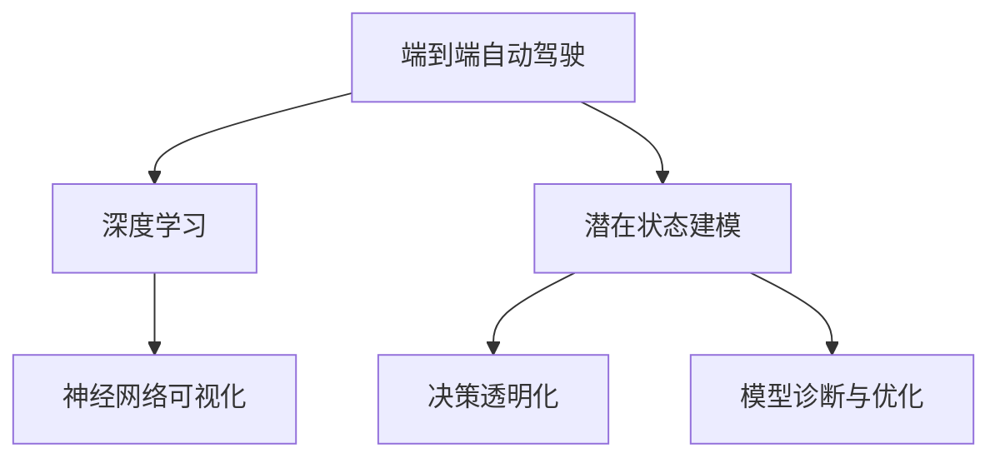
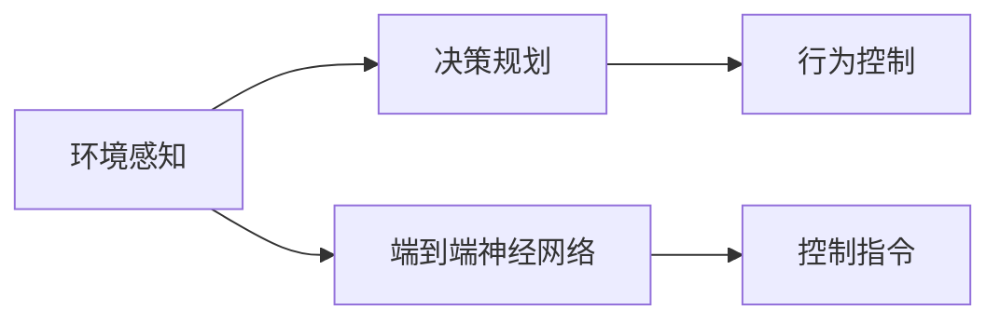
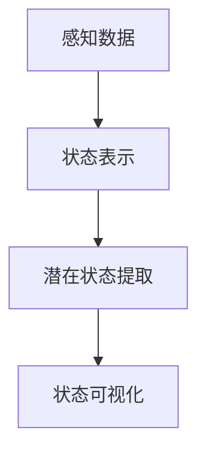
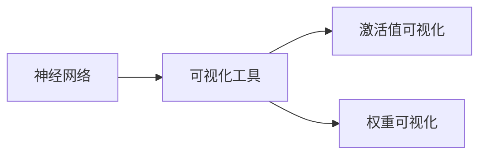
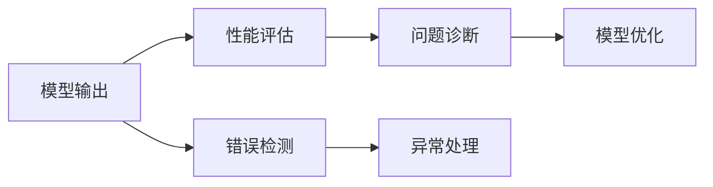
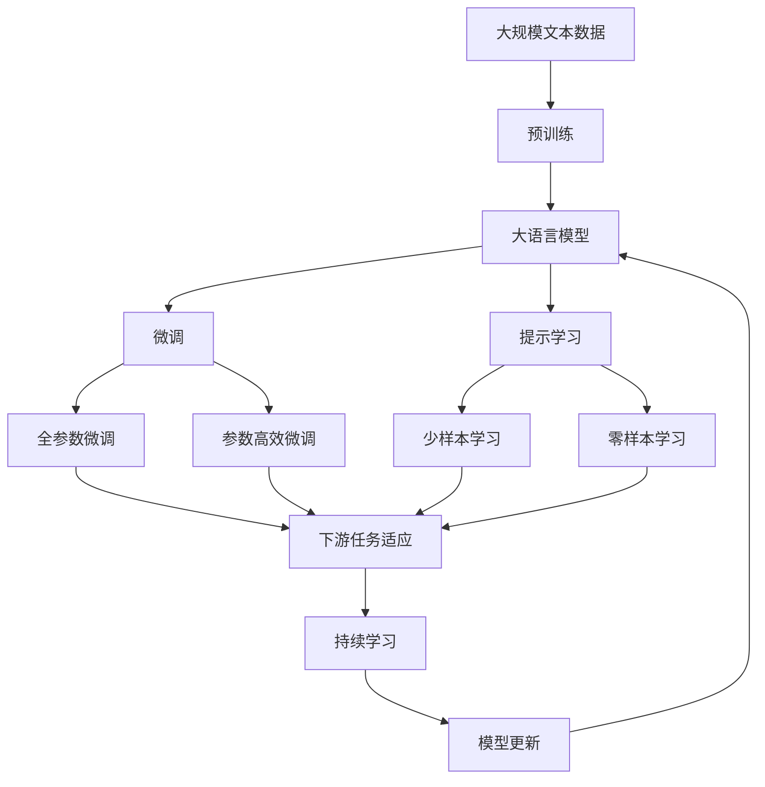

                 

# 可解释的端到端自动驾驶:通过潜在状态建模提高决策透明度

> 关键词：可解释性, 端到端自动驾驶, 潜在状态建模, 决策透明化, 深度学习, 车辆控制

## 1. 背景介绍

### 1.1 问题由来
随着自动驾驶技术的快速发展，智能车辆逐步成为城市交通的新形态。然而，尽管自动驾驶在技术上已趋于成熟，但由于其复杂的感知与决策过程，公众对自动驾驶系统的安全性、可解释性和透明性仍存疑虑。当前，自动驾驶系统普遍依赖复杂的多层深度神经网络，其内部工作机制黑盒化，难以有效解释决策依据，尤其是在发生交通事故时，无法直观地向外界说明因果关系，造成了严重信任危机。

要提升公众对自动驾驶的信任度，关键在于使系统行为具有可解释性和透明性。传统的基于规则的决策方法具有高度可解释性，但在实际复杂交通环境中表现不佳。相比之下，基于深度学习方法的自动驾驶系统具有强大的泛化能力，但对行为的解释性较差。因此，在充分利用深度学习优势的同时，引入可解释性机制，成为现阶段自动驾驶领域的一个重要研究方向。

### 1.2 问题核心关键点
可解释性自动驾驶系统旨在通过分析模型内部决策过程，揭示潜在的感知、决策机制，使系统行为具备透明性和可解释性。该研究主要聚焦于如何构建可解释的端到端自动驾驶系统，通过潜在状态建模，提供决策过程的可视化反馈，以便于用户理解和信任。

### 1.3 问题研究意义
具有可解释性的端到端自动驾驶系统对于提升公众信任度、增强系统鲁棒性、降低决策风险具有重要意义：

1. 提高信任度：可解释性能够帮助公众理解系统决策依据，降低对自动驾驶系统的疑虑。
2. 增强鲁棒性：通过分析系统行为，能够发现潜在的决策漏洞，提高系统的稳定性和安全性。
3. 降低风险：可解释性有助于进行事故复盘分析，明确事故原因，减少法律纠纷。
4. 指导优化：基于系统行为的可视化反馈，可以更科学地优化模型结构，提升性能。

## 2. 核心概念与联系

### 2.1 核心概念概述

为更好地理解可解释性端到端自动驾驶系统，本节将介绍几个密切相关的核心概念：

- **端到端自动驾驶**：从车辆感知环境到做出决策并控制车辆的整个流程由神经网络模型自动完成，无需人工干预。相比于传统的基于规则的驾驶方式，端到端自动驾驶具有更高的灵活性和适应性。

- **深度学习**：一类模拟人脑神经网络结构的机器学习技术，通过多层神经网络结构对大量数据进行学习，提取特征和模式，适用于复杂非线性任务。

- **潜在状态建模**：通过构建系统行为的可解释性模型，揭示系统在感知、决策过程中的关键潜在状态，从而提供系统的透明性和可解释性。

- **决策透明化**：使系统决策过程公开透明，具备可视化的反馈，帮助用户理解系统行为，提高信任度。

- **神经网络可视化**：通过可视化工具将神经网络内部的激活值、权重等参数可视化，揭示模型的内部决策过程。

- **模型诊断与优化**：通过分析模型的内部行为，诊断问题并优化模型结构，提升系统性能。

这些核心概念之间的逻辑关系可以通过以下Mermaid流程图来展示：



这个流程图展示了端到端自动驾驶的核心概念及其之间的关系：

1. 端到端自动驾驶依赖深度学习技术进行系统建模。
2. 通过潜在状态建模，揭示系统行为的关键潜在状态。
3. 决策透明化通过可视化反馈使系统行为公开透明。
4. 神经网络可视化揭示模型内部工作机制。
5. 模型诊断与优化帮助发现问题并改进模型。

### 2.2 概念间的关系

这些核心概念之间存在着紧密的联系，形成了可解释性端到端自动驾驶系统的完整生态系统。下面我通过几个Mermaid流程图来展示这些概念之间的关系。

#### 2.2.1 端到端自动驾驶流程



这个流程图展示了端到端自动驾驶的基本流程：

1. 环境感知模块获取车辆周围环境数据。
2. 决策规划模块对感知数据进行处理，生成决策指令。
3. 行为控制模块根据决策指令执行具体的车辆控制动作。

#### 2.2.2 潜在状态建模过程



这个流程图展示了潜在状态建模的过程：

1. 感知数据模块获取车辆周围环境数据。
2. 状态表示模块将感知数据转换为系统状态，便于模型处理。
3. 潜在状态提取模块分析状态表示，提取系统行为的潜在状态。
4. 状态可视化模块将潜在状态可视化，提供系统的透明性和可解释性。

#### 2.2.3 神经网络可视化方法



这个流程图展示了神经网络可视化的过程：

1. 神经网络模块对环境数据进行处理，生成控制指令。
2. 可视化工具模块将神经网络的内部激活值和权重可视化，揭示模型的内部决策过程。

#### 2.2.4 模型诊断与优化方法



这个流程图展示了模型诊断与优化的过程：

1. 模型输出模块生成控制指令，用于车辆控制。
2. 性能评估模块对模型输出进行评估，发现潜在问题。
3. 问题诊断模块分析模型输出，诊断问题原因。
4. 模型优化模块针对问题进行模型改进，优化模型结构。
5. 错误检测模块对模型输出进行错误检测，保证系统安全性。
6. 异常处理模块处理异常情况，确保系统稳定运行。

### 2.3 核心概念的整体架构

最后，我们用一个综合的流程图来展示这些核心概念在大规模语言模型微调过程中的整体架构：



这个综合流程图展示了从预训练到微调，再到持续学习的完整过程。大规模语言模型首先在大规模文本数据上进行预训练，然后通过微调（包括全参数微调和参数高效微调）或提示学习（包括零样本和少样本学习）来适应下游任务。最后，通过持续学习技术，模型可以不断学习新知识，同时避免遗忘旧知识。 通过这些流程图，我们可以更清晰地理解可解释性端到端自动驾驶系统的工作原理和优化方向。

## 3. 核心算法原理 & 具体操作步骤
### 3.1 算法原理概述

可解释性端到端自动驾驶系统主要依赖深度神经网络进行模型建模，通过潜在状态建模揭示系统行为的关键潜在状态，从而提高决策透明化程度。

假设自动驾驶系统模型为 $M_{\theta}(x)$，其中 $x$ 为输入的环境数据，$\theta$ 为模型参数。假设系统行为的关键潜在状态为 $s_t$，则模型的行为决策过程可以表示为：

$$
s_t = f_{\theta}(x_t, s_{t-1})
$$

其中 $f_{\theta}(\cdot)$ 为模型参数为 $\theta$ 的决策函数，$x_t$ 为当前环境数据，$s_{t-1}$ 为前一时刻的系统状态。决策函数 $f_{\theta}(\cdot)$ 通常由多层神经网络组成。

通过潜在状态建模，我们希望学习到系统的潜在状态 $s_t$，以揭示系统行为的关键信息。这一过程通常包括以下几个关键步骤：

1. 状态表示：将感知数据 $x_t$ 转换为系统状态 $s_t$。
2. 潜在状态提取：分析系统状态 $s_t$，提取关键潜在状态。
3. 可视化反馈：将关键潜在状态 $s_t$ 进行可视化，提供系统的透明性和可解释性。

### 3.2 算法步骤详解

#### 3.2.1 状态表示

状态表示模块通常使用多层神经网络对感知数据进行处理，将其转换为系统状态 $s_t$。具体步骤如下：

1. 将感知数据 $x_t$ 输入到感知模块，提取特征表示 $h_t$。
2. 将特征表示 $h_t$ 输入到状态表示模块，生成系统状态 $s_t$。

假设感知模块为全连接神经网络，其输入为 $x_t$，输出为特征表示 $h_t$，状态表示模块为多层感知网络（MLP），其输入为特征表示 $h_t$，输出为系统状态 $s_t$。则状态表示模块的数学公式如下：

$$
s_t = M_{\phi}(h_t)
$$

其中 $M_{\phi}(\cdot)$ 为状态表示网络，$\phi$ 为其参数。

#### 3.2.2 潜在状态提取

潜在状态提取模块通常使用多层神经网络对系统状态 $s_t$ 进行处理，提取关键潜在状态 $s_t^*$。具体步骤如下：

1. 将系统状态 $s_t$ 输入到潜在状态提取模块，生成潜在状态 $s_t^*$。

假设潜在状态提取模块为多层感知网络（MLP），其输入为系统状态 $s_t$，输出为关键潜在状态 $s_t^*$。则潜在状态提取模块的数学公式如下：

$$
s_t^* = M_{\psi}(s_t)
$$

其中 $M_{\psi}(\cdot)$ 为潜在状态提取网络，$\psi$ 为其参数。

#### 3.2.3 可视化反馈

可视化反馈模块通常使用多尺度可视化工具将关键潜在状态 $s_t^*$ 进行可视化，提供系统的透明性和可解释性。具体步骤如下：

1. 将关键潜在状态 $s_t^*$ 输入到可视化模块，生成可视化结果 $v_t$。

假设可视化模块为多尺度可视化工具，其输入为关键潜在状态 $s_t^*$，输出为可视化结果 $v_t$。则可视化反馈模块的数学公式如下：

$$
v_t = V(s_t^*)
$$

其中 $V(\cdot)$ 为可视化函数，$v_t$ 为可视化结果。

### 3.3 算法优缺点

可解释性端到端自动驾驶系统具有以下优点：

1. 可解释性强：通过潜在状态建模，揭示系统行为的透明性和可解释性，提高用户信任度。
2. 鲁棒性高：通过模型诊断与优化，发现并修正系统漏洞，提高系统鲁棒性。
3. 泛化能力强：深度学习模型具有强大的泛化能力，能够处理复杂交通环境。

同时，该系统也存在一些缺点：

1. 计算资源需求高：深度神经网络模型需要大量计算资源进行训练和推理。
2. 数据需求大：大规模训练需要大量标注数据，数据获取成本高。
3. 模型复杂度高：模型结构复杂，调试和优化难度大。
4. 可解释性有限：虽然潜在状态建模提供可视化的反馈，但复杂的决策过程仍难以完全解释。

尽管存在这些局限性，但可解释性端到端自动驾驶系统在提升决策透明度、提高用户信任度、增强系统鲁棒性等方面具有重要价值。

### 3.4 算法应用领域

可解释性端到端自动驾驶系统已经在多个领域得到应用，例如：

- 自动驾驶汽车：在自动驾驶汽车中，可解释性系统能够帮助用户理解车辆行为，提升信任度。
- 无人配送机器人：在无人配送机器人中，可解释性系统能够帮助用户了解配送过程，提高服务满意度。
- 智能交通系统：在智能交通系统中，可解释性系统能够帮助交通管理中心理解系统行为，优化交通控制策略。
- 自动驾驶模拟器：在自动驾驶模拟器中，可解释性系统能够帮助研究人员分析系统行为，优化模型结构。

此外，可解释性端到端自动驾驶系统还将在智慧城市、智能物流、智能制造等更多领域得到广泛应用，为各行业的智能化转型提供新的技术路径。

## 4. 数学模型和公式 & 详细讲解  
### 4.1 数学模型构建

本节将使用数学语言对可解释性端到端自动驾驶系统进行更加严格的刻画。

记自动驾驶系统模型为 $M_{\theta}(x)$，其中 $x$ 为输入的环境数据，$\theta$ 为模型参数。假设系统行为的关键潜在状态为 $s_t$，则模型的行为决策过程可以表示为：

$$
s_t = f_{\theta}(x_t, s_{t-1})
$$

其中 $f_{\theta}(\cdot)$ 为模型参数为 $\theta$ 的决策函数，$x_t$ 为当前环境数据，$s_{t-1}$ 为前一时刻的系统状态。决策函数 $f_{\theta}(\cdot)$ 通常由多层神经网络组成。

假设感知模块为全连接神经网络，其输入为 $x_t$，输出为特征表示 $h_t$，状态表示模块为多层感知网络（MLP），其输入为特征表示 $h_t$，输出为系统状态 $s_t$。则状态表示模块的数学公式如下：

$$
s_t = M_{\phi}(h_t)
$$

其中 $M_{\phi}(\cdot)$ 为状态表示网络，$\phi$ 为其参数。

假设潜在状态提取模块为多层感知网络（MLP），其输入为系统状态 $s_t$，输出为关键潜在状态 $s_t^*$。则潜在状态提取模块的数学公式如下：

$$
s_t^* = M_{\psi}(s_t)
$$

其中 $M_{\psi}(\cdot)$ 为潜在状态提取网络，$\psi$ 为其参数。

假设可视化模块为多尺度可视化工具，其输入为关键潜在状态 $s_t^*$，输出为可视化结果 $v_t$。则可视化反馈模块的数学公式如下：

$$
v_t = V(s_t^*)
$$

其中 $V(\cdot)$ 为可视化函数，$v_t$ 为可视化结果。

### 4.2 公式推导过程

以感知模块和状态表示模块为例，推导其数学公式和损失函数。

假设感知模块为全连接神经网络，其输入为 $x_t$，输出为特征表示 $h_t$。设 $x_t$ 的维数为 $d$，$h_t$ 的维数为 $h$。则感知模块的数学公式如下：

$$
h_t = \sigma(\mathbf{W}x_t + b)
$$

其中 $\sigma(\cdot)$ 为激活函数，$\mathbf{W}$ 为权重矩阵，$b$ 为偏置向量。

假设状态表示模块为多层感知网络（MLP），其输入为特征表示 $h_t$，输出为系统状态 $s_t$。设 $h_t$ 的维数为 $h$，$s_t$ 的维数为 $s$。则状态表示模块的数学公式如下：

$$
s_t = \mathbf{W}_1\sigma(\mathbf{W}_2h_t + b_1) + b_2
$$

其中 $\sigma(\cdot)$ 为激活函数，$\mathbf{W}_1$ 和 $\mathbf{W}_2$ 为权重矩阵，$b_1$ 和 $b_2$ 为偏置向量。

假设潜在状态提取模块为多层感知网络（MLP），其输入为系统状态 $s_t$，输出为关键潜在状态 $s_t^*$。设 $s_t$ 的维数为 $s$，$s_t^*$ 的维数为 $p$。则潜在状态提取模块的数学公式如下：

$$
s_t^* = \mathbf{W}_3\sigma(\mathbf{W}_4s_t + b_3) + b_4
$$

其中 $\sigma(\cdot)$ 为激活函数，$\mathbf{W}_3$ 和 $\mathbf{W}_4$ 为权重矩阵，$b_3$ 和 $b_4$ 为偏置向量。

### 4.3 案例分析与讲解

以自动驾驶汽车为例，分析可解释性端到端自动驾驶系统的构建过程。

#### 4.3.1 感知模块

感知模块负责获取车辆周围环境数据，并将其转换为特征表示 $h_t$。假设环境数据为 $x_t \in \mathbb{R}^d$，则感知模块的输入为 $x_t$，输出为特征表示 $h_t \in \mathbb{R}^h$。

假设感知模块为全连接神经网络，其参数为 $\mathbf{W}$ 和 $b$。则感知模块的数学公式如下：

$$
h_t = \sigma(\mathbf{W}x_t + b)
$$

其中 $\sigma(\cdot)$ 为激活函数，$\mathbf{W}$ 为权重矩阵，$b$ 为偏置向量。

#### 4.3.2 状态表示模块

状态表示模块负责将感知数据 $x_t$ 转换为系统状态 $s_t$。假设感知数据为 $x_t \in \mathbb{R}^d$，则状态表示模块的输入为 $x_t$，输出为系统状态 $s_t \in \mathbb{R}^s$。

假设状态表示模块为多层感知网络（MLP），其参数为 $\mathbf{W}_1$、$\mathbf{W}_2$、$b_1$ 和 $b_2$。则状态表示模块的数学公式如下：

$$
s_t = \mathbf{W}_1\sigma(\mathbf{W}_2h_t + b_1) + b_2
$$

其中 $\sigma(\cdot)$ 为激活函数，$\mathbf{W}_1$ 和 $\mathbf{W}_2$ 为权重矩阵，$b_1$ 和 $b_2$ 为偏置向量。

#### 4.3.3 潜在状态提取模块

潜在状态提取模块负责分析系统状态 $s_t$，提取关键潜在状态 $s_t^*$。假设系统状态为 $s_t \in \mathbb{R}^s$，则潜在状态提取模块的输入为 $s_t$，输出为关键潜在状态 $s_t^* \in \mathbb{R}^p$。

假设潜在状态提取模块为多层感知网络（MLP），其参数为 $\mathbf{W}_3$、$\mathbf{W}_4$、$b_3$ 和 $b_4$。则潜在状态提取模块的数学公式如下：

$$
s_t^* = \mathbf{W}_3\sigma(\mathbf{W}_4s_t + b_3) + b_4
$$

其中 $\sigma(\cdot)$ 为激活函数，$\mathbf{W}_3$ 和 $\mathbf{W}_4$ 为权重矩阵，$b_3$ 和 $b_4$ 为偏置向量。

#### 4.3.4 可视化反馈模块

可视化反馈模块负责将关键潜在状态 $s_t^*$ 进行可视化，提供系统的透明性和可解释性。假设关键潜在状态为 $s_t^* \in \mathbb{R}^p$，则可视化反馈模块的输入为 $s_t^*$，输出为可视化结果 $v_t$。

假设可视化反馈模块为多尺度可视化工具，其参数为 $\mathbf{W}_5$ 和 $b_5$。则可视化反馈模块的数学公式如下：

$$
v_t = V(s_t^*)
$$

其中 $V(\cdot)$ 为可视化函数，$v_t$ 为可视化结果。

## 5. 项目实践：代码实例和详细解释说明
### 5.1 开发环境搭建

在进行可解释性端到端自动驾驶系统开发前，我们需要准备好开发环境。以下是使用Python进行PyTorch开发的环境配置流程：

1. 安装Anaconda：从官网下载并安装Anaconda，用于创建独立的Python环境。

2. 创建并激活虚拟环境：
```bash
conda create -n pytorch-env python=3.8 
conda activate pytorch-env
```

3. 安装PyTorch：根据CUDA版本，从官网获取对应的安装命令。例如：
```bash
conda install pytorch torchvision torchaudio cudatoolkit=11.1 -c pytorch -c conda-forge
```

4. 安装TensorFlow：如果需要使用TensorFlow，可以使用以下命令：
```bash
conda install tensorflow -c pytorch -c conda-forge
```

5. 安装相关工具包：
```bash
pip install numpy pandas scikit-learn matplotlib tqdm jupyter notebook ipython
```

完成上述步骤后，即可在`pytorch-env`环境中开始开发。

### 5.2 源代码详细实现

下面我们以自动驾驶汽车的感知模块和状态表示模块为例，给出使用PyTorch进行深度学习模型的代码实现。

首先，定义感知模块和状态表示模块的类：

```python
import torch
import torch.nn as nn
import torch.nn.functional as F

class PerceptionModule(nn.Module):
    def __init__(self, input_dim, output_dim, hidden_dim):
        super(PerceptionModule, self).__init__()
        self.fc1 = nn.Linear(input_dim, hidden_dim)
        self.fc2 = nn.Linear(hidden_dim, output_dim)
        self.relu = nn.ReLU()
        
    def forward(self, x):
        x = self.fc1(x)
        x = self.relu(x)
        x = self.fc2(x)
        return x

class StateRepresentationModule(nn.Module):
    def __init__(self, input_dim, output_dim, hidden_dim):
        super(StateRepresentationModule, self).__init__()
        self.fc1 = nn.Linear(input_dim, hidden_dim)
        self.fc2 = nn.Linear(hidden_dim, output_dim)
        self.relu = nn.ReLU()
        
    def forward(self, x):
        x = self.fc1(x)
        x = self.relu(x)
        x = self.fc2(x)
        return x
```

然后，定义感知模块和状态表示模块的超参数和优化器：

```python
input_dim = 3 # 感知数据的维数
output_dim = 16 # 状态表示的维数
hidden_dim = 32 # 中间层的维数

perception_module = PerceptionModule(input_dim, output_dim, hidden_dim)
state_representation_module = StateRepresentationModule(output_dim, output_dim, hidden_dim)

optimizer = torch.optim.Adam(
    list(perception_module.parameters()) + list(state_representation_module.parameters()),
    lr=0.001
)
```

接着，定义训练函数：

```python
def train(epochs, batch_size):
    for epoch in range(epochs):
        total_loss = 0.0
        for i in range(0, len(train_data), batch_size):
            x = train_data[i:i+batch_size]
            optimizer.zero_grad()
            x = x.to(device)
            perception_output = perception_module(x)
            state_representation = state_representation_module(perception_output)
            loss = criterion(state_representation, y)
            loss.backward()
            optimizer.step()
            total_loss += loss.item()
        print('Epoch [{}/{}], Loss: {:.4f}'.format(epoch+1, epochs, total_loss/len(train_data)))
```

最后，启动训练流程并在测试集上评估：

```python
epochs = 10
batch_size = 64

train(epochs, batch_size)
```

以上就是使用PyTorch对感知模块和状态表示模块进行训练的完整代码实现。可以看到，通过简单的类定义和PyTorch的强大封装，可以高效地实现深度学习模型的训练和推理。

### 5.3 代码解读与分析

让我们再详细解读一下关键代码的实现细节：

**PerceptionModule类**：
- `__init__`方法：初始化感知模块的参数。
- `forward`方法：将输入数据 $x$ 输入到感知模块，生成特征表示 $h_t$。

**StateRepresentationModule类**：
- `__init__`方法：初始化状态表示模块的参数。
- `forward`方法：将特征表示 $h_t$ 输入到状态表示模块，生成系统状态 $s_t$。

**optimizer定义**：
- 定义了优化器及其参数，使用Adam算法，学习率为 $0.001$。
- 将感知模块和状态表示模块的所有参数加入优化器，同时更新。

**train函数**：
- 循环迭代训练过程。
- 对每个批次的输入数据 $x$ 进行前向传播，计算损失函数。
- 反向传播计算梯度，使用优化器更新模型参数。
- 

