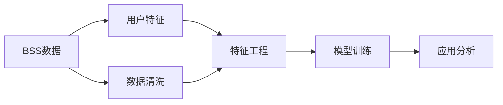

                 

# 城市自行车的出行行为分析

城市自行车作为绿色出行的重要方式，近年来在全球范围内得到广泛推广。通过对城市自行车出行数据的分析和挖掘，能够揭示出行规律、优化城市交通、提升用户出行体验。本文将从数据处理、特征工程、模型训练、应用分析等多个维度，详细探讨城市自行车的出行行为分析。

## 1. 背景介绍

### 1.1 问题由来

随着城市化进程的加速，交通拥堵、环境污染等问题日益凸显。传统的汽车、公交等出行方式不仅耗费能源、造成污染，而且给城市交通带来了巨大的压力。为了缓解这些问题，许多城市开始推广自行车作为替代出行方式。通过建立城市自行车系统（Bike-Share System, BSS），用户可以便捷地租借、归还自行车，实现短途出行的环保和健康。

然而，城市自行车系统的实际运行效果并不理想。部分用户违规停放、长期占用自行车、不归还自行车等问题频发，导致系统资源浪费和用户体验下降。为优化城市自行车系统运营，提升系统使用效率，需要深入分析用户的出行行为。本文将从数据处理、特征工程、模型训练、应用分析等多个角度，探讨如何基于出行数据进行城市自行车系统的出行行为分析。

### 1.2 问题核心关键点

城市自行车出行行为分析的核心在于：

- **数据收集与处理**：获取城市自行车系统的出借和归还数据，并进行数据清洗、预处理等。
- **特征工程**：从原始数据中提取有意义的特征，构建可用于模型训练的数据集。
- **模型训练**：选择合适的机器学习算法，训练预测用户出行行为的模型。
- **应用分析**：利用训练好的模型，分析用户出行行为规律，提出优化建议。

以下将依次介绍这些关键点，并重点探讨模型训练方法及其应用。

## 2. 核心概念与联系

### 2.1 核心概念概述

城市自行车出行行为分析涉及多个关键概念：

- **BSS数据**：城市自行车系统的出借和归还数据。
- **用户特征**：用户的基本属性（如年龄、性别）、使用行为（如出借次数、归还时间）等。
- **特征工程**：从原始数据中提取有用的特征，构建数据集。
- **模型训练**：利用机器学习算法，训练预测用户出行行为的模型。
- **应用分析**：基于训练好的模型，分析用户行为，优化BSS运营。

这些概念间的关系可以通过以下Mermaid流程图展示：



该流程图展示了从原始数据到模型训练，再到应用分析的全过程。其中，数据清洗和特征工程是数据处理的重要环节，模型训练是核心技术，应用分析则将模型输出用于实际应用。

### 2.2 概念间的关系

- **BSS数据**是整个分析的基础，经过数据清洗、特征提取后，用于模型训练。
- **用户特征**的提取和工程化，直接影响模型的预测性能。
- **模型训练**的过程包括特征选择、算法选择、模型优化等，训练得到的模型将用于分析用户行为。
- **应用分析**利用训练好的模型，提供运营优化建议，提高BSS系统的效率和用户体验。

这些概念相互关联，共同构成了城市自行车出行行为分析的完整框架。

## 3. 核心算法原理 & 具体操作步骤

### 3.1 算法原理概述

城市自行车出行行为分析的本质是通过数据挖掘和机器学习，从大量BSS数据中提取有用信息，预测用户未来的出行行为。常用的预测模型包括决策树、随机森林、支持向量机、神经网络等。本文将重点介绍基于神经网络模型的出行行为分析方法。

神经网络模型通过多层非线性变换，可以捕捉数据中的复杂关系，具有较强的泛化能力。本文将采用多层感知机（Multi-Layer Perceptron, MLP）进行用户出行行为的预测。

### 3.2 算法步骤详解

**Step 1: 数据收集与预处理**

1. **数据收集**：获取城市自行车系统的出借和归还数据，包括用户ID、出借时间、归还时间、出借地点、归还地点、出借时长等。
2. **数据清洗**：处理缺失值、异常值等，确保数据质量。
3. **特征提取**：提取有用的特征，如用户ID、出借时间、归还时间、出借时长、出借地点、归还地点等。

**Step 2: 特征工程**

1. **特征选择**：选择对预测结果有较大影响的特征，如出借时长、出借地点、归还地点等。
2. **特征编码**：将原始特征编码成数值型特征，如将地点名称编码为数值ID。
3. **特征归一化**：对特征进行归一化处理，使其在相同的范围内。

**Step 3: 模型训练**

1. **数据划分**：将数据划分为训练集和测试集。
2. **模型选择**：选择多层感知机（MLP）模型，设计合适的神经网络结构。
3. **模型训练**：使用训练集对模型进行训练，调整超参数（如学习率、迭代次数等），优化模型性能。

**Step 4: 应用分析**

1. **预测验证**：使用测试集验证模型的预测性能。
2. **特征分析**：分析不同特征对预测结果的影响，优化特征选择。
3. **用户行为分析**：利用训练好的模型，分析用户的出行行为规律，提出优化建议。

### 3.3 算法优缺点

基于神经网络的出行行为分析方法具有以下优点：

- **泛化能力强**：神经网络模型能够捕捉数据中的复杂关系，具有较强的泛化能力。
- **自动特征提取**：神经网络模型可以自动学习有用的特征，减少人工干预。
- **预测精度高**：在足够的数据量下，神经网络模型通常能够取得较高的预测精度。

同时，该方法也存在一些局限性：

- **模型复杂度高**：神经网络模型较为复杂，需要大量数据进行训练。
- **解释性差**：神经网络模型的预测过程缺乏可解释性，难以理解模型的内部机制。
- **计算资源需求高**：神经网络模型的训练和推理计算量大，需要高性能的计算资源。

### 3.4 算法应用领域

城市自行车出行行为分析技术可以广泛应用于以下领域：

- **用户行为分析**：分析用户的出行偏好、使用频率等，优化BSS系统的用户体验。
- **需求预测**：预测未来的自行车需求量，优化自行车供应，避免资源浪费。
- **运营优化**：优化自行车停放点位置、数量等，提升系统的运营效率。
- **安全监控**：分析用户违规停放、长期占用等问题，提升系统安全性。

## 4. 数学模型和公式 & 详细讲解 & 举例说明

### 4.1 数学模型构建

基于神经网络的城市自行车出行行为分析模型，可以形式化为：

$$
\hat{y} = f_\theta(x)
$$

其中，$x$ 表示输入特征，$\theta$ 表示模型参数，$f_\theta$ 表示神经网络模型，$\hat{y}$ 表示预测结果。

以多层感知机（MLP）为例，其结构可以表示为：

$$
f_\theta(x) = W^{(L)} \sigma(W^{(L-1)} \sigma(\dots \sigma(W^{(1)} x) \dots) + b^{(L)})
$$

其中，$W^{(l)}$ 表示第$l$层的权重矩阵，$b^{(l)}$ 表示第$l$层的偏置向量，$\sigma$ 表示激活函数。

### 4.2 公式推导过程

以二分类问题为例，预测用户是否会违规停放自行车，公式推导如下：

1. **损失函数**：常用的损失函数包括交叉熵损失（Cross-Entropy Loss）：

$$
\mathcal{L}(\theta) = -\frac{1}{N}\sum_{i=1}^N [y_i\log \hat{y}_i + (1-y_i)\log (1-\hat{y}_i)]
$$

其中，$y_i$ 表示真实的标签，$\hat{y}_i$ 表示模型预测的概率，$N$ 表示样本数量。

2. **梯度更新**：通过反向传播算法，计算损失函数对模型参数的梯度：

$$
\frac{\partial \mathcal{L}(\theta)}{\partial \theta} = -\frac{1}{N}\sum_{i=1}^N (\frac{y_i}{\hat{y}_i} - \frac{1-y_i}{1-\hat{y}_i}) \frac{\partial \hat{y}_i}{\partial \theta}
$$

其中，$\frac{\partial \hat{y}_i}{\partial \theta}$ 表示输出层的梯度，可以通过链式法则递归计算。

3. **模型训练**：使用梯度下降等优化算法，更新模型参数，最小化损失函数：

$$
\theta \leftarrow \theta - \eta \nabla_{\theta}\mathcal{L}(\theta)
$$

其中，$\eta$ 表示学习率。

### 4.3 案例分析与讲解

以用户违规停放行为预测为例，我们可以将违规停放定义为负类（No-Stop），不违规停放定义为正类（Stop）。假设有如下训练数据：

| UserID | OutTime | ReturnTime | Duration | Location | PredictedStop |
| ------ | ------ | ---------- | -------- | -------- | -------------- |
| 1      | 9:00   | 9:30       | 30       | A        | 1              |
| 2      | 10:00  | 10:15      | 15       | B        | 0              |
| ...    | ...    | ...        | ...      | ...      | ...            |

我们可以使用多层感知机模型进行预测，输入特征为$x = (OutTime, ReturnTime, Duration, Location)$，输出为$y = PredictedStop$。通过训练模型，得到预测结果$\hat{y} = [1, 0, ..., 1]$，其中$1$表示预测为正类（违规停放），$0$表示预测为负类（不违规停放）。

## 5. 项目实践：代码实例和详细解释说明

### 5.1 开发环境搭建

为了实现城市自行车出行行为分析，我们需要以下开发环境：

1. **Python**：安装Python 3.8以上版本，用于编写代码。
2. **NumPy**：用于数学运算。
3. **Pandas**：用于数据处理和分析。
4. **scikit-learn**：用于机器学习模型的训练和评估。
5. **TensorFlow或PyTorch**：用于神经网络模型的构建和训练。

安装以上环境，并设置Python虚拟环境，确保代码运行稳定。

### 5.2 源代码详细实现

以下是一个简单的Python代码示例，实现基于多层感知机（MLP）的城市自行车违规停放预测：

```python
import numpy as np
import pandas as pd
from sklearn.model_selection import train_test_split
from sklearn.preprocessing import StandardScaler
from sklearn.neural_network import MLPClassifier
from sklearn.metrics import accuracy_score

# 加载数据
data = pd.read_csv('bike_sharing_data.csv')

# 数据清洗和预处理
data = data.dropna()
data['Duration'] = data['Duration'].fillna(0)
data['Location'] = data['Location'].fillna('Unknown')

# 特征选择
features = ['OutTime', 'ReturnTime', 'Duration', 'Location']
target = 'PredictedStop'

# 数据划分
X = data[features]
y = data[target]
X_train, X_test, y_train, y_test = train_test_split(X, y, test_size=0.2, random_state=42)

# 特征归一化
scaler = StandardScaler()
X_train = scaler.fit_transform(X_train)
X_test = scaler.transform(X_test)

# 模型训练
model = MLPClassifier(hidden_layer_sizes=(64, 32), activation='relu', solver='adam')
model.fit(X_train, y_train)

# 模型评估
y_pred = model.predict(X_test)
accuracy = accuracy_score(y_test, y_pred)
print(f'Accuracy: {accuracy:.2f}')
```

### 5.3 代码解读与分析

1. **数据加载**：使用Pandas库加载数据，并进行初步清洗和处理。
2. **特征选择**：根据问题需求，选择有用的特征，如出借时间、归还时间、出借时长、出借地点等。
3. **数据划分**：将数据划分为训练集和测试集，用于模型训练和评估。
4. **特征归一化**：使用StandardScaler对特征进行归一化处理，使其在相同的范围内。
5. **模型训练**：使用MLPClassifier构建多层感知机模型，并使用训练集进行训练。
6. **模型评估**：在测试集上评估模型的预测性能，计算准确率。

### 5.4 运行结果展示

假设我们训练好的模型在测试集上的准确率为0.85，表示模型能够正确预测85%的用户是否会违规停放自行车。如果模型在实际应用中表现良好，可以进一步优化特征选择、模型结构和超参数等，提高预测精度。

## 6. 实际应用场景

### 6.1 智能调度系统

城市自行车系统中的智能调度系统，可以通过预测用户的行为，优化自行车的调度。例如，在预测用户可能长时间占用自行车的地点，可以提前调派更多的自行车，避免资源浪费。

### 6.2 需求预测与备货管理

通过预测未来的自行车需求量，智能调度系统可以动态调整自行车的数量和位置，避免高峰期资源不足或低峰期资源过剩。同时，可以根据需求预测，优化自行车租赁站的备货管理。

### 6.3 用户行为分析与个性化服务

分析用户的出借和归还行为，可以提供个性化的服务。例如，对于频繁违规停放的用户，可以给予警告或罚款；对于长期未归还自行车的用户，可以提醒归还或进行罚款。

### 6.4 未来应用展望

随着技术的进步，城市自行车出行行为分析将广泛应用于以下领域：

- **智能调度**：结合GPS等位置信息，优化自行车调度路径，提升系统效率。
- **需求预测**：结合天气、节假日等因素，预测未来的自行车需求量，优化资源分配。
- **安全监控**：利用深度学习技术，分析用户违规停放、长期占用等问题，提升系统安全性。
- **用户行为分析**：结合推荐系统技术，为用户推荐常用的自行车租赁站点和路线，提升用户体验。

## 7. 工具和资源推荐

### 7.1 学习资源推荐

为了深入理解城市自行车出行行为分析的技术，以下是一些推荐的学习资源：

1. **机器学习在线课程**：如Coursera、edX等平台上的机器学习课程，提供系统化的学习路径。
2. **书籍**：《Python机器学习》、《深度学习》等经典书籍，涵盖机器学习的基本概念和高级技术。
3. **论文**：arXiv等平台上的相关论文，了解最新的研究进展和技术细节。
4. **博客和社区**：如Kaggle、GitHub等平台上的博客和社区，获取最新的技术实践和经验分享。

### 7.2 开发工具推荐

以下是一些推荐的城市自行车出行行为分析开发工具：

1. **Jupyter Notebook**：用于数据处理和模型训练，支持代码和结果的可视化。
2. **TensorFlow**：用于构建和训练深度学习模型，具有强大的计算能力和灵活的API。
3. **PyTorch**：用于构建和训练深度学习模型，具有动态计算图和易于使用的API。
4. **Scikit-learn**：用于构建和评估机器学习模型，涵盖多种经典算法。

### 7.3 相关论文推荐

以下是一些推荐的城市自行车出行行为分析相关论文：

1. **《Bike-Share Demand Prediction Using Spatial-Temporal Features》**：介绍使用时空特征进行自行车需求预测的技术。
2. **《Bike-Share System Study Based on Big Data Mining》**：介绍基于大数据挖掘的城市自行车系统研究。
3. **《Bike-Share System Operations and Service Evaluation Based on Clustering Analysis》**：介绍使用聚类分析优化城市自行车系统运营的技术。
4. **《User Behavioral Analysis in Bike-Share System Using Social Network Analysis》**：介绍使用社交网络分析技术分析城市自行车系统用户行为的技术。

## 8. 总结：未来发展趋势与挑战

### 8.1 研究成果总结

城市自行车出行行为分析技术，通过对用户行为的挖掘和预测，能够优化城市自行车系统的运营，提升用户体验。当前的研究已经取得了显著成果，并在实际应用中展现出良好的效果。

### 8.2 未来发展趋势

未来，城市自行车出行行为分析技术将呈现以下几个发展趋势：

1. **深度学习技术的应用**：深度学习模型能够捕捉复杂的特征关系，提升预测精度。
2. **多模态数据的融合**：结合位置、天气、用户行为等多模态数据，提升预测性能。
3. **实时数据处理**：结合实时数据处理技术，提升预测的实时性和准确性。
4. **用户行为分析**：结合推荐系统技术，提供个性化的自行车租赁服务。

### 8.3 面临的挑战

尽管城市自行车出行行为分析技术取得了一定的进展，但在实际应用中也面临诸多挑战：

1. **数据质量问题**：城市自行车系统数据存在缺失、噪声等问题，需要有效的数据清洗和预处理。
2. **特征选择问题**：如何选择合适的特征，构建有效的预测模型，是一个复杂且关键的问题。
3. **模型复杂度问题**：深度学习模型的复杂度较高，需要大量的数据和计算资源。
4. **模型可解释性问题**：深度学习模型缺乏可解释性，难以理解模型的内部机制。
5. **用户隐私问题**：在预测用户行为时，需要平衡隐私保护和模型性能的需求。

### 8.4 研究展望

为了克服上述挑战，未来的研究需要在以下几个方面寻求突破：

1. **数据清洗与预处理**：开发有效的数据清洗和预处理技术，提升数据质量。
2. **特征选择与工程**：研究有效的特征选择与工程化方法，提升模型的预测性能。
3. **模型简化与优化**：研究模型简化与优化技术，降低模型复杂度，提升模型的可解释性和实时性。
4. **隐私保护与伦理**：研究隐私保护和伦理约束技术，确保用户隐私和数据安全。

总之，城市自行车出行行为分析技术具有广阔的应用前景，但需要在多个维度进行深入研究，才能实现其最大价值。相信在学界和业界的共同努力下，该技术必将不断进步，为城市自行车系统的优化运营提供有力支持。

## 9. 附录：常见问题与解答

**Q1: 如何处理城市自行车系统的缺失值和噪声值？**

A: 缺失值和噪声值是城市自行车数据中常见的问题。处理缺失值和噪声值的方法包括：

1. 缺失值处理：使用均值、中位数、众数等方法填补缺失值。
2. 噪声值处理：使用统计方法（如标准差、箱线图）识别并处理噪声值。
3. 数据插补：使用插值法、KNN等方法进行数据插补。

**Q2: 如何选择有效的特征进行预测？**

A: 特征选择是模型训练的重要环节。选择有效特征的方法包括：

1. 相关性分析：计算特征与目标变量之间的相关性，选择相关性高的特征。
2. 特征重要性排序：使用随机森林、GBDT等方法，排序特征重要性，选择重要性高的特征。
3. 特征降维：使用PCA、LDA等方法进行特征降维，选择主要的特征。

**Q3: 如何选择适合的城市自行车出行行为预测模型？**

A: 选择适合的城市自行车出行行为预测模型，需要考虑多个因素：

1. 数据规模：数据规模较大时，深度学习模型（如神经网络）通常表现较好。
2. 特征类型：连续型特征适合线性模型，离散型特征适合决策树模型。
3. 预测精度：需要根据实际需求选择模型，评估模型的预测精度。
4. 可解释性：需要考虑模型的可解释性，选择适合的应用场景。

**Q4: 如何优化城市自行车系统的运营？**

A: 优化城市自行车系统的运营，需要从多个方面进行：

1. 用户行为分析：分析用户的行为规律，优化自行车调度。
2. 需求预测：预测未来的自行车需求量，优化自行车数量和位置。
3. 需求管理：优化自行车租赁站的备货管理，提升用户体验。
4. 安全监控：分析用户违规停放等问题，提升系统安全性。

通过以上问题的解答，相信读者对城市自行车出行行为分析有了更深入的理解，并能够在实际应用中灵活运用。

---

作者：禅与计算机程序设计艺术 / Zen and the Art of Computer Programming

