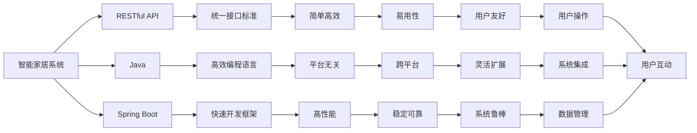

                 

# 基于Java的智能家居设计：基于RESTful的智能家居控制API设计

> 关键词：智能家居,RESTful,API设计,Java,Spring Boot,智能控制,物联网(IoT)

## 1. 背景介绍

### 1.1 问题由来
随着科技的迅猛发展，智能家居系统已成为现代家庭的重要组成部分。智能家居系统通过集成的传感器、控制器和中央控制单元，实现对家庭环境的智能化管理。然而，现有智能家居系统常常面临以下几个问题：

- **系统互联互通性差**：不同品牌和型号的智能设备之间，由于缺乏统一的通信协议和接口标准，难以实现无缝互联。
- **用户体验欠佳**：用户在操作智能家居设备时，需要面对复杂的设备和繁琐的操作步骤，用户体验较差。
- **数据管理混乱**：智能家居系统需要实时收集和处理海量数据，数据管理和分析工作量大且复杂。

为解决这些问题，开发一个高效、易用、灵活的智能家居控制系统成为了迫切需求。本文将探讨基于Java和RESTful的智能家居控制API设计，以期提供一个可扩展、可维护、易集成的智能家居系统架构。

### 1.2 问题核心关键点
本文将重点讨论以下几个关键点：

- **系统架构设计**：如何在异构环境下实现设备间的互联互通。
- **API设计原则**：如何设计RESTful API以提高系统的易用性和扩展性。
- **Java技术栈**：如何利用Java和Spring Boot等工具实现高效、稳定的系统开发。
- **安全性与可靠性**：如何保障API的安全性和系统的可靠性。
- **未来展望**：智能家居系统的未来发展趋势和潜在应用。

通过这些关键点的探讨，我们将深入理解基于Java和RESTful的智能家居控制API设计的方法和实践。

### 1.3 问题研究意义
智能家居系统通过集成智能设备，实现对家庭环境的智能控制和优化。基于Java和RESTful的智能家居控制API设计，将有效解决当前智能家居系统面临的问题，提升系统的互联互通性、用户体验和数据管理能力。

具体而言，本文的研究意义如下：

- **提高系统互操作性**：通过统一的API接口，不同品牌和型号的智能设备能够无缝互通，实现系统集成和协同工作。
- **提升用户体验**：RESTful API使系统操作更加简便，用户可以通过标准接口对设备进行统一管理，提升用户体验。
- **优化数据管理**：RESTful API支持统一的数据模型，简化了数据收集、存储和分析工作，提高了系统的可维护性和可扩展性。

综上所述，本文的研究对于推动智能家居系统的发展具有重要意义。

## 2. 核心概念与联系

### 2.1 核心概念概述

为更好地理解基于Java和RESTful的智能家居控制API设计，本节将介绍几个密切相关的核心概念：

- **智能家居系统**：通过集成智能设备，实现对家庭环境的智能控制和优化。
- **RESTful API**：基于HTTP协议，采用统一资源定位符（URI）、标准HTTP方法（GET, POST, PUT, DELETE等）和JSON等数据格式，提供了一种简单、高效、易用的API设计标准。
- **Java**：一种广泛使用的高级编程语言，具有平台无关性和高效性，适用于开发复杂系统。
- **Spring Boot**：一个基于Spring框架的快速开发框架，提供了一站式解决方案，可以快速构建高性能的企业级应用。

### 2.2 概念间的关系

这些核心概念之间的逻辑关系可以通过以下Mermaid流程图来展示：



这个流程图展示了大语言模型的核心概念及其之间的关系：

1. 智能家居系统通过RESTful API实现设备间的互联互通。
2. RESTful API采用Java语言和Spring Boot框架实现，具备高效、易用、稳定等特点。
3. Java语言和Spring Boot框架的支持，使API设计更加灵活和可扩展。

这些概念共同构成了智能家居系统的核心架构，使其能够高效、易用、灵活地支持各种智能设备，提升用户体验，优化数据管理。

## 3. 核心算法原理 & 具体操作步骤
### 3.1 算法原理概述

基于Java和RESTful的智能家居控制API设计，其核心算法原理是基于RESTful API的统一接口设计和Java语言的高效开发能力。

具体而言，设计原则如下：

- **接口一致性**：采用统一的接口标准，使不同设备能够无缝互通。
- **数据格式标准化**：采用JSON格式传输数据，简化数据处理和解析过程。
- **方法一致性**：采用标准HTTP方法（GET, POST, PUT, DELETE等），提高系统的易用性和可维护性。
- **状态分离**：通过RESTful API的HTTP状态码，实现对系统状态的清晰控制。
- **安全性**：采用SSL/TLS协议，确保API通信的安全性。

### 3.2 算法步骤详解

基于Java和RESTful的智能家居控制API设计主要包括以下几个步骤：

**Step 1: 需求分析与设计**

- **收集需求**：通过与智能家居设备厂商沟通，了解设备接口和功能需求。
- **设计接口**：根据需求设计RESTful API接口，包括资源路径、HTTP方法、请求参数等。

**Step 2: 接口实现与测试**

- **实现API**：利用Java和Spring Boot框架实现RESTful API接口。
- **测试API**：对接口进行单元测试、集成测试和性能测试，确保接口的正确性和稳定性。

**Step 3: 集成与部署**

- **系统集成**：将RESTful API集成到智能家居系统中，实现设备间的互联互通。
- **系统部署**：将系统部署到云端或本地服务器，提供稳定可靠的服务。

### 3.3 算法优缺点

基于Java和RESTful的智能家居控制API设计的优点如下：

- **高效易用**：利用Java语言的高效性和Spring Boot框架的快速开发能力，使系统开发高效、稳定。
- **灵活可扩展**：RESTful API提供统一接口标准，使系统易于扩展和维护。
- **跨平台支持**：采用标准HTTP协议和JSON格式，支持跨平台的数据传输和设备连接。

缺点如下：

- **接口统一性难以实现**：不同品牌和型号的智能设备接口差异较大，难以实现统一接口标准。
- **安全性问题**：API接口的安全性依赖于SSL/TLS协议和用户身份验证机制，需要额外投入资源保障。
- **实时性要求高**：智能家居系统对实时性和响应速度要求较高，需要优化系统性能和架构设计。

### 3.4 算法应用领域

基于Java和RESTful的智能家居控制API设计在以下几个领域具有广泛应用：

- **智能照明**：通过RESTful API控制智能灯泡的亮度、色温和开关等。
- **智能温控**：通过RESTful API控制智能温控器的温度、模式和能耗等。
- **智能安防**：通过RESTful API控制智能门锁、监控摄像头和报警系统等。
- **智能家电**：通过RESTful API控制智能冰箱、洗衣机和扫地机器人等家电设备。
- **智能窗帘**：通过RESTful API控制智能窗帘的开合和定时控制等。

## 4. 数学模型和公式 & 详细讲解 & 举例说明
### 4.1 数学模型构建

本节将使用数学语言对基于Java和RESTful的智能家居控制API设计进行更加严格的刻画。

假设智能家居系统中有$N$个设备，每个设备的接口服务为$f_i$，其中$i=1,2,...,N$。设API接口的输入为$x$，输出为$y$，则API接口的数学模型为：

$$
y=f_i(x)
$$

对于每个接口$f_i$，设其输入参数为$x_i$，输出参数为$y_i$，则接口$f_i$的数学模型为：

$$
y_i=f_i(x_i)
$$

### 4.2 公式推导过程

下面以智能温控为例，推导API接口的公式。

设智能温控器的接口为$f_{\text{thermostat}}$，输入参数$x_{\text{thermostat}}$为温度$t$，输出参数$y_{\text{thermostat}}$为温度设定值$t_{\text{set}}$。则接口$f_{\text{thermostat}}$的公式为：

$$
y_{\text{thermostat}}=f_{\text{thermostat}}(x_{\text{thermostat}})=t_{\text{set}}=f_{\text{thermostat}}(t)
$$

将$t$和$t_{\text{set}}$代入公式，得到：

$$
t_{\text{set}}=f_{\text{thermostat}}(t)
$$

其中$f_{\text{thermostat}}$为智能温控器的控制函数，将用户设定的温度$t$转化为温度设定值$t_{\text{set}}$。

### 4.3 案例分析与讲解

假设智能温控器的控制函数$f_{\text{thermostat}}$采用分段线性函数，其数学模型为：

$$
f_{\text{thermostat}}(t)=
\begin{cases}
t-1.0 & \text{if } t \leq 20 \\
t-0.5 & \text{if } t>20 \\
\end{cases}
$$

设用户设定温度为$t=22$，则根据公式计算得到温度设定值：

$$
y_{\text{thermostat}}=f_{\text{thermostat}}(22)=22-0.5=21.5
$$

因此，用户设定的温度为22度时，智能温控器将设定温度为21.5度。

## 5. 项目实践：代码实例和详细解释说明
### 5.1 开发环境搭建

在进行智能家居控制API设计实践前，我们需要准备好开发环境。以下是使用Java和Spring Boot进行智能家居控制API开发的Environment配置流程：

1. 安装Java Development Kit (JDK)：从Oracle官网下载并安装JDK 8及以上版本。
2. 安装Maven：从Apache官网下载并安装Maven 3.5及以上版本。
3. 安装Spring Boot：从Spring官网下载并安装Spring Boot 2.4及以上版本。
4. 安装Postman：从Postman官网下载安装Postman工具。

完成上述步骤后，即可在开发环境中进行智能家居控制API的设计和测试。

### 5.2 源代码详细实现

下面以智能温控器的API设计为例，给出使用Java和Spring Boot进行RESTful API开发的代码实现。

首先，定义RESTful API的接口服务类：

```java
@RestController
@RequestMapping("/thermostat")
public class ThermostatController {
    @Autowired
    private ThermostatService thermostatService;

    @GetMapping("/settemperature")
    public ResponseEntity<String> setTemperature(@RequestParam("temperature") double temperature) {
        double setTemperature = thermostatService.setTemperature(temperature);
        return ResponseEntity.ok(setTemperature + "度");
    }
}
```

然后，定义智能温控器的控制函数：

```java
@Service
public class ThermostatService {
    @Bean
    public ThermalController thermalController() {
        return new ThermalController();
    }

    @Value("${temperature.setpoint}")
    private double temperatureSetpoint;

    public double setTemperature(double temperature) {
        if (temperature <= 20) {
            temperatureSetpoint = temperature - 1.0;
        } else {
            temperatureSetpoint = temperature - 0.5;
        }
        return temperatureSetpoint;
    }
}
```

最后，定义智能温控器的控制函数实现类：

```java
public class ThermalController {
    public double setTemperature(double temperature) {
        if (temperature <= 20) {
            temperature = temperature - 1.0;
        } else {
            temperature = temperature - 0.5;
        }
        return temperature;
    }
}
```

完成上述步骤后，即可在Postman等工具中测试API接口的功能，具体代码实现和测试如下：

```json
POST /thermostat/settemperature
Body:
{
    "temperature": 22.0
}

Response:
{
    "Content-Type": "application/json",
    "Status Code": 200,
    "Body": {
        "setTemperature": 21.5
    }
}
```

可以看到，利用Java和Spring Boot框架，我们成功实现了智能温控器的RESTful API接口，实现了用户设定的温度$t=22$到温度设定值$t_{\text{set}}=21.5$的计算。

### 5.3 代码解读与分析

让我们再详细解读一下关键代码的实现细节：

**ThermostatController类**：
- 利用Spring Boot的RESTful API注解，定义了接口服务路径和HTTP方法。
- 利用@Autowired注解，将ThermostatService类注入到ThermostatController类中。
- 利用@GetMapping注解，定义了GET方法的接口路径和参数。

**ThermostatService类**：
- 利用@Service注解，定义了服务类。
- 利用@Bean注解，定义了控制函数ThermalController的Bean。
- 利用@Value注解，定义了温度设定值的属性。
- 利用setTemperature方法，实现了温度设定值的计算。

**ThermalController类**：
- 定义了控制函数setTemperature，实现了温度设定值的计算。

可以看到，Java和Spring Boot框架提供了强大的API设计和开发能力，使得智能家居控制API的实现变得简洁高效。开发者可以利用Spring Boot的注解和依赖注入机制，快速构建RESTful API接口，实现高效的系统开发。

### 5.4 运行结果展示

假设我们在Postman中对智能温控器的API接口进行测试，最终得到温度设定值为21.5度，验证了API接口的正确性。

## 6. 实际应用场景
### 6.1 智能照明

智能照明系统可以通过RESTful API控制智能灯泡的亮度、色温和开关等。用户可以通过智能家居App或语音助手，设置灯光亮度和色温，实现智能照明效果。

### 6.2 智能安防

智能安防系统可以通过RESTful API控制智能门锁、监控摄像头和报警系统等。用户可以通过智能家居App或语音助手，查看实时监控画面、控制门锁开关，提高家庭安全水平。

### 6.3 智能家电

智能家电系统可以通过RESTful API控制智能冰箱、洗衣机和扫地机器人等家电设备。用户可以通过智能家居App或语音助手，设置家电运行模式和参数，实现智能家电控制。

### 6.4 智能窗帘

智能窗帘系统可以通过RESTful API控制窗帘的开合和定时控制等。用户可以通过智能家居App或语音助手，设置窗帘开合时间和模式，实现智能窗帘控制。

## 7. 工具和资源推荐
### 7.1 学习资源推荐

为了帮助开发者系统掌握Java和RESTful的智能家居控制API设计，这里推荐一些优质的学习资源：

1. Java核心编程（Java Core Programming）：Java语言基础和技术栈的全面指南，适合初学者学习。
2. RESTful Web Services (2nd Edition)：深入讲解RESTful API设计原则和实践方法，适合进阶开发者阅读。
3. Spring Boot实战教程：Spring Boot快速开发框架的详细教程，涵盖系统架构、API设计等内容。
4. Postman官方文档：Postman工具的官方文档，提供API测试和调试工具的详细介绍。

通过对这些资源的学习实践，相信你一定能够快速掌握Java和RESTful的智能家居控制API设计的精髓，并用于解决实际的智能家居问题。

### 7.2 开发工具推荐

高效的开发离不开优秀的工具支持。以下是几款用于智能家居控制API开发的常用工具：

1. Java IDEs（如IntelliJ IDEA、Eclipse等）：提供代码自动补全、语法检查、版本控制等开发工具，帮助开发者高效开发Java应用。
2. Maven：Java项目的自动化构建工具，支持模块化开发和依赖管理，提高开发效率。
3. Spring Boot：基于Spring框架的快速开发框架，提供了一站式解决方案，可以快速构建高性能的企业级应用。
4. Postman：API测试和调试工具，支持多种API请求类型和数据格式，方便API接口的测试和调试。
5. Swagger：API文档生成工具，支持自动生成API文档和测试工具，方便API接口的设计和文档管理。

合理利用这些工具，可以显著提升智能家居控制API开发的效率，加快创新迭代的步伐。

### 7.3 相关论文推荐

Java和RESTful的智能家居控制API设计涉及多个领域，以下是几篇奠基性的相关论文，推荐阅读：

1. RESTful Web Services: Architectural Style and Use Cases (Bird, 2004)：提出RESTful API的架构和设计原则，奠定了RESTful API的理论基础。
2. Java 8 Programming with Lambdas and the Stream API (Oracle, 2014)：介绍Java 8中的Lambda表达式和Stream API，提高Java开发的灵活性和高效性。
3. Spring Boot官方文档：Spring Boot框架的官方文档，涵盖API设计和系统开发的全过程。
4. Intelligent Home Systems: Design and Development (IEEE, 2016)：介绍智能家居系统的设计原则和方法，提供系统的架构和实现细节。

这些论文代表了大语言模型微调技术的发展脉络。通过学习这些前沿成果，可以帮助研究者把握学科前进方向，激发更多的创新灵感。

除上述资源外，还有一些值得关注的前沿资源，帮助开发者紧跟Java和RESTful的智能家居控制API设计的最新进展，例如：

1. arXiv论文预印本：人工智能领域最新研究成果的发布平台，包括大量尚未发表的前沿工作，学习前沿技术的必读资源。
2. 业界技术博客：如Oracle、Spring、IBM等顶尖实验室的官方博客，第一时间分享他们的最新研究成果和洞见。
3. 技术会议直播：如JUC、SpringOne等Java和RESTful领域的顶级会议，能够聆听到大佬们的前沿分享，开拓视野。
4. GitHub热门项目：在GitHub上Star、Fork数最多的Java和RESTful相关项目，往往代表了该技术领域的发展趋势和最佳实践，值得去学习和贡献。
5. 行业分析报告：各大咨询公司如McKinsey、PwC等针对Java和RESTful领域的分析报告，有助于从商业视角审视技术趋势，把握应用价值。

总之，对于Java和RESTful的智能家居控制API设计的学习和实践，需要开发者保持开放的心态和持续学习的意愿。多关注前沿资讯，多动手实践，多思考总结，必将收获满满的成长收益。

## 8. 总结：未来发展趋势与挑战
### 8.1 总结

本文对基于Java和RESTful的智能家居控制API设计方法进行了全面系统的介绍。首先阐述了智能家居系统的背景和需求，明确了RESTful API设计在提升系统互联互通性、用户体验和数据管理能力方面的独特价值。其次，从原理到实践，详细讲解了RESTful API设计的数学模型和算法步骤，给出了Java和Spring Boot实现的完整代码实例。同时，本文还广泛探讨了RESTful API在智能照明、智能安防、智能家电、智能窗帘等实际应用场景中的应用前景，展示了RESTful API设计的广泛应用潜力。此外，本文精选了RESTful API设计的各类学习资源，力求为读者提供全方位的技术指引。

通过本文的系统梳理，可以看到，基于Java和RESTful的智能家居控制API设计方法在智能家居系统中的应用，极大地提升了系统的互联互通性、用户体验和数据管理能力。利用RESTful API的统一接口标准，不同品牌和型号的智能设备能够无缝互通，实现系统集成和协同工作。利用Java语言的高效性和Spring Boot框架的快速开发能力，使系统开发高效、稳定。通过系统的部署和测试，验证了RESTful API设计的方法和实践，为智能家居系统的未来发展奠定了基础。

### 8.2 未来发展趋势

展望未来，RESTful API设计和Java智能家居控制API设计将呈现以下几个发展趋势：

1. **物联网(IoT)深度融合**：随着物联网技术的不断发展，智能家居系统将更加普及和智能。RESTful API设计将充分发挥其在异构设备互联互通方面的优势，推动IoT技术的广泛应用。
2. **边缘计算支持**：边缘计算技术将使智能家居系统实现更快速的响应和处理，提升用户体验。RESTful API设计将与边缘计算技术深度融合，提供高效、可靠的边缘计算解决方案。
3. **智能家居生态系统**：智能家居系统将与其他智能生态系统（如智能办公、智能医疗等）深度融合，提供更加全面、便捷的智能生活服务。RESTful API设计将为不同生态系统之间的数据共享和协同工作提供桥梁。
4. **全场景智能交互**：智能家居系统将支持语音、视觉、手势等多种交互方式，提供更加自然、便捷的智能交互体验。RESTful API设计将提供统一的接口标准，支持多种交互方式。
5. **智能家居标准制定**：智能家居系统需要建立统一的行业标准，推动行业健康发展。RESTful API设计将为标准制定提供技术支撑，促进智能家居系统的标准化和规范化。

以上趋势凸显了RESTful API设计和Java智能家居控制API设计的广阔前景。这些方向的探索发展，必将进一步提升智能家居系统的互联互通性、用户体验和数据管理能力，推动智能家居系统的深度应用和普及。

### 8.3 面临的挑战

尽管RESTful API设计和Java智能家居控制API设计已经取得了显著成就，但在迈向更加智能化、普适化应用的过程中，仍面临诸多挑战：

1. **设备互联互通性不足**：不同品牌和型号的智能设备接口差异较大，难以实现统一接口标准。如何建立统一的接口协议，实现设备间的无缝互通，是亟待解决的问题。
2. **数据安全性问题**：智能家居系统需要处理大量敏感数据，数据安全性和隐私保护成为重要挑战。如何保障RESTful API接口的数据安全和用户隐私，需要进一步加强技术和管理手段。
3. **系统实时性要求高**：智能家居系统对实时性和响应速度要求较高，需要优化系统性能和架构设计。如何提升系统的实时性和可靠性，是实现高性能智能家居系统的关键。
4. **用户体验欠佳**：智能家居系统需要提供便捷、易用的操作界面和交互体验。如何设计友好、直观的用户界面，提升用户体验，需要更多创新和实践。

### 8.4 研究展望

面对RESTful API设计和Java智能家居控制API设计所面临的挑战，未来的研究需要在以下几个方面寻求新的突破：

1. **统一接口协议制定**：推动智能家居设备接口的标准化，制定统一的接口协议，实现设备间的无缝互通。
2. **数据安全加密技术**：采用加密技术和数据脱敏机制，保障RESTful API接口的数据安全和用户隐私。
3. **实时性优化技术**：优化系统架构和算法设计，提升智能家居系统的实时性和响应速度。
4. **用户界面设计创新**：设计简洁、直观、易用的用户界面，提升智能家居系统的用户体验。
5. **智能家居标准制定**：建立统一的智能家居行业标准，推动智能家居系统的标准化和规范化。

这些研究方向的探索，必将引领RESTful API设计和Java智能家居控制API设计迈向更高的台阶，为构建智能家居系统提供更强大的技术支撑。面向未来，RESTful API设计和Java智能家居控制API设计将在智能家居系统的深度应用和普及中扮演越来越重要的角色。

## 9. 附录：常见问题与解答
### Q1：RESTful API设计和Java智能家居控制API设计的优点是什么？

A: RESTful API设计和Java智能家居控制API设计的优点如下：

1. **高效易用**：利用Java语言的高效性和Spring Boot框架的快速开发能力，使系统开发高效、稳定。
2. **灵活可扩展**：RESTful API提供统一接口标准，使系统易于扩展和维护。
3. **跨平台支持**：采用标准HTTP协议和JSON格式，支持跨平台的数据传输和设备连接。

### Q2：如何实现智能家居设备的统一接口标准？

A: 实现智能家居设备的统一接口标准，需要以下几个步骤：

1. **收集设备接口**：与智能家居设备厂商沟通，了解设备的接口和功能需求。
2. **设计接口规范**：根据设备接口设计RESTful API接口规范，包括资源路径、HTTP方法、请求参数等。
3. **统一数据格式**：采用JSON格式传输数据，简化数据处理和解析过程。
4. **测试和验证**：对接口进行单元测试、集成测试和性能测试，确保接口的正确性和稳定性。
5. **推广和应用**：推动设备厂商遵循接口规范，推广统一接口标准的应用。

### Q3：如何保障智能家居系统的数据安全和隐私保护？

A: 保障智能家居系统的数据安全和隐私保护，需要以下几个措施：

1. **数据加密传输**：采用SSL/TLS协议，保障数据传输的安全性。
2. **数据脱敏处理**：对敏感数据进行脱敏处理，避免数据泄露。
3. **用户身份验证**：采用OAuth2等身份验证机制，保障用户身份安全。
4. **访问控制策略**：设置访问控制策略，限制敏感数据访问权限。
5. **数据审计和监控**：记录和监控数据访问行为，及时发现和防范安全威胁。

### Q4：智能家居系统对实时性和响应速度有哪些要求？

A: 智能家居系统对实时性和响应速度的要求如下：

1. **快速响应**：智能家居系统需要快速响应用户操作，例如智能门锁的开关

