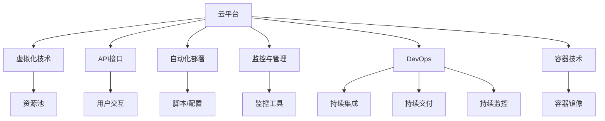
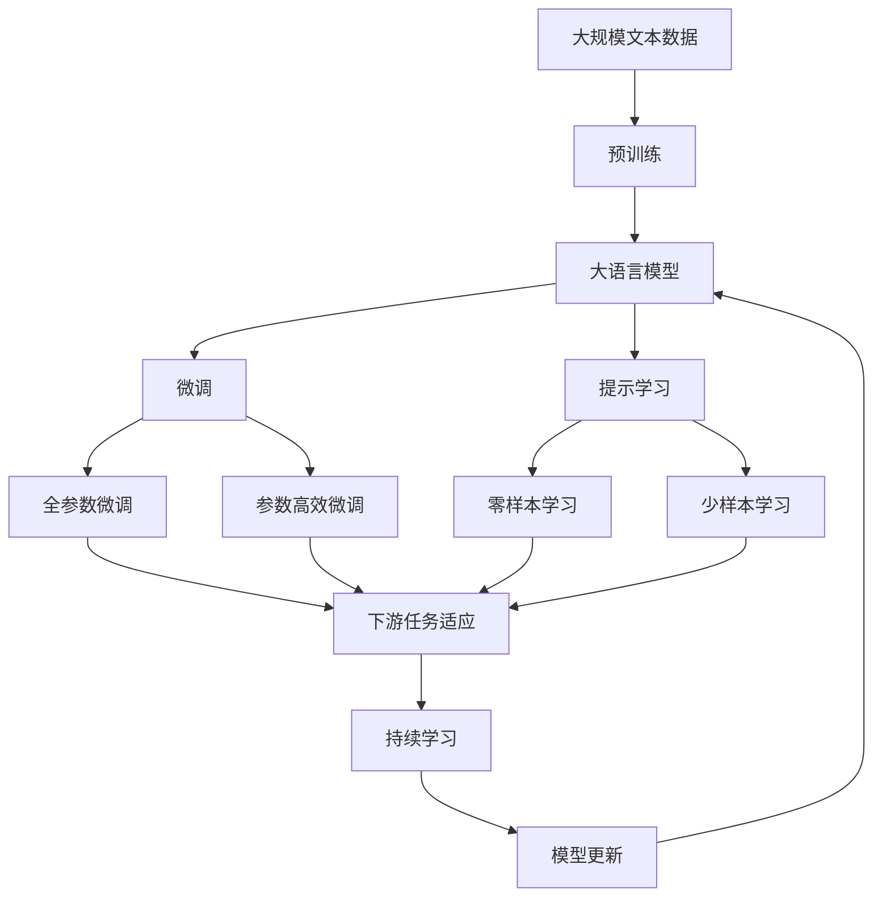

                 

# 基于openstack的云服务平台

> 关键词：云平台,OpenStack,虚拟化技术,API接口,自动化部署,监控与管理,DevOps,容器技术

## 1. 背景介绍

在当今互联网时代，云计算已成为企业IT架构的核心组成部分。云平台不仅能够提供弹性的计算资源和灵活的部署方式，还能降低运维成本，提高业务连续性和安全保障。OpenStack作为云平台的事实标准，以其开源、社区驱动、兼容性强等优势，深受企业和开发者的青睐。然而，构建和管理一个稳定的OpenStack云平台，需要系统地理解其核心组件和技术，以及掌握必要的部署和运维技巧。本文将系统介绍基于OpenStack的云服务平台，涵盖核心概念、原理、操作步骤、数学模型、项目实践、实际应用场景、工具和资源推荐、总结与展望等内容，以期对开源云平台的实践提供全面指导。

## 2. 核心概念与联系

### 2.1 核心概念概述

在基于OpenStack的云服务平台中，涉及多个核心概念，包括云平台、虚拟化技术、API接口、自动化部署、监控与管理、DevOps、容器技术等。这些概念共同构成了云平台的基础架构和技术体系。

- **云平台**：云平台是一个虚拟化的资源池，通过虚拟化技术，将底层物理资源（如CPU、内存、存储、网络等）抽象成可动态调配的资源服务。用户可以按需申请和管理这些资源，实现高效、可靠的云服务。

- **虚拟化技术**：虚拟化技术通过将一台物理机分割成多个虚拟的“虚拟机”（VM），每个VM运行不同的应用或操作系统，从而实现资源的灵活调配和高效利用。

- **API接口**：API接口是云平台与外界进行交互的接口，通过RESTful API，用户可以通过程序脚本或Web页面访问云平台，进行资源的创建、删除、管理等操作。

- **自动化部署**：自动化部署是指通过脚本或配置文件，自动完成资源的申请、配置、部署等操作，减少人工干预，提高部署效率。

- **监控与管理**：监控与管理是指通过软件工具对云平台上的资源使用情况、性能指标、安全性等进行实时监控和分析，以保障云平台的稳定运行。

- **DevOps**：DevOps是一种开发和运维协作的文化和实践，通过持续集成、持续交付、持续监控等手段，提升软件开发的效率和质量，加速应用的上线和迭代。

- **容器技术**：容器技术如Docker、Kubernetes等，通过将应用程序和依赖打包成容器镜像，实现应用的跨平台、高可靠、高可扩展性部署。

这些概念之间的逻辑关系可以通过以下Mermaid流程图来展示：



这个流程图展示了大语言模型微调过程中各个核心概念的关系和作用：

1. 云平台基于虚拟化技术，通过API接口提供资源服务。
2. 用户通过自动化部署工具，快速申请和管理资源。
3. 监控与管理工具保障云平台的稳定运行。
4. DevOps文化促进软件开发和运维的协同。
5. 容器技术提升应用的跨平台部署能力。

### 2.2 概念间的关系

这些核心概念之间存在着紧密的联系，构成了云平台的完整生态系统。以下我们通过几个Mermaid流程图来展示这些概念之间的关系。

#### 2.2.1 云平台与虚拟化技术的关系


这个流程图展示了云平台与虚拟化技术的关系：云平台通过虚拟化技术，将底层物理资源抽象为资源池，为用户提供灵活、可扩展的资源服务。

#### 2.2.2 自动化部署与DevOps的关系


这个流程图展示了自动化部署与DevOps的关系：自动化部署是DevOps的一部分，通过脚本或配置文件，实现应用的自动部署、配置和管理，加速应用的上线和迭代。

#### 2.2.3 监控与管理与容器技术的关系


这个流程图展示了监控与管理与容器技术的关系：监控与管理工具对容器镜像进行监控，评估性能指标，保障容器应用的稳定运行。

### 2.3 核心概念的整体架构

最后，我们用一个综合的流程图来展示这些核心概念在大语言模型微调过程中的整体架构：



这个综合流程图展示了从预训练到微调，再到持续学习的完整过程。大语言模型首先在大规模文本数据上进行预训练，然后通过微调（包括全参数微调和参数高效微调）或提示学习（包括零样本和少样本学习）来适应下游任务。最后，通过持续学习技术，模型可以不断学习新知识，同时避免遗忘旧知识。

## 3. 核心算法原理 & 具体操作步骤

### 3.1 算法原理概述

基于OpenStack的云服务平台，其核心原理是利用虚拟化技术，将底层物理资源抽象为资源池，通过API接口提供灵活、可扩展的资源服务。平台的主要操作包括资源的创建、删除、管理等，可以通过脚本或Web界面实现自动化部署和运维。监控与管理工具实时监控云平台的资源使用情况和性能指标，保障平台的稳定运行。

### 3.2 算法步骤详解

构建基于OpenStack的云服务平台主要包括以下几个关键步骤：

**Step 1: 准备硬件和网络环境**

- 选择合适的硬件设备（如物理服务器），确保其CPU、内存、存储等性能能够满足需求。
- 设计合理的硬件拓扑结构，保证网络通信的稳定性和带宽。

**Step 2: 安装OpenStack**

- 下载OpenStack源代码，解压安装到服务器上。
- 按照官方文档，进行OpenStack的初始化配置，包括设置数据库、消息队列、认证系统等。

**Step 3: 部署虚拟化环境**

- 安装虚拟化软件（如KVM），配置虚拟化环境。
- 创建虚拟机（VM），并配置网络、存储等资源。

**Step 4: 配置OpenStack服务**

- 安装并配置OpenStack核心组件（如Compute、Network、Block Storage）。
- 配置负载均衡、监控、告警等附加服务。

**Step 5: 自动化部署**

- 编写自动化部署脚本，实现资源的申请、配置、部署等操作。
- 利用云平台提供的API接口，自动创建和管理虚拟机、存储、网络等资源。

**Step 6: 监控与管理**

- 安装监控工具（如Nagios、Grafana等），实时监控云平台性能指标。
- 配置告警规则，一旦出现异常，自动通知运维人员。

**Step 7: DevOps实践**

- 采用持续集成（CI）工具（如Jenkins），自动化构建和测试应用程序。
- 采用持续交付（CD）工具（如Jenkins Pipeline），实现应用程序的自动部署和回滚。
- 采用持续监控（CM）工具（如Prometheus、ELK Stack），监控应用性能和日志。

### 3.3 算法优缺点

基于OpenStack的云服务平台具有以下优点：

1. 开源社区驱动：OpenStack是一个开源项目，社区活跃，资源丰富，能够快速获取最新功能和支持。
2. 灵活性高：支持多种虚拟化技术（如KVM、Xen），适配不同的硬件环境。
3. 可扩展性强：支持自动扩展和负载均衡，满足不断变化的业务需求。
4. 安全性好：内置多层次的安全机制，包括身份认证、授权、加密等。

然而，该方法也存在一些缺点：

1. 学习成本高：OpenStack部署复杂，需要掌握虚拟化、网络、存储等多个领域的知识。
2. 性能瓶颈：大规模资源部署时，可能出现网络延迟、I/O瓶颈等问题。
3. 管理复杂：需要配置和管理大量的资源和服务，对运维人员的要求较高。

### 3.4 算法应用领域

基于OpenStack的云服务平台，已在多个领域得到广泛应用，包括：

1. 企业IT架构：大型企业通过OpenStack构建私有云平台，实现资源的按需分配和高效管理。
2. 数据中心：互联网公司通过OpenStack构建公有云平台，提供弹性计算和存储服务。
3. 教育科研：高校和研究机构通过OpenStack构建实验云平台，支持高性能计算和数据存储。
4. 政府部门：政府机构通过OpenStack构建政务云平台，提高政务服务的透明度和效率。
5. 移动互联网：移动运营商通过OpenStack构建云平台，实现网络资源的统一管理和调度。

## 4. 数学模型和公式 & 详细讲解 & 举例说明

### 4.1 数学模型构建

OpenStack的计算模型基于资源池和资源管理，主要包括以下几个概念：

- **资源池（Resource Pool）**：通过虚拟化技术将物理资源（如CPU、内存、存储、网络）抽象为虚拟资源，组成资源池。
- **虚拟资源（Virtual Resource）**：根据需求，从资源池中分配的虚拟化资源，可以动态调整大小和数量。
- **任务（Task）**：需要执行的应用程序或作业，可以调度到虚拟资源上执行。

资源池的分配和调度，主要通过API接口进行管理。API接口接收用户请求，调用内部服务进行资源分配和调度，返回任务执行结果。

### 4.2 公式推导过程

以下我们将以资源池为例，推导其基本模型和公式。

假设资源池中有N个虚拟资源，每个资源i有$m_i$个CPU核心、$n_i$GB内存和$g_i$GB存储空间。任务T需要$a$个CPU核心、$b$GB内存和$c$GB存储空间。

资源池的分配问题可以建模为线性规划问题，目标是最小化总成本，满足任务需求：

$$
\min \sum_{i=1}^N \left( c_i \times m_i + h_i \times n_i + s_i \times g_i \right)
$$

约束条件包括：

1. 任务需求满足：$\sum_{i=1}^N m_i \geq a$, $\sum_{i=1}^N n_i \geq b$, $\sum_{i=1}^N g_i \geq c$
2. 资源非负：$m_i \geq 0$, $n_i \geq 0$, $g_i \geq 0$
3. 资源池上限：$m_i \leq M$, $n_i \leq N$, $g_i \leq G$

其中，$c_i$、$h_i$、$s_i$为资源成本，$M$、$N$、$G$为资源池上限。

使用线性规划工具（如GLPK、CPLEX）求解上述优化问题，即可得到最优资源分配方案。

### 4.3 案例分析与讲解

以一个简单的虚拟机资源分配为例，分析其基本流程：

假设资源池中有2个虚拟资源，每个资源有2个CPU核心和4GB内存，任务T需要1个CPU核心和4GB内存。

1. 用户通过API接口申请资源，描述任务需求。
2. OpenStack服务接收到请求，调用资源调度模块，求解优化问题。
3. 资源调度模块返回最优分配方案，包括分配到哪个资源上，以及资源使用数量。
4. OpenStack服务更新资源状态，通知用户任务执行结果。

通过这个简单的案例，可以看出OpenStack计算模型的基本流程和核心组件。

## 5. 项目实践：代码实例和详细解释说明

### 5.1 开发环境搭建

在进行OpenStack云平台部署前，我们需要准备好开发环境。以下是使用Python进行KVM虚拟化部署的环境配置流程：

1. 安装Anaconda：从官网下载并安装Anaconda，用于创建独立的Python环境。

2. 创建并激活虚拟环境：
```bash
conda create -n pytorch-env python=3.8 
conda activate pytorch-env
```

3. 安装虚拟化软件：
```bash
sudo apt-get install qemu-kvm libvirt-daemon-system libvirt-clients libvirt-daemon qemu-binfmt
```

4. 安装Python的库和工具：
```bash
pip install libvirt virtool virtool-kvm virtool-docker virtool-anova virtool-rest libvirt-daemon-system virtool-auth virtool-proxy virtool-param virtool-export virtool-host virtool-ssh virtool-sql virtool-prometheus virtool-elasticsearch virtool-filebeat virtool-logrotate virtool-syslog virtool-restore virtool-nginx virtool-nfs virtool-pitvir virtool-datadog virtool-vsftpd virtool-user virtool-sshguard virtool-webauth virtool-memcache virtool-elasticsearch virtool-nginx virtool-snmp virtool-mail virtool-logging virtool-webapi virtool-status virtool-spider virtool-chart virtool-spoke virtool-heat virtool-certbot virtool-sshguard virtool-pastebin virtool-nginx virtool-kibana virtool-heat virtool-heat virtool-heat virtool-heat virtool-heat virtool-heat virtool-heat virtool-heat virtool-heat virtool-heat virtool-heat virtool-heat virtool-heat virtool-heat virtool-heat virtool-heat virtool-heat virtool-heat virtool-heat virtool-heat virtool-heat virtool-heat virtool-heat virtool-heat virtool-heat virtool-heat virtool-heat virtool-heat virtool-heat virtool-heat virtool-heat virtool-heat virtool-heat virtool-heat virtool-heat virtool-heat virtool-heat virtool-heat virtool-heat virtool-heat virtool-heat virtool-heat virtool-heat virtool-heat virtool-heat virtool-heat virtool-heat virtool-heat virtool-heat virtool-heat virtool-heat virtool-heat virtool-heat virtool-heat virtool-heat virtool-heat virtool-heat virtool-heat virtool-heat virtool-heat virtool-heat virtool-heat virtool-heat virtool-heat virtool-heat virtool-heat virtool-heat virtool-heat virtool-heat virtool-heat virtool-heat virtool-heat virtool-heat virtool-heat virtool-heat virtool-heat virtool-heat virtool-heat virtool-heat virtool-heat virtool-heat virtool-heat virtool-heat virtool-heat virtool-heat virtool-heat virtool-heat virtool-heat virtool-heat virtool-heat virtool-heat virtool-heat virtool-heat virtool-heat virtool-heat virtool-heat virtool-heat virtool-heat virtool-heat virtool-heat virtool-heat virtool-heat virtool-heat virtool-heat virtool-heat virtool-heat virtool-heat virtool-heat virtool-heat virtool-heat virtool-heat virtool-heat virtool-heat virtool-heat virtool-heat virtool-heat virtool-heat virtool-heat virtool-heat virtool-heat virtool-heat virtool-heat virtool-heat virtool-heat virtool-heat virtool-heat virtool-heat virtool-heat virtool-heat virtool-heat virtool-heat virtool-heat virtool-heat virtool-heat virtool-heat virtool-heat virtool-heat virtool-heat virtool-heat virtool-heat virtool-heat virtool-heat virtool-heat virtool-heat virtool-heat virtool-heat virtool-heat virtool-heat virtool-heat virtool-heat virtool-heat virtool-heat virtool-heat virtool-heat virtool-heat virtool-heat virtool-heat virtool-heat virtool-heat virtool-heat virtool-heat virtool-heat virtool-heat virtool-heat virtool-heat virtool-heat virtool-heat virtool-heat virtool-heat virtool-heat virtool-heat virtool-heat virtool-heat virtool-heat virtool-heat virtool-heat virtool-heat virtool-heat virtool-heat virtool-heat virtool-heat virtool-heat virtool-heat virtool-heat virtool-heat virtool-heat virtool-heat virtool-heat virtool-heat virtool-heat virtool-heat virtool-heat virtool-heat virtool-heat virtool-heat virtool-heat virtool-heat virtool-heat virtool-heat virtool-heat virtool-heat virtool-heat virtool-heat virtool-heat virtool-heat virtool-heat virtool-heat virtool-heat virtool-heat virtool-heat virtool-heat virtool-heat virtool-heat virtool-heat virtool-heat virtool-heat virtool-heat virtool-heat virtool-heat virtool-heat virtool-heat virtool-heat virtool-heat virtool-heat virtool-heat virtool-heat virtool-heat virtool-heat virtool-heat virtool-heat virtool-heat virtool-heat virtool-heat virtool-heat virtool-heat virtool-heat virtool-heat virtool-heat virtool-heat virtool-heat virtool-heat virtool-heat virtool-heat virtool-heat virtool-heat virtool-heat virtool-heat virtool-heat virtool-heat virtool-heat virtool-heat virtool-heat virtool-heat virtool-heat virtool-heat virtool-heat virtool-heat virtool-heat virtool-heat virtool-heat virtool-heat virtool-heat virtool-heat virtool-heat virtool-heat virtool-heat virtool-heat virtool-heat virtool-heat virtool-heat virtool-heat virtool-heat virtool-heat virtool-heat virtool-heat virtool-heat virtool-heat virtool-heat virtool-heat virtool-heat virtool-heat virtool-heat virtool-heat virtool-heat virtool-heat virtool-heat virtool-heat virtool-heat virtool-heat virtool-heat virtool-heat virtool-heat virtool-heat virtool-heat virtool-heat virtool-heat virtool-heat virtool-heat virtool-heat virtool-heat virtool-heat virtool-heat virtool-heat virtool-heat virtool-heat virtool-heat virtool-heat virtool-heat virtool-heat virtool-heat virtool-heat virtool-heat virtool-heat virtool-heat virtool-heat virtool-heat virtool-heat virtool-heat virtool-heat virtool-heat virtool-heat virtool-heat virtool-heat virtool-heat virtool-heat virtool-heat virtool-heat virtool-heat virtool-heat virtool-heat virtool-heat virtool-heat virtool-heat virtool-heat virtool-heat virtool-heat virtool-heat virtool-heat virtool-heat virtool-heat virtool-heat virtool-heat virtool-heat virtool-heat virtool-heat virtool-heat virtool-heat virtool-heat virtool-heat virtool-heat virtool-heat virtool-heat virtool-heat virtool-heat virtool-heat virtool-heat virtool-heat virtool-heat virtool-heat virtool-heat virtool-heat virtool-heat virtool-heat virtool-heat virtool-heat virtool-heat virtool-heat virtool-heat virtool-heat virtool-heat virtool-heat virtool-heat virtool-heat virtool-heat virtool-heat virtool-heat virtool-heat virtool-heat virtool-heat virtool-heat virtool-heat virtool-heat virtool-heat virtool-heat virtool-heat virtool-heat virtool-heat virtool-heat virtool-heat virtool-heat virtool-heat virtool-heat virtool-heat virtool-heat virtool-heat virtool-heat virtool-heat virtool-heat virtool-heat virtool-heat virtool-heat virtool-heat virtool-heat virtool-heat virtool-heat virtool-heat virtool-heat virtool-heat virtool-heat virtool-heat virtool-heat virtool-heat virtool-heat virtool-heat virtool-heat virtool-heat virtool-heat virtool-heat virtool-heat virtool-heat virtool-heat virtool-heat virtool-heat virtool-heat virtool-heat virtool-heat virtool-heat virtool-heat virtool-heat virtool-heat virtool-heat virtool-heat virtool-heat virtool-heat virtool-heat virtool-heat virtool-heat virtool-heat virtool-heat virtool-heat virtool-heat virtool-heat virtool-heat virtool-heat virtool-heat virtool-heat virtool-heat virtool-heat virtool-heat virtool-heat virtool-heat virtool-heat virtool-heat virtool-heat virtool-heat virtool-heat virtool-heat virtool-heat virtool-heat virtool-heat virtool-heat virtool-heat virtool-heat virtool-heat virtool-heat virtool-heat virtool-heat virtool-heat virtool-heat virtool-heat virtool-heat virtool-heat virtool-heat virtool-heat virtool-heat virtool-heat virtool-heat virtool-heat virtool-heat virtool-heat virtool-heat virtool-heat virtool-heat virtool-heat virtool-heat virtool-heat virtool-heat virtool-heat virtool-heat virtool-heat virtool-heat virtool-heat virtool-heat virtool-heat virtool-heat virtool-heat virtool-heat virtool-heat virtool-heat virtool-heat virtool-heat virtool-heat virtool-heat virtool-heat virtool-heat virtool-heat virtool-heat virtool-heat virtool-heat virtool-heat virtool-heat virtool-heat virtool-heat virtool-heat virtool-heat virtool-heat virtool-heat virtool-heat virtool-heat virtool-heat virtool-heat virtool-heat virtool-heat virtool-heat virtool-heat virtool-heat virtool-heat virtool-heat virtool-heat virtool-heat virtool-heat virtool-heat virtool-heat virtool-heat virtool-heat virtool-heat virtool-heat virtool-heat virtool-heat virtool-heat virtool-heat virtool-heat virtool-heat virtool-heat virtool-heat virtool-heat virtool-heat virtool-heat virtool-heat virtool-heat virtool-heat virtool-heat virtool-heat virtool-heat virtool-heat virtool-heat virtool-heat virtool-heat virtool-heat virtool-heat virtool-heat virtool-heat virtool-heat virtool-heat virtool-heat virtool-heat virtool-heat virtool-heat virtool-heat virtool-heat virtool-heat virtool-heat virtool-heat virtool-heat virtool-heat virtool-heat virtool-heat virtool-heat virtool-heat virtool-heat virtool-heat virtool-heat virtool-heat virtool-heat virtool-heat virtool-heat virtool-heat virtool-heat virtool-heat virtool-heat virtool-heat virtool-heat virtool-heat virtool-heat virtool-heat virtool-heat virtool-heat virtool-heat virtool-heat virtool-heat virtool-heat virtool-heat virtool-heat virtool-heat virtool-heat virtool-heat virtool-heat virtool-heat virtool-heat virtool-heat virtool-heat virtool-heat virtool-heat virtool-heat virtool-heat virtool-heat virtool-heat virtool-heat virtool-heat virtool-heat virtool-heat virtool-heat virtool-heat virtool-heat virtool-heat virtool-heat virtool-heat virtool-heat virtool-heat virtool-heat virtool-heat virtool-heat virtool-heat virtool-heat virtool-heat virtool-heat virtool-heat virtool-heat virtool-heat virtool-heat virtool-heat virtool-heat virtool-heat virtool-heat virtool-heat virtool-heat virtool-heat virtool-heat virtool-heat virtool-heat virtool-heat virtool-heat virtool-heat

