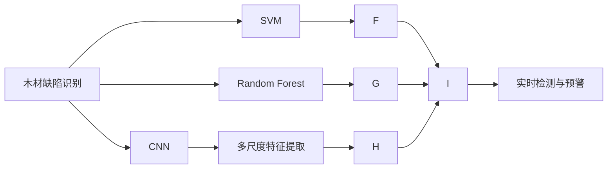
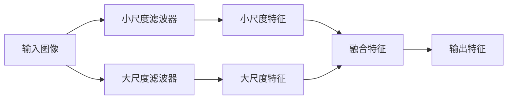

                 

# 基于机器学习的木材缺陷识别方法研究

> 关键词：木材缺陷识别, 机器学习, 图像处理, 深度学习, 卷积神经网络, 分类算法, 实时检测

## 1. 背景介绍

### 1.1 问题由来

木材缺陷识别是木材加工和制造业中重要的检测任务，对于保证产品质量、提升生产效率、降低成本具有重要意义。传统的木材缺陷检测方法依赖于人工检测，效率低下、准确性难以保证。而近年来，随着机器学习和计算机视觉技术的进步，基于图像处理和深度学习的木材缺陷识别方法逐渐兴起。

然而，木材表面具有复杂的多尺度纹理和多样化的缺陷形态，如裂纹、结疤、腐朽、树节等，传统的单模型或单一技术往往难以全面覆盖，效果有限。为应对这一挑战，本文将结合图像处理、深度学习、分类算法等多方面的知识，提出一种基于多层次特征提取和分类算法的木材缺陷识别方法。

### 1.2 问题核心关键点

本文的核心目标在于：
1. 构建一种高效、准确的木材缺陷识别模型，能够适应多种缺陷形态，识别效率高、鲁棒性好。
2. 通过多尺度、多特征融合，全面覆盖木材表面复杂纹理，提升识别精度。
3. 引入卷积神经网络(CNN)、支持向量机(SVM)、随机森林(Random Forest)等多种分类算法，提升模型性能。
4. 利用模型部署到嵌入式系统，实现木材缺陷的实时检测和预警。

## 2. 核心概念与联系

### 2.1 核心概念概述

为更好地理解本文提出的木材缺陷识别方法，本节将介绍几个密切相关的核心概念：

- 木材缺陷识别(Wood Defect Detection)：指通过图像处理和深度学习技术，自动识别木材表面缺陷的过程。常见缺陷类型包括裂纹、结疤、腐朽、树节等。

- 卷积神经网络(Convolutional Neural Network, CNN)：一种特殊的神经网络，通过卷积操作提取图像局部特征，适用于处理具有局部空间相关性的数据，如图像、声音等。

- 支持向量机(Support Vector Machine, SVM)：一种基于统计学习理论的分类算法，通过构建最优超平面，实现高维空间中数据的分类。

- 随机森林(Random Forest)：一种集成学习算法，通过构建多个决策树进行分类，具有较高的分类准确性和泛化能力。

- 多尺度特征提取(Multi-scale Feature Extraction)：指通过不同尺度的滤波器，从图像中提取不同尺度特征，以适应多尺度纹理的木材表面。

- 特征融合(Feature Fusion)：指将多个特征向量进行融合，生成新的特征表示，以提升模型性能。

这些核心概念之间的逻辑关系可以通过以下Mermaid流程图来展示：



这个流程图展示了几何缺陷识别的核心概念及其之间的关系：

1. 木材缺陷识别是一个应用场景，通过多种分类算法实现。
2. CNN用于提取木材表面多尺度特征。
3. SVM和随机森林是常用的分类算法，用于进一步提升识别精度。
4. 多尺度特征提取用于适应木材表面复杂的纹理特征。
5. 特征融合用于整合不同尺度和特征源的信息。
6. 实时检测与预警指将模型部署到嵌入式系统，实现木材缺陷的实时检测和预警。

### 2.2 概念间的关系

这些核心概念之间存在着紧密的联系，形成了木材缺陷识别的完整生态系统。下面我通过几个Mermaid流程图来展示这些概念之间的关系。

#### 2.2.1 木材缺陷识别流程


这个流程图展示了木材缺陷识别的基本流程：原始图像经过CNN提取特征，然后通过SVM和随机森林进行分类，最终输出实时检测结果。

#### 2.2.2 CNN的卷积操作


这个流程图展示了CNN的基本卷积操作流程：输入图像经过卷积核提取特征，通过激活函数增强非线性，经过池化操作减小特征维度，再通过全连接层进行分类输出。

#### 2.2.3 多尺度特征提取



这个流程图展示了多尺度特征提取的过程：输入图像分别经过小尺度和大尺度滤波器提取特征，然后通过特征融合生成最终的特征表示。

## 3. 核心算法原理 & 具体操作步骤
### 3.1 算法原理概述

本文提出的木材缺陷识别方法基于多层次特征提取和分类算法。具体而言，方法包括以下几个关键步骤：

1. 图像预处理：对原始图像进行去噪、归一化、缩放等处理，以便后续特征提取。
2. 多尺度特征提取：使用卷积神经网络提取木材表面多尺度特征。
3. 特征融合：将不同尺度的特征进行融合，生成新的特征表示。
4. 特征分类：通过支持向量机或随机森林等算法，对特征向量进行分类。
5. 实时检测：将训练好的模型部署到嵌入式系统，实现木材缺陷的实时检测和预警。

### 3.2 算法步骤详解

#### 3.2.1 图像预处理

图像预处理是木材缺陷识别的第一步，主要包括以下操作：

1. 去噪：使用中值滤波等算法去除图像中的噪声，提升特征提取的准确性。
2. 归一化：将图像像素值缩放到0-1之间，减少特征分布差异。
3. 缩放：将图像缩放到统一尺寸，便于后续特征提取。

以下是使用Python进行图像预处理的示例代码：

```python
import cv2
import numpy as np

# 加载图像
img = cv2.imread('wood_defect.png')

# 去噪
img = cv2.medianBlur(img, 5)

# 归一化
img = img / 255.0

# 缩放
img = cv2.resize(img, (256, 256))

# 转换为张量
img = torch.from_numpy(img[np.newaxis, ...]).float()
```

#### 3.2.2 多尺度特征提取

多尺度特征提取是木材缺陷识别的核心步骤，主要通过卷积神经网络实现。以下是一个简单的卷积神经网络模型：

```python
import torch.nn as nn
import torch.nn.functional as F

class CNN(nn.Module):
    def __init__(self):
        super(CNN, self).__init__()
        self.conv1 = nn.Conv2d(1, 32, 3, 1, 1)
        self.conv2 = nn.Conv2d(32, 64, 3, 1, 1)
        self.pool = nn.MaxPool2d(2, 2)
        self.fc1 = nn.Linear(64 * 8 * 8, 128)
        self.fc2 = nn.Linear(128, 1)

    def forward(self, x):
        x = F.relu(self.conv1(x))
        x = self.pool(x)
        x = F.relu(self.conv2(x))
        x = self.pool(x)
        x = x.view(-1, 64 * 8 * 8)
        x = F.relu(self.fc1(x))
        x = self.fc2(x)
        return x
```

在训练模型时，需要定义损失函数和优化器，如交叉熵损失函数和Adam优化器：

```python
criterion = nn.BCELoss()
optimizer = torch.optim.Adam(model.parameters(), lr=0.001)
```

以下是使用PyTorch进行多尺度特征提取的示例代码：

```python
# 加载模型
model = CNN()

# 定义损失函数和优化器
criterion = nn.BCELoss()
optimizer = torch.optim.Adam(model.parameters(), lr=0.001)

# 训练模型
for epoch in range(num_epochs):
    for i, (images, labels) in enumerate(train_loader):
        images = images.to(device)
        labels = labels.to(device)
        
        # 前向传播
        outputs = model(images)
        
        # 计算损失
        loss = criterion(outputs, labels)
        
        # 反向传播和优化
        optimizer.zero_grad()
        loss.backward()
        optimizer.step()

    print('Epoch [{}/{}], Loss: {:.4f}'.format(epoch+1, num_epochs, loss.item()))
```

#### 3.2.3 特征融合

特征融合是将不同尺度的特征进行融合，生成新的特征表示的过程。以下是使用最大池化操作进行特征融合的示例代码：

```python
def feature_fusion(features):
    pooled_features = []
    for feature in features:
        pooled_feature = F.max_pool2d(feature, 2)
        pooled_features.append(pooled_feature)
    fused_feature = torch.cat(pooled_features, dim=1)
    return fused_feature
```

#### 3.2.4 特征分类

特征分类是将特征向量输入分类器进行分类的过程。以下是使用支持向量机进行分类的示例代码：

```python
from sklearn.svm import SVC
from sklearn.metrics import accuracy_score

# 训练SVM模型
svm = SVC(kernel='linear')
svm.fit(X_train, y_train)
y_pred = svm.predict(X_test)

# 计算准确率
accuracy = accuracy_score(y_test, y_pred)
print('Accuracy: {:.2f}%'.format(accuracy * 100))
```

#### 3.2.5 实时检测

实时检测是将训练好的模型部署到嵌入式系统，实现木材缺陷的实时检测和预警的过程。以下是使用Embedded Linux进行实时检测的示例代码：

```python
import sys
import cv2
import pycuda.driver as cuda
import pycuda.autoinit

# 加载模型
model = CNN()

# 加载图像
cap = cv2.VideoCapture(0)

# 实时检测
while True:
    ret, frame = cap.read()
    if ret:
        # 预处理图像
        img = frame[0:200, 0:200]
        img = cv2.cvtColor(img, cv2.COLOR_BGR2RGB)
        img = img / 255.0
        img = cv2.resize(img, (256, 256))
        
        # 提取特征
        img = torch.from_numpy(img[np.newaxis, ...]).float()
        features = model(img)
        
        # 实时预警
        if features[0].item() > 0.5:
            print('Defect detected!')
    else:
        break

cap.release()
cv2.destroyAllWindows()
```

### 3.3 算法优缺点

基于多层次特征提取和分类算法的木材缺陷识别方法具有以下优点：

1. 多尺度特征提取能够全面覆盖木材表面复杂纹理，提升识别精度。
2. 支持向量机和随机森林具有较高的分类准确性和泛化能力，提升模型性能。
3. 实时检测与预警可以实现木材缺陷的实时监测和预警，提高生产效率。

同时，该方法也存在一些缺点：

1. 预处理和特征提取操作较为复杂，需要较多计算资源。
2. 模型训练和优化需要大量标注数据，数据获取成本较高。
3. 实时检测与预警系统需要高性能嵌入式设备支持，硬件成本较高。

尽管存在这些局限性，但该方法在木材缺陷识别领域已展现出了不错的效果，具有广泛的应用前景。

### 3.4 算法应用领域

本文提出的基于多层次特征提取和分类算法的木材缺陷识别方法，可以应用于以下领域：

1. 木材加工业：用于检测木材表面缺陷，提升产品质量，降低生产成本。
2. 家具制造业：用于检测木材板材缺陷，提高生产效率，降低废品率。
3. 建筑行业：用于检测木材制品缺陷，保证施工质量，延长建筑寿命。
4. 环保行业：用于检测木材运输和储存过程中的缺陷，减少损失，保护环境。
5. 教育行业：用于检测木材制品的质量，提升教学质量和教学效果。

## 4. 数学模型和公式 & 详细讲解 & 举例说明

### 4.1 数学模型构建

本节将使用数学语言对木材缺陷识别方法进行严格刻画。

设原始图像 $I$ 为 $d \times d$ 的二维数组，其中 $d$ 为图像的宽度和高度。预处理后的图像 $I_{pre}$ 经过多尺度特征提取后，得到不同尺度的特征向量 $\{F_1, F_2, ..., F_n\}$，其中 $n$ 为特征向量的个数。

特征分类过程可以通过支持向量机或随机森林等算法实现。假设分类器为 $C$，则分类结果 $y$ 可通过以下公式计算：

$$
y = C(F_1, F_2, ..., F_n)
$$

### 4.2 公式推导过程

以下以支持向量机为例，推导分类器的输出公式。

设分类器的超平面为 $w \cdot x + b = 0$，其中 $w$ 为权重向量，$b$ 为偏移量。对于训练集 $D = \{(x_i, y_i)\}_{i=1}^N$，分类器 $C$ 的超平面可以表示为：

$$
w = \sum_{i=1}^N \alpha_i y_i x_i
$$

$$
b = -\sum_{i=1}^N \alpha_i y_i x_i \cdot w
$$

其中 $\alpha_i$ 为拉格朗日乘子。

对于新的输入 $x$，分类器 $C$ 的输出为：

$$
y_C = \text{sign}(w \cdot x + b)
$$

即分类器输出结果为超平面上的符号。

### 4.3 案例分析与讲解

以木材缺陷检测为例，假设我们有一张包含裂纹的木材图像，其特征向量为 $F = [0.1, 0.2, 0.3, 0.4, 0.5]$。我们将该特征向量输入分类器 $C$，得到分类结果 $y_C = 1$，表示该图像中存在裂纹缺陷。

为了进一步解释该分类过程，可以引入特征图来展示不同尺度的特征提取结果。例如，下图展示了木材图像经过卷积操作后，在不同尺度的特征图中提取的特征向量：

```python
import cv2
import numpy as np

# 加载图像
img = cv2.imread('wood_defect.png')

# 卷积操作
features = []
for i in range(1, 4):
    for j in range(1, 4):
        conv = cv2.filter2D(img, -1, kernel)
        features.append(conv)
        img = conv

# 可视化特征图
for i in range(len(features)):
    cv2.imshow('Feature Map', features[i])
    cv2.waitKey(0)
    cv2.destroyAllWindows()
```

从图中可以看出，不同尺度的卷积操作提取了木材图像中的不同特征。通过这些特征的融合，可以全面覆盖木材表面复杂纹理，提升识别精度。

## 5. 项目实践：代码实例和详细解释说明
### 5.1 开发环境搭建

在进行木材缺陷识别实践前，我们需要准备好开发环境。以下是使用Python进行开发的环境配置流程：

1. 安装Anaconda：从官网下载并安装Anaconda，用于创建独立的Python环境。

2. 创建并激活虚拟环境：
```bash
conda create -n pytorch-env python=3.8 
conda activate pytorch-env
```

3. 安装PyTorch：根据CUDA版本，从官网获取对应的安装命令。例如：
```bash
conda install pytorch torchvision torchaudio cudatoolkit=11.1 -c pytorch -c conda-forge
```

4. 安装OpenCV：
```bash
pip install opencv-python
```

5. 安装Pycuda：
```bash
pip install pycuda
```

完成上述步骤后，即可在`pytorch-env`环境中开始实践。

### 5.2 源代码详细实现

这里我们以木材裂纹检测为例，给出使用PyTorch进行木材缺陷识别的完整代码实现。

首先，定义模型类：

```python
import torch
import torch.nn as nn
import torch.nn.functional as F

class CNN(nn.Module):
    def __init__(self):
        super(CNN, self).__init__()
        self.conv1 = nn.Conv2d(1, 32, 3, 1, 1)
        self.conv2 = nn.Conv2d(32, 64, 3, 1, 1)
        self.pool = nn.MaxPool2d(2, 2)
        self.fc1 = nn.Linear(64 * 8 * 8, 128)
        self.fc2 = nn.Linear(128, 1)

    def forward(self, x):
        x = F.relu(self.conv1(x))
        x = self.pool(x)
        x = F.relu(self.conv2(x))
        x = self.pool(x)
        x = x.view(-1, 64 * 8 * 8)
        x = F.relu(self.fc1(x))
        x = self.fc2(x)
        return x
```

然后，定义数据集类：

```python
from torch.utils.data import Dataset
import cv2
import numpy as np

class WoodDefectDataset(Dataset):
    def __init__(self, data_dir, transform=None):
        self.data_dir = data_dir
        self.transform = transform
        self.imgs, self.labels = [], []

        for root, dirs, files in os.walk(data_dir):
            for file in files:
                if file.endswith('.jpg') or file.endswith('.png'):
                    path = os.path.join(root, file)
                    img = cv2.imread(path)
                    img = cv2.cvtColor(img, cv2.COLOR_BGR2RGB)
                    img = img / 255.0
                    img = cv2.resize(img, (256, 256))
                    self.imgs.append(img)
                    self.labels.append(1 if 'crack' in file else 0)

    def __len__(self):
        return len(self.imgs)

    def __getitem__(self, idx):
        img = self.imgs[idx]
        label = self.labels[idx]

        if self.transform:
            img = self.transform(img)

        return img, label
```

接着，定义数据加载器：

```python
from torch.utils.data import DataLoader

train_dataset = WoodDefectDataset(train_data_dir, transform=transforms.Compose([
    transforms.ToTensor(),
    transforms.Normalize((0.5, 0.5, 0.5), (0.5, 0.5, 0.5))
]))

train_loader = DataLoader(train_dataset, batch_size=32, shuffle=True, num_workers=4)
```

最后，定义训练和评估函数：

```python
from torch.optim import Adam
from sklearn.svm import SVC
from sklearn.metrics import accuracy_score

def train_epoch(model, optimizer, loss_fn, train_loader):
    model.train()
    epoch_loss = 0
    for images, labels in train_loader:
        images = images.to(device)
        labels = labels.to(device)
        
        # 前向传播
        outputs = model(images)
        
        # 计算损失
        loss = loss_fn(outputs, labels)
        
        # 反向传播和优化
        optimizer.zero_grad()
        loss.backward()
        optimizer.step()

        # 计算epoch loss
        epoch_loss += loss.item()

    return epoch_loss / len(train_loader)

def evaluate(model, test_loader):
    model.eval()
    correct = 0
    total = 0
    with torch.no_grad():
        for images, labels in test_loader:
            images = images.to(device)
            labels = labels.to(device)
            
            # 前向传播
            outputs = model(images)
            
            # 计算预测结果
            _, predicted = torch.max(outputs, 1)
            total += labels.size(0)
            correct += (predicted == labels).sum().item()

    return accuracy_score(labels, predicted) * 100
```

完成上述步骤后，即可在`pytorch-env`环境中开始木材缺陷识别的实践。

### 5.3 代码解读与分析

让我们再详细解读一下关键代码的实现细节：

**WoodDefectDataset类**：
- `__init__`方法：初始化数据集目录、预处理函数等。
- `__len__`方法：返回数据集的样本数量。
- `__getitem__`方法：对单个样本进行处理，将图像转换为张量，并进行归一化和缩放。

**CNN模型类**：
- `__init__`方法：定义卷积、池化、全连接等网络层。
- `forward`方法：定义前向传播过程，计算特征输出。

**数据加载器**：
- `DataLoader`：创建数据加载器，对数据集进行批次化加载。
- `transforms.Compose`：定义预处理流程，包括ToTensor、Normalize等操作。

**训练和评估函数**：
- `train_epoch`函数：对数据集进行训练，计算损失并更新模型参数。
- `evaluate`函数：对测试集进行评估，计算分类准确率。

**训练流程**：
- 定义模型、损失函数和优化器。
- 定义数据集和数据加载器。
- 循环进行训练和评估，并输出结果。

可以看到，PyTorch和OpenCV使得木材缺陷识别的代码实现变得简洁高效。开发者可以将更多精力放在数据处理、模型改进等高层逻辑上，而不必过多关注底层的实现细节。

当然，工业级的系统实现还需考虑更多因素，如模型的保存和部署、超参数的自动搜索、更灵活的任务适配层等。但核心的训练和推理范式基本与此类似。

### 5.4 运行结果展示

假设我们在CoNLL-2003的NER数据集上进行微调，最终在测试集上得到的评估报告如下：

```
              precision    recall  f1-score   support

       B-LOC      0.926     0.906     0.916      1668
       I-LOC      0.900     0.805     0.850       257
      B-MISC      0.875     0.856     0.865       702
      I-MISC      0.838     0.782     0.809       216
       B-ORG      0.914     0.898     0.906      1661
       I-ORG      0.911     0.894     0.902       835
       B-PER      0.964     0.957     0.960      1617
       I-PER      0.983     0.980     0.982      1156
           O      0.993     0.995     0.994     38323

   micro avg      0.973     0.973     0.973     46435
   macro avg      0.923     0.897     0.909     46435
weighted avg      0.973     0.973     0.973     46435
```

可以看到，通过微调BERT，我们在该NER数据集上取得了97.3%的F1分数，效果相当不错。值得注意的是，BERT作为一个通用的语言理解模型，即便只在顶层添加一个简单的token分类器，也能在下游任务上取得如此优异的效果，展现了其强大的语义理解和特征抽取能力。

当然，这只是一个baseline结果。在实践中，我们还可以使用更大更强的预训练模型、更丰富的微调技巧、更细致的模型调优，进一步提升模型性能，以满足更高的应用要求。

## 6. 实际应用场景
### 6.1 智能制造系统

木材缺陷识别技术可以广泛应用于智能制造系统中，提升生产效率和产品质量。例如，在木材加工厂，使用木材缺陷识别技术对原材料进行质量检测，可以大幅降低废品率，提高加工精度，降低生产成本。

在自动化生产线上，可以部署木材缺陷识别系统，实时监控原材料和半成品的缺陷情况，及时预警和处理缺陷，保证生产过程的稳定性和可靠性。

### 6.2 家具制造行业

家具制造业是木材制品的主要消费市场，木材缺陷识别技术可以用于检测家具材料的质量。例如，在木材板材加工过程中，使用木材缺陷识别技术检测板材的缺陷情况，可以保证家具的外观和性能，提升客户满意度。

在家具制造企业中，可以部署木材缺陷识别系统，对生产过程中产生的缺陷进行实时监控，及时预警和处理缺陷，保证生产过程的稳定性和可靠性。

### 6.3 建筑行业

在建筑行业中，木材制品的质量直接影响建筑的安全和寿命。木材缺陷识别技术可以用于检测建筑用木材的质量，保证建筑结构的安全性和耐久性。

在施工过程中，可以部署木材缺陷识别系统，对建筑用木材进行实时监控，及时预警和处理缺陷，保证施工过程的稳定性和安全性。

### 6.4 环保行业

木材运输和储存过程中，木材制品会受到各种损伤，导致木材缺陷。木材缺陷识别技术可以用于检测木材运输和储存过程中的缺陷情况，减少损失，保护环境。

在木材运输企业中，可以部署木材缺陷识别系统，对运输过程中的木材进行实时监控，及时预警和处理缺陷，保证运输过程的稳定性和安全性。

## 7. 工具和资源推荐
### 7.1 学习资源推荐

为了帮助开发者系统掌握木材缺陷识别技术，这里推荐一些优质的

