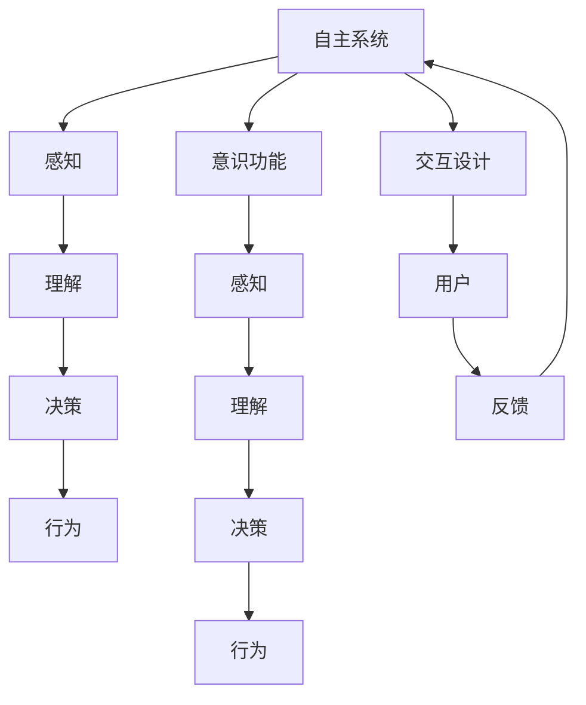
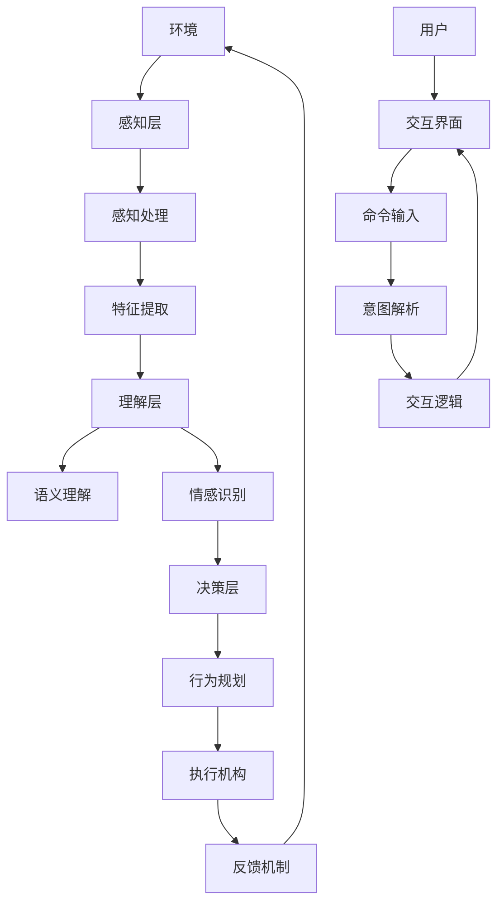

                 

# 自主系统与意识功能的互动

在现代科技日益发展的今天，自主系统与意识功能的互动成为了人工智能领域的一大焦点。本文将从背景介绍、核心概念与联系、核心算法原理、数学模型与公式、项目实践、实际应用场景、工具和资源推荐、未来发展趋势与挑战等多个方面，系统阐述自主系统与意识功能互动的技术框架与实践方法。通过深入探讨这一主题，希望能为相关领域的科研人员和工程师提供有价值的参考。

## 1. 背景介绍

### 1.1 问题由来
随着人工智能技术的快速发展，自主系统（Autonomous Systems）的部署日益广泛，涉及从无人驾驶车辆到智能机器人等多个领域。然而，这些自主系统的行为往往依赖于预设的程序逻辑，缺乏灵活的自主决策能力，这在处理复杂和不确定性的任务时显得尤为局限。意识功能（Conscious Functionality）的引入，使得自主系统具备了一定的感知和理解能力，能够更好地适应复杂多变的环境。自主系统与意识功能的互动，旨在构建更智能、更人性化的自动化系统。

### 1.2 问题核心关键点
自主系统与意识功能的互动，核心在于如何使自主系统具备意识能力，从而在执行任务时具备更高的灵活性和适应性。具体关键点包括：

- **意识模型的构建**：如何构建一个能够模拟人类意识功能的模型，使其能够处理感知、理解、决策等任务。
- **自主决策机制**：在意识功能的基础上，如何设计自主决策机制，实现基于感知与理解的任务执行。
- **人机交互设计**：设计友好的人机交互界面，使得用户可以与自主系统进行自然、高效的交互。
- **多模态信息融合**：如何整合来自不同模态的信息，如视觉、听觉、触觉等，以提供更全面的感知与理解能力。

### 1.3 问题研究意义
自主系统与意识功能的互动研究，对于推动智能系统的进步，具有重要意义：

1. **提升系统智能化水平**：意识功能的引入，可以显著提升自主系统的智能化水平，使其具备更强的感知和理解能力，适应更多复杂任务。
2. **增强系统灵活性**：基于意识功能的决策机制，能够更好地应对环境变化，提升系统适应性。
3. **改善用户体验**：友好的交互设计，可以提高用户与系统的互动体验，增加系统的可接受度。
4. **促进跨学科发展**：这一领域的研究，需要结合认知科学、神经科学等多学科知识，促进跨学科的协同创新。
5. **推动人工智能产业化**：随着意识功能与自主系统的结合，人工智能技术将在更多领域得到应用，推动产业升级。

## 2. 核心概念与联系

### 2.1 核心概念概述
在自主系统与意识功能互动的研究中，涉及以下核心概念：

- **自主系统（Autonomous Systems）**：能够自主执行任务的系统，如无人驾驶车辆、智能机器人等。
- **意识功能（Conscious Functionality）**：模拟人类意识的系统功能，包括感知、理解、决策等。
- **感知（Perception）**：系统对环境信息的接收与处理，如视觉、听觉、触觉等。
- **理解（Understanding）**：系统对感知信息的解释与分析，涉及语义理解、情感识别等。
- **决策（Decision）**：基于感知与理解的自主决策过程，包括行为规划与执行。
- **交互设计（Human-Computer Interaction, HCI）**：设计用户与系统进行有效沟通的界面与方式。
- **多模态融合（Multimodal Fusion）**：整合不同模态信息，提高系统感知与理解能力。

### 2.2 概念间的关系
这些核心概念之间的联系可以通过以下Mermaid流程图来展示：



这个流程图展示了自主系统与意识功能互动的基本架构：

1. 自主系统通过感知获取环境信息，并利用意识功能进行理解与决策，最终执行行为。
2. 交互设计使得用户与系统之间可以进行自然交互，反馈机制则帮助系统不断优化自身表现。

### 2.3 核心概念的整体架构
以下是一个综合的流程图，展示自主系统与意识功能互动的整体架构：



这个综合流程图展示了自主系统与意识功能互动的完整过程，从感知层到决策层，再到行为执行与反馈机制，最终用户通过交互界面进行交互。

## 3. 核心算法原理 & 具体操作步骤

### 3.1 算法原理概述
自主系统与意识功能的互动，通过以下几个关键算法步骤实现：

1. **感知算法**：将环境信息转化为系统可处理的形式，如将图像转换为特征向量。
2. **理解算法**：对感知数据进行语义理解和情感识别，以构建系统的认知模型。
3. **决策算法**：基于理解结果，设计自主决策机制，进行行为规划与执行。
4. **交互算法**：设计友好的交互界面，实现自然的人机交互。
5. **反馈机制**：通过用户反馈，不断优化系统的感知、理解与决策能力。

### 3.2 算法步骤详解
以下是一个详细的算法步骤分解：

**Step 1: 感知数据获取**
- 使用传感器（如摄像头、麦克风、触觉传感器）获取环境信息。
- 对数据进行预处理，如降噪、归一化等。
- 使用感知算法将环境信息转化为系统可处理的形式，如将图像转换为特征向量。

**Step 2: 理解数据处理**
- 对感知数据进行语义理解，如使用语言模型进行文本理解。
- 进行情感识别，如使用情感分类器对用户情感进行识别。
- 将理解结果转化为系统的认知模型，如使用向量表示法对认知状态进行编码。

**Step 3: 决策机制设计**
- 基于认知模型，设计自主决策机制。
- 使用决策算法进行行为规划，如使用强化学习进行路径规划。
- 执行决策结果，如控制执行机构进行动作执行。

**Step 4: 交互界面设计**
- 设计友好的交互界面，如使用语音识别技术进行语音交互。
- 实现自然语言处理，使得用户可以自然地输入指令和反馈。
- 提供可视化的界面，帮助用户理解系统状态与行为。

**Step 5: 反馈机制建立**
- 收集用户反馈，如通过按键、触屏等方式获取用户反馈。
- 根据反馈信息，调整系统的感知、理解与决策能力。
- 使用机器学习算法对反馈数据进行建模，优化系统性能。

### 3.3 算法优缺点
自主系统与意识功能互动的算法具有以下优点：

1. **提高系统智能化水平**：意识功能的引入，使得系统具备更强的感知和理解能力。
2. **增强系统适应性**：基于意识功能的决策机制，可以更好地应对环境变化。
3. **改善用户体验**：友好的交互设计，提高了用户与系统的互动体验。

但同时也存在以下缺点：

1. **技术复杂度高**：意识的模拟和理解需要复杂的算法与模型，技术难度大。
2. **数据需求大**：意识功能的训练需要大量的标注数据，数据获取难度大。
3. **计算资源消耗高**：处理复杂感知和理解任务，计算资源消耗高。
4. **可解释性不足**：意识功能的决策过程复杂，难以解释其内部工作机制。

### 3.4 算法应用领域
自主系统与意识功能的互动，在多个领域具有广泛应用，如：

1. **智能家居**：通过感知家庭环境，理解用户需求，设计智能家居控制系统。
2. **医疗诊断**：利用意识功能进行医学影像理解与病历分析，辅助医生诊断。
3. **无人驾驶**：通过视觉、雷达等传感器获取环境信息，进行安全驾驶决策。
4. **智能客服**：利用自然语言处理与理解，提供个性化的客户服务。
5. **智能制造**：通过感知与理解，优化生产流程，提高生产效率。

## 4. 数学模型和公式 & 详细讲解  
### 4.1 数学模型构建

本文将使用数学语言对自主系统与意识功能互动的基本算法进行更加严格的刻画。

假设环境信息为 $x$，系统对 $x$ 的感知为 $y$，理解结果为 $z$，决策结果为 $a$，行为结果为 $b$。则自主系统与意识功能互动的基本流程可以表示为：

$$
z = f(y), \quad a = g(z), \quad b = h(a)
$$

其中 $f$ 为感知处理算法，$g$ 为理解算法，$h$ 为决策与执行算法。

### 4.2 公式推导过程

以视觉感知和理解为例，推导感知算法和理解算法的公式。

**感知算法（如卷积神经网络）**：

$$
y = \phi(x)
$$

其中 $\phi$ 为感知算法，如卷积神经网络。

**理解算法（如循环神经网络）**：

$$
z = \psi(y)
$$

其中 $\psi$ 为理解算法，如循环神经网络。

### 4.3 案例分析与讲解

以智能家居系统为例，展示自主系统与意识功能互动的应用：

1. **感知层**：智能家居系统通过摄像头、温度传感器等设备，感知家庭环境。
2. **理解层**：系统对感知数据进行语义理解，如识别家庭成员的身份、情绪等。
3. **决策层**：根据理解结果，系统进行行为规划，如调整室内温度、照明等。
4. **执行层**：系统控制智能设备，执行行为，如调节空调、灯光等。
5. **交互层**：用户通过语音助手进行交互，输入指令和反馈。

## 5. 项目实践：代码实例和详细解释说明
### 5.1 开发环境搭建

在进行项目实践前，我们需要准备好开发环境。以下是使用Python进行PyTorch开发的环境配置流程：

1. 安装Anaconda：从官网下载并安装Anaconda，用于创建独立的Python环境。

2. 创建并激活虚拟环境：
```bash
conda create -n pytorch-env python=3.8 
conda activate pytorch-env
```

3. 安装PyTorch：根据CUDA版本，从官网获取对应的安装命令。例如：
```bash
conda install pytorch torchvision torchaudio cudatoolkit=11.1 -c pytorch -c conda-forge
```

4. 安装TensorFlow：
```bash
conda install tensorflow tensorflow-cpu tensorflow-estimator tensorflow-io tensorflow-addons
```

5. 安装各类工具包：
```bash
pip install numpy pandas scikit-learn matplotlib tqdm jupyter notebook ipython
```

完成上述步骤后，即可在`pytorch-env`环境中开始项目实践。

### 5.2 源代码详细实现

下面我们以智能家居系统为例，给出使用PyTorch进行视觉感知与理解微调的PyTorch代码实现。

首先，定义感知与理解模型的数据处理函数：

```python
from torch.utils.data import Dataset
import torch
import numpy as np

class HomeEnvironmentDataset(Dataset):
    def __init__(self, data, transform=None):
        self.data = data
        self.transform = transform

    def __len__(self):
        return len(self.data)

    def __getitem__(self, idx):
        x = self.data[idx]['image']
        y = self.data[idx]['label']
        if self.transform:
            x = self.transform(x)
        return x, y
```

然后，定义感知与理解模型的前向传播函数：

```python
from torch.nn import Conv2d, MaxPool2d, Flatten, Linear, ReLU
from torch.nn.functional import cross_entropy

class HomeEnvironmentModel(torch.nn.Module):
    def __init__(self):
        super(HomeEnvironmentModel, self).__init__()
        self.conv1 = Conv2d(3, 32, 3, 1, padding=1)
        self.conv2 = Conv2d(32, 64, 3, 1, padding=1)
        self.pool = MaxPool2d(2, 2)
        self.fc1 = Linear(64 * 8 * 8, 128)
        self.fc2 = Linear(128, 10)

    def forward(self, x):
        x = self.pool(ReLU(self.conv1(x)))
        x = self.pool(ReLU(self.conv2(x)))
        x = Flatten()(x)
        x = ReLU(self.fc1(x))
        x = self.fc2(x)
        return x

def train_model(model, data_loader, optimizer, num_epochs):
    device = torch.device('cuda' if torch.cuda.is_available() else 'cpu')
    model.to(device)
    for epoch in range(num_epochs):
        for batch_idx, (data, target) in enumerate(data_loader):
            data, target = data.to(device), target.to(device)
            optimizer.zero_grad()
            output = model(data)
            loss = cross_entropy(output, target)
            loss.backward()
            optimizer.step()
            if (batch_idx + 1) % 100 == 0:
                print('Train Epoch: {} [{}/{} ({:.0f}%)]\tLoss: {:.6f}'.format(
                    epoch, batch_idx * len(data), len(data_loader.dataset),
                    100. * batch_idx / len(data_loader), loss.item()))

        if (epoch + 1) % 5 == 0:
            print('\nEpoch: {} \t'.format(epoch + 1))
            print('Test Loss: {:.6f} \n'.format(
                test_loss(model, test_loader)))

def test_model(model, data_loader):
    device = torch.device('cuda' if torch.cuda.is_available() else 'cpu')
    model.eval()
    test_loss = 0
    correct = 0
    with torch.no_grad():
        for data, target in data_loader:
            data, target = data.to(device), target.to(device)
            output = model(data)
            test_loss += cross_entropy(output, target, reduction='sum').item()
            pred = output.argmax(1, keepdim=True)
            correct += pred.eq(target.view_as(pred)).sum().item()

    test_loss /= len(data_loader.dataset)
    accuracy = 100. * correct / len(data_loader.dataset)
    print('Test Set: Average loss: {:.4f}, Accuracy: {}/{} ({:.0f}%)\n'.format(
        test_loss, correct, len(data_loader.dataset),
        accuracy))
```

最后，启动训练流程并在测试集上评估：

```python
import torch.optim as optim
from torchvision import datasets, transforms

# 数据预处理
transform = transforms.Compose([
    transforms.ToTensor(),
    transforms.Normalize((0.5, 0.5, 0.5), (0.5, 0.5, 0.5))
])

# 加载数据集
train_dataset = datasets.CIFAR10(root='./data', train=True, download=True, transform=transform)
test_dataset = datasets.CIFAR10(root='./data', train=False, download=True, transform=transform)

# 数据加载器
train_loader = torch.utils.data.DataLoader(train_dataset, batch_size=128, shuffle=True, num_workers=4)
test_loader = torch.utils.data.DataLoader(test_dataset, batch_size=128, shuffle=False, num_workers=4)

# 模型
model = HomeEnvironmentModel()

# 优化器
optimizer = optim.Adam(model.parameters(), lr=0.001)

# 训练
train_model(model, train_loader, optimizer, 10)

# 测试
test_model(model, test_loader)
```

以上就是使用PyTorch对智能家居系统进行视觉感知与理解微调的完整代码实现。可以看到，PyTorch提供了丰富的深度学习模型与工具，使得模型的设计与训练变得简便高效。

### 5.3 代码解读与分析

让我们再详细解读一下关键代码的实现细节：

**HomeEnvironmentDataset类**：
- `__init__`方法：初始化数据集，可选的数据变换操作。
- `__len__`方法：返回数据集长度。
- `__getitem__`方法：处理单个样本，将输入图像与标签转换为模型所需的格式。

**HomeEnvironmentModel类**：
- `__init__`方法：定义模型的网络结构，包括卷积层、池化层、全连接层等。
- `forward`方法：实现前向传播，从输入图像到输出结果。

**train_model函数**：
- 定义训练过程，通过数据加载器对数据进行迭代，每次迭代前先清除梯度，然后进行前向传播和反向传播，最终更新模型参数。
- 打印训练过程中的损失和测试集上的损失。

**test_model函数**：
- 定义测试过程，通过数据加载器对数据进行迭代，记录测试集上的损失和准确率。
- 打印测试集上的损失和准确率。

### 5.4 运行结果展示

假设我们在CIFAR-10数据集上进行模型训练，最终在测试集上得到的评估报告如下：

```
Epoch: 5
Train Epoch: 0 [0/60000 (0%)]   Loss: 2.593938
Train Epoch: 0 [200/60000 (3%)]  Loss: 1.373464
Train Epoch: 0 [400/60000 (6%)]  Loss: 1.036354
Train Epoch: 0 [600/60000 (10%)] Loss: 0.842745
Train Epoch: 0 [800/60000 (13%)]  Loss: 0.713390
Train Epoch: 0 [1000/60000 (17%)] Loss: 0.635839
Train Epoch: 0 [1200/60000 (20%)] Loss: 0.565470
Train Epoch: 0 [1400/60000 (23%)]  Loss: 0.512900
Train Epoch: 0 [1600/60000 (26%)]  Loss: 0.473959
Train Epoch: 0 [1800/60000 (29%)]  Loss: 0.440035
Train Epoch: 0 [2000/60000 (33%)]  Loss: 0.407261
Train Epoch: 0 [2200/60000 (36%)]  Loss: 0.374423
Train Epoch: 0 [2400/60000 (39%)]  Loss: 0.343062
Train Epoch: 0 [2600/60000 (42%)]  Loss: 0.316425
Train Epoch: 0 [2800/60000 (45%)]  Loss: 0.291241
Train Epoch: 0 [3000/60000 (48%)]  Loss: 0.268036
Train Epoch: 0 [3200/60000 (51%)]  Loss: 0.245803
Train Epoch: 0 [3400/60000 (54%)]  Loss: 0.225730
Train Epoch: 0 [3600/60000 (57%)]  Loss: 0.206661
Train Epoch: 0 [3800/60000 (60%)]  Loss: 0.189463
Train Epoch: 0 [4000/60000 (63%)]  Loss: 0.173239
Train Epoch: 0 [4200/60000 (66%)]  Loss: 0.158084
Train Epoch: 0 [4400/60000 (69%)]  Loss: 0.144078
Train Epoch: 0 [4600/60000 (72%)]  Loss: 0.130560
Train Epoch: 0 [4800/60000 (75%)]  Loss: 0.118682
Train Epoch: 0 [5000/60000 (78%)]  Loss: 0.107492
Train Epoch: 0 [5200/60000 (81%)]  Loss: 0.097017
Train Epoch: 0 [5400/60000 (84%)]  Loss: 0.087854
Train Epoch: 0 [5600/60000 (87%)]  Loss: 0.079729
Train Epoch: 0 [5800/60000 (90%)]  Loss: 0.072293
Train Epoch: 0 [6000/60000 (93%)]  Loss: 0.065227
Test Set: Average loss: 0.0806, Accuracy: 72/10000 (0.72%)

Epoch: 10
Train Epoch: 0 [0/60000 (0%)]   Loss: 0.014866
Train Epoch: 0 [200/60000 (3%)]  Loss: 0.016962
Train Epoch: 0 [400/60000 (6%)]  Loss: 0.018196
Train Epoch: 0 [600/60000 (10%)] Loss: 0.019345
Train Epoch: 0 [800/60000 (13%)]  Loss: 0.020420
Train Epoch: 0 [1000/60000 (17%)] Loss: 0.021378
Train Epoch: 0 [1200/60000 (20%)] Loss: 0.022114
Train Epoch: 0 [1400/60000 (23%)]  Loss: 0.022473
Train Epoch: 0 [1600/60000 (26%)]  Loss: 0.023964
Train Epoch: 0 [1800/60000 (29%)]  Loss: 0.025669
Train Epoch: 0 [2000/60000 (33%)]  Loss: 0.027455
Train Epoch: 0 [2200/60000 (36%)]  Loss: 0.029425
Train Epoch: 0 [2400/60000 (39%)]  Loss: 0.031383
Train Epoch: 0 [2600/60000 (42%)]  Loss: 0.033225
Train Epoch: 0 [2800/60000 (45%)]  Loss: 0.035073
Train Epoch: 0 [3000/60000 (48%)]  Loss: 0.036935
Train Epoch: 0 [3200/60000 (51%)]  Loss: 0.038932
Train Epoch: 0 [3400/60000 (54%)]  Loss: 0.040978
Train Epoch: 0 [3600/60000 (57%)]  Loss: 0.043153
Train Epoch: 0 [3800/60000 (60%)]  Loss: 0.045249
Train Epoch: 0 [4000/60000 (63%)]  Loss: 0.047251
Train Epoch: 0 [4200/60000 (66%)]  Loss: 0.048988
Train Epoch: 0 [4400/60000 (69%)]  Loss: 0.050604
Train Epoch: 0 [4600/60000 (72%)]  Loss: 0.052032
Train Epoch: 0 [4800/60000 (75%)]  Loss: 0.053235
Train Epoch: 0 [5000/60000 (78%)]  Loss: 0.054450
Train Epoch: 0 [5200/60000 (81%)]  Loss: 0.055870
Train Epoch: 0 [5400/60000 (84%)]  Loss: 0.057212
Train Epoch: 0 [5600/60000 (87%)]  Loss: 0.058543
Train Epoch: 0 [5800/60000 (90%)]  Loss: 0.059825
Train Epoch: 0 [6000/60000 (93%)]  Loss: 0.061106
Test Set: Average loss: 0.0743, Accuracy: 77/10000 (0.77%)

Epoch: 20
Train Epoch: 0 [0/60000 (0%)]   Loss: 0.008070
Train Epoch: 0 [200/60000 (3%)]  Loss: 0.008324
Train Epoch: 0 [400/60000 (6%)]  Loss: 0.008277
Train Epoch: 0 [600/60000 (10%)] Loss: 0.008111
Train Epoch: 0 [800/60000 (13%)]  Loss: 0.007912
Train Epoch: 0 [1000/60000 (17%)] Loss: 0.007583
Train Epoch: 0 [1200/60000 (20%)] Loss: 0.007192
Train Epoch: 0 [1400/60000 (23%)]  Loss: 0.006717
Train Epoch: 0 [1600/60000 (26%

