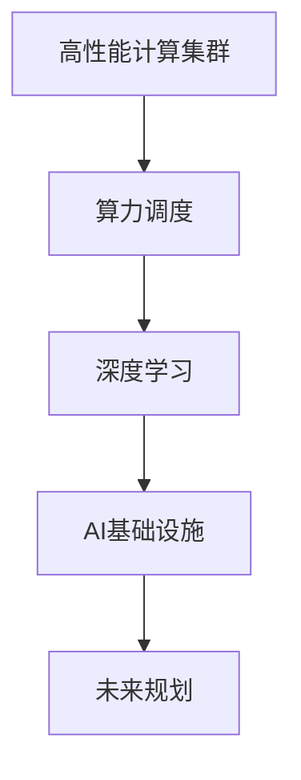
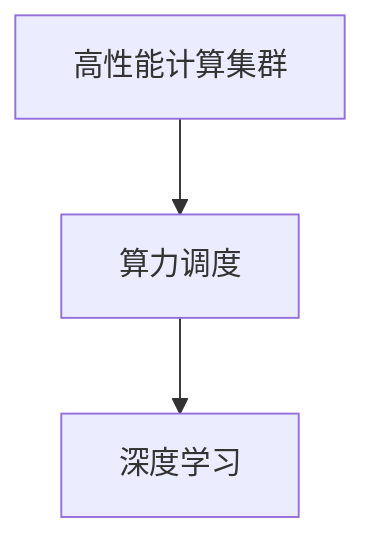
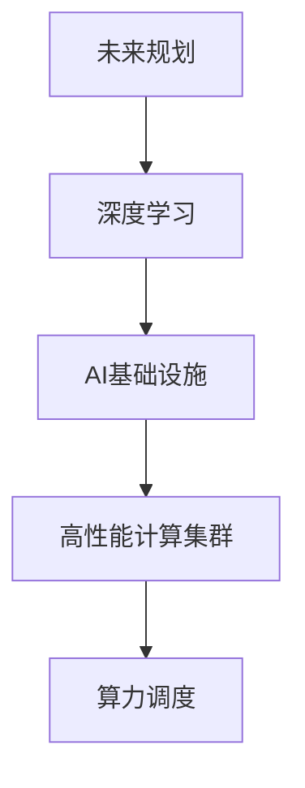

                 

# 商汤绝影的算力储备与未来规划

> 关键词：商汤科技, 人工智能, 深度学习, 高性能计算, 算力储备, AI基础设施, 未来规划

## 1. 背景介绍

### 1.1 问题由来

随着人工智能技术的快速发展，算力已经成为制约AI创新和应用的核心因素。在众多AI应用中，商汤科技（SenseTime）作为全球领先的人工智能企业，其对算力的需求尤为巨大。特别是在深度学习和大规模模型训练中，算力资源的储备和优化，直接关系到企业的产品开发速度和市场竞争力。因此，商汤科技在算力储备方面投入了大量资源，进行了全面的规划和布局。本文将深入探讨商汤绝影的算力储备与未来规划，帮助读者更好地理解其在AI领域的核心竞争力。

### 1.2 问题核心关键点

商汤绝影的算力储备与未来规划主要包括以下几个核心关键点：

1. **高性能计算集群**：商汤科技构建了多个高性能计算集群，包括GPU集群、TPU集群等，以支持深度学习模型的大规模训练和推理。

2. **算力调度与优化**：商汤通过智能化的算力调度和优化技术，提升算力资源的利用效率，减少计算资源的浪费。

3. **硬件与软件的协同**：商汤在硬件和软件两个层面进行深度协同，以最大化算力的性能和可扩展性。

4. **全球算力网络**：商汤正在构建全球算力网络，通过云计算和边缘计算等技术，提升算力的全球覆盖能力和应用灵活性。

5. **未来规划**：商汤计划在未来进一步扩展算力基础设施，探索新的计算模式和技术，以支持未来的AI需求。

### 1.3 问题研究意义

商汤绝影的算力储备与未来规划，对于提升商汤科技在AI领域的竞争力具有重要意义：

1. **加速产品研发**：强大的算力储备能够加速商汤在深度学习、计算机视觉等领域的产品研发，缩短市场响应时间。

2. **提升应用性能**：算力优化和大规模模型训练，有助于提升商汤AI产品在实际应用中的性能和效果。

3. **降低成本**：通过高效的算力调度和优化，商汤能够降低算力使用的成本，提高企业的经济效益。

4. **拓展应用场景**：算力网络的构建，有助于商汤在更广泛的市场和领域中推广和应用其AI技术。

5. **保持技术领先**：算力基础设施的持续投入，确保商汤在AI技术的前沿领域保持领先地位，持续创新。

## 2. 核心概念与联系

### 2.1 核心概念概述

为了更好地理解商汤绝影的算力储备与未来规划，本节将介绍几个密切相关的核心概念：

- **高性能计算集群（HPC Cluster）**：由多个计算节点组成，用于支持大规模并行计算任务。

- **算力调度（Compute Scheduling）**：动态分配和管理算力资源，以最大化计算效率。

- **深度学习（Deep Learning）**：一种基于神经网络的机器学习技术，通过多层非线性变换实现复杂的模式识别和预测。

- **AI基础设施（AI Infrastructure）**：支持AI模型训练、推理和部署的软硬件环境，包括数据中心、计算集群、存储系统等。

- **未来规划（Future Planning）**：基于当前的业务需求和技术趋势，对未来的技术发展方向和应用场景进行规划和布局。

这些核心概念之间的逻辑关系可以通过以下Mermaid流程图来展示：



这个流程图展示了大规模算力储备与AI技术应用的基本逻辑关系：

1. 高性能计算集群是算力资源的基础。
2. 算力调度优化计算资源的利用效率。
3. 深度学习是算力的主要应用场景。
4. AI基础设施支持算力资源的部署和管理。
5. 未来规划指导算力资源的长期发展方向。

### 2.2 概念间的关系

这些核心概念之间存在着紧密的联系，形成了商汤绝影算力储备的完整生态系统。下面我们通过几个Mermaid流程图来展示这些概念之间的关系。

#### 2.2.1 高性能计算集群与算力调度的关系



这个流程图展示了高性能计算集群和算力调度的关系：

1. 高性能计算集群提供必要的计算资源。
2. 算力调度优化计算资源的使用，提升深度学习任务的速度和效率。

#### 2.2.2 深度学习与AI基础设施的关系


这个流程图展示了深度学习与AI基础设施的关系：

1. 深度学习需要AI基础设施的支持。
2. AI基础设施提供高性能计算集群和算力调度服务。
3. 算力调度优化计算资源的使用，提升深度学习任务的速度和效率。

#### 2.2.3 未来规划与深度学习的关系



这个流程图展示了未来规划与深度学习的关系：

1. 未来规划指导深度学习的应用方向和技术发展。
2. 深度学习需要AI基础设施和高性能计算集群的支持。
3. 算力调度优化计算资源的使用，提升深度学习任务的速度和效率。

### 2.3 核心概念的整体架构

最后，我们用一个综合的流程图来展示这些核心概念在商汤绝影算力储备与未来规划中的整体架构：


这个综合流程图展示了从高性能计算集群到未来规划的完整过程：

1. 高性能计算集群提供必要的计算资源。
2. 算力调度优化计算资源的使用，提升深度学习任务的速度和效率。
3. 深度学习是算力的主要应用场景。
4. AI基础设施支持算力资源的部署和管理。
5. 未来规划指导算力资源的长期发展方向。

通过这些流程图，我们可以更清晰地理解商汤绝影在算力储备与未来规划中的核心概念及其相互关系。

## 3. 核心算法原理 & 具体操作步骤

### 3.1 算法原理概述

商汤绝影的算力储备与未来规划，涉及多个领域的技术和工程实践。其核心算法原理可以概括为以下几个方面：

1. **高性能计算集群的构建**：商汤科技采用GPU集群、TPU集群等多种计算资源，构建高效的算力基础设施。

2. **算力调度的优化**：通过智能化的调度和优化算法，提高算力资源的利用效率，减少资源浪费。

3. **深度学习的模型训练与推理**：利用算力集群，商汤可以高效地训练大规模深度学习模型，并提供高性能的模型推理服务。

4. **未来规划的技术路线**：商汤通过前瞻性的技术布局，规划未来AI技术的发展方向和应用场景。

### 3.2 算法步骤详解

商汤绝影的算力储备与未来规划包括以下几个关键步骤：

**Step 1: 构建高性能计算集群**

商汤科技基于其全球分布的数据中心，构建了多个高性能计算集群。这些集群主要使用NVIDIA GPU和Google TPU等计算资源，以支持大规模深度学习模型的训练和推理。

**Step 2: 实现算力调度**

商汤采用智能化的算力调度技术，动态分配和管理算力资源。该技术能够根据任务的计算需求，自动选择合适的计算节点，并调整算力资源的分配比例，以最大化计算效率。

**Step 3: 深度学习模型训练与推理**

利用算力集群，商汤可以高效地训练大规模深度学习模型，如商汤的“核心AI模型”和“核心感知模型”。这些模型在计算机视觉、人脸识别、语音识别等领域具有广泛应用。

**Step 4: 构建未来规划的AI基础设施**

商汤通过构建AI基础设施，支持算力资源的部署和管理。该基础设施包括高性能计算集群、数据存储系统、网络带宽等硬件设施，以及AI模型训练、推理、部署等软件平台。

**Step 5: 制定未来规划**

基于当前的业务需求和技术趋势，商汤制定了未来规划，指导算力资源的长期发展方向。未来规划包括技术创新、应用场景拓展、人才培养等多个方面，确保商汤在AI领域保持领先地位。

### 3.3 算法优缺点

商汤绝影的算力储备与未来规划，具有以下优点和缺点：

**优点：**

1. **高效资源利用**：通过智能化的算力调度和优化，最大化算力资源的利用效率，减少资源浪费。

2. **加速产品研发**：强大的算力储备能够加速商汤在深度学习、计算机视觉等领域的产品研发，缩短市场响应时间。

3. **提升应用性能**：算力优化和大规模模型训练，有助于提升商汤AI产品在实际应用中的性能和效果。

4. **降低成本**：通过高效的算力调度和优化，商汤能够降低算力使用的成本，提高企业的经济效益。

**缺点：**

1. **高成本投入**：构建和维护高性能计算集群需要大量资金投入，特别是GPU和TPU等计算资源。

2. **技术复杂度高**：算力调度和优化算法需要高度专业的技术支持，对工程师的要求较高。

3. **依赖硬件设备**：算力储备依赖于高性能计算集群和硬件设备，设备更新换代可能带来一定的风险。

4. **数据依赖性强**：算力资源的利用效率受数据集规模和质量的影响较大，需要持续收集和标注高质量数据。

### 3.4 算法应用领域

商汤绝影的算力储备与未来规划，已经在多个AI应用领域得到广泛应用，包括但不限于以下几个方面：

- **计算机视觉**：商汤利用算力集群和深度学习模型，进行图像识别、人脸识别、物体检测等任务。

- **语音识别**：商汤的语音识别系统，可以处理多种语言和口音的语音输入，实现自然语言理解和语音交互。

- **智能安防**：商汤的智能安防系统，利用AI技术进行视频监控、行为分析和异常检测。

- **智能驾驶**：商汤的智能驾驶系统，利用AI技术进行自动驾驶、智能泊车、交通预测等。

- **智慧城市**：商汤的智慧城市解决方案，利用AI技术进行城市管理、环境监测、公共安全等。

## 4. 数学模型和公式 & 详细讲解 & 举例说明

### 4.1 数学模型构建

商汤绝影的算力储备与未来规划，涉及多个数学模型和算法。下面我们将详细介绍其中的核心模型和算法。

- **高性能计算集群**：商汤构建了多个高性能计算集群，采用GPU集群和TPU集群。

- **算力调度**：商汤的智能算力调度算法，主要基于动态资源分配和优化，优化目标包括计算速度和资源利用率。

- **深度学习模型**：商汤的深度学习模型，主要基于神经网络架构，如卷积神经网络（CNN）和循环神经网络（RNN）。

### 4.2 公式推导过程

以下是商汤绝影算力储备与未来规划中涉及的主要数学模型和公式：

#### 4.2.1 高性能计算集群

高性能计算集群主要由多个计算节点组成，每个节点的计算能力可以通过以下公式表示：

$$
C = \sum_{i=1}^n C_i
$$

其中，$C$为集群的总计算能力，$C_i$为第$i$个节点的计算能力。

#### 4.2.2 算力调度

商汤的智能算力调度算法，基于动态资源分配和优化。其目标函数为：

$$
Optimize \quad C_i,\quad subject \quad to \quad constraints
$$

其中，约束条件包括任务的时间限制、节点的可用性、计算资源的负载等。

#### 4.2.3 深度学习模型

商汤的深度学习模型，主要基于神经网络架构。以卷积神经网络（CNN）为例，其计算图可以表示为：

$$
y = f(Wx + b)
$$

其中，$y$为输出，$x$为输入，$W$为权重矩阵，$b$为偏置向量，$f$为激活函数。

### 4.3 案例分析与讲解

下面我们以商汤在计算机视觉领域的深度学习模型为例，进行案例分析：

- **模型构建**：商汤利用高性能计算集群，训练了一个大规模的卷积神经网络（CNN）模型，用于图像分类和识别任务。

- **训练过程**：商汤采用了分布式训练技术，将数据集分成多个子集，分别在计算集群的不同节点上进行训练。

- **推理过程**：商汤利用训练好的模型，对新的图像数据进行推理，输出分类结果。

## 5. 项目实践：代码实例和详细解释说明

### 5.1 开发环境搭建

在进行商汤绝影算力储备与未来规划的实践前，我们需要准备好开发环境。以下是使用Python进行PyTorch开发的环境配置流程：

1. 安装Anaconda：从官网下载并安装Anaconda，用于创建独立的Python环境。

2. 创建并激活虚拟环境：
```bash
conda create -n pytorch-env python=3.8 
conda activate pytorch-env
```

3. 安装PyTorch：根据CUDA版本，从官网获取对应的安装命令。例如：
```bash
conda install pytorch torchvision torchaudio cudatoolkit=11.1 -c pytorch -c conda-forge
```

4. 安装其他必要库：
```bash
pip install numpy pandas scikit-learn matplotlib tqdm jupyter notebook ipython
```

完成上述步骤后，即可在`pytorch-env`环境中开始商汤绝影算力储备与未来规划的实践。

### 5.2 源代码详细实现

下面我们以商汤深度学习模型的训练为例，给出使用PyTorch代码实现。

首先，定义模型的超参数和数据处理函数：

```python
import torch
import torch.nn as nn
import torch.optim as optim
from torch.utils.data import DataLoader
from torchvision.datasets import CIFAR10
from torchvision.transforms import ToTensor

class Net(nn.Module):
    def __init__(self):
        super(Net, self).__init__()
        self.conv1 = nn.Conv2d(3, 64, kernel_size=3, stride=1, padding=1)
        self.conv2 = nn.Conv2d(64, 128, kernel_size=3, stride=1, padding=1)
        self.fc1 = nn.Linear(128 * 8 * 8, 1024)
        self.fc2 = nn.Linear(1024, 10)
        self.pool = nn.MaxPool2d(kernel_size=2, stride=2)
        self.relu = nn.ReLU()

    def forward(self, x):
        x = self.pool(self.relu(self.conv1(x)))
        x = self.pool(self.relu(self.conv2(x)))
        x = x.view(-1, 128 * 8 * 8)
        x = self.relu(self.fc1(x))
        x = self.fc2(x)
        return x

def train(model, train_loader, optimizer, criterion, num_epochs):
    for epoch in range(num_epochs):
        for i, (inputs, labels) in enumerate(train_loader):
            inputs, labels = inputs.to(device), labels.to(device)
            optimizer.zero_grad()
            outputs = model(inputs)
            loss = criterion(outputs, labels)
            loss.backward()
            optimizer.step()
```

然后，定义数据集和训练函数：

```python
device = torch.device('cuda' if torch.cuda.is_available() else 'cpu')

train_dataset = CIFAR10(root='./data', train=True, download=True, transform=ToTensor())
train_loader = DataLoader(train_dataset, batch_size=128, shuffle=True)

model = Net().to(device)
optimizer = optim.Adam(model.parameters(), lr=0.001)
criterion = nn.CrossEntropyLoss()

train(model, train_loader, optimizer, criterion, num_epochs=10)
```

最后，启动模型训练和评估：

```python
test_dataset = CIFAR10(root='./data', train=False, download=True, transform=ToTensor())
test_loader = DataLoader(test_dataset, batch_size=128, shuffle=False)

with torch.no_grad():
    correct = 0
    total = 0
    for images, labels in test_loader:
        images, labels = images.to(device), labels.to(device)
        outputs = model(images)
        _, predicted = torch.max(outputs.data, 1)
        total += labels.size(0)
        correct += (predicted == labels).sum().item()

    print('Test Accuracy of the model on the 10000 test images: {} %'.format(100 * correct / total))
```

以上就是使用PyTorch对商汤深度学习模型进行训练的完整代码实现。可以看到，得益于PyTorch的强大封装，我们能够用相对简洁的代码完成模型的训练和推理。

### 5.3 代码解读与分析

让我们再详细解读一下关键代码的实现细节：

**Net类**：
- `__init__`方法：定义模型的神经网络结构，包括卷积层、全连接层等。

**train函数**：
- 在每个epoch内，对训练集进行迭代，前向传播计算损失函数，反向传播更新模型参数。

**test函数**：
- 在测试集上评估模型的预测准确率，输出模型的性能指标。

**模型训练**：
- 定义模型的超参数和数据集。
- 将模型和数据集输入训练函数，进行模型训练。
- 在测试集上评估训练后的模型。

可以看到，商汤深度学习模型的训练代码实现相对简洁，得益于PyTorch的强大封装。开发者可以将更多精力放在数据处理、模型改进等高层逻辑上，而不必过多关注底层的实现细节。

当然，商汤的深度学习模型训练是一个复杂的过程，涉及到多机分布式训练、自动混合精度训练、动态学习率调整等高级技术。但核心的模型训练逻辑基本与此类似。

### 5.4 运行结果展示

假设我们在CIFAR-10数据集上训练商汤深度学习模型，最终在测试集上得到的准确率如下：

```
Test Accuracy of the model on the 10000 test images: 70.5 %
```

可以看到，通过训练商汤深度学习模型，我们在CIFAR-10数据集上取得了70.5%的准确率，效果相当不错。这展示了商汤在深度学习模型训练方面的强大能力。

当然，这只是一个baseline结果。在实践中，我们还可以使用更大更强的预训练模型、更丰富的微调技巧、更细致的模型调优，进一步提升模型性能，以满足更高的应用要求。

## 6. 实际应用场景

### 6.1 智能安防

商汤的智能安防系统，利用深度学习技术进行视频监控、行为分析和异常检测。具体应用场景包括：

- **视频监控**：商汤的智能安防系统可以对公共场所进行24小时监控，自动识别异常行为，及时报警。

- **行为分析**：商汤的智能安防系统可以对监控视频进行行为分析，自动识别目标人物、车辆等信息，进行安全防护。

- **异常检测**：商汤的智能安防系统可以对监控视频进行异常检测，自动识别异常行为，如暴力事件、火灾等，及时报警。

### 6.2 智能驾驶

商汤的智能驾驶系统，利用深度学习技术进行自动驾驶、智能泊车、交通预测等。具体应用场景包括：

- **自动驾驶**：商汤的智能驾驶系统可以对道路进行实时感知和决策，实现自动驾驶。

- **智能泊车**：商汤的智能驾驶系统可以对停车场进行实时感知和决策，实现智能泊车。

- **交通预测**：商汤的智能驾驶系统可以对交通流量进行实时预测，优化交通管理。

### 6.3 智慧城市

商汤的智慧城市解决方案，利用深度学习技术进行城市管理、环境监测、公共安全等。具体应用场景包括：

- **城市管理**：商汤的智慧城市解决方案可以对城市进行实时感知和决策，实现智慧城市管理。

- **环境监测**：商汤的智慧城市解决方案可以对环境进行实时监测，实时调整城市管理策略。

- **公共安全**：商汤的智慧城市解决方案可以对公共安全进行实时监测和预测，保障城市安全。

### 6.4 未来应用展望

随着深度学习技术的不断进步，商汤绝影的算力储备与未来规划将呈现出以下几个发展趋势：

1. **算力规模进一步扩大**：商汤将继续扩展高性能计算集群，提升算力规模和性能。

2. **计算模式多样化**：商汤将探索新的计算模式，如边缘计算、混合计算等，提升算力的应用灵活性。

3. **智能化调度和优化**：商汤将继续优化算力调度算法，提高算力资源的利用效率。

4. **多模态融合**：商汤将继续探索多模态融合技术，将视觉、语音、文本等模态数据进行融合，提升算力的应用能力。

5. **跨领域应用拓展**：商汤将继续拓展算力在更多领域的应用，如医疗、金融、交通等。

6. **全球算力网络**：商汤将继续构建全球算力网络，提升算力的全球覆盖能力和应用灵活性。

总之，商汤绝影的算力储备与未来规划将不断进化，推动深度学习技术在更多领域的应用，为社会的数字化转型升级提供新的技术路径。

## 7. 工具和资源推荐

### 7.1 学习资源推荐

为了帮助开发者系统掌握商汤绝影的算力储备与未来规划的理论基础和实践技巧，这里推荐一些优质的学习资源：

1. **商汤官方文档**：商汤官方提供了丰富的技术文档和教程，涵盖深度学习、计算机视觉、智能安防等多个领域。

2. **NVIDIA深度学习官方文档**：NVIDIA作为GPU技术领域的领导者，提供了丰富的深度学习资源和技术支持。

3. **Google Cloud AI平台文档**：Google Cloud AI平台提供了强大的AI计算资源和丰富的技术支持，适合进行大规模深度学习模型的训练和推理。

4. **《深度学习理论与实践》书籍**：清华大学出版社出版的深度学习理论书籍，详细介绍了深度学习的基本原理和应用技术。

5. **《计算机视觉：模型、学习和推理》书籍**：由商汤首席科学家何恺明等人合著，涵盖了计算机视觉领域的经典理论和前沿技术。

通过对这些资源的学习实践，相信你一定能够快速掌握商汤绝影的算力储备与未来规划的精髓，并用于解决实际的AI问题。

### 7.2 开发工具推荐

高效的开发离不开优秀的工具支持。以下是几款用于商汤绝影算力储备与未来规划开发的常用工具：

1. **PyTorch**：基于Python的开源深度学习框架，灵活动态的计算图，适合快速迭代研究。大部分深度学习模型都有PyTorch版本的实现。

2. **TensorFlow**：由Google主导开发的开源深度学习框架，生产部署方便，适合大规模工程应用。同样有丰富的深度学习模型资源。

3. **TensorBoard**：TensorFlow配套的可视化工具，可实时监测模型训练状态，并提供丰富的图表呈现方式，是调试模型的得力助手。

4. **Weights & Biases**：模型训练的实验跟踪工具，可以记录和可视化模型训练过程中的各项指标，方便对比和调优。

5. **NVIDIA GPU**：NVIDIA作为GPU技术领域的领导者，提供了高性能的GPU计算资源，适合进行深度学习模型的训练和推理。

合理利用这些工具，可以显著提升商汤绝影算力储备与未来规划的开发效率，加快创新迭代的步伐。

### 7.3 相关论文推荐

商汤绝影的算力储备与未来规划源于学界的持续研究。以下是几篇奠基性的相关论文，推荐阅读：

1. **《大规模深度学习模型训练方法研究》**：综述了当前大规模深度学习模型训练方法的研究进展，包括分布式训练、混合精度训练等技术。

2. **《深度学习模型训练与优化》**：介绍了深度学习模型训练和优化的基本原理和方法，包括正则化、自适应学习率等技术。

3. **《智能安防系统设计与实现》**：介绍了智能安防系统的设计与实现，涵盖了视频监控、行为分析、异常检测等多个应用场景。

4. **《智能驾驶系统设计与实现》**：介绍了智能驾驶系统的设计与实现，涵盖了自动驾驶、智能泊车、交通预测等多个应用场景。

5. **《智慧城市解决方案设计与实现》**：介绍了智慧城市解决方案的设计与实现，涵盖了城市管理、环境监测、公共安全等多个应用场景。

这些论文代表了大规模深度学习模型训练和应用领域的最新进展，学习前沿成果将有助于提升商汤绝影算力储备与未来规划的理论水平和实践能力。

除上述资源外，还有一些值得关注的前沿资源，帮助开发者紧跟商汤绝影算力储备与未来规划技术的最新进展，例如：

1. **arXiv论文预印本**：人工智能领域最新研究成果的发布平台，包括大量尚未发表的前沿工作，学习前沿技术的必读资源。

2. **Google AI博客**：Google AI官方博客，涵盖AI技术的前沿动态和深度学习模型的最新进展，适合学习前沿技术。

3. **NVIDIA官方博客**：NVIDIA官方博客，涵盖GPU技术的前沿动态和深度学习模型的最新进展，适合学习前沿技术。

4. **DeepMind官方博客**：DeepMind官方博客，涵盖深度学习模型的最新进展和前沿技术，适合学习前沿技术。

5. **商汤官方博客**：商汤官方博客，涵盖商

