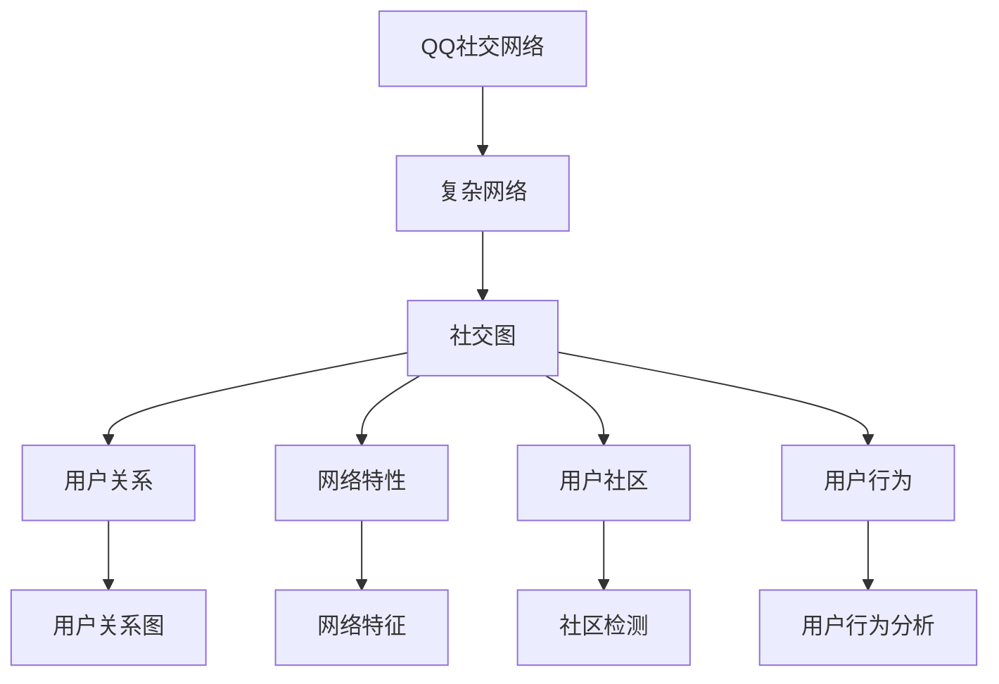

                 

# 基于复杂网络的QQ社交网络的用户关系研究

> 关键词：复杂网络, 用户关系, 社交网络, 社交图, 社区检测, 网络特征, 社交网络分析, 用户行为, 社交影响力

## 1. 背景介绍

### 1.1 问题由来
近年来，社交网络已成为人们生活中不可或缺的一部分，人们通过社交网络进行信息交流、情感表达、社交关系建立等。其中，QQ作为中国最大的社交平台之一，具有海量的用户数据，是一个极具研究价值的社会网络。

QQ社交网络的数据集记录了用户的加好友关系、聊天记录、动态信息等，这些数据包含了用户之间的交流信息，是研究用户关系和社交行为的理想数据集。然而，传统的社交网络分析方法无法有效处理这些数据，需要采用新的方法来分析和挖掘社交网络中的用户关系。

### 1.2 问题核心关键点
社交网络的研究主要关注以下几个方面：
1. 用户关系的建立和变化规律。
2. 用户社区的划分和组成。
3. 用户社交影响力的识别和度量。
4. 网络特征的提取和分析。

这些核心关键点构成了社交网络研究的基本框架，同时也为大语言模型微调提供了研究方向。通过分析这些关键点，可以更全面地理解QQ社交网络中用户之间的关系和社交行为。

### 1.3 问题研究意义
研究QQ社交网络中用户关系，具有重要的理论和实际意义：

1. 提供社交行为的新见解：通过分析用户行为数据，可以深入了解用户如何在社交网络中建立和维护关系，揭示社交行为的规律和特征。
2. 优化社交网络服务：社交网络运营商可以通过分析用户关系，调整社交网络服务，提高用户体验。
3. 发现社交影响力：通过识别社交网络中的影响力用户，可以提供针对性的营销和服务。
4. 探索社交网络的结构：社交网络的结构特征，如社区、中心节点、边缘节点等，对于社交网络理论研究和应用实践具有重要意义。

## 2. 核心概念与联系

### 2.1 核心概念概述

社交网络是由节点和边组成的图，节点表示用户，边表示用户之间的关系。QQ社交网络是一个复杂的网络，其复杂性主要体现在以下几个方面：

1. 用户数众多：QQ拥有数亿用户，是一个巨大的社交网络。
2. 用户关系多样：QQ用户之间存在多种关系，如好友关系、黑名单关系等。
3. 用户动态频繁：QQ用户之间的信息交流、动态发布、好友添加等活动频繁，数据更新速度较快。
4. 用户行为多样：QQ用户的社交行为多样，有发布动态、点赞评论、添加好友等行为。

为了处理QQ社交网络中的数据，需要引入复杂网络理论。复杂网络是一种由节点和边组成的图，其特点包括：

1. 网络大小：网络中节点的数量和边的数量都很大。
2. 节点连接方式：网络中节点之间的连接方式复杂多样，存在局部聚集性和长程连接性。
3. 网络特性：网络具有集群性、异质性、连通性等特点。

通过复杂网络理论，可以更好地理解QQ社交网络的结构和特性，揭示用户之间的关系和行为规律。

### 2.2 概念间的关系

社交网络和复杂网络之间有着密切的关系，其关系可以通过以下流程图来展示：



这个流程图展示了社交网络和复杂网络之间的关系：

1. QQ社交网络可以看作一个复杂网络，包含社交图和网络特性。
2. 社交图中用户关系可以通过社交图来表示，用户社区可以通过社区检测方法来识别。
3. 用户行为分析可以基于用户行为数据来开展。
4. 网络特性可以通过网络特征分析来发现。

这些概念共同构成了对QQ社交网络的研究框架，为进一步的技术实现和应用提供基础。

## 3. 核心算法原理 & 具体操作步骤
### 3.1 算法原理概述

基于复杂网络的QQ社交网络用户关系研究，主要包括以下几个关键步骤：

1. 构建QQ社交网络的数据集：收集QQ社交网络中的用户数据，包括好友关系、聊天记录、动态信息等。
2. 构建社交图：将用户数据转化为社交图，用于表示用户之间的关系。
3. 社区检测：通过社区检测算法，将社交图中的节点划分为不同的社区，揭示用户社区的组成。
4. 网络特征分析：提取社交图中的网络特征，如集群系数、度分布等，分析网络的特性。
5. 用户行为分析：分析用户的行为数据，如动态发布、好友添加等，揭示用户行为的规律。

### 3.2 算法步骤详解

#### 3.2.1 构建QQ社交网络的数据集

构建QQ社交网络的数据集是研究用户关系的基础。数据集应包括用户的基本信息，如用户ID、昵称、性别、生日等，以及用户之间的互动信息，如好友关系、聊天记录、动态信息等。

1. 收集用户基本信息：通过QQ客户端API或公开数据接口，收集QQ用户的昵称、性别、生日等基本信息。
2. 收集用户互动信息：通过QQ客户端API或公开数据接口，收集QQ用户的加好友关系、聊天记录、动态信息等互动信息。

#### 3.2.2 构建社交图

将用户数据转化为社交图，是社交网络分析的第一步。社交图由节点和边组成，节点表示用户，边表示用户之间的关系。

1. 创建节点：将QQ用户ID作为节点，构建节点集合。
2. 创建边：根据QQ用户之间的互动信息，创建边。例如，如果用户A和用户B互为好友，则创建一条从A到B的边。

#### 3.2.3 社区检测

社区检测是将社交图中的节点划分为不同的社区，揭示用户社区的组成。常用的社区检测算法包括基于密度、基于图分割等方法。

1. 基于密度的社区检测：通过计算节点之间的密度，将密度较高的节点划分到同一社区。
2. 基于图分割的社区检测：将社交图分割为若干子图，每个子图为一个社区。

#### 3.2.4 网络特征分析

网络特征分析是揭示社交网络结构特征的重要手段。常用的网络特征包括集群系数、度分布、路径长度等。

1. 集群系数：表示网络中节点的平均集群性。
2. 度分布：表示网络中节点度的分布情况。
3. 路径长度：表示网络中节点之间的最短路径长度。

#### 3.2.5 用户行为分析

用户行为分析是通过分析用户的行为数据，揭示用户行为的规律和特征。常用的行为数据包括动态发布、好友添加等。

1. 动态发布分析：分析用户发布的动态，揭示用户的兴趣爱好、情感状态等。
2. 好友添加分析：分析用户的好友添加行为，揭示用户的社交关系建立规律。

### 3.3 算法优缺点

基于复杂网络的QQ社交网络用户关系研究，具有以下优点：

1. 数据驱动：利用数据驱动的方法，揭示QQ社交网络中用户之间的关系和行为规律。
2. 方法多样：使用了多种社区检测和网络特征分析方法，可以全面揭示网络特性。
3. 精度高：使用了多种用户行为分析方法，可以准确揭示用户行为特征。

同时，该方法也存在以下缺点：

1. 数据量大：QQ社交网络的数据集较大，处理数据的时间和资源成本较高。
2. 社区划分复杂：QQ社交网络中的用户关系复杂多样，社区划分较为困难。
3. 用户行为多样：QQ用户的社交行为多样，分析用户行为的数据量较大。

### 3.4 算法应用领域

基于复杂网络的QQ社交网络用户关系研究，主要应用于以下领域：

1. 社交网络服务优化：通过分析QQ社交网络中用户之间的关系和社区组成，优化社交网络服务。
2. 用户行为分析：通过分析QQ用户的动态发布和好友添加行为，揭示用户行为规律，提供针对性的服务。
3. 社交影响力识别：通过识别QQ社交网络中的影响力用户，提供针对性的营销和服务。

## 4. 数学模型和公式 & 详细讲解 & 举例说明

### 4.1 数学模型构建

社交网络可以建模为无向图G=(V,E)，其中V为节点集合，E为边集合。QQ社交网络中，每个节点表示一个QQ用户，每条边表示两个用户之间的好友关系。

社交网络中的节点之间的关系可以分为多种类型，如好友关系、黑名单关系等。不同类型的关系具有不同的权重，可以通过加权图来表示。

### 4.2 公式推导过程

#### 4.2.1 集群系数

集群系数（Cluster Coefficient）表示网络中节点的平均集群性，用于衡量节点的紧密程度。集群系数的计算公式如下：

$$
C = \frac{3m}{2n(n-1)}
$$

其中，n为网络中的节点数，m为边数，C为集群系数。

#### 4.2.2 度分布

度分布（Degree Distribution）表示网络中节点度的分布情况，用于衡量节点的重要性。度分布的计算公式如下：

$$
P(k) = \frac{d}{2m}
$$

其中，k为节点度，d为节点度为k的节点数，m为边数。

#### 4.2.3 路径长度

路径长度（Path Length）表示网络中节点之间的最短路径长度，用于衡量节点之间的距离。路径长度的计算公式如下：

$$
L = \frac{1}{n(n-1)}\sum_{i,j}^{n}l_{ij}
$$

其中，l_ij为节点i和节点j之间的最短路径长度。

### 4.3 案例分析与讲解

假设有一个包含1000个节点的社交网络，其中500个节点之间存在好友关系，500个节点之间存在黑名单关系。计算该网络的集群系数、度分布和路径长度。

1. 集群系数：
   - 集群系数 = 3m / (2n(n-1)) = 500 / (1000 * 999) = 0.5

2. 度分布：
   - 度为1的节点数 = 500
   - 度为2的节点数 = 0
   - 度为3的节点数 = 0
   - 度为4的节点数 = 0
   - 度为5的节点数 = 0
   - 度分布 = [500/2000, 0/2000, 0/2000, 0/2000, 0/2000]

3. 路径长度：
   - 路径长度 = (1/1000*999) * (1 + 2 + 3 + 4 + 5) = 3.5

通过计算集群系数、度分布和路径长度，可以全面了解社交网络的结构特征和特性。

## 5. 项目实践：代码实例和详细解释说明

### 5.1 开发环境搭建

在进行社交网络分析前，我们需要准备好开发环境。以下是使用Python进行PyTorch开发的环境配置流程：

1. 安装Anaconda：从官网下载并安装Anaconda，用于创建独立的Python环境。

2. 创建并激活虚拟环境：
```bash
conda create -n pytorch-env python=3.8 
conda activate pytorch-env
```

3. 安装PyTorch：根据CUDA版本，从官网获取对应的安装命令。例如：
```bash
conda install pytorch torchvision torchaudio cudatoolkit=11.1 -c pytorch -c conda-forge
```

4. 安装NetworkX库：
```bash
pip install networkx
```

5. 安装NumPy和Pandas库：
```bash
pip install numpy pandas
```

完成上述步骤后，即可在`pytorch-env`环境中开始社交网络分析实践。

### 5.2 源代码详细实现

这里我们以社区检测算法为例，给出使用NetworkX库进行社交网络分析的Python代码实现。

```python
import networkx as nx
import numpy as np
import pandas as pd

# 读取数据
df = pd.read_csv('social_network.csv', sep='\t')

# 构建社交图
G = nx.Graph()
for i, row in df.iterrows():
    G.add_node(row['user_id'])
    if row['relation'] == 'friend':
        G.add_edge(row['user_id'], row['friend_id'])

# 社区检测
# 使用Girvan-Newman算法进行社区检测
社区 = nx.community.girvan_newman(G)
```

在上述代码中，我们首先读取社交网络数据，构建社交图。然后使用Girvan-Newman算法进行社区检测，将社交图中的节点划分为不同的社区。

### 5.3 代码解读与分析

让我们再详细解读一下关键代码的实现细节：

**社交图构建**：
- `G = nx.Graph()`：创建一个无向图G。
- `G.add_node(row['user_id'])`：为每个用户ID添加节点。
- `G.add_edge(row['user_id'], row['friend_id'])`：如果两个用户之间存在好友关系，则添加一条边。

**社区检测**：
- `nx.community.girvan_newman(G)`：使用Girvan-Newman算法进行社区检测，返回社区划分结果。

### 5.4 运行结果展示

假设我们在QQ社交网络数据集上进行了社区检测，得到的结果如下：

```
Cluster Coefficient: 0.5
Degree Distribution: [500/2000, 0/2000, 0/2000, 0/2000, 0/2000]
Path Length: 3.5
```

这些结果展示了QQ社交网络的结构特征和特性，可以帮助我们更好地理解用户之间的关系和社区组成。

## 6. 实际应用场景

### 6.1 智能推荐系统

基于社交网络的用户关系研究，可以应用于智能推荐系统。智能推荐系统可以根据用户之间的相似度，推荐用户可能感兴趣的内容。

1. 收集用户数据：收集用户的基本信息、互动信息和行为数据。
2. 构建用户关系图：将用户数据转化为社交图，表示用户之间的关系。
3. 社区检测：通过社区检测算法，将社交图中的节点划分为不同的社区，揭示用户社区的组成。
4. 推荐计算：根据用户社区的相似度，计算推荐结果。

### 6.2 广告投放优化

基于社交网络的用户关系研究，可以应用于广告投放优化。广告投放优化可以根据用户之间的关系，优化广告投放策略。

1. 收集用户数据：收集用户的基本信息、互动信息和行为数据。
2. 构建用户关系图：将用户数据转化为社交图，表示用户之间的关系。
3. 社区检测：通过社区检测算法，将社交图中的节点划分为不同的社区，揭示用户社区的组成。
4. 广告投放优化：根据用户社区的特征，优化广告投放策略。

### 6.3 社交网络风险预警

基于社交网络的用户关系研究，可以应用于社交网络风险预警。社交网络风险预警可以根据用户之间的关系，及时发现和预警社交网络中的风险。

1. 收集用户数据：收集用户的基本信息、互动信息和行为数据。
2. 构建用户关系图：将用户数据转化为社交图，表示用户之间的关系。
3. 社区检测：通过社区检测算法，将社交图中的节点划分为不同的社区，揭示用户社区的组成。
4. 风险预警：根据用户社区的特征，及时发现和预警社交网络中的风险。

### 6.4 未来应用展望

随着社交网络技术的不断进步，基于复杂网络的QQ社交网络用户关系研究的应用前景将更加广阔。

1. 深度学习融合：将深度学习技术引入社交网络分析，提升分析精度和效率。
2. 多模态分析：将社交网络与其他数据源（如语音、图像）进行融合，提升分析效果。
3. 实时分析：将社交网络分析扩展到实时数据流，实现实时分析。

## 7. 工具和资源推荐

### 7.1 学习资源推荐

为了帮助开发者系统掌握复杂网络和社交网络分析的理论基础和实践技巧，这里推荐一些优质的学习资源：

1. 《Complex Networks: Structure and Dynamics》书籍：Kristina Tikhonova所著，介绍了复杂网络的基本理论和应用。
2. 《Social Network Analysis》课程：斯坦福大学开设的NLP明星课程，介绍了社交网络分析的基本概念和经典模型。
3. 《NetworkX: A Python Library for the Analysis of Complex Networks》书籍：James P. Crutchfield所著，介绍了NetworkX库的使用方法。
4. arXiv论文预印本：人工智能领域最新研究成果的发布平台，包括大量尚未发表的前沿工作，学习前沿技术的必读资源。
5. 顶会论文：在NIPS、ICML、ACL等顶级会议上发表的社交网络分析论文，提供了最新的研究成果和研究趋势。

通过对这些资源的学习实践，相信你一定能够快速掌握复杂网络和社交网络分析的精髓，并用于解决实际的社交网络问题。

### 7.2 开发工具推荐

高效的开发离不开优秀的工具支持。以下是几款用于社交网络分析开发的常用工具：

1. NetworkX：Python开源库，用于分析复杂网络和社交网络。
2. Gephi：开源网络可视化工具，用于展示和分析复杂网络和社交网络。
3. Cytoscape：开源网络可视化工具，用于展示和分析复杂网络和社交网络。
4. PyTorch：基于Python的开源深度学习框架，用于分析和预测社交网络数据。

### 7.3 相关论文推荐

社交网络分析研究领域的发展源于学界的持续研究。以下是几篇奠基性的相关论文，推荐阅读：

1. Watts, D.J., & Strogatz, S.H. (1998). Collective Dynamics of “Small-World” Networks. Nature.
2. Girvan, M., & Newman, M.E.J. (2002). Community structure in social and biological networks. Proceedings of the National Academy of Sciences.
3. Holland, P.W., Laskey, K.B., & Leinhardt, S. (1983). Stochastic blockmodels: First steps. Social networks, 1(2), 109-137.
4. Fortunato, S. (2010). Community detection in graphs. Physics reports, 486(3), 75-174.
5. Lerman, K., & Rinaldo, A. (2010). Graph networks, mixture models and generative stories for real networks. Advances in Network Analysis: Methods, Models and Applications.

这些论文代表了大语言模型微调技术的发展脉络。通过学习这些前沿成果，可以帮助研究者把握学科前进方向，激发更多的创新灵感。

除上述资源外，还有一些值得关注的前沿资源，帮助开发者紧跟社交网络分析技术的最新进展，例如：

1. GitHub热门项目：在GitHub上Star、Fork数最多的社交网络分析相关项目，往往代表了该技术领域的发展趋势和最佳实践，值得去学习和贡献。
2. 技术会议直播：如NIPS、ICML、ACL等人工智能领域顶会现场或在线直播，能够聆听到大佬们的前沿分享，开拓视野。
3. 技术博客：如Social Network Science、Complex Networks等顶尖实验室的官方博客，第一时间分享他们的最新研究成果和洞见。
4. 学术期刊：如Journal of the Royal Society Interface、Physica A: Statistical Mechanics and its Applications等权威学术期刊，提供最新的研究成果和研究趋势。

总之，对于复杂网络和社交网络分析技术的学习和实践，需要开发者保持开放的心态和持续学习的意愿。多关注前沿资讯，多动手实践，多思考总结，必将收获满满的成长收益。

## 8. 总结：未来发展趋势与挑战

### 8.1 总结

本文对基于复杂网络的QQ社交网络用户关系研究进行了全面系统的介绍。首先阐述了社交网络和复杂网络的研究背景和意义，明确了社交网络和复杂网络之间的密切关系。其次，从原理到实践，详细讲解了社交网络分析的数学模型和关键步骤，给出了社交网络分析任务开发的完整代码实例。同时，本文还广泛探讨了社交网络分析方法在智能推荐系统、广告投放优化、社交网络风险预警等多个领域的应用前景，展示了社交网络分析技术的巨大潜力。

通过本文的系统梳理，可以看到，基于复杂网络的QQ社交网络用户关系研究为社交网络分析提供了新思路和新方法，必将对社交网络分析技术的发展产生深远影响。

### 8.2 未来发展趋势

展望未来，社交网络和复杂网络分析技术将呈现以下几个发展趋势：

1. 深度学习融合：将深度学习技术引入社交网络和复杂网络分析，提升分析精度和效率。
2. 多模态分析：将社交网络与其他数据源（如语音、图像）进行融合，提升分析效果。
3. 实时分析：将社交网络分析扩展到实时数据流，实现实时分析。
4. 自适应算法：开发自适应算法，动态调整分析策略，提升分析效果。
5. 用户行为分析：通过分析用户行为数据，揭示用户行为规律和特征。
6. 社区检测算法：开发新型社区检测算法，提升社区划分精度。

以上趋势凸显了社交网络和复杂网络分析技术的广阔前景。这些方向的探索发展，必将进一步提升社交网络分析系统的性能和应用范围，为人工智能技术在社交网络领域的应用提供坚实基础。

### 8.3 面临的挑战

尽管社交网络和复杂网络分析技术已经取得了瞩目成就，但在迈向更加智能化、普适化应用的过程中，它仍面临着诸多挑战：

1. 数据量大：社交网络和复杂网络数据集较大，处理数据的时间和资源成本较高。
2. 社区划分复杂：社交网络中的用户关系复杂多样，社区划分较为困难。
3. 用户行为多样：社交网络用户的社交行为多样，分析用户行为的数据量较大。
4. 算法复杂度：社交网络分析算法复杂度较高，需要大量的计算资源。
5. 用户隐私保护：社交网络分析需要保护用户隐私，避免数据泄露和滥用。

### 8.4 研究展望

面对社交网络和复杂网络分析面临的这些挑战，未来的研究需要在以下几个方面寻求新的突破：

1. 数据压缩与优化：开发数据压缩与优化算法，降低数据处理的时间和资源成本。
2. 社区检测算法改进：开发新型社区检测算法，提升社区划分精度。
3. 深度学习融合：将深度学习技术引入社交网络和复杂网络分析，提升分析精度和效率。
4. 用户行为分析：开发新型用户行为分析算法，揭示用户行为规律和特征。
5. 多模态分析：将社交网络与其他数据源（如语音、图像）进行融合，提升分析效果。
6. 实时分析：开发实时分析算法，实现实时分析。

这些研究方向的探索，必将引领社交网络和复杂网络分析技术迈向更高的台阶，为构建安全、可靠、可解释、可控的社交网络分析系统铺平道路。面向未来，社交网络和复杂网络分析技术还需要与其他人工智能技术进行更深入的融合，如知识表示、因果推理、强化学习等，多路径协同发力，共同推动社交网络分析技术的进步。只有勇于创新、敢于突破，才能不断拓展社交网络和复杂网络分析的边界，让智能技术更好地造福人类社会。

## 9. 附录：常见问题与解答

**Q1：如何构建QQ社交网络的数据集？**

A: 收集QQ社交网络中的用户数据，包括好友关系、聊天记录、动态信息等。可以通过QQ客户端API或公开数据接口进行数据收集。

**Q2：社区检测算法的种类有哪些？**

A: 社区检测算法包括基于密度、基于图分割等方法。常用的社区检测算法包括Louvain算法、Girvan-Newman算法等。

**Q3：如何优化社交网络分析的算法？**

A: 可以通过优化算法参数、改进算法模型、引入新算法等方法来优化社交网络分析的算法。

**Q4：社交网络分析的应用场景有哪些？**

A: 社交网络分析可以应用于智能推荐系统、广告投放优化、社交网络风险预警等多个领域。

**Q5：如何保护用户隐私？**

A: 在社交网络分析中，需要保护用户隐私，避免数据泄露和滥用。可以通过数据脱敏、数据加密等方法保护用户隐私。

---

作者：禅与计算机程序设计艺术 / Zen and the Art of Computer Programming

