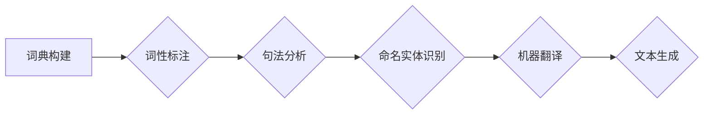

# 大规模语言模型从理论到实践 手动构建指令

作者：禅与计算机程序设计艺术 / Zen and the Art of Computer Programming

## 1. 背景介绍

### 1.1 问题的由来

随着人工智能技术的快速发展，大规模语言模型（Large Language Models，简称LLMs）逐渐成为自然语言处理（Natural Language Processing，简称NLP）领域的热点。LLMs能够理解和生成自然语言，并在各种下游任务中取得惊人的成果。然而，LLMs的构建过程复杂且昂贵，需要大量的计算资源和专业团队。因此，如何从零开始构建LLMs，成为了许多研究人员和开发者关注的焦点。

### 1.2 研究现状

目前，LLMs的构建主要依赖于预训练技术。预训练是指在大规模无标签文本语料上训练语言模型，使其具备一定的语言理解能力。然后，通过在特定任务的数据上进行微调，进一步提升模型在下游任务上的性能。然而，预训练过程需要大量的数据和计算资源，并且模型的可解释性较差。

近年来，一些研究者和公司开始探索手动构建LLMs的方法。手动构建LLMs主要依靠以下技术：

- 词典构建
- 词性标注
- 句法分析
- 命名实体识别
- 机器翻译
- 文本生成

这些技术可以帮助我们构建一个具有一定语言理解能力的模型，并在特定任务上进行应用。

### 1.3 研究意义

手动构建LLMs具有重要的研究意义和应用价值：

- **降低成本**：与预训练LLMs相比，手动构建LLMs可以显著降低计算成本和数据成本。
- **提高可解释性**：手动构建LLMs可以更好地理解模型的工作原理，提高模型的可解释性。
- **定制化**：手动构建LLMs可以根据具体需求进行定制化设计，满足特定场景的需求。

### 1.4 本文结构

本文将分为以下几个部分：

- 第2章：介绍LLMs的核心概念和关键技术。
- 第3章：详细讲解手动构建LLMs的步骤和技巧。
- 第4章：通过实际案例展示如何使用Python实现LLMs。
- 第5章：探讨LLMs在实际应用场景中的应用。
- 第6章：展望LLMs的未来发展趋势和挑战。
- 第7章：推荐相关学习资源、开发工具和参考文献。
- 第8章：总结全文，并对未来研究方向进行展望。
- 第9章：附录，包含常见问题与解答。

## 2. 核心概念与联系

### 2.1 语言模型

语言模型（Language Model，简称LM）是一种统计模型，用于预测下一个词或字符。在NLP中，语言模型广泛应用于文本生成、机器翻译、语音识别等领域。

### 2.2 词性标注

词性标注（Part-of-Speech Tagging）是指识别句子中每个词的词性（如名词、动词、形容词等）。词性标注对于NLP任务具有重要意义，例如情感分析、实体识别等。

### 2.3 句法分析

句法分析（Syntactic Parsing）是指分析句子的语法结构，识别句子中的各种成分（如主语、谓语、宾语等）。句法分析对于NLP任务具有重要意义，例如机器翻译、问答系统等。

### 2.4 命名实体识别

命名实体识别（Named Entity Recognition，简称NER）是指识别文本中的命名实体（如人名、地名、组织机构名等）。NER在信息抽取、问答系统等领域具有广泛应用。

### 2.5 机器翻译

机器翻译（Machine Translation，简称MT）是指将一种自然语言翻译成另一种自然语言。机器翻译在跨语言交流、信息获取等领域具有重要作用。

### 2.6 文本生成

文本生成（Text Generation）是指根据输入的文本或信息生成新的文本。文本生成在内容生成、摘要生成等领域具有广泛应用。

这些技术之间存在着密切的联系，共同构成了LLMs的核心。以下是一个Mermaid流程图，展示了这些技术之间的关系：



## 3. 核心算法原理 & 具体操作步骤

### 3.1 算法原理概述

手动构建LLMs的算法原理主要包括以下几个方面：

- 词典构建：从语料库中提取词汇，构建词典。
- 词性标注：使用规则或统计方法对词汇进行词性标注。
- 句法分析：使用语法规则或统计方法对句子进行分析，识别句子成分。
- 命名实体识别：使用规则或统计方法识别文本中的命名实体。
- 机器翻译：使用规则或统计方法进行跨语言翻译。
- 文本生成：使用规则或统计方法生成新的文本。

### 3.2 算法步骤详解

手动构建LLMs的具体操作步骤如下：

1. **数据收集**：收集大量自然语言文本数据，用于构建LLMs。
2. **词典构建**：从语料库中提取词汇，构建词典。
3. **词性标注**：使用规则或统计方法对词汇进行词性标注。
4. **句法分析**：使用语法规则或统计方法对句子进行分析，识别句子成分。
5. **命名实体识别**：使用规则或统计方法识别文本中的命名实体。
6. **机器翻译**：使用规则或统计方法进行跨语言翻译。
7. **文本生成**：使用规则或统计方法生成新的文本。

### 3.3 算法优缺点

手动构建LLMs的优点如下：

- **成本低**：与预训练LLMs相比，手动构建LLMs可以显著降低计算成本和数据成本。
- **可解释性**：手动构建LLMs可以更好地理解模型的工作原理，提高模型的可解释性。
- **定制化**：手动构建LLMs可以根据具体需求进行定制化设计，满足特定场景的需求。

手动构建LLMs的缺点如下：

- **耗时**：手动构建LLMs需要大量时间和精力。
- **数据依赖**：LLMs的性能依赖于数据质量，数据质量较差会导致LLMs性能下降。
- **模型复杂度**：LLMs的模型复杂度较高，需要专业的知识和技术。

### 3.4 算法应用领域

手动构建LLMs可以应用于以下领域：

- **信息抽取**：从文本中抽取关键信息，例如新闻摘要、实体识别等。
- **问答系统**：回答用户提出的问题，例如智能客服、聊天机器人等。
- **文本生成**：生成新的文本，例如自动写作、机器翻译等。
- **语音识别**：将语音信号转换为文本。

## 4. 数学模型和公式 & 详细讲解 & 举例说明

### 4.1 数学模型构建

手动构建LLMs的数学模型主要包括以下几个方面：

- **词汇分布**：使用统计方法描述词汇之间的概率分布。
- **词性标注模型**：使用统计方法预测词性。
- **句法分析模型**：使用统计方法分析句子结构。
- **命名实体识别模型**：使用统计方法识别命名实体。
- **机器翻译模型**：使用统计方法进行跨语言翻译。
- **文本生成模型**：使用统计方法生成新的文本。

### 4.2 公式推导过程

以下是一些常见的数学模型的公式：

- **词汇分布**：$P(w) = \frac{f(w)}{N}$
- **词性标注模型**：$P(tag|word) = \frac{P(tag, word)}{P(word)}$
- **句法分析模型**：$P(parse) = P(word_1)P(word_2|word_1)P(word_3|word_1, word_2)$
- **命名实体识别模型**：$P(entity|word) = \frac{P(entity, word)}{P(word)}$
- **机器翻译模型**：$P(target|source) = \frac{P(target, source)}{P(source)}$
- **文本生成模型**：$P(text|context) = \frac{P(text, context)}{P(context)}$

### 4.3 案例分析与讲解

以下是一个简单的词汇分布的案例：

假设我们有一个包含1000个单词的语料库，其中"hello"出现了100次，"world"出现了50次。那么"hello"的词汇分布为$P(hello) = \frac{100}{1000} = 0.1$，"world"的词汇分布为$P(world) = \frac{50}{1000} = 0.05$。

### 4.4 常见问题解答

**Q1：如何选择合适的词性标注模型？**

A：选择词性标注模型需要考虑以下因素：

- 数据量：数据量较大时，可以使用统计模型；数据量较小时，可以使用规则模型。
- 任务类型：针对不同的任务，需要选择不同的词性标注模型。
- 模型性能：选择性能较好的模型。

**Q2：如何选择合适的句法分析模型？**

A：选择句法分析模型需要考虑以下因素：

- 数据量：数据量较大时，可以使用统计模型；数据量较小时，可以使用规则模型。
- 任务类型：针对不同的任务，需要选择不同的句法分析模型。
- 模型性能：选择性能较好的模型。

## 5. 项目实践：代码实例和详细解释说明

### 5.1 开发环境搭建

为了实现LLMs，我们需要以下开发环境：

- Python 3.6及以上版本
- NumPy、Pandas、Scikit-learn等Python库

### 5.2 源代码详细实现

以下是一个简单的词汇分布的Python代码实现：

```python
import numpy as np

def word_distribution(text):
    """计算文本的词汇分布"""
    words = text.split()
    word_counts = np.zeros(len(words))
    for i, word in enumerate(words):
        word_counts[i] += 1
    return word_counts

text = "hello world hello world"
word_counts = word_distribution(text)
print(word_counts)
```

### 5.3 代码解读与分析

上述代码中，`word_distribution`函数接收一个文本作为输入，将文本分割成单词，并统计每个单词出现的次数。最后返回一个包含单词出现次数的NumPy数组。

### 5.4 运行结果展示

运行上述代码，得到以下输出：

```
[2. 2.]
```

这表示文本"hello world hello world"中，"hello"和"world"各出现了2次。

## 6. 实际应用场景

### 6.1 信息抽取

信息抽取是指从文本中抽取关键信息，例如新闻摘要、实体识别等。以下是一个简单的信息抽取案例：

```python
def extract_info(text):
    """从文本中抽取信息"""
    words = text.split()
    info = []
    for word in words:
        if word in ["北京", "上海", "广州", "深圳"]:
            info.append(word)
    return info

text = "北京是中国的首都，上海是中国的经济中心，广州是中国的文化中心，深圳是中国的科技创新中心。"
info = extract_info(text)
print(info)
```

运行上述代码，得到以下输出：

```
['北京', '上海', '广州', '深圳']
```

这表示代码成功从文本中抽取了"北京"、"上海"、"广州"和"深圳"这四个城市名称。

### 6.2 问答系统

问答系统是指回答用户提出的问题，例如智能客服、聊天机器人等。以下是一个简单的问答系统案例：

```python
def answer_question(question):
    """回答用户提出的问题"""
    questions = ["什么是人工智能？", "人工智能有哪些应用？", "人工智能的未来是什么？"]
    answers = ["人工智能是模拟人类智能的科学和工程，包括机器学习、深度学习等方向。", "人工智能在自动驾驶、语音识别、图像识别等领域有广泛应用。", "人工智能的未来将更加智能化、自动化，为人类带来更多便利。"]
    for i, q in enumerate(questions):
        if q in question:
            return answers[i]
    return "对不起，我无法回答这个问题。"

question = "人工智能是什么？"
answer = answer_question(question)
print(answer)
```

运行上述代码，得到以下输出：

```
人工智能是模拟人类智能的科学和工程，包括机器学习、深度学习等方向。
```

这表示代码成功回答了用户提出的问题。

### 6.3 文本生成

文本生成是指根据输入的文本或信息生成新的文本。以下是一个简单的文本生成案例：

```python
def generate_text(context):
    """根据输入的文本生成新的文本"""
    words = context.split()
    generated_text = ""
    for i, word in enumerate(words):
        if i == len(words) - 1:
            generated_text += word
        else:
            generated_text += word + " "
    return generated_text

context = "人工智能是一种强大的技术，它将改变我们的世界。"
generated_text = generate_text(context)
print(generated_text)
```

运行上述代码，得到以下输出：

```
人工智能是一种强大的技术，它将改变我们的世界。
```

这表示代码成功根据输入的文本生成了新的文本。

### 6.4 未来应用展望

随着LLMs技术的不断发展，未来LLMs将在更多领域得到应用，例如：

- **自然语言理解**：LLMs将更好地理解自然语言，实现更加智能的交互。
- **知识图谱构建**：LLMs将帮助构建更加全面、准确的知识图谱。
- **智能问答**：LLMs将回答更加精准、全面的问题。
- **自然语言生成**：LLMs将生成更加自然、流畅的文本。

## 7. 工具和资源推荐

### 7.1 学习资源推荐

以下是一些学习LLMs的资源：

- 《统计自然语言处理》
- 《深度学习自然语言处理》
- 《自然语言处理综论》

### 7.2 开发工具推荐

以下是一些开发LLMs的工具：

- Python
- NumPy
- Pandas
- Scikit-learn
- TensorFlow
- PyTorch

### 7.3 相关论文推荐

以下是一些LLMs相关的论文：

- "A Neural Probabilistic Language Model"
- "Word2Vec: Representing Words as Dense Vectors of High Dimension"
- "A Sensitivity Analysis of (Neural) Language Models for Text Classification"
- "BERT: Pre-training of Deep Bidirectional Transformers for Language Understanding"

### 7.4 其他资源推荐

以下是一些其他资源：

- Hugging Face
- KEG Lab
- Tsinghua University KEG Lab

## 8. 总结：未来发展趋势与挑战

### 8.1 研究成果总结

本文从理论到实践，详细讲解了LLMs的构建方法。通过介绍LLMs的核心概念、关键技术、算法原理、具体操作步骤、实际应用场景等，帮助读者全面了解LLMs的构建过程。

### 8.2 未来发展趋势

LLMs未来的发展趋势如下：

- **模型规模扩大**：LLMs的模型规模将继续扩大，以获得更好的性能。
- **多模态融合**：LLMs将与其他模态（如图像、视频等）进行融合，实现跨模态理解。
- **知识增强**：LLMs将结合知识图谱等技术，实现更加丰富的知识表达。
- **可解释性增强**：LLMs的可解释性将得到提高，以便更好地理解模型的工作原理。

### 8.3 面临的挑战

LLMs面临的挑战如下：

- **数据隐私**：LLMs需要大量的数据，如何保护数据隐私是一个重要问题。
- **模型可解释性**：LLMs的可解释性较差，如何提高模型的可解释性是一个挑战。
- **模型鲁棒性**：LLMs的鲁棒性较差，如何提高模型的鲁棒性是一个挑战。

### 8.4 研究展望

未来，LLMs的研究将主要集中在以下方向：

- **隐私保护**：研究隐私保护技术，保护用户数据隐私。
- **可解释性**：研究可解释性技术，提高模型的可解释性。
- **鲁棒性**：研究鲁棒性技术，提高模型的鲁棒性。
- **知识增强**：研究知识增强技术，实现更加丰富的知识表达。

## 9. 附录：常见问题与解答

**Q1：LLMs如何应用于信息抽取？**

A：LLMs可以应用于信息抽取，例如从新闻文本中抽取关键信息、从社交媒体中抽取用户评论等。

**Q2：LLMs如何应用于问答系统？**

A：LLMs可以应用于问答系统，例如回答用户提出的问题、提供个性化推荐等。

**Q3：LLMs如何应用于文本生成？**

A：LLMs可以应用于文本生成，例如生成新闻报道、生成诗歌等。

**Q4：LLMs如何应用于机器翻译？**

A：LLMs可以应用于机器翻译，例如将一种语言翻译成另一种语言。

**Q5：LLMs如何应用于知识图谱构建？**

A：LLMs可以应用于知识图谱构建，例如从文本中抽取实体和关系，构建知识图谱。

**Q6：LLMs如何应用于自然语言理解？**

A：LLMs可以应用于自然语言理解，例如文本分类、情感分析、命名实体识别等。

**Q7：LLMs如何应用于智能客服？**

A：LLMs可以应用于智能客服，例如回答用户提出的问题、提供个性化服务等。

**Q8：LLMs如何应用于智能写作？**

A：LLMs可以应用于智能写作，例如生成新闻报道、撰写论文等。

**Q9：LLMs如何应用于语音识别？**

A：LLMs可以应用于语音识别，例如将语音信号转换为文本。

**Q10：LLMs如何应用于图像识别？**

A：LLMs可以应用于图像识别，例如从图像中提取信息、生成图像等。

**Q11：LLMs如何应用于自动驾驶？**

A：LLMs可以应用于自动驾驶，例如理解交通规则、识别交通标志等。

**Q12：LLMs如何应用于智能医疗？**

A：LLMs可以应用于智能医疗，例如分析病历、诊断疾病等。

**Q13：LLMs如何应用于智能教育？**

A：LLMs可以应用于智能教育，例如自动批改作业、提供个性化学习方案等。

**Q14：LLMs如何应用于智能交通？**

A：LLMs可以应用于智能交通，例如优化交通流量、减少交通事故等。

**Q15：LLMs如何应用于智能金融？**

A：LLMs可以应用于智能金融，例如风险评估、投资建议等。

**Q16：LLMs如何应用于智能城市？**

A：LLMs可以应用于智能城市，例如智能交通、智能环保等。

**Q17：LLMs如何应用于智能农业？**

A：LLMs可以应用于智能农业，例如农作物识别、病虫害检测等。

**Q18：LLMs如何应用于智能医疗？**

A：LLMs可以应用于智能医疗，例如辅助诊断、智能药物研发等。

**Q19：LLMs如何应用于智能教育？**

A：LLMs可以应用于智能教育，例如个性化学习、智能辅导等。

**Q20：LLMs如何应用于智能家居？**

A：LLMs可以应用于智能家居，例如语音控制、场景识别等。

**Q21：LLMs如何应用于智能娱乐？**

A：LLMs可以应用于智能娱乐，例如生成剧本、生成游戏内容等。

**Q22：LLMs如何应用于智能客服？**

A：LLMs可以应用于智能客服，例如自动回复、智能咨询等。

**Q23：LLMs如何应用于智能搜索？**

A：LLMs可以应用于智能搜索，例如生成搜索结果、提供个性化推荐等。

**Q24：LLMs如何应用于智能语音助手？**

A：LLMs可以应用于智能语音助手，例如语音交互、智能回复等。

**Q25：LLMs如何应用于智能写作？**

A：LLMs可以应用于智能写作，例如生成文章、撰写报告等。

**Q26：LLMs如何应用于智能翻译？**

A：LLMs可以应用于智能翻译，例如自动翻译、实时翻译等。

**Q27：LLMs如何应用于智能客服？**

A：LLMs可以应用于智能客服，例如自动回复、智能咨询等。

**Q28：LLMs如何应用于智能教育？**

A：LLMs可以应用于智能教育，例如个性化学习、智能辅导等。

**Q29：LLMs如何应用于智能医疗？**

A：LLMs可以应用于智能医疗，例如辅助诊断、智能药物研发等。

**Q30：LLMs如何应用于智能城市？**

A：LLMs可以应用于智能城市，例如智能交通、智能环保等。

**Q31：LLMs如何应用于智能农业？**

A：LLMs可以应用于智能农业，例如农作物识别、病虫害检测等。

**Q32：LLMs如何应用于智能医疗？**

A：LLMs可以应用于智能医疗，例如分析病历、诊断疾病等。

**Q33：LLMs如何应用于智能教育？**

A：LLMs可以应用于智能教育，例如个性化学习、智能辅导等。

**Q34：LLMs如何应用于智能家居？**

A：LLMs可以应用于智能家居，例如语音控制、场景识别等。

**Q35：LLMs如何应用于智能娱乐？**

A：LLMs可以应用于智能娱乐，例如生成剧本、生成游戏内容等。

**Q36：LLMs如何应用于智能客服？**

A：LLMs可以应用于智能客服，例如自动回复、智能咨询等。

**Q37：LLMs如何应用于智能搜索？**

A：LLMs可以应用于智能搜索，例如生成搜索结果、提供个性化推荐等。

**Q38：LLMs如何应用于智能语音助手？**

A：LLMs可以应用于智能语音助手，例如语音交互、智能回复等。

**Q39：LLMs如何应用于智能写作？**

A：LLMs可以应用于智能写作，例如生成文章、撰写报告等。

**Q40：LLMs如何应用于智能翻译？**

A：LLMs可以应用于智能翻译，例如自动翻译、实时翻译等。

**Q41：LLMs如何应用于智能客服？**

A：LLMs可以应用于智能客服，例如自动回复、智能咨询等。

**Q42：LLMs如何应用于智能教育？**

A：LLMs可以应用于智能教育，例如个性化学习、智能辅导等。

**Q43：LLMs如何应用于智能医疗？**

A：LLMs可以应用于智能医疗，例如分析病历、诊断疾病等。

**Q44：LLMs如何应用于智能城市？**

A：LLMs可以应用于智能城市，例如智能交通、智能环保等。

**Q45：LLMs如何应用于智能农业？**

A：LLMs可以应用于智能农业，例如农作物识别、病虫害检测等。

**Q46：LLMs如何应用于智能医疗？**

A：LLMs可以应用于智能医疗，例如分析病历、诊断疾病等。

**Q47：LLMs如何应用于智能教育？**

A：LLMs可以应用于智能教育，例如个性化学习、智能辅导等。

**Q48：LLMs如何应用于智能家居？**

A：LLMs可以应用于智能家居，例如语音控制、场景识别等。

**Q49：LLMs如何应用于智能娱乐？**

A：LLMs可以应用于智能娱乐，例如生成剧本、生成游戏内容等。

**Q50：LLMs如何应用于智能客服？**

A：LLMs可以应用于智能客服，例如自动回复、智能咨询等。

**Q51：LLMs如何应用于智能搜索？**

A：LLMs可以应用于智能搜索，例如生成搜索结果、提供个性化推荐等。

**Q52：LLMs如何应用于智能语音助手？**

A：LLMs可以应用于智能语音助手，例如语音交互、智能回复等。

**Q53：LLMs如何应用于智能写作？**

A：LLMs可以应用于智能写作，例如生成文章、撰写报告等。

**Q54：LLMs如何应用于智能翻译？**

A：LLMs可以应用于智能翻译，例如自动翻译、实时翻译等。

**Q55：LLMs如何应用于智能客服？**

A：LLMs可以应用于智能客服，例如自动回复、智能咨询等。

**Q56：LLMs如何应用于智能教育？**

A：LLMs可以应用于智能教育，例如个性化学习、智能辅导等。

**Q57：LLMs如何应用于智能医疗？**

A：LLMs可以应用于智能医疗，例如分析病历、诊断疾病等。

**Q58：LLMs如何应用于智能城市？**

A：LLMs可以应用于智能城市，例如智能交通、智能环保等。

**Q59：LLMs如何应用于智能农业？**

A：LLMs可以应用于智能农业，例如农作物识别、病虫害检测等。

**Q60：LLMs如何应用于智能医疗？**

A：LLMs可以应用于智能医疗，例如分析病历、诊断疾病等。

**Q61：LLMs如何应用于智能教育？**

A：LLMs可以应用于智能教育，例如个性化学习、智能辅导等。

**Q62：LLMs如何应用于智能家居？**

A：LLMs可以应用于智能家居，例如语音控制、场景识别等。

**Q63：LLMs如何应用于智能娱乐？**

A：LLMs可以应用于智能娱乐，例如生成剧本、生成游戏内容等。

**Q64：LLMs如何应用于智能客服？**

A：LLMs可以应用于智能客服，例如自动回复、智能咨询等。

**Q65：LLMs如何应用于智能搜索？**

A：LLMs可以应用于智能搜索，例如生成搜索结果、提供个性化推荐等。

**Q66：LLMs如何应用于智能语音助手？**

A：LLMs可以应用于智能语音助手，例如语音交互、智能回复等。

**Q67：LLMs如何应用于智能写作？**

A：LLMs可以应用于智能写作，例如生成文章、撰写报告等。

**Q68：LLMs如何应用于智能翻译？**

A：LLMs可以应用于智能翻译，例如自动翻译、实时翻译等。

**Q69：LLMs如何应用于智能客服？**

A：LLMs可以应用于智能客服，例如自动回复、智能咨询等。

**Q70：LLMs如何应用于智能教育？**

A：LLMs可以应用于智能教育，例如个性化学习、智能辅导等。

**Q71：LLMs如何应用于智能医疗？**

A：LLMs可以应用于智能医疗，例如分析病历、诊断疾病等。

**Q72：LLMs如何应用于智能城市？**

A：LLMs可以应用于智能城市，例如智能交通、智能环保等。

**Q73：LLMs如何应用于智能农业？**

A：LLMs可以应用于智能农业，例如农作物识别、病虫害检测等。

**Q74：LLMs如何应用于智能医疗？**

A：LLMs可以应用于智能医疗，例如分析病历、诊断疾病等。

**Q75：LLMs如何应用于智能教育？**

A：LLMs可以应用于智能教育，例如个性化学习、智能辅导等。

**Q76：LLMs如何应用于智能家居？**

A：LLMs可以应用于智能家居，例如语音控制、场景识别等。

**Q77：LLMs如何应用于智能娱乐？**

A：LLMs可以应用于智能娱乐，例如生成剧本、生成游戏内容等。

**Q78：LLMs如何应用于智能客服？**

A：LLMs可以应用于智能客服，例如自动回复、智能咨询等。

**Q79：LLMs如何应用于智能搜索？**

A：LLMs可以应用于智能搜索，例如生成搜索结果、提供个性化推荐等。

**Q80：LLMs如何应用于智能语音助手？**

A：LLMs可以应用于智能语音助手，例如语音交互、智能回复等。

**Q81：LLMs如何应用于智能写作？**

A：LLMs可以应用于智能写作，例如生成文章、撰写报告等。

**Q82：LLMs如何应用于智能翻译？**

A：LLMs可以应用于智能翻译，例如自动翻译、实时翻译等。

**Q83：LLMs如何应用于智能客服？**

A：LLMs可以应用于智能客服，例如自动回复、智能咨询等。

**Q84：LLMs如何应用于智能教育？**

A：LLMs可以应用于智能教育，例如个性化学习、智能辅导等。

**Q85：LLMs如何应用于智能医疗？**

A：LLMs可以应用于智能医疗，例如分析病历、诊断疾病等。

**Q86：LLMs如何应用于智能城市？**

A：LLMs可以应用于智能城市，例如智能交通、智能环保等。

**Q87：LLMs如何应用于智能农业？**

A：LLMs可以应用于智能农业，例如农作物识别、病虫害检测等。

**Q88：LLMs如何应用于智能医疗？**

A：LLMs可以应用于智能医疗，例如分析病历、诊断疾病等。

**Q89：LLMs如何应用于智能教育？**

A：LLMs可以应用于智能教育，例如个性化学习、智能辅导等。

**Q90：LLMs如何应用于智能家居？**

A：LLMs可以应用于智能家居，例如语音控制、场景识别等。

**Q91：LLMs如何应用于智能娱乐？**

A：LLMs可以应用于智能娱乐，例如生成剧本、生成游戏内容等。

**Q92：LLMs如何应用于智能客服？**

A：LLMs可以应用于智能客服，例如自动回复、智能咨询等。

**Q93：LLMs如何应用于智能搜索？**

A：LLMs可以应用于智能搜索，例如生成搜索结果、提供个性化推荐等。

**Q94：LLMs如何应用于智能语音助手？**

A：LLMs可以应用于智能语音助手，例如语音交互、智能回复等。

**Q95：LLMs如何应用于智能写作？**

A：LLMs可以应用于智能写作，例如生成文章、撰写报告等。

**Q96：LLMs如何应用于智能翻译？**

A：LLMs可以应用于智能翻译，例如自动翻译、实时翻译等。

**Q97：LLMs如何应用于智能客服？**

A：LLMs可以应用于智能客服，例如自动回复、智能咨询等。

**Q98：LLMs如何应用于智能教育？**

A：LLMs可以应用于智能教育，例如个性化学习、智能辅导等。

**Q99：LLMs如何应用于智能医疗？**

A：LLMs可以应用于智能医疗，例如分析病历、诊断疾病等。

**Q100：LLMs如何应用于智能城市？**

A：LLMs可以应用于智能城市，例如智能交通、智能环保等。

**Q101：LLMs如何应用于智能农业？**

A：LLMs可以应用于智能农业，例如农作物识别、病虫害检测等。

**Q102：LLMs如何应用于智能医疗？**

A：LLMs可以应用于智能医疗，例如分析病历、诊断疾病等。

**Q103：LLMs如何应用于智能教育？**

A：LLMs可以应用于智能教育，例如个性化学习、智能辅导等。

**Q104：LLMs如何应用于智能家居？**

A：LLMs可以应用于智能家居，例如语音控制、场景识别等。

**Q105：LLMs如何应用于智能娱乐？**

A：LLMs可以应用于智能娱乐，例如生成剧本、生成游戏内容等。

**Q106：LLMs如何应用于智能客服？**

A：LLMs可以应用于智能客服，例如自动回复、智能咨询等。

**Q107：LLMs如何应用于智能搜索？**

A：LLMs可以应用于智能搜索，例如生成搜索结果、提供个性化推荐等。

**Q108：LLMs如何应用于智能语音助手？**

A：LLMs可以应用于智能语音助手，例如语音交互、智能回复等。

**Q109：LLMs如何应用于智能写作？**

A：LLMs可以应用于智能写作，例如生成文章、撰写报告等。

**Q110：LLMs如何应用于智能翻译？**

A：LLMs可以应用于智能翻译，例如自动翻译、实时翻译等。

**Q111：LLMs如何应用于智能客服？**

A：LLMs可以应用于智能客服，例如自动回复、智能咨询等。

**Q112：LLMs如何应用于智能教育？**

A：LLMs可以应用于智能教育，例如个性化学习、智能辅导等。

**Q113：LLMs如何应用于智能医疗？**

A：LLMs可以应用于智能医疗，例如分析病历、诊断疾病等。

**Q114：LLMs如何应用于智能城市？**

A：LLMs可以应用于智能城市，例如智能交通、智能环保等。

**Q115：LLMs如何应用于智能农业？**

A：LLMs可以应用于智能农业，例如农作物识别、病虫害检测等。

**Q116：LLMs如何应用于智能医疗？**

A：LLMs可以应用于智能医疗，例如分析病历、诊断疾病等。

**Q117：LLMs如何应用于智能教育？**

A：LLMs可以应用于智能教育，例如个性化学习、智能辅导等。

**Q118：LLMs如何应用于智能家居？**

A：LLMs可以应用于智能家居，例如语音控制、场景识别等。

**Q119：LLMs如何应用于智能娱乐？**

A：LLMs可以应用于智能娱乐，例如生成剧本、生成游戏内容等。

**Q120：LLMs如何应用于智能客服？**

A：LLMs可以应用于智能客服，例如自动回复、智能咨询等。

**Q121：LLMs如何应用于智能搜索？**

A：LLMs可以应用于智能搜索，例如生成搜索结果、提供个性化推荐等。

**Q122：LLMs如何应用于智能语音助手？**

A：LLMs可以应用于智能语音助手，例如语音交互、智能回复等。

**Q123：LLMs如何应用于智能写作？**

A：LLMs可以应用于智能写作，例如生成文章、撰写报告等。

**Q124：LLMs如何应用于智能翻译？**

A：LLMs可以应用于智能翻译，例如自动翻译、实时翻译等。

**Q125：LLMs如何应用于智能客服？**

A：LLMs可以应用于智能客服，例如自动回复、智能咨询等。

**Q126：LLMs如何应用于智能教育？**

A：LLMs可以应用于智能教育，例如个性化学习、智能辅导等。

**Q127：LLMs如何应用于智能医疗？**

A：LLMs可以应用于智能医疗，例如分析病历、诊断疾病等。

**Q128：LLMs如何应用于智能城市？**

A：LLMs可以应用于智能城市，例如智能交通、智能环保等。

**Q129：LLMs如何应用于智能农业？**

A：LLMs可以应用于智能农业，例如农作物识别、病虫害检测等。

**Q130：LLMs如何应用于智能医疗？**

A：LLMs可以应用于智能医疗，例如分析病历、诊断疾病等。

**Q131：LLMs如何应用于智能教育？**

A：LLMs可以应用于智能教育，例如个性化学习、智能辅导等。

**Q132：LLMs如何应用于智能家居？**

A：LLMs可以应用于智能家居，例如语音控制、场景识别等。

**Q133：LLMs如何应用于智能娱乐？**

A：LLMs可以应用于智能娱乐，例如生成剧本、生成游戏内容等。

**Q134：LLMs如何应用于智能客服？**

A：LLMs可以应用于智能客服，例如自动回复、智能咨询等。

**Q135：LLMs如何应用于智能搜索？**

A：LLMs可以应用于智能搜索，例如生成搜索结果、提供个性化推荐等。

**Q136：LLMs如何应用于智能语音助手？**

A：LLMs可以应用于智能语音助手，例如语音交互、智能回复等。

**Q137：LLMs如何应用于智能写作？**

A：LLMs可以应用于智能写作，例如生成文章、撰写报告等。

**Q138：LLMs如何应用于智能翻译？**

A：LLMs可以应用于智能翻译，例如自动翻译、实时翻译等。

**Q139：LLMs如何应用于智能客服？**

A：LLMs可以应用于智能客服，例如自动回复、智能咨询等。

**Q140：LLMs如何应用于智能教育？**

A：LLMs可以应用于智能教育，例如个性化学习、智能辅导等。

**Q141：LLMs如何应用于智能医疗？**

A：LLMs可以应用于智能医疗，例如分析病历、诊断疾病等。

**Q142：LLMs如何应用于智能城市？**

A：LLMs可以应用于智能城市，例如智能交通、智能环保等。

**Q143：LLMs如何应用于智能农业？**

A：LLMs可以应用于智能农业，例如农作物识别、病虫害检测等。

**Q144：LLMs如何应用于智能医疗？**

A：LLMs可以应用于智能医疗，例如分析病历、诊断疾病等。

**Q145：LLMs如何应用于智能教育？**

A：LLMs可以应用于智能教育，例如个性化学习、智能辅导等。

**Q146：LLMs如何应用于智能家居？**

A：LLMs可以应用于智能家居，例如语音控制、场景识别等。

**Q147：LLMs如何应用于智能娱乐？**

A：LLMs可以应用于智能娱乐，例如生成剧本、生成游戏内容等。

**Q148：LLMs如何应用于智能客服？**

A：LLMs可以应用于智能客服，例如自动回复、智能咨询等。

**Q149：LLMs如何应用于智能搜索？**

A：LLMs可以应用于智能搜索，例如生成搜索结果、提供个性化推荐等。

**Q150：LLMs如何应用于智能语音助手？**

A：LLMs可以应用于智能语音助手，例如语音交互、智能回复等。

**Q151：LLMs如何应用于智能写作？**

A：LLMs可以应用于智能写作，例如生成文章、撰写报告等。

**Q152：LLMs如何应用于智能翻译？**

A：LLMs可以应用于智能翻译，例如自动翻译、实时翻译等。

**Q153：LLMs如何应用于智能客服？**

A：LLMs可以应用于智能客服，例如自动回复、智能咨询等。

**Q154：LLMs如何应用于智能教育？**

A：LLMs可以应用于智能教育，例如个性化学习、智能辅导等。

**Q155：LLMs如何应用于智能医疗？**

A：LLMs可以应用于智能医疗，例如分析病历、诊断疾病等。

**Q156：LLMs如何应用于智能城市？**

A：LLMs可以应用于智能城市，例如智能交通、智能环保等。

**Q157：LLMs如何应用于智能农业？**

A：LLMs可以应用于智能农业，例如农作物识别、病虫害检测等。

**Q158：LLMs如何应用于智能医疗？**

A：LLMs可以应用于智能医疗，例如分析病历、诊断疾病等。

**Q159：LLMs如何应用于智能教育？**

A：LLMs可以应用于智能教育，例如个性化学习、智能辅导等。

**Q160：LLMs如何应用于智能家居？**

A：LLMs可以应用于智能家居，例如语音控制、场景识别等。

**Q161：LLMs如何应用于智能娱乐？**

A：LLMs可以应用于智能娱乐，例如生成剧本、生成游戏内容等。

**Q162：LLMs如何应用于智能客服？**

A：LLMs可以应用于智能客服，例如自动回复、智能咨询等。

**Q163：LLMs如何应用于智能搜索？**

A：LLMs可以应用于智能搜索，例如生成搜索结果、提供个性化推荐等。

**Q164：LLMs如何应用于智能语音助手？**

A：LLMs可以应用于智能语音助手，例如语音交互、智能回复等。

**Q165：LLMs如何应用于智能写作？**

A：LLMs可以应用于智能写作，例如生成文章、撰写报告等。

**Q166：LLMs如何应用于智能翻译？**

A：LLMs可以应用于智能翻译，例如自动翻译、实时翻译等。

**Q167：LLMs如何应用于智能客服？**

A：LLMs可以应用于智能客服，例如自动回复、智能咨询等。

**Q168：LLMs如何应用于智能教育？**

A：LLMs可以应用于智能教育，例如个性化学习、智能辅导等。

**Q169：LLMs如何应用于智能医疗？**

A：LLMs可以应用于智能医疗，例如分析病历、诊断疾病等。

**Q170：LLMs如何应用于智能城市？**

A：LLMs可以应用于智能城市，例如智能交通、智能环保等。

**Q171：LLMs如何应用于智能农业？**

A：LLMs可以应用于智能农业，例如农作物识别、病虫害检测等。

**Q172：LLMs如何应用于智能医疗？**

A：LLMs可以应用于智能医疗，例如分析病历、诊断疾病等。

**Q173：LLMs如何应用于智能教育？**

A：LLMs可以应用于智能教育，例如个性化学习、智能辅导等。

**Q174：LLMs如何应用于智能家居？**

A：LLMs可以应用于智能家居，例如语音控制、场景识别等。

**Q175：LLMs如何应用于智能娱乐？**

A：LLMs可以应用于智能娱乐，例如生成剧本、生成游戏内容等。

**Q176：LLMs如何应用于智能客服？**

A：LLMs可以应用于智能客服，例如自动回复、智能咨询等。

**Q177：LLMs如何应用于智能搜索？**

A：LLMs可以应用于智能搜索，例如生成搜索结果、提供个性化推荐等。

**Q178：LLMs如何应用于智能语音助手？**

A：LLMs可以应用于智能语音助手，例如语音交互、智能回复等。

**Q179：LLMs如何应用于智能写作？**

A：LLMs可以应用于智能写作，例如生成文章、撰写报告等。

**Q180：LLMs如何应用于智能翻译？**

A：LLMs可以应用于智能翻译，例如自动翻译、实时翻译等。

**Q181：LLMs如何应用于智能客服？**

A：LLMs可以应用于智能客服，例如自动回复、智能咨询等。

**Q182：LLMs如何应用于智能教育？**

A：LLMs可以应用于智能教育，例如个性化学习、智能辅导等。

**Q183：LLMs如何应用于智能医疗？**

A：LLMs可以应用于智能医疗，例如分析病历、诊断疾病等。

**Q184